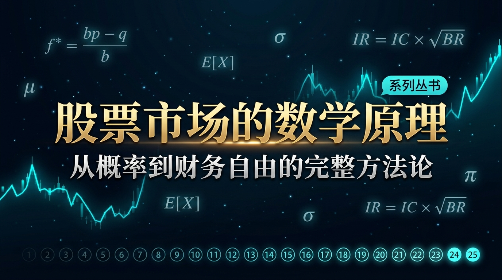

# 股票市场的数学原理
## 系列丛书 · 完整目录



> **系列定位**：用最通俗的语言、最形象的类比、最详实的案例，讲透每一个让顶尖投资者稳定盈利的数学原理。
> 
> **适合人群**：想用科学方法指导投资、实现财务自由的每一个人。
> 
> **完成后你会得到什么**：一套完整的、有数学支撑的投资决策框架。

---

## 📚 全系列目录（25篇）

### 第一模块：地基篇 — 概率与期望思维（必读）

| 篇号 | 标题 | 核心公式 | 核心问题 | 状态 |
|------|------|---------|---------|------|
| **第01篇** | **[凯利公式：仓位管理的黄金法则](./episodes/第01篇_凯利公式_仓位管理的黄金法则.md)** | $f^* = \frac{bp-q}{b}$ | 该押多少钱？ | ✅ 已发布 |
| **第02篇** | **[期望值理论：所有决策的基石](./episodes/第02篇_期望值理论_所有决策的基石.md)** | $E[X] = \sum p_i x_i$ | 这笔交易值得做吗？ | ✅ 已发布 |
| **第03篇** | **[大数定律：时间是你最好的朋友](./episodes/第03篇_大数定律_时间是你最好的朋友.md)** | $\bar{X}_n \to \mu$ | 为什么要坚持长期？ | ✅ 已发布 |
| **第04篇** | **[中心极限定理：分散投资的数学证明](./episodes/第04篇_中心极限定理_分散投资的数学证明.md)** | CLT | 鸡蛋为什么不能放一个篮子？ | ✅ 已发布 |
| **第05篇** | **[复利定律：财富的雪球效应](./episodes/第05篇_复利定律_财富的雪球效应.md)** | $A = P(1+r)^n$ | 时间+复利=财务自由？ | ✅ 已发布 |

---

### 第二模块：选机会篇 — 识别高概率交易

| 篇号 | 标题 | 核心公式 | 核心问题 | 状态 |
|------|------|---------|---------|------|
| **第06篇** | **[均值回归：市场的钟摆定律](./episodes/第06篇_均值回归_市场的钟摆定律.md)** | O-U 过程 | 什么时候逆向布局？ | ✅ 已发布 |
| **第07篇** | **[动量效应：顺势而为的数学依据](./episodes/第07篇_动量效应_顺势而为的数学依据.md)** | 截面动量因子 | 什么时候顺势追涨？ | ✅ 已发布 |
| **第08篇** | **[贝叶斯推断：实时更新你的判断](./episodes/第08篇_贝叶斯推断_实时更新你的判断.md)** | $P(A\|B) = \frac{P(B\|A)P(A)}{P(B)}$ | 新消息出现时该怎么调整？ | ✅ 已发布 |
| **第09篇** | **[安全边际：价值投资的概率护城河](./episodes/第09篇_安全边际_价值投资的概率护城河.md)** | 格雷厄姆公式 | 买多便宜才算便宜？ | ✅ 已发布 |
| **第10篇** | **[因子投资：系统性超越市场的秘密](./episodes/第10篇_因子投资_系统性超越市场的秘密.md)** | Fama-French 五因子 | 靠什么长期跑赢指数？ | ✅ 已发布 |

---

### 第三模块：配置篇 — 资产组合与仓位管理

| 篇号 | 标题 | 核心公式 | 核心问题 | 状态 |
|------|------|---------|---------|------|
| 第11篇 | [现代投资组合理论](episodes/第11篇_现代投资组合理论_有效前沿的边界.md) | $w^T \Sigma w$ | 鸡蛋怎么放最安全？ | ✅ 已发布 |
| 第12篇 | [夏普比率](episodes/第12篇_夏普比率_策略质量的标准尺.md) | $SR = \frac{R_p - R_f}{\sigma_p}$ | 我的策略到底好不好？ | ✅ 已发布 |
| 第13篇 | [风险平价策略](episodes/第13篇_风险平价策略_穿越经济周期的秘密.md) | $w_i \cdot \frac{\partial \sigma_p}{\partial w_i} = c$ | 为什么股债总是同跌？ | ✅ 已发布 |
| 第14篇 | [最优仓位管理 Optimal-f：凯利进阶版](episodes/第14篇_最优仓位管理_Optimal-f_凯利公式的工程级进化.md) | $f^* = \arg\max TWR(f)$ | 真实交易中仓位怎么算？ | ✅ 已发布 |
| 第14篇 | [最优仓位管理 Optimal-f：凯利进阶版](episodes/第14篇_最优仓位管理_Optimal-f_凯利公式的工程级进化.md) | $f^* = \arg\max TWR(f)$ | 真实交易中仓位怎么算？ | ✅ 已发布 |
| 第15篇 | [相关性与分散化：降低风险的数学奥秘](episodes/第15篇_相关性与分散化_降低风险的数学奥秘.md) | $\rho_{ij}$ 矩阵 | 哪些资产放一起效果最好？ | ✅ 已发布 |

---

## 🛡️ 第三模块：风控篇（第16-20篇）

> 知道怎么赚钱之后，更重要的是知道怎么不亏钱。本模块聚焦于"风险量化与极端情况下的生存法则"。

| 篇号 | 文章标题 | 核心公式 | 你将解决的问题 | 状态 |
|------|---------|---------|-------------|------|
|------|---------|---------|-------------|------|

---

### 第四模块：风控篇 — 黑天鹅与极端风险

| 篇号 | 标题 | 核心公式 | 核心问题 | 状态 |
|------|------|---------|---------|------|
| 第16篇 | 价值at风险（VaR）：最坏的情况有多坏？ | VaR 模型 | 极端情况我会损失多少？ | 🔲 待写 |
| 第17篇 | 黑天鹅理论：肥尾分布与反脆弱 | 幂律分布 | 小概率大灾难怎么防？ | 🔲 待写 |
| 第18篇 | 蒙特卡洛模拟：给未来跑一万次 | 随机模拟 | 未来有多少种可能？ | 🔲 待写 |
| 第19篇 | 破产风险定律：唯一不能触碰的红线 | 破产概率公式 | 怎样确保永远不被踢出游戏？ | 🔲 待写 |
| 第20篇 | 马尔可夫链：市场状态的转换规律 | 转移矩阵 | 牛熊转换有规律可循吗？ | 🔲 待写 |

---

### 第五模块：量化进阶篇 — 机构级别的数学武器

| 篇号 | 标题 | 核心公式 | 核心问题 | 状态 |
|------|------|---------|---------|------|
| 第21篇 | 主动管理基本定律：技能×次数=收益 | $IR = IC \times \sqrt{BR}$ | 频繁交易还是集中持股？ | 🔲 待写 |
| 第22篇 | 布莱克-舒尔斯：期权定价的奥秘 | B-S 方程 | 期权怎么用来对冲风险？ | 🔲 待写 |
| 第23篇 | 套利定价理论（APT）：多因子驱动模型 | APT 模型 | 哪些宏观因素影响收益？ | 🔲 待写 |
| 第24篇 | 行为金融学：战胜人类本能的偏误 | 前景理论 | 情绪如何系统性毁掉收益？ | 🔲 待写 |
| 第25篇 | 系列综合：构建你的个人投资数学框架 | 综合模型 | 如何把25个原理融为一体？ | 🔲 待写 |

---

## 🗺️ 学习路径推荐

```
新手路径（3个月掌握基础）：
01 → 02 → 03 → 05 → 06 → 09 → 11

进阶路径（6个月建立体系）：
01 → 02 → 03 → 04 → 06 → 07 → 10 → 11 → 12 → 13 → 19

量化路径（适合有编程基础者）：
01 → 02 → 08 → 10 → 14 → 16 → 18 → 21 → 22 → 25
```

---

## 🏆 系列核心信念

> 财务自由不是靠运气，而是靠**建立一个有统计优势的系统**，然后无数次重复执行。
> 
> 这25个数学原理，就是这套系统的完整蓝图。

---
*系列持续更新中 | 每篇均配有图解、案例与实战指南*
