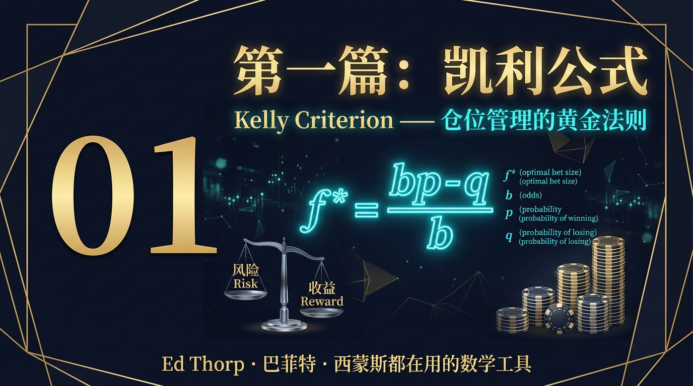
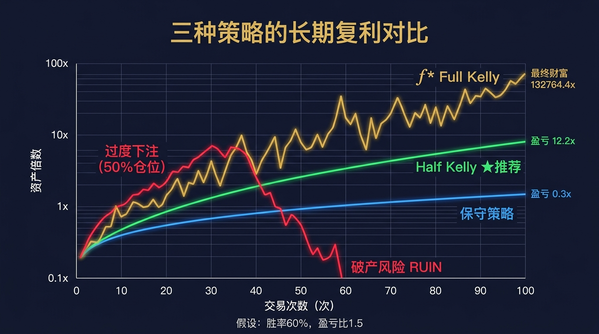
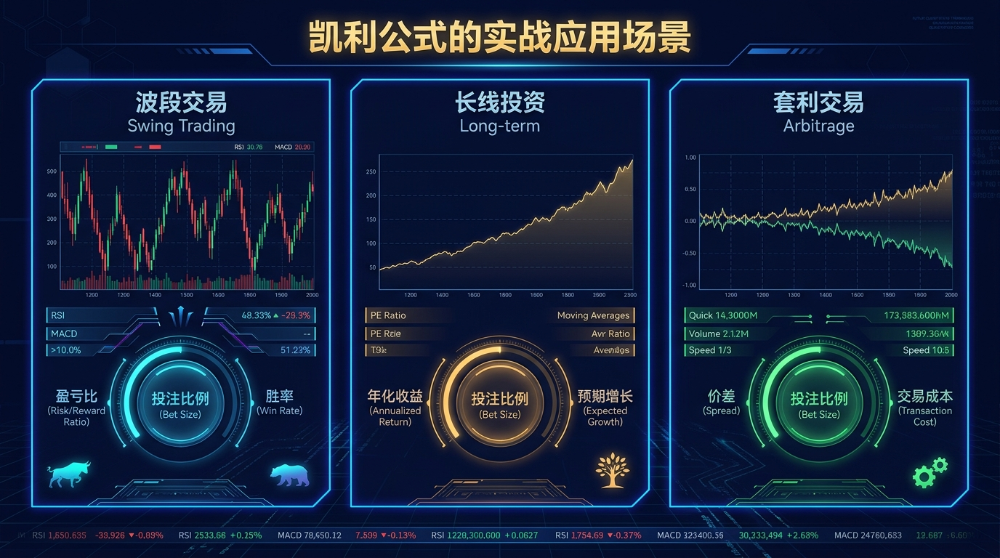
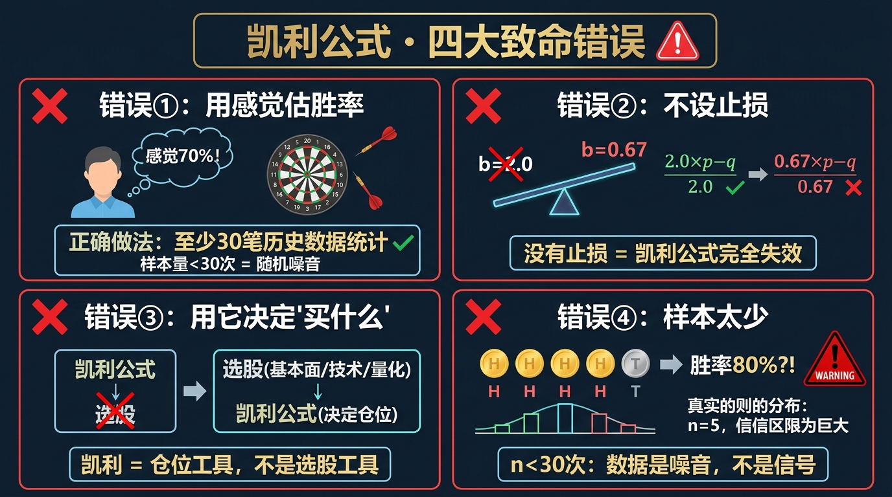
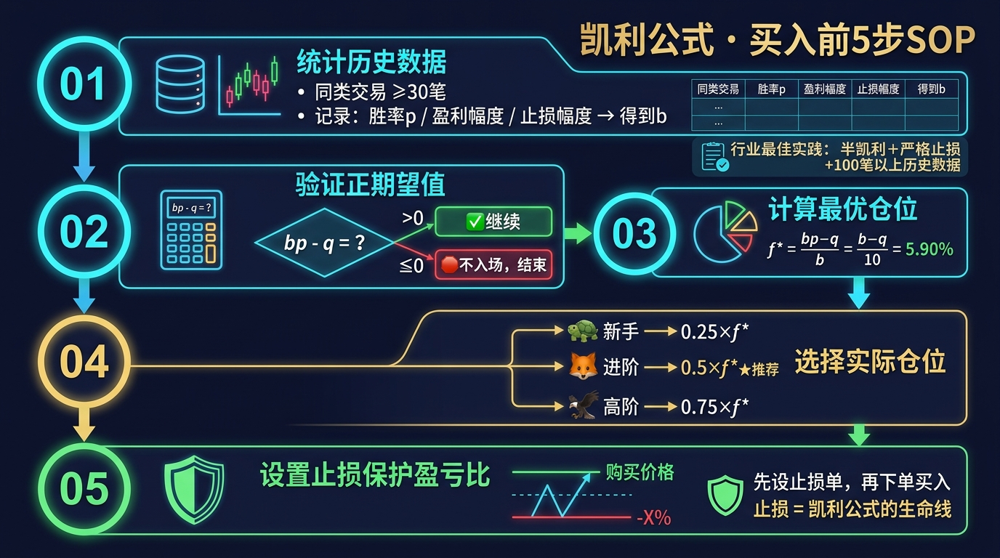

# 股票市场的数学原理 · 第01篇
# 凯利公式：仓位管理的黄金法则
### Kelly Criterion — The Golden Rule of Position Sizing

---

> **Ed Thorp · 巴菲特 · 西蒙斯都在用的数学工具**
> 
> 🕐 阅读时间：约25分钟 | 📊 难度：⭐⭐⭐ | 🎯 核心收获：彻底搞懂"该押多少钱"这个问题

---

## 📖 引言：最重要的问题从来不是"买什么"

散户亏损有两大原因——

**第一个原因**，很多人都知道：**选错了股票**（不会选）

**第二个原因**，大多数人没想到：**即使选对了股票，也因为仓位错误而亏钱**

你有没有经历过这样的事：
- 分析了很久，终于买入一只好股，但只买了1%，涨了30%却只赚了300块
- 凭感觉重仓买入另一只，结果跌了20%，几乎把利润全亏光

**这不是运气，这是数学问题。**

1956年，一位贝尔实验室的科学家，用数学给出了这个问题的完美答案。

---

## 一、起源：从电话线到华尔街的公式

### 🔬 发现故事

**1956年**，约翰·拉里·凯利（John L. Kelly Jr.）在贝尔实验室研究一个与投资完全无关的问题：**如何通过有噪音的电话线最优地传输信息？**

他推导出一个公式，用于计算"信息传输的最优速率"。他的同事克劳德·香农（信息论之父）看到后，立刻意识到：这个公式可以用于**赌博和投资！**

消息传到了**爱德华·索普（Ed Thorp）**——一位麻省理工的数学教授。他将这个公式用于21点赌博，1962年出版《击败庄家》（Beat the Dealer），成为第一个在赌场中**系统性稳定盈利**的人。

后来，他把凯利公式引入华尔街，管理的对冲基金**普林斯顿-纽波特伙伴**从1969年到1988年，19年间年化收益超过19%，**从未亏损一年**。

这就是凯利公式的传奇起点。

---

## 二、核心公式：用人话讲透每个符号

### 🧮 公式全貌

$$\boxed{f^* = \frac{bp - q}{b}}$$

看起来简单，但每个字母都有深刻含义：

| 符号 | 名称 | 在股票中的意思 | 举例 |
|------|------|-------------|------|
| $f^*$ | 最优仓位 | 应该用多少比例的钱 | $f^*=0.33$ → 用33%的资金 |
| $b$ | 盈亏比 | 赢了能得多少÷输了会失去多少 | 平均盈+15%，亏-10% → $b=1.5$ |
| $p$ | 胜率 | 这类交易赢的概率 | 历史60次赢→$p=0.6$ |
| $q$ | 败率 | 这类交易输的概率，$q=1-p$ | $q=1-0.6=0.4$ |

### 🎯 等价表达式

公式有多种写法，本质相同：

$$f^* = \frac{bp - q}{b} = p - \frac{q}{b} = \frac{p(b+1) - 1}{b}$$

**金融版本**（适用于连续收益场景）：

$$f^* = \frac{\mu - r_f}{\sigma^2}$$

其中 $\mu$ 是期望年化收益，$r_f$ 是无风险利率，$\sigma^2$ 是收益方差。

### 💡 公式的数学推导（选读）

凯利公式的推导出发点是**最大化对数期望财富增长**：

$$\max_f \; G(f) = E[\ln(W_{t+1}/W_t)]$$

在每次交易赢（概率$p$）或输（概率$q$）的情况下：

$$G(f) = p \cdot \ln(1 + bf) + q \cdot \ln(1 - f)$$

对 $f$ 求导，令 $G'(f) = 0$：

$$G'(f) = \frac{pb}{1+bf} - \frac{q}{1-f} = 0$$

解得：$f^* = \frac{pb - q}{b}$ ✓

**这意味着**：凯利公式是**在无限次重复交易中，使复利增长率最大化**的唯一最优解。

---

## 三、四大类比：彻底理解凯利公式的直觉

### 类比一：飞机的安全系数（理解为什么不能乱押）

飞机设计的最大承重是10吨，但航空公司规定最多装载7吨货物。

**为什么不装10吨？** 因为工程师知道：真实世界里总有误差、突发情况、材料疲劳……留出"安全余量"是理性的。

凯利公式也一样：计算出 $f^*=33\%$，但**实际押注33%就太冒险了**，因为你的胜率和盈亏比的估算本身就有误差。**半凯利（16.5%）就是投资者的安全系数。**

---

### 类比二：农民种地（理解为什么要持续重复）

一个农民手里有100粒种子。

- **方案A（过度投入）**：全部100粒种子只种在一块地，万一天旱，颗粒无收。
- **方案B（凯利思维）**：每块地种合适数量，根据土地肥沃程度分配种子。好地多种，差地少种。
- **关键原则**：永远留下足够的种子，确保下一季还能种地。

**这就是凯利公式的精髓**：不是孤注一掷，而是**按统计优势的大小分配资本，同时永远保留参与下一次游戏的能力。**

---

### 类比三：保险公司定价（理解期望值与大数定律）

保险公司怎么定价车险？

1. 统计：每1000个司机，平均有5人出险，每次赔付10万
2. 计算期望损失：$5 \times 10万 \div 1000 = 500元$/人
3. 定价：收取800元（包含利润和运营成本）

**凯利公式告诉保险公司每个险种"承保多少"**：期望值越正（赔率越优），承保越多；接近盈亏平衡的险种，承保最少。

**对你的意义**：每次买股票，你就是在给某个概率游戏"承保"。凯利公式告诉你，承保多少最优。

---

### 类比四：扑克高手（理解为什么胜率不够就不下注）

职业扑克高手的规则：

> "在计算到自己有明显的数学优势之前，**绝对不会大额下注**。哪怕牌面看起来不错。"

当 $f^* \leq 0$ 时（期望值为负），凯利公式的结论是：**不要下注。**

这对应股票投资的一个黄金原则：**没有统计优势的时候，持有现金本身就是最佳策略。**

---

## 四、实战全流程：以一个真实场景演示

### 🎬 场景设定

你是一位有5年A股投资经验的投资者，总资金 **100万元**。

你用了一套价值选股系统，历史回测结果：
- 回测样本：200笔交易
- 胜率：60次完全亏损，140次盈利 → **$p = 70\%$**
- 盈利时平均涨幅：**+20%**
- 亏损时平均跌幅：**-12%**（你设了止损）

今天，你的系统发出信号：建议买入某只A股。

**问：应该用多少仓位？**

---

### 📊 第一步：确认参数

$$b = \frac{20\%}{12\%} = 1.67 \quad p = 0.70 \quad q = 0.30$$

### 📊 第二步：验证是否有统计优势

$$\text{期望值} = bp - q = 1.67 \times 0.70 - 0.30 = 1.169 - 0.30 = 0.869 > 0 \; ✅$$

> 分子大于0，说明存在正期望值，值得入场。

### 📊 第三步：计算最优仓位

$$f^* = \frac{bp - q}{b} = \frac{0.869}{1.67} \approx 52\%$$

### 📊 第四步：选择实际仓位策略

| 策略 | 仓位 | 金额 | 适合人群 |
|------|------|------|---------|
| 全凯利 | 52% | 52万元 | 不建议任何人 |
| **半凯利（推荐）** | **26%** | **26万元** | **大多数投资者** |
| 四分之一凯利 | 13% | 13万元 | 保守型/新手 |
| 固定比例（参考） | 5% | 5万元 | 极度保守 |

> ✅ **决策**：该策略胜率高、盈亏比优，半凯利仓位26万是合理的。

### 📊 第五步：设置止损确保盈亏比不变形

$$\text{止损位} = \text{买入价} \times (1 - 12\%) = \text{买入价} \times 0.88$$

> ⚠️ 重要：如果不设止损，亏损可能远超12%，导致盈亏比崩溃，凯利公式失效。

---

## 五、著名使用者：这些人如何运用凯利公式

### 🎰 Ed Thorp：从赌场到华尔街

**赌场阶段（1960年代）**：
- 场景：拉斯维加斯21点赌桌
- 方法：通过算牌精确估算每一手牌的胜率 $p$，代入凯利公式决定每次下注额
- 结果：当胜率超过50%，下注；当胜率低于50%，最小注或离桌

> *"赌场里没人知道我在算什么，但我每次下大注时，胜率都经过了精确计算。"— Ed Thorp*

**华尔街阶段（1970-1988年）**：
- 将凯利公式用于权证定价套利（类Black-Scholes前身）
- 普林斯顿-纽波特伙伴：19年年化19%，**从未亏损一年**

---

### 📈 巴菲特：集中持股的凯利逻辑

巴菲特从不显式使用凯利公式，但他的投资逻辑完美对应凯利思想：

| 巴菲特的话 | 凯利公式的含义 |
|----------|-------------|
| "只在非常有把握时才下大赌注" | 只在 $p$ 足够高时，$f^*$ 才足够大 |
| "我宁愿用50%仓位买确定性高的股" | 确定性高 = $p$ 高 → 凯利仓位高 |
| "如果我只能买10只股票，我会非常谨慎" | 凯利公式：机会越少，每次仓位越精准 |

巴菲特持有可口可乐的高峰期仓位曾超过40%——这在凯利框架下是完全理性的，因为他对可口可乐的"胜率"判断极高。

---

### 🔢 詹姆斯·西蒙斯：量化版凯利

文艺复兴科技大奖章基金的核心，就是**凯利公式的工业化规模应用**：

- 每天识别数千个微弱的统计优势（IC极低，但BR极高）
- 用数学精确计算每个机会的期望值
- 用凯利比例分配资金
- 年化66%，持续30年——人类投资史上最强业绩

西蒙斯的名言：
> *"我们不是靠预测未来赚钱，而是靠找到无数个微小的、有统计优势的赌注，然后用数学决定押多少。"*

---

## 六、长期复利对比：数字说明一切

### 📉 关键发现：过度下注比不下注更危险！

图表展示了四种策略在100次交易中的资产变化（假设胜率60%，盈亏比1.5）：

| 策略 | 100次后资产 | 最大回撤 | 心理可承受性 |
|------|-----------|---------|-----------|
| 过度下注（50%仓位） | **接近破产** | -85%+ | ❌ 崩溃 |
| 全凯利（33%仓位） | **极高，但波动剧烈** | -60% | ⚠️ 极难坚持 |
| 半凯利（16.5%）★ | **稳定增长** | -25% | ✅ 可以接受 |
| 固定2%仓位 | 温和增长 | -10% | ✅✅ 轻松 |

**核心洞见**：
1. **过度下注 > 不下注的危害** — 即使每次都有优势，押注50%仍会破产
2. **半凯利是黄金平衡点** — 保留75%的理论最优收益，同时将波动降低50%
3. **心理因素不可忽视** — 回撤60%的策略，99%的人会在底部割肉，使策略彻底失效

---

## 七、六大实战使用场景

### 场景一：价值投资者的集中持股

**问题**：你分析了一只被市场低估的消费股，该买多少？

**凯利计算**：
- 历史同类机会胜率 $p = 65\%$
- 历史平均上涨20%，止损8% → $b = 20/8 = 2.5$
- $f^* = (2.5 \times 0.65 - 0.35) / 2.5 = 1.275/2.5 = 51\%$
- **半凯利仓位：25.5%**

**结论**：可以用约25%的资金买入，这是有数学依据的重仓。

---

### 场景二：量化策略的仓位配置

**问题**：你的量化策略每月产生10个买入信号，历史胜率55%，平均盈2%亏1%。

**凯利计算**：
- $b = 2\%, q = 1\% → b = 2.0$
- $f^* = (2.0 \times 0.55 - 0.45) / 2.0 = 0.65/2 = 32.5\%$
- **但有10个信号同时出现！**

**解决方案**：将总仓位上限设为半凯利（16%），然后平均分配给每个信号：$16\% \div 10 = 1.6\%$ 每只。

---

### 场景三：波段交易的快进快出

**问题**：你做技术分析短线，胜率只有45%，但盈亏比4:1（止盈40%，止损10%）。

**凯利计算**：
- $b = 4.0, p = 0.45, q = 0.55$
- $f^* = (4.0 \times 0.45 - 0.55) / 4.0 = (1.8 - 0.55) / 4 = 31.25\%$
- 期望值 $= 4 \times 0.45 - 0.55 = 1.25 > 0$ ✅

**结论**：即使胜率只有45%，只要盈亏比够高，仍然存在统计优势。半凯利约15%。

---

### 场景四：ETF定投的应用

**问题**：指数ETF长期期望值已知（年化约10%），该如何配置？

**简化版本**：对于长期持有的指数ETF，由于不确定性极高，建议用**"固定比例"策略**（如每月固定金额定投），这等效于极度保守的凯利仓位，同时利用大数定律在时间维度上摊平成本。

**仓位原则**：生活必要开销以外的闲置资金的 60-80%，可长期持有ETF。

---

### 场景五：多策略并行的仓位分配

**问题**：你同时跑3个独立策略，分别计算得出 $f_1^*=30\%$，$f_2^*=20\%$，$f_3^*=40\%$。

**注意事项**：三个策略的仓位相加不能超过100%（否则需要杠杆）。

**解决方案**：
1. 先各取半凯利：15%，10%，20% → 合计45%
2. 剩余55%保持现金或配置无风险资产
3. 根据策略之间的相关性适当调整

---

### 场景六：何时放弃凯利策略

如果以下情况发生，**暂停使用凯利公式**：

| 情况 | 原因 | 行动 |
|------|------|------|
| 市场极端异常（熔断/崩盘） | 历史参数完全失效 | 降至最小仓位或离场 |
| 连续亏损超过30% | 参数可能已偏差 | 重新回测，更新参数 |
| 策略已跑超2年未更新 | 市场环境变化 | 重新验证有效性 |
| 情绪极度紧张 | 无法冷静执行 | 降低仓位到舒适范围 |

---

## 八、常见错误与误区

| # | 错误 | 核心症状 | 后果 | 正确做法 |
|---|------|---------|------|--------|
| ① | 用感觉估胜率 | "我觉得涨的概率70%" | 参数失真，仓位严重偏离最优 | ≥30笔同类历史交易统计 |
| ② | 不设止损 | 亏损从-10%扩大到-30% | 盈亏比 $b$ 崩溃，期望值转负 | 买入时必须同步下止损单 |
| ③ | 用来决定"买什么" | 高仓位=看好=买入信号 | 混淆选股与仓位管理逻辑 | 先选股，再用凯利算仓位 |
| ④ | 样本量不足 | 5笔4赢→"胜率80%！" | 随机噪音当信号，仓位虚高 | n<30时禁止使用，$p$ 保守估50% |

---

## 九、凯利公式的局限性（诚实的评估）

凯利公式虽然数学上完美，但在实际市场中有以下局限：

| 局限性 | 具体表现 | 解决方案 |
|-------|---------|---------|
| 参数估算不准 | 胜率和盈亏比是预估值，有误差 | 使用保守估计 + 半凯利 |
| 假设独立性 | 公式假设每次交易相互独立 | 避免在同类股票大量集中押注 |
| 假设正态分布 | 市场有肥尾，黑天鹅比预期频繁 | 永远为极端情况保留备用资金 |
| 忽略交易成本 | 高频使用需要扣除手续费影响 | 将交易成本纳入期望值计算 |
| 心理承受上限 | 全凯利的波动超出人类心理极限 | 半凯利或四分之一凯利 |

---

## 十、实战SOP：5步骤快速使用凯利公式

> **行业最佳实践（Ed Thorp · 文艺复兴科技 共同验证）**：半凯利仓位 + 严格止损 + ≥100笔历史数据 = 凯利公式发挥最大价值的三要素。

---

## 十一、本篇总结

凯利公式给我们的核心礼物，不是一个精确计算器，而是一种**思维方式的升级**：

| 升级前的思维 | 升级后的思维（凯利思维） |
|------------|---------------------|
| 感觉好就重仓，感觉差就轻仓 | 根据统计优势的大小精确分配仓位 |
| 赚了就后悔买少了，亏了就后悔买多了 | 用数学决定仓位，结果好坏都是概率的正常结果 |
| 追求每笔交易的成功 | 追求系统的长期期望值 |
| 单次结果决定信心 | 大数定律终将给出正确答案 |

$$\boxed{\text{最优仓位} = \text{统计优势有多大} \times \text{参数不确定性的校正系数}}$$

---

如果你已经懂了凯利公式如何帮你避免一次性破产，你必然会问：在每次下注前，我怎么知道盈亏比是否划算？下一篇，我们将进入所有决策的基石——期望值理论。

## 🔗 完整系列导航

点击展开查看全系列 25 篇文章目录

### 🧱 第一模块：地基篇 — 概率与期望思维
- [第01篇：凯利公式_仓位管理的黄金法则](./第01篇_凯利公式_仓位管理的黄金法则.md)
- [第02篇：期望值理论_所有决策的基石](./第02篇_期望值理论_所有决策的基石.md)
- [第03篇：大数定律_时间是你最好的朋友](./第03篇_大数定律_时间是你最好的朋友.md)
- [第04篇：中心极限定理_分散投资的数学证明](./第04篇_中心极限定理_分散投资的数学证明.md)
- [第05篇：复利定律_财富的雪球效应](./第05篇_复利定律_财富的雪球效应.md)

### 🔭 第二模块：选机会篇 — 识别高概率交易
- [第06篇：均值回归_市场的钟摆定律](./第06篇_均值回归_市场的钟摆定律.md)
- [第07篇：动量效应_顺势而为的数学依据](./第07篇_动量效应_顺势而为的数学依据.md)
- [第08篇：贝叶斯推断_实时更新你的判断](./第08篇_贝叶斯推断_实时更新你的判断.md)
- [第09篇：安全边际_价值投资的概率护城河](./第09篇_安全边际_价值投资的概率护城河.md)
- [第10篇：因子投资_系统性超越市场的秘密](./第10篇_因子投资_系统性超越市场的秘密.md)

### ⚖️ 第三模块：配置篇 — 资产组合与仓位管理
- [第11篇：现代投资组合理论_有效前沿的边界](./第11篇_现代投资组合理论_有效前沿的边界.md)
- [第12篇：夏普比率_策略质量的标准尺](./第12篇_夏普比率_策略质量的标准尺.md)
- [第13篇：风险平价策略_穿越经济周期的秘密](./第13篇_风险平价策略_穿越经济周期的秘密.md)
- [第14篇：最优仓位管理_Optimal-f_凯利公式的工程级进化](./第14篇_最优仓位管理_Optimal-f_凯利公式的工程级进化.md)
- [第15篇：相关性与分散化_降低风险的数学奥秘](./第15篇_相关性与分散化_降低风险的数学奥秘.md)

### 🛡️ 第四模块：风控篇 — 极端状态下的生死局
- [第16篇：VaR风险价值_如何量化你能承受的最大亏损](./第16篇_VaR风险价值_如何量化你能承受的最大亏损.md)
- [第17篇：黑天鹅事件_极端风险的数学本质](./第17篇_黑天鹅事件_极端风险的数学本质.md)
- [第18篇：蒙特卡洛模拟_用随机数预测未来](./第18篇_蒙特卡洛模拟_用随机数预测未来.md)
- [第19篇：破产风险_赌徒破产问题与资金管理](./第19篇_破产风险_赌徒破产问题与资金管理.md)
- [第20篇：最大回撤与资金恢复时间_衡量策略韧性](./第20篇_最大回撤与资金恢复时间_衡量策略韧性.md)

### 🔬 第五模块：量化进阶篇 — 升华与融合
- [第21篇：主动管理定律_信息比率与预测宽度的乘积](./第21篇_主动管理定律_信息比率与预测宽度的乘积.md)
- [第22篇：B-S期权定价模型_金融工程的皇冠](./第22篇_B-S期权定价模型_金融工程的皇冠.md)
- [第23篇：行为金融学数学化_前景理论与损失厌恶](./第23篇_行为金融学数学化_前景理论与损失厌恶.md)
- [第24篇：投资组合理论大融合_打造你的全天候财富机器](./第24篇_投资组合理论大融合_打造你的全天候财富机器.md)
- [第25篇：终章_数学的尽头是哲学_概率的尽头是人生](./第25篇_终章_数学的尽头是哲学_概率的尽头是人生.md)

---
**→ 下一篇：[期望值理论](./第02篇_期望值理论_所有决策的基石.md)**

---
*《股票市场的数学原理》全系列 · 第01篇*
