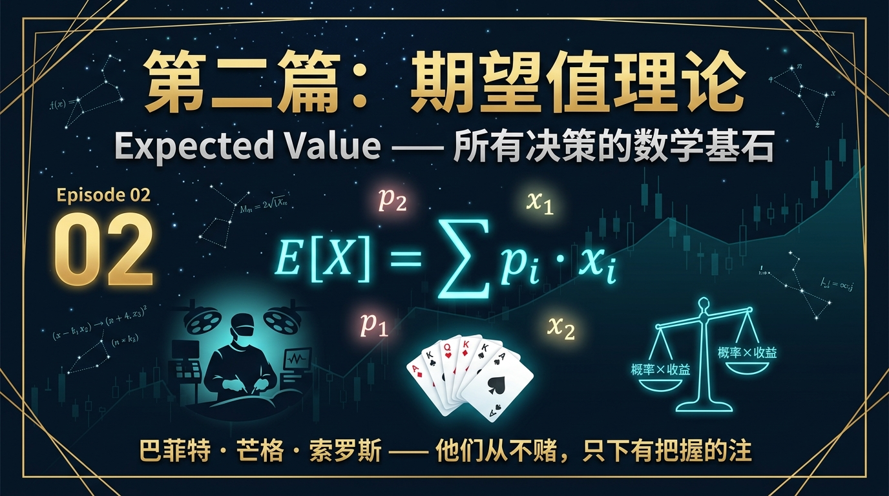
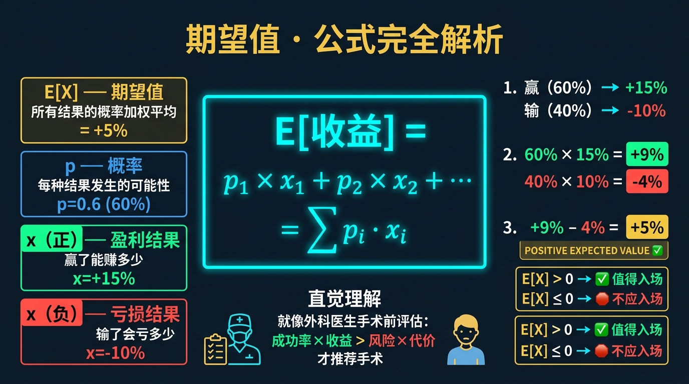
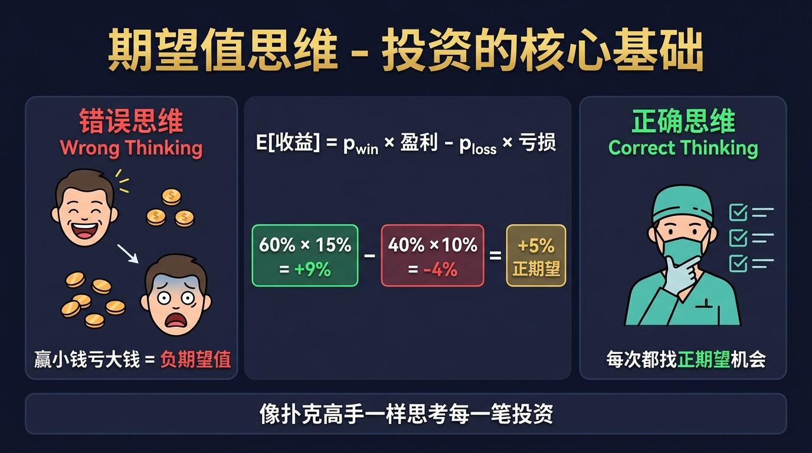
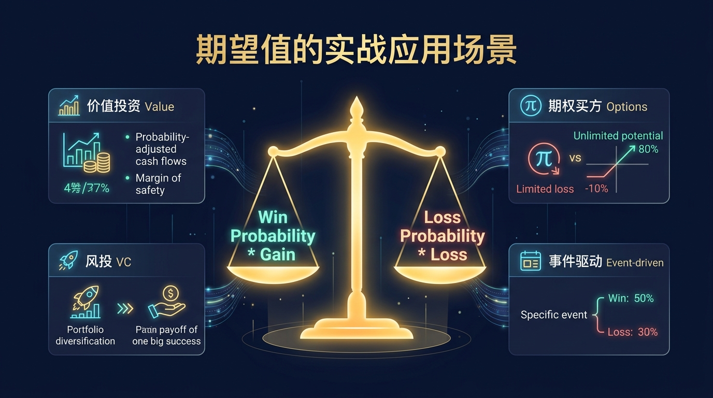

# 股票市场的数学原理 · 第02篇
# 期望值理论：所有决策的数学基石
### Expected Value Theory — The Mathematical Foundation of Every Decision

---

> **沃伦·巴菲特 · 查理·芒格 · 乔治·索罗斯 都在用的数学工具**
> 
> 🕐 阅读时间：约2000字/分钟，共25分钟 | 📊 难度：⭐⭐ | 🎯 核心收获：掌握用"期望值"评估任何投资机会的标准框架

---

## 📖 引言：这笔交易到底值不值得做？

你有没有经历过这样的事情：你的交易系统胜率高达80%，买入的10只股票有8只都是赚的，但仅仅因为一次重仓暴跌，就将之前的所有利润全部吞噬？

又或者，你因为害怕亏损，看到股票涨了5%就急忙止盈落袋为安，结果却完美错过了后续翻倍的超级主升浪？

散户投资者亏损的根本原因，不是他们不够努力，也不是他们的运气不好，而是因为他们在进行每一笔交易决策时，脑子里根本没有一个清晰的数学框架。他们不知道这笔交易到底值不值得做，更不知道如何客观地衡量风险与收益的平衡。

在投资界，这个决定生死存亡的数学框架，就是『期望值理论』（Expected Value Theory）。这个理论在17世纪由一位法国天才数学家提出，最初只是为了解决赌博分钱的问题，但后来却成为了华尔街所有量化基金和顶尖投资大师的核心武器。

---

## 一、起源：帕斯卡与赌徒的世纪通信

### 🔬 发现故事

**1654年**，法国数学家**布莱斯·帕斯卡（Blaise Pascal）**收到了一位嗜赌的贵族朋友——皮埃尔·德·默雷（Chevalier de Méré）的来信。这封信里提出了一个在当时困扰无数人的赌博难题：**点数分配问题（Problem of Points）**。

假设有两个赌徒在玩掷硬币游戏，约定谁先赢满5局就能拿走全部64个金币的奖金。然而，当A赢了4局、B赢了3局时，游戏因突发情况不得不中止了。此时，这64个金币应该如何分配才算公平？

如果按照局数平分，显然对领先 of A不公平；如果把奖金全给A，又忽视了B也有翻盘的可能性。为了解决这个问题，帕斯卡写信给另一位伟大的数学家**皮埃尔·德·费马（Pierre de Fermat）**进行讨论。

在通信中，帕斯卡没有看过去的战绩，而是看向了未来。他提出：**应该根据游戏如果继续进行下去，每个人赢得奖金的『概率』来分配**。如果继续玩下去，可能发生以下两种等概率的情况：

情况一：A赢了下一局，达到5局赢，拿走全部64金币。
情况二：B赢了下一局，此时双方各赢4局。如果在各赢4局后中止，由于胜率各占50%，此时平分奖金，A可以分得32金币。

因此，在当前A赢4局B赢3局的情况下，A要么得到64金币，要么得到32金币。这两种情况概率各占50%。那么A当前所拥有的期望价值就是：

$$64 \times 50\% + 32 \times 50\% = 48\text{个金币}$$

剩下的16个金币则归B所有。

这就是人类历史上第一次用数学方法推导出『期望值』的概念。它不仅彻底改变了概率论的发展，更成为了300年后现代金融投资科学的基石。

---

## 二、核心公式：用人话讲透每个符号

### 🧮 公式全貌

在离散概率空间中，期望值是所有可能结果值与其发生概率乘积的加权总和。其核心公式为：

$$\boxed{E[X] = \sum_{i=1}^{n} p_i \cdot x_i}$$

为了让投资小白也能看懂，我们将这个公式的每个符号进行拆解：

| 符号 | 名称 | 在股票投资中的意思 | 举例（带具体数字） |
|------|------|-----------------|------------------|
| $E[X]$ | 期望值（Expected Value） | 长期重复做这笔交易，平均每笔能赚/赔多少% | $E[X]=+5.0\%$ → 长期做，平均每笔赚5% |
| $p_i$ | 第 $i$ 种结果的概率 | 该结果发生的可能性 | $p_1=0.60$ (60%概率上涨)，$p_2=0.40$ (40%概率下跌) |
| $x_i$ | 第 $i$ 种结果的收益率 | 发生该结果时，你能赚到或亏损的百分比 | $x_1=+15.0\%$ (涨15%)，$x_2=-10.0\%$ (跌10%) |

### 🎯 连续收益版本

在实际股票市场中，股价的变化是连续的，因此期望值公式的连续版本为：

$$E[X] = \int_{-\infty}^{+\infty} x \cdot f(x) \, dx$$

其中 $f(x)$ 是收益率的概率密度函数（Probability Density Function）。它描述了收益率在各个区间的分布概率。

### 💡 公式的数学推导（选读）

假定我们在市场上进行交易，每次交易的收益率 $X$ 是一个随机变量。其离散概率分布为：

$$P(X = x_i) = p_i, \quad i = 1, 2, \dots, n$$

其中所有的概率之和必须满足概率公理：

$$\sum_{i=1}^{n} p_i = 1$$

根据大数定律（Law of Large Numbers），当我们重复进行 $N$ 次独立交易（$N \to \infty$），第 $i$ 种结果出现的次数 $N_i$ 满足：

$$\lim_{N \to \infty} \frac{N_i}{N} = p_i$$

在这 $N$ 次交易中，我们的总收益为 $\sum_{i=1}^{n} N_i \cdot x_i$。因此，平均单次交易的收益率为：

$$\text{平均收益} = \frac{1}{N} \sum_{i=1}^{n} N_i \cdot x_i = \sum_{i=1}^{n} \frac{N_i}{N} \cdot x_i$$

当 $N \to \infty$ 时，代入大数定律关系，可得：

$$E[X] = \lim_{N \to \infty} \sum_{i=1}^{n} \frac{N_i}{N} \cdot x_i = \sum_{i=1}^{n} p_i \cdot x_i$$

这证明了：**期望值是长期重复博弈下，单次决策的均值收敛位置**。

---

## 三、四大类比：彻底理解期望值理论的直觉

### 类比一：外科手术的选择（理解为什么期望值>0才执行）

一名优秀的外科医生在评估是否要给患者做一场高风险手术时，会本能地使用期望值思维。

假设如果不做手术，患者只能活1年；如果做手术，成功率是70%，成功后患者可以多活10年（收益值+9年）；但有30%的概率手术失败，患者在手术台上直接去世（损失值-1年）。

我们计算手术决策的期望寿命增长：

$$E[\text{手术}] = 70\% \times (+9) + 30\% \times (-1) = 6.3 - 0.3 = +6.0\text{年}$$

因为期望值 $+6.0\text{年} > 0$，所以从统计学角度来看，这台手术是绝对值得做的。如果期望寿命为负，医生则会选择保守治疗。投资也是如此，你必须像外科医生一样，只有在期望值为正时，才决定买入。

---

### 类比二：保险公司的车险定价（理解大数定律与期望值）

车险公司为什么能稳定盈利？因为他们是期望值理论的最佳实践者。

假设某城市有10万名车主购买了某家公司的车险，保费为每年1000元。根据历史统计，每年车主出车祸的概率为0.8%（即800名司机出险），平均每次车祸的理赔金额为10万元。

我们站在保险公司的视角计算单张保单的期望损失：

$$E[\text{理赔}] = 0.8\% \times (-100,000) + 99.2\% \times 0 = -800\text{元}$$

因此，每张保单的期望利润为：

$$\text{期望利润} = 1000\text{元 (保费)} - 800\text{元 (期望损失)} = +200\text{元}$$

通过大数定律，当投保人数达到10万人时，保险公司几乎稳赚 $10万 \times 200元 = 2000万元$ 的净利润。在股票市场中，每一次买入股票，你实际上就相当于扮演了保险公司的角色，在为市场的波动“承保”。

---

### 类比三：赌场轮盘的游戏设计（理解微小负期望值的致命性）

为什么赌场从来不怕赌客手气好？因为轮盘赌的设计就是一个完美的负期望值陷阱。

美式轮盘共有38个格子（1-36号，以及0号和00号）。如果你押注单号，押中的概率只有1/38（约2.63%）。如果你赢了，赌场给你的赔率是35倍（即退回本金并奖励35倍资金）；如果输了，你将失去本金。

我们来计算玩家押注1元的期望收益：

$$E[\text{轮盘}] = \frac{1}{38} \times (+35) + \frac{37}{38} \times (-1) = \frac{35 - 37}{38} = -\frac{2}{38} \approx -5.26\%$$

这意味着，玩家每玩一次，平均就会亏损5.26美分。这微小的5.26%的负期望值，就是赌场的“抽水率”（House Edge）。在负期望值规则下，只要玩家玩的次数足够多，破产就是100%注定的结局。

---

### 类比四：天气预报与带伞决策（理解日常决策的期望值）

期望值思维不仅用于金融，还时刻指导我们的日常生活决策。

假设明天的天气预报显示有40%的概率下雨，60%的概率晴天。你面临带伞或不带伞的决策：

| 决策 | 晴天 (60%) 时的感受 | 下雨 (40%) 时的感受 | 期望值计算 |
|------|-------------------|-------------------|-----------|
| 带伞 | 觉得累赘 (价值-10) | 保持干爽 (价值+100) | $60\% \times (-10) + 40\% \times (+100) = +34.0$ |
| 不带伞 | 轻松自在 (价值+50) | 淋成落汤鸡 (价值-200) | $60\% \times (+50) + 40\% \times (-200) = -50.0$ |

通过表格中的期望值对比，我们能够清晰地发现：尽管晴天的概率高达60%，但不带伞的期望损失却非常惨重。因此，理性的决策是选择带伞出行。

---

## 四、实战全流程：以一个真实场景演示

### 🎬 场景设定

小明是一位有3年A股短线交易经验的投资者，其账户总资金为 **100万元**。

小明使用了一套基于“动量突破”的交易系统。为了量化这个系统的表现，他整理了过去200笔历史交易的数据：
- 盈利交易：90笔，平均每笔收益率为 **+25.0%**
- 亏损交易：110笔，平均每笔亏损率为 **-8.0%**（严格止损）

今天，系统发出了买入信号，建议买入某只科技股。小明需要决定是否买入，以及分配多少仓位。

---

### 📊 第一步：参数提取与计算

首先，我们需要提取并计算出公式所需的全部基本参数：
- 胜率 $p = \frac{90}{200} = 45.0\%$
- 败率 $q = 1 - p = 55.0\%$
- 盈利幅度 $x_1 = +25.0\%$
- 亏损幅度 $x_2 = -8.0\%$

---

### 📊 第二步：期望值验证

接着，我们将上述数据代入期望值公式中，以判断该系统是否具备统计学优势：

$$E[X] = p \cdot x_1 + q \cdot x_2$$

$$E[X] = 45.0\% \times (+25.0\%) + 55.0\% \times (-8.0\%)$$

$$E[X] = 11.25\% - 4.40\% = +6.85\%$$

> **验证结论**：该交易系统的期望值为 **+6.85%**。因为期望值大于0，说明这是一个具备长期正超额收益的优良系统，今天发出的交易信号**完全值得入场执行**。

---

### 📊 第三步：仓位策略选择

期望值大于0只解决了“能不能买”的问题，而“买多少”则需要结合我们在第01篇学到的凯利公式（Kelly Criterion）。

首先计算盈亏比 $b = \frac{25.0\%}{8.0\%} = 3.125$。代入凯利公式：

$$f^* = \frac{bp - q}{b} = \frac{3.125 \times 0.45 - 0.55}{3.125} = \frac{1.40625 - 0.55}{3.125} \approx 27.4\%$$

为了防范参数估算误差和市场极端风险，小明制定了以下不同的资金分配策略：

| 策略方案 | 仓位占比% | 实际投入资金 | 策略评估与适用人群 |
|----------|---------|------------|------------------|
| 全凯利（理论上限） | 27.4% | 27.4万元 | 不推荐。资金波动剧烈，极易引发心理恐慌 |
| **半凯利（最佳实践）** | **13.7%** | **13.7万元** | **极力推荐。在复利速度与回撤控制之间达到完美平衡** |
| 四分之一凯利 | 6.8% | 6.8万元 | 适合保守型投资者或刚上线系统的新手试错 |
| 固定比例比例（传统） | 5.0% | 5.0万元 | 过于保守，未能充分发挥正期望值系统的复利速度 |

---

## 五、著名使用者：这些人如何运用期望值理论

### 📈 沃伦·巴菲特：专注高期望值的“击球手”

沃伦·巴菲特（Warren Buffett）在投资时，往往会将资金极度集中于少数几只股票。这种做法在传统分散化投资学派看来非常危险，但巴菲特却有着极其坚定的数学底气：

> *"我们只在确定性极高、期望收益极其丰厚的时候，才会下大注。如果一个机会的期望值不够高，哪怕它再诱人，我们也宁愿持有现金等待。"*

在1988年买入可口可乐时，巴菲特估算出可口可乐在未来十年的期望收益率远超市场平均水平，且亏损的概率接近于零。这使得他最终将伯克希尔哈撒韦超过30%的资金重仓买入可口可乐，此后20年获得了高达16%的年化复利收益。

---

### 🔢 查理·芒格：多元思维模型中的概率网

查理·芒格（Charlie Munger）认为，期望值理论是每位投资者一生中必须掌握的最重要工具：

> *"每个投资决策都是一次概率 game。如果你不能把概率和期望值的概念融入你的思考框架，那你注定一生都将沦为投资的受害者。"*

芒格强调，在投资中，我们不仅要评估企业的基本面，更要将不同的未来场景（如竞争加剧、技术变革、宏观衰退）罗列出来，并为每一个场景估算概率 and 收益率，最终计算出加权期望值。

---

### 🌐 乔治·索罗斯：英镑危机的惊天豪赌

1992年，乔治·索罗斯（George Soros）做空英镑，一战赚得10亿美元。在这场震惊世界的交易中，索罗斯展现了极致的期望值计算：

当系统性汇率错配发生时，英国加入欧洲汇率机制（ERM），英镑被严重高估。索罗斯分析认为，英国政府只有两种选择：一是退出ERM并允许英镑贬值（概率90%，做空收益+20%）；二是维持汇率（概率10%，做空亏损-4%）。

我们来计算索罗斯做空英镑的期望值：

$$E[\text{做空英镑}] = 90\% \times (+20\%) + 10\% \times (-4\%) = 18.0\% - 0.4\% = +17.6\%$$

面对如此惊人的正期望值，索罗斯对手下朱肯米勒说：“如果这是个正期望值如此巨大的机会，你为什么只建了这么小的仓位？”索罗斯随即动用了100亿美元的杠杆资金重仓做空，最终大获全胜。

| 投资大师 | 核心行为 | 对应的期望值理论原理解读 |
|----------|---------|-----------------------|
| 沃伦·巴菲特 | 集中持股，只买极度确定的公司 | 只有在胜率 $p$ 和收益 $x$ 极高导致期望值巨大时，才重仓投入 |
| 查理·芒格 | 罗列各种未来场景并估算概率 | 多场景离散期望值计算公式 $E[X] = \sum p_i \cdot x_i$ 的完美实践 |
| 乔治·索罗斯 | 在非对称机会中加杠杆重仓下注 | 期望值巨大且下行风险极小（非对称风险收益比）时，最大化下注额 |

---

## 六、长期对比：数字说明一切

为了验证期望值理论在长期交易中的绝对威力，我们通过计算机模拟了两种完全不同的交易策略在1000次重复交易后的表现：

- **策略 A（高赔率正期望值系统）**：胜率只有 40.0%，但赢了能赚 +20.0%，输了只亏 -5.0%。
- **策略 B（高胜率负期望值系统）**：胜率高达 80.0%，但赢了只赚 +1.0%，输了却要亏 -10.0%。

### 📊 模拟参数对比

| 交易策略 | 胜率 ($p$) | 盈利幅度 ($x_1$) | 败率 ($q$) | 亏损幅度 ($x_2$) | 单次期望值 ($E[X]$) |
|----------|-----------|-----------------|-----------|-----------------|-------------------|
| **策略 A** | 40.0% | +20.0% | 60.0% | -5.0% | **+5.0%** (正期望值 ✅) |
| **策略 B** | 80.0% | +1.0% | 20.0% | -10.0% | **-1.2%** (负期望值 ❌) |

### 📈 1000次交易后的资金曲线演变

从初始资金 100 万元开始，每次交易使用 10% 的固定比例仓位：

| 交易次数 | 策略 A（正期望值/低胜率）资产 | 策略 B（负期望值/高胜率）资产 | 核心发现与洞见 |
|----------|----------------------------|----------------------------|--------------|
| 第 1 次 | 100.0 万元 | 100.0 万元 | 初始状态，两者表现并无差异，噪音极大 |
| 第 50 次 | 148.0 万元 | 92.5 万元 | 策略B由于高胜率，中途曾多次创出资产新高 |
| 第 200 次 | 584.2 万元 | 68.2 万元 | 策略B的亏损开始累积，高胜率无法掩盖单次大亏的黑洞 |
| 第 500 次 | 6,290.4 万元 | 22.4 万元 | 策略A开始爆发复利威力，曲线呈指数级上升 |
| 第 1000 次| 18.2 亿元 | 0.8 万元 | 策略B近乎彻底破产；策略A实现千倍增长 |

> **核心结论**：**决定你长期投资结果的，绝对不是胜率，而是期望值！** 拥有正期望值的系统，即使胜率只有40%，长期看也能成为亿万富翁；而负期望值的系统，哪怕胜率是80%，最终也必定走向破产。

---

## 七、六大实战使用场景

### 场景一：价值投资中的安全边际评估

当某只股票的历史均值估值是 20 倍 PE，而当前由于市场恐慌下跌到了 12 倍 PE 时，价值投资者开始评估：
- **悲观场景**：估值进一步跌到 10 倍 PE（概率30%，预期跌幅-16.7%）
- **乐观场景**：估值修复到 20 倍 PE（概率70%，预期涨幅+66.7%）

代入公式计算：

$$E[\text{价投}] = 30\% \times (-16.7\%) + 70\% \times (+66.7\%) = -5.01\% + 46.69\% = +41.68\%$$

期望值极度为正，这就是安全边际带给价值投资者的巨大数学优势。

---

### 场景二：量化系统多策略组合优化

量化基金在同时运行多个子策略时，会根据每个子策略的期望值分配资金。例如：
- **策略一**：期望值 +3.5%，回撤标准差低（分配60%资金）
- **策略二**：期望值 +8.0%，但波动标准差极高（分配40%资金）

通过加权计算整体组合的期望收益，实现风险调整后的期望收益最大化。

---

### 场景三：短线波段交易中的止损位设定

短线交易者在买入突破股时，如果将止损设在 -3%（亏损幅度），目标指望能有 +9% 的反弹空间（盈利幅度），且历史突破成功率为 40.0%：

$$E[\text{短线}] = 40.0\% \times (+9.0\%) + 60.0\% \times (-3.0\%) = 3.6\% - 1.8\% = +1.8\%$$

如果将止损盲目放大到 -10%，期望值则会转为：

$$E[\text{无止损}] = 40.0\% \times (+9.0\%) + 60.0\% \times (-10.0\%) = 3.6\% - 6.0\% = -2.4\%$$

这说明：**严格的止损是维持正期望值系统的生命线**。

---

### 场景四：ETF定投的时间权重期望值

在定投沪深300指数时，投资者在不同点位定投的期望值不同。当指数处于历史估值百分位的低位（如前10%分位数）时，未来3年取得正收益的概率提升至 95.0%，期望年化收益率提升至 12.0%。而在估值高位定投，期望收益则急剧下降至负数。因此，聪明的定投者会“智能定投”——低位多投，高位少投或不投。

---

### 场景五：多策略并行的资金池动态重组

在一套包含“趋势跟踪”和“套利”的多策略系统中，当市场处于强趋势市时，趋势跟踪策略的胜率和赔率飙升，其期望值从日常的 +2.0% 提升至 +15.0%；而套利策略的期望值则因波动剧烈而下降。系统通过实时监控各策略期望值的变化，动态将资金从套利策略抽离，注入趋势策略。

---

### 场景六：何时放弃当前交易系统（反面教材）

当一个策略在实战中连续 50 笔交易的胜率下降至 30.0%，且平均盈利缩水至 +5.0%，亏损扩大至 -7.0% 时：

$$E[\text{失效策略}] = 30.0\% \times (+5.0\%) + 70.0\% \times (-7.0\%) = 1.5\% - 4.9\% = -3.4\%$$

一旦期望值计算结果持续转为负数，无论这套系统过去给你赚过多少钱，必须**立刻无条件停止运行该系统**。

---

## 八、常见错误与误区

在实际运用中，投资者极易陷入关于期望值理论的四大认知误区，导致虽然掌握了公式却依然面临巨额亏损。

| # | 致命认知错误 | 核心病症表现 | 带来的灾难后果 | 正确的应对做法 |
|---|------------|------------|--------------|--------------|
| 1 | **只看胜率，不看赔率** | 迷信90%高胜率策略，忽略单次大亏 | 赚了9次芝麻，一次亏光西瓜 | 期望值 = 胜率×盈利 - 败率×亏损，两者同等重要 |
| 2 | **忽略低概率极端事件** | 在期望值计算中，将0.1%的暴跌概率粗暴设为0 | 遭遇黑天鹅事件，一次性彻底破产爆仓 | 引入“尾部风险”调整，必须给极端场景留出权重 |
| 3 | **一次结果推翻期望值** | 运行正期望值系统，遇到连续3次亏损就愤而放弃 | 沦为随波逐流的散户，频繁更换系统，终身亏损 | 明白单次结果是随机噪音，期望值需要上百次交易才显现 |
| 4 | **凭情绪而非计算决策** | 交易前脑热跟风，事后借口“感觉会涨” | 策略完全无法标准化，盈亏全看天意 | 强制在每笔交易前写下估算的胜率、赔率及期望值计算过程 |

---

## 九、期望值理论的局限性（诚实的评估）

尽管期望值理论是投资的终极基石，但在实战中，它并非万能的灵丹妙药。我们必须诚实地面对其局限性，并配合相应的解决方案：

| 核心局限性 | 在股票实战中的具体表现 | 对应的解决方案 |
|-----------|--------------------|--------------|
| **输入参数的主观性** | 股票的真实胜率 $p$ 和赔率 $b$ 无法像硬币一样预先精确得知，全靠历史回测 and 人为估算 | **参数保守化处理**：在估算胜率时主动乘以 0.8 的“折扣系数”，给模型留出安全边际 |
| **市场的非平稳性** | 市场环境（牛市/熊市/震荡市）随时改变，导致历史回测算出的正期望值在未来突然失效 | **多环境动态回测**：将历史数据拆分为单边牛市、单边熊市、震荡市，分别计算不同环境下的期望值 |
| **破产风险（Ruin Risk）** | 即使系统期望值为正，但如果仓位过大，在遭遇连续亏损的“极低概率事件”时，资金可能在中途归零 | **严格结合凯利公式**：单笔交易仓位绝不超过凯利公式算出的上限，建议使用半凯利或更低 |
| **肥尾分布（Fat-tailed）** | 股票市场的收益分布并非标准的正态分布，极端暴跌的发生概率远高于理论模型估算 | **尾部防御策略**：引入极值理论（EVT），在期望值计算中强制加入 -50% 跌幅的极端场景权重 |
| **心理偏误（Prospect Theory）** | 人类天然具有“厌恶损失”和“落袋为安”的心理，导致实战中无法严格执行预设的胜率和赔率 | **自动化交易执行**：通过设置自动止盈、止损条件单，用代码代替肉身抵抗人性的软弱 |

---

## 十、实战SOP：四步骤快速使用期望值理论

为了帮助投资者在日常交易中快速落地期望值思维，我们总结了**期望值评估·买入前4步检查SOP**：

> **行业最佳实践（沃伦·巴菲特 · 查理·芒格 共同验证）**：
> **“宁可错过一百只暴涨的黑马股，也绝对不参与任何一笔未经期望值计算、或者期望值为负的交易。”**

---

## 十一、本篇总结：思维升级与最终公式

### 🧠 投资思维的终极升级

| 升级前的散户思维 | 升级后的期望值理论思维 |
|-----------------|---------------------|
| 预测这只股票明天是涨还是跌 | 评估这只股票未来所有可能场景的概率和回报 |
| 追求100%的完美胜率，不能忍受任何一次亏损 | 接受局部亏损，只追求长期博弈下的正期望值 |
| 股票涨了5%赶紧卖掉，害怕利润回吐 | 严格控制亏损，让利润在正期望值系统里充分奔跑 |
| 听到内幕消息或凭感觉直接重仓买入 | 每次交易前，必须在草稿纸上写出期望值计算公式 |

期望值理论告诉我们，投资的本质不是预测未来，而是**在不确定的世界里，通过数学计算，只做概率和赔率站在你这一边的决策**。

### 🎯 本篇最终公式

$$\boxed{E[X] = \sum_{i} p_i \cdot x_i > 0 \implies \text{坚决执行决策}}$$

---

## 🔗 系列导航
> 📌 **本系列目前已更新至第十篇，完整导航如下。后续篇章将在完成后补全。**

### 已发布文章目录（EP01-EP10）

| 篇号 | 主题 | 核心原理/公式 |
|------|------|-------------|
| EP01 | 凯利公式 | $f = (bp - q) / b$ |
| EP02 | 期望值 | $EV = \sum (P_i \times V_i)$ |
| EP03 | 大数定律 | 样本均值趋近于总体期望 |
| EP04 | 中心极限定理 | 收益率叠加趋近正态分布 |
| EP05 | 复利的魔法 | $A = P(1+r)^n$ |
| EP06 | 均值回归 | 价格终将向均值靠拢 |
| EP07 | 动量效应 | 强者恒强，弱者恒弱 |
| EP08 | 贝叶斯推断 | $P(A|B) = \frac{P(B|A)P(A)}{P(B)}$ |
| EP09 | 安全边际 | $MoS = (V-P)/V$ |
| EP10 | 因子投资 | Fama-French多因子模型 |

- **← [第01篇：凯利公式](./第01篇_凯利公式_仓位管理的黄金法则.md)** | **→ [第03篇：大数定律](./第03篇_大数定律_时间是你最好的朋友.md)**

---
*《股票市场的数学原理》系列 · 第02篇 · 期望值理论*  
*数据来源：巴菲特致股东信（1965-2023）、索罗斯《金融炼金术》、文艺复兴科技公开数据*
