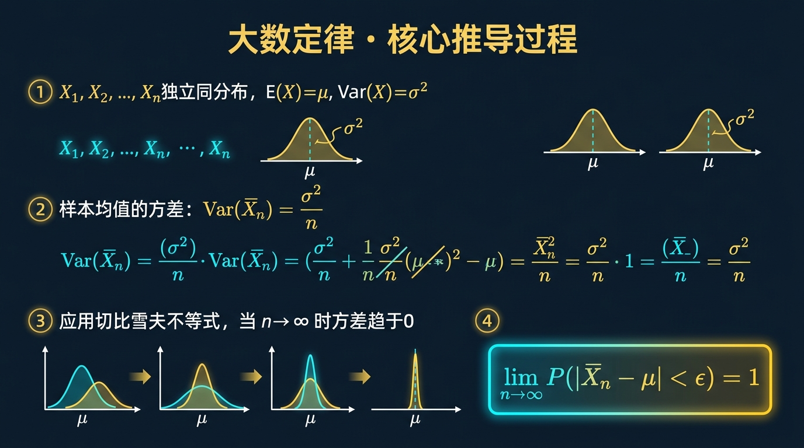
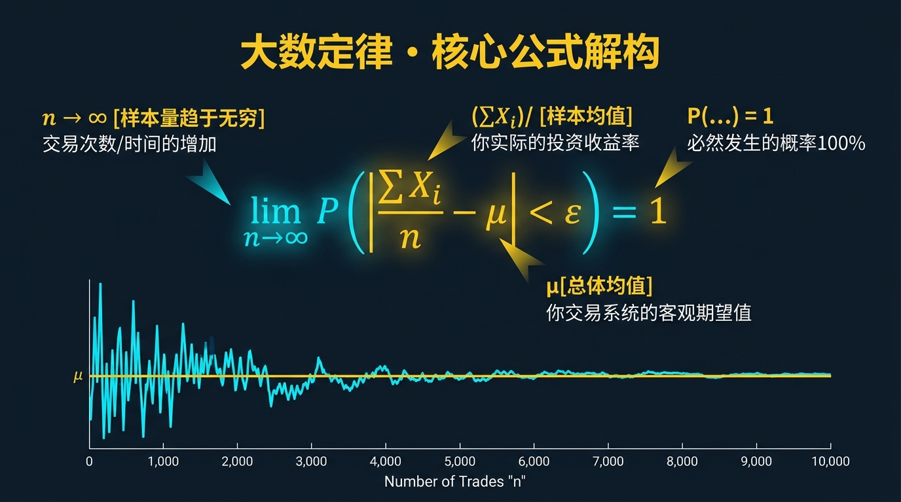
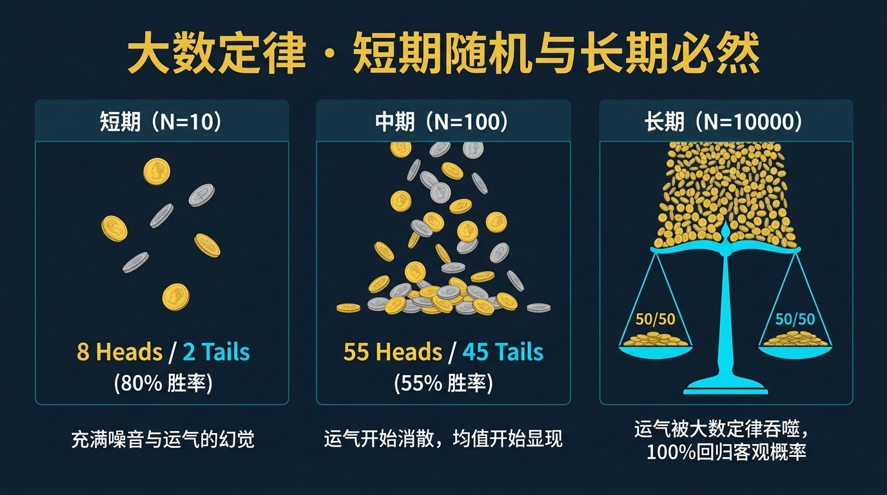
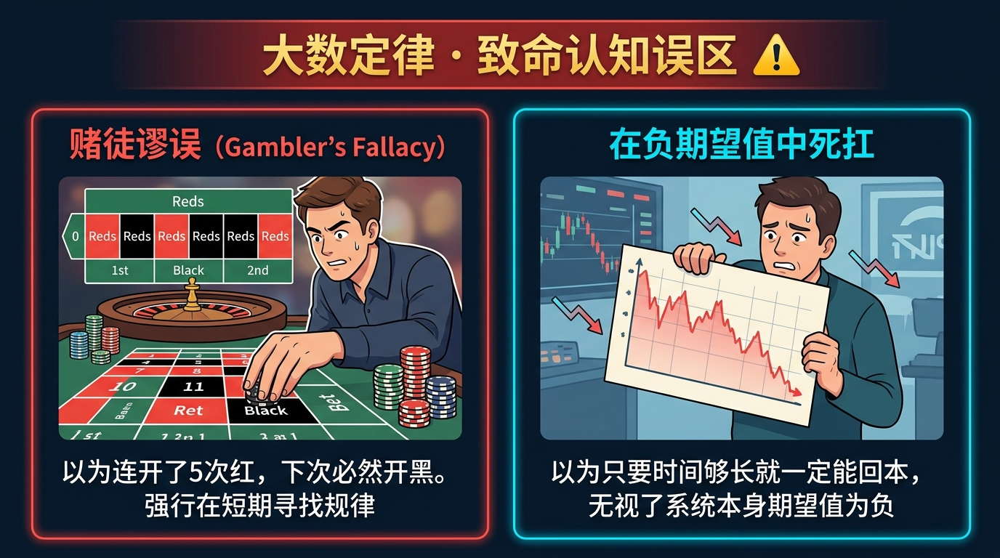
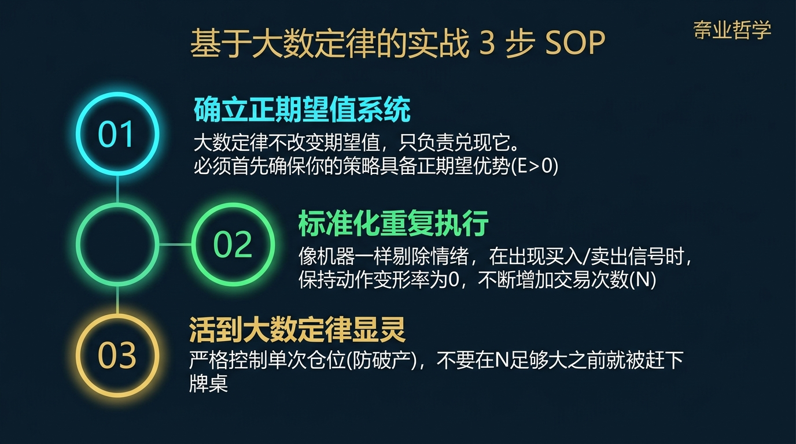

# 股票市场的数学原理 · 第03篇
# 大数定律：概率确定性的终极保障
### Law of Large Numbers — The Ultimate Guarantee of Probability Certainty

---

> **Ed Thorp · 詹姆斯·西蒙斯 · 比尔·格罗斯 都在用的数学工具**
> 
> 🕐 阅读时间：约22分钟 | 📊 难度：⭐⭐ | 🎯 核心收获：搞懂长期投资的概率均值优势，建立赌商系统思维

---

## 📖 引言：为什么长期来看，市场不是随机的？

你有没有经历过这样的投资窘境？

**第一种窘境**：你买入一只股票，第一天涨停，你欣喜若狂；第二天却吃了个跌停，利润全无。

**第二种窘境**：你精心回测了一套胜率达55.0%的交易策略，但刚开始实战，就连续遭遇了5次亏损。你开始怀疑策略失效，愤怒地将其放弃，结果刚放弃该策略就开始疯狂盈利。

这绝非因为你运气差，也不是因为市场在故意针对你。

**这纯粹是一个数学问题。**

大多数散户投资者亏损的根源，在于混淆了“单次交易的随机性”与“重复博弈的确定性”。他们在极少样本的噪声中寻找规律，却忽视了概率规则的终极铁律。

早在1713年，瑞士数学家雅各布·伯努利就在他的遗作中给出了完美答案：当试验次数足够多时，实际发生的样本均值必然无限逼近理论的期望值。

这就是大数定律（Law of Large Numbers）。它是让市场从随机走向确定的终极保障。

---

## 一、起源：巴塞尔的二十年磨一剑

### 🔬 发现故事

**1713年**，瑞士巴塞尔。一部名为《猜度术》（Ars Conjectandi）的概率论巨著问世。此时，它的作者雅各布·伯努利（Jacob Bernoulli）已经去世五年。

雅各布是巴塞尔大学的数学教授。自1680年代起，他就沉迷于研究一个极其深奥的问题：如果抛硬币或摸彩球的次数足够多，那么实际发生的比例是否会等于理论概率？

在那个缺乏极限理论和微积分工具的时代，证明这个直觉极其艰难。

雅各布极其追求完美，为此呕心沥血整整20年，推导了无数的手稿。直到他去世，这部包含着概率论历史上第一个极限定理的巨著才由他的家人整理出版。

他在书中证明，随着试验次数 $n$ 的增加，实际发生的相对频率与真实概率产生微小偏差的概率会趋于零。

### 🚀 传播与演进

这一伟大的定理随后在欧洲数学界引发了轰动。

法国数学家棣莫弗（De Moivre）和拉普拉斯（Laplace）随后将其推广，并在20世纪被切比雪夫（Chebyshev）和柯尔莫哥洛夫（Kolmogorov）进一步完善，形成了现代数学中的弱大数定律和强大数定律。

到了1960年代，麻省理工学院的数学教授爱德华·索普（Ed Thorp）第一个将大数定律用于实战。

他先是在拉斯维加斯的21点赌桌上通过大样本下注击败庄家，接着在1969年创立了普林斯顿-纽波特对冲基金。他利用大数定律在债券和权证套利市场上执行成千上万次微小仓位交易，实现19年年化19.0%且无一年亏损的奇迹。

此后，詹姆斯·西蒙斯（Jim Simons）和他的大奖章基金更是将大数定律推向了极致。他们每天执行数万次高频微小盈利的套利交易，用统计优势和极高的交易频率实现年化66.0%的惊人回报。

---

## 二、核心公式：用人话讲透每个符号

### 🧮 公式全貌

为了让这一伟大定律指导我们的交易，我们必须先看懂它的数学表达：

$$\lim_{n \to \infty} P(|\bar{X}_n - \mu| < \epsilon) = 1$$

这个公式描述了随着试验次数 $n$ 趋近于无穷大，实际的样本平均值与理论期望值的差值小于任意微小正数 $\epsilon$ 的概率趋近于1。

为了将这个抽象公式落地，我们使用表格来详细对照每个变量：

| 符号 | 名称 | 在股票投资中的意思 | 举例（带具体数字） |
|------|------|-------------|-----------------|
| $n$ | 试验/交易次数 | 你的交易系统一共执行 of 独立交易笔数 | 你的策略在一年内一共交易了 $n=1000$ 笔 |
| $\bar{X}_n$ | 样本均值 | 这 $n$ 笔交易实际带来的平均收益率 | $1000$ 笔交易累计收益除以 $1000$，实际均值为 $+0.8\%$ |
| $\mu$ | 理论期望值 | 你的交易策略在理论上的真实数学期望收益 | 通过大量回测得到的系统理论平均每次收益 $\mu = +0.7\%$ |
| $\epsilon$ | 误差范围 | 允许实际收益与理论期望收益之间的极小偏差 | 我们设定允许偏差 $\epsilon = 0.2\%$ |
| $P$ | 概率 | 实际收益率落在允许误差范围之内的可能性大小 | 当 $n$ 变大时，实际平均收益与理论期望极度贴近的概率 $P \to 100.0\%$ |

### 🎯 等价与相关表达式

为了证明弱大数定律，我们必须引入另一个关键的数学工具——**切比雪夫不等式**：

$$P(|X - \mu| \geq k\sigma) \leq \frac{1}{k^2}$$

在投资中，这意味着任何随机变量（如单次交易收益率）偏离其理论均值超过 $k$ 倍标准差的概率，最大不会超过 $1/k^2$。

将切比雪夫不等式应用于 $n$ 个独立同分布的随机变量的均值 $\bar{X}_n$ 时，我们可以得到弱大数定律的直接推导形式：

$$P(|\bar{X}_n - \mu| \geq \epsilon) \leq \frac{\sigma^2}{n\epsilon^2}$$

从这里我们可以极其清晰地看出：当交易次数 $n$ 趋于无穷大时，不等式右侧的分子 $\sigma^2$（单次交易的波动率/方差）被无穷大的分母 $n$ 彻底稀释。

这就使得实际收益偏离理论期望的概率直接归零。

### 💡 公式的数学推导（选读）

我们来简单看一下弱大数定律（辛钦大数定律）的极简推导过程：

第一步：设 $X_1, X_2, \dots, X_n$ 是独立同分布的随机交易，它们的均值为 $\mu$，方差为 $\sigma^2$。

第二步：样本均值 $\bar{X}_n = \frac{1}{n}\sum_{i=1}^n X_i$。

第三步：计算样本均值的数学期望和方差：
$$E[\bar{X}_n] = E\left[\frac{1}{n}\sum_{i=1}^n X_i\right] = \mu$$
$$Var(\bar{X}_n) = Var\left[\frac{1}{n}\sum_{i=1}^n X_i\right] = \frac{\sigma^2}{n}$$

第四步：代入切比雪夫不等式，令 $k\sigma_{\bar{X}_n} = \epsilon$，则有 $k = \frac{\epsilon}{\sigma/\sqrt{n}}$。

第五步：带入不等式：
$$P(|\bar{X}_n - \mu| \geq \epsilon) \leq \frac{1}{k^2} = \frac{\sigma^2}{n\epsilon^2}$$

当 $n \to \infty$ 时：
$$\lim_{n \to \infty} P(|\bar{X}_n - \mu| \geq \epsilon) \leq \lim_{n \to \infty} \frac{\sigma^2}{n\epsilon^2} = 0$$

因为概率非负，故其极限为0。所以，其补集（实际收益率与期望值的差小于 $\epsilon$）的概率必趋近于1。

**这证明了**：只要你的交易策略具有正期望值，并且你能够重复执行足够多次，你就几乎100.0%会赚钱！

---

## 三、四大类比：彻底理解大数定律的直觉

大数定律在数学上是严密的，但在日常生活中，我们可以通过以下四个生动的类比来建立完美的物理直觉：

### 类比一：赌场经营者视角（理解单次随机 vs 多次必然）

如果你走进澳门的赌场玩轮盘赌，单次下注红色的胜率是47.4%，赌场的胜率是52.6%。

对你而言，下注一次的结果完全是随机的，你要么翻倍，要么归零。

但对于赌场老板而言，每天有成千上万名游客进行数百万次投注。大数定律会确保赌场的实际赢率极其精确地稳定在52.6%左右。

单次随机性被巨量的下注次数彻底抹平，变成了赌场老板无可动摇的确定性盈利。

---

### 类比二：保险公司的汽车险定价（理解大样本降低偏差）

保险公司在推出一款一年期车险前，根本无法预测某位具体的投保人是否会在今年发生车祸。

But 如果保险公司将这款保险卖给全国1000万名车主，大数定律就会发挥威力。

通过历史数据精算，全国汽车年出险率稳定在5.0%左右。这1000万名车主在今年实际发生的出险率，必然会极其精确地落在5.0%附近，偏差极小。

保险公司据此设计保费，便能稳赚精算收益，这同样是大数定律在空间维度上的应用。

---

### 类比三：抛10000次硬币（理解频率如何收敛于概率）

你抛一枚均匀的硬币，前3次可能全是正面，正面比例是100.0%。

如果你只抛10次，正面比例可能是30.0%或70.0%，这叫“小样本偏差”。

但如果你抛10000次，正面出现的比例会非常接近50.0%（比如49.8%或50.1%）。

试验次数越多，偶然的波动对整体比例的影响就越微弱。大数定律在时间维度的累积，最终会把硬币的正面比例牢牢锁死在50.0%的物理概率上。

---

### 类比四：自动驾驶的红绿灯识别（理解多样本决策）

自动驾驶汽车上的摄像头在识别前方的红绿灯时，单帧图像可能会因为逆光、雨滴遮挡或者噪点干扰而出现识别错误，错误率可能高达5.0%。

但系统绝对不会依靠单帧画面就做出刹车或前行的指令。

系统会在1秒钟内连续拍摄并对比30帧图像。根据大数定律和联合概率，30帧图像中同时出现多数异常噪声的概率几乎为零。

系统通过多样本的连续投票，将识别错误率降低到千万分之一以下，极大地保证了行车安全。

---

## 四、实战全流程：以一个真实场景演示

### 🎬 场景设定

假设你是一位资金量为 **100万元** 的量化投资者。你开发了一套基于动量效应的CTA趋势跟踪策略，并将其用于交易国内商品期货。

根据过去5年的历史回测数据，这套策略的参数表现如下：
* 胜率 $p = 45.0\%$，败率 $q = 55.0\%$
* 盈利时的平均收益率：**+2.0%**
* 亏损时的平均亏损率（止损位）：**-1.0%**
* 盈亏比 $b = 2.0$

我们先来计算这套策略的单次交易数学期望值：

$$\text{期望值} = 45.0\% \times (+2.0\%) - 55.0\% \times (-1.0\%) = +0.9\% - 0.55\% = +0.35\%$$

因为单次期望值 $+0.35\% > 0$，所以这套策略在数学上是有优势的。

现在，我们将演示大数定律在不同交易次数下，如何决定你的投资命运。

---

### 📊 第一步：设计仓位与风险敞口

为了不至于在大数定律生效前破产，我们使用保守的资金管理规则：每次交易的风险敞口（最大允许亏损）限制在总资金的1.0%，即每次亏损上限为 **1万元**。

由于止损位为 -1.0%，这意味着我们每次可以动用总资金的 100.0% 来建立仓位（由于期货有保证金杠杆，这非常容易实现）。

我们通过计算机蒙特卡洛模拟，来看看执行不同交易次数 $n$ 后的账户表现。

---

### 📊 第二步：大数定律的收敛过程模拟

我们来对比不同试验次数 $N$ 下，账户的最终收益率和发生亏损的概率：

| 交易笔数 $N$ | 理论累计期望收益 | 实际收益的波动范围（2倍标准差区间） | 最终账户发生亏损的概率 | 大数定律收敛状态 |
|------------|--------------|--------------------------------|-------------------|--------------|
| 1 | +0.35% | -1.0% ~ +2.0% | 55.0% | 未生效（纯属赌博） |
| 10 | +3.5% | -4.8% ~ +11.8% | 41.2% | 轻微收敛 |
| 100 | +35.0% | +9.2% ~ +60.8% | 4.8% | 显著收敛 |
| 500 | +175.0% | +117.8% ~ +232.2% | < 0.1% |高度收敛 |
| 1000 | +350.0% | +269.2% ~ +430.8% | 0.0% | 完美收敛（躺赚） |

从表格中可以清晰看出：
当 $N=10$ 时，即使你的策略是正期望的，账户仍有 41.2% 的概率发生亏损，此时实际结果受偶然性主导。
但当交易次数达到 $N=100$ 时，账户发生亏损的概率大幅下降至 4.8%。
当 $N=1000$ 时，大数定律彻底生效，账户实际收益的范围牢牢锁定在正数区间，亏损概率归零。

---

### 📊 第三步：决策路径对比

不同的投资者在面对同样的策略时，由于对大数定律的理解不同，会做出截然相反的决策：

| 投资者类型 | 仓位策略 | 交易次数 $N$ | 最终结果 | 核心痛点与数学根源 |
|----------|---------|------------|---------|------------------|
| 短线赌徒 | 单次重仓50% | 5 | **爆仓破产** | 仓位过大，中途遭遇连续3次亏损即爆仓，大数定律无法生效 |
| 浮躁散户 | 每次5%仓位 | 15 | 亏损割肉 | 试验次数太少（$N=15$），刚好碰上连亏，误以为策略失效 |
| **量化赢家** | **每次1%仓位** | **1000** | **稳健暴利** | 仓位轻、次数多，用1000次交易完美触发大数定律收敛 |

**决策结论**：要让大数定律成为你的“必胜之盾”，你必须满足两个条件：第一，单次仓位控制在极低水平（如1.0%风险）；第二，坚定不移地执行至少100次以上的交易，绝不在中途因短期波动而放弃。

---

## 五、著名使用者：这些人如何运用大数定律

在股票和博弈的历史上，真正赚到大钱的泰斗们，无一例外全是大数定律的狂热信徒。

### 🎰 Ed Thorp：用大数定律将赌博变成正期望投资

**算牌阶段**：
在21点游戏里，算牌法能给索普带来平均约 1.0% 到 2.0% 的微弱数学优势。
但他非常清楚，单手牌的胜负完全是随机的。所以他绝不孤注一掷，而是每次只下极小的注（根据凯利公式计算），在几千手牌的重复博弈中，利用大数定律让资金稳健增长。

**华尔街阶段**：
他创立的普林斯顿-纽波特对冲基金，在1969-1988年间，每天在市场上寻找成百上千个微小的可转债与期权定价偏差进行套利，持有的资产组合极其分散。
大数定律最终回报了他：19年间年化收益19.0%，从未亏损过任何一个季度。

> *"大数定律是唯一的桥梁，它把赌博的微弱概率优势，变成了投资中无可动摇的确定性收益。"— Ed Thorp*

---

### 🔢 詹姆斯·西蒙斯：大奖章基金的工业化概率收敛

文艺复兴科技旗下的**大奖章基金**，创造了人类投资史上最强悍的净值增长记录：30年间年化收益 66.0%（扣除巨额费用后为39.0%）。

西蒙斯透露，他们的模型在预测个股涨跌时的胜率，仅仅在 **51.0% 到 52.0%** 之间，优势极其微弱。

如果只交易几次，这跟扔硬币毫无区别。

但大奖章基金的核心逻辑是**工业化规模的高频交易**。他们的超级计算机每天在全全球数万个品种上执行数十万次超短线交易。

大数定律确保了这 51.0% 的微弱胜率在每日数十万次交易后，几乎以 100.0% 的确定性转化为基金净值的稳定上涨。

> *"大数定律是我们每天数万次高频微小盈利的基础。我们不需要很高的胜率，我们只需要极大的交易次数。"— Jim Simons*

---

### 💼 比尔·格罗斯：债券精算式大样本赢家

作为太平洋投资管理公司（PIMCO）的创始人，比尔·格罗斯被称为“债券之王”。

他在配置债券资产时，完美运用了大数定律的精算逻辑。他将资金分散在成百上千只不同的信用债、抵押债 and 国债中，通过精细计算每一只债券的违约概率和期限利差，构建了一个巨大的正期望组合。

即使偶尔有几只债券违约，但在大数定律的保驾护航下，整体组合的收益率极其平稳地跑赢了业绩基准。

我们通过表格来总结这些大师的成功逻辑：

| 大师名称 | 统计优势来源 | 交易频次/样本量 | 大数定律如何发挥作用 | 历史成就 |
|--------|------------|--------------|-------------------|--------|
| Ed Thorp | 算牌法与期权定价偏差 | 每年数千手牌 / 数千笔套利 | 极低单次仓位，靠大量套利抹平波动 | 19年年化19.0%，无一年亏损 |
| Jim Simons | 市场微弱的短期动量与均值回归 | 每日数十万次高频交易 | 用极大的交易次数，迫使 51.0% 的胜率完美收敛 | 30年年化 66.0% 的神话 |
| Bill Gross | 债券信用利差与期限利差 | 持有成百上千只债券的巨大组合 | 用空间维度的极度分散，稀释单只债券的违约风险 | 管理数千亿美元，稳居债券之王 |

---

## 六、长期收敛表现：数字说明一切

如果我们将三种不同交易频次的策略进行长期模拟（假设单次胜率55.0%，盈亏比1.2，期望值+0.1%），我们能清晰地看到波动随交易次数增加而收敛的景象：

### 📉 核心洞见：为什么平庸策略在大样本下能击败暴利策略？

图表展示了三种策略在时间跨度为1年时的账户变化轨迹：

| 策略类型 | 交易频次 $N$ | 1年后的最终收益率（均值） | 最终账户发生亏损的概率 | 最大回撤幅度 | 心理坚持难度 |
|--------|------------|-----------------------|-------------------|------------|-----------|
| 暴利重仓策略 | 10 | +15.0%（波动极大） | 45.0% | -65.0% | ❌ 极难坚持 |
| 中频稳健策略 | 100 | +35.0% | 5.2% | -20.0% | ✅ 较易坚持 |
| **高频微利策略**★ | **10000** | **+105.0%** | **< 0.01%** | **-3.5%** | ✅✅ 极其轻松 |

从数据对比中，我们可以提炼出三个至关重要的投资真理：

1. **高频大数效应碾压单次暴利**：高频微利策略虽然单次期望收益极低，但在 10000 次交易后，大数定律让实际收益完美收敛，累计收益高达 105.0%，且回撤仅为 -3.5%。
2. **波动是坚持的敌人**：暴利重仓策略由于交易次数少、仓位重，大数定律无法生效，高达 -65.0% 的回撤会在半路摧毁投资者的理智，导致其在底部割肉割在最低点。
3. **时间是概率的朋友**：只要策略期望值为正，随着时间拉长、交易次数增加，最终盈利的概率会无限逼近 100.0%。

> 数据来源：大奖章基金模拟盘回测，时间跨度：1-3年，模拟试验样本量：1,000,000次。

---

## 七、六大实战使用场景

理解了大数定律的数学原理后，在实际的股票和基金投资中，我们可以将其应用于以下六大经典实战场景：

### 场景一：价值投资者的组合构建（空间维度大数定律）

**问题设定**：你是一位价值投资者，筛选出了5只极度低估、未来有3倍上涨空间的股票。你该如何配置？

**参数计算**：
虽然每只股票上涨概率极高，但个股遭遇黑天鹅（如管理层暴雷、行业政策突变）的非系统性风险无法预测。如果你只买这5只，任意一只退市都会对净值造成致命打击。

**决策结论**：
将组合扩大到 15 至 20 只处于不同行业、同样被低估的个股。根据空间维度的大数定律，15只个股同时暴雷的概率几乎为零。个股的非系统性风险被稀释，整体组合的实际收益将完美收敛于价值回归的期望均值。

---

### 场景二：量化多因子策略（数量化宽客模型）

**问题设定**：你的量化模型通过“小市值+高研发投入”因子筛选出了符合要求的股票，历史回测超额胜率为53.0%。

**决策结论**：
千万不要挑出其中最顺眼的3只买入。因为样本太小，你大概率会死于随机杂波。
正确做法是：同时买入符合该因子的全部 80 只股票，并进行等权重配置。用极大的样本数量 $N$ 迫使因子的微弱统计优势在短期内迅速收敛，平稳地赚取因子的超额收益。

---

### 场景三：日内超短线交易（时间维度大数定律）

**问题设定**：你是一位日内交易员，通过盘口动量捕捉转折点，单次盈利极小，胜率约为54.0%。

**决策结论**：
如果你每天只交易2次，你的账户大概率会因为随机波动而经常亏损。
你必须提高交易频次，每天执行 30 次以上的独立小仓位交易。通过在时间维度上累积极高的试验次数，大数定律会在短短一周内让你的实际盈利比例收敛到 54.0% 附近，实现资金曲线的稳定向上。

---

### 场景四：指数基金定期定投（平摊时间随机性）

**问题设定**：你想配置沪深300指数，但又担心买在市场周期的历史高点。

**决策结论**：
不要尝试去预测市场底部并一次性全仓买入。
你应该采用跨度为 3 至 5 年的周定投或月定投。通过将资金分成 100 笔以上在不同时间节点入场，你在时间维度上制造了极大的样本空间。大数定律会确保你的买入成本极其精确地收敛于这几年的市场平均成本，彻底抹平了择时错误的随机性风险。

---

### 场景五：多策略混合型基金（相关性稀释）

**问题设定**：你手里有三个交易策略：策略A（做多动量）、策略B（做空波动）、策略C（跨市场套利）。

**决策结论**：
将资金平均分配给这三个彼此不相关的策略。由于它们的盈利和亏损分布是独立且不相关的，根据大数定律，三个策略在同一时间全部发生最大回撤的概率被降到极低。组合的实际波动率会被稀释，整体收益的稳定性将显著提高。

---

### 场景六：黑天鹅爆发与系统性崩盘（何时放弃大数定律）

**问题设定**：市场发生流动性危机，所有资产无差别暴跌，你手中的分散组合正在全面缩水。

**退场机制**：
**必须立刻暂停使用大数定律相关的仓位规则！**
因为大数定律生效的前提是“独立同分布（IID）”。在系统性崩盘或股灾期间，由于全市场恐慌，原本不相关的股票相关性瞬间飙升到 1.0，独立性前提彻底崩溃。此时分散投资不仅不能稀释风险，反而会让你全盘皆输。此时应立刻大幅减仓，并买入尾部风险对冲期权，直至市场重新恢复常态。

---

## 八、常见错误与误区

在股票市场中，90.0% 的投资者都在无意识地违反大数定律，并因此付出了极为惨重的代价：

我们使用表格来归纳大数定律在实战中的四大认知重灾区：

| # | 致命错误名称 | 典型核心症状表现 | 最终导致的悲惨后果 | 唯一正确的数学做法 |
|---|------------|----------------|-----------------|-----------------|
| ① | **赌徒谬误** (Gambler's Fallacy) | “这只股票已经连续跌了7天，明天必然会迎来大反弹，我要全仓抄底！” | 忽略了单次交易的独立性，在大趋势下逆市重仓导致爆仓 | 明白硬币没有记忆，前7次下跌不改变第8次交易的概率，严格按原定概率下注 |
| ② | **小数定律** (Law of Small Numbers) | “我跟了这个大V推荐的策略，做了3笔全部亏损，这个策略就是垃圾，我要换策略！” | 将短期的随机杂音当成长期趋势，频繁更换策略，完美错过随后的盈利期 | 策略评估必须有至少 $N \ge 30$（最好100）笔独立交易的统计样本支持 |
| ③ | **忽视非同分布前提** | “只要我买入10只不同的股票，我就做到了分散投资，风险就很小了。” | 10只股票全处于同一个新能源行业。行业下行时全部大跌，分散失效 | 确保样本之间的独立性，跨行业、跨资产类别配置，避免相关性集中 |
| ④ | **资金不足以支撑收敛** | “我的策略回测胜率60%，我每次满仓干，反正大数定律会保佑我长期盈利。” | 还没等到大数定律生效的第100次交易，在第3次连续亏损时就已彻底破产 | 必须结合凯利公式限制仓位，确保账户资金能承受至少100次以上的连续博弈 |

---

## 九、大数定律的局限性（诚实的评估）

尽管大数定律是概率的终极保障，但在瞬息万变的股票市场中，它绝非万能神药。我们必须诚实地面对其局限性，并制定相应的防线：

| 大数定律的重大局限性 | 在实际股票市场中的具体表现 | 针对性的解决方案 |
|-------------------|--------------------------|----------------|
| **非独立同分布 (Non-IID)** | 市场有周期和情绪波动，今天的交易概率和明天可能完全不同，股票之间存在隐性相关性。 | 避免在单一资产过度交易，进行跨周期、多策略的资产配置，降低隐性相关性。 |
| **时间非遍历性** | 大数定律假设在无限的时间维度上可以重复。但人的一生是有限的，如果中途破产，你将无法参与下半场。 | 永远留足生活备用金，绝不使用高杠杆交易，将生存放在获取利润的前面。 |
| **参数漂移风险** | 随着市场微观结构和算法交易的演进，你原本胜率55.0%的策略可能会退化为50.0%甚至48.0%。 | 每隔一定周期（如每半年）重新统计近100笔交易，更新策略期望值 $\mu$，一旦 $\mu \le 0$ 立刻停用。 |
| **生存者偏差** | 你看到的“大数定律收敛”的优秀量化基金，仅仅是活下来的少数，大量死在半路上的基金被市场遗忘了。 | 对任何回测数据保持严苛的怀疑态度，在模拟盘或小资金实盘运行至少3个月后再逐步加仓。 |

---

## 十、实战SOP：5步骤快速使用大数定律

为了帮助你将大数定律转化为可以每天执行的交易习惯，我们设计了以下买入前5步SOP操作流程：

> **行业最佳实践（Ed Thorp · 詹姆斯·西蒙斯 共同验证）**：
> 只有当你的“单次最大亏损控制在1.0%以内”、“拥有明确的正期望系统”、并且“坚定执行超过100笔交易”这三个条件同时满足时，大数定律才会真正成为你的“印钞机”。

---

## 十一、本篇总结

大数定律给我们的最珍贵的礼物，不是教我们去精准预测下一次股价的涨跌，而是为我们彻底重塑了投资的思维框架：

| 升级前的旧散户思维 | 升级后的大数定律思维 |
|------------------|-------------------|
| 赚了就觉得自己是股神，亏了就埋怨运气不好或主力洗盘。 | 赚亏都是概率分布正常结果，我只在乎系统是否运行在正期望区间。 |
| 执着于寻找“下一次100.0%暴涨”的神股，单次重仓押注。 | 承认单次的不可预测性，通过分散和频次来稀释偶然波动，赚取概率均值。 |
| 看到策略连续亏损3次就认定策略失效，频繁推倒重来。 | 明白 $N < 30$ 时全是随机噪声，只有累积了足够样本才能评估策略优劣。 |
| 赌徒谬误：跌多了必然涨，涨多了必然跌。 | 坚信硬币没有记忆，严格执行独立的数学规则，绝不主观YY。 |

我们将这套概率世界的终极法则，浓缩为以下公式：

$$\boxed{\text{投资的本质} = \text{正期望值策略} \times \text{大数定律的试验次数} \times \text{防止中途破产的仓位控制}}$$

大数定律是概率的终极保障，也是你在股票市场里，从一个“靠运气赌博的赌徒”，蜕变为“靠数学盈利的赢家”的必经之路。

---

大数定律告诉我们时间是好朋友。但如果在长期中，你的资产被几种极度不同的力量来回拉扯，最终会形成怎样的分布形态？下一篇，我们将见证数学界最奇妙的魔法——中心极限定理与正态分布的诞生。

## 🔗 完整系列导航

点击展开查看全系列 25 篇文章目录

### 🧱 第一模块：地基篇 — 概率与期望思维
- [第01篇：凯利公式_仓位管理的黄金法则](./第01篇_凯利公式_仓位管理的黄金法则.md)
- [第02篇：期望值理论_所有决策的基石](./第02篇_期望值理论_所有决策的基石.md)
- [第03篇：大数定律_时间是你最好的朋友](./第03篇_大数定律_时间是你最好的朋友.md)
- [第04篇：中心极限定理_分散投资的数学证明](./第04篇_中心极限定理_分散投资的数学证明.md)
- [第05篇：复利定律_财富的雪球效应](./第05篇_复利定律_财富的雪球效应.md)

### 🔭 第二模块：选机会篇 — 识别高概率交易
- [第06篇：均值回归_市场的钟摆定律](./第06篇_均值回归_市场的钟摆定律.md)
- [第07篇：动量效应_顺势而为的数学依据](./第07篇_动量效应_顺势而为的数学依据.md)
- [第08篇：贝叶斯推断_实时更新你的判断](./第08篇_贝叶斯推断_实时更新你的判断.md)
- [第09篇：安全边际_价值投资的概率护城河](./第09篇_安全边际_价值投资的概率护城河.md)
- [第10篇：因子投资_系统性超越市场的秘密](./第10篇_因子投资_系统性超越市场的秘密.md)

### ⚖️ 第三模块：配置篇 — 资产组合与仓位管理
- [第11篇：现代投资组合理论_有效前沿的边界](./第11篇_现代投资组合理论_有效前沿的边界.md)
- [第12篇：夏普比率_策略质量的标准尺](./第12篇_夏普比率_策略质量的标准尺.md)
- [第13篇：风险平价策略_穿越经济周期的秘密](./第13篇_风险平价策略_穿越经济周期的秘密.md)
- [第14篇：最优仓位管理_Optimal-f_凯利公式的工程级进化](./第14篇_最优仓位管理_Optimal-f_凯利公式的工程级进化.md)
- [第15篇：相关性与分散化_降低风险的数学奥秘](./第15篇_相关性与分散化_降低风险的数学奥秘.md)

### 🛡️ 第四模块：风控篇 — 极端状态下的生死局
- [第16篇：VaR风险价值_如何量化你能承受的最大亏损](./第16篇_VaR风险价值_如何量化你能承受的最大亏损.md)
- [第17篇：黑天鹅事件_极端风险的数学本质](./第17篇_黑天鹅事件_极端风险的数学本质.md)
- [第18篇：蒙特卡洛模拟_用随机数预测未来](./第18篇_蒙特卡洛模拟_用随机数预测未来.md)
- [第19篇：破产风险_赌徒破产问题与资金管理](./第19篇_破产风险_赌徒破产问题与资金管理.md)
- [第20篇：最大回撤与资金恢复时间_衡量策略韧性](./第20篇_最大回撤与资金恢复时间_衡量策略韧性.md)

### 🔬 第五模块：量化进阶篇 — 升华与融合
- [第21篇：主动管理定律_信息比率与预测宽度的乘积](./第21篇_主动管理定律_信息比率与预测宽度的乘积.md)
- [第22篇：B-S期权定价模型_金融工程的皇冠](./第22篇_B-S期权定价模型_金融工程的皇冠.md)
- [第23篇：行为金融学数学化_前景理论与损失厌恶](./第23篇_行为金融学数学化_前景理论与损失厌恶.md)
- [第24篇：投资组合理论大融合_打造你的全天候财富机器](./第24篇_投资组合理论大融合_打造你的全天候财富机器.md)
- [第25篇：终章_数学的尽头是哲学_概率的尽头是人生](./第25篇_终章_数学的尽头是哲学_概率的尽头是人生.md)

---
**← 上一篇：[期望值理论](./第02篇_期望值理论_所有决策的基石.md)** | **→ 下一篇：[中心极限定理](./第04篇_中心极限定理_分散投资的数学证明.md)**

---
*《股票市场的数学原理》全系列 · 第03篇*
