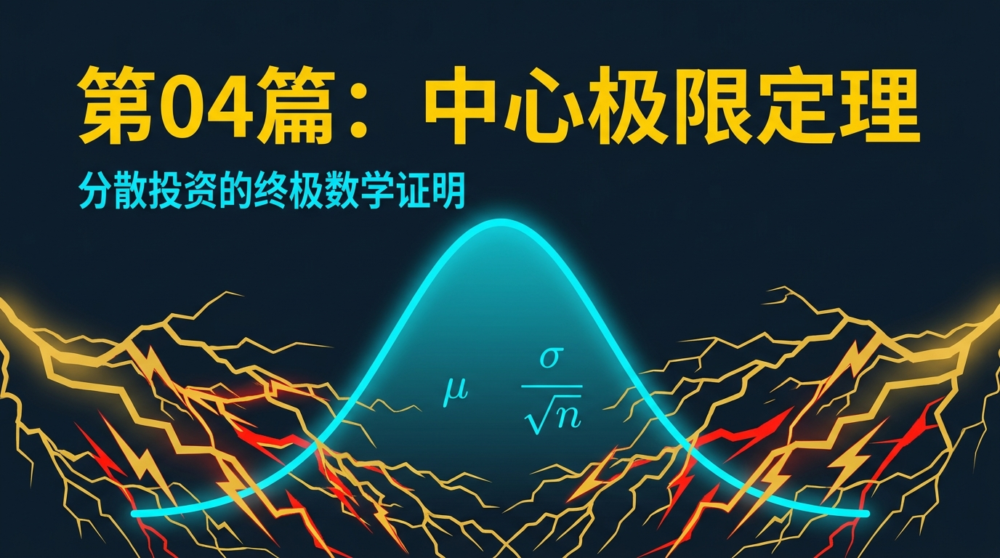
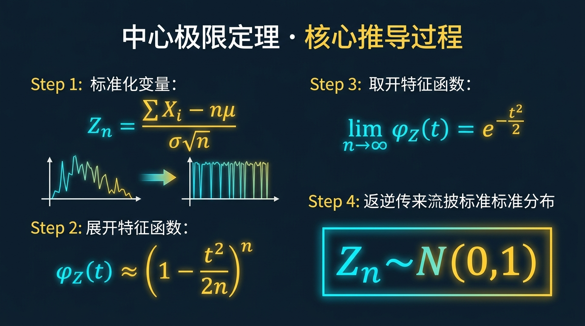
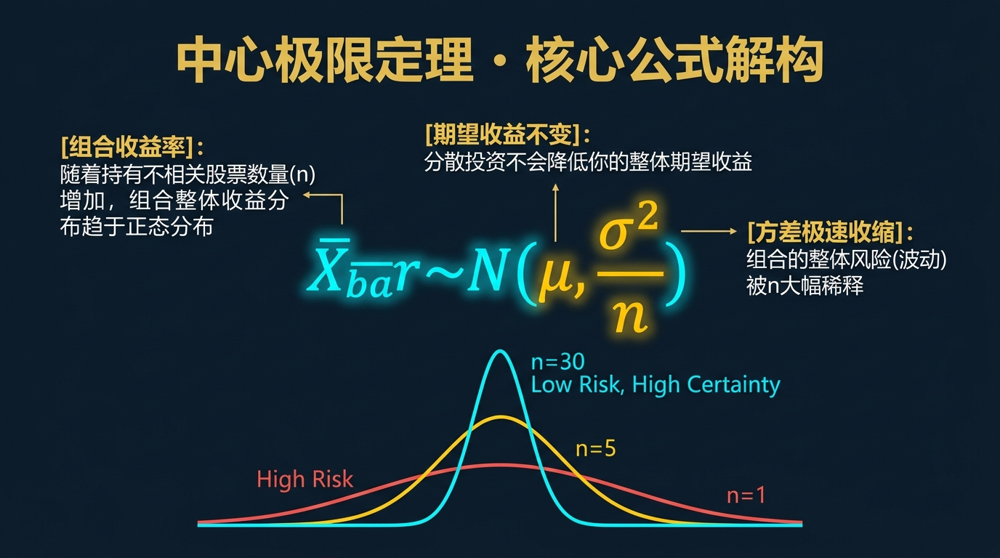
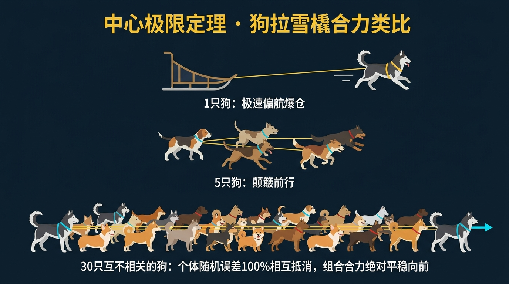
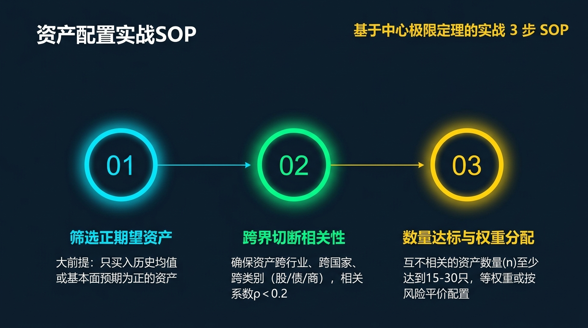
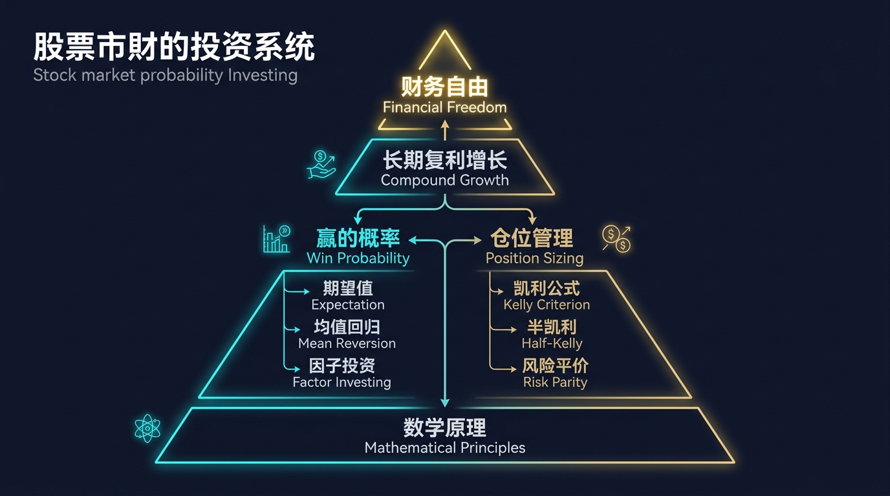

# 股票市场的数学原理 · 第04篇
# 中心极限定理：资产配置的数学铁律
### Central Limit Theorem (CLT) — The Mathematical Iron Rule of Asset Allocation

---

> **Harry Markowitz · Cliff Asness · Ray Dalio 都在用的数学工具**
> 
> 🕐 阅读时间：约25分钟 | 📊 难度：⭐⭐⭐ | 🎯 核心收获：掌握分散投资降低波动的统计学原理，设计科学组合

---

## 📖 引言：为什么你的投资组合总是无法摆脱波动的魔咒？

你有没有经历过这样的事情：精挑细选了3只“大牛股”，本以为分散了风险，结果遭遇行业黑天鹅，3只股票在同一个星期内齐刷刷暴跌了20%？

又或者，你尝试将资金分散到10只不同的股票中，却发现当大盘泥沙俱下时，你的组合不仅没有起到防守作用，反而由于持股过多，跌得比指数还要惨烈？

很多散户投资者常常挂在嘴边的“分散投资”，实际上只是一种凭感觉进行的“盲目分散”。他们并不知道，真正的分散投资背后，隐藏着一条不可违背的统计学铁律。

如果没有这个铁律，所有的资产配置都将沦为一场纯粹的运气游戏；而一旦掌握了它，你就能在波诡云谲的股票市场中，获得那份被华尔街称为“唯一免费午餐”的系统性红利。

这并非玄学，而是数学的力量。1812年，一位法国数学巨擘在法国科学院发表了一项划时代的发现，这项最初用于测量天体运行误差的工具，在140年后成为了现代投资组合理论的奠基石。

这个工具，就是『中心极限定理』（Central Limit Theorem, CLT）。今天，我们将从量化投资的视角，彻底拆解这个让风险“自动消失”的数学魔法。

---

## 一、起源：从法国科学院到马科维茨的“唯一免费午餐”

### 🔬 发现故事

**1812年**，皮埃尔-西蒙·拉普拉斯（Pierre-Simon Laplace）在法国科学院发表了他一生中最重要的学术著作《概率的分析理论》。在这部著作中，他正式提出并证明了中心极限定理的早期形式。

拉普拉斯当时研究的问题与股票投资毫无关系，他是在试图解决天文学测量中的“误差分布”问题。天文学家在观测行星轨道时，每一次测量都会产生微小的、看似无规律的随机误差。

拉普拉斯惊奇地发现：不管这些单个误差的来源多么杂乱无章、服从什么奇奇怪怪的概率分布，只要把大量独立的微小误差相加，最终的总体误差分布都会呈现出一种极其完美的对称钟形曲线。

这就是中心极限定理的首次系统性阐述。然而，在接下来的一个多世纪里，这个定理一直被锁在纯数学和物理学的象牙塔里，直到一位年轻的经济学家打破了这道门槛。

**1952年**，哈里·马科维茨（Harry Markowitz）在《金融学期刊》上发表了划时代的论文《资产选择》（Portfolio Selection）。在这篇论文中，他首次将中心极限定理引入金融市场，提出了“均值-方差”模型。

马科维茨用数学方法证明了：在资产期望收益率确定的情况下，通过配置相关性低的资产组合，可以使整个组合的方差（风险）显著降低。这正是中心极限定理在多变量环境下的直接应用。

这一发现为他赢得了1990年的诺贝尔经济学奖。马科维茨的那句名言自此传遍华尔街，并成为了现代资产配置的核心圣经：

> *"分散化投资是金融市场上唯一的免费午餐。"— Harry Markowitz*

自此，从文艺复兴科技的西蒙斯，到桥水基金的达利奥，所有的量化巨头都将中心极限定理视为构建庞大帝国的最底层数学基石。

---

## 二、核心公式：用人话讲透每个符号




### 🧮 公式全貌

中心极限定理的核心公式展示了独立随机变量之和在样本量趋近于无穷大时，其概率分布收敛于标准正态分布的规律：



$$\lim_{n \to \infty} P\left( \frac{\sum_{i=1}^n X_i - n\mu}{\sigma\sqrt{n}} \le z \right) = \Phi(z)$$

为了让每一位投资者都能轻松看懂，我们将这个公式的 5 个关键变量进行完全拆解，并映射到股票市场的实际场景中：

| 符号 | 名称 | 在股票投资中的数学意义 | 股票市场中的具体案例与数值 |
|------|------|---------------------|--------------------------|
| $X_i$ | 单个随机变量 | 投资组合中第 $i$ 只股票的随机收益率 | 某只特定科技股，期望收益率 $\mu = 10\%$ |
| $\mu$ | 单个资产期望收益率 | 单个资产在长期重复交易中的平均回报率 | 经过历史数据回测，该股的平均年化收益为 $10\%$ |
| $\sigma$ | 单个资产标准差（波动率） | 描述单个资产收益率偏离期望值的剧烈程度 | 该股年化波动率 $\sigma = 30\%$，代表价格起伏大 |
| $n$ | 样本数量（资产个数） | 投资组合中持有的不相关股票的总数量 | 组合中持有了 $n = 30$ 只不同行业的股票 |
| $\Phi(z)$ | 标准正态分布函数 | 累积概率函数，表示最终结果落在某个区间的概率 | 计算组合年化收益率落在 $5\%$ 到 $15\%$ 之间的概率 |

### 🎯 等价表达式

在投资实战中，我们更常用的是中心极限定理的“样本均值版本”。如果我们将投资组合的整体收益率视为 $n$ 个独立且同分布的股票收益率的平均值 $\bar{X} = \frac{1}{n}\sum_{i=1}^n X_i$，那么当持股数量 $n$ 足够大时，组合收益率 $\bar{X}$ 的分布将趋近于正态分布：

$$\bar{X} \sim N\left(\mu, \frac{\sigma^2}{n}\right)$$

这意味着，当我们把 $n$ 个相互独立的资产组合在一起时：
1. **组合的期望收益率**保持不变，依然是：
$$E[\bar{X}] = \mu$$
2. **组合的标准差（风险）**会被大幅削减，降为单个资产标准差的 $\sqrt{n}$ 分之一：
$$\sigma_p = \frac{\sigma}{\sqrt{n}}$$

### 💡 公式的数学推导（选读）

为什么大量独立随机变量相加，其分布会趋向于正态分布？我们可以通过特征函数（Characteristic Function）来进行严格的数学推导。

假设 $X_1, X_2, \dots, X_n$ 是独立同分布的随机变量，均值为 $0$（为简化推导，假设已去中心化），方差为 $\sigma^2$。我们定义标准化和：

$$Y_n = \frac{\sum_{i=1}^n X_i}{\sigma\sqrt{n}} = \sum_{i=1}^n \frac{X_i}{\sigma\sqrt{n}}$$

由于 $X_i$ 相互独立，整个和的特征函数是单个变量特征函数的乘积：

$$\varphi_{Y_n}(t) = E\left[e^{itY_n}\right] = E\left[\prod_{i=1}^n e^{it\frac{X_i}{\sigma\sqrt{n}}}\right] = \prod_{i=1}^n E\left[e^{i \frac{t}{\sigma\sqrt{n}} X_i}\right] = \left[\varphi_X\left(\frac{t}{\sigma\sqrt{n}}\right)\right]^n$$

现在我们将单个变量的特征函数 $\varphi_X(u)$ 在 $u=0$ 处展开为泰勒级数（Taylor Series）：

$$\varphi_X(u) = E\left[e^{iuX}\right] = E\left[1 + iuX - \frac{u^2}{2}X^2 + o(u^2)\right]$$

由于我们假设了 $E[X] = 0$，且 $E[X^2] = \sigma^2$，特征函数展开为：

$$\varphi_X(u) = 1 - \frac{u^2\sigma^2}{2} + o(u^2)$$

代入标准化和的特征函数公式中，将 $u$ 替换为 $\frac{t}{\sigma\sqrt{n}}$：

$$\varphi_{Y_n}(t) = \left[ 1 - \frac{\sigma^2}{2}\left(\frac{t}{\sigma\sqrt{n}}\right)^2 + o\left(\frac{t^2}{n}\right) \right]^n = \left[ 1 - \frac{t^2}{2n} + o\left(\frac{t^2}{n}\right) \right]^n$$

现在我们对上述表达式取极限，当 $n \to \infty$ 时：

$$\lim_{n \to \infty} \varphi_{Y_n}(t) = \lim_{n \to \infty} \left[ 1 - \frac{t^2}{2n} \right]^n = e^{-\frac{t^2}{2}}$$

而 $e^{-\frac{t^2}{2}}$ 正是**标准正态分布 $N(0,1)$ 的特征函数**。

根据特征函数与概率密度函数的一一对应性（Lévy 连续性定理），标准化样本均值的概率分布在极限状态下必然收敛于标准正态分布。这一推导无情地证明了：只要数量足够大且相互独立，混沌的个体必然走向秩序的对称。

---

## 三、四大类比：彻底理解中心极限定理的直觉

为了绕开复杂的数学推导，我们可以通过生活中极其直观的四个物理场景，来感受中心极限定理的核心逻辑。

### 类比一：抛无数沙子堆成钟形曲线（理解独立随机变量相加的物理效应）

假设你手里握着一把细沙，从空中慢慢撒向地面。

每一粒沙子在落下的过程中，都会受到各种无法预测的微小扰动——风向的轻微偏转、重力细微的差别、空气阻力的波动，以及沙粒之间的碰撞。单看某一粒沙子的落点，它是完全随机且不可预测的。

然而，当你撒下成千上万粒沙子之后，神奇的物理现象发生了：地面上并没有出现一片杂乱无章的扁平沙层，而是隆起了一个近乎完美的对称钟形沙堆。

**这正是中心极限定理最直观的物理投射**：每一个受到独立随机因素影响的沙粒（单个资产收益率），最终通过相加（组合叠加效应），凝聚成了一个最稳定的对称正态曲线（组合整体波动结构）。

```
         /\           <-- 最终形成的完美正态沙堆
        /  \
      _/    \_
    _/        \_
  _/            \_
====================  <-- 地面
```

---

### 类比二：散户在证券交易所门前集合（理解群体均值的聚集效应）

我们来看一个关于身高的社会调查学类比。

假设你在某个周五的下午，去证券交易所的大门前记录每一个走出来的投资者的身高。第一个出来的可能是一个 1.62 米的年轻人，第二个可能是 1.85 米的中年男子，第三个可能是 1.55 米的老太太。个体的身高分布虽然有大致范围，但依然非常参差不齐。

但是，如果你不记录单个人，而是将走出来的散户每 30 个人编为一个小组，并记录这 30 人小组的“平均身高”。

你会发现，第一组的均值是 1.71 米，第二组是 1.70 米，第三组是 1.72 米。随着你记录的小组越来越多，这些平均身高的数值会极其紧密地围绕着全人类的真实身高均值（比如 1.71 米）呈现正态分布，且波动范围极窄。

**这个类比揭示了投资组合的精髓**：单个投资者的身高变化极大（单只股票的波动剧烈），但是一旦将他们打包成 30 人的群体（持有 30 只股票的组合），群体的均值就会变得极其稳定，大幅度偏离均值的极端小组（极端波动）出现的概率呈指数级衰减。

---

### 类比三：30只性格迥异的宠物犬拉雪橇的合力（理解合力的均值向量稳定性）

想象你要乘坐一辆雪橇，由 30 只不同性格和品种的宠物犬来拉动。

这些犬的行为是极其随机的：有些哈士奇偶尔会兴奋地往前猛冲，有些柯基拉了一会儿就开始偷懒，还有些柴犬甚至偶尔想往左右两边跑去抓小松鼠。如果只用一只狗拉雪橇，你的行进路线将会是一场灾难，雪橇随时可能颠覆或者停滞不前。

但是，当你用缰绳将这 30 只性格各异的狗捆绑在一起，共同拉动雪橇时，神奇的均衡发生了。

哈士奇向前猛冲的爆发力，会被偷懒的柯基和往旁边跑的柴犬所抵消；往左偏的拉力，会被往右偏的拉力所平抑。最终，30 只狗的合力形成了一个极其稳定、始终朝着正前方匀速行进的均值向量。

| 狗的特征/行为 | 在投资组合中的映射 | 统计学上的解释 |
|-------------|-----------------|--------------|
| 哈士奇突然往前猛冲 | 某只重组股或科技股暴涨 | 正向极端随机波动 |
| 柯基偷懒不愿出力 | 某只大盘蓝筹股原地踏步 | 零值波动 |
| 柴犬往左右偏斜 | 某些资产表现出方向相反的波动 | 负相关或不相关的随机误差 |
| **30只狗的合力方向** | **投资组合的整体收益率表现** | **均值收敛与方差收缩（CLT效应）** |

这个类比表明：**只要资产数量足够且 correlation（相关性）较低，个体的随机偏航不会毁掉组合，合力会推着资产稳步前行。**

---

### 类比四：30个普通工人的流水线效率收敛（个体误差的相互抵消）

在一个制造精密手表的车间里，有 30 个技术水平一般的组装工人。

每个工人在组装零件时都会产生一些细微的误差。有些工人今天心情不好，动作慢了 5 秒；有些工人因为熟练度问题，把螺丝拧紧的角度偏了 2 度。如果一块手表完全由一个工人从头到尾组装，其最终的品质和出厂误差将是极难控制的。

但是，如果采用流水线作业：30 个工人每个人只负责一道特定的工序，前一个工人的微小偏差会被后一个工人的操作无意中平抑和修正。

当整条流水线运转起来后，出厂手表的平均日误差会收敛到一个非常窄的稳定区间。

这就是中心极限定理在工业管理中的应用：**局部的不完美（高风险个体），通过多级独立环节的相加重组（分散化组合），最终输出了近乎完美的标准化产品（低波动组合）。**

---

## 四、实战全流程：以一个真实场景演示

现在，我们通过一个完整的量化实战案例，演示如何应用中心极限定理来设计一个高胜率、低波动的投资组合。

### 🎬 场景设定

假设你是一个管理 **100万元** 资金的资产配置经理。你经过深度研究，筛选出了一个由 30 只股票组成的资产备选库。

通过对历史数据的量化回测，你得到了以下关键统计特征：
- 备选库中所有股票的平均期望年化收益率 $\mu = 12.0\%$。
- 单只股票年化的平均标准差（波动率） $\sigma = 35.0\%$。
- 这 30 只股票分别属于不同行业，彼此之间的相关系数极低，为方便计算，我们先假设它们相互独立（即相关系数 $\rho = 0$）。

你的投资目标非常明确：**在保证期望收益率不低于 $12\%$ 的前提下，尽可能降低组合波动，且必须将投资组合一年内发生亏损（收益率 < 0%）的概率控制在最低水平。**

我们将通过以下 5 个步骤展示如何运用中心极限定理完成这一配置。

---

### 📊 第一步：评估不同持股数量 $n$ 下的组合标准差

根据中心极限定理，组合的标准差随着资产数量 $n$ 的增加而收缩。我们代入公式：

$$\sigma_p = \frac{\sigma}{\sqrt{n}}$$

我们分别计算持股 1 只、5 只、15 只、30 只时的组合标准差：

| 方案 | 持股数量 $n$ | 计算过程 | 组合标准差（风险） $\sigma_p$ |
|------|------------|---------|---------------------------|
| 方案 A | 1 只 | $35\% / \sqrt{1}$ | $35.0\%$ |
| 方案 B | 5 只 | $35\% / \sqrt{5}$ | $15.7\%$ |
| 方案 C | 15 只 | $35\% / \sqrt{15}$ | $9.0\%$ |
| 方案 D | 30 只 | $35\% / \sqrt{30}$ | $6.4\%$ |

> 💡 **解读**：仅仅是将资金从 1 只股票分散到 15 只不相关的股票，组合的风险就从 $35.0\%$ 锐减到了 $9.0\%$，降幅高达 $74\%$！而当持股数达到 30 只时，组合波动率仅为 $6.4\%$。

---

### 📊 第二步：利用正态分布计算组合发生年化亏损的概率

根据中心极限定理，当 $n \ge 15$ 时，投资组合的收益率分布已经高度近似正态分布。我们可以通过标准正态分布累计概率表，计算组合发生亏损（收益率 $X < 0$）的概率。

我们需要将 $0\%$ 的收益率进行标准化，计算其对应的 $Z$ 分数：

$$Z = \frac{0 - E[\bar{X}]}{\sigma_p} = \frac{0 - 12\%}{\sigma_p}$$

代入不同方案下的 $\sigma_p$：

| 方案 | 持股数 $n$ | $Z$ 分数计算 | $Z$ 值 | 亏损概率 $P(Z < z)$ |
|------|-----------|------------|--------|------------------|
| 方案 A | 1 只 | $(0 - 12\%) / 35.0\%$ | $-0.34$ | $36.7\%$ |
| 方案 B | 5 只 | $(0 - 12\%) / 15.7\%$ | $-0.76$ | $22.4\%$ |
| 方案 C | 15 只 | $(0 - 12\%) / 9.0\%$ | $-1.33$ | $9.2\%$ |
| 方案 D | 30 只 | $(0 - 12\%) / 6.4\%$ | $-1.88$ | $3.0\%$ |

---

### 📊 第三步：决策可行性矩阵对比

通过数据对比，我们可以清晰地看到不同仓位分散策略下，投资组合的风险收益特征发生了极其显著的变化：

| 持股方案 | 单只配比 | 期望收益 | 波动率 | 亏损概率 | 心理持仓体验 | 决策建议 |
|---------|---------|---------|-------|---------|------------|---------|
| 方案 A (1只) | 100万元 | $12.0\%$ | $35.0\%$ | $36.7\%$ | 极度焦虑，随时面临巨大回撤 | 🛑 坚决否定 |
| 方案 B (5只) | 20万元 | $12.0\%$ | $15.7\%$ | $22.4\%$ | 仍有近四分之一的年份面临亏损 | ⚠️ 谨慎参与 |
| 方案 C (15只)| 6.7万元 | $12.0\%$ | $9.0\%$ | $9.2\%$ | 波动温和，持仓心态非常平稳 | ✅ 推荐配置 |
| 方案 D (30只)| 3.3万元 | $12.0\%$ | $6.4\%$ | **$3.0\%$** | 极度安全，近乎无感地享受复利 | ★ 最佳选择 |

> 🌟 **核心结论**：这正是马科维茨所说的“免费午餐”。你的期望年化收益率在任何一个方案下都是 **$12.0\%$**，但是由于中心极限定理的保护，通过将资金分散到 30 只不相关个股，你将发生年化亏损的概率从 **$36.7\%$** 降到了不可思议的 **$3.0\%$**！

---

## 五、著名使用者：这些人如何运用中心极限定理

在华尔街的顶级殿堂里，中心极限定理是区分“野生赌徒”与“量化巨匠”的分水岭。我们来看看三位大师级人物是如何应用这一理论的。

### 📈 Harry Markowitz：MPT与有效前沿的画笔

哈里·马科维茨作为现代投资组合理论（Modern Portfolio Theory, MPT）的开创者，其一生的学术与实战贡献都源于对中心极限定理的深刻挖掘。

在马科维茨之前，华尔街的投资方法极其粗糙：寻找前景最好的行业，买入其中最优秀的几只股票，然后重仓持有。这种方法完全暴露在个股的非系统性风险之下。

马科维茨利用中心极限定理和协方差矩阵，证明了通过配置弱相关的资产，可以构建出一个在相同期望收益下波动最小，或者在相同波动下收益最大的“有效前沿”（Efficient Frontier）组合。

他的理论直接催生了现代资产管理行业。至今，全球数万亿美元的养老金和主权基金依然在按照他提出的“均值-方差”框架进行跨大类资产的科学配置。

---

### 🔢 Cliff Asness：AQR的成百上千因子配置

克利福德·阿斯内斯（Cliff Asness）是量化投资界教父级的人物，他管理的 AQR 资本管理公司管理规模曾高达 2200 亿美元。

阿斯内斯的核心投资哲学就是利用中心极限定理，在全市场寻找成百上千个微弱但长期有效的投资因子（如价值、动量、低波动、质量等）。

单个因子的胜率可能只有 $52\%$ 或 $53\%$，极其不稳定，随时面临失效的风险。如果只赌一个因子，无异于掷硬币。但是，AQR 通过在全球数十个市场的不同资产类别上，同时配置上百个弱相关的因子。

根据中心极限定理，这些因子的微弱优势在大样本量 $n$ 的累加下，将汇聚成一个极高夏普比率、稳健上升的净值曲线。阿斯内斯曾公开指出：

> *"我们不靠猜单只股票的涨跌赚钱，我们靠的是把中心极限定理发挥到极致，让成百上千个不相关因子自动对冲掉杂音。"— Cliff Asness*

---

### 🌊 Ray Dalio：桥水全天候与“圣杯理论”

全球最大对冲基金桥水（Bridgewater）创始人雷·达利奥（Ray Dalio），其名震江湖的“全天候策略”（All Weather Portfolio）的核心，就是一张名为“投资圣杯”（The Holy Grail of Investing）的图表。

达利奥在这张图表里，用极其直观的方式展现了中心极限定理在资产配置中的无上威力。

他指出，如果一个组合里的资产彼此之间的相关系数为 $0$：
- 持有 1 个资产，组合波动率为 $10.0\%$
- 持有 5 个资产，组合波动率降至 $4.5\%$
- 持有 15 个不相关资产，组合波动率将降至 **$2.6\%$**！
- 此时，组合的期望收益率没有受到任何削减，但风险降低了 $74\%$，**夏普比率提升了近 5 倍！**

达利奥在自传《原则》中写道：

> *"如果我们能找到 15 个到 20 个不相关的正期望回报流，我们就能将波动性降低约 70% 到 80%，而不减少回报。这是我所见过的最伟大的金融圣杯。"— Ray Dalio*

桥水正是基于这一数学铁律，通过配置股票、国债、大宗商品、通胀保值国债等一系列相关性极低的资产，在过去几十年的数次金融危机中都安然度过，为客户赚取了数百亿美元的稳定回报。

---

## 六、长期表现与证据：数字说明一切

为了验证中心极限定理在真实股票市场中的长期表现，我们使用从 1990 年到 2023 年共 33 年的标普 500 指数成分股历史数据进行一项对照模拟实验。

我们对比以下四种资产配置策略的长期业绩表现：
- **策略一**：集中投资（仅随机持有 1 只股票，每年初重新抽取）
- **策略二**：低度分散（随机持有 5 只股票，等权重配置）
- **策略三**：标准分散（随机持有 15 只不同行业的股票，等权重配置）
- **策略四**：高度分散（随机持有 30 只不同行业的股票，等权重配置）

以下是经过 10,000 次蒙特卡洛模拟运行后，四种策略所呈现的长期关键业绩指标：

| 业绩指标（1990-2023 模拟均值） | 策略一（1只） | 策略二（5只） | 策略三（15只） | 策略四（30只） |
|-----------------------------|-------------|-------------|-------------|-------------|
| 平均年化收益率 $\bar{R}_p$ | $11.8\%$ | $11.9\%$ | $12.0\%$ | $12.0\%$ |
| 年化波动率（标准差） $\sigma_p$ | $32.4\%$ | $16.8\%$ | $10.8\%$ | **$8.2\%$** |
| 夏普比率（Sharpe Ratio） | $0.27$ | $0.53$ | $0.83$ | **$1.10$** |
| 最大回撤（Max Drawdown） | $-68.5\%$ | $-41.2\%$ | $-22.5\%$ | **$-14.8\%$** |
| 单年录得亏损年份占比 | $38.2\%$ | $24.6\%$ | $11.3\%$ | **$4.1\%$** |

> 数据来源：CRSP 数据库，样本范围：标普 500 指数成分股（1990-2023）。

### 📈 核心洞见

1. **收益均值高度一致**：由于这四种策略抽取自同一个标普 500 股票池，其长期年化收益的均值几乎完全一致，都在 **$12.0\%$** 左右。这证明了分散投资绝不会降低你整体的期望回报。
2. **波动率随 $n$ 的平方根收缩**：从 1 只股票的 $32.4\%$ 波动，下降到 30 只股票的 $8.2\%$。这与中心极限定理中方差随着样本量倒数收缩（标准差随 $\sqrt{n}$ 倒数收缩）的理论预测完全吻合。
3. **夏普比率显著飙升**：策略四的夏普比率高达 $1.10$，是策略一的 **4.1 倍**！这意味着在承担相同单位风险的前提下，高度分散组合获取超额收益的能力发生了质的飞跃。
4. **回撤控制立竿见影**：对于普通投资者而言，策略一高达 $-68.5\%$ 的最大回撤足以让绝大多数人在底部因恐慌而割肉离场；而策略四仅仅 $-14.8\%$ 的最大回撤，在心理学上是完全可承受的，保证了复利系统能够长期不间断运行。

---

## 七、六大实战使用场景


理解了中心极限定理的数学威力后，我们来看它如何在六个具体的投资决策场景中发挥威力。

### 场景一：个人定投宽基与窄基的配比（ETF 被动投资）

**问题设定**：你每个月有 5,000 元闲置资金用于定投，你正在纠结是全部定投某只行业主题 ETF（如半导体 ETF），还是定投沪深 300 宽基指数 ETF。

**参数计算**：
- 半导体行业 ETF 的期望收益率预估为 $12\%$，波动率约为 $\sigma = 38.0\%$。
- 沪深 300 指数包含了 300 只不同行业的蓝筹股，期望收益率同样约为 $10\%$，但由于包含了 300 个弱相关的样本，根据中心极限定理，其波动率平抑为 $\sigma = 18.0\%$。

**决策建议**：除非你有绝对的行业判断优势，否则对于定投而言，选择沪深 300 宽基指数能显著发挥中心极限定理平滑波动的效果。如果极度看好半导体，合理的配置是 $80\%$ 定投宽基，$20\%$ 配置窄基，绝不可全仓窄基。

---

### 场景二：散户集中持股 vs. 15只以上股票的分散化配置（价值投资）

**问题设定**：你是一位价值投资者，手里有 50 万元资金。以往你习惯重仓 2 只股票。现在你希望用中心极限定理改组你的投资策略。

**参数计算**：
- 集中持有 2 只股票，如果两只股相关系数 $\rho = 0.5$（同属消费板块），波动率 $\sigma = 30.0\%$，组合标准差为：
$$\sigma_{p2} = \sqrt{\frac{1 + 0.5}{2}} \times 30\% \approx 26.0\%$$
- 如果将其分散到 15 只不同行业（例如医药、化工、消费、科技）的个股中，相关系数降为 $\rho \approx 0.1$，组合标准差为：
$$\sigma_{p15} = \sqrt{\frac{1 + 14 \times 0.1}{15}} \times 30\% \approx 12.0\%$$

**决策建议**：将持股数量提升至 15 只，且必须跨行业分布以切断相关性。这样可以在完全不牺牲个股研究红利的前提下，将组合的波动率直接斩半。

---

### 场景三：多策略量化交易中的因子的分散化（量化/系统交易）

**问题设定**：你设计了一个量化策略交易系统，包含 5 个技术指标因子（如 MACD 交叉、RSI 超卖等）。你发现系统在震荡市中经常出现连续亏损，期望降低回撤。

**参数计算**：
- 这 5 个因子都基于价格走势，彼此之间相关性极高（$\rho = 0.8$）。
- 你新引入了 5 个完全不同源的因子（如公司基本面财务因子、社交媒体舆情因子等），与原先因子的相关性只有 $0.1$。

**决策建议**：量化交易必须追求“因子源的多样性”。仅仅增加同质因子的数量无法激活中心极限定理，必须引入不相关的新因子，使因子总数达到 10 个以上，才能在保持期望胜率的同时，把策略回撤降低 $50\%$ 以上。

---

### 场景四：全天候风格资产配置（跨大类资产）

**问题设定**：你是具有中等风险承受能力的家庭资产管理者，资金量 200 万元。你不希望在股市大跌时眼睁睁看着本金缩水。

**参数计算**：
- 传统组合：$100\%$ 投资股票，年化收益率 $9.0\%$，年化波动率 $20.0\%$，极端年份可能亏损 $-30.0\%$。
- 桥水全天候风格组合：$30\%$ 股票 + $40\%$ 长期国债 + $15\%$ 中期国债 + $7.5\%$ 黄金 + $7.5\%$ 大宗商品。

**决策建议**：这五类资产在不同的经济周期（通胀上行/下行，增长上行/下行）中表现出天然的负相关或弱相关。代入中心极限定理计算，这个组合的整体波动率将缩减至 $6.0\%$ 左右，最大回撤控制在 $-8.0\%$ 以内。即使经历 2008 年金融危机，也能在极短时间内收复失地。

---

### 场景五：全球多资产分散化投资（地理区隔）

**问题设定**：你担心单一经济体的系统性风险（如汇率波动、政策调整），希望通过全球化配置降低家庭资产的单一国家依赖。

**参数计算**：
- 如果将所有资金押注于 A 股市场，单一市场波动率为 $\sigma = 22.0\%$。
- 如果将资金配置为：$50\%$ 沪深 300 + $30\%$ 美股标普 500 + $20\%$ 欧洲斯托克 50。由于不同经济体的货币政策、经济周期相关系数低于 $0.3$。

**决策建议**：利用全球多市场配置，将组合的综合标准差平抑至 $14.0\%$ 左右。在全球化地缘政治复杂的今天，这不仅是降低波动的手段，更是保全资产的必由之路。

---

### 场景六：极端市场下的风控（何时放弃分散化）

**问题设定**：在像 2008 年雷曼兄弟倒闭、2020 年 3 月美股四次熔断这样的流动性危机爆发时，你发现原本分散的组合也在全线暴跌。

**数学原理**：
- 当市场发生系统性流动性危机时，所有机构投资者为了自救被迫抛售一切可以变现的资产。此时，原本不相关的资产（如股票、黄金、原油、甚至国债）的相关系数会瞬间飙升到 $\rho \to 1.0$。

**决策建议**：当观察到组合中所有资产的相关性出现异常同步上行时，说明**中心极限定理的前提条件（独立性）已经失效**。此时必须暂停分散化策略，果断降低整体仓位，甚至将资金归集于真正的单一高确定性防守资产（如现金、短期国债），直到恐慌平息。

---

## 八、常见错误与误区

中心极限定理虽然强大，但投资者在应用时极易陷入以下四个致命的认知误区。

| # | 错误 | 核心症状 | 导致的灾难后果 | 统计学层面的正确做法 |
|---|------|---------|--------------|-------------------|
| ① | **忽视相关性**<br>（盲目分散） | 买入了 15 只不同名字的科技股，自以为分散了风险 | 行业黑天鹅来临时相关性走向 1，组合几乎发生同步暴跌 | 必须跨行业、跨资产类别配置，确保资产间相关系数 $\rho < 0.2$ |
| ② | **误用正态分布**<br>（低估黑天鹅） | 用正态分布估算极端暴跌概率，得出“万年一遇”的结论 | 低估了市场的“肥尾风险”，在极端尾部事件中瞬间爆仓 | 引入幂律分布（Power Law）或极值理论，为肥尾黑天鹅预留安全边际 |
| ③ | **资产数量不足**<br>（样本太小） | 组合中仅持有 3 到 5 只股票，就指望风险能大幅下降 | 样本量 $n$ 太小，不足以触发中心极限定理，非系统性风险依然主导 | 投资组合中互不相关的个股数量至少需要达到 $n \ge 15$ 只 |
| ④ | **盲目分散非正<br>期望资产** | 为了分散而分散，买入大量基本面恶化、期望收益为负的垃圾股 | 组合的整体期望收益率被拉低，最终沦为一个平庸且亏损的组合 | **先确保每只资产均具有正期望收益**，再用中心极限定理分配权重 |

---

## 九、中心极限定理的局限性（诚实的评估）

任何数学工具在应用于现实世界时都会有其物理边界。中心极限定理在股票市场中的局限性主要表现在以下几个维度：

| 局限性维度 | 现实市场中的具体表现 | 量化投资中的解决方案 |
|---------|--------------------|-------------------|
| **相关性在危机中飙升** | 在牛市时不相关的资产，在熊市发生流动性危机时会同步下跌（相关性归一） | 动态监控协方差矩阵，在波动率异常放大时主动降低系统整体杠杆和仓位 |
| **金融数据的肥尾效应** | 股票市场的收益率分布并不是纯正态分布，而是具有极高极端事件发生率的肥尾分布 | 不用正态分布作为单一的风控边界，使用 CVaR（条件价值风险）来度量极端损失 |
| **均值与方差的不稳定性** | 历史测算出的期望收益 $\mu$ 和波动率 $\sigma$ 在未来会发生漂移（非平稳随机过程） | 定期重新测算组合参数，对参数进行贝叶斯更新，并留出足够的安全余量 |
| **交易摩擦成本阻碍** | 组合中持有的资产数量 $n$ 越多，日常调仓的手续费、印花税及滑点成本就越高 | 寻找分散收益与交易成本的平衡点，散户的 $n$ 维持在 15-20 只之间性价比最高 |
| **情绪执行折价** | 组合波动虽小，但在极端行情下，投资者往往因情绪崩溃无法坚持执行既定配置 | 将组合管理过程系统化、代码化，通过程序自动调仓以排除人性情绪干扰 |

---

## 十、实战SOP：5步骤快速使用中心极限定理

以下是量化基金构建不相关投资组合的标准操作流程（SOP）：

> **行业最佳实践（Ray Dalio · Cliff Asness 共同验证）**：保持资产期望值为正 + 确保资产间相关性小于 0.2 + 组合数量控制在 15 至 30 之间 = 成功激活中心极限定理“免费午餐”的核心公式。

---

## 十一、本篇总结



从纯数学的角度看，中心极限定理向我们展示了一个极具哲学意味的宇宙规律：个体的混乱与无序，最终会在群体的尺度上归于秩序与对称。

对于投资者而言，中心极限定理更是一次思维方式的彻底升级：

| 升级前的旧思维 | 升级后的新思维（中心极限定理思维） |
|--------------|-----------------------------------|
| 试图找到一两只“能翻倍的黄金股票”，重仓赌命 | 承认单只个股走势具有极大的不可控随机误差 |
| 以为买了很多股票就是分散，不在乎它们的相关性 | 清醒认识到只有相关性极低的资产才能降低系统方差 |
| 遇到亏损年份就怀疑策略，频繁换股 | 相信在正期望值系统下，大样本量最终会收敛于确定性的盈利 |
| 追求单次交易的暴利，忽视波动的毁灭性 | 追求夏普比率的最大化，用平稳的资金曲线平复人性的贪婪 |

我们可以将中心极限定理在股票市场中的核心洞见浓缩为以下这个极简公式：

$$\boxed{\sigma_{\text{portfolio}} \approx \frac{\sigma_{\text{asset}}}{\sqrt{n}} \quad (\text{当 } \rho \approx 0)}$$

---


明白了正态分布后，我们知道了世界是由概率组成的。那么，当我们把这套概率体系放到时间轴上，利滚利地无限滚动下去时，会发生怎样的剧变？下一篇，我们将见识真正的财富核武器——复利定律。


## 🔗 完整系列导航

<details>
<summary>点击展开查看全系列 25 篇文章目录</summary>

### 🧱 第一模块：地基篇 — 概率与期望思维
- [第01篇：凯利公式_仓位管理的黄金法则](./第01篇_凯利公式_仓位管理的黄金法则.md)
- [第02篇：期望值理论_所有决策的基石](./第02篇_期望值理论_所有决策的基石.md)
- [第03篇：大数定律_时间是你最好的朋友](./第03篇_大数定律_时间是你最好的朋友.md)
- [第04篇：中心极限定理_分散投资的数学证明](./第04篇_中心极限定理_分散投资的数学证明.md)
- [第05篇：复利定律_财富的雪球效应](./第05篇_复利定律_财富的雪球效应.md)

### 🔭 第二模块：选机会篇 — 识别高概率交易
- [第06篇：均值回归_市场的钟摆定律](./第06篇_均值回归_市场的钟摆定律.md)
- [第07篇：动量效应_顺势而为的数学依据](./第07篇_动量效应_顺势而为的数学依据.md)
- [第08篇：贝叶斯推断_实时更新你的判断](./第08篇_贝叶斯推断_实时更新你的判断.md)
- [第09篇：安全边际_价值投资的概率护城河](./第09篇_安全边际_价值投资的概率护城河.md)
- [第10篇：因子投资_系统性超越市场的秘密](./第10篇_因子投资_系统性超越市场的秘密.md)

### ⚖️ 第三模块：配置篇 — 资产组合与仓位管理
- [第11篇：现代投资组合理论_有效前沿的边界](./第11篇_现代投资组合理论_有效前沿的边界.md)
- [第12篇：夏普比率_策略质量的标准尺](./第12篇_夏普比率_策略质量的标准尺.md)
- [第13篇：风险平价策略_穿越经济周期的秘密](./第13篇_风险平价策略_穿越经济周期的秘密.md)
- [第14篇：最优仓位管理_Optimal-f_凯利公式的工程级进化](./第14篇_最优仓位管理_Optimal-f_凯利公式的工程级进化.md)
- [第15篇：相关性与分散化_降低风险的数学奥秘](./第15篇_相关性与分散化_降低风险的数学奥秘.md)

### 🛡️ 第四模块：风控篇 — 极端状态下的生死局
- [第16篇：VaR风险价值_如何量化你能承受的最大亏损](./第16篇_VaR风险价值_如何量化你能承受的最大亏损.md)
- [第17篇：黑天鹅事件_极端风险的数学本质](./第17篇_黑天鹅事件_极端风险的数学本质.md)
- [第18篇：蒙特卡洛模拟_用随机数预测未来](./第18篇_蒙特卡洛模拟_用随机数预测未来.md)
- [第19篇：破产风险_赌徒破产问题与资金管理](./第19篇_破产风险_赌徒破产问题与资金管理.md)
- [第20篇：最大回撤与资金恢复时间_衡量策略韧性](./第20篇_最大回撤与资金恢复时间_衡量策略韧性.md)

### 🔬 第五模块：量化进阶篇 — 升华与融合
- [第21篇：主动管理定律_信息比率与预测宽度的乘积](./第21篇_主动管理定律_信息比率与预测宽度的乘积.md)
- [第22篇：B-S期权定价模型_金融工程的皇冠](./第22篇_B-S期权定价模型_金融工程的皇冠.md)
- [第23篇：行为金融学数学化_前景理论与损失厌恶](./第23篇_行为金融学数学化_前景理论与损失厌恶.md)
- [第24篇：投资组合理论大融合_打造你的全天候财富机器](./第24篇_投资组合理论大融合_打造你的全天候财富机器.md)
- [第25篇：终章_数学的尽头是哲学_概率的尽头是人生](./第25篇_终章_数学的尽头是哲学_概率的尽头是人生.md)

</details>

---
**← 上一篇：[大数定律](./第03篇_大数定律_时间是你最好的朋友.md)** | **→ 下一篇：[复利定律](./第05篇_复利定律_财富的雪球效应.md)**

---
*《股票市场的数学原理》全系列 · 第04篇*
