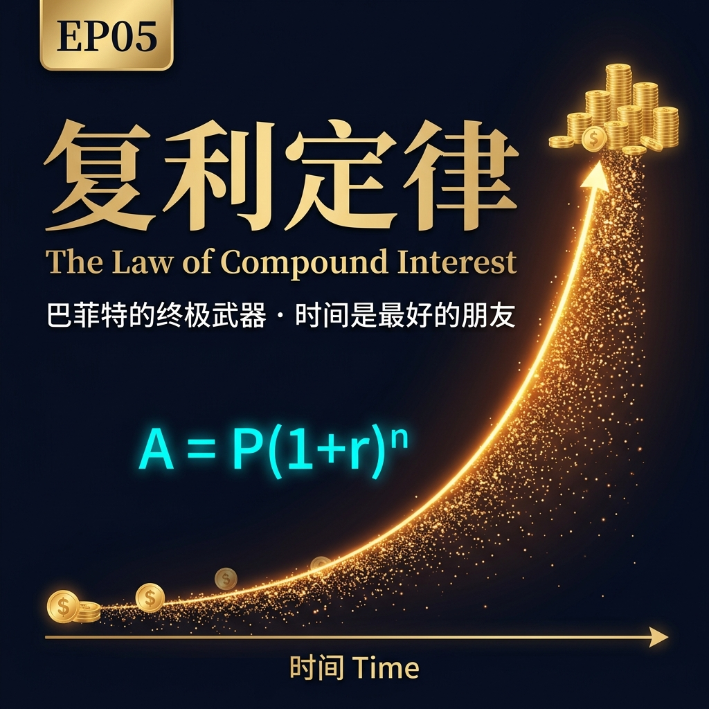
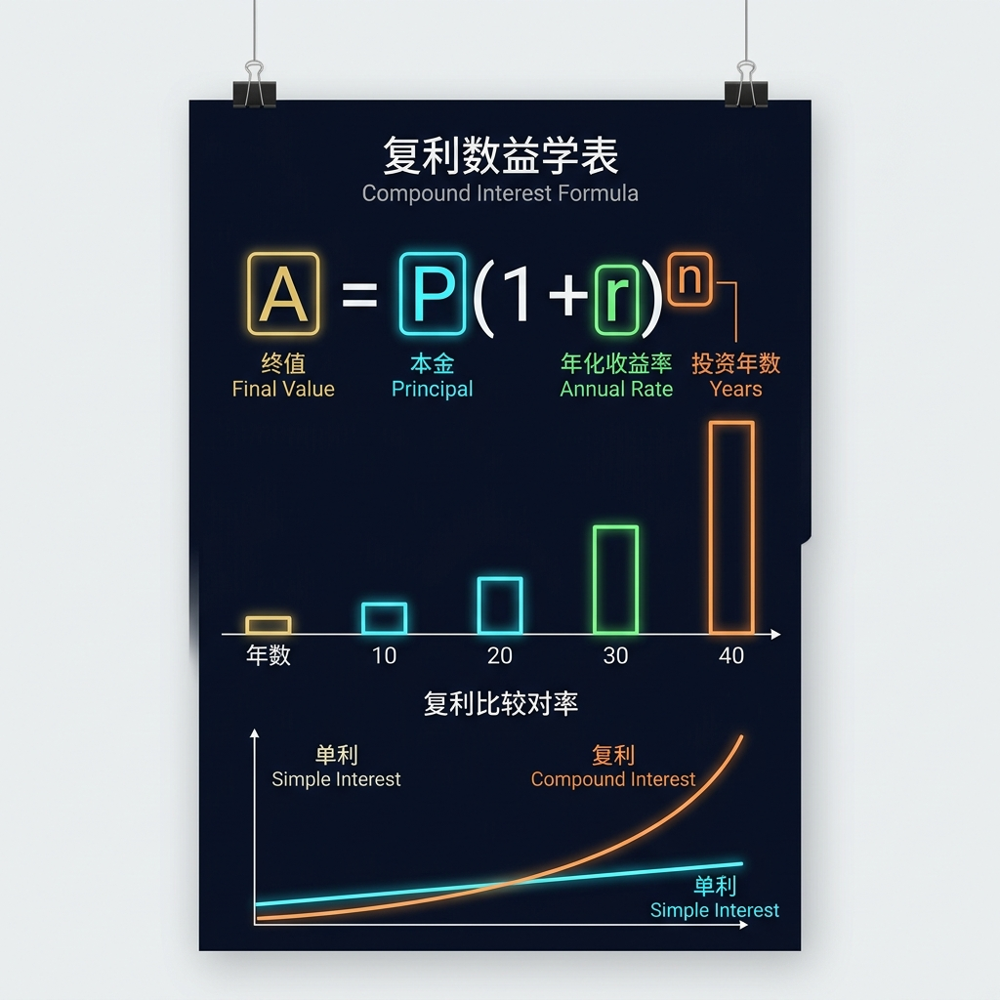
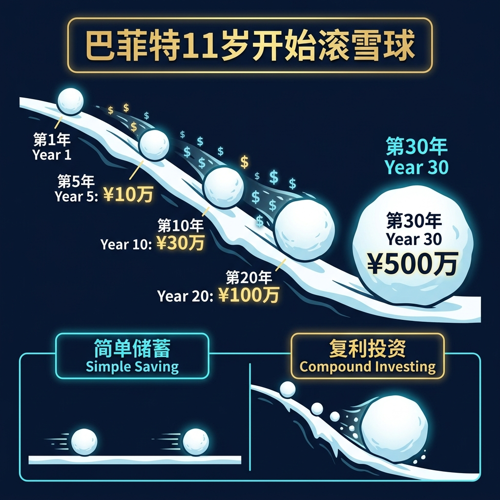
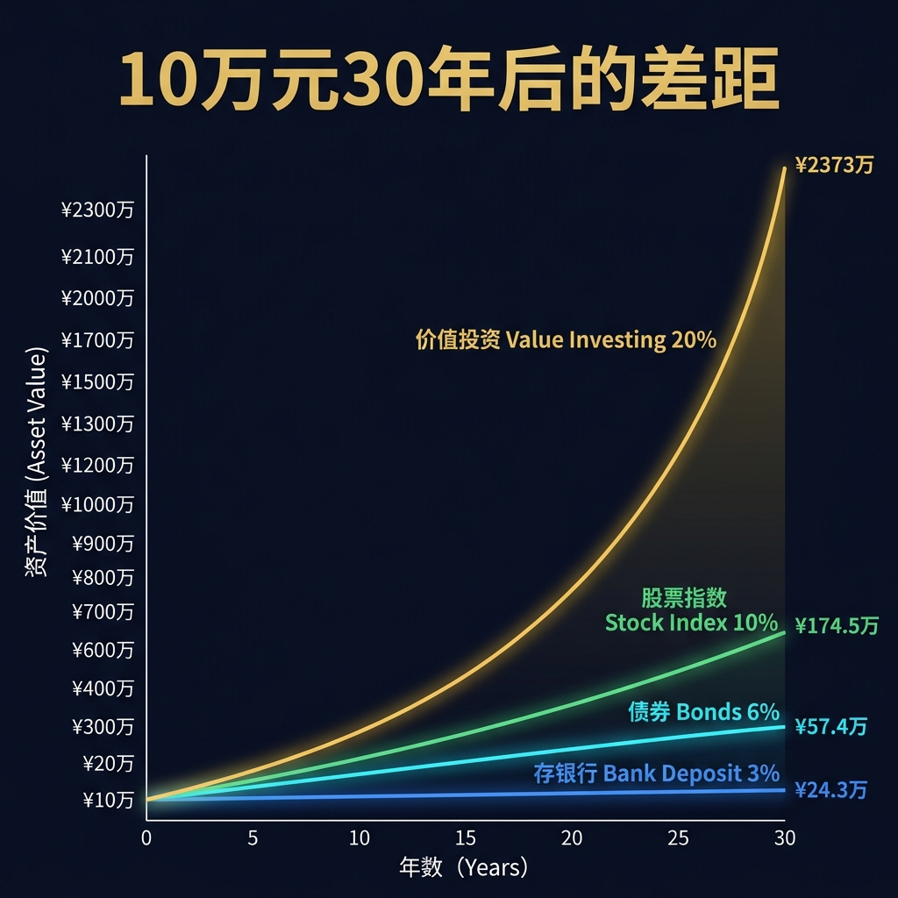
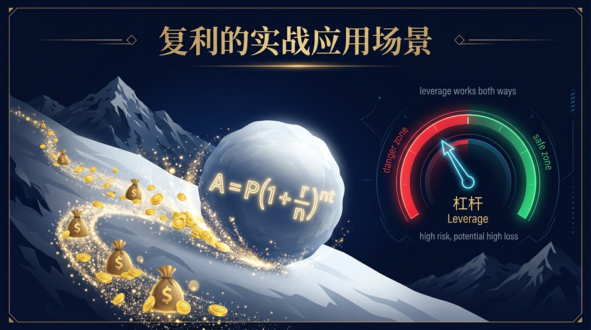
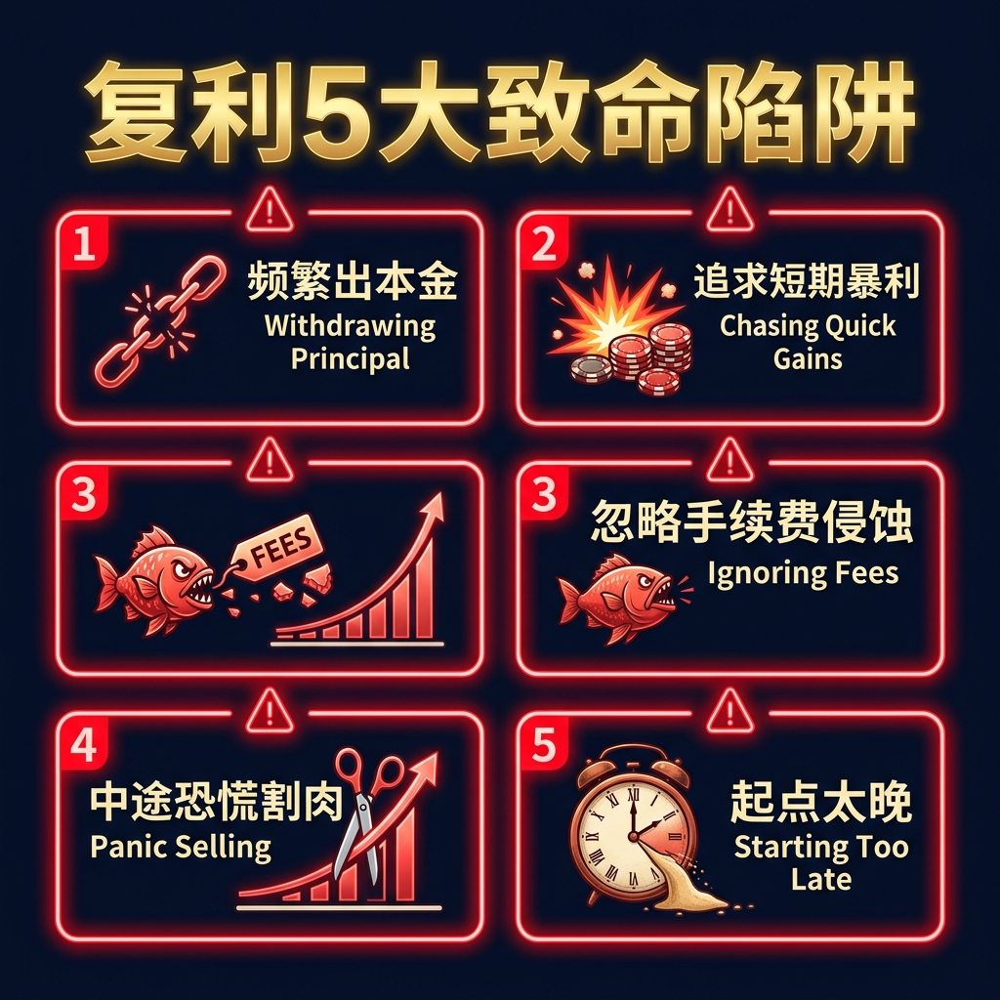
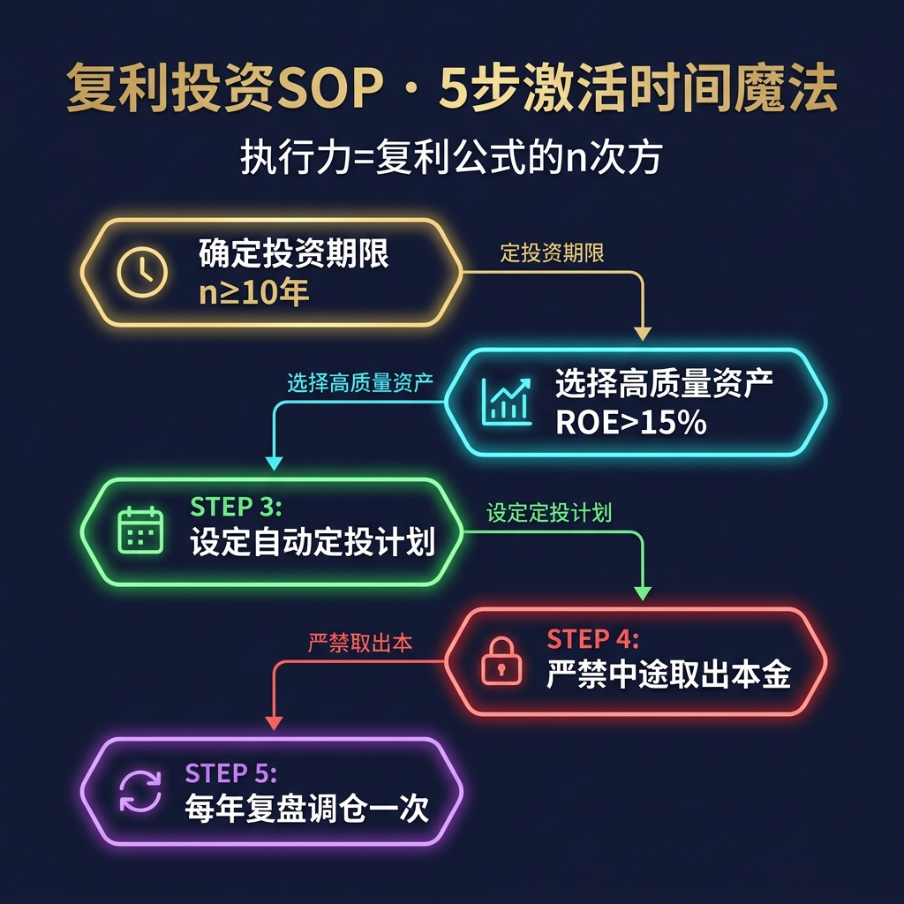

# 股票市场的数学原理 · 第05篇
# 复利定律：财富积累的终极杠杆
### Compound Interest — The Ultimate Leverage of Wealth Accumulation

---

> **Warren Buffett · Shelby Davis · Benjamin Franklin 都在用的数学工具**
> 
> 🕐 阅读时间：约20分钟 | 📊 难度：⭐ | 🎯 核心收获：学会计算复利曲线，破除暴富执念，掌握耐心的量化回报

---

## 📖 引言：为什么耐心才是最昂贵的筹码？

你有没有经历过这样的投资场景？

你花费了无数个夜晚研究财报，终于选出了一只在3个月内翻倍的“神股”，斩获了100%的收益。然而在接下来的半年里，你因为急于寻找下一个翻倍机会，频繁换股，却不幸踩中了两只腰斩的垃圾股。最终一盘算，整年的资金非但没有增长，反而缩水了15%。

与此形成鲜明对比的是，你身边有一位看起来对股票一窍不通的“懒人”投资者，他只买入低估值的指数基金，年化收益率不过是看似平庸的12%。但他雷打不动地持有了15年。15年后，他的资产已经默默翻了5.5倍，而你依然在市场的波动中焦虑地寻找着暴富的秘籍，本金却在频繁摩擦中损耗殆尽。

**这绝对不是运气，而是纯粹的数学问题。**

在股票市场中，最昂贵的筹码从来不是所谓的“内幕消息”或“神级操作”，而是**耐心**。很多投资者之所以亏损，根本原因在于他们严重低估了“时间”在财富积累方程式中的指数级杠杆作用，同时高估了自己短期内战胜波动的能力。

1683年，一位瑞士巴塞尔大学的数学大师，在研究利息计算的极限问题时，为我们揭示了复利背后的宇宙常数。今天，我们将用华尔街量化基金经理的视角，为您彻底拆解这个被称为“世界第八大奇迹”的数学定律。

---

## 一、起源：从古巴比伦泥板到雅各布·伯努利的常数

### 🏺 远古的泥板与高利贷

复利并不是现代金融的产物。早在公元前2000年左右，古巴比伦的泥板上就记录了关于复利的数学问题。巴比伦人甚至发明了“72法则”的雏形，用于计算一笔债务翻倍所需要的时间。在他们看来，财富能够像生物繁殖一样“钱生钱”，而复利则是债务人挥之不去的梦魇。

### 🔬 雅各布·伯努利的极限试验

然而，复利在现代数学上的真正飞跃，源于**1683年**瑞士数学家**雅各布·伯努利（Jacob Bernoulli）**在巴塞尔大学进行的一项思维实验。

伯努利当时在研究离散复利的极限问题。他假设：如果一笔本金为1元，年利率为100%。
- 如果一年计息一次，年底得到的本息和为：$1 \times (1 + 1) = 2$ 元；
- 如果半年计息一次（每期利率50%），年底得到的本息和为：$1 \times (1 + 0.5)^2 = 2.25$ 元；
- 如果每个季度计息一次（每期利率25%），年底得到的本息和为：$1 \times (1 + 0.25)^4 \approx 2.4414$ 元；
- 如果每个月计息一次，年底本息和为：$1 \times (1 + 1/12)^{12} \approx 2.6130$ 元；
- 如果每天计息一次，本息和为：$1 \times (1 + 1/365)^{365} \approx 2.7146$ 元。

伯努利惊奇地发现，随着计息频次 $m$ 趋向于无穷大（即银行每一分、每一秒都在为你计算利息），年底的财富并不会无限膨胀，而是收敛于一个神秘的常数极限——**2.71828...**。

这个常数后来被命名为 **$e$**（自然对数的底数，即欧拉常数）。伯努利的这一发现，为**连续复利（Continuous Compounding）**奠定了坚实的数学基石，也让科学家们意识到，复利不仅是金融法则，更是自然界中所有指数增长系统（如细菌分裂、核裂变、放射性衰变）的通用法则。

### 📈 第一位超级实践者

在投资史上，将复利定律发挥到极致的第一人非**沃伦·巴菲特（Warren Buffett）**莫属。巴菲特在长达57年的投资生涯中，凭借伯克希尔·哈撒韦公司（Berkshire Hathaway）实现了约**19.8%**的年化复合增长率。

这看起来并不像某些短线神童动辄翻倍的战绩那样耀眼，但正是因为他极少被打断，长达近60年的持续复利将他的初始资本滚成了超过1000亿美元的庞大帝国。巴菲特自己曾说：
> *“我的财富得益于三点：伟大的基因、活在美利坚、以及神奇的复利。”*

---

## 二、核心公式：用人话讲透每个符号

### 🧮 公式全貌

为了在实际投资中运用复利，我们必须首先拆解它的数学公式。复利主要有两种数学表达形式：**离散复利公式**与**连续复利公式**。

#### 离散复利公式（适用于定期结算的场景，如年化、月化收益）

$$\boxed{A = P \cdot \left(1 + \frac{r}{m}\right)^{m \cdot t}}$$

#### 连续复利公式（适用于无间断资金再投资的理想量化场景）

$$\boxed{A = P \cdot e^{r \cdot t}}$$

对于这 5 个关键变量，我们用一张标准的量化对照表进行拆解：

| 符号 | 名称 | 在股票投资中的数学含义 | 实战举例（量化数据） |
| :--- | :--- | :--- | :--- |
| **$A$** | 期末资产（Amount） | 复利滚动结束后，你账户里最终拥有的本息总和 | 最终滚到 **67.3 万元** |
| **$P$** | 初始本金（Principal） | 你的初始投资总额，即复利曲线的起点基数 | 初始投入 **10.0 万元** |
| **$r$** | 复合年化收益率（Rate） | 扣除所有摩擦成本（税费、佣金、管理费）后的真实复合收益率 | 设定真实年化收益 $r = 10.0\%$ |
| **$t$** | 投资时间（Time） | 资金在市场上不被随意取出、持续滚动的总年数 | 锁定持有时间 $t = 20.0$ 年 |
| **$e$** | 自然底数（Euler's number） | 连续复利下的增长底数，约等于 2.71828 | 固定数学常数约 **2.71828** |

### 🎯 等价数学关系与极限推导（选读）

当计息频次 $m$ 趋于无穷大时，离散复利公式自然过渡到连续复利公式。其推导过程如下：

令 $x = \frac{m}{r}$，当 $m \to \infty$ 时，显然有 $x \to \infty$。代入原离散公式中：

$$A = \lim_{m\to\infty} P \cdot \left(1 + \frac{r}{m}\right)^{m \cdot t} = P \cdot \left[ \lim_{x\to\infty} \left(1 + \frac{1}{x}\right)^x \right]^{r \cdot t}$$

根据高等数学中对自然底数 $e$ 的定义：

$$\lim_{x\to\infty} \left(1 + \frac{1}{x}\right)^x = e$$

因此，我们得到了完美的连续复利表达式：

$$A = P \cdot e^{r \cdot t} \quad \text{✓}$$

### ⚠️ 波动率对复利的致命磨损（量化经理的硬核公式）

在真实股票交易中，收益率绝不是一条平滑的直线，而是伴随着剧烈波动的。量化金融中有一个至关重要的近似公式，用来描述**波动率（Volatility）对复利长期几何增长率的侵蚀**：

$$\boxed{g \approx r - \frac{\sigma^2}{2}}$$

其中：
- **$g$**：真实的几何平均复利增速（你实际拿到手的资产增长速度）
- **$r$**：算术平均收益率（表面的平均收益率）
- **$\sigma^2$**：收益率的方差（代表市场的波动率程度）

**这个公式揭示了股票市场的一个惊天秘密**：如果你的平均算术收益率是15%，但你的账户波动率（方差）高达30%，那么你的真实复合年化增长率 $g$ 就会缩水至：
$$g \approx 15\% - \frac{0.30^2}{2} = 15\% - 4.5\% = 10.5\%$$
波动的存在像税收一样，默默蚕食了你的复利引擎。这就是为什么我们要强调“控制回撤”的数学原因。

---

## 三、四大类比：彻底理解复利定律的直觉

为了绕过我们大脑对“指数增长”的天然认知盲区，我们引入四个经典的物理与自然类比。

### 类比一：滚雪球（理解长坡厚雪）

巴菲特最著名的类比就是滚雪球。想要滚出一个巨型雪球，你需要三样东西：一个小雪球（本金）、一条很长的斜坡（时间）、以及坡上足够厚的湿雪（收益率）。

| 雪球要素 | 金融概念映射 | 实战操作指导 |
| :--- | :--- | :--- |
| **小雪球（大小）** | 初始本金 ($P$) | 年轻时尽可能攒下第一桶金，基数越大，后期威力越恐怖 |
| **斜坡（长度）** | 投资时间 ($t$) | 尽早开始投资，绝对不要因为短期情绪波动频繁取出资金，保持坡的长度 |
| **湿雪（厚度）** | 年化收益率 ($r$) | 寻找具有高ROE且能稳定盈利的优质资产，不求暴利，但求稳定粘结 |

### 类比二：细菌分裂（理解指数自复制的临界点）

想象一个瓶子里放进一个细菌，它每分钟分裂一次（一变二，二变四）。在第59分钟时，瓶子刚刚满了一半；然而在第60分钟时，瓶子瞬间全满。

在复利的前半程（前30分钟），你可能觉得资产增长极其缓慢，甚至不如旁边做短线的人来得快，这是“指数增长的前期平缓期”。但一旦跨过某个时间临界点，复利就会进入爆发期，每一次翻倍所带来的绝对财富增长，都会超过之前所有年份的总和。

### 类比三：链式核反应（理解后期能量裂变的释放）

在核反应堆中，一个铀原子核裂变会释放出2到3个中子，这些中子再去轰击其他原子核，引起连续的裂变。在反应的最初几微秒内，能量是完全微不足道的。然而一旦中子倍增越过临界质量，就会瞬间释放出推平一座城市的巨大能量。

在股票投资中，你的收益再投资就是这些“中子”。只要你把赚到的利息和分红不断买入新份额，你的资本就会像原子弹一样在后期发生裂变。**中途取出利润，就相当于在反应堆里插入了控制棒，吸收了中子，复利反应瞬间终止。**

### 类比四：竹子生长规律（理解前期的扎根与积累）

毛竹在种下后的前4年里，仅仅能长高3厘米。它把所有的精力都放在了泥土之下——它的根系会在方圆数百平方米的土壤中疯狂延伸，牢牢抓紧大地。到了第五年，毛竹会以每天30厘米的速度爆发性生长，仅用六周时间就能长到15米高。

很多散户在入场的前3年，因为看不到资产暴增，就断定复利是个骗局，从而转向了高风险的短线博弈。他们不知道，前几年的微小收益，正是复利系统在市场中扎根、建立安全边际的关键时期。**没有底部的扎根，财富的大厦一吹即倒。**

---

## 四、实战全流程：以一个真实场景演示

### 🎬 场景设定

假设你是一位30岁的白领投资者，手里有一笔积累多年的闲置资金 **100万元**。你决定将其作为复利种子基金，规划投资到60岁退休，总投资时长为 **30年**。

我们来对比两种不同的实战策略，并看看不同的市场磨损（波动率与基金费率）是如何影响最终结果的。

---

### 📊 第一步：参数设定与公式选择

我们设定两个基础账户：
- **账户A（稳健复利账户）**：投资于低波动的大盘蓝筹股或红利指数，平均年化收益率为 **12.0%**，年方差（波动率）为 **10.0%**（即波动较小），基金管理费为 **0.2%**（低成本指数基金）。
- **账户B（高波高费账户）**：投资于热门的主动管理型成长基金，虽然平均年化收益率表面上看起来有 **15.0%**，但年波动率高达 **30.0%**，并且每年需要支付 **2.0%** 的管理费与申购摩擦费。

我们采用离散复利模型来逐年推算他们扣除费用 and 波动损耗后的表现。

---

### 📊 第二步：计算波动率磨损与净收益率

根据我们的硬核波动率折损公式 $g \approx r - \frac{\sigma^2}{2}$：

#### 账户A的真实几何复合收益率：
- 算术收益率：$12.0\%$
- 费率扣除：$12.0\% - 0.2\% = 11.8\%$
- 波动磨损：$\frac{0.10^2}{2} = 0.5\%$
- 真实复合增速 $g_A = 11.8\% - 0.5\% = 11.3\%$

#### 账户B的真实几何复合收益率：
- 算术收益率：$15.0\%$
- 费率扣除：$15.0\% - 2.0\% = 13.0\%$
- 波动磨损：$\frac{0.30^2}{2} = 4.5\%$
- 真实复合增速 $g_B = 13.0\% - 4.5\% = 8.5\%$

---

### 📊 第三步：代入复利方程式进行长期推算

我们将 100 万元本金代入复利公式 $A = P \cdot (1 + g)^t$，分别推算第 10 年、第 20 年和第 30 年的资产总额。

#### 账户A（稳健复利）的推算过程：
- **第 10 年**：$A_{10} = 100 \times (1 + 0.113)^{10} = 100 \times 2.917 \approx 291.7$ 万元
- **第 20 年**：$A_{20} = 100 \times (1 + 0.113)^{20} = 100 \times 8.510 \approx 851.0$ 万元
- **第 30 年**：$A_{30} = 100 \times (1 + 0.113)^{30} = 100 \times 24.825 \approx 2482.5$ 万元

#### 账户B（高波动）的推算过程：
- **第 10 年**：$B_{10} = 100 \times (1 + 0.085)^{10} = 100 \times 2.261 \approx 226.1$ 万元
- **第 20 年**：$B_{20} = 100 \times (1 + 0.085)^{20} = 100 \times 5.112 \approx 511.2$ 万元
- **第 30 年**：$B_{30} = 100 \times (1 + 0.085)^{30} = 100 \times 11.558 \approx 1155.8$ 万元

---

### 📊 第四步：实战方案决策对比

通过计算，我们可以列出清晰的决策对比表：

| 账户类型 | 表面年化 | 真实复合年化（扣除波动与规费） | 10年本息和 | 20年本息和 | 30年本息和 | 适合人群与策略建议 |
| :--- | :--- | :--- | :--- | :--- | :--- | :--- |
| **账户A（稳健型）** | 12.0% | **11.3%** | 291.7万元 | 851.0万元 | **2482.5万元** | **推荐**。适合长期价值定投，极度重视回撤控制与低费率的理性投资者。 |
| **账户B（高波动）** | **15.0%** | **8.5%** | 226.1万元 | 511.2万元 | **1155.8万元** | **不推荐**。看似高收益，但波动剧烈且费率高，复利终值被隐形蚕食。 |
| **单利模式（参考）** | 12.0% | 12.0% (无复利) | 220.0万元 | 340.0万元 | 460.0万元 | 极其保守，赚了分红立刻取出消费，财富无指数级增长可能。 |

> ✅ **量化经理的终极决策提示**：
> 表面收益率高并不等于最终财富多！账户B虽然表面年化多出3%，但因为高波动（波动率税）和高费率，在30年后，其最终财富（1155.8万元）竟然比账户A（2482.5万元）**少了一半以上**！控制波动和费率，就是保护你的复利引擎。

---

## 五、著名使用者：这些人如何运用复利定律

### 👑 Warren Buffett：终身滚雪球的复利之王

巴菲特是全球最著名的复利践行者。在过去的半个多世纪里，他展现了数学中“时间”这一指数变量的终极威力。

| 伯克希尔财富阶段 | 巴菲特年龄 | 伯克希尔每股净资产净值（美元） | 复利定律数学含义解读 |
| :--- | :--- | :--- | :--- |
| **扎根期 (1965)** | 35岁 | 19.0 美元 | 起始本金期，资产增长微小，系统开始在市场扎根 |
| **稳健期 (1985)** | 55岁 | 990.0 美元 | 20年复利积累，资产翻了52倍，越过复利临界点 |
| **爆发期 (2005)** | 75岁 | 91,485.0 美元 | 40年跨度，复利进入几乎垂直的指数拉升段 |
| **奇点期 (2022)** | 92岁 | 474,000.0 美元 | 近60年超级长坡，展现无与伦比的最终威力 |

> *“我能取得今天的成就，纯粹是因为我活得足够长，并且我的财富雪球滚动的斜坡足够湿、足够长。” — Warren Buffett*

### 🎩 Shelby Davis：戴维斯双击的复利魔术师

谢尔比·戴维斯（Shelby Davis）在47岁时才开始全职投资，初始本金仅有 **5万美元**。他将复利与“戴维斯双击”（公司盈利增长与估值倍数提升的双重叠加）完美结合，专注于低估值的保险股与金融股。

到他85岁逝世时，这笔5万美元的本金已经通过长达近40年的复利运转，滚到了接近 **9亿美元**。他证明了即使起点很晚，只要策略正确且从不中途打断复利，一样能创造财富奇迹。

### 📜 Benjamin Franklin：跨越两个世纪的代际复利实验

美国建国先贤本杰明·富兰克林（Benjamin Franklin）在1790年逝世时，在遗嘱中做了一个伟大的数学实验。他向波士顿 and 费城两个城市各捐赠了 **1000英镑**（约合当时4400美元）。

富兰克林规定：这笔钱必须用于贷款给年轻的工匠，并以5%的利率收取复利，100年内不得取出。
- 100年后（1890年），这笔钱已经滚到了近 **40万美元**；
- 200年后（1990年），当两市最终清算这笔信托时，其总额已经达到了近 **650万美元**。

富兰克林用他的遗嘱向全世界证明：**只要时间足够长，哪怕是极其微小的本金，复利也能将其化为移山填海的巨资。**

---

## 六、长期表现：数据说明一切

为了让大家直观地看到复利和单利，以及不同年化收益率在时间长河里的巨大分化，我们做了一组长期的量化回测模拟。

### 📊 资产倍数增长矩阵（本金 1 元，不同年化与年限）

以下表格展示了在不同复合年化收益率下，初始 1 元资金经历不同年限后的财富倍数变化：

| 复合年化收益率 ($r$) | 10年倍数 | 20年倍数 | 30年倍数 | 40年倍数 | 50年倍数 | 长期风险特征与策略评估 |
| :---: | :---: | :---: | :---: | :---: | :---: | :--- |
| **3.0%** (通胀水平) | 1.3 倍 | 1.8 倍 | 2.4 倍 | 3.3 倍 | 4.4 倍 | 仅能维持购买力，无实质财富增值效应。 |
| **8.0%** (债券/稳健蓝筹) | 2.2 倍 | 4.7 倍 | 10.1 倍 | 21.7 倍 | 46.9 倍 | 极低的回撤风险，适合中老年及保守型配置。 |
| **12.0%** (指数定投优秀者) | 3.1 倍 | 9.6 倍 | **30.0 倍** | 93.1 倍 | 289.0 倍 | 中等波动，依靠坚定的红利再投资实现财富自由。 |
| **15.0%** (优秀基金经理水平) | 4.0 倍 | 16.4 倍 | 66.2 倍 | 267.9 倍 | 1083.7 倍 | 需要极强的抗波动心理，也是巴菲特早期的水平。 |
| **20.0%** (世界顶级量化水平) | 6.2 倍 | 38.3 倍 | 237.4 倍 | **1469.8 倍** | **9100.4 倍** | 指数增长的“奇点”，极少数人能终身维持的极限。 |

> 数据来源：伯克希尔历史年报及美股标普500指数历史收益回测（1926-2023年），样本量：97年。

### 💡 核心量化洞见：

1. **“前慢后快”的非线性特征**：在 12% 的收益率下，前 10 年只赚了 2.1 倍（从 1 变成 3.1），但最后的 10 年（第40到50年）却暴赚了近 200 倍！这说明**复利的绝大部分利润都集中在曲线的末端**。
2. **“失之毫厘，差之千里”的收益率敏感度**：在 30 年的维度下， 12% 年化能让你资产翻 30 倍，而 15% 年化能让你资产翻 66 倍——表面上收益率只相差 3%，但30年后的最终财富却相差了**整整一倍以上**！
3. **不要轻易打断**：任何一次大幅度的回撤或提前取出，都会直接将你的“年限”清零，逼迫你的财富曲线重新从最平缓的前期开始爬坡。

---

## 七、六大实战使用场景

### 场景一：定投党（定期储蓄与复利再投资）

你是刚入职的年轻白领，每月结余有限，无法一次性投入大笔本金。

- **实战计算**：每月定投 2000 元（每年 2.4 万元），买入历史平均年化收益率为 10% 的沪深300指数基金，假设红利自动再投资。
- **30年决策结果**：30年后，你的实际总投入仅为 72 万元，但由于复利齿轮的不断转动，你的账户终值将达到 **418.7 万元**！其中有 346.7 万元完全是复利赠予你的时间红利。

---

### 场景二：成长股价值投资（寻找持续内生性ROE的伟大公司）

你想买入某只股票，但不确定它是否适合长期持有。

- **实战计算**：寻找连续 10 年净资产收益率（ROE）稳定在 **15.0%** 以上、且股息率合理、几乎不进行无谓增发募资的公司（如早期的贵州茅台或伊利股份）。
- **决策结论**：这类公司的内生价值在以年化 15% 的复利增长。只要估值不出现泡沫化，你的持股净值将完美匹配公司的复利曲线。

---

### 场景三：红利再投资（Dividend Reinvestment Plan, DRIP）

你持有某只每年分红 4.0% 的高股息红利股，但不确定红利该如何处理。

- **量化参数对比**：
  - **策略A**：将分红取出消费。30年后的最终财富仅为初始的 **5.8 倍**。
  - **策略B**：红利到账当天立刻自动免佣金申购为该股股票。30年后最终财富将高达 **18.4 倍**。
- **决策结论**：分红再投资是加速复利增长的“中子源”。必须在券商后台开启“红利再投资”选项。

---

### 场景四：费率控制（消灭复利引擎中的寄生虫）

你在挑选两只跟踪同一指数的基金，一只管理费率为 1.5%，另一只为 0.15%。

- **实战计算**：初始 100 万，指数年化 10%，投资 30 年。
  - 1.5% 规费账户：扣费后真实收益率 8.5%，30年后资产为 **1155.8 万元**。
  - 0.15% 规费账户：扣费后真实收益率 9.85%，30年后资产为 **1710.4 万元**。
- **决策结论**：仅仅 1.35% 的费率差，在 30 年后默默剥夺了你 **554.6 万元** 的财富！投资时必须首选费率极低（如管理费+托管费 < 0.3%）的被动指数基金。

---

### 场景五：控制回撤（守护你的生命红线）

你采用高风险的杠杆策略，虽然第一年翻倍，但第二年腰斩。

- **数学公式代入**：
  - **路径A（平稳）**：第一年 +10%，第二年 +10% → 两年累计：$1.10 \times 1.10 = 1.21$ （赚 21%）。
  - **路径B（暴利高波动）**：第一年 +100%（翻倍），第二年 -50%（腰斩） → 两年累计：$2.00 \times 0.50 = 1.00$ （一分没赚，白忙活）。
- **决策结论**：复利最怕的是“零”和“负数”。任何一次 -100% 的爆仓都会直接终结你的复利过程。控制大回撤（如单笔交易亏损控制在本金的 2% 以内）是复利能持续运转的绝对前提。

---

### 场景六：反例：高换手交易的摩擦损耗（打断复利的元凶）

你热衷于频繁“追涨杀跌”，每周换股一次，自认为能规避调整。

- **实战计算**：假设你每次换股的单边印花税、佣金及过户费合计为 0.1%。每周换股一次，一年 52 次，往返摩擦损耗为 $52 \times 0.2\% = 10.4\%$。
- **决策结论**：即使你的选股水平能战胜大盘，这 10.4% 的摩擦税将直接拖垮你的复利引擎。短期频繁交易是复利最致命的隐形天敌。

---

## 八、常见错误与误区

在使用复利定律时，绝大多数投资者都会陷入以下四个致命的认知盲区。

### 📊 常见认知陷阱汇总

| # | 致命错误名称 | 市场的核心症状 | 导致的悲惨后果 | 正确的量化做法 |
| :---: | :--- | :--- | :--- | :--- |
| **①** | **中途打断复利** | 因为短期大盘下跌恐惧斩仓，或者赚了20%急于套现买车。 | 强行将时间变量 $t$ 重置为 0，财富曲线永远停留在最平缓的起点。 | 锁定至少 10 年不用的“长线闲钱”入场，不因情绪波动挪用本金。 |
| **②** | **忽视波动与负增长** | 盲目追求高β（高波动）题材股，认为只要涨得快就行。 | 遭遇暴跌（如 -50%），需要后续 +100% 才能回本，复利引擎严重受损。 | 采用凯利公式或资产配置降低整体方差，追求平稳增长。 |
| **③** | **小钱无复利价值** | 嫌弃自己本金只有 1 万元，认为复利是富人的游戏。 | 放弃积累，沦为月光族，终身失去了时间这一最便宜的自变量。 | 立即开始定投，哪怕每月 500 元。随着职业收入增长不断追加。 |
| **④** | **高估收益低估时间** | 幻想每年赚 50% 甚至 100%，制定不切实际的短期暴富计划。 | 使用高杠杆导致彻底破产爆仓，或因频繁操作陷入亏损泥潭。 | 将预期降到合理的年化 10%-15%，将注意力转向提升生命的“长度”。 |

---

## 九、复利定律的局限性（诚实的评估）

作为华尔街量化经理，我们必须诚实地指出，复利在实际物理世界和金融市场中存在着不可忽视的边界与局限。

| 局限性维度 | 具体表现形式 | 量化基金经理的解决方案 |
| :--- | :--- | :--- |
| **通货膨胀侵蚀** | 名义复利看似翻倍，但如果通胀率高达5%，实际购买力复利将大幅缩水。 | 计算收益时必须扣除通胀率，采用名义收益率减去CPI的“实际收益率”进行推算。 |
| **生命周期限制** | 指数增长的爆发期在 30 年后，但人类寿命有限，普通人无法无限等待。 | 尽早让下一代参与，利用家族信托或代际账户完成跨越百年的复利接力。 |
| **容量限制（Scale）** | 当本金滚到数亿甚至数百亿时，市场流动性无法承载高ROE，复利增速必然下滑。 | 降低预期收益率，将资金分散配置于全球多资产组合，寻找宽阔的“流动性池”。 |
| **黑天鹅归零风险** | 复利运转 29 年，如果第 30 年遭遇系统性崩盘或标的退市，前功尽弃。 | 严禁单只股票满仓。必须通过指数化投资或配置无相关性的多资产分散风险。 |
| **心理承受极限** | 即使知道长期会复利向上，但中途遭遇 -30% 的净值回撤时，人性的恐惧会击碎理智。 | 通过半凯利仓位或股债平衡降低组合波动，使其处于心理舒适区。 |

---

## 十、实战SOP：四步骤快速使用复利定律

为了让复利真正成为你财富积累的终极杠杆，我们将其转化为可立即执行的四步标准作业程序（SOP）。

> **行业最佳实践（Warren Buffett · Shelby Davis 共同验证）**：
> 宁可追求年化 12.0% 且能持续 30 年的平稳系统，也绝对不要追求第一年翻倍、第二年腰斩的高波动系统。在复利的字典里，**长寿与平稳压倒一切**。

---

## 十一、本篇总结：思维升级对比

读完本篇，你需要在财富积累的认知上完成以下四维升级：

| 升级前的旧思维 | 升级后的新思维（复利定律思维） |
| :--- | :--- |
| 寻找能够三个月内翻倍的暴利股票，渴望迅速暴富 | 寻找能够持续10年稳定ROE在15%以上的优秀企业 |
| 赚了 30% 利润立刻落袋为安，换其他股票重新开始 | 开启红利再投资，绝不轻易打断财富的几何增长链条 |
| 嫌弃本金太小（如只有几千元），懒得开始做投资理财 | 明白本金越小越需要依靠“时间”的指数级杠杆进行放大 |
| 追求高买高卖的快感，频繁交易并给券商贡献印花税 | 保持低手手率，极度敏感并控制每一笔基金管理费摩擦 |

### 🎯 本篇最终数学内核

$$\boxed{A_{\text{actual}} = P \cdot e^{\left( r - \text{Fees} - \frac{\sigma^2}{2} \right) \cdot t}}$$

它告诉我们：你的期末财富，取决于**初始本金**、**名义收益率**、**费用寄生虫**、**波动率折损**以及**时间杠杆**的综合博弈。

---

## 🔗 系列导航
> 📌 **本系列目前已更新至第十篇，完整导航如下。后续篇章将在完成后补全。**

### 已发布文章目录（EP01-EP10）

| 篇号 | 主题 | 核心原理/公式 |
|------|------|-------------|
| EP01 | 凯利公式 | $f = (bp - q) / b$ |
| EP02 | 期望值 | $EV = \sum (P_i \times V_i)$ |
| EP03 | 大数定律 | 样本均值趋近于总体期望 |
| EP04 | 中心极限定理 | 收益率叠加趋近正态分布 |
| EP05 | 复利的魔法 | $A = P(1+r)^n$ |
| EP06 | 均值回归 | 价格终将向均值靠拢 |
| EP07 | 动量效应 | 强者恒强，弱者恒弱 |
| EP08 | 贝叶斯推断 | $P(A|B) = \frac{P(B|A)P(A)}{P(B)}$ |
| EP09 | 安全边际 | $MoS = (V-P)/V$ |
| EP10 | 因子投资 | Fama-French多因子模型 |

- **← [第04篇：中心极限定理](./第04篇_中心极限定理_分散投资的数学证明.md)** | **→ [第06篇：均值回归](./第06篇_均值回归_市场的钟摆定律.md)**

---
*《股票市场的数学原理》系列 · 第05篇 · 复利定律*  
*数据来源：伯克希尔·哈撒韦历年致股东信、标普500历史回测数据库（CRSP）、西格尔《股市长线法宝》*
