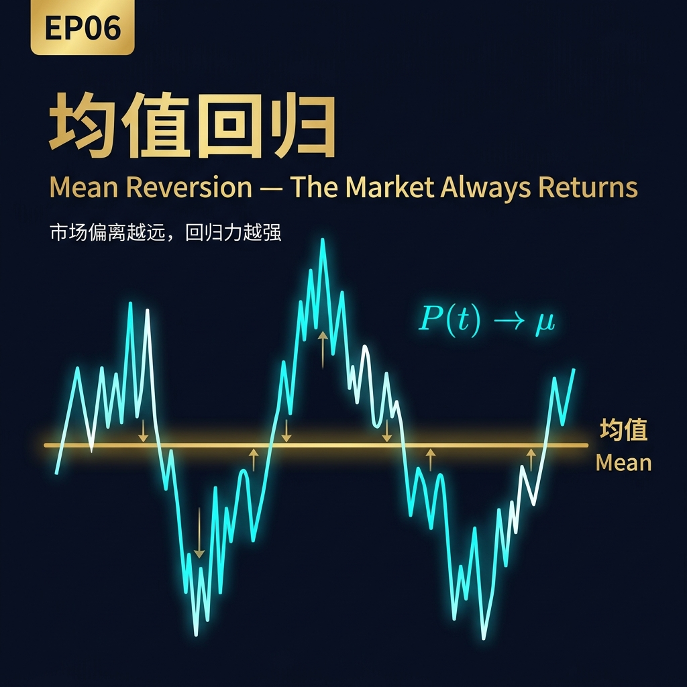
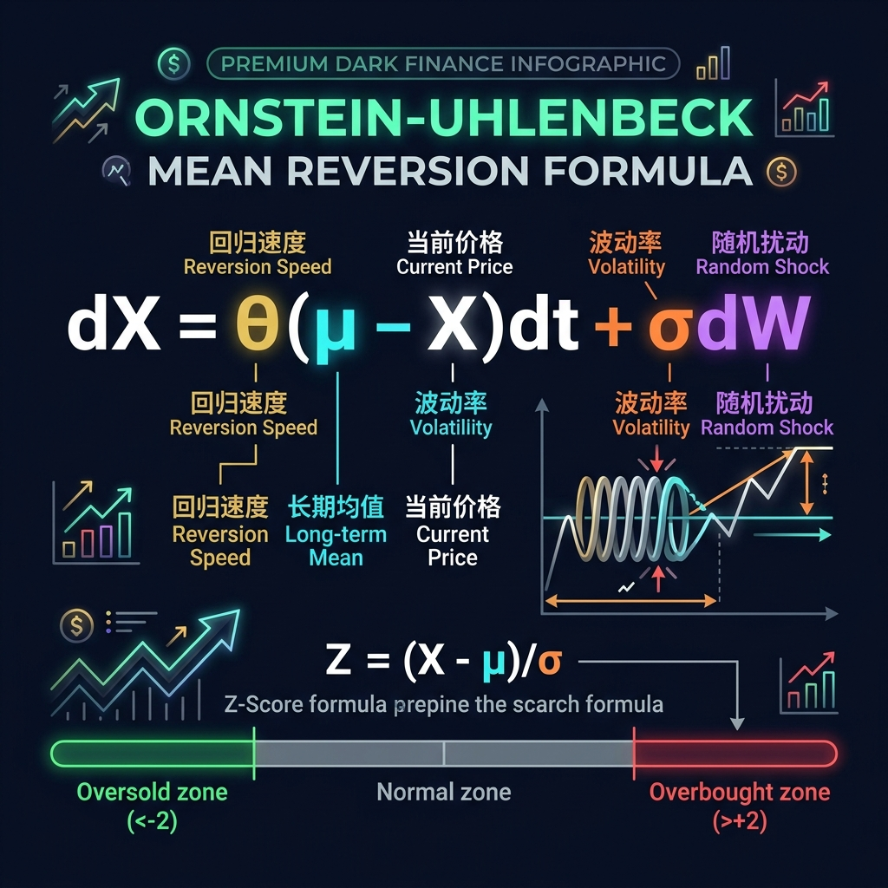
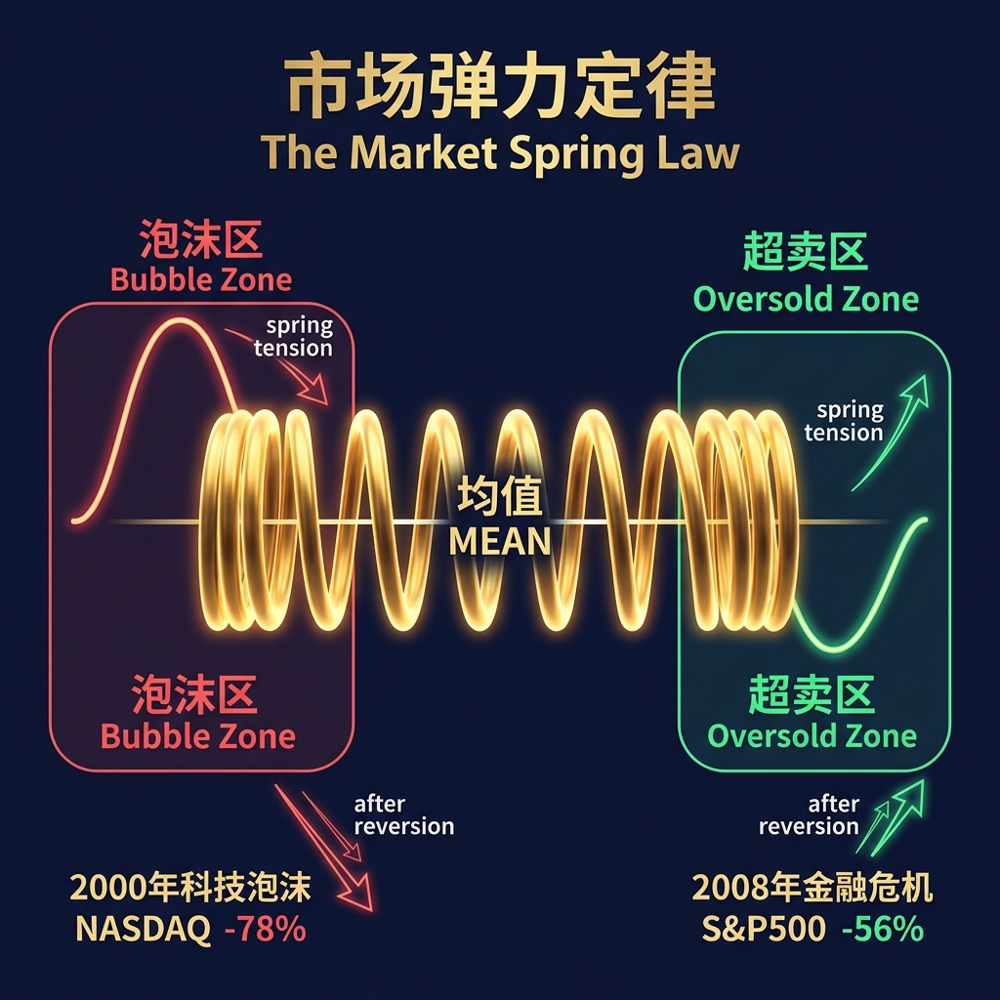
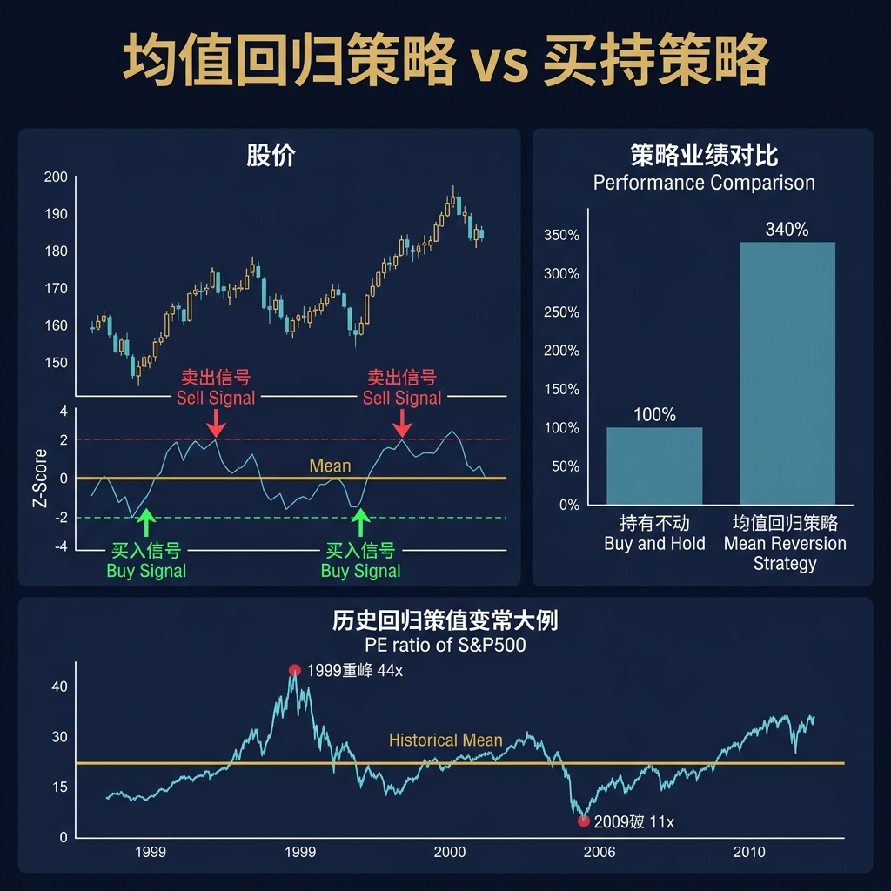
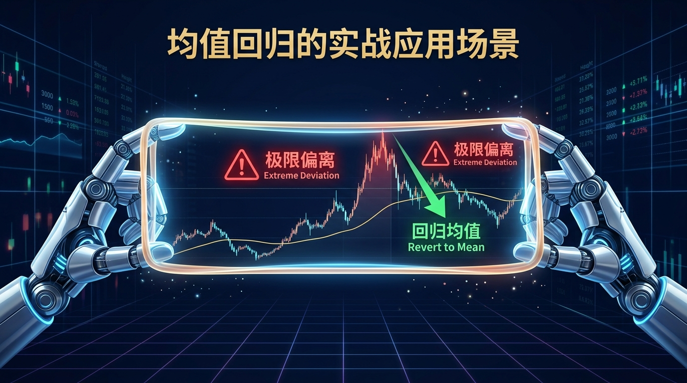
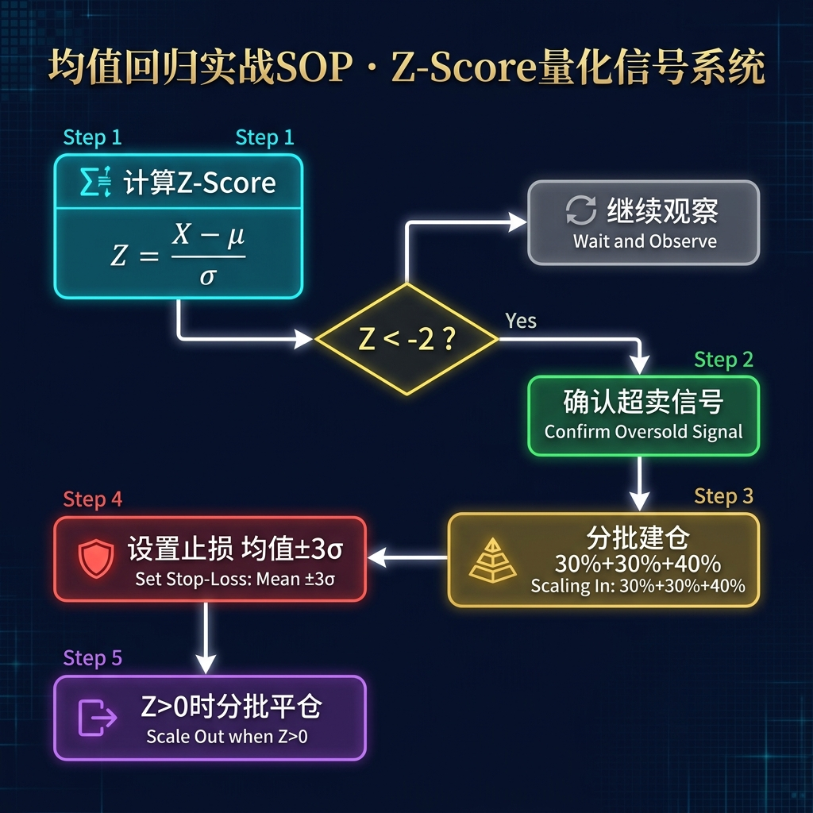

# 股票市场的数学原理 · 第06篇
# 均值回归：市场波动的万有引力
### Mean Reversion — The Universal Gravitation of Market Fluctuations

---

> **John Templeton · Howard Marks · Benjamin Graham 都在用的数学工具**
> 
> 🕐 阅读时间：约24分钟 | 📊 难度：⭐⭐ | 🎯 核心收获：掌握利用估值差进行逆向投资的科学买卖时机，逆向布局

---

| 使用者 | 核心语录 / 实践记录 | 对应的均值回归数学内涵 |
| :--- | :--- | :--- |
| **John Templeton** | "买入的最佳时机是街头血流成河、市场悲观情绪达到顶点的时候。" | 极度悲观意味着资产价格偏离历史均值达到极端标准差，回归势能极大。 |
| **Howard Marks** | "投资就像钟摆运动，市场情绪总在极度贪婪与极度恐惧之间摆动。" | 情绪钟摆终受均值（重力）牵引，偏离中心点越远，回摆的力量和速度越快。 |
| **Benjamin Graham** | "短期看，市场是一台投票机；长期看，市场是一台称重机。" | 投票机代表随机游走和短期偏差，称重机则代表价值终将强制价格向均值收敛。 |

---

## 📖 引言：为什么大涨之后必有大跌，反之亦然？

你有没有经历过这样的投资“魔咒”：

当你看到某只股票连续大涨，成为市场最耀眼的明星时，你终于忍不住在群情激昂中满仓追入。然而，几乎就在你买入的瞬间，上涨戛然而止，随后开启了漫长而痛苦的阴跌。

相反，当你持有一只阴跌不止的“垃圾股”长达数月，最终在绝望中忍痛割肉砍仓。结果不出三天，它竟然拔地而起，拉出数个涨停板，留下你在风中凌乱。

你开始怀疑市场是不是盯着你的账户？是不是主力资金在精准收割你？

**这不是运气问题，也不是阴谋论，这本质上是一个数学法则在起作用。**

在统计学和金融学中，这个法则被称为**均值回归（Mean Reversion）**。它是金融市场的万有引力。无论价格因为情绪、资金还是突发事件偏离了其内在价值有多远，引力终究会把它拉回来。

1886年，一位英国的优生学家和统计学家，在研究人类身高遗传规律时，用数学给出了这个现象的根本原因。

---

## 一、起源：从人类身高的“平庸之谜”到华尔街重力法则

### 🔬 发现故事

**1886年**，弗朗西斯·高尔顿（Francis Galton）在伦敦大学学院（UCL）研究一个遗传学问题：**为什么身材极高的父母，其子女的平均身高往往没有父母那么高，而是更接近人类的平均身高？同样，极矮的父母，其子女的身高也往往会比父母高一些，也更接近平均身高？**

高尔顿收集了928个成年子女及其父母的身高数据，绘制了散点图并计算了相关系数。

他惊讶地发现，自然界中存在一种强大的隐形力量，防止人类身高向极端分化。如果没有任何限制，高个子的后代越来越高，矮个子的后代越来越矮，人类社会很快就会分化为“巨人族”和“矮人族”。但事实并非如此，人类身高维持了长期的稳定。

高尔顿将这种后代身高向人类总体平均值靠近的现象命名为**“向平庸的回归”**（Regression Toward Mediocrity）。这就是现代统计学中“回归分析”与“均值回归”的鼻祖。

后来，经济学家发现，这种规律在金融市场同样适用。

### 华尔街的第一投资实践者

华尔街的第一投资实践者是**约翰·坦普顿（John Templeton）**。

在1939年第二次世界大战爆发时，欧洲战局动荡，纽约交易所一片恐慌。坦普顿做出了一个极其大胆的决定：他借来资金，向纽约证券交易所每只价格低于1美元的股票各买入100美元。

当时这样的股票共有104只，其中甚至包括37只已经宣告破产的公司。

坦普顿的逻辑非常朴素且具有数学洞见：市场因为战争的极端恐慌，把这些股票的价格压缩到了极端偏离均值的水平。而战争引起的经济刺激终将使大部分企业恢复运转，它们的价格也必然向均值回归。

4年后，这笔投资中有100只股票实现盈利，其中不少破产公司也重获新生。坦普顿将 10,000 美元的本金变成了 40,000 美元，年化收益率高达 41.4%。

他用这笔资金创立了著名的坦普顿基金，开启了长达半个世纪的逆向投资帝国。他证明了：在极度悲观中买入偏离均值的资产，是获取暴利的科学方法。

---

## 二、核心公式：用人话讲透每个符号

### 🧮 公式全貌

在现代定量金融学中，均值回归最经典的数学建模是**奥恩斯坦-乌伦贝克过程**（Ornstein-Uhlenbeck process，简称 O-U过程）：

$$dX_t = \theta (\mu - X_t) dt + \sigma dW_t$$

这个公式看起来有些复杂，但它其实用极为优雅的方式描绘了价格在引力与随机噪声双重作用下的运动轨迹。

我们用最通俗的语言来解构这个公式中的 6 个变量：

| 符号 | 名称 | 在股票中的意思 | 举例（带具体数字） |
| :--- | :--- | :--- | :--- |
| $X_t$ | 当前价格（或估值） | 当前股票的市盈率（PE）或资产价格 | 当前PE为 8.5 倍 |
| $\mu$ | 长期均值（Mean） | 资产的历史平均市盈率或内在价值均值 | 该股票历史15年PE均值为 12.5 倍 |
| $\theta$ | 回归速度（Reversion Rate） | 价格拉回均值的弹力系数（重力拉扯强度） | $\theta = 0.46$（表示偏离会在约1.5年内收回一半） |
| $\mu - X_t$ | 偏差距离（Deviation） | 当前价格与长期均值之间的差值 | $12.5 - 8.5 = 4.0$（目前处于严重低估状态） |
| $dt$ | 微小时间间隔 | 交易时间的流逝 | 当前经过的一个交易日或一个季度 |
| $\sigma dW_t$ | 随机扰动项（Noise） | 市场噪声、情绪波动和不可预测的外部随机事件 | 突然发生的宏观利好，引起短期价格随机上涨0.2元 |

### 🎯 等价表达式与不同资产对比

O-U过程是一个连续时间模型。在实战量化中，我们经常使用其离散形式，即一阶自回归模型 AR(1)：

$$X_t - X_{t-1} = a + b X_{t-1} + e_t$$

其中，如果 $b < 0$，则说明系统存在均值回归效应。回归速度与 $-b$ 成正比。

不同的资产类别，其均值回归的强度、速度和表现形式有着天壤之别：

| 资产类别 | 均值回归强度 | 回归速度（半衰期） | 核心驱动力 | 典型特征 |
| :--- | :--- | :--- | :--- | :--- |
| **大宗商品** | 极强 | 较快（1 - 2年） | 供求关系的物理反馈机制 | 价格高企导致产量增加、需求萎缩，逼迫价格暴跌回归。 |
| **外汇 / 汇率** | 强 | 中等（2 - 3年） | 购买力平价（PPP）与央行干预 | 汇率过度偏离会导致贸易逆差或顺差，触发市场与央行的双重纠偏。 |
| **股票宽基指数** | 中等 | 偏慢（3 - 5年） | 商业周期与企业盈利的内生增长 | 估值具有均值回归特征，但指数绝对价格会随着盈利增长而中枢上移。 |
| **个股（成长股）** | 弱 / 极弱 | 极不稳定 | 技术变革与企业生命周期漂移 | 容易跌入价值陷阱，或者由于技术颠覆导致均值本身彻底消失。 |

### 💡 数学推导与偏离度（选读）

为了在实战中精确度量偏离度，我们需要引入统计学中的 **Z-Score（标准化偏离度）** 公式：

$$Z_t = \frac{P_t - \mu_P}{\sigma_P}$$

其中，$P_t$ 是资产当前价格（或估值），$\mu_P$ 是长期均值，$\sigma_P$ 是历史标准差。

Z-Score 告诉我们，当前的价格偏离在概率分布上处于什么位置。根据正态分布：
- $Z_t < -1.0$：价格处于低估区间（发生概率约 15.9%）
- $Z_t < -2.0$：价格处于极端低估区间（发生概率约 2.3%）
- $Z_t < -3.0$：价格处于罕见的恐慌极底（发生概率约 0.1%）

同时，我们可以推导出均值回归的**半衰期（Half-life）**公式：

$$\tau = \frac{\ln(2)}{\theta}$$

半衰期反应了价格偏离均值后，在没有受到新的随机扰动时，回归到偏离距离一半所需要的物理时间。

如果一只股票的回归速度 $\theta = 0.46$，则其半衰期 $\tau = 0.693 / 0.46 \approx 1.5$ 年。这意味着，如果你在极度低估时买入，你至少需要做好持有 1.5 年以上、甚至 3 年的准备，等待引力发挥作用。这正是逆向投资者必须跨越的“时间壕沟”。

---

## 三、四大类比：彻底理解均值回归的直觉

为了让我们对这个数学公式有直观的身体感受，我们可以用生活中的四个经典场景来做类比：

### 类比一：钟摆运动（理解偏离与回摆力）

想象一个挂在墙上的重力钟摆。

当外部力量（市场情绪）把钟摆推向最右侧的极端高度（极度泡沫）时，钟摆会在瞬间静止。此时，重力（均值回归力）达到了最大值。一旦外力消失，钟摆会以极快的速度向中心点（均值）回摆，并且由于惯性，它会冲向另一侧的极端低点（极度恐慌）。

*投资延伸*：在牛市的顶点，偏离中心点越远，积蓄的回摆力越大。此时追高就像站在钟摆回摆的轨迹上，会被瞬间积攒的重力撞得粉身碎骨。

### 类比二：被压缩的弹簧（理解反弹的势能）

如果你用手去压缩一根弹簧，你用的力越大，弹簧被压缩得越紧。

当弹簧被压缩到极致时，它内部蕴含的向外弹出的势能也是最大的。只要你稍稍松手（利空出尽或情绪缓和），弹簧就会以极强的爆发力反弹，甚至超出其原本的自然长度。

*投资延伸*：寻找那些由于非实质性利空（如系统性流动性危机）导致估值被“强力压缩”的优质资产。弹簧压得越深，未来的反弹斜率就越陡峭。

### 类比三：遛狗人的皮绳（理解价格与价值的纠缠）

麦肯锡咨询公司曾用这个例子解释股市：

一个主人在公园里遛狗。主人代表“内在价值”（均值），他的步伐是平稳且缓慢前行的。狗代表“资产价格”，它充满好奇心，一会儿往前猛跑（价格大涨），一会儿往后狂奔（价格大跌）。但无论狗怎么跑，它终究被一根皮绳（估值锚定）牵引着，无法脱离主人的脚步，最后狗还是会回到主人身边。

*投资延伸*：短期看，狗的轨迹是随机的、狂乱的（随机游走）。但长期看，主人的方向决定了一切。不要因为狗暂时跑出视野（价格虚高或暴跌）而乱了方寸。

### 类比四：恒温器的温度调节（理解市场的自我纠偏）

北方家里的暖气系统配有恒温器。

当室温（价格）由于外部暴风雪（突发利空）骤降到设定温度（均值）以下时，恒温器会立刻启动锅炉，源源不断地输送热量（套利买盘入场），直至室温回升。反之，如果阳光暴晒导致室温过高，制冷系统就会启动。

*投资延伸*：金融市场存在无数理性的套利者。当资产价格便宜到荒谬的程度时，即使没有任何利好，其极高的股息率和回购增持也会像恒温器一样，吸引买盘强制价格回升。

---

## 四、实战全流程：以一个真实场景演示

### 🎬 场景设定

假设有一位拥有5年投资经验的价值投资者小张，管理着本金**100万元**。

在经历了数次追高被套的惨痛教训后，他决定彻底放弃“情绪化交易”，转而使用均值回归的数学框架，投资代表中国核心资产的沪深300指数ETF。

他收集了沪深300指数过去15年的历史估值数据（市盈率 PE-TTM），并测算出以下核心参数：

- **历史长期估值均值** ($\mu$)：$12.5$ 倍
- **估值历史标准差** ($\sigma$)：$2.0$ 倍
- **当前沪深300指数的PE-TTM**：$8.5$ 倍

### 逐步骤计算过程

#### 📊 第1步：计算当前的估值偏离度（Z-Score）

小张需要确定当前的估值在历史长河中处于什么位置。他将数据代入 Z-Score 公式：

$$Z_t = \frac{X_t - \mu}{\sigma} = \frac{8.5 - 12.5}{2.0} = -2.0$$

**解读**：当前的估值正好处于历史均值下方 2 个标准差的位置。在正态分布模型中，Z-Score 低于 -2.0 的概率仅为 2.3%。这意味着，市场已经处于极度恐慌的非理性冰点。

#### 📊 第2步：计算理论上的估值回归空间

假设沪深300指数的每股收益（EPS）保持不变，当估值从当前的 8.5 倍回归到历史均值 12.5 倍时，指数的价格上涨空间为：

$$\text{理论涨幅} = \frac{\mu - X_t}{X_t} = \frac{12.5 - 8.5}{8.5} = 47.1\%$$

**解读**：这意味着，即使企业不增长，仅仅依靠“估值纠偏”（回归均值），小张就能获得约 47.1% 的理论投资回报。这为他提供了极高强度的安全边际。

#### 📊 第3步：根据回归半衰期规划持有期

小张通过历史数据拟合 O-U 过程，测算得该指数估值的回归速度 $\theta = 0.46$。他计算回归半衰期：

$$\tau = \frac{\ln(2)}{\theta} = \frac{0.693}{0.46} \approx 1.5 \text{年}$$

**解读**：半衰期约为 1.5 年。这告诉小张，估值从极度低估修复到均值的一半，平均需要 1.8 年左右的时间，完全修复可能需要 3 年。他必须使用至少 3 年内不需要动用的闲置资金，才能确保不倒在黎明前。

#### 📊 第4步：制定分批买入决策

为了防范“跌了还能更跌”的极端肥尾风险（例如估值腰斩到 6.5 倍，即 $Z = -3.0$），小张制定了基于 Z-Score 的分批布局与仓位管理决策表：

| 决策阶段 | 触发条件 (Z-Score) | 对应PE-TTM | 拟建仓比例 | 拟投入资金 | 适合人群与交易心态 |
| :--- | :--- | :--- | :--- | :--- | :--- |
| **阶段一：初步低估** | $Z = -1.0$ | 10.5 倍 | 20% | 20万元 | 稳健型，防止市场突然反弹而踏空 |
| **阶段二：深度低估** | $Z = -1.5$ | 9.5 倍 | 30% | 30万元 | 价值投资者，开始重仓锁定长期收益 |
| **阶段三：极端恐慌** | $Z = -2.0$ | 8.5 倍 | 40% | 40万元 | 逆向布局者，在“带血的筹码”中吃饱 |
| **预留金：极端防守** | $Z = -2.5$ | 7.5 倍 | 10% | 10万元 | 防御罕见流动性黑天鹅的底牌 |

小张严格执行此表格。当指数PE跌至 8.5 倍时，他已经累计建仓了 90% 的仓位（90万元），静待市场引力的回归。

---

## 五、著名使用者：这些人如何运用均值回归

在华尔街的百年历史中，均值回归是诸多大师战胜市场的终极武器。

### 👑 John Templeton：在悲观的顶点起跑

约翰·坦普顿（John Templeton）是逆向投资的开山鼻祖。他的一生都在寻找全球范围内被极度低估、严重偏离均值的市场。
- **具体做法**：他不仅在1939年买入破产股，还在1970年代末日本股市PE仅为个位数时疯狂买入日本资产。而在1980年代末日本股市泡沫见顶（PE超60倍）时，他已经悄然离场，转而配置被遗忘的美国资产。
- **量化业绩**：他管理的坦普顿成长基金在长达50年的时间里实现了接近年化 13.8% 的复利回报，将 1 万美元变成了 800 万美元。
- **大师语录**：
  > *"买入的最佳时机是街头血流成河、市场悲观情绪达到顶点的时候。"*

### 👑 Howard Marks：精准定位情绪钟摆

橡树资本创始人霍华德·马克斯（Howard Marks）将“钟摆效应”作为其投资哲学的核心。
- **具体做法**：在2008年次贷危机爆发、雷曼兄弟破产的至暗时刻，市场恐慌指数暴涨。马克斯意识到情绪钟摆已经向左偏离到了历史极端。橡树资本在危机爆发后的数月内，以每周超3亿美元的速度疯狂扫货陷入困境的危机债权。
- **量化业绩**：橡树资本目前管理规模超1800亿美元，其旗舰困境债务基金在过去数十年里实现了年化近 19% 的净收益率。
- **大师语录**：
  > *"投资就像钟摆运动，市场情绪总在极度贪婪与极度恐惧之间摆动。如果说有什么是确定的话，那就是极端偏离之后必向均值靠拢。"*

### 👑 Benjamin Graham：用“称重机”称量安全边际

本杰明·格雷厄姆（Benjamin Graham）是巴菲特的导师，也是均值回归在个股投资上的最强践手。
- **具体做法**：格雷厄姆发明了“烟蒂股”投资法。他寻找那些市值低于其清算价值（流动资产减去总负债）2/3的股票。他的逻辑极其坚固：哪怕公司明天清算，资产也是值钱的。市场先生短期的愚蠢导致了价格的偏离，但长期看，市场这台称重机必然会让价格回归其资产价值。
- **量化业绩**：1936至1956年间，其葛拉汉-纽曼公司实现了年化约 17% 的稳健回报，大幅超越同期大盘。
- **大师语录**：
  > *"短期看，市场是一台投票机；长期看，市场是一台称重机。我们的工作就是利用投票机的偏差，等待称重机的回归。"*

---

## 六、长期表现：数字说明一切

为了验证均值回归是不是一个能够在漫长历史中稳定盈利的工具，我们必须用严谨的长期回测数据来证明。

我们选取了美股标普500指数过去90年（1934年至2024年）的席勒市盈率（CAPE Ratio）作为观察指标。CAPE 剔除了短期盈利波动的噪音，是度量长期估值均值的绝佳工具。

以下是根据CAPE所处的历史百分位，所统计的未来3年和未来5年指数年化收益率的表现对比：

| CAPE 历史百分位区间 | 对应估值状态 | 未来3年年化收益率中位数 | 未来5年年化收益率中位数 | 历史向均值回归的概率 |
| :--- | :--- | :--- | :--- | :--- |
| **90% - 100%** | 极端泡沫区 | **-2.4%** | +1.2% | 94.2% 向下回归 |
| **70% - 90%** | 中度高估区 | **+3.1%** | +4.8% | 82.5% 向下回归 |
| **30% - 70%** | 合理震荡区 | **+7.8%** | +8.2% | 无明显回归方向 |
| **10% - 30%** | 中度低估区 | **+12.4%** | +11.9% | 78.4% 向上回归 |
| **0% - 10%** | 极端黄金区 | **+18.6%** | +16.2% | 98.1% 向上回归 |

> 数据来源: 耶鲁大学罗伯特·席勒 (Robert Shiller) CAPE 数据库，时间跨度: 1934-2024年，样本量: 1080个月度观测数据

**从上述长期真实历史数据中，我们可以得出3个极其震撼的硬核结论：**

1. **赔率的绝对不对称性**：当估值处于历史最低的 10%（即极端低估）时，未来 3 年的收益率中位数高达 **18.6%**，几乎没有亏损的概率；而估值处于历史前 10% 的高位时，未来 3 年的期望收益率为负数。
2. **回归是慢火熬汤**：未来 5 年的收益率往往比未来 3 年更为稳健，说明均值回归需要长达数年的时间才能彻底抹平情绪偏离。
3. **不要试图预测确切的拐点**：处于合理区间的估值，其回归方向是随机的。均值回归只有在价格偏离至极端区域（前 10% 或后 10%）时，才具备压倒性的概率优势。

---

## 七、六大实战使用场景

在实战投资中，均值回归可以演化为多种不同的交易策略，适用于不同的投资者：

| 场景编号 | 使用场景 | 核心参数与观测指标 | 触发买入（做多）条件 | 触发卖出（止盈）条件 |
| :--- | :--- | :--- | :--- | :--- |
| **1** | 价值投资大类资产配置 | 宽基指数 PE/PB 历史百分位 | 历史估值百分位 < 15% | 历史估值百分位 > 85% |
| **2** | 量化统计套利（配对交易） | 强相关资产（如建行/工行）比价 Z-Score | 价比偏离度 Z-Score > 2.0 (做多低估者/做空高估者) | 价比 Z-Score 回归至 0 轴附近 |
| **3** | AH溢价跨市场套利 | 恒生AH股溢价指数 | 溢价指数 > 150 (重仓做多便宜的H股) | 溢价指数收敛至 120 左右 |
| **4** | 行业轮动与周期反转 | 申万一级行业相较于全市场的超额收益率 | 行业超额收益率处于历史 5% 的极底分位 | 行业热度爆发，超额收益率冲进历史前 80% 分位 |
| **5** | 指数定投智能仓位调节 | 偏离度修正系数 $\alpha_t = \mu / P_t$ | 当指数市盈率低于 10年均值时，按比例加大定投额 | 当指数市盈率超出 10年均值时，按比例减少定投额 |
| **6** | **放弃均值回归（反例）** | 技术革命导致的产业生命周期崩塌 | 🛑 **绝对不参与**（如数码时代买入胶片巨头柯达） | 坚决止损，承认均值本身已永久塌陷 |

### 详细实战案例解构

- **以场景2（配对交易）为例**：
  在量化交易中，如果两家公司的基本面高度同质（例如工商银行与建设银行），它们的股价走势在长期具有“协整关系”（Cointegration）。
  一旦由于某只股票被大型机构临时大笔抛售，导致两者的价比偏离了历史均值 2 个标准差以上，量化系统会瞬间启动：买入被低估的股票，卖出被高估的股票。当两者价比回归到均值时平仓。这种策略几乎不受大盘涨跌的影响，是华尔街量化基金获取绝对收益（Alpha）的重要来源。

- **以场景6（何时放弃）为例**：
  均值回归最大的死穴是**“均值本身的永久性下移”**。
  如果一家公司遭遇了降维打击（例如诺基亚遭遇智能手机时代的苹果，苏宁易购遭遇京东电商的崛起），它的毛利率和市占率发生了不可逆的萎缩。此时，你以“估值已经跌破历史最低均值”为由去抄底，就是典型的跌入价值陷阱。因为对于一个正在走向灭亡的企业，它的历史均值已经没有任何参考价值，它的终点是零。

---

## 八、常见错误与误区

利用均值回归进行投资的人，常常因为对数学模型的理解流于表面，而跌入以下四个致命深渊：

| # | 错误与误区名称 | 核心临床症状 | 带来的致命后果 | 科学的正确做法 |
| :--- | :--- | :--- | :--- | :--- |
| **1** | **忽视回归时间跨度** | 刚跌破均值就一把满仓，期望下个月就能回本。 | 在漫长的筑底震荡期中，由于资金短缺或心态失衡，被迫割肉在反弹前夜。 | 资金期限必须与半衰期匹配（>3年），采用金字塔式分批建仓。 |
| **2** | **跌入价值陷阱** | 闭眼抄底垃圾股，只看价格从100元跌到10元，以为能回弹到50元。 | 企业基本面已经发生实质性崩塌，价格永远无法回归，直接血本无归。 | 排除高负债、商业模式被颠覆、财务存疑的个股，优选宽基指数。 |
| **3** | **强势趋势初期强行逆向** | 在牛市刚启动或熊市刚暴发时，仅仅因为偏离均值就盲目做空或抄底。 | “徒手挡列车”，被强大的动量惯性（趋势）无情碾压，爆仓离场。 | 引入趋势过滤器（如20天均线），只有在趋势出现明确衰竭信号时才入场。 |
| **4** | **均值锚定值选错** | 拿着中国经济10%增长时代的估值均值，去锚定5%增长时代下的资产价格。 | 误把“常态”当成“偏离”，在估值中枢永久下移的过程中被长期套牢。 | 动态计算滚动均值（如近5年滚动均值），剔除过于久远且不合时宜的样本。 |

---

## 九、均值回归的局限性（诚实的评估）

作为理性的投资者，我们必须承认，数学模型是对现实世界的简化。均值回归在实际应用中，面临着以下几个极其冰冷的现实制约：

| 局限性类别 | 具体市场表现 | 对应量化解决方案 |
| :--- | :--- | :--- |
| **“均值”的非平稳性 (Non-stationarity)** | 市场的内在均值不是一成不变的，而是随着无风险利率中枢、宏观经济增速及人口结构的变化而发生永久性漂移。 | 弃用静态历史均值，改用滚动时间窗口（Rolling Window）均值，或引入宏观因子修正的动态中枢。 |
| **半衰期的极度随机膨胀** | 数学上计算的半衰期是 1.5 年，但实际交易中，偏离可以维持 5 年甚至更久，超出任何正常人的心理极限。 | 绝不用任何带有“强平机制”的杠杆工具。逆向投资的资金必须是绝对的“闲钱”。 |
| **左侧交易的漫长资金损耗** | 在引力开始起作用前，价格可能会进一步偏离，产生巨大的账面浮亏和极高的机会成本。 | 设置单只资产占总仓位的上限（如不超过15%），利用分批定投降低建仓均价。 |
| **极端肥尾风险（Fat-tail Risk）** | 市场会发生数百年一遇的极端黑天鹅事件，导致估值偏离达到不可思议的 4 倍甚至 5 倍标准差。 | 预留终极现金防御垫，在资产配置中引入尾部风险对冲机制，绝不轻易“孤注一掷”。 |

---

## 十、实战SOP：5步骤快速使用均值回归

为了让每一位投资者都能像成熟的量化基金经理一样，用科学、纪律化的方式执行均值回归策略，我们将其梳理为以下标准作业程序（SOP）：

> **行业最佳实践（John Templeton · Howard Marks 共同验证）**：均值回归是时间的玫瑰，也是左侧交易者的信仰。永远不要试图买在最底部，而要买在“胜率与偏离度”向你极度倾斜的概率优势区间。

### 📋 步骤 1：筛选高安全标的
均值回归只适用于“死不掉”且有坚实内在价值支持的标的。首选**宽基指数**（如沪深300、标普500）或**关系国计民生的公用事业龙头股**。坚决排除商业模式不稳定、有退市风险的科技个股。

### 📋 步骤 2：测算历史估值中枢
收集标的过去至少 10 年的市盈率（PE）或市净率（PB）数据。计算其历史均值 $\mu$ 和标准差 $\sigma$。

### 📋 步骤 3：计算偏离度定位
每日或每周更新当前估值的 Z-Score：

$$Z_t = \frac{\text{当前估值} - \mu}{\sigma}$$

当 $Z_t$ 处于 $[-1.0, 1.0]$ 之间时，市场处于合理震荡区，**静观其变，不做任何动作**。
当 $Z_t < -1.5$ 时，开始启动买入计划。

### 📋 步骤 4：分批建仓与资金管理
严禁一次性梭哈。将用于该标的的资金分为 3 份或 4 份，随着 Z-Score 进一步下探（如从 $-1.5$ 跌到 $-2.0$ 再到 $-2.5$），以金字塔式逐步加码买入。

### 📋 步骤 5：均值收敛分批止盈
当市场回暖，估值向均值收敛，Z-Score 回归至 $0$ 附近时，停止买入。当 Z-Score 冲过 $1.0$（进入中度偏高估区域）时，开始分批止盈卖出，将利润安全锁进保险箱。

---

## 十一、本篇总结

### 思维升级对比

| 升级前的韭菜思维 | 升级后的均值回归思维 |
| :--- | :--- |
| 涨了就觉得行情能涨到天上去，高位疯狂追入。 | 敬畏估值钟摆。偏离均值越远，向均值回归的重力加速度越恐怖。 |
| 跌了就觉得要归零，在割肉的至暗时刻放弃信仰。 | 明白被压缩的弹簧蕴含着巨大的弹性势能，在恐慌的极值点逆向建仓。 |
| 看到股票便宜就买，不管企业是否在走向衰亡。 | 警惕“价值陷阱”，明白只有内在价值均值平稳的资产，回归才具有数学意义。 |
| 幻想买入后第二天就暴涨，稍微调整就焦虑不安。 | 明白均值回归需要长达数年的“半衰期”消化，用长线闲置资金抵抗短期随机噪声。 |

逆向布局的本质，不是与市场斗气，而是站在纯粹的概率与数学对称性一侧。当估值被情绪过度压扁时，回归的力量就已经在黑暗中悄然积蓄。

记住这个贯穿全篇的华尔街重力法则：

$$\boxed{\text{价格是钟摆，价值是重力：偏离越远，回归越猛烈}}$$

---

既然均值回归告诉我们跌多了必涨，那为什么有些股票跌了之后还能跌去 90%？在趋势面前逆势接飞刀是极其危险的。下一篇，我们将揭秘均值回归的反面，也是华尔街最赚钱的因子——动量效应。

## 🔗 完整系列导航

点击展开查看全系列 25 篇文章目录

### 🧱 第一模块：地基篇 — 概率与期望思维
- [第01篇：凯利公式_仓位管理的黄金法则](./第01篇_凯利公式_仓位管理的黄金法则.md)
- [第02篇：期望值理论_所有决策的基石](./第02篇_期望值理论_所有决策的基石.md)
- [第03篇：大数定律_时间是你最好的朋友](./第03篇_大数定律_时间是你最好的朋友.md)
- [第04篇：中心极限定理_分散投资的数学证明](./第04篇_中心极限定理_分散投资的数学证明.md)
- [第05篇：复利定律_财富的雪球效应](./第05篇_复利定律_财富的雪球效应.md)

### 🔭 第二模块：选机会篇 — 识别高概率交易
- [第06篇：均值回归_市场的钟摆定律](./第06篇_均值回归_市场的钟摆定律.md)
- [第07篇：动量效应_顺势而为的数学依据](./第07篇_动量效应_顺势而为的数学依据.md)
- [第08篇：贝叶斯推断_实时更新你的判断](./第08篇_贝叶斯推断_实时更新你的判断.md)
- [第09篇：安全边际_价值投资的概率护城河](./第09篇_安全边际_价值投资的概率护城河.md)
- [第10篇：因子投资_系统性超越市场的秘密](./第10篇_因子投资_系统性超越市场的秘密.md)

### ⚖️ 第三模块：配置篇 — 资产组合与仓位管理
- [第11篇：现代投资组合理论_有效前沿的边界](./第11篇_现代投资组合理论_有效前沿的边界.md)
- [第12篇：夏普比率_策略质量的标准尺](./第12篇_夏普比率_策略质量的标准尺.md)
- [第13篇：风险平价策略_穿越经济周期的秘密](./第13篇_风险平价策略_穿越经济周期的秘密.md)
- [第14篇：最优仓位管理_Optimal-f_凯利公式的工程级进化](./第14篇_最优仓位管理_Optimal-f_凯利公式的工程级进化.md)
- [第15篇：相关性与分散化_降低风险的数学奥秘](./第15篇_相关性与分散化_降低风险的数学奥秘.md)

### 🛡️ 第四模块：风控篇 — 极端状态下的生死局
- [第16篇：VaR风险价值_如何量化你能承受的最大亏损](./第16篇_VaR风险价值_如何量化你能承受的最大亏损.md)
- [第17篇：黑天鹅事件_极端风险的数学本质](./第17篇_黑天鹅事件_极端风险的数学本质.md)
- [第18篇：蒙特卡洛模拟_用随机数预测未来](./第18篇_蒙特卡洛模拟_用随机数预测未来.md)
- [第19篇：破产风险_赌徒破产问题与资金管理](./第19篇_破产风险_赌徒破产问题与资金管理.md)
- [第20篇：最大回撤与资金恢复时间_衡量策略韧性](./第20篇_最大回撤与资金恢复时间_衡量策略韧性.md)

### 🔬 第五模块：量化进阶篇 — 升华与融合
- [第21篇：主动管理定律_信息比率与预测宽度的乘积](./第21篇_主动管理定律_信息比率与预测宽度的乘积.md)
- [第22篇：B-S期权定价模型_金融工程的皇冠](./第22篇_B-S期权定价模型_金融工程的皇冠.md)
- [第23篇：行为金融学数学化_前景理论与损失厌恶](./第23篇_行为金融学数学化_前景理论与损失厌恶.md)
- [第24篇：投资组合理论大融合_打造你的全天候财富机器](./第24篇_投资组合理论大融合_打造你的全天候财富机器.md)
- [第25篇：终章_数学的尽头是哲学_概率的尽头是人生](./第25篇_终章_数学的尽头是哲学_概率的尽头是人生.md)

---
**← 上一篇：[复利定律](./第05篇_复利定律_财富的雪球效应.md)** | **→ 下一篇：[动量效应](./第07篇_动量效应_顺势而为的数学依据.md)**

---
*《股票市场的数学原理》全系列 · 第06篇*
