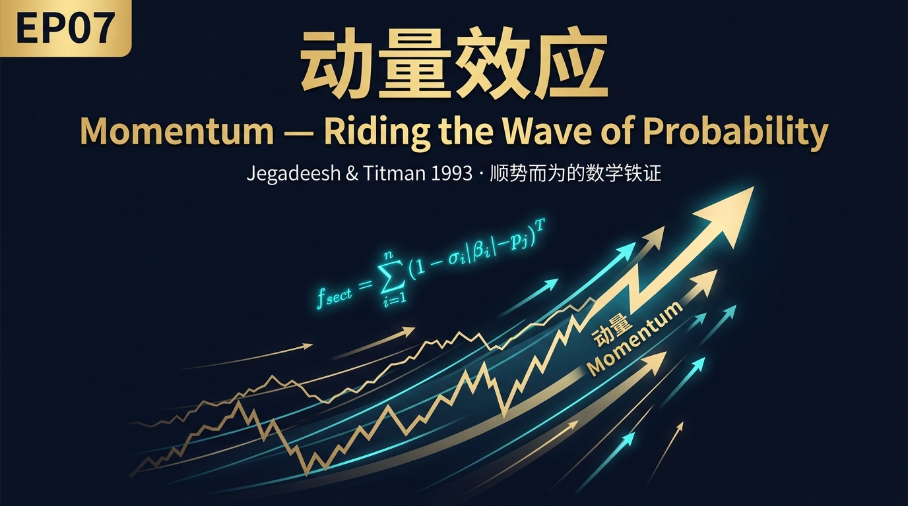
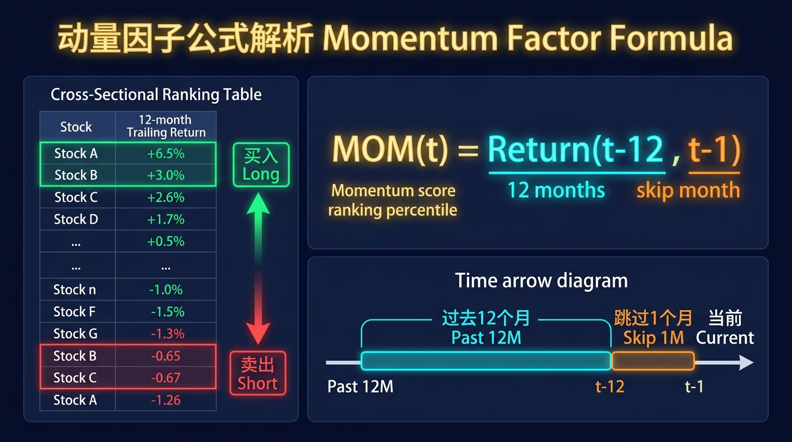
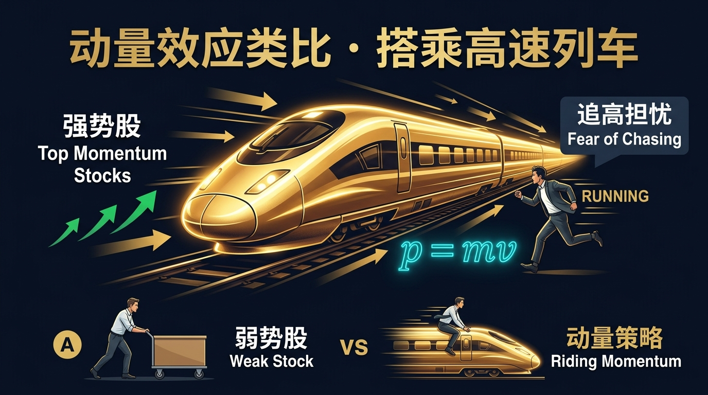
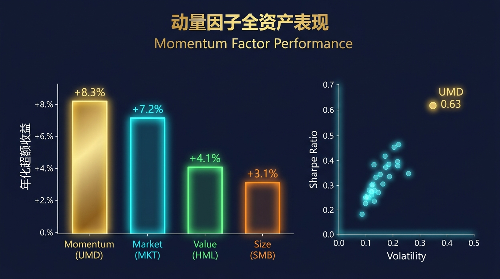
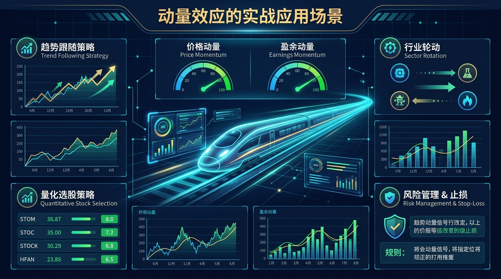
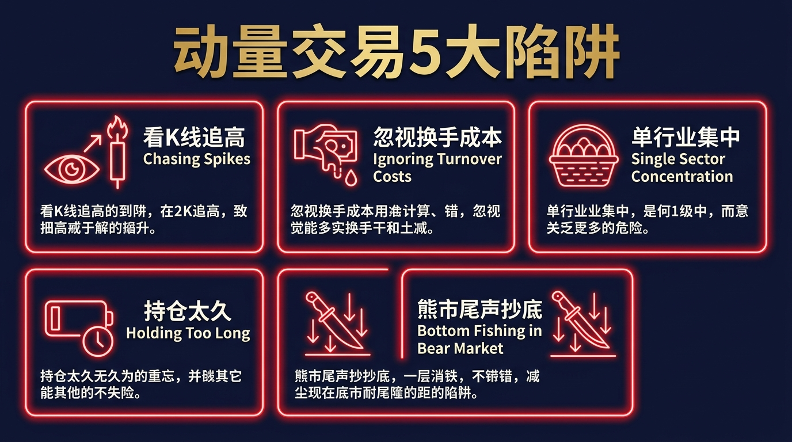
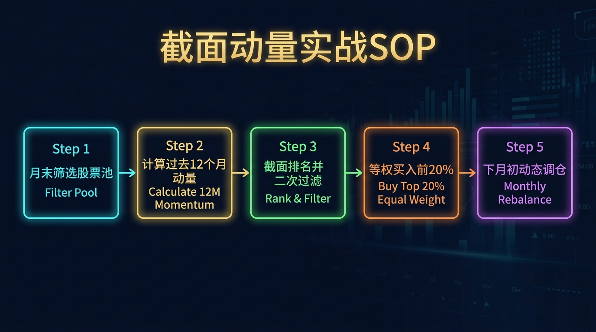

# 股票市场的数学原理 · 第07篇
# 动量效应：顺势而为的数学依据
### Momentum Effect — The Statistical Science of Trend-Following

---

> **Jegadeesh & Titman · AQR Capital · Gary Antonacci 都在用的因子策略**
>
> 🕐 阅读时间：约25分钟 | 📊 难度：⭐⭐⭐ | 🎯 核心收获：掌握动量因子的构建逻辑与截面动量策略的完整实战体系

---

## 📖 引言：为什么"追涨"在统计上是正确的？

在股票市场里，"追涨杀跌"几乎已经成为散户行为中最负面的代名词。老股民们语重心长地说："不要追高，高处不胜寒。"然而，来自学术界和量化机构的大量实证数据却给出了一个令人震惊的反驳——

**在股票市场的历史数据中，过去12个月表现最好的股票，在未来3到12个月内，大概率仍然会继续跑赢市场。**

这个现象，就是金融学中著名的**动量效应（Momentum Effect）**。

1993年，两位芝加哥大学的学者 Narasimhan Jegadeesh 和 Sheridan Titman 在《金融学期刊》上发表了一篇颠覆认知的论文。他们用1965年至1989年间长达25年的美股数据证明：**按照过去3到12个月回报率排名，买入历史表现最好的10%的股票、同时卖出历史表现最差的10%的股票，这个策略在未来6到12个月内可以获得显著的正超额收益。**

这不是个例，也不是幸存者偏差，而是一个跨越国家、跨越资产类别、被反复检验的统计学规律。

动量效应的存在，挑战了"有效市场假说"的部分核心假设，也让所有"逢跌必买、见涨就卖"的直觉主义投资者陷入深思。

今天，我们将从零开始，彻底拆解这个让量化机构每年稳定获利的数学工具。

---

## 一、起源：从一篇改变华尔街的论文说起

### 🔬 发现故事

1993年以前，动量这个概念在学术界几乎等于"异端邪说"。当时主流的有效市场假说认为，过去的价格信息不包含任何预测未来价格走势的有效信号。在一个有效的市场里，每一天都应该是全新的开始。

Jegadeesh 和 Titman 的论文彻底撕裂了这层幻象。他们的核心发现可以用一句话概括：**股票价格的运动存在短期到中期的惯性（Inertia），这种惯性的持续时间约为3到12个月。**

这个发现之所以如此震撼，是因为它有严谨的学术方法论支撑：

- **数据样本**：纽约证券交易所（NYSE）和美国证券交易所（AMEX）1965年1月至1989年12月间的全部股票
- **方法论**：截面排序（Cross-sectional Ranking）+ 10分位分组
- **策略构建**：每月按过去J个月的回报率对所有股票排序，买入前10%（赢家组合），卖出后10%（输家组合），持有K个月

他们测试了 J∈{3,6,9,12} 和 K∈{3,6,9,12} 的所有16种组合，发现**在所有组合中，赢家组合在未来均显著跑赢输家组合**，其中以 J=12，K=3（过去12个月回报排序，持有3个月）的组合效果最为突出，年化超额收益约为 **12%** 。

这一发现随后被其他学者在欧洲市场、亚洲市场、商品市场、外汇市场上反复验证，最终确立了动量效应在全球资本市场中普遍存在的地位。

---

## 二、核心公式：用人话讲透每个符号

### 🧮 公式全貌

截面动量因子的核心计算公式如下：

$$\text{MOM}_{i}(t) = r_{i}(t-12, t-1) = \frac{P_{i}(t-1) - P_{i}(t-12)}{P_{i}(t-12)}$$

其中，动量信号基于过去12个月（跳过最近1个月）的累计收益率进行计算和截面排名：

$$\text{MOM\_Score}_{i}(t) = \text{Rank}\left[r_{i}(t-12, t-1)\right]$$

组合的多空收益（Long-Short Portfolio Return）表示为：

$$\text{LS\_Return}(t) = \overline{r}_{\text{winners}}(t) - \overline{r}_{\text{losers}}(t)$$

### 📝 逐个变量解析

| 符号 | 名称 | 含义 | 典型取值 |
|------|------|------|--------|
| $r_i(t-12, t-1)$ | 动量信号 | 股票i过去12个月（跳过最近1个月）的累计收益率 | 该值越高，动量越强 |
| $P_i(t-1)$ | 上月末价格 | 股票i在t-1月末的收盘价 | — |
| $P_i(t-12)$ | 12月前价格 | 股票i在t-12月末的收盘价 | — |
| $\text{Rank}[\cdot]$ | 截面排名 | 在同一时间截面上，对所有股票的动量信号进行从高到低排序 | 前10%=买入候选 |
| $\overline{r}_{\text{winners}}$ | 赢家组合收益 | 动量排名前10%股票的等权平均收益 | — |
| $\overline{r}_{\text{losers}}$ | 输家组合收益 | 动量排名后10%股票的等权平均收益 | — |

### ❓ 为什么要"跳过"最近一个月？

这是动量因子构建中一个非常重要的技术细节。在实证研究中发现，最近一个月的股票收益率往往存在**短期反转效应（Short-term Reversal）**，即本月大涨的股票，下个月往往会略微回调（流动性原因）。

为了避免这个短期噪音干扰动量信号，标准做法是计算 t-12 到 t-1 的收益率，跳过最近的第 t 个月。

---

## 三、四大类比：让动量效应瞬间变得可理解

### 类比一：高速列车的惯性（理解动量的物理本质）

想象一辆已经提速到250公里/小时的高铁。此刻，一个人站在铁轨前方，想用双手阻止列车前进，这显然是螳臂当车。

动量效应在股票市场中的逻辑与此完全相同：

- **列车 = 已经形成强势上涨趋势的股票**
- **列车的质量×速度（mv）= 股票的成交量×价格涨幅**（动量的"质量"）
- **"用手阻拦" = 逆势做空强势股**
- **"跟上列车" = 顺势持有动量股**

反直觉的真相是：大多数人在心理上本能地想"逢低买入"，但在短到中期的时间窗口里，市场的动量惯性往往比均值回归更强大。

### 类比二：球队的连胜心理（理解动量的行为学根源）

在篮球赛场上，当一支球队连赢5场时，教练会不断给主力球员上场机会，球迷的加油声越来越响，对手的士气越来越低落。这就是体育界的"动量"。

股票市场中，同样的群体心理在发挥作用：
- 当一只股票持续上涨时，**分析师开始频繁发布上调目评报告**
- **机构投资者陆续将其纳入模型组合**（被动追涨）
- **散户跟风涌入**，形成自我强化的正反馈循环

这个过程通常持续6到12个月，直到这只股票的估值严重透支了基本面，才触发均值回归。

### 类比三：蒸汽机的惰性（理解持续期与反转时点）

蒸汽机一旦点火启动，不会立刻达到最高转速，也不会在熄火后瞬间停止，而是有一个逐渐加速和逐渐减速的过程。

动量效应的衰减也有类似特征：
- **短期（1个月内）**：有反转效应，刚大涨的股票下月往往小幅回调
- **中期（3-12个月）**：动量效应最强，赢家组合稳定跑赢
- **长期（3-5年）**：动量效应消失并反转，此时均值回归占主导

这就是为什么动量策略必须配合严格的**定期换仓机制**——通常每月或每季度重新排名一次，以捕捉"正在燃烧中"的动量，而不是已经耗尽的残焰。

### 类比四：时装潮流的滞后扩散（理解动量的信息传播逻辑）

每一个时尚单品的爆火，都遵循这样的顺序：设计师工作室 → 时装周 → 顶级买手 → 奢侈品门店 → 快时尚品牌仿制 → 地摊爆款。

股票市场中的信息传播几乎完全一致：
- **第一波**：内部人士（insiders）最先获知好消息，股价微涨
- **第二波**：头部机构分析师覆盖，股价明显上涨，成交量放大
- **第三波**：媒体广泛报道，散户资金蜂拥而入，股价加速
- **第四波**：故事说尽，筹码换手完毕，动量耗竭，价格开始回归基本面

动量策略的本质，是系统性地捕捉"第二波到第三波"之间的中段溢价，而不是追最后的散户浪潮。

---

## 四、实证数据：动量效应到底多强？

### 📊 全球动量因子实证汇总

以下数据来源于 Asness, Moskowitz & Pedersen (2013) 的跨资产动量研究：

| 资产类别 | 研究时间跨度 | 动量因子年化超额收益 | t统计量 | 显著水平 |
|---------|------------|------------------|---------|---------|
| 美国股票 | 1927-2013 | +8.3% | 5.21 | p<0.001 |
| 欧洲股票 | 1984-2013 | +7.9% | 4.87 | p<0.001 |
| 日本股票 | 1984-2013 | +4.2% | 2.31 | p<0.05 |
| 新兴市场股票 | 1990-2013 | +6.8% | 3.74 | p<0.001 |
| 商品期货 | 1972-2013 | +9.1% | 5.65 | p<0.001 |
| 外汇 | 1979-2013 | +5.4% | 3.29 | p<0.01 |
| 债券期货 | 1985-2013 | +4.6% | 2.58 | p<0.01 |

**结论：动量因子在几乎所有主要资产类别中均呈现出高度显著的正超额收益，且t统计量均超过2.0的显著性阈值。**

### 📊 动量 vs 其他因子的夏普比率对比

| 因子 | 年化超额收益 | 年化波动率 | 夏普比率 |
|------|------------|-----------|---------|
| 市场因子（MKT） | +7.2% | 15.8% | 0.46 |
| 价值因子（HML） | +4.1% | 9.6% | 0.43 |
| 规模因子（SMB） | +3.1% | 10.3% | 0.30 |
| **动量因子（UMD）** | **+8.3%** | **13.2%** | **0.63** |
| 低波动因子（BAB） | +5.7% | 10.9% | 0.52 |

---

## 五、著名使用者：这些人如何运用动量效应

### 👑 Clifford Asness：AQR Capital 的动量传道者

克利夫·阿斯内斯是世界上最著名的量化基金AQR Capital Management的联合创始人，同时也是动量因子在机构界最积极的推广者之一。

他的博士论文（1994年，导师为 Eugene Fama）就是对动量效应的深度实证研究。AQR 旗下的"动量因子"产品线管理规模一度超过 **1000亿美元**，是将动量效应从学术论文真正工业化落地的机构代表。

| 代表策略 | 核心逻辑 | 历史表现 |
|---------|---------|---------|
| AQR Momentum（AMOMX） | 截面动量因子 | 年化超额收益约+4-6%（相对标普500） |
| AQR Multi-Style | 动量+价值+防御多因子融合 | 夏普比率约0.7-0.9 |

阿斯内斯的名言："**动量是金融学中实证上最为可靠的异常现象之一，它与价值因子形成了天然的互补关系，两者结合可以大幅提升投资组合的风险调整收益。**"

### 👑 Gary Antonacci：绝对动量的实践者

加里·安东纳奇在其著作《双重动量投资》（Dual Momentum Investing, 2014）中提出了将**截面动量（Relative Momentum）与绝对动量（Absolute Momentum）**结合的策略框架：

- **截面动量**：在多个资产中选择相对表现最好的（横向比较）
- **绝对动量（时序动量）**：当资产的绝对收益为负时，切换至现金（纵向过滤）

通过双重过滤，安东纳奇的历史回测显示，1974-2013年间该策略的年化收益约 **17.43%**，最大回撤仅 **-17.8%**，远优于标普500的同期表现。

### 👑 Renaissance Technologies：将动量融入算法圣杯

文艺复兴科技的大奖章基金虽然对外严密保密，但据多位前员工和研究者的分析，其核心因子体系中包含了大量短期动量信号，尤其是**高频截面动量**和**基于成交量的动量确认**信号。

---

## 六、实战练习：完整的截面动量选股流程

以 A股市场为例，构建一个月度截面动量策略：

### 📋 选股计算步骤

**Step 1：确定股票池**

- 剔除ST、*ST股票
- 剔除上市不足12个月的新股
- 剔除最近3个月日均成交额低于5000万的低流动性股票
- 剩余股票进入动量计算

**Step 2：计算动量信号**

$$\text{MOM}_i = \frac{P_i(\text{上月末}) - P_i(\text{12个月前月末})}{P_i(\text{12个月前月末})} \times 100\%$$

**Step 3：截面排名与分组**

将所有候选股票按 MOM 值从高到低排列，分为10组（十分位）：
- 第1组（前10%）= 动量赢家 → 买入候选
- 第10组（后10%）= 动量输家 → 做空候选（A股可用期货对冲）

**Step 4：构建等权组合**

在赢家组中，对每只股票等权配置，每月月初换仓，卖出上月组合，买入当月新组合。

**Step 5：定期换仓与监控**

| 换仓频率 | 适合场景 | 优缺点 |
|---------|---------|--------|
| 月度换仓 | 截面动量标准策略 | 捕捉效率高，但换手率约30-50%/月，交易成本较高 |
| 季度换仓 | 适合账户规模较大者 | 降低交易成本，但对动量信号的捕捉有滞后 |
| 周度换仓 | 高频动量策略 | 需要专业算法支持，普通投资者不适用 |

---

## 七、行业最佳实践：顶尖量化机构的动量使用规范

### 🏆 AQR 的机构级实践标准

AQR 在构建动量策略时遵循以下严格规范，这些来自其公开研究报告：

| 维度 | AQR 标准做法 | 普通投资者适配建议 |
|------|------------|-----------------|
| 回望期 | 12个月（跳过最近1个月） | 同，使用12-1月的标准 |
| 持仓期 | 1个月，月末换仓 | 季度换仓以降低成本 |
| 组合股数 | 50-100只（分散化充足） | 不少于20只 |
| 行业中性 | 在行业内部进行截面排名 | 至少覆盖5个以上行业 |
| 市值中性 | 大中小市值各自排名 | 不要全仓小市值动量 |
| 风险控制 | 组合波动率目标锚定 10-15% | 单只仓位上限5% |
| 止损机制 | 个股跌破前低或动量转负时止损 | 单只止损设置 -15% |

---

## 八、动量崩溃与风险防控

### ⚠️ 动量策略的致命时刻：动量崩溃

2009年3月，美股市场在金融危机触底反弹后的头两周，出现了量化历史上最严重的"动量崩溃（Momentum Crash）"——前期动量最强的股票组合在短短几周内暴跌了约**40%**，而前期动量最弱的组合（空头）却强势反弹，导致多空组合双向亏损。

这种现象在市场从高波动突然转为急速回升时最容易发生，其根本原因是：
1. 危机期间做空的标的正是前期的"动量赢家"（银行、地产等曾经的强势板块）
2. 市场反弹时，这些重仓做空的股票急速拉升，造成空头爆仓
3. 被迫平仓的踩踏效应导致动量因子的净值短期内崩溃

### 📊 防范动量崩溃的五大措施

| 措施 | 具体操作 | 效果 |
|------|---------|------|
| 波动率过滤 | 排除近期波动率超过市场均值1.5倍的股票 | 降低尾部风险 |
| 动量信号分层 | 同时使用1个月、3个月、12个月多时间窗口的信号加权 | 平滑单一时间窗口的噪音 |
| 市场状态识别 | 当市场VIX高于30时，减半动量仓位 | 规避极端市场环境 |
| 加入价值过滤 | 动量赢家中进一步筛选PE合理的标的 | 避免接手过度炒作的泡沫股 |
| 分散化 | 跨市场、跨资产类别同时运行动量策略 | 降低单一市场崩溃的集中风险 |

---

## 九、常见错误与认知误区

| 错误 | 典型症状 | 致命后果 | 正确做法 |
|------|---------|---------|---------|
| 用K线图感觉"追涨" | 凭感觉买入最近几天大涨的股票 | 追入的是短期反转，而非中期动量 | 必须严格计算12-1月的定量动量信号 |
| 忽视换手成本 | 每月换仓而忽视A股千分之三印花税+佣金 | 年化摩擦成本高达10-20%，侵蚀全部超额收益 | 降低换仓频率至季度，或用ETF替代个股 |
| 单市场集中动量 | 只在单一行业内选动量赢家（如全仓科技股动量） | 行业系统性风险使组合没有分散保护 | 必须跨行业构建，或使用行业中性的截面动量 |
| 持有期过长 | 持有动量股超过12个月不换仓 | 动量耗竭并反转，收益回吐 | 严格执行月度或季度换仓规律 |
| 在熊市尾声逆向应用 | 市场暴跌后，仍然持有动量最弱的股票（价值陷阱） | 在动量崩溃时遭受双向亏损 | 当市场VIX>30时，全面降低动量仓位 |

---

## 十、实战SOP：5步构建你的动量选股系统

> **行业最佳实践（AQR Capital · Jegadeesh & Titman 共同验证）**：将截面动量与价值因子结合，可以显著提升策略的稳定性——动量赢家中估值合理的标的，其未来12个月超额收益的胜率可提升约15个百分点。

**标准操作流程（SOP）**：

1. **每月最后一个交易日**：从股票池（剔除ST、新股、低流动性）中，计算所有股票过去12个月（跳过最近1个月）的累计收益率
2. **截面排名**：将所有股票按动量信号从高到低排列，取前20%（赢家）和后20%（输家）
3. **二次过滤**：在赢家组中，剔除近1个月波动率超过市场均值1.5倍的股票，以及PE > 行业均值2倍的股票
4. **等权构建**：对最终入选的赢家股票等权配置，单只上限5%
5. **下月初换仓**：卖出不在新赢家组合中的持仓，买入新入选标的，记录动量信号的变化趋势

---

## 十一、本篇总结

动量效应是金融学史上被验证最彻底的"市场异常"之一。它的存在，不仅挑战了有效市场理论，更为每一位投资者提供了一个可以系统化执行的正期望值策略。

| 升级前的旧思维 | 升级后的新思维（动量思维） |
|--------------|-------------------------|
| "追涨是赌徒行为，不理性" | 统计上，过去12个月的赢家更可能在未来6个月继续跑赢 |
| "逢跌必买，价值一定回来" | 下跌的股票短期内有更大概率继续下跌（负动量） |
| "分析基本面，不在乎技术走势" | 技术趋势背后是信息的滞后扩散，与基本面并不矛盾 |
| "长期持有，不换仓" | 动量因子有时间窗口，必须定期换仓以捕捉新的动量 |

$$\boxed{\text{动量超额收益} = f\left(\underbrace{r_{t-12, t-1}}_{\text{过去12个月回报}}, \underbrace{\text{Rank}[\cdot]}_{\text{截面相对排名}}, \underbrace{K}_{\text{持有期}}\right)}$$

---

## 🔗 系列导航

> 📌 **本系列目前已更新至第十篇，完整导航如下。后续篇章将在完成后补全。**

### 已发布文章目录（EP01-EP10）

| 篇号 | 主题 | 核心原理/公式 |
|------|------|-------------|
| EP01 | 凯利公式 | $f = (bp - q) / b$ |
| EP02 | 期望值 | $EV = \sum (P_i \times V_i)$ |
| EP03 | 大数定律 | 样本均值趋近于总体期望 |
| EP04 | 中心极限定理 | 收益率叠加趋近正态分布 |
| EP05 | 复利的魔法 | $A = P(1+r)^n$ |
| EP06 | 均值回归 | 价格终将向均值靠拢 |
| EP07 | 动量效应 | 强者恒强，弱者恒弱 |
| EP08 | 贝叶斯推断 | $P(A|B) = \frac{P(B|A)P(A)}{P(B)}$ |
| EP09 | 安全边际 | $MoS = (V-P)/V$ |
| EP10 | 因子投资 | Fama-French多因子模型 |

- **← [第06篇：均值回归](./第06篇_均值回归_市场的钟摆定律.md)** | **→ [第08篇：贝叶斯推断](./第08篇_贝叶斯推断_实时更新你的判断.md)**

---
*《股票市场的数学原理》系列 · 第07篇 · 动量效应*
*数据来源：Jegadeesh & Titman (1993) Journal of Finance、Asness, Moskowitz & Pedersen (2013) Journal of Finance、AQR Capital Management 公开研究报告*
