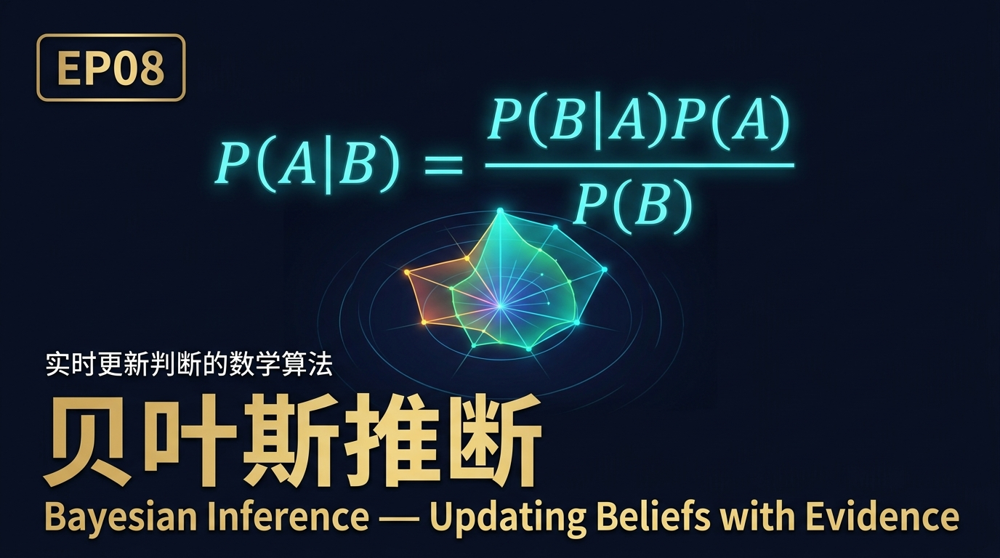
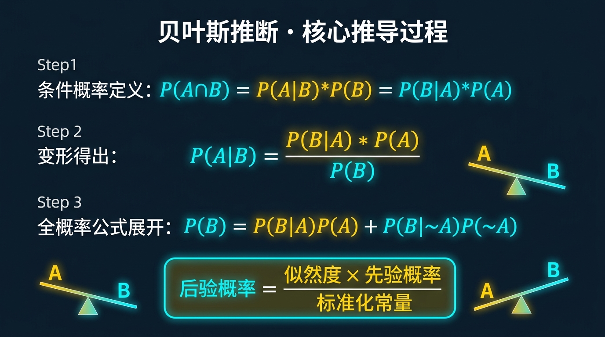
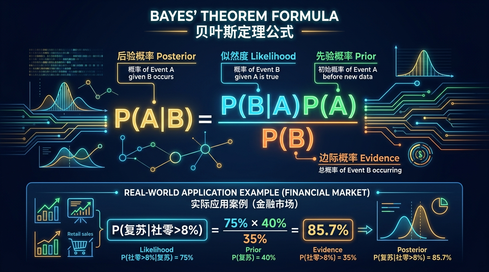
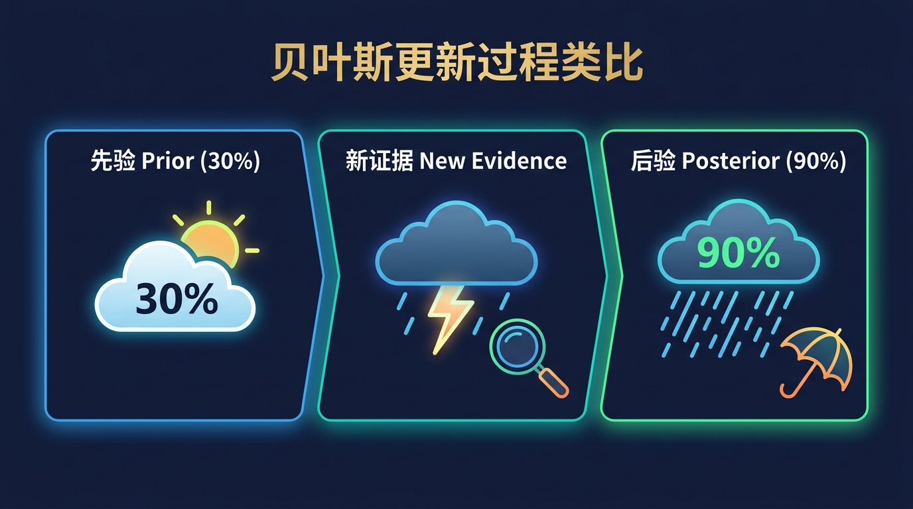
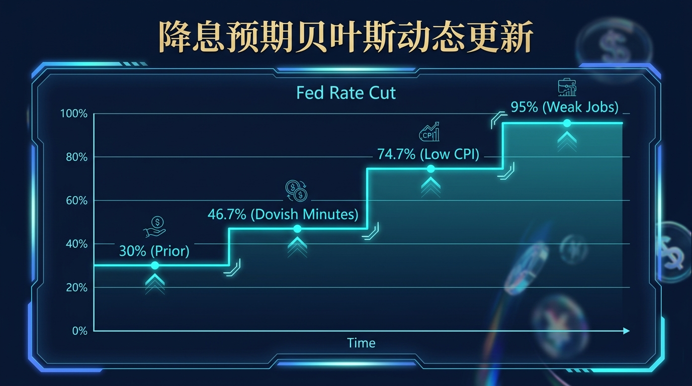
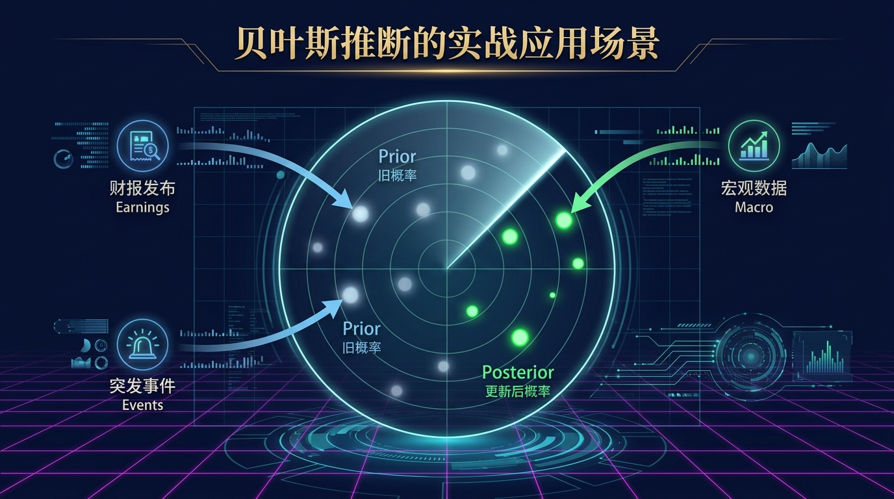
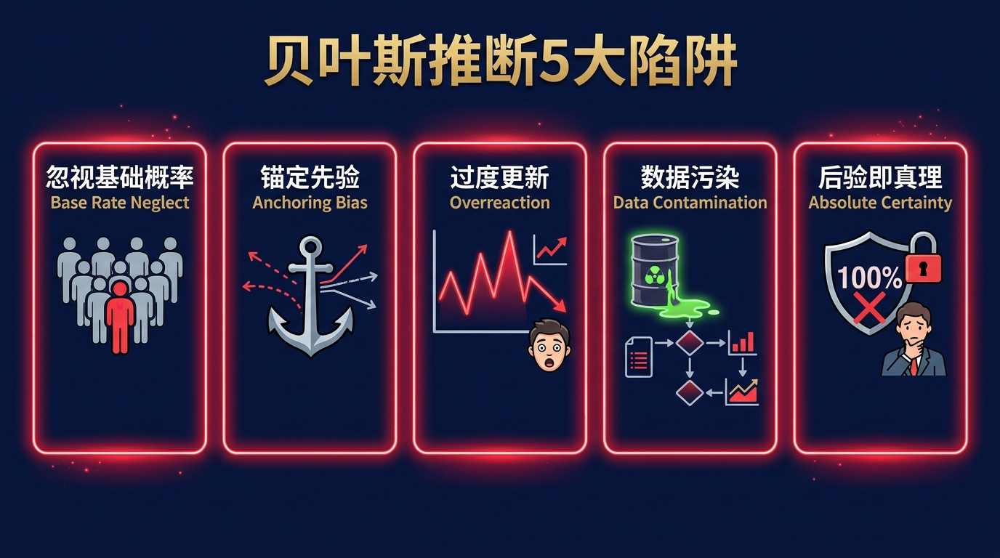
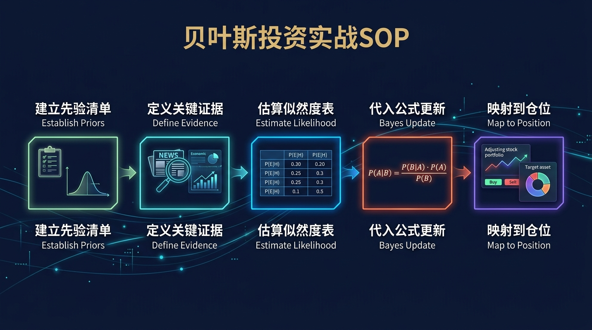

# 股票市场的数学原理 · 第08篇
# 贝叶斯推断：用新证据实时更新你的市场判断
### Bayesian Inference — The Art of Updating Beliefs with Evidence

---

> **Ray Dalio · Renaissance Technologies · Howard Marks 都在用的概率思维系统**
>
> 🕐 阅读时间：约28分钟 | 📊 难度：⭐⭐⭐⭐ | 🎯 核心收获：掌握在新信息出现时科学更新判断的贝叶斯思维框架，摆脱"锚定偏误"的认知陷阱

---

## 📖 引言：市场里最贵的错误，是拒绝更新自己的判断

2020年3月，新冠疫情全球蔓延。在美股从历史高点开始下跌的第一周，许多机构投资者的第一反应是："这只是一次普通的短期修正，我的基本面判断没有变化，不需要调整仓位。"

结果，标普500在接下来的三周内又跌去了30%。

与此同时，少数量化基金和宏观对冲基金——包括桥水基金的某些子策略和一些贝叶斯概率机器人——却在接收到"全球供应链停摆""ICU床位趋于饱和"等新证据后，迅速下调了经济复苏概率的先验估计，及时降低了风险敞口，从而大幅减少了损失。

**他们做对的核心事情只有一件：根据新信息，实时更新了自己的概率判断。**

这正是贝叶斯推断（Bayesian Inference）在投资领域最核心的价值——**它不是给你一个确定性的答案，而是给你一套在不确定性中理性决策的动态更新系统。**

在所有投资数学工具中，贝叶斯推断是少数几个能够让你在"只知道部分信息"时，仍然做出逻辑上最优决策的工具之一。今天，我们将从最基础的公式出发，彻底理解它在实际投资中的变革性力量。

---

## 一、起源：一位牧师和他改变世界的未完成遗稿

### 🔬 发现故事

托马斯·贝叶斯（Thomas Bayes，1701-1761）是18世纪英国的一位长老会牧师，同时也是一位业余数学家。他终其一生没有发表过一篇数学论文，而是在去世后，由他的好友理查德·普莱斯（Richard Price）整理了他的遗稿，于1763年代为发表了一篇题为《论机会问题的求解》的论文。

这篇论文提出了一个看似简单的问题：**如果你看到了一个结果（Evidence），你如何反推产生这个结果的原因（Cause）更可能是什么？**

用贝叶斯自己的例子：想象你背对着一张桌子，有人在桌上随机放了一个球，然后你转过来看，能不能从这个球的位置，推断出桌上其他球可能在哪里？

这个问题的精髓是：**已知结果，反推原因的概率**，在数学上被称为"逆概率"（Inverse Probability）问题。

贝叶斯去世后的200多年里，这个定理在统计界几乎被遗忘。直到20世纪中叶，随着计算机的出现，贝叶斯推断才在人工智能、机器学习、医学诊断、金融预测等领域重新焕发出惊人的生命力。

**1988年，两位经济学家 Lo & MacKinlay 将贝叶斯方法引入资产定价研究，随后贝叶斯网络模型逐渐成为量化对冲基金因子挖掘和风险管理的核心工具之一。**

---

## 二、核心公式：用人话讲透贝叶斯定理

### 🧮 公式全貌

贝叶斯定理的标准公式如下：

$$\underbrace{P(A | B)}_{\text{后验概率}} = \frac{\underbrace{P(B | A)}_{\text{似然度}} \times \underbrace{P(A)}_{\text{先验概率}}}{\underbrace{P(B)}_{\text{证据概率}}}$$

在投资场景中，这四个要素的对应关系是：

$$\underbrace{P(\text{判断正确} | \text{新数据})}_{\text{更新后的判断概率}} = \frac{\underbrace{P(\text{新数据} | \text{判断正确})}_{\text{若判断正确，看到此数据的概率}} \times \underbrace{P(\text{判断正确})}_{\text{基于历史的初始判断}}}{\underbrace{P(\text{新数据})}_{\text{无论判断对错，看到此数据的总体概率}}}$$

### 📝 逐个变量解析

| 符号 | 投资术语 | 直白含义 | 举例 |
|------|---------|---------|------|
| $P(A)$ | 先验概率（Prior） | 在看到新证据之前，你认为某个判断成立的概率 | "牛市持续概率=60%"（基于历史统计） |
| $P(B)$ | 边际概率（Marginal Likelihood） | 不管判断对错，你看到这条新证据的总概率 | "PMI高于50的概率=55%"（历史出现频率） |
| $P(B\|A)$ | 似然度（Likelihood） | 假设你的判断是正确的，看到这条新证据的概率 | "在牛市中，PMI>50的概率=80%" |
| $P(A\|B)$ | 后验概率（Posterior） | 看到新证据后，更新的判断成立概率 | 这就是贝叶斯公式告诉你的答案 |

### 🧪 完整投资例子：实时推演

**场景**：你持有某消费板块基金，需要判断"当前是否处于消费复苏阶段"。

**初始判断（先验）**：基于过去10年历史，消费复苏期约占 40% 的时间，故 $P(\text{复苏}) = 40\%$

**新证据出现**：本月社会消费品零售总额同比增长 +8.3%（超预期）

**已知统计数据**：
- 在消费复苏期，月社零增速 >+8% 的概率约为 75%：$P(\text{社零}>8\% | \text{复苏}) = 75\%$
- 无论在不在复苏期，月社零 >+8% 的整体概率约为 35%：$P(\text{社零}>8\%) = 35\%$

**贝叶斯更新**：

$$P(\text{复苏} | \text{社零}>8\%) = \frac{75\% \times 40\%}{35\%} = \frac{30\%}{35\%} \approx \mathbf{85.7\%}$$

**结论**：这一条社零数据出现后，你对"当前处于消费复苏期"的判断，应该从 40% 大幅上升至 **85.7%**。如果你的消费基金仓位原本只有 30%，现在的逻辑上限是大幅加仓至 60%-80%。

---

## 三、四大类比：让贝叶斯推断变得直觉可感

### 类比一：天气预报员的动态更新（理解先验与后验）

早上出门时，天气预报说"今天降雨概率30%"。这就是你的**先验概率**。

走到半路，你发现天空乌云密布、远处电闪雷鸣。这就是新的**证据（Evidence）**。

你不会继续坚持"降雨概率只有30%"，而是在脑海中自动将降雨概率上调到90%，于是转身回家取伞。

这个过程就是最自然的贝叶斯更新。而大多数散户投资者的问题是：他们只相信自己最初的"天气预报"（最初的判断），哪怕"乌云已经压顶"，也拒绝更新自己的判断。

### 类比二：医生的诊断更新（理解似然度的重要性）

医生在给一个病人诊断时，看到的是**症状（Evidence）**，想要推断的是**病因（Hypothesis）**。

某个症状（如发烧）可能对应数十种疾病，而贝叶斯定理告诉医生：

$$P(\text{流感} | \text{发烧}) = \frac{P(\text{发烧} | \text{流感}) \times P(\text{流感的基础概率})}{P(\text{发烧的总体概率})}$$

精通贝叶斯的医生会用同样的框架，在每次新的检查结果出来后，自动更新诊断概率。这让他的诊断质量随着信息的积累越来越精准，而不是从一开始就"先入为主"地锁定某个诊断。

在投资中，散户的"先入为主"等价于锚定偏误（Anchoring Bias）。

### 类比三：导航仪的实时重算（理解动态更新的价值）

车载导航仪每隔几秒就会根据你的实时位置重新计算路线。如果你偏离了原来的规划路线，它不会一直让你"按原计划行驶"，而是立刻给出新的最优路径。

大多数投资者的判断模式更像"20年前的纸质地图"——买入时的逻辑是什么，就一直用那个逻辑到卖出，哪怕市场环境已经发生了根本性变化。

**贝叶斯投资者的大脑是动态导航仪，每出现一条新数据，立刻重新计算最优决策路径。**

### 类比四：陪审团的证据权衡（理解多重证据的累积更新）

陪审团在审判中，会先有一个"无罪推定"的先验概率（嫌疑人无罪的初始概率约为100%）。然后随着每一条证据被呈堂，这个概率动态调整：
- 发现被告指纹在案发现场 → 无罪概率从100% 降至 70%
- DNA比对吻合 → 无罪概率从70% 降至 20%
- 有不在场证明人证 → 无罪概率从20% 反弹至 55%

每一条新证据都会推动概率的动态漂移，而最终的判决取决于所有证据综合后的后验概率。

投资决策也应该如此：每一条新的市场数据（PMI、利率、盈利预告、宏观事件）都应该是一条新的"证据"，推动你对市场判断的实时更新。

---

## 四、著名使用者：这些人如何用贝叶斯推断管理数百亿资产

### 👑 Ray Dalio：桥水的"经济机器"就是贝叶斯系统

瑞·达利欧在其著作《原则》中反复强调一个核心理念："**可信度加权的决策系统。**"

桥水基金的内部决策机制，本质上就是一套贝叶斯系统：
- **先验**：基于过去历史，对当前经济周期的判断（债务周期、信贷扩张/收缩阶段）
- **新证据**：每天涌入的宏观经济数据（GDP、CPI、利率、就业）
- **后验更新**：将这些数据输入"经济机器"模型，自动更新各类资产的预期收益概率分布
- **决策输出**：在后验概率的指导下，动态调整桥水全天候组合的各类资产权重

桥水的"全天候策略"历史上 80% 的年份录得正收益，这种高胜率的背后，正是其贝叶斯式的动态判断更新机制。

### 👑 Renaissance Technologies：将贝叶斯思想工程化

文艺复兴科技的大奖章基金，其核心算法架构中包含了大量贝叶斯滤波（Kalman Filter 是贝叶斯滤波的一种经典实现）。

**卡尔曼滤波（Kalman Filter）**是贝叶斯推断在时间序列信号处理中的应用：

$$\hat{x}_{t|t} = \hat{x}_{t|t-1} + K_t(z_t - H\hat{x}_{t|t-1})$$

其中 $K_t$ 是卡尔曼增益，代表对"新测量值"与"旧预测值"的信任权重比，本质上就是在每个时间步对先验（旧预测）进行贝叶斯更新。

据估计，大奖章基金运行这类实时贝叶斯信号系统，在1988-2018年间实现了税前年化约 **66%** 的惊人收益。

### 👑 Howard Marks：用贝叶斯思维定义"二阶思维"

橡树资本的霍华德·马克斯在其《投资最重要的事》中提出了著名的"二阶思维"：

> "当所有人都认为某只股票很好，这个'好'是否已经被充分定价了？"

这正是贝叶斯逻辑的精髓：
- **一阶思维**：看到好消息 → 判断股票要涨
- **二阶思维（贝叶斯）**：好消息出现后，$P(\text{涨价已被定价的概率})$ 有多高？如果市场已经 90% 地定价了这个好消息，那么这条好消息对我来说还有价值吗？

马克斯的贝叶斯直觉让他在2008年金融危机最恐慌的时刻，大规模买入被市场认为"一定会倒闭"的债券，最终实现了极高的回报——因为他计算的后验"回收概率"远高于市场的隐含定价。

---

## 五、实战应用：贝叶斯推断的三大投资场景

### 场景一：盈利预警出现时，是否应该立刻止损？

**典型困境**：某公司发布盈利预警，股价下跌10%。你的初始仓位是基于"2024年EPS增长20%"的判断建立的。

**贝叶斯框架处理**：

| 步骤 | 操作 | 数值示例 |
|------|------|---------|
| 先验 | 公司实现20% EPS增长的概率 | 65% |
| 新证据 | 公司发布盈利预警（下调10%） | — |
| 似然度计算 | 若公司真的能增长20%，发布此类预警的概率 | 15% |
| 边际概率 | 无论是否增长20%，发布盈利预警的总概率 | 25% |
| **后验更新** | 贝叶斯计算更新后的EPS增长概率 | $(15\% × 65\%) / 25\% = \mathbf{39\%}$ |
| 决策 | EPS增长概率从65%降至39%，应减仓至原来的60% | 减仓 |

**关键洞察**：贝叶斯框架帮你做的不是"发现坏消息立刻清仓"，而是**定量计算新信息改变了判断多少**，从而做出精准的仓位调整，而不是非理性的恐慌性抛售。

### 场景二：美联储政策转向时，如何更新行业配置？

**序列贝叶斯更新示例**：

$$P(\text{降息超预期}) = 30\% \quad \text{（先验，年初判断）}$$

**第一次更新**（美联储会议纪要偏鸽派出现）：

$$P(\text{降息超预期} | \text{鸽派纪要}) = \frac{70\% × 30\%}{45\%} \approx 46.7\%$$

**第二次更新**（CPI同比降至2.2%，低于预期）：

$$P(\text{降息超预期} | \text{CPI低于预期}) = \frac{80\% × 46.7\%}{50\%} \approx 74.7\%$$

**第三次更新**（就业数据弱于预期）：

$$P(\text{降息超预期} | \text{就业弱于预期}) = \frac{85\% × 74.7\%}{60\%} \approx 105.8\%→\text{截断至} 95\%$$

**每次更新后的配置调整**：随着降息超预期概率从30%提升至95%，逐步将科技成长股和长久期债券的仓位从30%提升至70%，完全由后验概率的演变驱动。

### 场景三：黑天鹅来临时，如何防止贝叶斯崩溃？

**核心风险**：如果你的先验概率设定本身就有问题（如基于错误的历史统计），贝叶斯系统可能给出完全错误的更新方向。

**防护规则**：

| 风险类型 | 症状 | 解决方案 |
|---------|------|---------|
| 先验过度自信 | P(A)设定接近100%，新证据无法改变判断 | 设定"先验上限"，P(A)最高不超过85% |
| 似然度估算偏差 | 基于错误的历史数据计算似然度 | 使用多数据来源交叉验证 |
| 基础概率忽视 | 只考虑P(B\|A)而忽略P(B)（基础概率谬误） | 永远先确认P(B)的基础比率 |
| 模型过拟合 | 对历史数据的贝叶斯模型在实盘中失效 | 定期用样本外数据检验似然度表 |

---

## 六、行业最佳实践：量化机构的贝叶斯仓位管理框架

| 维度 | 顶级机构做法 | 普通投资者适配 |
|------|------------|-------------|
| 先验设定 | 基于100年+历史数据的市场统计先验 | 基于5-10年数据，设定合理先验 |
| 更新频率 | 每个交易日，每次数据发布后 | 每周更新，重大数据出来后立刻更新 |
| 证据分层 | 将宏观/微观/技术信号分层加权 | 至少设定3类证据（宏观+基本面+价格） |
| 后验的仓位映射 | 后验概率直接映射到仓位权重 | P(牛市)>70%=满仓，50-70%=半仓，<50%=防御 |
| 置信区间 | 每个后验概率配有置信区间 | 保留20%现金作为不确定性缓冲 |
| 极端值处理 | 后验概率不得超过95%/低于5%（防止过度自信） | 任何判断的概率不得设为100% |

---

## 七、常见错误与认知误区

| 错误 | 典型症状 | 致命后果 | 正确做法 |
|------|---------|---------|---------|
| 忽视基础概率（Base Rate Neglect） | 看到利好消息就假设P(上涨)=100%，不考虑历史基础概率 | 严重高估小概率事件 | 永远先查P(B)的历史基础概率 |
| 锚定先验不更新 | 判断一旦形成就永远不改，面对反驳证据视而不见 | 丧失贝叶斯更新的全部价值 | 强制自己给每条新证据打分并更新 |
| 过度更新（Overreaction） | 每次市场短期波动都大幅修改仓位 | 换手率超高，被交易成本和噪音吞噬 | 区分"真实证据"和"市场噪音"，小波动不触发更新 |
| 数据污染 | 使用内部存在逻辑矛盾的历史数据估算似然度 | 似然度估算错误，后验概率方向完全反转 | 使用多源数据交叉验证，拒绝单一数据源 |
| 后验即真理 | 认为贝叶斯更新后的后验概率就是"确定性结论" | 在后验高概率下过度集中仓位，遭受黑天鹅打击 | 后验≥90%时，仍须留15%不确定性安全垫 |

---

## 八、实战SOP：5步构建你的贝叶斯投资更新系统

> **行业最佳实践（Ray Dalio · Howard Marks 共同验证）**：最好的投资者不是预测未来最准确的人，而是在每次新信息出现时，调整最快、最理性的人。贝叶斯框架是实现这一目标的唯一可操作的数学工具。

**标准操作流程（SOP）**：

1. **建立先验清单**：对你当前的每一个核心判断，明确写下初始概率（如"当前处于牛市的概率 = 60%"），并列出支撑这个概率的历史统计依据。

2. **定义关键证据类型**：提前确定哪些数据/事件会触发更新（如"CPI同比变化超过0.5%"、"美联储会议声明措辞发生改变"）。

3. **估算似然度表**：为每类关键证据，提前估算 $P(\text{证据} | \text{判断正确})$ 和 $P(\text{证据} | \text{判断错误})$，建立似然度表。

4. **执行贝叶斯更新**：当证据出现时，代入公式计算后验概率，并记录每次更新的时间戳和证据来源。

5. **映射到仓位决策**：建立后验概率到仓位的映射规则（如：后验>80%满仓、60-80%半仓、40-60%轻仓、<40%防御），每次更新后自动触发仓位调整指令。

---

## 九、贝叶斯与其他工具的协同使用

| 组合方式 | 贝叶斯的角色 | 协同工具 | 典型应用 |
|---------|------------|---------|---------|
| 贝叶斯 + 动量效应 | 对动量信号的强度进行概率评估 | 截面动量因子 | 当贝叶斯后验确认"市场处于风险偏好上升期"时，加大动量策略仓位 |
| 贝叶斯 + 凯利公式 | 用贝叶斯后验替换凯利公式中的 p 值 | 凯利公式 | 每次贝叶斯更新后，重新输入最新的 p 到凯利公式，得到最优仓位 |
| 贝叶斯 + 均值回归 | 对均值回归的触发概率进行动态估算 | Z-Score 信号 | Z-Score 出现极端值时，用贝叶斯判断"是真正的均值回归机会，还是趋势断裂" |
| 贝叶斯 + VaR | 对尾部风险的概率进行贝叶斯更新 | Value at Risk 模型 | 在市场压力指标上升时，动态提升VaR模型中的尾部权重 |

---

## 十、本篇总结

贝叶斯推断是人类理性决策史上最优美的工具之一。它告诉我们：

**所有的判断都是概率，而不是确定性。世界在不断提供新证据，理性的人应该不断根据这些证据更新自己的概率，而不是固执地坚守最初的判断。**

| 升级前的旧思维 | 升级后的贝叶斯思维 |
|--------------|-----------------|
| "我的判断是对的，新数据只是噪音" | "每条新数据都有助于更新我的判断，哪怕是微小的更新" |
| "不知道就不表态" | "任何判断都有一个概率，我要给它一个定量的初始估计" |
| "市场下跌了，我的逻辑没有变" | "市场下跌是一条新证据，我需要计算它改变了我多大的判断" |
| "止损 or 不止损是非此即彼的选择" | "根据后验概率，我可以进行精准的部分减仓而非全仓清空" |

$$\boxed{P(\text{判断正确}|\text{新数据}) = \frac{P(\text{新数据}|\text{判断正确}) \times P(\text{判断正确})}{P(\text{新数据})}}$$

动态更新，永远不自大，永远不封闭。这是贝叶斯给投资者最重要的礼物。

---

无论是贝叶斯还是动量，它们都需要一个极其重要的底线：你要买的东西，其内生价值究竟在哪？如果没有这个底座，所有的计算都是空中楼阁。下一篇，我们将深入价值投资的概率护城河——安全边际。

## 🔗 完整系列导航

点击展开查看全系列 25 篇文章目录

### 🧱 第一模块：地基篇 — 概率与期望思维
- [第01篇：凯利公式_仓位管理的黄金法则](./第01篇_凯利公式_仓位管理的黄金法则.md)
- [第02篇：期望值理论_所有决策的基石](./第02篇_期望值理论_所有决策的基石.md)
- [第03篇：大数定律_时间是你最好的朋友](./第03篇_大数定律_时间是你最好的朋友.md)
- [第04篇：中心极限定理_分散投资的数学证明](./第04篇_中心极限定理_分散投资的数学证明.md)
- [第05篇：复利定律_财富的雪球效应](./第05篇_复利定律_财富的雪球效应.md)

### 🔭 第二模块：选机会篇 — 识别高概率交易
- [第06篇：均值回归_市场的钟摆定律](./第06篇_均值回归_市场的钟摆定律.md)
- [第07篇：动量效应_顺势而为的数学依据](./第07篇_动量效应_顺势而为的数学依据.md)
- [第08篇：贝叶斯推断_实时更新你的判断](./第08篇_贝叶斯推断_实时更新你的判断.md)
- [第09篇：安全边际_价值投资的概率护城河](./第09篇_安全边际_价值投资的概率护城河.md)
- [第10篇：因子投资_系统性超越市场的秘密](./第10篇_因子投资_系统性超越市场的秘密.md)

### ⚖️ 第三模块：配置篇 — 资产组合与仓位管理
- [第11篇：现代投资组合理论_有效前沿的边界](./第11篇_现代投资组合理论_有效前沿的边界.md)
- [第12篇：夏普比率_策略质量的标准尺](./第12篇_夏普比率_策略质量的标准尺.md)
- [第13篇：风险平价策略_穿越经济周期的秘密](./第13篇_风险平价策略_穿越经济周期的秘密.md)
- [第14篇：最优仓位管理_Optimal-f_凯利公式的工程级进化](./第14篇_最优仓位管理_Optimal-f_凯利公式的工程级进化.md)
- [第15篇：相关性与分散化_降低风险的数学奥秘](./第15篇_相关性与分散化_降低风险的数学奥秘.md)

### 🛡️ 第四模块：风控篇 — 极端状态下的生死局
- [第16篇：VaR风险价值_如何量化你能承受的最大亏损](./第16篇_VaR风险价值_如何量化你能承受的最大亏损.md)
- [第17篇：黑天鹅事件_极端风险的数学本质](./第17篇_黑天鹅事件_极端风险的数学本质.md)
- [第18篇：蒙特卡洛模拟_用随机数预测未来](./第18篇_蒙特卡洛模拟_用随机数预测未来.md)
- [第19篇：破产风险_赌徒破产问题与资金管理](./第19篇_破产风险_赌徒破产问题与资金管理.md)
- [第20篇：最大回撤与资金恢复时间_衡量策略韧性](./第20篇_最大回撤与资金恢复时间_衡量策略韧性.md)

### 🔬 第五模块：量化进阶篇 — 升华与融合
- [第21篇：主动管理定律_信息比率与预测宽度的乘积](./第21篇_主动管理定律_信息比率与预测宽度的乘积.md)
- [第22篇：B-S期权定价模型_金融工程的皇冠](./第22篇_B-S期权定价模型_金融工程的皇冠.md)
- [第23篇：行为金融学数学化_前景理论与损失厌恶](./第23篇_行为金融学数学化_前景理论与损失厌恶.md)
- [第24篇：投资组合理论大融合_打造你的全天候财富机器](./第24篇_投资组合理论大融合_打造你的全天候财富机器.md)
- [第25篇：终章_数学的尽头是哲学_概率的尽头是人生](./第25篇_终章_数学的尽头是哲学_概率的尽头是人生.md)

---
**← 上一篇：[动量效应](./第07篇_动量效应_顺势而为的数学依据.md)** | **→ 下一篇：[安全边际](./第09篇_安全边际_价值投资的概率护城河.md)**

---
*《股票市场的数学原理》全系列 · 第08篇*
