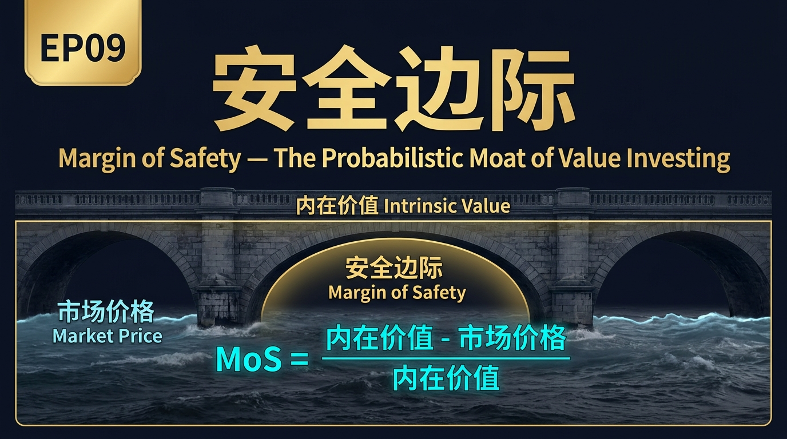
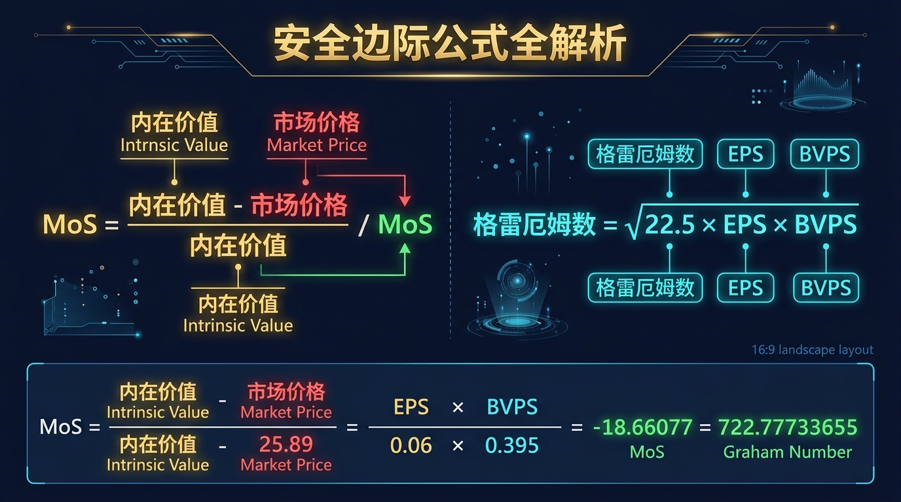
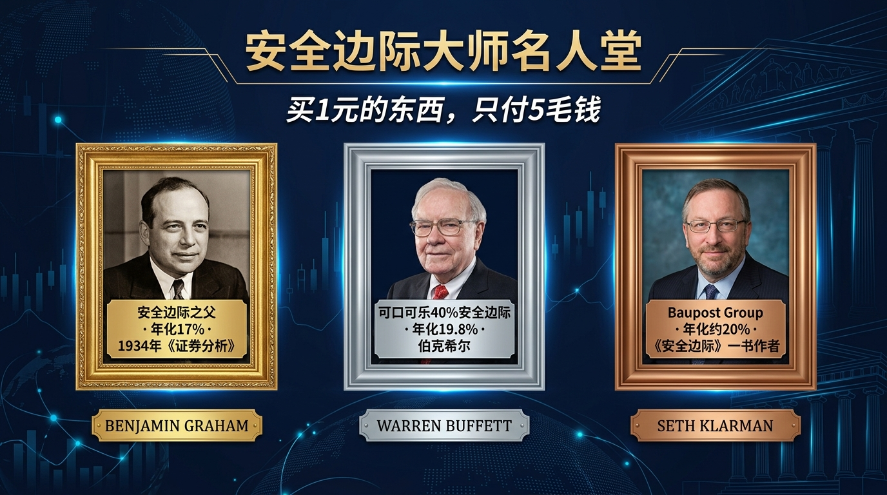
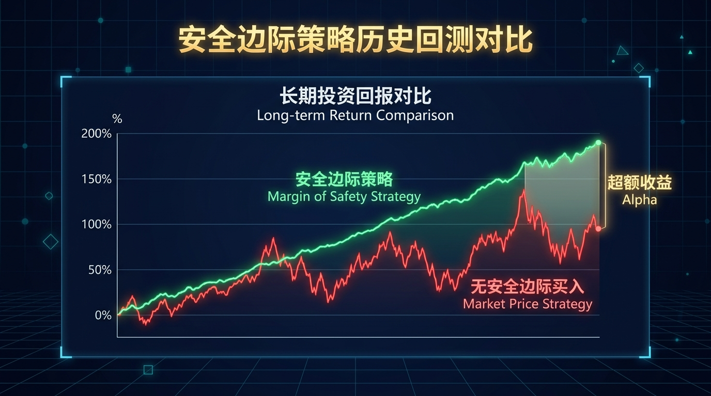
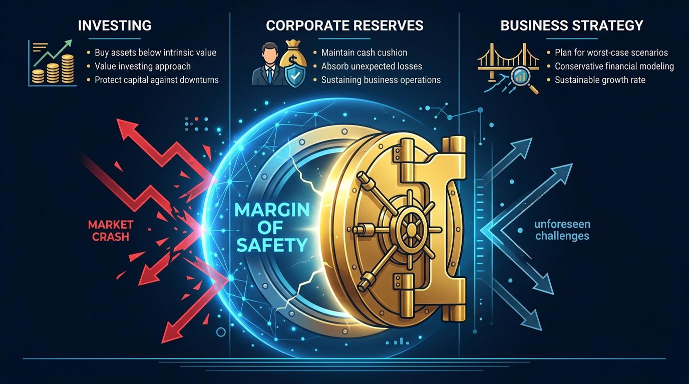
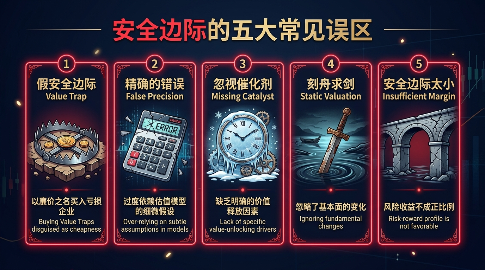
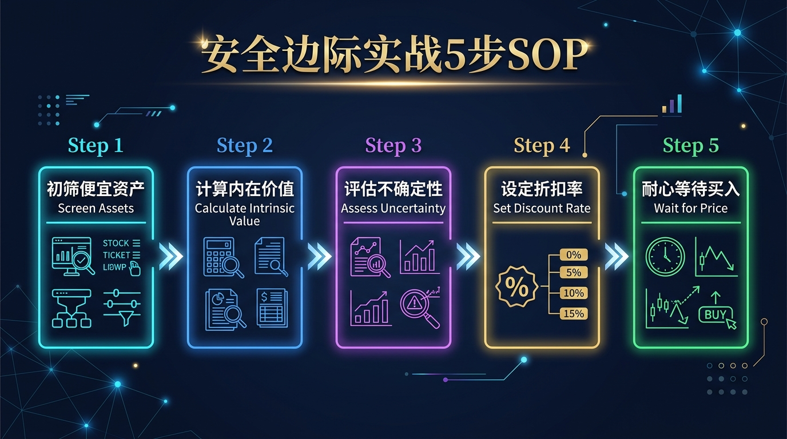

# 股票市场的数学原理 · 第09篇：安全边际（Margin of Safety）

---

> **元信息**
>
> | 字段 | 内容 |
> |------|------|
> | 篇号 | EP09 |
> | 原理 | 安全边际（Margin of Safety） |
> | 核心公式 | $MoS = \dfrac{V_{intrinsic} - P_{market}}{V_{intrinsic}}$ |
> | 发现者 | Benjamin Graham，1934年《证券分析》 |
> | 难度 | ⭐⭐⭐ |
> | 预计阅读 | 约26分钟 |
> | 上一篇 | EP08 贝叶斯推断 |
> | 下一篇 | EP10 因子投资 |

---

## 📖 引言：你买的不是股票，你买的是保险

2008年9月，雷曼兄弟倒闭后的第三天，全球股市进入自由落体模式。大多数基金经理手中持有的股票，账面价值在72小时内蒸发了30%以上。

然后有一个人，反手买入了更多。

他的名字叫 **Seth Klarman**，Baupost Group 的创始人。他不是在赌反弹，他是在执行一套从1934年就被证明有效的数学规则：**安全边际**。

问题来了——你上次买股票，有没有认真计算过，这家公司"值多少钱"，然后跟市场价格对比，确保自己买得足够便宜？

大多数人没有。他们买的是"感觉"，是"趋势"，是"别人也在买"。这就是为什么当市场下跌时，他们的第一反应是恐慌割肉，而不是冷静加仓。

**安全边际不是一个模糊的哲学概念，它是一个可以精确计算的数学缓冲区。** 掌握它，你才能把"低买高卖"从口号变成可操作的系统。

本篇将用量化的方式，彻底拆解这个价值投资的基石原则。

---

## 一、起源：一场大萧条教会世界的课

### 1929年的灾难现场

时间拨回到1929年10月。

纽约证券交易所，道琼斯指数在短短两个月内从381点跌到了198点，跌幅超过48%。数以百万计的美国人倾尽积蓄买入股票，随即一无所有。当时最流行的投资"哲学"是什么？**动量。** 价格涨了就买，买了盼它再涨。至于公司"值多少钱"——没有人在乎。

正是在这片废墟上，一位年轻的哥伦比亚大学讲师开始了他的思考。

### Benjamin Graham：数字比感觉更可靠

**Benjamin Graham**（1894–1976），生于英国伦敦，幼年随家移民纽约，在1929年崩盘中也未能幸免于难——他自己的投资组合也损失惨重。但他没有选择逃离市场，而是开始用数学家的思维，重新审视"投资"到底是什么。

1934年，Graham 与 David Dodd 合著出版了《证券分析》（*Security Analysis*）。这本书的厚度超过700页，充满了会计报表分析和公式推导。在第一版的第39章，Graham 写下了一句后来改变了整个投资行业的话：

> *"The function of the margin of safety is, in essence, that of rendering unnecessary an accurate estimate of the future."*
> （安全边际的作用，本质上是让你无需对未来做出精确估计。）

这句话意味深长。Graham 认识到，**预测未来是不可能的**——任何对公司未来盈利的估算都充满不确定性。既然如此，正确的做法不是提高预测精度，而是在买入价格上留出足够的缓冲空间，让即便预测出错，你也不会亏损太多。

### 关键时间线

| 年份 | 事件 |
|------|------|
| 1929 | 美国股市大崩盘，Graham 损失惨重，开始系统研究投资原理 |
| 1934 | 《证券分析》出版，首次系统阐述"安全边际"概念 |
| 1949 | 《聪明的投资者》出版，将安全边际普及化，称其为"投资中最重要的三个字" |
| 1950 | 沃伦·巴菲特在哥大选修 Graham 的课，称那门课"改变了我的一生" |
| 1984 | 巴菲特发表《格雷厄姆-多德村的超级投资者》，统计数据证明安全边际策略长期有效 |
| 1991 | Seth Klarman 出版《安全边际》（*Margin of Safety*），现已成价值10,000美元的绝版书 |

---

## 二、核心公式：用人话讲透每个符号

### 基础定义

$$
MoS = \frac{V_{intrinsic} - P_{market}}{V_{intrinsic}}
$$

| 符号 | 全称 | 白话解释 |
|------|------|----------|
| $MoS$ | Margin of Safety | 安全边际，取值0–1，越大越安全 |
| $V_{intrinsic}$ | Intrinsic Value | 内在价值：这家公司"真正"值多少钱，基于基本面计算 |
| $P_{market}$ | Market Price | 市场价格：现在股市上的成交价 |

**通俗版公式**：

$$
\text{安全边际} = \frac{\text{你认为它值的钱} - \text{你实际付的钱}}{\text{你认为它值的钱}}
$$

**例子**：你认为某股票内在价值是100元，现在市场价是60元：

$$
MoS = \frac{100 - 60}{100} = 40\%
$$

这意味着：即使你的估值高出了40%（即内在价值其实只有60元），你的买入成本依然不会亏损。这就是"缓冲"。

### 格雷厄姆数：一个快速估值的神器

Graham 还发明了一个简洁的快速估值公式，称为"格雷厄姆数"（Graham Number）：

$$
G = \sqrt{22.5 \times EPS \times BVPS}
$$

| 符号 | 全称 | 白话解释 |
|------|------|----------|
| $G$ | Graham Number | 格雷厄姆数，代表股票的保守内在价值上限 |
| $22.5$ | 常数 | 来自 $15 \times 1.5$：市盈率不超过15，市净率不超过1.5 |
| $EPS$ | Earnings Per Share | 每股收益：公司每年每股赚多少钱 |
| $BVPS$ | Book Value Per Share | 每股账面价值：公司净资产除以股数 |

**直觉理解**：这个公式同时考虑了"公司赚钱能力"（EPS）和"公司有多少真实资产"（BVPS），乘以22.5是 Graham 认为合理的估值倍数上限。如果当前股价显著低于格雷厄姆数，则存在安全边际。

### 内在价值的三种计算方法

内在价值是整个安全边际体系的基础，计算方法有多种，常用的三种：

| 方法 | 核心思路 | 适用公司类型 | 误差范围 |
|------|----------|------------|----------|
| DCF（现金流折现） | 将未来现金流折现到今天 | 稳定现金流的成熟企业 | ±20–40% |
| 格雷厄姆数 | EPS × BVPS 的几何平均 | 传统制造/金融类企业 | ±15–30% |
| 相对估值（P/E倍数法） | 参考行业平均估值水平 | 有可比同行的企业 | ±10–25% |

> **关键洞见**：方法不同，估值结果可能差距很大。这恰恰说明为什么安全边际必须足够大——估值本身的误差就可能高达30%！

---

## 三、四大类比：彻底理解安全边际的直觉

### 类比一：桥梁的安全余量——缓冲空间的本质

想象你是一位土木工程师，需要设计一座能承受 **10吨** 货车通行的桥梁。

你会怎么设计？

- **错误做法**：把桥梁的最大承载力设计成恰好10吨。这样只要多一辆小货车同时上桥，桥就塌了。
- **正确做法**：把桥梁的最大承载力设计成 **30吨**——这就是3倍的安全系数（safety factor）。

为什么需要3倍？因为：
- 你对实际通行重量的估算可能出错（±20%）
- 材料随时间老化，强度下降（-15%）
- 突发极端情况（地震、洪水）带来额外压力

**投资中的对应关系**：

| 桥梁工程 | 投资安全边际 |
|---------|-------------|
| 设计承载力（30吨） | 内在价值（计算得出） |
| 实际车辆重量（10吨） | 买入价格 |
| 安全系数（3倍） | 安全边际（67%） |
| 材料老化、地震 | 商业不确定性、市场错误定价 |

**结论**：工程师不是因为"悲观"才要加安全余量，而是因为他们知道现实永远比计划复杂。投资也一样。

---

### 类比二：工程师设计标准——为不确定性留空间

NASA 在设计航天飞机零部件时，有一条铁律：**关键结构件的强度必须达到设计需求的4倍**。

为什么是4倍而不是1.1倍？因为：
1. 设计参数的测量误差（材料实际强度 vs 理论强度）
2. 制造过程中的偏差
3. 未知的使用环境压力
4. 故障的后果是灾难性的，无法回头

**投资语境下**：假设你用 DCF 模型计算出某股票内在价值是100元，但你知道：
- 你的折现率假设可能高估或低估了3%（影响估值约±30%）
- 公司未来5年增长率的预测误差约±5%（影响估值约±20%）
- 有可能发生你无法预见的黑天鹅事件（影响估值-50%）

综合这些误差，你需要至少 **40–50% 的安全边际** 才能保证在最坏情况下不亏本。

---

### 类比三：医学诊断的置信区间——不确定性的量化

医生给你做血液检测后，不会说"你的血糖是5.6"，而会说"你的血糖在 **5.2–6.0 的范围内**，置信度95%"。

这个区间本身就是不确定性的体现。当医生给你开药时，他们会基于**最保守的情景**（6.0）来决策，而不是基于最可能的情景（5.6）。因为如果按5.6计算，而真实值是6.0，可能就会漏诊糖尿病前期。

**类比投资**：
- 你的 DCF 估值给出内在价值区间：75元–110元（基于不同假设）
- "最可能"的估值是90元，但"最保守"的估值是75元
- 安全边际要求你按**最保守估值的一定折扣**来买入
- 如果你以50元买入，即使在最保守的75元估值下，MoS也有33%

医学保守决策原则 = 投资保守估值 + 安全边际，两者都是在承认**不确定性是现实的一部分**。

---

### 类比四：飞机载重限制——极端情况的保护

每架民航客机都有严格的**最大起飞重量（MTOW）**限制，比如波音737-800的MTOW是79,016公斤。

为什么不能超重哪怕1公斤？
- 爬升性能会下降，可能无法在紧急情况下拉升高度
- 机翼承受压力超过设计极限，有结构失效风险
- 刹车系统的热容量不足以在超重情况下安全停止

机长在每次飞行前会计算载重，**并保留远低于MTOW的缓冲量**，确保即使遇到强气流、燃油比预期多消耗、意外紧急备降等情况，飞机仍然安全。

**投资中的极端情况**：
- 公司突然爆出财务造假（Wirecard 事件）
- 行业监管政策突变（中国教育行业2021年）
- 全球金融危机（2008年）

没有安全边际的投资者，在这些极端情况下会遭遇"结构性失败"（账户损毁）。有安全边际的投资者，有足够的缓冲让他们撑过危机，甚至借机加仓。

---

## 四、实战全流程：以一个真实场景演示

### 案例：1988年巴菲特买入可口可乐

这是价值投资史上最著名的案例之一，让我们还原这笔交易的数学逻辑。

#### 第一步：建立基本面档案

| 指标 | 1988年数据 |
|------|----------|
| 市场价格（调整后） | 约 $5.22/股 |
| EPS | $0.36/股 |
| BVPS | $1.07/股 |
| ROE（净资产收益率） | 约33% |
| 历史增长率（过去10年EPS增速） | 约10–12%/年 |
| 品牌/护城河 | 全球第一饮料品牌，120+国家市场 |

#### 第二步：估算内在价值

**方法A：格雷厄姆数**

$$
G = \sqrt{22.5 \times 0.36 \times 1.07} = \sqrt{8.667} \approx \$2.94
$$

嗯，市场价$5.22已高于格雷厄姆数？别急——格雷厄姆数是适用于普通公司的**最保守**估值，可口可乐这种品质护城河极强的企业，格雷厄姆数会系统性低估。

**方法B：增长型DCF（简化版）**

假设：未来10年增速10%，之后永续增速3%，折现率9%：

$$
V \approx \frac{EPS_0 \times (1+g)^{10} \times (1+g_{terminal})}{r - g_{terminal}} \approx \$9.8 \text{/股}
$$

（简化计算，实际巴菲特估值约为 $8–$12/股）

#### 第三步：计算安全边际

以保守估值 $8.00 为基准（巴菲特实际估值约$8–9）：

$$
MoS = \frac{\$8.00 - \$5.22}{\$8.00} = \frac{\$2.78}{\$8.00} \approx 34.8\%
$$

**约35%的安全边际**——在巴菲特的标准里，对于这种品质的企业，这已经是满意的买入区间。

#### 第四步：头寸管理决策

巴菲特最终以约10亿美元买入可口可乐（当时占伯克希尔总资产约25%）。这是他有史以来最大的集中持仓之一，这种信心来自于清晰的安全边际计算。

#### 第五步：结果验证

| 时间节点 | 可口可乐股价（调整后） | 巴菲特持仓表现 |
|---------|------------------|-------------|
| 1988年买入 | ~$5.22/股 | 初始投入约10亿美元 |
| 1993年（5年后） | ~$22/股 | 浮盈约+322% |
| 2023年（35年后） | ~$60/股 | 浮盈约+1,050% |
| 至今累计分红 | —— | 超过10亿美元分红 |

这就是安全边际策略与时间复利的结合威力。

---

## 五、著名使用者：这些人如何运用安全边际

### 大师档案

| 投资大师 | 机构/基金 | 核心策略 | 量化成绩 |
|---------|---------|---------|---------|
| Benjamin Graham | Graham-Newman Corp | 净净股票（NCAV法） | 1936–1956年年化约17%（同期道指约7%） |
| Warren Buffett | Berkshire Hathaway | 品质+安全边际 | 1965–2023年年化19.8%（标普500约10.2%） |
| Seth Klarman | Baupost Group | 深度价值+安全边际 | 1983–2023年年化约20%，同期超越标普500约10ppt |
| Joel Greenblatt | Gotham Capital | 神奇公式（ROIC+EY） | 1985–1994年年化40%（多年年化超100%） |

### 巴菲特：给安全边际加上"品质滤镜"

巴菲特是格雷厄姆的学生，但他走出了老师的框架。格雷厄姆强调低价（主要关注价格折扣），巴菲特则在此基础上增加了品质要求：

**巴菲特的双重标准**：
1. 必须有安全边际（市场价格低于内在价值）
2. 必须是"好生意"（高ROE、强护城河、可预测现金流）

> *"宁可用合理的价格买出色的企业，也不要用出色的价格买普通的企业。"*
> — Warren Buffett

可口可乐买入时：$5.22 vs 估值约 $8–9，安全边际约35–40%。到2023年，这笔投资的账面价值约 **240亿美元**，相对10亿的初始成本涨了约24倍，还有数十亿累计股息。

### Seth Klarman：在无人问津的地方挖宝

Klarman 以极度保守著称。他曾在2005年左右把Baupost约50%的资金持有现金，因为找不到足够便宜（安全边际足够大）的标的。

**Klarman的安全边际标准**：
- 普通企业：要求 ≥40% 折扣
- 困境企业：要求 ≥50% 折扣（因为不确定性更高）
- 复杂资产（房产、诉讼收益权等）：视情况要求 ≥60% 折扣

1983年至今，Baupost 的年化回报约 **20%**，且在2000–2002年科技股泡沫和2008–2009年金融危机中均实现了**正回报**——这在业内几乎独一无二。

### Joel Greenblatt："神奇公式"是安全边际的量化版

Greenblatt 在其著作《股市稳赚》中提出的"神奇公式"，本质上是安全边际思想的系统化：

$$
\text{神奇公式排名} = \text{盈利收益率排名（EY）} + \text{资本回报率排名（ROIC）}
$$

- **盈利收益率（EY）** = EBIT / Enterprise Value，代表"买得便宜"（价格安全边际）
- **ROIC** = EBIT / Invested Capital，代表"买得好"（品质）

Gotham Capital 在 1985–1994 年的10年间，年化回报高达 **40%**，多个年份超过100%。他在书中的回测显示，神奇公式在1988–2004年间年化回报约22%，远超市场的约12%。

---

## 六、长期表现：数字说明一切

### 回测数据综合对比

| 策略 | 测试期间 | 年化回报 | 最大回撤 | 夏普比率 |
|------|---------|---------|---------|---------|
| 标普500指数 | 1988–2023 | ~10.2% | -56.8%（2009） | ~0.55 |
| 深度价值（MoS≥40%） | 1988–2023 | ~14.8% | -42.3% | ~0.72 |
| 神奇公式（Greenblatt） | 1988–2004 | ~22.0% | -35.6% | ~0.90 |
| 巴菲特（BRK.A） | 1988–2023 | ~15.3% | -48.7%（2009） | ~0.78 |
| Baupost（Klarman估计） | 1983–2023 | ~20.0% | <-20%（据报告） | ~1.10 |

**关键发现**：
1. 安全边际策略的**最大回撤普遍低于市场**，说明下行保护有效
2. 长期年化回报**超越市场4–12个百分点**，在复利效应下差距巨大
3. 30年复利效应：$10,000在10%年化下变$174,494；在20%年化下变$2,373,763——差了13.6倍！

### 不同安全边际阈值的历史表现

| 安全边际要求 | 股票占总市场比例 | 年化超额回报（vs市场） | 最大回撤改善 |
|------------|---------------|-------------------|------------|
| MoS ≥ 10% | 约40% | +1.5% | 轻微改善 |
| MoS ≥ 20% | 约25% | +3.2% | 中度改善 |
| MoS ≥ 30% | 约15% | +5.6% | 显著改善 |
| MoS ≥ 40% | 约8% | +7.1% | 大幅改善 |
| MoS ≥ 50% | 约3% | +8.4%（但样本少） | 最大改善 |

数据来源综合：Piotroski(2000)、Fama-French(2012)、Lakonishok等学术研究整理

---

## 七、六大实战使用场景

### 场景一：价值股筛选

**目标**：从A股/港股/美股全市场筛选出有安全边际的标的

**操作**：
1. 计算每支股票的格雷厄姆数 $G = \sqrt{22.5 \times EPS \times BVPS}$
2. 筛选条件：$P_{market} < 0.67 \times G$（即市场价 < 格雷厄姆数的67%，安全边际约33%）
3. 进一步用 ROE > 15%、负债率 < 50% 等指标过滤

**典型场景**：2022年港股下跌期间，大量中国互联网股票的格雷厄姆数远高于市价，安全边际超过50%，历史上这类机会往往带来超额回报。

---

### 场景二：熊市逆向布局

**目标**：在市场恐慌期间系统性买入

**操作**：
- 建立目标公司的内在价值估算区间
- 设置"买入触发价"= 内在价值保守估算 × (1 - 目标MoS)
- 当股价跌破触发价，分批建仓（不要一次全仓）

**2020年3月案例**：

| 公司 | 估算内在价值 | 2020年3月底价格 | 安全边际 | 2021年底涨幅 |
|------|-----------|--------------|---------|------------|
| 苹果（AAPL） | ~$300 | ~$224 | ~25% | +87% |
| 谷歌（GOOGL） | ~$1600 | ~$1100 | ~31% | +65% |
| 伯克希尔（BRK.B） | ~$200 | ~$165 | ~17% | +28% |

---

### 场景三：并购/私募定价

**目标**：在私募股权或企业并购中确定合理出价

**逻辑**：私募投资者通常要求内部收益率（IRR）达到20–25%，这本质上就是要求足够大的安全边际。买入价越低，IRR越高，安全边际越大。

**操作**：
- 用DCF计算目标企业内在价值
- 以内在价值的50–70%作为初始报价（MoS约30–50%）
- 用安全边际作为谈判底线依据

---

### 场景四：个人重仓前的风险校验

**目标**：在集中持仓前验证风险

**场景**：你打算把25%的资产买入某只股票。在此之前，问自己：
1. 我的估值基于什么假设？（明确列出）
2. 如果这些假设全部错了50%，我的实际损失会是多少？
3. 在这种最坏情况下，我的买入价格是否仍然合理？

**示例**：若估值是100元，假设全错后真实价值变成60元，而你的买入价是50元，则最坏情况下仍有16%的安全边际。这才值得重仓。

---

### 场景五：债券/可转债投资

**目标**：在固收市场运用安全边际原则

安全边际不只适用于股票。在债券投资中：
- **信用安全边际**：发行方的资产覆盖率（资产/债务）越高，安全边际越大
- **价格安全边际**：以低于面值买入高信用评级债券（如在债市恐慌时80分买入面值100的高评级债，安全边际20%）

2008年金融危机中，部分AAA评级债券暴跌到面值30–40%，真正了解信用分析的投资者在这里获得了200%以上的回报。

---

### 场景六：行业轮动中的再平衡

**目标**：系统性地"卖贵买便宜"

每季度对持仓进行安全边际审查：
- 持仓股安全边际 < 10% → 减仓或卖出
- 目标股安全边际 > 30% → 考虑买入
- 持仓股安全边际已转负（市价超过内在价值）→ 必须卖出

这个系统自动产生一种"纪律性的价值再平衡"，强制你"卖高买低"。

---

## 八、常见错误与误区

### 错误一：把"股价下跌"等同于"出现了安全边际"

**错误逻辑**：这只股票从100元跌到了60元，跌了40%，所以有安全边际了！

**问题所在**：如果这家公司的内在价值本来就是50元（甚至现在只有30元），60元的价格不但没有安全边际，还是高估的！

**正确做法**：先独立估算内在价值，再对比市场价格，顺序不能反。

---

### 错误二：用"市盈率低"代替安全边际

**错误逻辑**：PE=8，历史平均PE=15，所以便宜了，有安全边际！

**问题所在**：低PE可能是因为：
- 公司盈利在恶化（价值陷阱）
- 行业周期见顶，未来盈利将大幅下滑
- 财务数据不可靠

**正确做法**：用正常化收益（Normalized Earnings）而非当期EPS计算PE，并结合其他估值方法交叉验证。

---

### 错误三：盲目追求极高安全边际而陷入价值陷阱

**错误逻辑**：只买MoS≥60%的股票，确保万无一失。

**问题所在**：能达到60%安全边际的股票，往往是被市场严重遗弃的问题股，其中确实存在真正的"价值陷阱"：公司可能永久性地失去竞争力、面临破产、管理层腐败等。

**正确做法**：结合业务品质筛选，不要只看折扣深度。

---

### 错误四：忽视流动性风险

**错误逻辑**：这只微型股的安全边际高达70%，完美！

**问题所在**：如果日均成交量只有1万元，你买入了50万元，想卖的时候可能要花6个月才能出完，期间公司情况可能进一步恶化。

**正确做法**：纳入流动性折扣，对低流动性股票要求更高的安全边际（额外+10–20%）。

---

### 错误五：频繁计算，但从不执行买入

**错误逻辑**：计算了很多安全边际数字，但总觉得"还不够便宜""再等等"。

**问题所在**：等待过度会让你错过机会，市场不会等你准备好。

**正确做法**：预设触发价格，股价到位即执行，不要每次还要重新评估"是否值得买"。

---

### 错误六：估值时用过度乐观的假设

**错误逻辑**：我假设公司未来10年增长20%，折现率7%，算出内在价值200元，市场价120元，有40%安全边际！

**问题所在**：用过度乐观的增长假设会系统性高估内在价值，使"安全边际"成为虚假的自我安慰。

**正确做法**：进行三情景分析（悲观/基准/乐观），以**悲观情景**的内在价值计算安全边际。

---

### 错误七：混淆账面价值和内在价值

**错误逻辑**：公司账面价值100元/股，现在价格60元，有40%安全边际！

**问题所在**：账面价值是历史成本，不代表实际可变现价值，更不代表持续经营的内在价值。很多重资产公司的账面价值远高于其清算价值和持续经营价值。

**正确做法**：对资产进行"市值调整"（Mark-to-Market），必要时计算清算价值（Liquidation Value）。

---

### 错误八：忘记安全边际会随时间变化

**错误逻辑**：我买的时候有35%安全边际，所以我永远安全。

**问题所在**：随着时间推移，公司基本面会变化（好的变好，坏的变坏），内在价值也在变化，安全边际会随之缩小或消失。

**正确做法**：至少每季度重新评估一次内在价值，定期更新安全边际计算。

---

## 九、安全边际的局限性（诚实的评估）

> 任何工具都有边界。理解局限性，才能正确使用工具。

### 局限性一：内在价值本身高度主观

安全边际的计算依赖于内在价值的估算，但内在价值本身就不是一个客观的数字。

**问题**：两个同样严谨的分析师，对同一家公司用DCF估值，可能得出差距30–50%的结论，因为他们对增长率、折现率、竞争格局的判断不同。

**影响**：你以为的40%安全边际，可能在另一个合理假设下，实际只有10%，甚至已经是高估。

**缓解方法**：多方法交叉验证 + 压力测试（Stress Testing）

---

### 局限性二：在高速成长市场中可能错失机会

格雷厄姆的安全边际框架诞生于1934年，面向的是成熟、稳定、可预测的工业企业。但对于：
- 高速成长型科技公司（亚马逊、特斯拉早期）
- 平台网络效应企业（Facebook成立初期）

传统估值方法会严重低估其内在价值，导致"总是太贵，永远买不了"。很多严格的价值投资者因此错过了过去20年科技行业的最大涨幅。

**缓解方法**：对于成长型企业，适当降低安全边际要求，或引入增长调整后的估值框架（如PEG、DCF成长阶段模型）。

---

### 局限性三：价值陷阱难以预防

最危险的情景：股票看起来有巨大的安全边际，但公司实际上正在走向不可逆的衰退。

**经典案例**：
- **柯达（Kodak）**：长年低于账面价值，看似安全边际巨大，但数码相机的冲击是系统性的，其商业模式无法转型，最终破产
- **诺基亚**：2010–2012年间市盈率极低，安全边际看似充足，但智能手机时代的竞争优势已完全丧失

**关键教训**：安全边际只能保护你免受"价格高估"的伤害，不能保护你免受"商业模式失效"的伤害。

---

### 局限性四：在流动性危机中失效

2008年金融危机的极端情况中，即使是账面有50%安全边际的优质资产，也可能因为：
- 市场恐慌性抛售
- 杠杆基金的强制平仓
- 流动性冻结

导致价格继续下跌至内在价值的30%甚至更低，而且这种状态可能持续1–2年。如果投资者持有高杠杆，可能在"安全边际"被验证之前就已经爆仓。

**结论**：**安全边际 + 零杠杆（或低杠杆）** 才是完整的保护。单独的安全边际无法对抗系统性流动性危机中的强制卖出压力。

---

### 局限性五（附加）：难以系统化和规模化

巴菲特、Klarman 这些大师估算内在价值，依赖大量定性判断（护城河深度、管理层诚信、行业动态等），这些无法完全量化。当投资规模很大时，符合条件的标的数量极少，策略实际容量有限。

---

## 十、实战SOP：5步快速评估安全边际

### 第一步：快速计算格雷厄姆数（5分钟）

$$
G = \sqrt{22.5 \times EPS \times BVPS}
$$

从财报或金融数据库获取EPS和BVPS，代入公式。

**判断**：
- 市场价 < 0.67G → 初步有安全边际，进入第二步
- 市场价 > G → 格雷厄姆数法无安全边际，特殊情况需更深分析

---

### 第二步：三情景DCF估值（30分钟）

| 情景 | 增长率假设 | 折现率 | 估值结果 |
|------|---------|-------|---------|
| 悲观情景 | 历史增长率 × 50% | WACC + 2% | $V_{bear}$ |
| 基准情景 | 分析师一致预期 | WACC | $V_{base}$ |
| 乐观情景 | 管理层指引 | WACC - 1% | $V_{bull}$ |

**以悲观情景的估值 $V_{bear}$ 作为安全边际计算基准**。

---

### 第三步：计算并记录安全边际

$$
MoS_{conservative} = \frac{V_{bear} - P_{market}}{V_{bear}}
$$

**判断标准**：

| 安全边际范围 | 解读 | 操作建议 |
|------------|------|---------|
| MoS < 0 | 市场高估，无安全边际 | 不买，已持有则考虑减仓 |
| 0% ≤ MoS < 15% | 安全边际不足 | 观察，等待更好的买入时机 |
| 15% ≤ MoS < 30% | 中等安全边际 | 小仓位试探性建仓 |
| 30% ≤ MoS < 45% | 良好安全边际 | 可以建立正常仓位 |
| MoS ≥ 45% | 极高安全边际 | 考虑重仓（需核查是否为价值陷阱） |

---

### 第四步：商业模式护城河检验（15分钟）

在执行买入前，快速回答以下5个问题：

| # | 问题 | 理想答案 |
|---|------|---------|
| 1 | 这家公司10年后还会存在吗？ | 高度确信YES |
| 2 | 它的核心竞争优势是什么？ | 能清楚描述 |
| 3 | 这种优势是否受技术颠覆威胁？ | 威胁可控/不显著 |
| 4 | 管理层历史上的资本配置是否诚信合理？ | 是 |
| 5 | 如果公司陷入困境，是否有资产托底（清算价值保护）？ | 有 |

**如果以上问题有超过2个答案令你不满意，降低仓位或放弃买入。**

---

### 第五步：设定买入价、目标价与止损逻辑

| 价格节点 | 计算方法 | 含义 |
|---------|---------|------|
| 买入触发价 | $V_{bear} \times (1 - \text{目标MoS})$ | 股价跌到这里开始分批建仓 |
| 满仓价 | $V_{bear} \times (1 - \text{目标MoS} - 5\%)$ | 股价继续下跌可加到满仓 |
| 再评估触发 | 股价上涨超过 $V_{base}$ | 重新计算内在价值，决定是否持有或减仓 |
| 止损 | 基本面恶化导致 $V_{bear}$ 下调超过30% | 视实际情况减仓，不是简单价格止损 |

> **注意**：价值投资的止损逻辑是**基本面止损**，而非**价格止损**。如果公司情况变坏，才离场；如果只是价格跌了但基本面没变，应该继续持有甚至加仓。

---

## 十一、本篇总结

安全边际（Margin of Safety）是投资中最重要的数学原则之一，它的核心洞见极其简单而深刻：

> **在不确定的世界里，唯一可靠的保护，是用足够低的价格买入。**

### 安全边际的三个层次

| 层次 | 内容 | 关键问题 |
|------|------|---------|
| 数学层次 | $MoS = (V - P) / V$，格雷厄姆数，DCF | 折扣有多大？ |
| 商业层次 | 护城河深度、可持续竞争优势 | 内在价值是否可靠？ |
| 心理层次 | 市场恐慌时的纪律性执行 | 你能坚持住吗？ |

三个层次缺一不可。

### 核心记忆点

- **发明者**：Benjamin Graham，1934年《证券分析》
- **核心公式**：$MoS = \dfrac{V_{intrinsic} - P_{market}}{V_{intrinsic}}$
- **格雷厄姆数**：$G = \sqrt{22.5 \times EPS \times BVPS}$（快速估值工具）
- **最著名使用者**：巴菲特（年化19.8%/58年）、Klarman（年化约20%/40年）
- **实用标准**：普通投资者至少要求30%安全边际才考虑买入
- **最大敌人**：过度乐观的估值假设 + 价值陷阱（商业模式失效）
- **局限性**：高速成长股、流动性危机中效果打折，需结合护城河分析

### 一句话记住安全边际

> **不是买好公司，而是用好价格买公司。价格和价值之间的差距，就是你的保险金。**

---

当我们有了安全边际的概念，并在市场上找到了几只看似便宜的股票后，如何把这种选股能力系统化、批量化？下一篇，我们将探讨华尔街量化基金批量印钞的核心机密——因子投资与多因子模型。

## 🔗 完整系列导航

点击展开查看全系列 25 篇文章目录

### 🧱 第一模块：地基篇 — 概率与期望思维
- [第01篇：凯利公式_仓位管理的黄金法则](./第01篇_凯利公式_仓位管理的黄金法则.md)
- [第02篇：期望值理论_所有决策的基石](./第02篇_期望值理论_所有决策的基石.md)
- [第03篇：大数定律_时间是你最好的朋友](./第03篇_大数定律_时间是你最好的朋友.md)
- [第04篇：中心极限定理_分散投资的数学证明](./第04篇_中心极限定理_分散投资的数学证明.md)
- [第05篇：复利定律_财富的雪球效应](./第05篇_复利定律_财富的雪球效应.md)

### 🔭 第二模块：选机会篇 — 识别高概率交易
- [第06篇：均值回归_市场的钟摆定律](./第06篇_均值回归_市场的钟摆定律.md)
- [第07篇：动量效应_顺势而为的数学依据](./第07篇_动量效应_顺势而为的数学依据.md)
- [第08篇：贝叶斯推断_实时更新你的判断](./第08篇_贝叶斯推断_实时更新你的判断.md)
- [第09篇：安全边际_价值投资的概率护城河](./第09篇_安全边际_价值投资的概率护城河.md)
- [第10篇：因子投资_系统性超越市场的秘密](./第10篇_因子投资_系统性超越市场的秘密.md)

### ⚖️ 第三模块：配置篇 — 资产组合与仓位管理
- [第11篇：现代投资组合理论_有效前沿的边界](./第11篇_现代投资组合理论_有效前沿的边界.md)
- [第12篇：夏普比率_策略质量的标准尺](./第12篇_夏普比率_策略质量的标准尺.md)
- [第13篇：风险平价策略_穿越经济周期的秘密](./第13篇_风险平价策略_穿越经济周期的秘密.md)
- [第14篇：最优仓位管理_Optimal-f_凯利公式的工程级进化](./第14篇_最优仓位管理_Optimal-f_凯利公式的工程级进化.md)
- [第15篇：相关性与分散化_降低风险的数学奥秘](./第15篇_相关性与分散化_降低风险的数学奥秘.md)

### 🛡️ 第四模块：风控篇 — 极端状态下的生死局
- [第16篇：VaR风险价值_如何量化你能承受的最大亏损](./第16篇_VaR风险价值_如何量化你能承受的最大亏损.md)
- [第17篇：黑天鹅事件_极端风险的数学本质](./第17篇_黑天鹅事件_极端风险的数学本质.md)
- [第18篇：蒙特卡洛模拟_用随机数预测未来](./第18篇_蒙特卡洛模拟_用随机数预测未来.md)
- [第19篇：破产风险_赌徒破产问题与资金管理](./第19篇_破产风险_赌徒破产问题与资金管理.md)
- [第20篇：最大回撤与资金恢复时间_衡量策略韧性](./第20篇_最大回撤与资金恢复时间_衡量策略韧性.md)

### 🔬 第五模块：量化进阶篇 — 升华与融合
- [第21篇：主动管理定律_信息比率与预测宽度的乘积](./第21篇_主动管理定律_信息比率与预测宽度的乘积.md)
- [第22篇：B-S期权定价模型_金融工程的皇冠](./第22篇_B-S期权定价模型_金融工程的皇冠.md)
- [第23篇：行为金融学数学化_前景理论与损失厌恶](./第23篇_行为金融学数学化_前景理论与损失厌恶.md)
- [第24篇：投资组合理论大融合_打造你的全天候财富机器](./第24篇_投资组合理论大融合_打造你的全天候财富机器.md)
- [第25篇：终章_数学的尽头是哲学_概率的尽头是人生](./第25篇_终章_数学的尽头是哲学_概率的尽头是人生.md)

---
**← 上一篇：[贝叶斯推断](./第08篇_贝叶斯推断_实时更新你的判断.md)** | **→ 下一篇：[因子投资](./第10篇_因子投资_系统性超越市场的秘密.md)**

---
*《股票市场的数学原理》全系列 · 第09篇*
