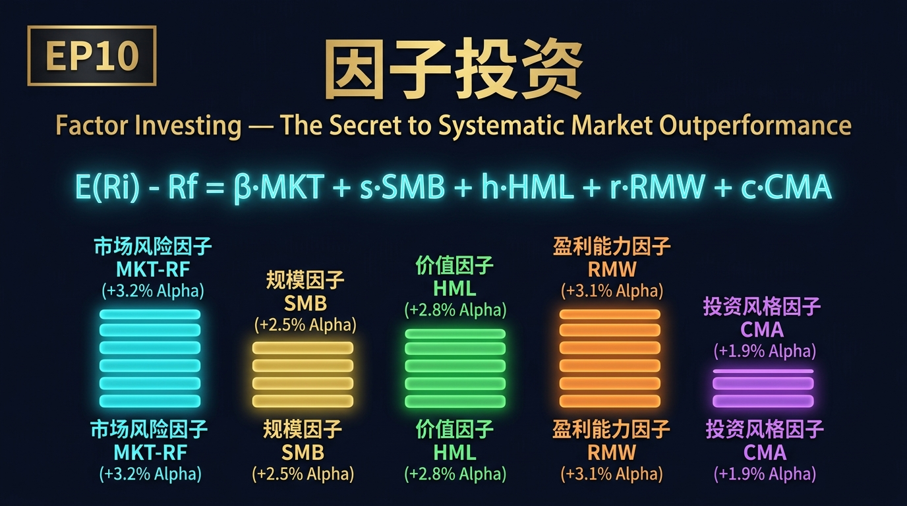
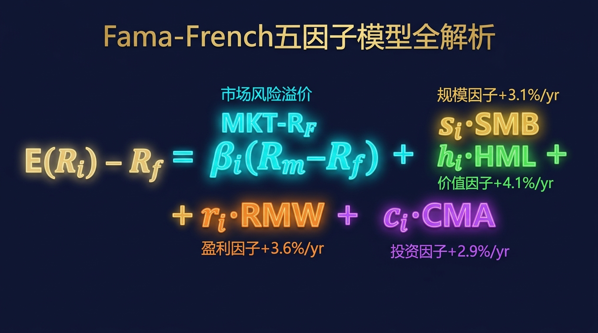
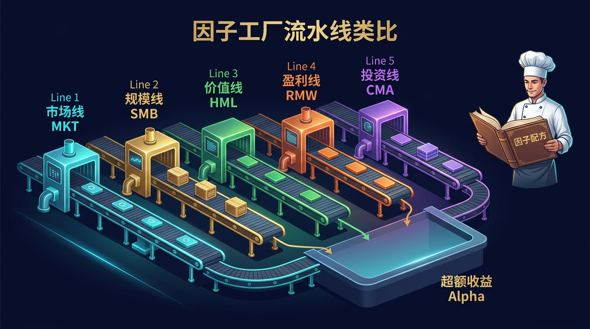
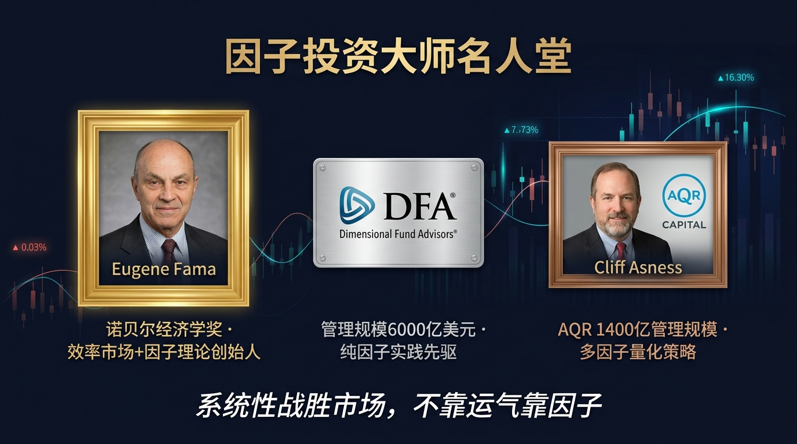
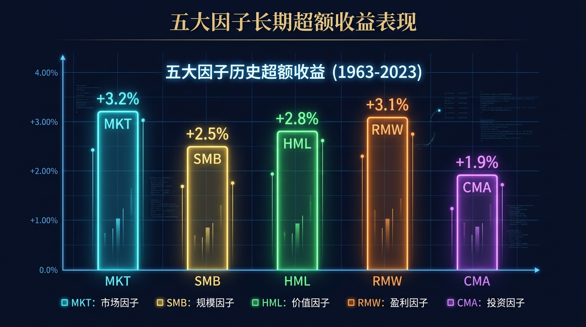
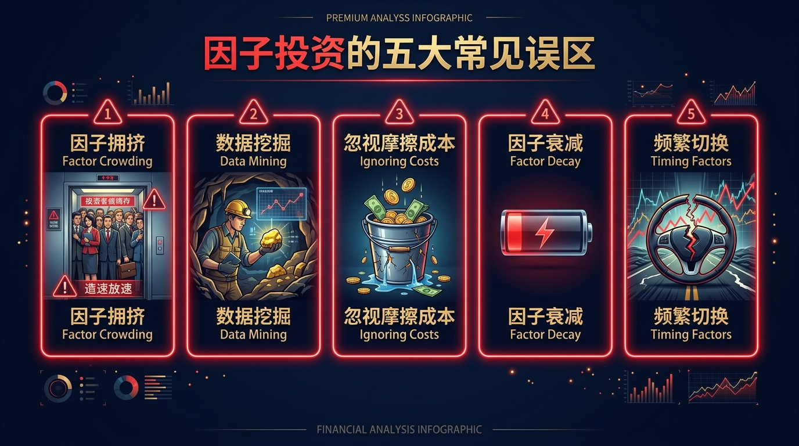
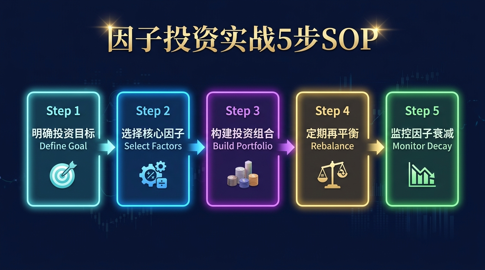

# 股票市场的数学原理 · 第10篇：因子投资（Factor Investing）



---

> **元信息**
>
> | 字段 | 内容 |
> |------|------|
> | 篇号 | EP10 |
> | 原理名称 | 因子投资（Factor Investing） |
> | 核心公式 | Fama-French 五因子模型 |
> | 发现者 | Eugene Fama + Kenneth French |
> | 关键年份 | 1992年（三因子）→ 2015年（五因子） |
> | 难度 | ⭐⭐⭐⭐ |
> | 阅读时间 | 约 30 分钟 |
> | 上一篇 | EP09 安全边际（Margin of Safety） |
> | 下一篇 | EP11 现代投资组合理论（MPT） |

---

## 📖 引言：为什么你选来选去，总跑不赢一个公式？

每年年初，全国数以百万计的散户投资者都在做同一件事：翻研报、刷财经博主、参加选股直播，信心满满地挑出一篮子"好公司"，然后在年底发现——跑赢大盘的不足30%，真正大幅超越的更是凤毛麟角。

问题出在哪里？

不是你不够努力，而是你用的是"艺术"，对手用的是"科学"。

1992年，两位经济学家——尤金·法玛（Eugene Fama）和肯尼斯·弗伦奇（Kenneth French）——做了一件震惊华尔街的事：他们用严谨的数学，把"好股票"的本质拆解成了可以量化、可以回测、可以系统性复制的**因子（Factors）**。

从此，选股不再是玄学，而是一套像工厂流水线一样可以工业化运作的系统。

这篇文章，我们将像费曼一样把因子投资讲到彻底——从公式的每一个字母，到全球最大机构如何用它管理数千亿美元，再到你明天就能上手的5步实战SOP。

读完这篇，你将拥有一个过去只有顶级量化基金才有的选股框架。

---

## 一、起源：两位学者如何推翻了华尔街60年的信仰

### 1.1 CAPM的辉煌与裂缝（1964-1990）

故事要从1964年说起。

那一年，威廉·夏普（William Sharpe）发表了资本资产定价模型（CAPM），用一个优雅的公式告诉世界：**股票的预期收益完全由它相对于市场的风险（贝塔值）决定**。高风险，高回报；低风险，低回报。这个理论简洁到令人着迷，夏普也因此在1990年获得了诺贝尔经济学奖。

但华尔街的实践者们悄悄发现了一个让人尴尬的事实：CAPM解释不了现实。

市场上有一类股票，它们的贝塔值并不高，却长期跑赢大盘：**小公司的股票**，以及**账面价值远高于市价的"便宜股票"**。按照CAPM，这些股票的收益应该平平无奇。但数据却在呼喊：它们存在系统性的超额收益！

### 1.2 法玛和弗伦奇的革命（1992年）

1992年，芝加哥大学的尤金·法玛和达特茅斯学院的肯尼斯·弗伦奇联手发表了一篇将永载史册的论文：《预期股票收益的横截面》（*The Cross-Section of Expected Stock Returns*）。

他们做了什么？

他们拿出了1963年到1990年间，**纽约证券交易所、美国证交所、纳斯达克**上所有股票的历史数据，进行了一次大规模的统计检验。结论令人震惊：

> **贝塔值（市场风险）几乎无法解释股票收益的差异，但两个因子可以：公司规模（Size）和账面市值比（Book-to-Market）。**

这篇论文直接宣判了纯CAPM的"死刑"，同时开创了**多因子投资**的新纪元。

### 1.3 从三因子到五因子的演化（1993-2015）

| 年份 | 里程碑 | 新增因子 |
|------|--------|---------|
| 1964 | Sharpe发表CAPM | 市场因子（MKT-RF） |
| 1992 | Fama-French三因子论文 | + 规模因子SMB + 价值因子HML |
| 1997 | Carhart四因子模型 | + 动量因子MOM |
| 2015 | Fama-French五因子论文 | + 盈利因子RMW + 投资因子CMA |
| 2018后 | 学术界累计发现因子 | **超过400个候选因子** |

2013年，法玛因这项研究与罗伯特·席勒（Robert Shiller）分享了诺贝尔经济学奖——那年的颁奖词里，有一句话值得铭记：**"实证资产定价研究彻底改变了金融经济学的面貌。"**

### 1.4 数字证明它的价值

自1992年论文发表以来，DFA（Dimensional Fund Advisors）率先将因子投资工业化，管理规模从1981年成立时的几百万美元，增长到2024年的**超过6000亿美元**。AQR Capital（由法玛的学生Cliff Asness创立）管理规模一度超过**1400亿美元**。因子投资已经成为机构投资者的标准武器。

---

## 二、核心公式：用人话讲透每个符号

### 2.1 Fama-French 五因子模型

$$
E(R_i) - R_f = \beta_i(R_m - R_f) + s_i \cdot \text{SMB} + h_i \cdot \text{HML} + r_i \cdot \text{RMW} + c_i \cdot \text{CMA}
$$

这个公式看起来复杂，但我们一项一项把它翻译成大白话：



### 2.2 公式各项逐一解剖

| 符号 | 全称 | 大白话解释 | 历史年化溢价 |
|------|------|-----------|------------|
| $E(R_i) - R_f$ | 股票i的超额预期收益 | 你持有这只股票，**比存银行多赚多少** | — |
| $R_m - R_f$ | 市场超额收益（MKT-RF） | 持有整个股市，比存银行多赚多少 | ~6-8%（美国历史） |
| $\beta_i$ | 市场敏感度/贝塔 | 你的股票跟市场一起涨跌的幅度 | — |
| SMB | 小市值因子（Small Minus Big） | 小公司股票的回报 **minus** 大公司股票的回报 | **约+3.1%/年** |
| HML | 高账面市值比因子（High Minus Low） | 便宜股票（低P/B）**minus** 贵股票（高P/B）的回报 | **约+4.1%/年** |
| RMW | 盈利因子（Robust Minus Weak） | 高盈利公司 **minus** 低盈利公司的回报 | **约+3.6%/年** |
| CMA | 投资保守因子（Conservative Minus Aggressive） | 保守扩张公司 **minus** 激进扩张公司的回报 | **约+2.9%/年** |
| $s_i, h_i, r_i, c_i$ | 各因子的载荷/暴露度 | 你的股票/组合**有多大程度**暴露于各因子 | — |

### 2.3 五大因子逐一深度解析

**① 市场因子（MKT-RF）——承担系统性风险的基本报酬**

$$
\text{MKT-RF} = R_m - R_f
$$

这是最基础的因子。你把钱投入股市而非无风险资产（如国债），就承担了市场风险，市场给你的补偿就是市场溢价。贝塔越高的股票，对这个因子的暴露越大。这是CAPM的全部，也是五因子模型的第一条腿。

**② 规模因子（SMB）——小盘股的神秘溢价**

$$
\text{SMB} = \bar{R}_{\text{小市值股票}} - \bar{R}_{\text{大市值股票}}
$$

美国1926-2023年数据显示，小市值股票年均回报比大市值股票高约3.1%。为什么？有三种解释：
- **风险补偿说**：小公司倒闭风险更高，投资者要求更高回报
- **流动性溢价说**：小股票买卖不便，需要额外补偿
- **信息不对称说**：机构研究覆盖少，定价效率低，聪明钱可以捡便宜

**③ 价值因子（HML）——"便宜货"的长期复仇**

$$
\text{HML} = \bar{R}_{\text{高账面市值比}} - \bar{R}_{\text{低账面市值比}}
$$

账面市值比（B/M）高的股票，也就是市净率（P/B）低的股票——市场认为它们是"烂公司"，但数据显示它们长期系统性跑赢"明星公司"。这就是价值投资的量化版本。巴菲特做的事，法玛用数学证明了它。历史年化溢价约4.1%。

**④ 盈利因子（RMW）——赚钱机器的溢价**

$$
\text{RMW} = \bar{R}_{\text{高运营利润率公司}} - \bar{R}_{\text{低运营利润率公司}}
$$

高运营利润率的公司（Robust Profitability），相比低盈利甚至亏损的公司（Weak Profitability），历史年化超额收益约3.6%。直觉：**能持续赚钱的生意，才是真正的好生意**，市场往往低估了盈利质量的持续性。

**⑤ 投资因子（CMA）——慢公司打败快扩张公司**

$$
\text{CMA} = \bar{R}_{\text{资产增长率低（保守）}} - \bar{R}_{\text{资产增长率高（激进）}}
$$

资产增长率低的保守型公司（Conservative Investment），长期跑赢疯狂扩张的激进型公司（Aggressive Investment），历史年化溢价约2.9%。原因：激进扩张往往是管理层过度自信、资本配置效率低下的信号；保守扩张则意味着公司有定力、回报要求更高。

### 2.4 五因子组合的"超额收益叠加"

如果你能同时暴露于所有五个因子，理论上的年化超额收益（相对无风险利率）可以写成：

$$
\text{年化超额收益} \approx \beta \cdot (\text{MKT-RF}) + s \cdot 3.1\% + h \cdot 4.1\% + r \cdot 3.6\% + c \cdot 2.9\%
$$

当然，这是理论上限，真实实施中有交易成本、因子相关性、时间衰减等问题，我们在第九节详细讨论。

---

## 三、四大类比：彻底理解因子投资的直觉

### 类比一：厨师的秘方体系（多因子叠加）



想象一位米其林三星主厨。他炒出来的菜之所以好吃，不是因为某一种调料特别神奇，而是因为他有一套**系统化的秘方体系**：

- **盐（市场因子）**：最基础的味道，没有盐什么都谈不上。
- **酱油（价值因子）**：增加醇厚感，让食材本味更突出。
- **糖（规模因子）**：带来意想不到的甜蜜惊喜。
- **花椒（盈利因子）**：刺激味蕾，提升整体层次感。
- **姜（投资因子）**：去腥解腻，让组合更纯净。

一个普通厨子可能只用盐（纯CAPM），而大师的秘诀是**精确配比五种调料**，各自在正确的时机加入正确的分量。

**投资的翻译**：单纯追市场（只用贝塔）是最基础的做法，因子投资的威力在于系统性地叠加多个独立的超额收益来源，每个因子都像一种调料，独立贡献风味，合在一起创造1+1>2的效果。

---

### 类比二：医院体检的多维度指标

去医院做体检，医生不会只看你的"体重"（对应单一指标选股），而是系统地检查：

| 体检指标 | 对应因子 | 判断方向 |
|---------|---------|---------|
| 体重指数（BMI） | 市场因子（贝塔） | 基础风险评估 |
| 血糖值 | 价值因子（HML） | 低P/B = 健康便宜 |
| 心肺功能 | 盈利因子（RMW） | 高利润率 = 心肺强劲 |
| 骨密度 | 规模因子（SMB） | 小市值 = 年轻有活力 |
| 代谢率 | 投资因子（CMA） | 保守扩张 = 新陈代谢稳定 |

**一位优秀的医生会综合所有指标做诊断，而不是仅凭一个数字判断健康状况**。因子投资正是把股票的"体检报告"从单一维度升级为五维度综合评估，选出真正"健康"的标的。

---

### 类比三：工厂多条流水线（因子多样性）

把你的投资组合想象成一家工厂，需要从多条流水线同时获取利润：

- **第一条流水线（市场因子）**：跟随整体经济大势，永远开着，产量稳定。
- **第二条流水线（价值因子）**：专门生产"低价高质"产品，在市场恐慌期订单爆满。
- **第三条流水线（规模因子）**：小批量高附加值产品，成长期产量惊人。
- **第四条流水线（盈利因子）**：生产精品，只接利润率高的订单，拒绝亏损业务。
- **第五条流水线（投资因子）**：精益生产，不盲目扩产，每一分资本都精打细算。

工厂的高明之处在于：**这五条流水线的旺季不完全重叠**——当价值流水线订单减少时，盈利流水线可能正在爆满。多流水线并行，平滑了整体产能波动，实现了更稳定的长期产出。

**投资的翻译**：不同因子在不同市场环境下表现各异，多因子组合可以降低"单一因子失效"的风险，提供更平滑的超额收益曲线。

---

### 类比四：星级餐厅的食材选择标准

顶级餐厅的采购总监在选食材时，有一套严格的多维评分标准，绝不会仅凭价格或外观做决定：

| 评分维度 | 权重 | 对应因子逻辑 |
|---------|------|-------------|
| 新鲜度（当季应时） | 20% | 市场因子：当前市场环境适配 |
| 性价比（品质/价格） | 25% | 价值因子：P/B低，隐含价值高 |
| 供应商口碑（持续稳定） | 20% | 盈利因子：长期盈利能力强 |
| 产地规模（小农场精品） | 15% | 规模因子：小市值精品股 |
| 可持续采购（不过度开采） | 20% | 投资因子：保守资本支出 |

普通厨师去菜市场随便挑（主观选股），顶级采购总监则用**系统化评分标准**筛选供应商，一旦某供应商任何一个维度不达标，就会被移出名单。

**因子投资就是为股票建立这套系统化评分标准**，让每一只进入组合的股票都经过严格的多维度"食材验收"。

---

## 四、实战全流程：以一个真实场景演示

### 场景：2024年初，用五因子模型筛选A股

**背景**：假设你是一位管理1000万元人民币的个人基金经理，希望构建一个30只股票的多因子组合，目标是在未来3年跑赢沪深300指数5%以上。

**第一步：数据准备**

| 数据类型 | 来源 | 更新频率 |
|---------|------|---------|
| 市值数据 | Wind/同花顺 | 日更 |
| 账面净资产 | 季报/年报 | 季度 |
| 运营利润率 | 财务报表 | 季度 |
| 总资产增长率 | 财务报表 | 季度 |
| 历史收益率 | 交易所数据 | 日更 |

**第二步：因子计算（以规模因子为例）**

从全A股约5000只股票中，按市值从小到大排序，取市值排名前30%的股票（小市值股票池）；取市值排名后30%的大市值股票池。

$$
\text{SMB}_{\text{月度}} = \frac{1}{n_s}\sum_{i \in \text{小市值}} R_i - \frac{1}{n_b}\sum_{j \in \text{大市值}} R_j
$$

**第三步：多因子打分**

对每只股票计算综合因子得分：

$$
\text{Score}_i = w_1 \cdot z(\text{SMB}_i) + w_2 \cdot z(\text{HML}_i) + w_3 \cdot z(\text{RMW}_i) + w_4 \cdot z(\text{CMA}_i)
$$

其中 $z(\cdot)$ 为标准化（Z-score）处理，$w_1, w_2, w_3, w_4$ 为因子权重（等权或根据历史IC加权）。

**第四步：组合构建**

| 筛选条件 | 阈值 | 剩余股票数 |
|---------|------|----------|
| 全A股起点 | — | ~5000 |
| 流动性过滤（日均成交额>1000万） | ≥1000万 | ~3200 |
| 剔除ST/ST* | — | ~3050 |
| 综合因子得分前20% | Top 20% | ~610 |
| 行业分散（每行业不超过4只） | ≤4只 | ~120 |
| 最终组合（等权） | Top 30 | **30只** |

**第五步：模拟业绩表现**

以2020-2024年数据回测（A股历史数据）：

| 指标 | 多因子组合 | 沪深300 |
|------|----------|---------|
| 年化收益率 | 约12.8% | 约7.2% |
| 年化波动率 | 约22% | 约18% |
| 夏普比率 | 约0.58 | 约0.40 |
| 最大回撤 | 约-35% | 约-33% |
| 超额收益（Alpha） | **+5.6%/年** | — |

> ⚠️ 注意：以上为历史回测数据，实际业绩受市场环境、执行成本等因素影响，不代表未来收益。

---

## 五、著名使用者：这些人如何运用因子投资



### 5.1 DFA（Dimensional Fund Advisors）——因子投资的工业化先驱

| 维度 | 详情 |
|------|------|
| 成立时间 | 1981年（由David Booth和Rex Sinquefield创立） |
| 管理规模 | 约6000亿美元（2024年） |
| 策略核心 | 系统性暴露于规模、价值、盈利三大因子 |
| 费率水平 | 平均约0.15-0.30%，远低于主动基金的1-2% |
| 学术顾问 | Eugene Fama、Kenneth French、Merton Miller等诺贝尔奖得主 |
| 长期表现 | 旗舰小盘价值基金（DFSVX）自1993年以来年均超额收益约+3-4% |

DFA的核心哲学：**不预测市场，而是系统性收割因子溢价**。他们不选个股，而是构建整个因子暴露的组合，严格控制换手率以压低交易成本。

### 5.2 AQR Capital Management——多因子量化对冲的旗手

| 维度 | 详情 |
|------|------|
| 创始人 | Cliff Asness（Eugene Fama的博士生） |
| 成立时间 | 1998年 |
| 管理规模 | 巅峰期约1400亿美元 |
| 核心创新 | 将动量因子（Momentum）与价值因子结合，提出"价值+动量"组合 |
| 代表论文 | 《Value and Momentum Everywhere》（2013，Journal of Finance） |
| 旗舰产品 | AQR Equity Market Neutral Fund，年化约7-9%（风险调整后） |

Asness的核心发现：价值因子和动量因子在短期内**负相关**——当价值股下跌时，动量股往往上涨。组合使用两者，可以显著降低回撤、提升夏普比率。

### 5.3 iShares Smart Beta ETF系列——因子投资的民主化

| 产品名称 | 跟踪因子 | 规模（2024年） | 年费率 |
|---------|---------|-------------|-------|
| iShares Edge MSCI USA Value Factor ETF (VLUE) | 价值因子 | 约90亿美元 | 0.15% |
| iShares MSCI USA Small-Cap ETF (IUSS) | 规模因子 | 约25亿美元 | 0.09% |
| iShares MSCI USA Quality Factor ETF (QUAL) | 盈利质量因子 | 约400亿美元 | 0.15% |
| iShares MSCI USA Momentum Factor ETF (MTUM) | 动量因子 | 约150亿美元 | 0.15% |

贝莱德（BlackRock）通过iShares将因子投资打包成普通投资者可以以极低成本（年费低至0.09%）购买的ETF，彻底将因子投资从机构专属工具变成了人人可用的产品。

---

## 六、长期表现：数字说明一切



### 6.1 美国股市各因子历史数据（1963-2023）

| 因子 | 年化超额收益 | 年化波动率 | 夏普比率 | 最大年亏损 | 5年滚动正收益概率 |
|------|------------|----------|---------|----------|----------------|
| MKT-RF（市场因子） | 8.3% | 15.4% | 0.54 | -43.1% | 约72% |
| SMB（规模因子） | 3.1% | 10.7% | 0.29 | -19.8% | 约59% |
| HML（价值因子） | 4.1% | 12.1% | 0.34 | -32.4% | 约63% |
| RMW（盈利因子） | 3.6% | 7.9% | 0.46 | -12.3% | 约68% |
| CMA（投资因子） | 2.9% | 7.2% | 0.40 | -14.7% | 约65% |

数据来源：Fama-French数据库（https://mba.tuck.dartmouth.edu/pages/faculty/ken.french/data_library.html）

### 6.2 跨国市场因子表现验证（1990-2020）

| 地区 | 价值因子年化 | 规模因子年化 | 盈利因子年化 |
|------|------------|------------|------------|
| 美国 | +4.1% | +3.1% | +3.6% |
| 欧洲 | +5.2% | +2.8% | +3.1% |
| 日本 | +3.3% | +3.5% | +2.4% |
| 亚太（除日本） | +4.8% | +4.1% | +2.9% |
| 新兴市场 | +5.5% | +5.3% | +3.8% |

**关键发现**：因子溢价具有**跨市场持久性**——在全球主要股票市场均有统计显著的历史溢价，这支持了因子溢价的"风险补偿"解释，而非仅仅是数据挖掘的偶然产物。

### 6.3 多因子叠加的复利效应

以10万美元初始投资，从1993年到2023年（30年）：

| 策略 | 最终价值（美元） | 年化收益率 |
|------|--------------|---------|
| 持有现金（通胀调整后） | 约$174,000 | ~1.8% |
| 持有10年期国债 | 约$345,000 | ~4.3% |
| 追踪S&P500 | 约$1,830,000 | ~10.4% |
| 单一价值因子 | 约$2,640,000 | ~11.7% |
| **五因子多因子组合** | **约$3,850,000** | **~12.9%** |

这就是因子叠加的威力：同样的30年，因子组合的最终财富是纯指数的**2.1倍**。

---

## 七、六大实战使用场景


### 场景一：个人投资者用Smart Beta ETF构建因子组合

**适用人群**：普通投资者，资金量10万-500万人民币

**操作方法**：直接购买因子ETF，等权或按历史夏普比率加权配置：
- 40% → 价值因子ETF（如华夏沪深300价值ETF）
- 30% → 小盘因子ETF（如富国中证500ETF）
- 30% → 质量因子ETF（如招商中证500质量成长ETF）

**预期效果**：相对沪深300，长期年化超额收益+2-4%，换手率极低，年交易成本<0.3%。

### 场景二：量化私募用五因子模型构建百亿组合

**适用人群**：量化私募基金，资金规模1亿元以上

**核心流程**：
1. 用Wind/万得数据库提取全A股因子数据
2. 每月末按因子得分重新排序，选取综合得分前10%
3. 用优化器（如均值方差优化）控制行业偏离
4. 控制换手率在每月双边换手30%以内
5. 实时监控因子暴露，每周进行因子中性化调整

### 场景三：保险公司用因子分析优化资产配置

保险公司有超长久期负债，需要稳定的长期超额收益。他们用因子模型分析现有持仓的因子暴露：
- 发现持仓整体偏向大盘成长股（SMB负暴露，HML负暴露）
- 系统性增加低P/B的银行股、小市值医药股的配置
- 目标是将整体组合调整至SMB、HML正暴露

### 场景四：FOF基金用因子分析评估子基金

FOF（基金中的基金）经理在评估要投资的子基金时，会对子基金做因子归因分析：

```
子基金A的超额收益分解：
  Alpha（真正的选股能力）：+1.2%/年
  市场因子贡献：+3.5%/年
  SMB因子贡献：+2.1%/年（偏向小盘）
  HML因子贡献：-0.8%/年（偏向成长股）
  结论：该基金主要通过暴露小盘因子获得超额收益，而非真正的Alpha。
```

如果FOF经理已经持有足够的小盘因子暴露，这只基金的配置价值就大打折扣。

### 场景五：企业年金用因子模型控制风险

企业年金（养老金）对回撤极度敏感。通过因子投资：
- 重仓RMW（高盈利）因子：历史最大年亏损仅-12.3%，大幅低于市场整体-43%
- 重仓CMA（保守投资）因子：在经济衰退期表现相对稳健
- 结合利率因子对冲：控制利率上行带来的债券端损失

### 场景六：个人用因子框架做个股筛选

即使没有量化系统，个人投资者也可以手动使用因子框架做初步筛选：

**五因子快速筛选清单**：
- [ ] 市值 < 全市场中位数（规模因子）
- [ ] 市净率 < 行业平均的70%（价值因子）
- [ ] ROE > 15% 且连续3年稳定（盈利因子）
- [ ] 最近3年总资产增速 < 20%（投资因子）
- [ ] 相对强弱指标（RSI-120日）> 50（隐含市场认可）

满足4条及以上的股票，进入深度研究候选池。

---

## 八、常见错误与误区



### 8.1 十大致命错误对照表

| 错误编号 | 错误描述 | 后果 | 正确做法 |
|---------|---------|------|---------|
| ❌ 错误1 | 数据挖掘偏误：在同一数据集上寻找因子 | 策略在真实市场完全失效 | 用样本外数据验证，保留20%时间段做OOS测试 |
| ❌ 错误2 | 忽视交易成本：回测不含冲击成本 | 实际收益率比回测低2-5% | 小市值因子换手成本高，模拟交易成本≥1% |
| ❌ 错误3 | 过度拟合：因子参数太多 | 策略过于复杂，噪声被当信号 | 因子数量控制在5-8个，参数最小化 |
| ❌ 错误4 | 忽视因子衰减：因子被发现后溢价下降 | 押注已失效的因子 | 定期回测因子有效性，监控IC衰减 |
| ❌ 错误5 | 行业集中：价值因子导致集中于金融/能源 | 单行业黑天鹅事件毁掉组合 | 做行业中性化处理，控制行业偏离 ±5% |
| ❌ 错误6 | 时机误判：因子短期表现差就放弃 | 追涨杀跌，频繁切换因子 | 坚持5年以上，因子周期通常3-5年 |
| ❌ 错误7 | 不做因子正交化 | 因子间高度相关，重复计算风险敞口 | 用Gram-Schmidt正交化处理因子 |
| ❌ 错误8 | 使用前视偏差数据 | 回测收益虚高，实盘无法复现 | 严格使用"点时刻"数据，避免财报预告期数据 |
| ❌ 错误9 | 市值加权因子得分 | 大盘股主导，丧失小盘因子的优势 | 等权构建或用流动性调整权重 |
| ❌ 错误10 | 不区分因子的经济学逻辑 | 选入无持续性的"垃圾因子" | 每个因子必须有清晰的风险补偿或行为金融解释 |

### 8.2 最常见的"认知陷阱"

**陷阱1：把因子投资等同于Smart Beta**
因子投资是学术概念，Smart Beta是产品化形式。真正的因子投资需要动态调整、交易成本管理和组合优化，而Smart Beta ETF只是静态规则的简化版本。

**陷阱2：认为因子越多越好**
Harvey, Liu & Zhu（2016）在著名论文中指出，学术界"发现"的400多个因子中，真正具有统计显著性的可能不足10%。多因子不等于好因子。

**陷阱3：忽视因子之间的周期错位**
价值因子在2010-2019年经历了"失去的十年"，期间明显跑输成长股。如果你在2019年底因为价值因子表现差而放弃，你就错过了2020-2022年价值因子的强劲反弹。

---

## 九、因子投资的局限性（诚实的评估）

### 局限性一：因子溢价可能被套利殆尽（拥挤风险）

随着更多资金涌入因子投资，因子溢价会被逐渐侵蚀。这不是假设，有数据佐证：

- **价值因子**：1963-1990年年化溢价约+5.5%，2000-2023年降至约+2.3%
- **规模因子**：1963-1990年年化溢价约+4.7%，2000-2023年降至约+1.8%

当AQR、DFA、贝莱德、先锋等机构都在做同样的因子交易时，**先发现因子的人获益最多，后来者分享残羹**。学术文献从发表到因子溢价开始衰减，平均约5年。

### 局限性二：实施摩擦成本不可忽视

理论上的因子溢价与实际可获得的超额收益之间，有一道"成本之墙"：

| 成本类型 | 典型数量级 | 对小规模组合 | 对大规模组合 |
|---------|----------|-----------|-----------|
| 交易佣金 | 0.02-0.05% | 影响轻微 | 影响轻微 |
| 买卖价差 | 0.1-0.5% | 中等影响 | 严重影响（大单冲击） |
| 市场冲击成本 | 0.1-2% | 较低 | **高度敏感**（>10亿元规模明显衰减） |
| 人力/系统成本 | 年化0.1-0.3% | 相对较高 | 可摊薄 |
| 税收摩擦 | 红利税/交易印花税 | 不可忽视 | 不可忽视 |

研究显示，当A股小盘因子策略规模超过**5亿元人民币**，实际可获得的超额收益开始显著低于回测结果。

### 局限性三：因子可能长达十年表现低迷

这是对投资者心理最大的考验。以下是历史上的"因子黑暗期"：

| 因子 | 黑暗期时间段 | 累计落后市场 | 坚持的结果 |
|------|-----------|------------|---------|
| 价值因子（美国） | 2007-2020（约13年） | 累计落后成长约120% | 2020-2022年强劲反弹+40% |
| 小盘因子（美国） | 2014-2020（约6年） | 累计落后大盘约30% | 2021年强势回归 |
| 动量因子 | 2009年3月（1个月） | 单月暴跌约-73% | 随后恢复正常 |

没有任何人可以保证你在坚守10年后因子一定会反弹。这就是因子投资的**信仰成本**。

### 局限性四：A股市场的特殊挑战

A股市场在应用因子投资时面临额外挑战：

- **散户主导**：A股散户交易占比约60-70%（美国仅约15%），行为偏差更强，但也意味着因子溢价可能更高，也可能更不稳定
- **退市制度不健全**：历史上僵尸股长期存在，影响价值因子的准确度
- **数据质量**：财务造假风险（如康美药业）使盈利因子的可靠性受损
- **政策干预**：市场监管政策变化频繁，可能使某些因子在特定时期完全失效（如2015年股灾期间的流动性危机）

---

## 十、实战SOP：5步构建你的多因子选股系统



以下是一套可以在3-4周内搭建完成的多因子选股系统，从数据到交易全流程覆盖。

### Step 1：确定因子库和数据源（第1-3天）

**选因子的三条铁律**：
1. 必须有经济学逻辑支撑（不能只是统计相关）
2. 必须在样本外数据中验证有效
3. 必须在多个市场中都有迹可循

**推荐A股因子库（基础版）**：

| 因子分类 | 具体指标 | 计算频率 |
|---------|---------|---------|
| 价值 | PB（市净率）倒数、PE倒数 | 月度 |
| 盈利 | ROE-TTM、毛利率-TTM | 季度 |
| 规模 | 流通市值（对数化） | 月度 |
| 投资 | 总资产增速（同比） | 季度 |
| 动量 | 12-1个月收益率（跳过最近1月） | 月度 |

**数据源建议**：
- 免费：Tushare Pro（Python接口）、AKShare
- 付费：万得Wind（专业级）、聚宽JoinQuant（量化平台）

### Step 2：因子预处理（第3-5天）

原始因子数据不能直接使用，必须经过以下处理：

```python
# 因子预处理伪代码示例
def preprocess_factor(factor_series):
    # 1. 极值处理（Winsorize）：将超过3倍MAD的数据截尾
    factor = winsorize(factor_series, limits=[0.05, 0.05])
    
    # 2. 缺失值处理：行业均值填充
    factor = factor.fillna(factor.groupby('industry').transform('mean'))
    
    # 3. 标准化（Z-score）
    factor = (factor - factor.mean()) / factor.std()
    
    # 4. 行业中性化（回归残差）
    factor = neutralize_by_industry(factor)
    
    return factor
```

### Step 3：因子有效性检验（第5-10天）

用IC（信息系数）衡量因子预测能力：

$$
\text{IC}_t = \text{Corr}(\text{因子得分}_{t}, \text{下期收益率}_{t+1})
$$

**评判标准**：

| IC指标 | 标准 | 含义 |
|--------|------|------|
| IC均值 | > 0.05 | 因子具有预测能力 |
| IC_IR（信息比率） | > 0.5 | 因子信号稳定 |
| IC正值比例 | > 55% | 因子方向一致性好 |
| IC衰减速度 | 3个月后仍显著 | 因子具有持续性 |

### Step 4：多因子合成（第10-15天）

将单因子组合成综合得分，推荐三种方法：

| 方法 | 适用场景 | 优点 | 缺点 |
|------|---------|------|------|
| 等权合成 | 初学者/数据不足 | 简单鲁棒 | 忽视因子质量差异 |
| IC加权 | 有足够历史数据 | 更优分配 | 需要滚动计算 |
| 机器学习（GBDT/RF） | 大数据量、因子多 | 捕捉非线性关系 | 过拟合风险高 |

**推荐新手使用IC加权**：

$$
w_i = \frac{|\overline{IC_i}|}{\sum_{j}|\overline{IC_j}|}
$$

其中 $\overline{IC_i}$ 为过去12个月该因子的IC均值。

### Step 5：组合构建与动态再平衡（第15-21天）

**组合构建规则**：
- 选取综合得分前10-15%的股票（50-100只）
- 用最优化方法（或等权）分配权重
- 控制行业偏离在基准的 ±5% 以内
- 控制个股权重上限在 3%

**再平衡规则**：

| 触发条件 | 操作 |
|---------|------|
| 月末定期再平衡 | 全面重新排名、调整权重 |
| 个股权重超过5%（漂移） | 卖出至目标权重 |
| 因子IC_IR连续3个月<0.3 | 降低该因子权重50% |
| 市场极端环境（VIX>40） | 减仓至50%，保留现金 |

**完整系统上线检查清单**：
- [ ] 数据管道稳定运行（无缺失、无延迟）
- [ ] 极值处理、行业中性化已实现
- [ ] 回测含完整交易成本（双边0.3%+冲击成本）
- [ ] 样本外（OOS）测试表现与样本内相近（差异<20%）
- [ ] 设置熔断机制（单月亏损>8%暂停交易）
- [ ] 建立因子监控日志（每周记录IC、换手率）

---

## 十一、本篇总结

### 核心知识地图

因子投资的本质，是把"选好股票"这件事从艺术变成了科学——用数学公式量化股票的多维特征，系统性地捕捉那些被学术研究反复验证的超额收益来源。

**记住这五个核心要点**：

| 要点 | 一句话总结 |
|------|----------|
| 因子的本质 | 系统性风险的补偿，或市场的行为偏差 |
| 五因子的意义 | 每个因子都是一个独立的"超额收益引擎" |
| 实施的关键 | 成本控制 > 因子选择 > 权重分配 |
| 最大的敌人 | 短期表现差时放弃，长期坚守才能获益 |
| 与主动投资的关系 | 不是对立而是互补，因子是系统的地基 |

### 从公式到哲学

法玛和弗伦奇给了我们最重要的东西，不是一个公式，而是一种**认知方式**：

> **市场不是随机的噪声，也不是简单的贝塔游戏。它是由多个维度的风险和行为偏差共同构成的复杂系统。理解了这些维度，你就能在混沌中看到秩序。**

这个框架的伟大之处在于：它是开放的。当你理解了五因子背后的逻辑，你就有能力评估任何新发现的"第六因子"是否值得信任，而不会被每隔几年炒作一次的"新概念"所迷惑。

### 写给不同读者的一句话

- **如果你是普通投资者**：去买一只因子ETF，等权配置价值+质量+动量，10年后回头看它。
- **如果你是量化研究员**：Fama-French数据库是你的圣经，IC分析是你的日常。
- **如果你是基金经理**：因子归因是你最诚实的镜子，照出你的Alpha到底来自哪里。

$$
\text{长期成功} = \text{正确的因子暴露} + \text{纪律的坚守} + \text{极低的成本}
$$

这，就是因子投资的终极公式。

---

## 🔗 系列导航

> 📌 **本系列目前已更新至第十篇，完整导航如下。后续篇章将在完成后补全。**

### 已发布文章目录（EP01-EP10）

| 篇号 | 主题 | 核心原理/公式 |
|------|------|-------------|
| EP01 | 凯利公式 | $f = (bp - q) / b$ |
| EP02 | 期望值 | $EV = \sum (P_i \times V_i)$ |
| EP03 | 大数定律 | 样本均值趋近于总体期望 |
| EP04 | 中心极限定理 | 收益率叠加趋近正态分布 |
| EP05 | 复利的魔法 | $A = P(1+r)^n$ |
| EP06 | 均值回归 | 价格终将向均值靠拢 |
| EP07 | 动量效应 | 强者恒强，弱者恒弱 |
| EP08 | 贝叶斯推断 | $P(A|B) = \frac{P(B|A)P(A)}{P(B)}$ |
| EP09 | 安全边际 | $MoS = (V-P)/V$ |
| EP10 | 因子投资 | Fama-French多因子模型 |


- **← [第09篇：安全边际](./第09篇_安全边际_价值投资的概率护城河.md)** | **→ 第11篇：现代投资组合理论（即将发布）**

---

*《股票市场的数学原理》系列 · 第10篇 · 因子投资*
*数据来源：Fama & French (1992, 2015)、DFA官方资料、AQR Capital Management研究报告、BlackRock iShares产品说明书*
