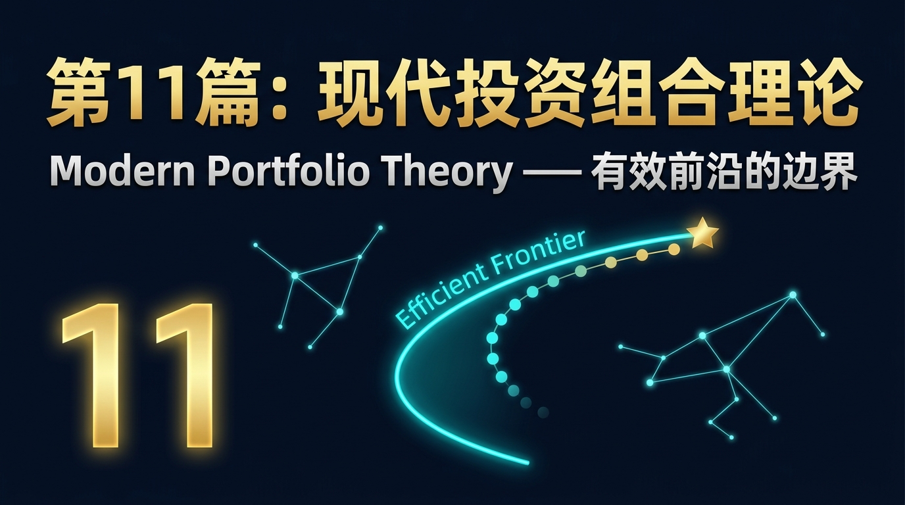
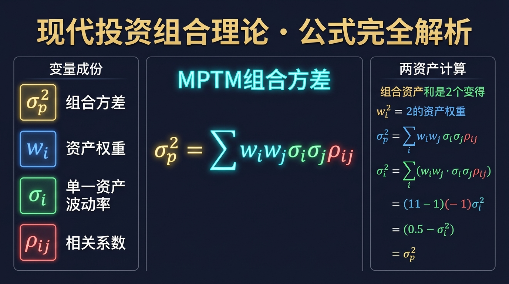
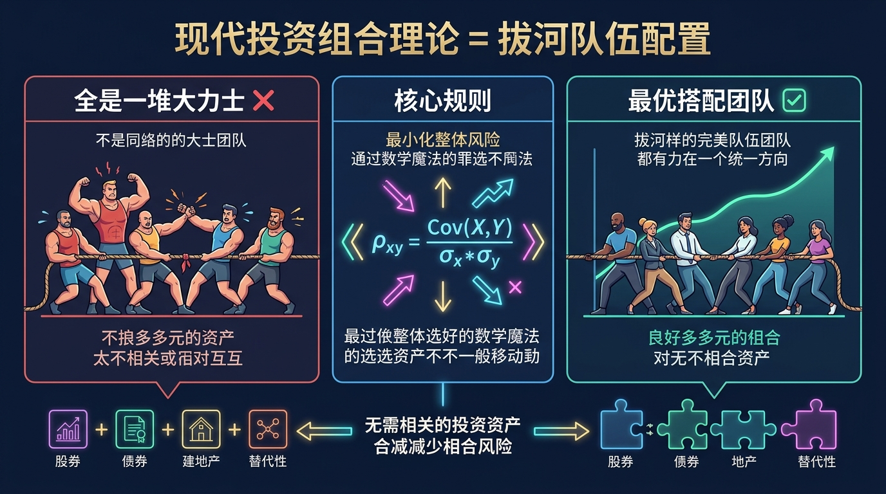
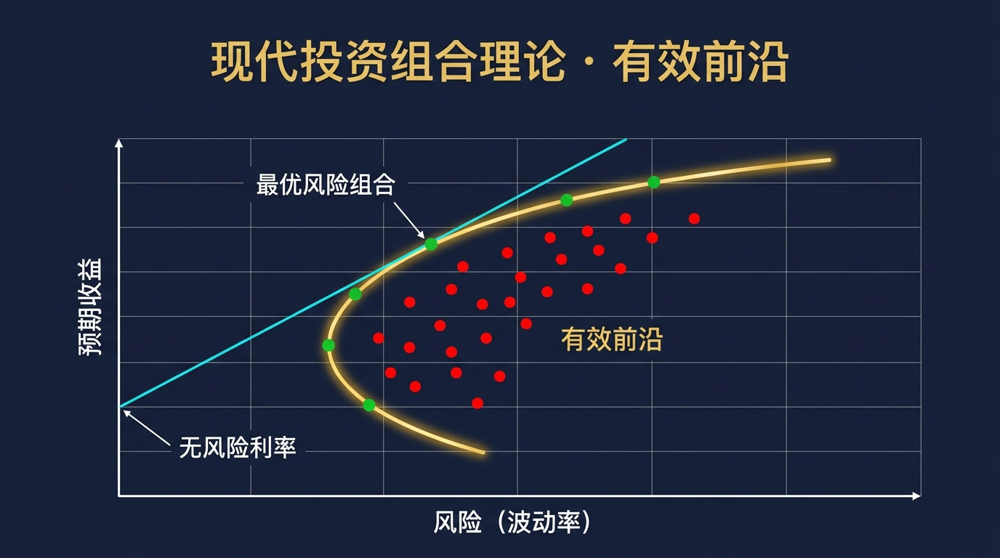
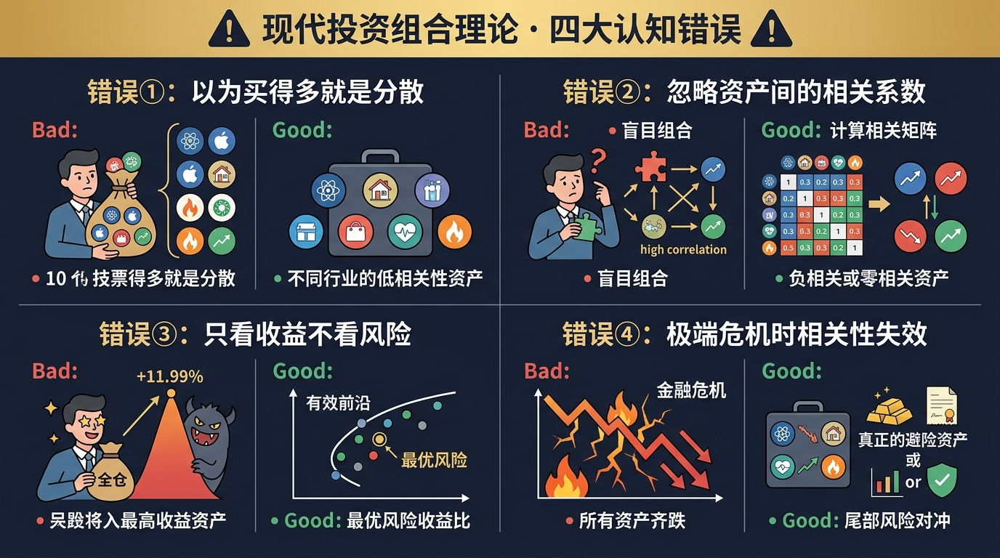
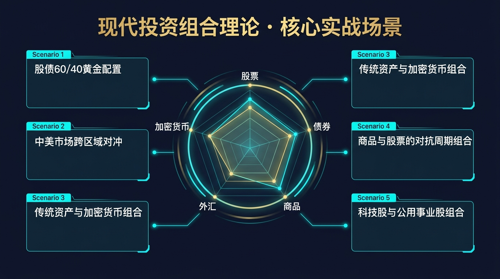
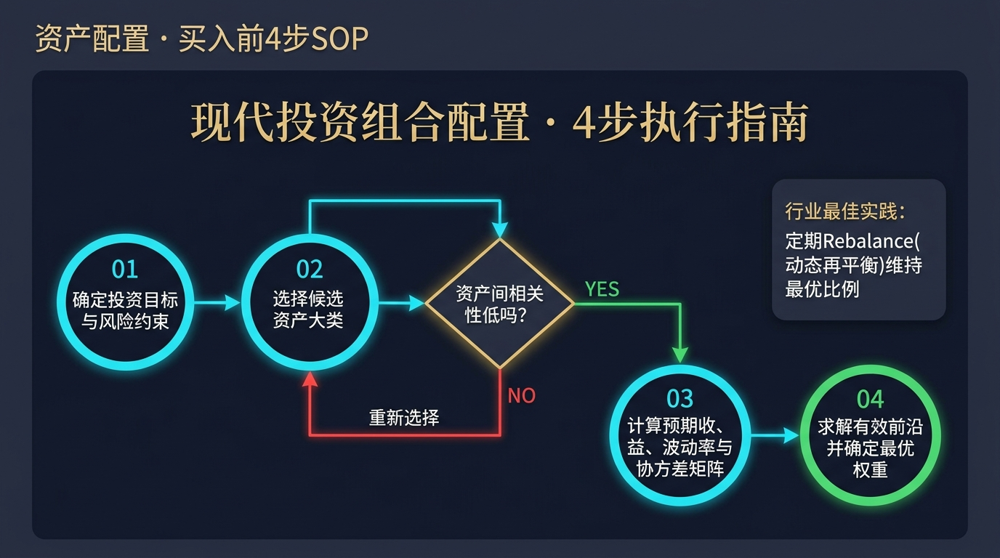

# 第11篇：现代投资组合理论——有效前沿的边界

> **“不要把所有鸡蛋放在一个篮子里，但更重要的是，确保这些篮子不在同一辆卡车上。”**

## 1. 痛点场景：为什么分散投资还是会腰斩？

你可能听过这句投资界最古老的格言：“不要把所有鸡蛋放在一个篮子里。”

于是，你买入了10只不同的股票：有做芯片的，有做软件的，有做云计算的，甚至还有做人工智能大模型的。你以为自己做到了完美的“分散投资”。

然而，当一场科技股的回调到来时，这10只股票几乎在同一天暴跌了20%。你的“分散投资”完全没有起到保护作用。为什么？

因为你只是把鸡蛋放在了**“10个长得不同的篮子里”**，但这10个篮子，**全都装在同一辆名为“科技行业周期”的卡车上**。当卡车翻车时，所有的篮子都会同时摔碎。

**这就是传统分散投资的致命盲区。**

真正的风险控制，不是简单地增加资产的数量，而是要理解资产之间是如何**共同波动**的。今天，我们将进入金融学历史上最伟大的数学革命之一：**现代投资组合理论（Modern Portfolio Theory, MPT）**，彻底搞懂如何构建真正的“防弹”组合。

---

## 2. 发现者与起源：图书馆里的灵光乍现

- **发现年份**：1952年
- **发现者**：哈利·马科维茨（Harry Markowitz）
- **发现机构**：芝加哥大学（发表于《金融杂志》）

1952年，25岁的马科维茨正在芝加哥大学攻读博士学位。一天下午，他在商学院图书馆阅读威廉姆斯的名著《投资价值理论》。当时的主流观点认为，投资者应该把所有的钱，投入到预期收益最高的那一只股票上。

马科维茨敏锐地发现了这种理论的荒谬之处：如果这只股票暴雷了怎么办？投资者不仅关心**收益**，同样（甚至更）关心**风险（波动率）**。

更重要的是，他突然意识到一个深刻的数学直觉：**整个投资组合的风险，并不等于单个资产风险的简单加权平均。** 如果两个资产的波动方向不一致（比如一个涨时另一个跌），它们组合在一起的风险，会**小于**它们各自风险的总和。

就因为这一个下午的灵光乍现，马科维茨在《金融杂志》上发表了长达14页的论文《投资组合选择》。这篇论文诞生了“现代投资组合理论”，不仅为他赢得了1990年的诺贝尔经济学奖，更直接催生了如今规模高达数十万亿美元的全球资产管理工业体系。华尔街评价说：“马科维茨为整个华尔街铺设了数学轨道。”

---

## 3. 核心公式与推导：方差与相关性的魔法

现代投资组合理论最核心的数学突破，在于它用严谨的公式定义了**组合方差（风险）**。

### 投资组合方差公式

对于包含多个资产的投资组合，其总方差（风险的平方）公式为：

$$ \sigma_p^2 = \sum_{i=1}^{n} \sum_{j=1}^{n} w_i w_j \sigma_i \sigma_j \rho_{ij} $$

**变量解析**：
- **$\sigma_p^2$（组合方差）**：代表整个投资组合的总风险大小。
- **$w_i, w_j$（资产权重）**：你在资产i和资产j上投入的资金比例（如各占50%）。
- **$\sigma_i, \sigma_j$（单资产标准差）**：单个资产各自的历史波动率（风险）。
- **$\rho_{ij}$（相关系数）**：**这是整个公式的灵魂所在！** 代表资产i和资产j的同向波动程度，取值范围在 $[-1, 1]$ 之间。

### 为什么 $\rho_{ij}$ 是魔法？

我们以最简单的两个资产（A和B，各占50%仓位）为例，公式可以简化为：

$$ \sigma_p^2 = w_A^2 \sigma_A^2 + w_B^2 \sigma_B^2 + 2 w_A w_B \sigma_A \sigma_B \rho_{AB} $$

请盯住最后那一项 $2 w_A w_B \sigma_A \sigma_B \rho_{AB}$：
1. **如果 $\rho_{AB} = 1$（完全正相关）**：A涨B也涨，A跌B也跌。此时组合的风险完全等于单资产风险的线性加权。这叫“把鸡蛋放在同一辆卡车上”。
2. **如果 $\rho_{AB} = 0$（零相关）**：A涨跌跟B毫无关系。此时后面的一大项变为0，组合风险立刻变小了。这就是多元化的好处。
3. **如果 $\rho_{AB} = -1$（完全负相关）**：A涨B必跌，A跌B必涨。此时后面那一项变为负数，它们完美对冲，组合方差可能降到0！这就是“无风险套利”的理论极限。

**结论**：只要你买的资产之间不是完全正相关（$\rho < 1$），投资组合的总风险就一定会**小于**单个资产风险的加权平均。这就是华尔街所说的“分散化是投资界唯一免费的午餐”。

---

## 4. 通俗理解：四种秒懂类比

为了让你彻底明白这个数学公式，我们用四个生活类比来解释。

### 类比一：拔河比赛与受力方向（相关系数的直觉理解）
如果你要组建一支拔河队伍，你会怎么选人？
- 传统的“选最强股票”思维：找十个力气最大的超级猛男。但这十个人可能各怀鬼胎，有的往东拉，有的往西拉（相关系数极低甚至是负相关），最后绳子根本不动，甚至被拉断。
- MPT思维：找十个力气虽然不那么大，但**受力方向完全一致**（正相关）的人。而在投资中，我们需要的是相反的逻辑：我们希望在保证整体力量向前的同时，有些人在左边稳住阵脚，有些人在右边防止侧翻，通过**不相关的力量互相抵消波动**。

### 类比二：雨伞摊与冰淇淋摊（负相关性的极致防守）
海滩边有两个小贩，一个卖冰淇淋，一个卖雨伞。
如果全是晴天，冰淇淋卖得爆好，雨伞血亏；如果是连续暴雨，雨伞卖断货，冰淇淋全部融化。这就是单资产的高波动。
如果你同时投资了这两个摊位（负相关组合），无论晴天雨天，你的总收入都极其稳定。这就是为什么我们需要在组合中加入黄金和国债，即便它们在牛市涨得慢，因为它们是你投资组合里的“雨伞”。

### 类比三：调色板与颜料混合（非线性效应）
单看红色和蓝色，它们都很刺眼。但只要把它们按一定比例混合，就会产生柔和的紫色。你无法用两种同一种红色的深浅调出紫色。只有引入不同维度的颜色（低相关性资产），才能调配出平滑的收益曲线。

### 类比四：餐厅的营养套餐（有效前沿的直觉）
去吃自助餐，你可以全部吃最贵的牛排（高收益极高风险），也可以全吃白菜（低收益零风险）。但对于一个追求健康的人来说，存在一条“营养与价格的最优边界”——在这个边界上，你用同样的钱买到了最多的蛋白质，或者在同样的蛋白质摄入下花了最少的钱。这就是MPT的核心：**有效前沿**。

---

## 5. 历史证据与实证数据：有效前沿曲线

在实战中，如果我们把所有可能的资产配比点投射到一张图上，横轴是风险（波动率），纵轴是预期收益，我们会得到一个伞状的区域。这个区域的左上部边界，就是著名的**有效前沿（Efficient Frontier）**。

有效前沿向我们揭示了三条铁律：
1. **任何落在边界内部的点（图中的红点），都是“次优”的**：因为你总能找到另一个配比，在不增加风险的情况下提高收益，或者在不降低收益的情况下减少风险。
2. **只有边界上的点（图中的绿点），才是“有效组合”**：在这里，收益最大化与风险最小化达到了极致平衡。
3. **资本市场线与切点组合**：当引入无风险资产（如短期国债）后，从无风险利率点出发，与有效前沿相切的那条线（资本分配线 CAL），相切的那个点就是整个市场上性价比最高的**最优风险组合（Tangency Portfolio）**。它拥有全市场最高的夏普比率。

历史数据反复证明，一个包含多类资产（美股、美债、黄金、房地产信托）的组合，长期收益率几乎持平于全仓美股，但其最大回撤往往只有全仓美股的一半！

---

## 6. 著名使用者：穿越牛熊的大师们

现代投资组合理论不仅在学术界称神，更被顶级机构奉为圭臬。

### 瑞·达利欧 (Ray Dalio) 与全天候策略
桥水基金创始人达利欧将MPT运用到了极致。他提出了著名的“全天候策略（All Weather）”。他认为经济环境只分四种：增长高于预期、增长低于预期、通胀高于预期、通胀低于预期。他根据这四种环境，寻找了15个互不相关的收益流，让这些资产在不同的经济季节中轮流发力，互相抵消风险。这使得桥水能够穿越2008年金融危机而不倒。

### 大卫·斯文森 (David Swensen) 与耶鲁模式
耶鲁大学捐赠基金前首席投资官。他打破了传统的股债配置，大胆引入了PE（私募股权）、VC（风险投资）、林地、房地产等大量与公开股票市场**低相关性**的另类资产。通过利用MPT原则降低组合的整体波动，耶鲁模式在过去三十年中取得了令人惊叹的年化13.7%超高收益。

---

## 7. 常见错误与认知陷阱

虽然MPT的理论已经普及，但散户在执行时经常踩入以下四大陷阱：

### ❌ 错误一：以为“买得多”就是“分散”
买10只科技股，或者买5只重仓白酒的新能源基金，这不叫分散，这叫“集中火力的连环雷”。真正的分散是资产底层驱动逻辑的分散。

### ❌ 错误二：忽略极端行情下的“相关性危机”
在平稳市场中，各种资产表现出低相关性。但当类似2008年或2020年3月的极端流动性危机爆发时，“所有资产的关联度都会瞬间趋向于1”（所有东西一起跌）。只靠历史相关系数做预测是非常危险的，必须引入真正的“尾部对冲”。

### ❌ 错误三：过度迷信历史相关系数
相关系数是一个动态变量，不是静态常数。比如股债长期是负相关，但在极度通胀时期（如2022年），股债会发生罕见的“双杀”，相关系数变成正数。

### ❌ 错误四：把分散化当成“平庸化”
有的人为了分散而分散，买入一堆劣质资产拖累组合收益。记住，只有在**预期收益均为正**的前提下，寻找低相关性才有意义。组合一堆注定亏损的垃圾，组合起来依然是垃圾堆。

---

## 8. 实战应用：如何落地投资组合？

如何把高深的数学公式变成你账户里的实际操作？我们总结了六大实战场景配置。

### 场景一：股债经典 60/40 组合
最基础也是最经典的配置模型。股票提供进攻性（高收益预期），债券提供防御性（跌势中的低相关性甚至负相关）。每年只需进行一次动态再平衡。

### 场景二：中美双核跨市场对冲
利用沪深300（A股）与纳斯达克/标普500（美股）长期的低相关性，在不同国家经济周期错位时，获得东边不亮西边亮的平滑收益。

### 场景三：大宗商品抗通胀组合
在组合中加入黄金、石油等大宗商品ETF。当货币超发引发通胀导致股债双杀时，大宗商品往往迎来主升浪，起到完美的防火墙作用。

### 场景四：科技股与公用事业股的哑铃策略
买入一半成长性极高但波动巨大的科技股，另一半买入拥有稳定分红、波动极低的公用事业电力股或高速公路股。通过行业相关性的差异拉高夏普比率。

### 场景五：配置低相关性的数字资产（适度探索）
比特币等数字货币由于其独特的定价机制，历史上与传统股债的相关性偏低（尽管近年来有所上升）。在组合中加入1%-3%的微小比例，可以在几乎不增加总体波动的情况下，显著拉升有效前沿。

---

## 9. 实战SOP：4步构建你的有效组合

无论资金规模大小，构建MTP配置都可以遵循以下标准操作流程（SOP）：

**Step 1：确定目标与约束**
你这笔钱是5年不用还是20年不用？你能忍受的最大年度亏损是10%还是30%？写下你的风险边界。

**Step 2：选择低相关性的候选大类资产**
不要在同一棵树上吊死。请确保你的资产池涵盖：股票（分红/成长、本国/跨国）、固定收益（国债/高信用债）、避险资产（黄金）、甚至一点流动现金。

**Step 3：计算参数，绘制你心中的有效前沿**
不需要你手算复杂的微积分，现在有无数在线工具（如 Portfolio Visualizer）可以输入标的，一键生成相关性矩阵和有效边界。找到在那条曲线上，符合你风险承受能力的那个“最佳点”。

**Step 4：定投并执行定期再平衡 (Rebalance)**
这是最重要的实战纪律。如果股票暴涨导致权重从60%变成了70%，年底就必须**强制卖出10%的股票，买入缩水的债券**。这本质上是在系统性地逼迫你“高抛低吸”，维持系统相关性的最优解。

---

## 10. 课后思考与延伸：风险不等于波动

马科维茨的理论基于一个假设：波动率（方差）等同于风险。但真的如此吗？

向上暴涨的波动，投资者会认为是风险吗？显然不是。投资者真正害怕的，是**向下亏损的风险（下行标准差）**。此外，流动性枯竭的风险、永久性失去本金的风险，这些都无法用简单的方差来完全度量。

这就是为什么在量化投资界，仅仅依靠马科维茨的框架已经不够。我们需要更精准的标尺来衡量“承担每单位风险所带来的额外回报”。

如何用一个统一的分数，给世界上所有的投资组合打分？那个最能反映有效前沿切点的神秘比率是什么？

请关注下一篇：**第12篇：夏普比率——投资界的终极奥运评分。**

---
> **[上一篇：第10篇 - 因子投资](第10篇_因子投资_系统性超越市场的秘密.md)**
> **[下一篇：第12篇 - 夏普比率（即将发布）]**
> **[返回主目录](../README.md)**
