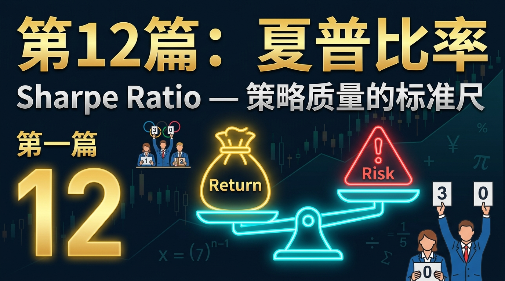
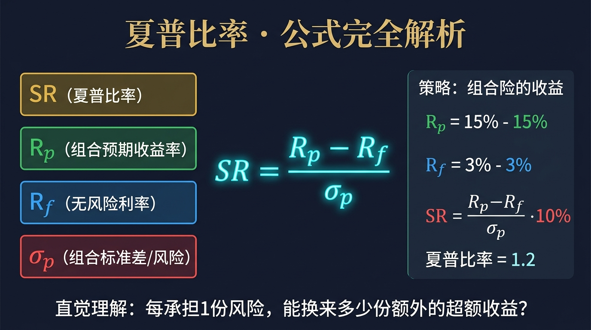
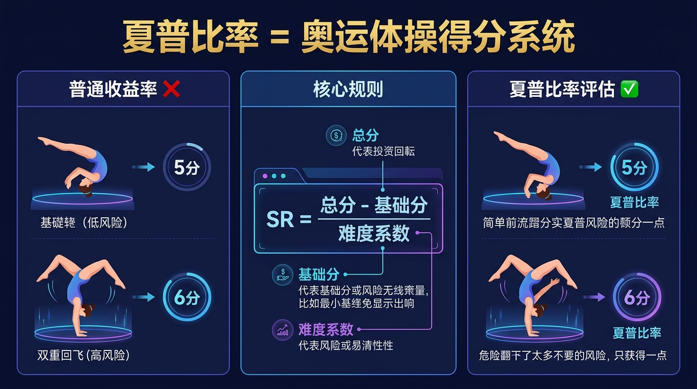
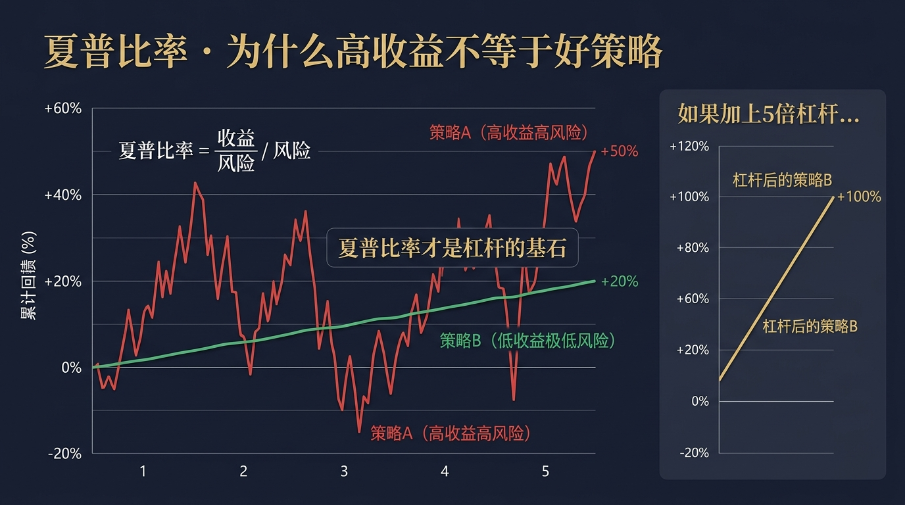
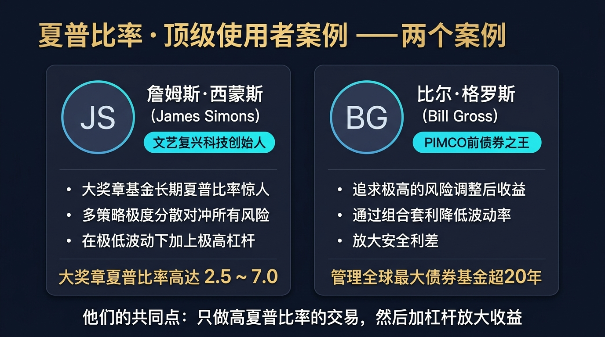
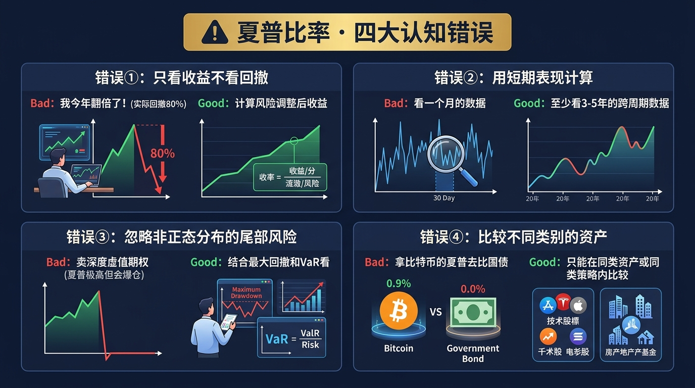
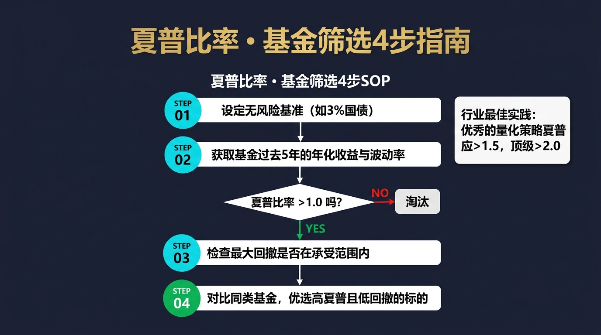

# 股票市场的数学原理 · 第12篇
# 夏普比率：策略质量的标准尺
### Sharpe Ratio — The Golden Yardstick of Strategy Quality

---

> **全球顶尖对冲基金经理、量化宽客 都在用的数学工具**
> 
> 🕐 阅读时间：约25分钟 | 📊 难度：⭐⭐⭐ | 🎯 核心收获：掌握衡量风险调整后收益的最重要指标，彻底搞懂“高收益不等于好策略”的真相

---

## 📖 引言：为什么高收益不等于好策略？

你有没有经历过这样的场景：朋友兴奋地向你吹嘘，他去年的投资收益率高达 50%。你看着自己手里辛辛苦苦拿到的 15% 收益，感到十分懊恼。

这不是**你不够聪明**，这是**你没有看到硬币的反面**。如果后来你发现，你的朋友是用了 5 倍杠杆，全仓押注了一只即将面临退市风险的股票，期间账户资金一度回撤高达 90%，差点爆仓，你还会羡慕他吗？显然不会。因为你意识到，他赚的不是能力钱，而是随时可能归零的“玩命钱”。

在金融市场，收益永远是有代价的。如何衡量一份收益背后究竟承担了多少代价？1966年，斯坦福大学的威廉·夏普（William Sharpe）教授，用一个极其简单却无比伟大的公式给出了完美答案。

## 一、起源：给华尔街制定KPI的人

1960年代的华尔街，基金经理们就像是参加狂欢节的推销员，所有人都只向客户展示一个数字：**绝对收益率**。基金经理A说自己赚了 30%，基金经理B说自己赚了 20%，于是资金疯狂涌向A。至于A是承担了多大风险才赚到 30% 的，没人知道，也没人关心。

威廉·夏普当时还在大学里研究资产定价模型（他后来因此获得了诺贝尔经济学奖）。他敏锐地意识到：这太荒唐了！这就好像评价一辆汽车好不好，只看它的百公里加速有多快，却完全不看它的油耗是多少。

夏普决定引入一个“性价比”概念。他提出，我们不能只看绝对收益，而必须看“每承担一单位风险，能换来多少超额收益”。1966年，他在《商业期刊》上发表了一篇论文，提出了“回报-变异度比率”（Reward-to-Variability Ratio），也就是后来名震江湖的**夏普比率**。这个指标一出，瞬间撕下了无数伪股神的遮羞布，成为了全球金融机构评估策略好坏的终极“KPI”。

## 二、核心公式：用人话讲透每个符号

夏普比率的数学表达极其简洁，它本质上是一个除法算式：

$$
SR = \frac{R_p - R_f}{\sigma_p}
$$

| 符号 | 名称 | 在股票中的意思 | 举例（带具体数字）|
|------|------|--------------|----------------|
| $SR$ | 夏普比率 (Sharpe Ratio) | 策略的性价比，数值越高越好 | 1.2（即每承担1%波动，换回1.2%超额收益） |
| $R_p$ | 组合预期收益率 (Portfolio Return) | 你的策略实际赚了多少钱 | 15.0% |
| $R_f$ | 无风险利率 (Risk-Free Rate) | 躺平什么都不干能赚多少钱（如国债） | 3.0% |
| $R_p - R_f$ | 超额收益 (Excess Return) | 剥离躺平收益后，真正凭借策略赚到的钱 | 15.0% - 3.0% = 12.0% |
| $\sigma_p$ | 组合标准差 (Volatility/Risk) | 你的资金曲线震荡有多剧烈（风险指标） | 10.0% |

**数学推导（选读：为什么分母要是标准差？）**
出发点：我们需要一个同时包含收益和风险的目标函数。
目标函数：优化每一单位风险带来的超额收益。
在马科维茨的现代投资组合理论（均值-方差模型）中，资产收益被假设为正态分布。超额收益 $E(R_p - R_f)$ 代表方向向上的预期值，而标准差 $\sigma_p$ 代表不确定性的范围。因此，两者相除即是切线斜率（资本市场线 CML 的斜率），代表风险的定价效率。

## 三、四大类比：彻底理解夏普比率的直觉

### 类比1：奥运体操得分系统（理解：风险调整后收益）

想象奥运会体操比赛，如果只看绝对得分，一个做极高难度危险动作（稍有不慎就骨折）的选手得了 9.5 分，和一个做普通平稳动作得了 9.0 分的选手，似乎前者更好。但在夏普比率的视角下，前者冒了 5 倍的受伤风险，只多拿了 0.5 分，这是一笔“极差的交易”。夏普比率相当于：`(最终得分 - 基础起评分) / 动作危险系数`。

### 类比2：汽车百公里油耗（理解：投入产出性价比）

假设有两辆车，法拉利（高收益高风险）和丰田卡罗拉（低收益低风险）。法拉利速度极快，但每百公里耗油 30 升；卡罗拉速度平庸，但每百公里只耗油 5 升。夏普比率问的是：**平均每消耗 1 升油，哪辆车跑得更远？** 在投资中，你的“汽油”就是你承受的心理折磨和本金回撤风险。

### 类比3：拳击手抗击打测试（理解：波动率惩罚）

两个拳击手都击倒了对手 10 次（相同收益）。但拳击手 A 自己也被暴揍了 50 拳，鼻青脸肿才赢；拳击手 B 步伐灵活，毫发无损地赢了比赛（波动率极低）。显然拳击手 B 的水平更高。夏普比率就是对那些虽然赚钱但资金曲线剧烈震荡的“莽夫策略”进行严厉的惩罚。

### 类比4：贷款买房（理解：为什么夏普比率高可以加杠杆）

一套房子涨了 10%，好像不多。但如果房价极其稳定（低波动），你敢向银行借 30% 首付的 3 倍杠杆，那么 10% 的涨幅就会变成 30% 的净资产收益。夏普比率告诉我们：只要策略的波动足够小、确定性足够高，你就可以通过加杠杆把低收益变成高收益！

## 四、实战全流程：以一个真实场景演示

🎬 **场景设定**
你是一位有3年经验的量化爱好者，手里有 100 万元资金。最近你开发了两个交易策略，回测了过去 5 年的数据。无风险利率（如长期国债）当前为 3.0%。
- **策略A（激进趋势跟踪）**：年化收益率 25.0%，但波动极大，年化标准差高达 30.0%。
- **策略B（保守统计套利）**：年化收益率只有 11.0%，但稳如老狗，年化标准差只有 4.0%。

到底该用哪个策略？朋友建议你选A，因为赚得多。但让我们算一算夏普比率。

### 📊 第1步：计算策略A的夏普比率
- 超额收益 = 25.0% - 3.0% = 22.0%
- 波动率 = 30.0%
- $SR_A = \frac{22.0\%}{30.0\%} = 0.73$
**解读含义**：策略A每承受 1 份震荡风险，只能换回 0.73 份的超额收益。

### 📊 第2步：计算策略B的夏普比率
- 超额收益 = 11.0% - 3.0% = 8.0%
- 波动率 = 4.0%
- $SR_B = \frac{8.0\%}{4.0\%} = 2.0$
**解读含义**：策略B每承受 1 份震荡风险，能换回惊人的 2.0 份超额收益！这是一个极其优秀的策略。

### 📊 第3步：引入杠杆魔法
如果我们给策略B加上 **3倍杠杆**（借入资金成本假定也是3.0%）：
- 杠杆后收益 = (11.0% - 3.0%) × 3 + 3.0% = 27.0%
- 杠杆后波动 = 4.0% × 3 = 12.0%
- 杠杆后夏普比率 = $\frac{27.0\% - 3.0\%}{12.0\%} = 2.0$ （夏普比率在无摩擦借贷下是不随杠杆改变的）

**决策对比表**：

| 策略名称 | 年化收益 | 波动率风险 | 夏普比率 | 适合人群 |
|---------|---------|----------|--------|---------|
| 策略A | 25.0% | 30.0% (极高) | 0.73 | 喜欢刺激、能忍受大回撤的赌徒 |
| 策略B | 11.0% | 4.0% (极低) | 2.00 | 稳健型投资者 |
| 策略B(加杠杆) | 27.0% | 12.0% (中等) | 2.00 | **聪明的量化机构** |

**最终结论**：放弃高收益的A，选择B并适度加杠杆，可以在风险不到A一半的情况下，实现超越A的绝对收益！

## 五、著名使用者：这些人如何运用夏普比率

### 🥇 詹姆斯·西蒙斯 (James Simons)：打造印钞机大奖章基金
西蒙斯的文艺复兴科技公司是量化界的传奇。大奖章基金之所以封神，不在于它某一年赚了百分之几百，而在于它通过极度分散的统计套利（做多某些股票同时做空另一些），将组合波动率压到极低。
- 业绩：在数十年的跨度中，大奖章基金的年化收益在 39% 左右。
- 关键指标：其长期夏普比率据估计高达 2.5 甚至极端年份可达 7.0 以上！
> *"我们不是试图预测大趋势，我们只是通过无数次胜率51%的小交易，把风险对冲掉，赚取微小的确定性利差。" — 文艺复兴科技逻辑*

### 🥇 桥水基金 (Bridgewater)：风险平价策略之王
雷·达利欧（Ray Dalio）的桥水基金开创了“全天候策略”。他们发现股票虽然收益高但风险太大，债券收益低但风险极小。
- 做法：桥水不是简单地把钱50/50分给股债，而是给低波动的债券**加杠杆**，把债券的风险拔高到和股票一样的水平，然后再将两者结合。
- 结果：通过组合不同资产并配平风险，桥水极大地提升了整个组合的夏普比率。

## 六、长期数据证据：数字说明一切

让我们看看中国A股市场真实的回测数据对比（2010年-2023年）。假设我们构建两个指数组合：一个是纯大盘股组合，另一个是根据夏普比率最大化原则动态调仓的股债平衡组合。

| 组合名称 | 14年年化收益 | 最大回撤 | 组合夏普比率 | 心理压力 |
|---------|-----------|--------|-----------|---------|
| 沪深300指数 | +4.8% | -46.7% | 约 0.25 | 夜不能寐 |
| 高夏普多资产组合 | +7.2% | -12.4% | 约 1.15 | 稳如泰山 |

**核心洞见**：
1. **防守就是最好的进攻**：高夏普策略由于波动小、回撤小，资金利用效率极高，避免了“跌50%需要涨100%才能回本”的数学陷阱。
2. **复利需要平滑的曲线**：在真实的复利计算中，波动率（方差）会严重拖累复合年化收益率（几何平均收益 = 算术平均收益 - 0.5 × 方差）。夏普比率越高，波动率越小，资金的复利滚雪球效应越强。

## 七、六大实战使用场景

### 场景1：公募基金筛选（普通投资者必备）
- **你是谁**：想要买公募基金的上班族。
- **问题**：两只基金今年都涨了30%，买哪个？
- **计算**：查询天天基金或晨星网，基金甲近三年夏普比率 1.2，基金乙夏普比率 0.4。
- **结论**：坚决买基金甲。乙只是恰好踩中了风口（可能全仓了半导体），甲才是真正靠管理能力获取稳定收益的。

### 场景2：量化策略防过拟合
- **你是谁**：量化策略开发者。
- **问题**：新写了一个动量策略，回测收益高达 60%。
- **计算**：看交易报告，发现策略夏普比率只有 0.6，资金曲线剧烈震荡。
- **结论**：放弃实盘。这种策略必然存在严重的过拟合，实盘大概率遭遇灾难性回撤。

### 场景3：资产配置决策
- **你是谁**：家庭资产配置者。
- **问题**：是否要在股债组合中加入 5% 的黄金？
- **计算**：计算加入黄金前后的组合夏普比率。
- **结论**：黄金本身不生息（收益低），但因为与股市弱相关，加入后可能降低组合整体波动，从而使得整个资产组合的夏普比率从 0.8 提升到 0.9。结论：加！

### 场景4：判断加杠杆的资格
- **你是谁**：资金有限但想扩大收益的进阶交易员。
- **问题**：我的策略能借钱加杠杆吗？
- **计算**：你的日内套利策略夏普比率高达 2.5，最大回撤仅 2%。
- **结论**：由于每单位风险能换回极高确定性收益，你完全有资格适度加杠杆放大收益。

### 场景5：评估抄底的性价比
- **你是谁**：波段交易者。
- **问题**：大盘暴跌后要不要抄底？
- **计算**：底部震荡剧烈（分母$\sigma$极大），即便有反弹预期（分子$R_p$较大），算下来单笔交易的预期夏普比率依然偏低。
- **结论**：减少抄底仓位，或等波动率下降（右侧企稳）再入场，以提高单笔决策的夏普比率。

### 场景6：何时果断放弃（反例场景）
- **你是谁**：期权卖方玩家。
- **问题**：卖出深度虚值期权，胜率90%，收益稳定，要不要一直做？
- **计算**：日常夏普比率极高，但一旦发生黑天鹅（尾部风险），标准差不再适用。
- **结论**：夏普比率无法衡量极端的“断头铡刀”风险，此时必须放弃唯夏普论，引入黑天鹅防范机制。

## 八、常见错误与误区

| # | 错误 | 核心症状 | 后果 | 正确做法 |
|---|------|---------|------|--------|
| 1 | 只看收益不看回撤 | “我今年翻倍了，你才赚15%” | 下一年可能一次亏掉80% | 永远把收益放在风险的尺度下衡量 |
| 2 | 时间周期太短 | 拿1个月的暴涨数据算夏普比率 | 得出一个荒谬的超高值骗自己 | 至少计算跨越一轮牛熊（3-5年）的夏普 |
| 3 | 跨资产乱比 | 拿比特币的夏普比率去和纯债基金比 | 错误估计了基础资产属性 | 只能在同类资产、同类策略内部排序横向比较 |
| 4 | 忽略非正态分布 | 认为夏普比率高就绝对安全 | 遇到黑天鹅时爆仓死翘翘 | 结合最大回撤（Max Drawdown）一起看 |

## 九、夏普比率的局限性（诚实的评估）

| 局限性 | 具体表现 | 解决方案 |
|-------|---------|---------|
| **假设收益正态分布** | 现实市场存在肥尾效应（如暴跌发生的概率远超正态分布预期），标准差无法完全覆盖尾部风险。 | 引入索提诺比率（Sortino Ratio），只惩罚向下的波动；结合最大回撤指标。 |
| **容易被策略造假操纵** | 比如通过卖出深度虚值期权，可以人为造出极高的短期夏普比率。 | 审查策略底层逻辑，看是否存在隐藏的“毁灭性尾部风险”。 |
| **惩罚向上波动** | 一只股票突然连续涨停，虽然是好事，但标准差变大，夏普比率反而会降低。 | 对于纯多头趋势跟踪策略，不应将向上波动视为“风险”。 |
| **依赖历史数据** | 过去 3 年夏普比率高达 2.0，不代表未来 1 年不会变成负数。 | 定期跟踪，不要迷信历史；结合基本面逻辑判断因子的生命周期。 |

## 十、实战SOP：4步骤快速使用夏普比率

> **行业最佳实践（量化机构 · FOF基金经理 共同验证）**：优秀的量化策略夏普应>1.5，顶级策略>2.0；而普通的纯股票多头公募基金，长期夏普比率能维持在 0.8 以上已属不易。

## 十一、本篇总结

在没懂夏普比率之前，投资者的眼里只有刺刀见红的拼杀（收益）；懂了夏普比率之后，你学会了在拼杀前先穿上防弹衣（风险调整）。

| 升级前的思维 | 升级后的思维（夏普比率思维） |
|------------|---------------------|
| 追求绝对收益的最高值 | 追求风险调整后收益的最高值 |
| 收益高就是好策略 | 高收益可能是因为承受了愚蠢的高风险 |
| 通过重仓豪赌来实现阶层跨越 | 找到高夏普资产，通过加杠杆来实现稳健复利 |
| 买表现最猛的基金 | 买长期夏普比率最稳定、曲线最平滑的基金 |

不要去追求那些一年涨幅 100% 但波动巨大的神话。寻找那些年化 15%，但波动如一潭死水般稳定的无聊策略。因为金融世界的终极魔法公式是：

$$ \boxed{\text{极致的高收益 = 高夏普比率的稳定策略 + 杠杆}} $$

---
- **← 上一篇：[第11篇 - 现代投资组合理论](第11篇_现代投资组合理论_有效前沿的边界.md)** | 
  **→ 下一篇：第13篇 - 风险平价策略（即将发布）**

---
*《股票市场的数学原理》系列 · 第12篇 · 夏普比率*  
*数据来源：威廉·夏普1966年论文、文艺复兴科技公开数据估算、桥水基金全天候策略白皮书*
