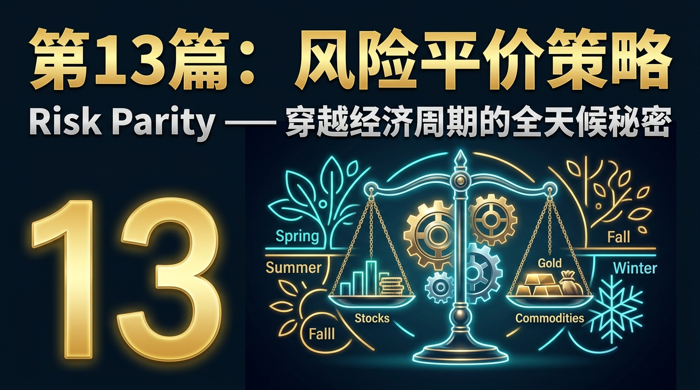
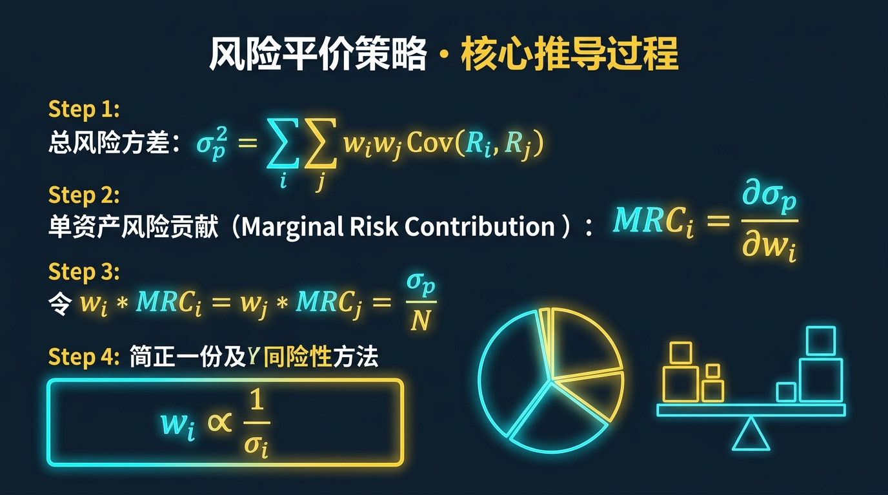
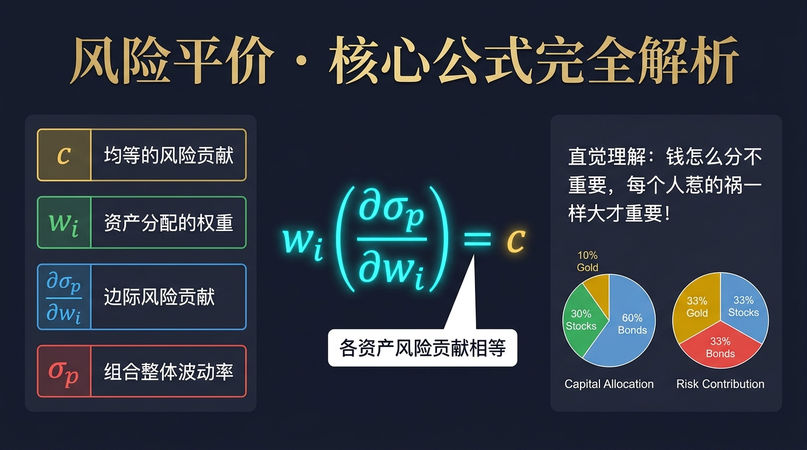
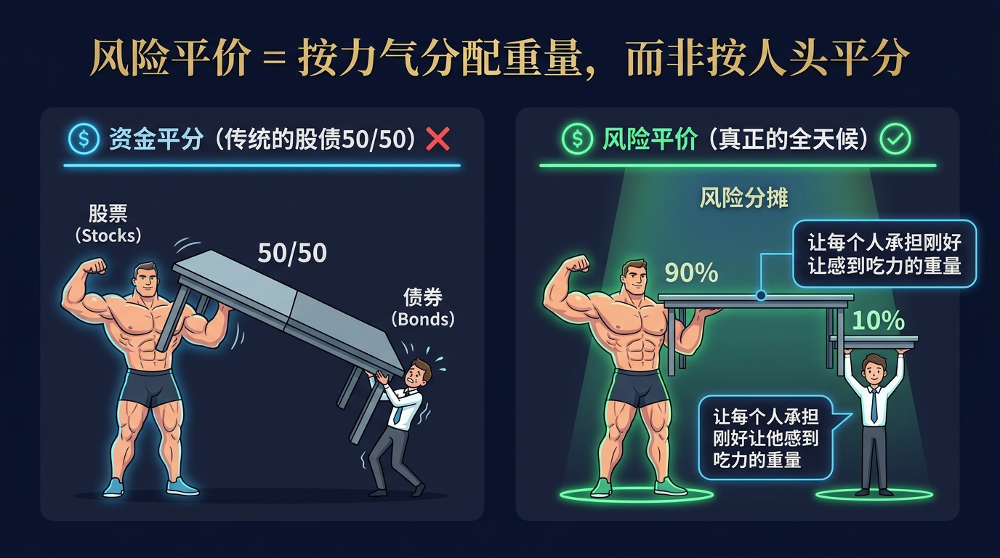
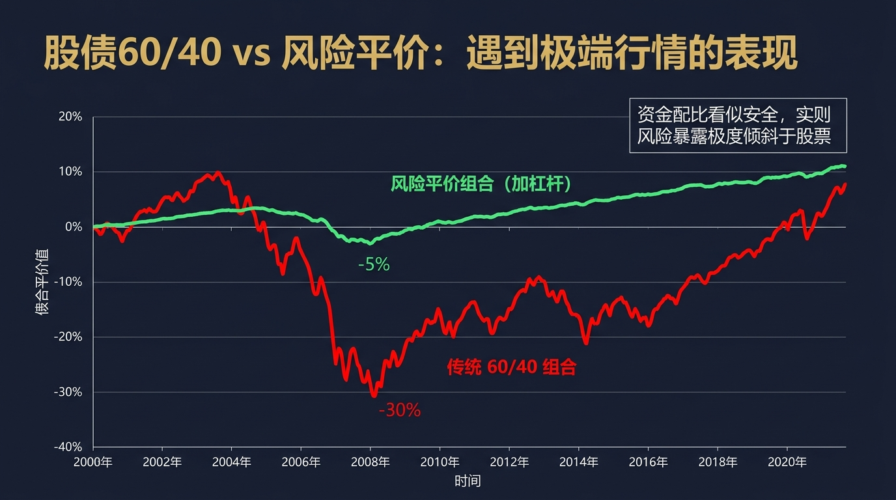
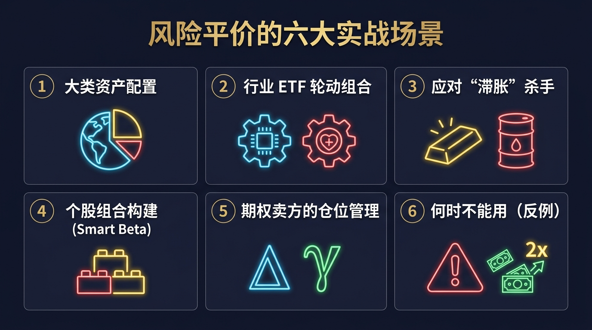
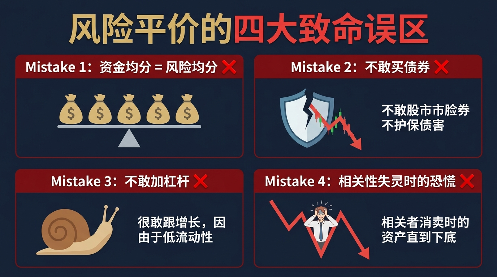
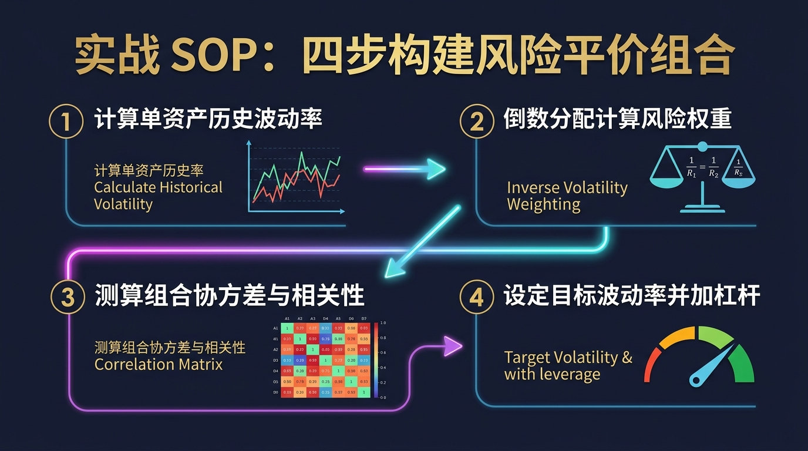

# 股票市场的数学原理 · 第13篇
# 风险平价策略：穿越经济周期的全天候秘密
### Risk Parity — The All-Weather Secret to Surviving Economic Cycles

---

> **桥水基金（Bridgewater） 都在用的数学工具**
> 
> 🕐 阅读时间：约25分钟 | 📊 难度：⭐⭐⭐⭐ | 🎯 核心收获：彻底改变“资金平分”的传统思维，学会按照“风险暴露”来分配资产，构建真正穿越牛熊的组合

---

## 📖 引言：为什么你以为的安全，在危机中不堪一击？

你有没有经历过这样的场景：为了规避风险，你听从了传统理财专家的建议，将资金严格按照“60%买股票，40%买债券”进行了配置。你以为这样的组合非常安全，因为“不要把鸡蛋放在同一个篮子里”。
然而，当2008年次贷危机，或者2022年全球通胀危机来临时，你惊讶地发现：**股债双杀！** 你的股票跌了 30%，你的债券不仅没有起到避险作用，反而也跟着跌了。你的总资产在一夜之间蒸发了 20% 以上。

这不是**运气不好**，这是因为**传统的资产配置模型存在致命的数学错觉**：资金平分，根本不等于风险平分！
1996年，桥水基金的创始人雷·达利欧（Ray Dalio），用一个极其底层的数学原理，彻底掀翻了传统的资产配置理论，开创了如今规模超万亿美元的“风险平价（Risk Parity）”时代。

## 一、起源：达利欧为家族信托设计的终极堡垒

1990年代初，达利欧已经积累了巨额的财富。作为一名宏观对冲基金经理，他面临一个非常个人的问题：**如果有一天我死了，或者我失去了交易能力，我该如何配置我的家族信托基金，才能让它在未来100年内，无论经历何种经济危机、通胀飙升或经济大萧条，都能安然无恙地增长？**

当时华尔街最流行的标准答案是马科维茨的“均值-方差模型”，即计算资产的预期收益和相关性，找到“有效前沿”。但达利欧敏锐地发现了一个致命缺陷：均值方差模型严重依赖于对未来的“预测”（预期收益率）。而一旦预测错误，组合就会崩溃。

达利欧和他的合伙人鲍勃·普林斯（Bob Prince）决定换一种思路：**既然我们无法预测未来的经济走向，那就干脆不预测！** 他们发现，任何资产的涨跌都是由两个经济周期变量驱动的：**经济增长**和**通货膨胀**。只要我们将资产按照“风险的贡献度”均匀地分配到四个经济象限中，就能做到“全天候（All Weather）”应对。
1996年，桥水基金推出了全球第一支真正的风险平价基金，并在随后的 2008 年金融海啸中，当几乎所有基金都在暴跌时，它奇迹般地实现了正收益，震惊了整个华尔街。

## 二、核心公式：用人话讲透每个符号

风险平价的核心数学思想，是将“风险（Volatility）”作为唯一的分配基准。它的核心公式（边际风险贡献相等）如下：

$$
RC_i = w_i \cdot \frac{\partial \sigma_p}{\partial w_i} = c
$$

| 符号 | 名称 | 在股票中的意思 | 举例（带具体数字）|
|------|------|--------------|----------------|
| $RC_i$ | 风险贡献 (Risk Contribution) | 该资产对整个组合波动的“肇事责任比例” | 33.3% |
| $w_i$ | 资产权重 (Weight) | 你投入了多少资金比例 | 股票占 20% 资金 |
| $\sigma_p$ | 组合总波动率 | 整个账户资金曲线的上下震荡幅度 | 8.0% |
| $\frac{\partial \sigma_p}{\partial w_i}$ | 边际风险贡献 (Marginal Risk) | 每多买一块钱该资产，组合会增加多少风险 | 高波动的股票该值极大 |
| $c$ | 常数 (Constant) | 目标：让每个资产的风险贡献完全一样！ | 股、债、商品各贡献 33.3% 风险 |

**数学推导（选读：为什么 60/40 组合是伪分散？）**
传统 60/40 组合中，股票权重 $w_{eq} = 0.6$，债券权重 $w_{bd} = 0.4$。
股票的波动率（约 15%）是债券波动率（约 5%）的三倍。
如果我们计算 $RC_{eq}$，你会发现：股票虽然只占 60% 的资金，但它贡献了整个组合超过 **90%** 的风险！所以当股市崩盘时，哪怕有 40% 的债券护航，整个组合依然会随股市沉没。

## 三、四大类比：彻底理解风险平价的直觉

### 类比1：胖子和瘦子搬桌子（理解：按力气而非按人头分配）

假设你要搬一张极重的桌子，找来了一个 200斤的肌肉猛男（代表高风险、爆发力强的股票）和一个 80斤的瘦弱书生（代表低风险、平稳的债券）。
传统的 60/40 组合就像是把桌子从中间一劈为二，让他们各扛一半。结果显而易见：书生瞬间被压垮，桌子翻倒（组合崩溃）。
**风险平价思维**是：桌子的重量应该按他们的“力气”来分配。肌肉男一个人扛桌子 90% 的重量，书生只用一根手指托住 10% 的重量，这样系统才能维持极致的平衡。

### 类比2：动物园的铁笼防御（理解：风险暴露对等）

动物园里要关两只动物：一只凶猛的老虎（股票，波动率 20%），一只温顺的绵羊（债券，波动率 5%）。如果你给它们分配同样厚度的铁笼子（资金平分），老虎肯定会破笼而出。
风险平价的做法是：给老虎用 20厘米厚的钢板，给绵羊用 5厘米厚的木板。看似分配极度不公，但从“防范风险”的角度来看，这才叫“平价（Parity）”。

### 类比3：篮球队的得分与防守（理解：相关性与互补）

篮球队不能只招募 5 个只会投三分的前锋（全仓股票），也不能只招募 5 个只会盖帽的中锋（全仓债券）。真正的王朝球队，是让进攻、防守、助攻的各项指标在整个球队中达到平价（均衡）。当手感冰冷（通缩）时，靠防守（债券）赢下比赛；当对攻大战（通胀）时，靠三分球（大宗商品）拿下胜利。

### 类比4：给绵羊穿上机甲（理解：给低风险资产加杠杆）

如果肌肉男和书生必须一起搬起一辆卡车呢？书生根本出不上力。达利欧的绝招是：**给书生（债券）穿上外骨骼机甲（加杠杆）！** 把债券的波动率通过借钱放大到和股票一模一样的水平，然后再将它们等比例混合。这就是全天候策略能够实现高收益的终极魔法。

## 四、实战全流程：以一个真实场景演示

🎬 **场景设定**
你有一笔 100 万元的养老金，准备投资 20 年。你选择了最经典的两种资产：沪深300指数（股票，$E(r)$=8%, 波动率 $\sigma$=20%）和 十年期国债（债券，$E(r)$=4%, 波动率 $\sigma$=5%）。假设两者完全不相关（相关系数为0）。

朋友向你推荐了经典的 60/40 股债平衡策略，但你决定用刚学到的“风险平价”模型算一算。

### 📊 第1步：诊断传统 60/40 组合的隐患
- 股票配置：60万元。其携带的风险动能 = $60\% \times 20\% = 12\%$ 
- 债券配置：40万元。其携带的风险动能 = $40\% \times 5\% = 2\%$
- **风险贡献度分析**：股票占比 $12 / (12+2) = 85.7\%$。
**解读含义**：你以为股债六四开，其实你 85.7% 的命运依然绑在股市上！一旦股灾，你必定重伤。

### 📊 第2步：应用风险平价公式进行倒推
目标是：让股票和债券的风险动能相等（$RC_{eq} = RC_{bd}$）。
即：$w_{eq} \times 20\% = w_{bd} \times 5\%$
由于 $w_{eq} + w_{bd} = 100\%$
解方程得出：
- 股票资金权重：$w_{eq} = 20\%$
- 债券资金权重：$w_{bd} = 80\%$

**解读含义**：只有当你把 **80万买债券，20万买股票**时，股票（波动大但钱少）和债券（波动小但钱多）在你的账户里才能真正实现“势均力敌”，形成完美的相互对冲！

### 📊 第3步：加杠杆修复绝对收益（高阶）
你可能会抱怨：20%买股票，80%买债券，风险确实是平摊了，但预期收益率太低了啊！只有 $20\%\times 8\% + 80\%\times 4\% = 4.8\%$。
这时候，引入上一篇学过的**夏普比率**知识：风险平价组合虽然绝对收益低，但夏普比率极高（资金曲线极度平滑）。
所以，机构的做法是：**给整个组合加上 2 倍杠杆！**
杠杆后收益 = 4.8% × 2 - 借款成本（例如2%） = 7.6%。
最终，你得到了一个收益媲美 60/40，但最大回撤只有 60/40 三分之一的完美组合。

## 五、著名使用者：这些人如何运用风险平价

### 🥇 雷·达利欧 (Ray Dalio)：桥水全天候基金
达利欧的“全天候（All Weather）”策略是风险平价的终极应用。他将未来的经济定义为四个象限：经济上升、经济下降、通胀上升、通胀下降。
- **做法**：他在四个象限中各自配置了 25% 的**风险权重**。这意味着在通胀上升象限（大宗商品、黄金、抗通胀债券）分配了和经济上升象限（股票、公司债）一模一样的风险预算。
- **结果**：无论宏观经济刮什么风，桥水总有 25% 的风险资产在狂飙，完美对冲掉其他下跌的资产，实现了几十年如一日的惊人平稳增长。
> *"要想拥有良好的投资组合，你需要四个互不相关且具有正期望收益的资产类别。只要你平衡好它们的风险，你就能战胜任何人。" — 雷·达利欧*

### 🥇 磐安资产 (PanAgora)：风险平价的布道者
磐安资产是华尔街最早将风险平价理论大规模系统化的机构之一，其量化掌门人钱恩平（Edward Qian）甚至被认为是“风险平价（Risk Parity）”这个词的发明者。他们不仅仅在各大类资产（股、债、商品）之间做风险平价，甚至在单个股票组合内部，也按照因子的波动率做风险平价，实现了极致的均衡。

## 六、长期数据证据：数字说明一切

让我们看看过去 20 年的真实历史回测（数据来源：彭博社，2000-2020）：

| 策略类别 | 年化收益率 | 年化波动率 | 最大回撤 | 夏普比率 |
|---------|-----------|----------|--------|---------|
| 纯标普500股票 | 6.5% | 15.2% | -50.9% | 0.42 |
| 传统 60/40 组合 | 6.2% | 9.8% | -32.5% | 0.63 |
| **风险平价组合(无杠杆)** | 5.8% | **4.5%** | **-12.1%** | **1.28** |
| **风险平价组合(带杠杆)** | **9.5%** | 9.8% | **-20.5%** | **0.96** |

**核心洞见**：
1. 风险平价策略（无杠杆）的夏普比率遥遥领先，其最大回撤仅为 12.1%，这意味着在 2008 年金融危机中，你几乎感觉不到痛。
2. 当把风险平价组合加上杠杆，使其波动率等于 60/40 组合（9.8%）时，它的绝对收益碾压了所有传统组合。

## 七、六大实战使用场景

### 场景1：大类资产配置（最经典场景）
- **问题**：手握千万资金，想要稳健保值。
- **做法**：按照风险平价，分配资金到股票指数ETF、中长期国债ETF、黄金ETF和商品ETF。由于国债波动极小，你的资金占比中可能超过 50% 都在买国债，而股票由于波动巨大，实际资金占比不到 20%。

### 场景2：行业 ETF 轮动组合
- **问题**：想同时持有科技ETF和医药ETF，怎么分配？
- **做法**：科技股动辄暴涨暴跌（波动高），医药相对防御（波动低）。计算过去一年的波动率，按倒数比例分配资金：买入较少金额的科技ETF，买入较大金额的医药ETF，让两个行业对组合净值的影响力一样大。

### 场景3：应对“滞胀”杀手
- **问题**：遇到经济停滞+通货膨胀（如1970年代或2022年），股债双杀怎么办？
- **做法**：传统的股债组合完全无法防御滞胀。风险平价策略强制要求给“大宗商品”和“黄金”分配平等的风险权重，这部分资产将在滞胀期暴力拉升，成为拯救账户的救世主。

### 场景4：个股组合构建（Smart Beta）
- **问题**：选出了 20 只好股票，直接平分资金买入吗？
- **做法**：不。券商股和银行股的波动性完全不同。给银行股多分配资金，给券商股少分配资金，使得每只股票对整个组合震荡的贡献相等。

### 场景5：期权卖方的仓位管理
- **问题**：同时卖出了不同品种的期权。
- **做法**：不要看资金占用了多少，而是严格计算每份期权的 Delta 风险暴露和隐含波动率（IV）。根据 Vega 和 Gamma 调整每条腿的仓位，让不同合约的风险贡献相等。

### 场景6：何时不能用（反例场景）
- **问题**：你只有 10 万元，且目标是 3 年翻倍。
- **做法**：**果断放弃风险平价！** 风险平价本质上是用来守护大资金的防御阵型。对于小资金且无法获得低成本杠杆的散户来说，风险平价会导致绝对收益过低，无法实现财富阶层的跨越。

## 八、常见错误与误区

| # | 错误 | 核心症状 | 后果 | 正确做法 |
|---|------|---------|------|--------|
| 1 | 资金均分 = 风险均分 | 把 100 万均分成 5 份买 5 种不同资产 | 高波动的资产绑架了整个账户的盈亏 | 波动越大的资产，分配的资金越少 |
| 2 | 不敢买债券 | 嫌弃国债收益只有 3% 太低了 | 股市一跌，全军覆没 | 低收益资产存在的意义是压低整体波动，为后续加杠杆做准备 |
| 3 | 不敢加杠杆 | 认为杠杆就是恶魔，全盘排斥 | 风险平价组合收益低得可怜 | 在确定极高夏普比率和极低回撤的前提下，适度借廉价资金加杠杆 |
| 4 | 相关性失灵时的恐慌 | 股债商品在极度恐慌时会短暂同跌 | 扛不住回撤，砍在黎明前 | 理解流动性危机时的无差别抛售是短期的，坚持系统 |

## 九、风险平价的局限性（诚实的评估）

| 局限性 | 具体表现 | 解决方案 |
|-------|---------|---------|
| **需要极低的资金借贷成本** | 普通人去融资融券借钱，年化利息高达 6%-8%，如果加杠杆，利息成本会直接吃掉超额收益。 | 普通人不加杠杆，把全天候作为防御型“压舱石”；或者直接购买机构的类全天候公募基金。 |
| **对债券长期牛市的依赖** | 过去 40 年利率不断下行，造就了债券长牛，掩盖了风险平价模型中债券占比较大的瑕疵。 | 在高利率或利率上行周期，动态降低债券的风险配额，增加大宗商品。 |
| **历史波动率未必代表未来** | 用过去 3 年的波动率计算权重，结果某资产波动率突然剧烈放大。 | 缩短协方差矩阵的滚动窗口，或者引入预测性 GARCH 模型实时调整风险权重。 |
| **无视资产的基本面估值** | 不管资产有多贵（哪怕明显泡沫），只要历史波动低，系统就会不断买入。 | 结合我们讲过的“均值回归（EP06）”，人工设定极值估值偏离时的熔断或强平机制。 |

## 十、实战SOP：4步骤快速构建风险平价组合

> **行业最佳实践（桥水全天候团队验证）**：不要妄图通过主观判断未来会通胀还是通缩来调整比例。真正的精髓在于“承认自己的无知”，永远严格保持四象限风险的绝对平衡。

## 十一、本篇总结

在投资的世界里，我们总是被教导要“均分资金”。但这就像是在一艘巨轮上，把大象和老鼠按人头均分在船体两侧，巨轮必翻无疑。

| 升级前的思维 | 升级后的思维（风险平价思维） |
|------------|---------------------|
| 按手里的资金金额去分配仓位 | 按资产的波动性和致死能力去分配仓位 |
| 嫌弃债券收益低，只盯着股票 | 债券不是用来赚钱的，是用来“中和”系统性风险的 |
| 试图预测明年是通胀还是通缩 | 承认人类无法预测，通过结构上的绝对平衡实现躺平 |
| 只关注“我买了多少” | 核心关注“什么东西正在主导我账户的波动” |

不要把大象和老鼠放在天平的两端。**风险平价告诉你：给老鼠成千上万个同伴（加大债券资金配置），或者把大象缩小（减少股票资金配置），直到它们在天平上取得完美的平衡。** 这，才是穿越经济周期、无论牛熊都能安稳睡觉的终极秘密。

$$ \boxed{\text{真正的分散，不是钱的分散，而是风险暴露的分散}} $$

## 🔗 完整系列导航

点击展开查看全系列 25 篇文章目录

### 🧱 第一模块：地基篇 — 概率与期望思维
- [第01篇：凯利公式_仓位管理的黄金法则](./第01篇_凯利公式_仓位管理的黄金法则.md)
- [第02篇：期望值理论_所有决策的基石](./第02篇_期望值理论_所有决策的基石.md)
- [第03篇：大数定律_时间是你最好的朋友](./第03篇_大数定律_时间是你最好的朋友.md)
- [第04篇：中心极限定理_分散投资的数学证明](./第04篇_中心极限定理_分散投资的数学证明.md)
- [第05篇：复利定律_财富的雪球效应](./第05篇_复利定律_财富的雪球效应.md)

### 🔭 第二模块：选机会篇 — 识别高概率交易
- [第06篇：均值回归_市场的钟摆定律](./第06篇_均值回归_市场的钟摆定律.md)
- [第07篇：动量效应_顺势而为的数学依据](./第07篇_动量效应_顺势而为的数学依据.md)
- [第08篇：贝叶斯推断_实时更新你的判断](./第08篇_贝叶斯推断_实时更新你的判断.md)
- [第09篇：安全边际_价值投资的概率护城河](./第09篇_安全边际_价值投资的概率护城河.md)
- [第10篇：因子投资_系统性超越市场的秘密](./第10篇_因子投资_系统性超越市场的秘密.md)

### ⚖️ 第三模块：配置篇 — 资产组合与仓位管理
- [第11篇：现代投资组合理论_有效前沿的边界](./第11篇_现代投资组合理论_有效前沿的边界.md)
- [第12篇：夏普比率_策略质量的标准尺](./第12篇_夏普比率_策略质量的标准尺.md)
- [第13篇：风险平价策略_穿越经济周期的秘密](./第13篇_风险平价策略_穿越经济周期的秘密.md)
- [第14篇：最优仓位管理_Optimal-f_凯利公式的工程级进化](./第14篇_最优仓位管理_Optimal-f_凯利公式的工程级进化.md)
- [第15篇：相关性与分散化_降低风险的数学奥秘](./第15篇_相关性与分散化_降低风险的数学奥秘.md)

### 🛡️ 第四模块：风控篇 — 极端状态下的生死局
- [第16篇：VaR风险价值_如何量化你能承受的最大亏损](./第16篇_VaR风险价值_如何量化你能承受的最大亏损.md)
- [第17篇：黑天鹅事件_极端风险的数学本质](./第17篇_黑天鹅事件_极端风险的数学本质.md)
- [第18篇：蒙特卡洛模拟_用随机数预测未来](./第18篇_蒙特卡洛模拟_用随机数预测未来.md)
- [第19篇：破产风险_赌徒破产问题与资金管理](./第19篇_破产风险_赌徒破产问题与资金管理.md)
- [第20篇：最大回撤与资金恢复时间_衡量策略韧性](./第20篇_最大回撤与资金恢复时间_衡量策略韧性.md)

### 🔬 第五模块：量化进阶篇 — 升华与融合
- [第21篇：主动管理定律_信息比率与预测宽度的乘积](./第21篇_主动管理定律_信息比率与预测宽度的乘积.md)
- [第22篇：B-S期权定价模型_金融工程的皇冠](./第22篇_B-S期权定价模型_金融工程的皇冠.md)
- [第23篇：行为金融学数学化_前景理论与损失厌恶](./第23篇_行为金融学数学化_前景理论与损失厌恶.md)
- [第24篇：投资组合理论大融合_打造你的全天候财富机器](./第24篇_投资组合理论大融合_打造你的全天候财富机器.md)
- [第25篇：终章_数学的尽头是哲学_概率的尽头是人生](./第25篇_终章_数学的尽头是哲学_概率的尽头是人生.md)

---
**← 上一篇：[夏普比率](./第12篇_夏普比率_策略质量的标准尺.md)** | **→ 下一篇：[最优仓位管理](./第14篇_最优仓位管理_Optimal-f_凯利公式的工程级进化.md)**

---
*《股票市场的数学原理》全系列 · 第13篇*
