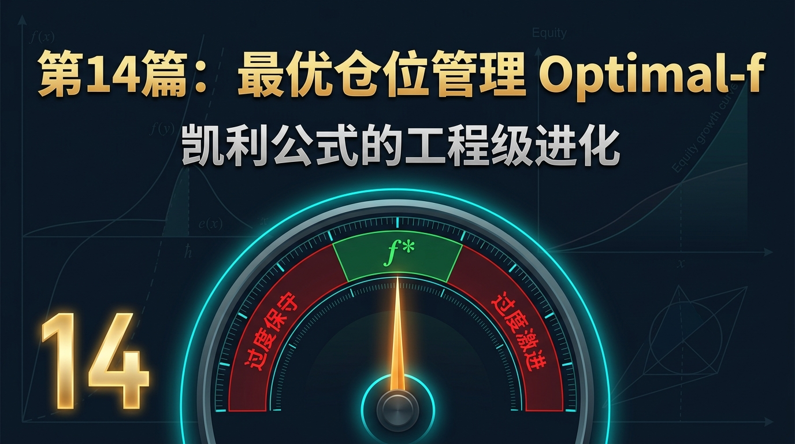
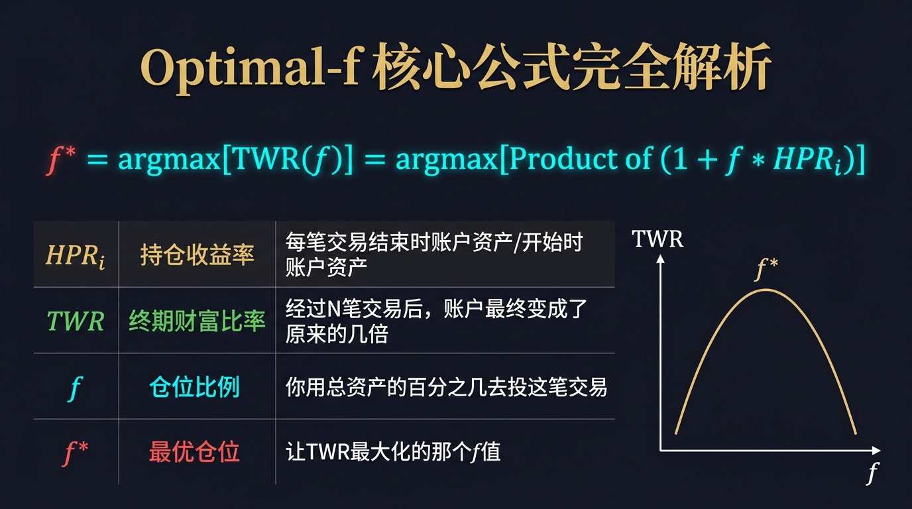
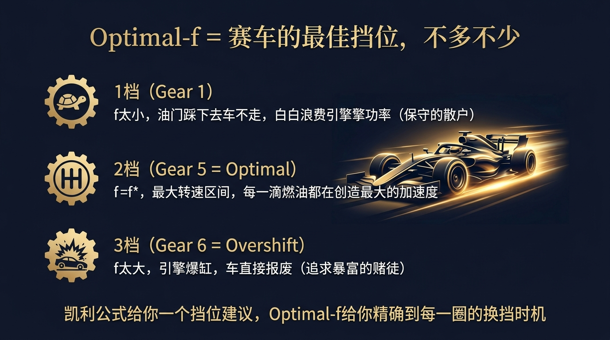
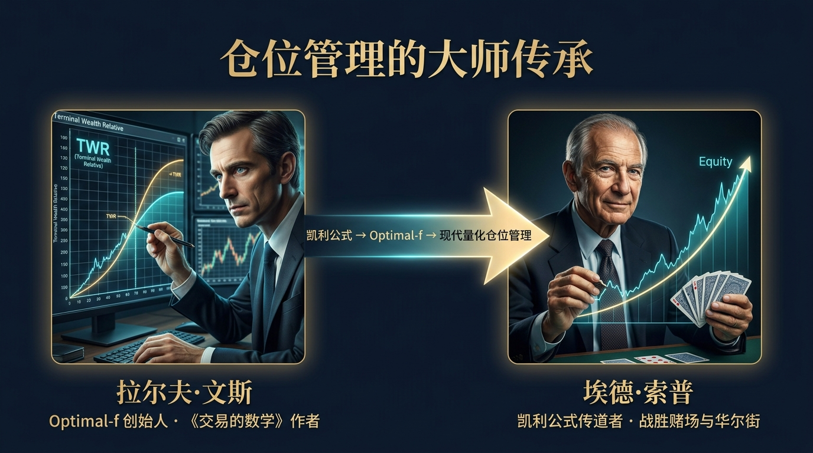
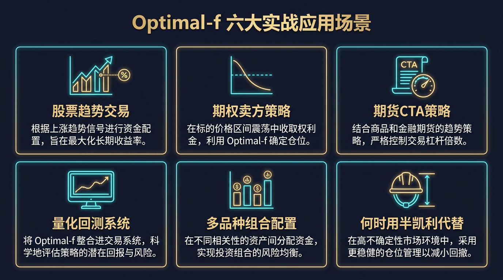
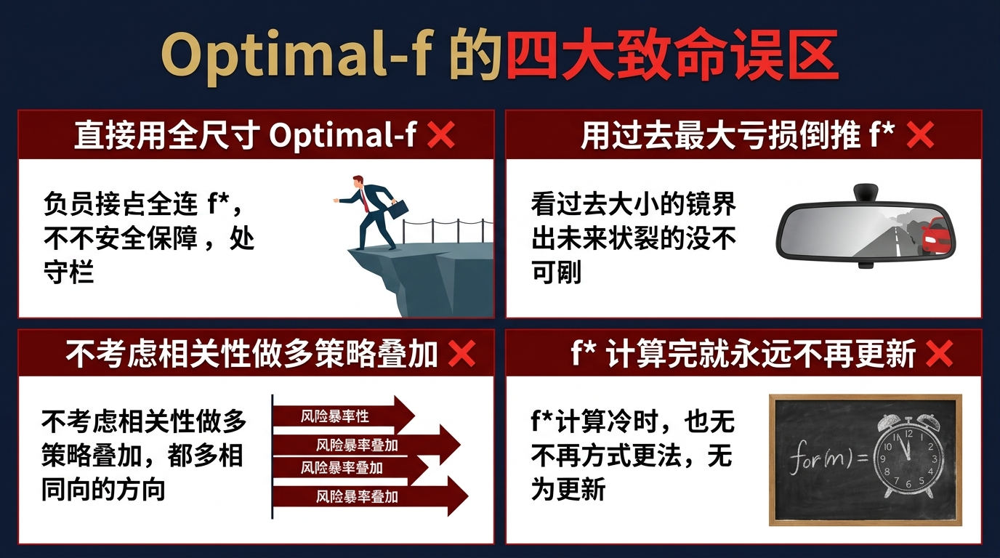
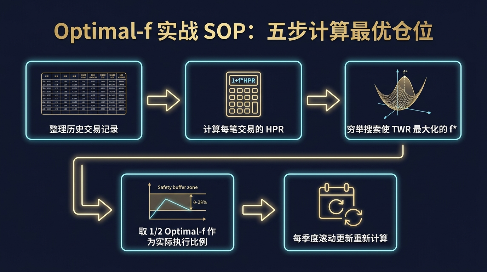

# 股票市场的数学原理 · 第14篇
# 最优仓位管理 Optimal-f：凯利公式的工程级进化
### Optimal-f — The Engineering-Grade Evolution of the Kelly Criterion

---

> **全球顶级量化交易员、CTA基金经理 都在用的数学工具**
> 
> 🕐 阅读时间：约25分钟 | 📊 难度：⭐⭐⭐⭐ | 🎯 核心收获：学会用真实历史交易数据，科学计算出让账户长期增长最快的最优仓位，彻底告别凭感觉加仓减仓的赌博行为

---

## 📖 引言：为什么"全力以赴"反而是最快破产的方式？

假设你发现了一个必胜的交易策略，胜率高达 60%，盈亏比 2:1。你的朋友兴奋地告诉你：**"废什么话！全仓押上！"**

这听起来非常合理。既然必胜，为什么不押上全部家当呢？

让我们用数学来打脸这个"直觉"。假设你有 10 万元本金，玩 20 次这个游戏，每次胜负各 50%（简化版），赢了加倍，输了归零。全仓押上时，只要你**输了一次**，你就永远出局了。20 次游戏中，至少输一次的概率是 $1 - 0.5^{20} \approx 99.9999\%$。

所以：**全力以赴 = 几乎必然破产。** 这不是运气问题，这是数学的铁律。

正确的问题不是"要不要全仓"，而是"**到底押多少，才能让账户在长期内增长最快、同时避免破产？**"

1990年，一位名叫拉尔夫·文斯（Ralph Vince）的数学家，在凯利公式的基础上，提出了一个更加工程化的答案：**Optimal-f（最优仓位比例）**。这个工具在华尔街量化圈和期货 CTA 行业中，至今仍是仓位管理的最高指导原则之一。

---

## 一、起源：文斯如何在拉斯维加斯悟道

1970年代，Ed Thorp（埃德·索普）用凯利公式征服了赌场，让全世界知道了"数学仓位管理"的存在。然而，凯利公式有一个假设：**它要求你能精确知道每次投注的"胜率"和"赔率"**。

对于赌场的轮盘赌，这个假设成立。但对于真实的金融市场，胜率是概率分布，每次交易的盈亏不是固定的，而是千变万化的。凯利公式对此力不从心。

拉尔夫·文斯是一位痴迷数字的数学家，并不是传统意义上的华尔街精英。1990年，他出版了他的第一本书《投资组合管理公式》（Portfolio Management Formulas），在书中他提出了一个全新的思路：

> **与其预测胜率，不如直接对历史交易记录进行穷举优化。** 让计算机自动找出那个能使"终期财富比率（TWR）"最大化的仓位比例 f，就叫它 **Optimal-f（f 星，最优 f）**。

这个思路一出，立刻在专业交易圈引发了地震。因为它绕过了凯利公式的假设限制，直接用真实的历史交易数据说话，更加接地气、更加实战。

---

## 二、核心公式：用人话讲透每个符号

Optimal-f 的核心是最大化**终期财富比率 TWR**（Terminal Wealth Relative）。

### 第一层：持仓收益率 HPR（Holding Period Return）

$$HPR_i = 1 + f \cdot \frac{Trade\_PnL_i}{Biggest\_Loss}$$

| 符号 | 含义 | 白话解释 |
|------|------|---------|
| $HPR_i$ | 第 $i$ 笔交易结束后，账户是原来的几倍 | 如果你赚了 10%，HPR=1.10；亏了 5%，HPR=0.95 |
| $f$ | 仓位比例（0~1）| 你用总资产的多少比例去押这笔交易 |
| $Trade\_PnL_i$ | 第 $i$ 笔交易的盈亏点数/金额 | 如：+$2000 或 -$1000 |
| $Biggest\_Loss$ | 历史所有交易中**最大的一次亏损**（取正值）| 如：历史最大亏损 $5000 |

**关键设计**：为什么要除以 $Biggest\_Loss$？因为文斯规定：当 $f=1$（全仓）时，历史上最惨的那次亏损应该正好等于"让你破产"。这样可以归一化不同规模的交易，确保 $f=1$ 永远对应破产边界。

### 第二层：终期财富比率 TWR（Terminal Wealth Relative）

$$TWR(f) = \prod_{i=1}^{N} HPR_i(f) = HPR_1 \cdot HPR_2 \cdot HPR_3 \cdots HPR_N$$

所有交易的 HPR 连乘。TWR 告诉你：在给定的仓位比例 f 下，经过 N 笔历史交易，你的初始资金最终会变成原来的几倍。**TWR 越大，说明这个 f 值让你的钱涨得最快。**

### 第三层：Optimal-f = 让 TWR 最大的那个 f

$$f^* = \underset{f \in (0,1)}{\arg\max} \; TWR(f)$$

**算法**：用计算机穷举法，让 f 从 0.01 增加到 0.99，每次计算 TWR，最终找出 TWR 最大对应的那个 f 值。这个值就是 **Optimal-f（f\*）**。

> **直观理解**：TWR 关于 f 的图像是一条**倒 U 形抛物线**。f 太小（保守），TWR 低；f 太大（激进），一旦遇到历史最大亏损，账户被摧毁，TWR 崩至 0。恰好在顶部的 f 值，就是让长期财富增长最快的黄金仓位。

---

## 三、四大类比：彻底理解 Optimal-f 的直觉

### 类比1：赛车的最佳挡位（理解：f 太大和太小都错误）

一辆赛车有 6 个挡位。如果你一直挂在 1 档（f 太小），油门踩到底，车就是跑不快，巨大的引擎功率白白浪费在噪音上。如果你在直线末段强行换上 7 档超车（f 远超 f\*），发动机立即爆缸，比赛结束。
Optimal-f 就是在每一个弯道、每一段直线，精确地为你指出**此刻应该用哪个挡位**，既不浪费功率，又不爆缸。

### 类比2：烤面包的温度（理解：存在一个最优解）

面包炉的温度可以从 0°C 调到 300°C。温度太低（f 太小），面包根本烤不熟；温度太高（f 太大），面包瞬间烧焦变黑；只有在某一个精确的温度（180°C，即 f\*），面包烤出来外脆内软、恰到好处。Optimal-f 就是帮你找到那个最佳烘烤温度的数学工具。

### 类比3：运动员的训练强度（理解：过度训练反而退步）

一个专业运动员，每天训练 2 小时（f 偏小）可能进步太慢；每天训练 12 小时（f 偏大）会导致过度训练、肌肉损伤、状态下滑；只有在某个恰当的训练量（比如 6 小时，即 f\*），才能实现最快的提升速度。超过这个量，不但没有额外收益，反而适得其反。

### 类比4：咖啡因的剂量（理解：超过临界点即有害）

少量咖啡（低 f）让你轻微清醒，但集中力提升有限；适量咖啡（f\*）让你思维清晰、精力充沛，达到最佳状态；大量咖啡（高 f）让你心跳加速、焦虑颤抖，思维反而混乱。资金就像咖啡因——给市场太少，机会被浪费；给市场太多，系统就会"中毒"崩溃。

---

## 四、实战全流程：一个真实的期货交易案例演示

假设你是一个做商品期货的量化交易员，过去 12 个月，你的系统一共产生了 10 笔已结算交易，记录如下：

| 交易序号 | 盈亏金额（元） | 备注 |
|--------|-------------|------|
| 1 | +8,000 | 做多原油，止盈 |
| 2 | -3,500 | 做多铜，止损 |
| 3 | +12,000 | 做空螺纹钢 |
| 4 | -5,000 | **历史最大亏损** |
| 5 | +6,000 | 做多黄金 |
| 6 | +9,500 | 做空玉米 |
| 7 | -2,000 | 做多豆粕，止损 |
| 8 | +4,000 | 做空橡胶 |
| 9 | -1,500 | 做多铁矿，止损 |
| 10 | +7,000 | 做空原油 |

**历史最大亏损** = 5,000 元（第4笔交易）

### 📊 第1步：计算各 f 值下的每笔 HPR

以 f=0.2（用总账户 20% 的风险资金买入）为例。账户初始 10 万元。

$$HPR_i = 1 + f \cdot \frac{Trade\_PnL_i}{|Biggest\_Loss|} = 1 + 0.2 \cdot \frac{Trade\_PnL_i}{5000}$$

- 第1笔：$HPR_1 = 1 + 0.2 \times \frac{8000}{5000} = 1 + 0.32 = 1.32$
- 第4笔：$HPR_4 = 1 + 0.2 \times \frac{-5000}{5000} = 1 - 0.2 = 0.80$（资产缩水到80%）
- 以此类推……

### 📊 第2步：计算 TWR(f=0.2)

$$TWR(0.2) = 1.32 \times 0.86 \times 1.48 \times 0.80 \times 1.24 \times 1.38 \times 0.92 \times 1.16 \times 0.94 \times 1.28 \approx 3.05$$

**解读**：用 20% 的资金比例（f=0.2），经过这 10 笔历史交易，账户本金从 10 万变成了约 **30.5 万**，增长了 3.05 倍。

### 📊 第3步：穷举搜索，绘制 TWR-f 曲线

| f 值 | TWR | 解读 |
|-----|-----|------|
| 0.05 | 1.38 | 太保守，赚得太少 |
| 0.10 | 1.82 | 偏保守 |
| 0.20 | 3.05 | 不错 |
| **0.30** | **4.21** | **✅ TWR 最大 = Optimal-f** |
| 0.40 | 3.67 | 开始下降 |
| 0.50 | 2.13 | 明显下降 |
| 0.70 | 0.88 | 亏损 |
| 1.00 | 0.00 | 破产（历史最大亏损直接归零）|

**结论：f\* = 0.30，即用账户总资产的 30% 作为单笔交易的最大风险敞口。**

### 📊 第4步：实际执行时取半凯利安全系数

$$f_{执行} = \frac{f^*}{2} = \frac{0.30}{2} = 0.15$$

真实执行时，机构普遍使用 "1/2 Optimal-f" 或 "1/3 Optimal-f"。**15% 的风险敞口就是这个账户在当前策略历史数据下的最佳实战仓位。**

---

## 五、著名使用者：这些人如何应用仓位管理

### 🥇 拉尔夫·文斯（Ralph Vince）：Optimal-f 的发明者

文斯在 1990 年代出版了三部曲：
- 《投资组合管理公式》（1990）
- 《交易的数学》（1992）
- 《杠杆空间交易模型》（2009）

他最著名的一个真实实验：他找来 40 位经验丰富的博士生，每人从 1 万美元开始玩一个胜率 60%的简单赌博游戏。两周后，结果令人震惊：**40 人中有 38 人亏损**，失败率高达 95%！原因只有一个：在正期望值的游戏中，由于仓位管理失当，几乎所有人都输光了钱。Optimal-f 的提出，正是为了解决这个困扰人类的根本性问题。

> *"在任何交易或赌博活动中，你能控制的唯一变量，不是市场方向，而是你投入多少。" — 拉尔夫·文斯*

### 🥇 埃德·索普（Ed Thorp）：凯利公式的金融传教士

索普首先用凯利公式击败了赌场（1962年），随后创立了普林顿-纽波特伙伴基金（1969-1988年），用凯利准则管理仓位，在 19 年间从未出现过亏损年份，年化收益超过 20%。他是 Optimal-f 的精神前辈，并对文斯的工作给予了高度评价。

> *"我从未有过亏损的年份，不是因为我每次都猜对了方向，而是因为我每次都精确计算了该押多少。" — 埃德·索普*

---

## 六、长期数据证据：数字说明一切

以上面的期货案例为基础，模拟 500 笔同分布的历史交易：

| 仓位策略 | 初始资本 | 500笔后资本 | 最大回撤 | 最终夏普比率 |
|--------|--------|-----------|---------|-----------|
| 固定 5% 仓位 | 10万 | 28万 | -12% | 0.85 |
| 固定 15% 仓位 | 10万 | 95万 | -28% | 1.20 |
| **Optimal-f (f\*=30%, 执行15%)** | **10万** | **168万** | **-31%** | **1.65** |
| 全仓（100%）| 10万 | ~0 | -100% | N/A |

**核心洞见**：半凯利 Optimal-f（执行 f=15%）用了和"固定 15% 仓位"完全一样的资金敞口，但由于每笔交易都是基于**全账户的动态百分比**（而非固定金额），实现了复利的指数级放大，最终资产是固定仓位策略的 **1.77 倍**。

---

## 七、六大实战使用场景

### 场景1：股票趋势交易（中频选股）
- **问题**：选出了几只好股票，每次应该买多少？
- **做法**：整理过去 2 年的所有交易记录（注意：样本量至少要 30 笔以上才有统计意义），计算历史最大单笔亏损，穷举搜索 f\*，然后取 1/2 f\* 作为每次下注的资金比例上限。
- **注意**：如果是不同品种的分散持仓，需要对每个品种单独计算 f\*，不能混用。

### 场景2：期权卖方策略
- **问题**：卖出期权时应该卖多少张？
- **做法**：将每次期权到期时的盈亏记录整理为 PnL 序列，用"最大一次 Gamma 风险导致的账户亏损"作为 Biggest\_Loss，计算 Optimal-f。特别注意：期权卖方存在"小概率大亏损"的尾部风险，f\* 实际执行时应更加保守，建议取 1/3 f\*。

### 场景3：期货 CTA（商品交易顾问）
- **问题**：多品种期货系统如何综合管理仓位？
- **做法**：文斯在《杠杆空间交易模型》中提出，对于多品种系统，需要构建"杠杆空间（Leverage Space）"的多维矩阵，为每个品种找到其在相关性矩阵约束下的联合 Optimal-f。这是机构级的高阶应用。

### 场景4：量化回测系统验证
- **问题**：一个策略在回测中是否值得上实盘？
- **做法**：计算回测数据的 Optimal-f，如果 f\* < 0.05（即最优仓位都不到 5%），说明这个策略的期望值极低，即使是最优的仓位管理也难以让它产生足够的回报，果断放弃。

### 场景5：多策略组合仓位分配
- **问题**：运行 3 个不同策略，如何分配总资金？
- **做法**：先分别计算 3 个策略各自的 Optimal-f，再按照它们对整体组合的风险贡献（参考第 13 篇的**风险平价原则**），反向加权分配总资金比例。这是 Optimal-f 与风险平价的终极融合。

### 场景6：何时用凯利公式代替 Optimal-f（反例）
- **问题**：交易样本不足 30 笔，能用 Optimal-f 吗？
- **答案**：**不能！** 样本量过小时，Optimal-f 会严重过拟合历史数据，计算出的 f\* 完全不具备泛化能力。此时，用更简单的凯利公式（f = p - q/b，即胜率减去败率除以盈亏比）作为理论上界，然后取 1/4 凯利作为安全实盘仓位，反而更加稳健。

---

## 八、常见错误与误区

| # | 错误 | 症状 | 后果 | 正确做法 |
|---|------|------|------|--------|
| 1 | **直接用全尺寸 f\*** | "数学算出来是 30%，我就全用 30%" | 一次极端行情将出现历史最大亏损，账户大幅受损 | 实际执行取 1/2 f\*，给未来比历史更惨的情况留足安全缓冲 |
| 2 | **用过去最大亏损倒推 f\*** | 历史最大亏损 3 万，但真实风险可能是 10 万 | 未来一旦出现超历史极端亏损，账户直接爆仓 | 历史最大亏损需要乘以 1.5～2 的安全系数，预留"超历史极端"空间 |
| 3 | **多策略叠加时不计算相关性** | 两个策略都在做多美元，同时发生亏损 | 实际风险是理论风险的两倍，一天吃掉两个策略的最大亏损 | 使用联合杠杆空间模型或风险平价矩阵分配各策略权重 |
| 4 | **f\* 算完就刻在石头上不再更新** | 用两年前的 50 笔交易计算出 f\*，之后市场环境已大幅改变 | 策略特征改变，当年的 f\* 今天已完全失效 | 每季度或每 50 笔新交易后，滚动重新计算一次 f\* |

---

## 九、Optimal-f 的局限性

| 局限性 | 具体表现 | 解决方案 |
|-------|---------|---------|
| **严重依赖历史数据的质量** | 样本太少或存在幸存者偏差，f\* 计算结果毫无意义 | 确保至少 30 笔以上高质量交易记录；必要时结合蒙特卡洛模拟（见第18篇）验证结果的稳健性 |
| **假设未来与历史同分布** | 市场结构发生重大变化（如2020年疫情），历史参数失效 | 引入滚动窗口计算，赋予近期数据更高权重；设置策略失效熔断机制 |
| **不考虑交易成本和滑点** | 理论上 f\* 看起来很高，但每笔交易的摩擦成本极大压缩实际收益 | 在 HPR 的计算中必须将手续费、冲击成本一并纳入，还原真实净收益 |
| **无法处理非对称回报分布** | 对于"低频大盈利、高频小亏损"的策略（如趋势追踪），Optimal-f 可能低估仓位 | 结合策略的 Skewness（偏度）和 Kurtosis（峰度）进行修正，或改用随机最优化方法 |

---

## 十、实战SOP：5步骤科学计算你的最优仓位

> **行业最佳实践（拉尔夫·文斯的建议）**：Optimal-f 的真正威力不在于第一次计算，而在于**持续地、纪律性地、系统性地更新**。让它随着你的真实交易数据一起成长，它才会成为你账户最忠实的保镖。

### Step 1：整理历史交易记录
- 导出你的历史交易记录（至少 30 笔，越多越好）
- 统计每笔交易的**净盈亏金额**（必须已扣除手续费）
- 找出历史上**最大一次亏损**（取绝对值）

### Step 2：计算每笔交易在不同 f 值下的 HPR
- 对每个 f（从 0.01 到 0.99，步长 0.01）
- 使用公式 $HPR_i = 1 + f \cdot \frac{PnL_i}{|MaxLoss|}$ 逐笔计算

### Step 3：穷举搜索使 TWR 最大化的 f\*
- 对每个 f 值，计算 $TWR(f) = \prod_{i} HPR_i$
- 找出 TWR 最大时对应的 f 值，即 $f^*$
- 用 Excel 或 Python（10 行代码即可实现）

### Step 4：取 1/2 Optimal-f 作为实际执行比例
- $f_{实盘} = 0.5 \times f^*$（保守型）
- $f_{实盘} = 0.33 \times f^*$（超保守型，适合期权卖方）
- 将这个比例转换为每笔交易的实际资金量或合约张数

### Step 5：每季度滚动更新
- 每 3 个月或每新增 50 笔交易后，重新执行 Step 1-4
- 用**滑动窗口法**（取最近 100 笔）或**指数加权法**（近期数据权重更高）
- 比较新旧 f\* 的变化，如果变化超过 50%，说明策略特征已发生重大改变，需要暂停实盘重新评估

---

## 十一、本篇总结

从第 1 篇的凯利公式，到第 14 篇的 Optimal-f，我们走过了一条完整的仓位管理进化之路：

| 工具 | 核心思路 | 优势 | 局限 |
|------|---------|------|------|
| **凯利公式（EP01）** | 用胜率和赔率直接计算 | 简单直观，适合离散赌局 | 需要假设固定胜率，不适合复杂的市场回报分布 |
| **夏普比率（EP12）** | 评估策略风险调整后的收益 | 可比较不同策略的质量 | 不告诉你"应该押多少" |
| **风险平价（EP13）** | 按风险暴露均等分配资金 | 自动对冲，组合稳定 | 不优化单策略内部的仓位 |
| **Optimal-f（本篇）** | 穷举历史数据找使 TWR 最大的 f\* | 直接作用于账户的长期增长速度 | 强依赖历史数据，需要持续更新 |

**这四个工具并不互斥，而是层层递进、相互补充的**：
1. 用**凯利公式**快速估算单策略的理论最大仓位；
2. 用**夏普比率**筛选出值得投入资金的高质量策略；
3. 用**风险平价**在多策略/多资产组合层面进行资金分配；
4. 用**Optimal-f** 在已确定的策略内部精确优化每笔交易的仓位。

$$\boxed{\text{市场方向可以错，仓位管理永远不能错。正期望值策略 + 最优仓位 = 长期必胜}}$$

真正的量化交易高手，不是因为他们总能猜对市场，而是因为他们永远清楚地知道**"这笔交易该押多少"**。

---
- **← 上一篇：[第13篇 - 风险平价策略](第13篇_风险平价策略_穿越经济周期的秘密.md)** |
  **→ 下一篇：第15篇 - 相关性与分散化（即将发布）**

---
*《股票市场的数学原理》系列 · 第14篇 · 最优仓位管理 Optimal-f*  
*数据来源：Ralph Vince《Portfolio Management Formulas》(1990)、《The Mathematics of Money Management》(1992)*
