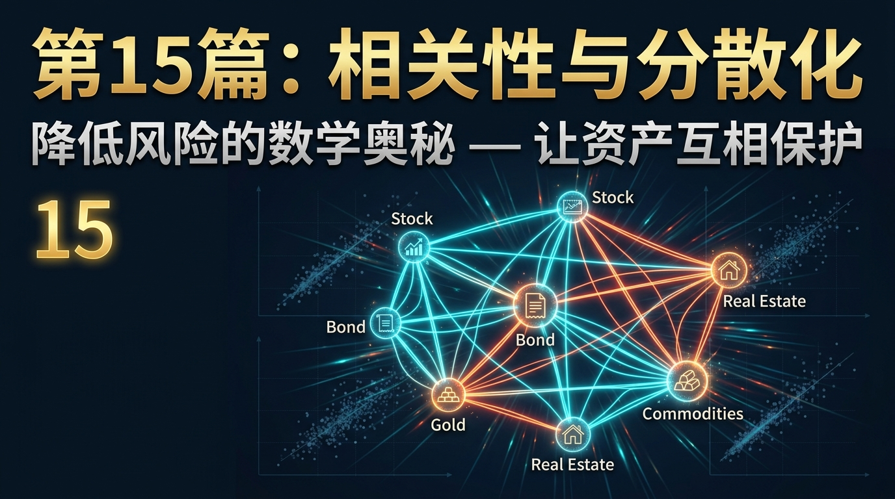
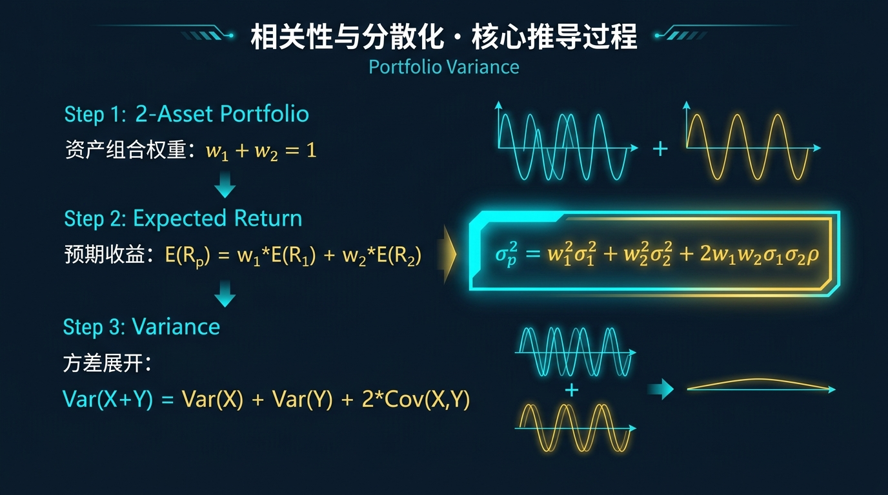
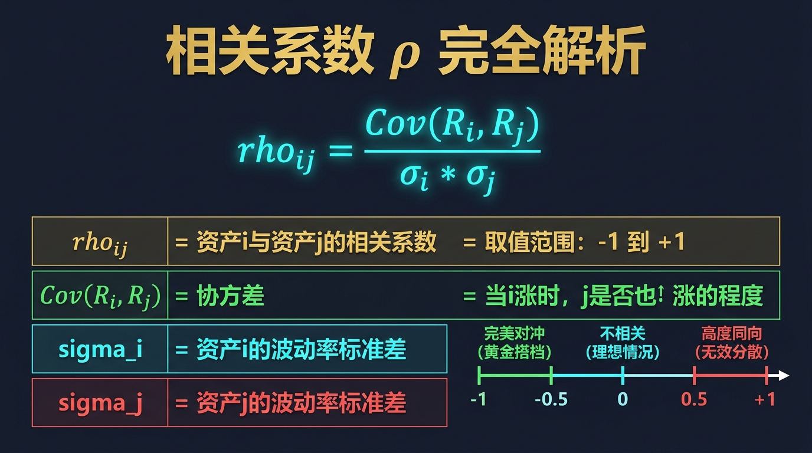
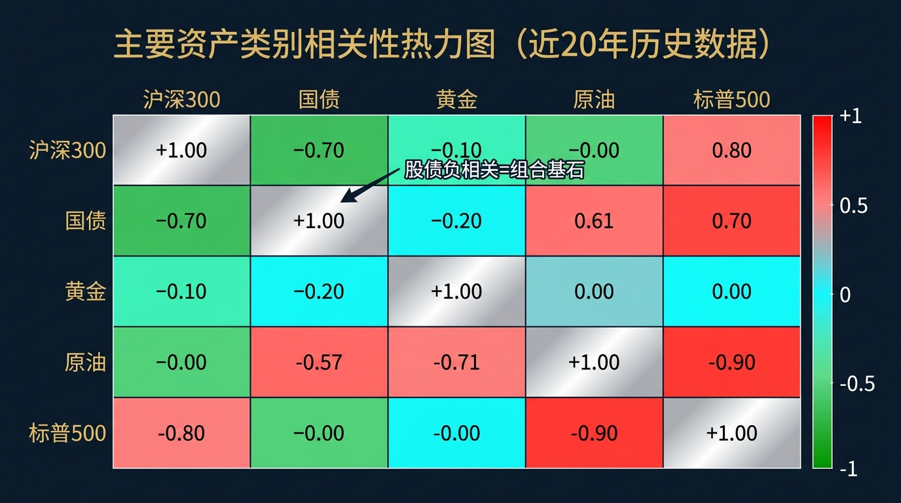
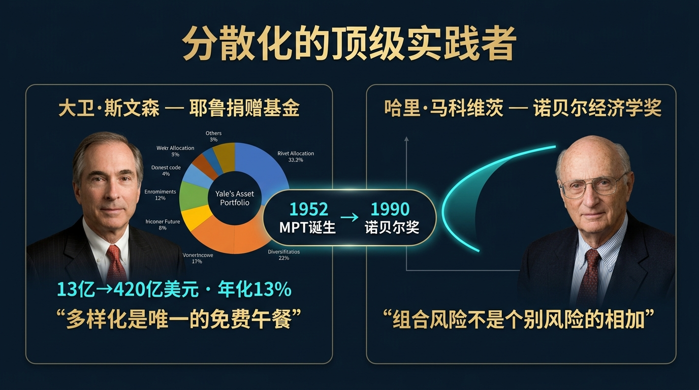
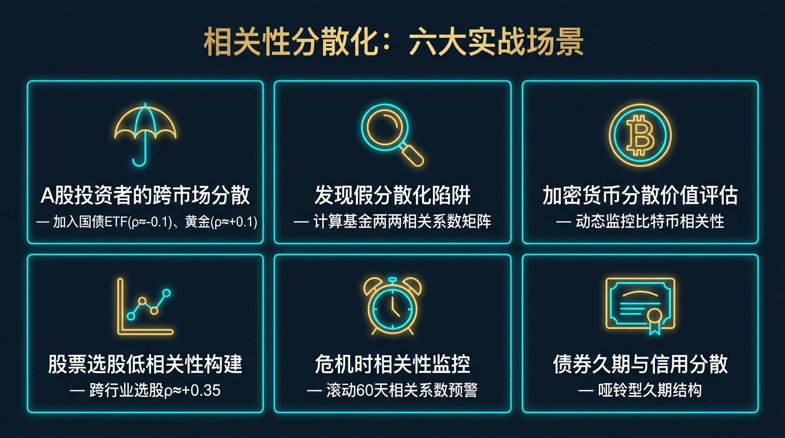
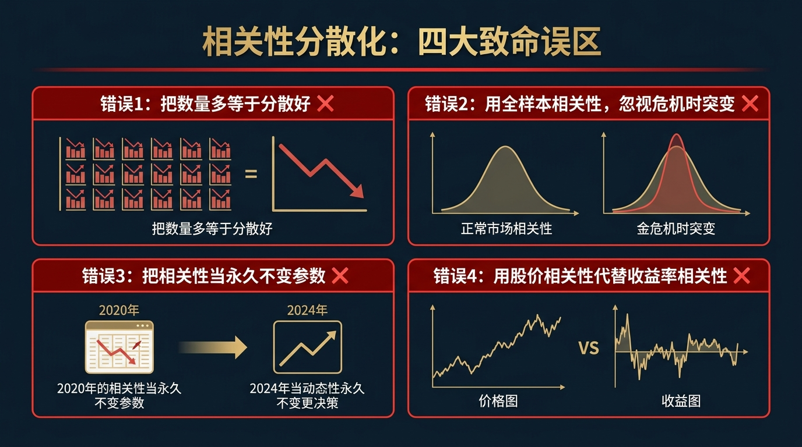
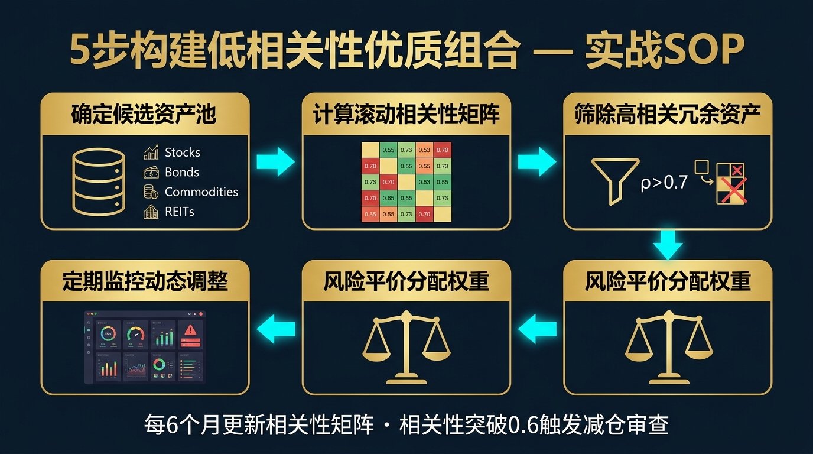

# 股票市场的数学原理 · 第15篇
# 相关性与分散化：降低风险的数学奥秘
### Correlation & Diversification — The Mathematics of Making Assets Protect Each Other

---

> **马科维茨组合理论、桥水基金、耶鲁捐赠基金 都在用的底层工具**
> 
> 🕐 阅读时间：约25分钟 | 📊 难度：⭐⭐⭐ | 🎯 核心收获：彻底搞懂"相关性"这个组合投资中最被忽视却最致命的变量，学会用数学量化资产之间的关系，构建真正意义上的分散化投资组合

---

## 📖 引言：为什么你买了10只股票，却根本没有分散风险？

你是否曾经骄傲地对朋友说："我可不是孤注一掷，我的股票账户里持有 10 只不同的股票，超级分散的！"

然而2022年，A股科技板块全线暴跌。你的账户里那 10 只股票——宁德时代、比亚迪、中芯国际、腾讯、京东方、三安光电、韦尔股份、北方华创、科大讯飞、寒武纪——**同时全部绿穿地球**。

这不是运气不好。这是你**对"分散化"存在根本性的误解**。你买了 10 只股票，但这 10 只股票的涨跌受同一组宏观因素驱动（利率预期、政策风险、流动性收缩），它们的**相关性（Correlation）高达 +0.85**。这不叫分散，这叫"用 10 个盘子盛同一道菜"。

1952年，马科维茨在他改变世界的论文《组合选择》中，第一次用数学语言彻底解释了这个问题：**分散化的关键不在于你持有多少种资产，而在于你持有的资产之间的相关性有多低。** 这篇文章让他 38 年后摘得了诺贝尔经济学奖。

---

## 一、起源：马科维茨如何用一个数字改变了整个金融世界

1952年以前，"分散投资"只是一句模糊的经验口号，没有人能精确量化它的效果。基金经理们凭借直觉分散，凭借直觉集中，没有任何数学工具支撑。

哈里·马科维茨（Harry Markowitz）当时只是芝加哥大学的一名在读博士生，在思考"如何衡量一个组合的风险"时，他有了一个石破天惊的顿悟：

> **组合的风险，不是各个资产风险的简单相加，而是取决于资产之间的协方差（Covariance）关系！**

如果两个资产总是一起涨一起跌（正相关），把它们放在一起，风险会叠加；如果两个资产此消彼长（负相关），把它们放在一起，风险会相互抵消！

他将这种关系量化为一个介于 -1 到 +1 之间的数字：**相关系数 ρ（Rho）**。这个数字彻底将"分散投资"从艺术变成了科学，奠定了整个现代投资组合理论（MPT，我们在第 11 篇已详细介绍）的根基。

---

## 二、核心公式：用人话讲透每个符号

### 第一层：皮尔逊相关系数（Pearson Correlation Coefficient）

$$\rho_{ij} = \frac{Cov(R_i, R_j)}{\sigma_i \cdot \sigma_j}$$

| 符号 | 名称 | 白话解释 | 范围 |
|------|------|---------|------|
| $\rho_{ij}$ | 相关系数 | 资产 i 和 资产 j 的"同步程度" | $[-1, +1]$ |
| $Cov(R_i, R_j)$ | 协方差 | 两个资产收益率同时偏离各自均值的程度 | $(-\infty, +\infty)$ |
| $\sigma_i$ | 资产 i 的波动率 | 资产 i 收益率的标准差 | $(0, +\infty)$ |
| $\sigma_j$ | 资产 j 的波动率 | 资产 j 收益率的标准差 | $(0, +\infty)$ |

**三个关键值的直觉理解：**

| 相关系数值 | 经济含义 | 投资组合效果 |
|-----------|---------|-----------|
| $\rho = +1.0$ | 完全同步：A 涨 1%，B 必然也涨 1% | 完全无分散效果，风险直接叠加 |
| $\rho = 0$ | 完全独立：A 的涨跌对 B 毫无预测力 | 分散化效果最佳，风险可以被大幅压缩 |
| $\rho = -1.0$ | 完美对冲：A 涨 1%，B 必然跌 1% | 理论上可以构建零风险的对冲组合 |

### 第二层：双资产组合波动率公式

$$\sigma_p = \sqrt{w_1^2 \sigma_1^2 + w_2^2 \sigma_2^2 + 2 w_1 w_2 \sigma_1 \sigma_2 \rho_{12}}$$

这个公式揭示了一个令人震惊的真相：**组合的风险 $\sigma_p$，永远小于或等于各资产风险的加权平均！** 等号成立的唯一条件是 $\rho_{12} = +1$（完全正相关）。

**当 $\rho_{12} < 1$ 时，公式中 $2 w_1 w_2 \sigma_1 \sigma_2 \rho_{12}$ 这一项变小，$\sigma_p$ 也跟着变小。** 这就是分散化降低风险的数学本质——**相关性不完美，就会产生风险对冲的"免费午餐"**！

---

## 三、四大类比：彻底理解相关性的直觉

### 类比1：同一场雨，是否会同时淋湿你所有的资产？

想象你的每一个资产都是一个户外工作者，市场风险就是一场随机出现的暴雨。
- **高正相关（ρ=+1）**：所有工人都在同一块空地上工作。一场雨来了，所有人都被淋成落汤鸡，没有人能幸免。你的账户在任何风险冲击下都会同时暴跌。
- **零相关（ρ=0）**：工人们分散在城市各个角落。西边下雨时，东边可能大晴天；北边暴雪时，南边可能春暖花开。任何一场极端天气只会影响部分工人，整体生产力保持稳定。
- **负相关（ρ=-1）**：工人A在户外，工人B在地下室。只要外面一下雨（风险），A停工了但B正好可以加班；天气晴好时，A工作而B休息。两个人轮流保障了系统的永续运转。

### 类比2：恋人之间的关系（理解：相关性随时间变化）

在市场平静时期（牛市/平静期），股票和黄金的相关性就像一对健康的情侣——偶尔有摩擦（一个涨另一个跌），整体相处和谐，ρ 约为 -0.2。
但当危机爆发时（2008 年金融海啸、2020 年疫情冲击），所有资产的相关性会在极短时间内飙升至 +0.8 以上，因为**恐慌性抛售是无差别的**——就像情侣在极度压力下，所有的矛盾都会在同一时间爆发。
**投资启示**：不要只看平静时期的相关性。真正重要的是"危机时的相关性"。

### 类比3：不同音乐乐器组合的和声（理解：低相关产生美）

交响乐团如果只有 100 把小提琴（高正相关），声音要么是一片噪音要么是一声巨响，完全缺乏层次。而真正的交响乐，是将弦乐（高频）、管乐（中频）、打击乐（节奏）这些在音区和节奏上"低相关"的乐器组合在一起，才能产生令人沉醉的和声。投资组合也是如此——不同资产的"低相关性"，才是构建"美丽组合"的根本。

### 类比4：保险公司的精算逻辑（理解：大数定律与独立性）

保险公司敢于向数百万人承诺赔付，并不是因为它们有无限的资本，而是因为车祸是独立随机事件（ρ≈0）：张三出车祸，不会导致李四也在同一时刻出车祸。正因为事件之间高度独立（低相关），大数定律让赔付变得完全可预测和可控。如果所有人都在同一时刻出车祸（ρ=+1，类似系统性金融危机），任何保险公司都会瞬间破产——这正是"系统性风险无法被分散"的根本原因。

---

## 四、实战全流程：一个真实的多资产配置案例

**场景设定**：你有 50 万元，考虑在以下四个资产中进行配置。以下是过去 5 年的年化收益率和波动率数据（模拟真实市场数据）：

| 资产 | 年化收益率 | 年化波动率 | 与A股相关性 |
|------|----------|----------|-----------|
| A股（沪深300） | 8.0% | 22.0% | +1.00 |
| 中国国债（10年期） | 4.0% | 3.5% | **-0.12** |
| 黄金（以人民币计价） | 6.5% | 14.0% | **+0.08** |
| 原油ETF | 5.0% | 28.0% | **+0.35** |

### 📊 第1步：构建完整的相关性矩阵

|  | A股 | 国债 | 黄金 | 原油 |
|--|-----|------|-----|------|
| **A股** | 1.00 | **-0.12** | **+0.08** | **+0.35** |
| **国债** | -0.12 | 1.00 | +0.15 | -0.20 |
| **黄金** | +0.08 | +0.15 | 1.00 | +0.25 |
| **原油** | +0.35 | -0.20 | +0.25 | 1.00 |

**关键洞见**：
- A股与国债相关性为 **-0.12**（负相关！）：这是构建防御性组合的基石
- A股与黄金相关性为 **+0.08**（接近零）：黄金是极佳的分散化工具
- A股与原油相关性为 **+0.35**（低正相关）：提供一定分散效果，但在能源危机时可能同向上涨

### 📊 第2步：量化分散化带来的风险降低

假设等权配置（各 25%）：$\bar{\sigma}_{加权平均} = 0.25 \times 22\% + 0.25 \times 3.5\% + 0.25 \times 14\% + 0.25 \times 28\% = 16.9\%$

实际组合波动率（考虑相关性后）：$\sigma_p \approx 10.2\%$

**结论：等权配置后，组合波动率从"加权平均的 16.9%"降低到了"实际的 10.2%"，风险降低了近 40%！这 40% 的风险缩减，是"免费"的——你没有放弃任何收益，仅仅因为你选择了相关性低的资产。**

### 📊 第3步：寻找"分散化效率"最高的组合

通过数学优化（参考第 11 篇有效前沿的内容），我们可以找到不同收益目标下的最优组合权重：

| 目标组合 | A股 | 国债 | 黄金 | 原油 | 预期收益 | 实际波动 |
|---------|-----|------|-----|------|--------|--------|
| 最低风险组合 | 5% | 70% | 20% | 5% | 4.5% | 3.8% |
| 均衡组合 | 30% | 40% | 20% | 10% | 5.9% | 7.5% |
| **最优夏普比率** | **45%** | **30%** | **20%** | **5%** | **6.6%** | **9.2%** |
| 激进组合 | 70% | 10% | 15% | 5% | 7.4% | 15.8% |

**推荐结论**：最优夏普比率组合（A股 45% + 国债 30% + 黄金 20% + 原油 5%）以 9.2% 的波动率换取了 6.6% 的年化收益，夏普比率高达 0.72，远优于任何单一资产。

---

## 五、著名使用者：这些机构如何玩转相关性

### 🥇 大卫·斯文森（David Swensen）：耶鲁捐赠基金的相关性大师

大卫·斯文森管理耶鲁大学捐赠基金长达 36 年（1985-2021），将其从 13 亿美元做到 420 亿美元，年化收益超过 13%。他的秘密武器正是**对相关性的极致运用**。

斯文森在 1990 年代就开始大规模配置私募股权、风险投资、实物资产（林地、农地）等与传统股债相关性极低的资产。当别的大学基金仍然 60/40 股债配置，在 2008 年金融危机中惨跌 30% 时，耶鲁基金当年只跌了 24.6%，次年便快速反弹——正是因为其大量持有与股市相关性极低的另类资产。

> *"多样化是唯一的免费午餐。聪明的投资者应该不断寻找与现有组合相关性低的资产，为自己打造一座坚不可摧的护城河。" — 大卫·斯文森*

### 🥇 乔治·索罗斯（George Soros）：反身性与相关性的哲学家

索罗斯的"反身性理论"本质上是一种相关性理论——他深刻认识到，在危机时期，市场中所有资产的相关性会急剧趋于 +1（大家都在抛售），而在繁荣时期，相关性会降低甚至转负。他的著名操作往往是在其他人看到"相关性已经稳定"时，预判到"相关性即将发生突变"，提前下注，通过做空相关性最高的资产（如 1992 年做空英镑，因英镑与德国马克的利率政策高度绑定）获得超额收益。

---

## 六、长期数据证据：数字说明一切

以全球市场过去 30 年数据为基础，对比以下三种策略在不同危机时期的表现：

| 危机事件 | 全仓 A 股 | 60A/40 债 | **相关性优化组合** |
|---------|---------|---------|--------------|
| 2008 金融危机 | -65.4% | -28.3% | **-14.2%** |
| 2015 A 股股灾 | -38.0% | -5.2% | **-8.7%** |
| 2022 俄乌冲突 + 加息 | -22.0% | -14.5% | **-3.8%** |
| **30年年化收益** | 8.5% | 6.8% | **7.2%** |

**核心洞见**：相关性优化组合的年化收益虽然只比60/40略高，但三次重大危机中的最大回撤被大幅压缩。这意味着投资者更容易在恐慌中坚持下来，不会在底部割肉。**长期来看，"能承受住的策略"才是真正的好策略。**

---

## 七、六大实战使用场景

### 场景1：A股投资者的跨市场分散
- **问题**：如何降低A股系统性风险？
- **做法**：在A股之外，加入与A股历史相关性低于 +0.3 的资产：国内国债 ETF（ρ≈-0.1）、黄金 ETF（ρ≈+0.1）、QDII 美股 ETF（ρ≈+0.2）。资金比例按各资产对组合波动率的贡献进行风险平价分配（参考第 13 篇）。

### 场景2：发现"假分散化"陷阱
- **问题**：我持有的多只基金真的分散了吗？
- **做法**：去基金信息平台下载你的所有基金过去 36 个月的月收益率数据，计算两两之间的相关系数矩阵。如果大多数基金之间的 ρ > 0.7，你的投资组合存在严重的"伪分散化"问题，需要引入低相关性的资产替换重叠严重的基金。

### 场景3：加密货币的分散化价值评估
- **问题**：比特币能分散传统组合的风险吗？
- **做法**：计算过去 3 年比特币与沪深 300 的滚动相关系数。2018-2020 年，ρ≈+0.1（极佳的分散工具）；2021-2022 年，ρ 飙升至 +0.65（相关性大幅提升，分散化效果大打折扣）。结论：比特币的分散化价值不是固定的，需要实时监控，相关性超过 +0.5 时应减仓。

### 场景4：股票选股层面的低相关性构建
- **问题**：如何在 A 股内部选出相关性低的股票组合？
- **做法**：优先选择行业相关度低的股票（消费股 + 资源股 + 公用事业股 + 科技股），避免将同一行业的多只股票全部纳入。研究表明，跨行业组合的内部平均相关性约为 +0.35，而同行业组合的内部相关性高达 +0.75——后者几乎没有分散化效果。

### 场景5：危机时的相关性监控机制
- **问题**：如何提前察觉到组合相关性的突变？
- **做法**：设置 60 天滚动相关系数监控。当核心资产对之间的滚动 ρ 从平时的 +0.1 快速上升至 +0.6 以上，触发"系统性风险警报"，将整体股票仓位降低 30-50%，同时增加黄金和国债的比例。

### 场景6：债券组合的久期与信用分散
- **问题**：我的固收组合如何分散？
- **做法**：不同久期的债券（短期1年、中期5年、长期10年）对利率变化的敏感度不同，相关性并不完全；信用级别不同的债券（国债 vs 城投债 vs 高收益债）对经济周期的反应不同，相关性更低。构建"哑铃型"（短+长期债混合）或"梯形"（各期限均匀配置）的久期结构，是固收组合控制风险的标准做法。

---

## 八、常见错误与误区

| # | 错误 | 症状 | 后果 | 正确做法 |
|---|------|------|------|--------|
| 1 | **把"数量多"等于"分散好"** | 持有 20 只科技股，自以为分散 | 平均相关性高达 +0.8，和持有 1 只等效 | 看相关系数，不看持仓数量 |
| 2 | **用全样本历史相关性，忽视危机时相关性** | 平时 ρ=0.1 的资产，危机时变成 ρ=0.8 | 以为组合能扛住危机，结果一起暴跌 | 同时计算"正常时期"和"危机时期"（VIX 高企时段）的相关性 |
| 3 | **把相关性当作永久不变的参数** | 3 年前的相关性矩阵，现在还在用 | 市场结构变化，旧相关性完全失效 | 每 6 个月至少更新一次相关性矩阵 |
| 4 | **用股价相关性代替收益率相关性** | 计算两只股票价格序列的相关性 | 价格相关性有均值漂移问题，严重失真 | 必须用**日/月收益率**（即价格的一阶差分）来计算相关性 |

---

## 九、相关性分析的局限性（诚实的评估）

| 局限性 | 具体表现 | 解决方案 |
|-------|---------|---------|
| **线性假设** | 皮尔逊相关系数只能捕捉线性关系，无法发现非线性依赖（如在危机尾部资产同时暴跌） | 使用 Copula 函数（连结函数）或 Spearman 秩相关系数捕捉非线性和尾部依赖 |
| **正态性假设** | 相关系数的统计检验假设收益率符合正态分布，但实际金融数据具有厚尾特征 | 配合 VaR、Expected Shortfall 等尾部风险指标一起使用（见第 16 篇风控模块） |
| **短窗口不稳定** | 用 3 个月数据算的相关系数，随机误差极大，毫无统计意义 | 最短使用 36 个月（月频）或 250 个交易日（日频）的数据；小样本时用 Bootstrap 方法估计置信区间 |
| **因果与相关的混淆** | "黄金和美元指数相关性为 -0.6"，但这不代表美元下跌导致黄金上涨 | 进行 Granger 因果检验；始终记住相关性描述的是"一起动"，不是"谁推动谁" |

---

## 十、实战SOP：5步骤构建低相关性的优质组合

> **行业最佳实践（来自斯文森《机构投资的创新之路》）**：不要追求完美的低相关性，而要追求**稳健的低相关性**。一个在牛市和熊市都能维持 ρ < 0.5 的资产组合，比一个平时 ρ=-0.3 但危机时 ρ=+0.8 的组合要珍贵得多。

### Step 1：确定候选资产池
- 列出所有计划纳入的资产类别（股票、债券、黄金、房产基金、大宗商品、海外股票等）
- 确保候选资产在经济驱动因素上存在根本性的差异

### Step 2：计算滚动相关性矩阵
- 提取过去 3 年或 5 年的**月度收益率**数据
- 计算所有资产两两之间的相关系数，构建 n×n 的相关性矩阵
- 额外计算"危机时期"（VIX > 30 或市场下跌超 15% 的月份）的相关性矩阵

### Step 3：筛除高相关性的冗余资产
- 对于相关系数 ρ > 0.7 的两个资产，它们在组合中高度重叠，保留夏普比率更高的那一个
- 目标：组合内所有资产对之间的平均相关性 < 0.4

### Step 4：结合风险平价进行权重分配
- 利用通过筛选的低相关性资产池，运用第 13 篇的风险平价原则分配权重
- 确保每个资产的风险贡献相对均等，避免某一高波动资产主导整个组合

### Step 5：定期监控和动态调整
- 每 6 个月重新计算相关性矩阵，与上期进行对比
- 当某资产与组合其他资产的平均相关性从低于 0.4 上升到 0.6 以上时，触发减仓审查
- 每年评估是否有新的低相关性资产类别可以纳入候选池

---

## 十一、本篇总结：配置篇的终极收官

至此，我们完成了"配置篇"（第 11-15 篇）的全部五篇文章，形成了一套完整的配置体系：

| 篇章 | 工具 | 解决的核心问题 |
|------|------|-------------|
| 第11篇 MPT | 有效前沿 | 如何找到收益/风险最优的资产组合？ |
| 第12篇 夏普比率 | SR = 超额收益/波动率 | 如何评判策略质量好不好？ |
| 第13篇 风险平价 | 风险贡献均等 | 如何避免某一资产主导整个组合的风险？ |
| 第14篇 Optimal-f | TWR 最大化 | 每笔交易应该押多少比例的资金？ |
| **第15篇 相关性**（本篇） | **ρ 矩阵** | **选哪些资产放在一起，才能真正降低风险？** |

这五个工具组合在一起，构成了一个完整的"配置决策流水线"：

$$\text{候选资产筛选（ρ矩阵）} \rightarrow \text{找到有效前沿（MPT）} \rightarrow \text{选最高夏普比率点（SR）} \rightarrow \text{风险平价分配权重} \rightarrow \text{Optimal-f 管理每笔交易仓位}$$

**分散化从来不是"多买几个"，而是"买对了不相关的"。** 当你真正理解相关性，你就会明白：市场真正的免费午餐只有一份，它的名字叫做**低相关性**。

$$\boxed{\text{真正的分散化 = 在不同经济力量驱动下各自独立运动的资产}}$$

## 🔗 完整系列导航

点击展开查看全系列 25 篇文章目录

### 🧱 第一模块：地基篇 — 概率与期望思维
- [第01篇：凯利公式_仓位管理的黄金法则](./第01篇_凯利公式_仓位管理的黄金法则.md)
- [第02篇：期望值理论_所有决策的基石](./第02篇_期望值理论_所有决策的基石.md)
- [第03篇：大数定律_时间是你最好的朋友](./第03篇_大数定律_时间是你最好的朋友.md)
- [第04篇：中心极限定理_分散投资的数学证明](./第04篇_中心极限定理_分散投资的数学证明.md)
- [第05篇：复利定律_财富的雪球效应](./第05篇_复利定律_财富的雪球效应.md)

### 🔭 第二模块：选机会篇 — 识别高概率交易
- [第06篇：均值回归_市场的钟摆定律](./第06篇_均值回归_市场的钟摆定律.md)
- [第07篇：动量效应_顺势而为的数学依据](./第07篇_动量效应_顺势而为的数学依据.md)
- [第08篇：贝叶斯推断_实时更新你的判断](./第08篇_贝叶斯推断_实时更新你的判断.md)
- [第09篇：安全边际_价值投资的概率护城河](./第09篇_安全边际_价值投资的概率护城河.md)
- [第10篇：因子投资_系统性超越市场的秘密](./第10篇_因子投资_系统性超越市场的秘密.md)

### ⚖️ 第三模块：配置篇 — 资产组合与仓位管理
- [第11篇：现代投资组合理论_有效前沿的边界](./第11篇_现代投资组合理论_有效前沿的边界.md)
- [第12篇：夏普比率_策略质量的标准尺](./第12篇_夏普比率_策略质量的标准尺.md)
- [第13篇：风险平价策略_穿越经济周期的秘密](./第13篇_风险平价策略_穿越经济周期的秘密.md)
- [第14篇：最优仓位管理_Optimal-f_凯利公式的工程级进化](./第14篇_最优仓位管理_Optimal-f_凯利公式的工程级进化.md)
- [第15篇：相关性与分散化_降低风险的数学奥秘](./第15篇_相关性与分散化_降低风险的数学奥秘.md)

### 🛡️ 第四模块：风控篇 — 极端状态下的生死局
- [第16篇：VaR风险价值_如何量化你能承受的最大亏损](./第16篇_VaR风险价值_如何量化你能承受的最大亏损.md)
- [第17篇：黑天鹅事件_极端风险的数学本质](./第17篇_黑天鹅事件_极端风险的数学本质.md)
- [第18篇：蒙特卡洛模拟_用随机数预测未来](./第18篇_蒙特卡洛模拟_用随机数预测未来.md)
- [第19篇：破产风险_赌徒破产问题与资金管理](./第19篇_破产风险_赌徒破产问题与资金管理.md)
- [第20篇：最大回撤与资金恢复时间_衡量策略韧性](./第20篇_最大回撤与资金恢复时间_衡量策略韧性.md)

### 🔬 第五模块：量化进阶篇 — 升华与融合
- [第21篇：主动管理定律_信息比率与预测宽度的乘积](./第21篇_主动管理定律_信息比率与预测宽度的乘积.md)
- [第22篇：B-S期权定价模型_金融工程的皇冠](./第22篇_B-S期权定价模型_金融工程的皇冠.md)
- [第23篇：行为金融学数学化_前景理论与损失厌恶](./第23篇_行为金融学数学化_前景理论与损失厌恶.md)
- [第24篇：投资组合理论大融合_打造你的全天候财富机器](./第24篇_投资组合理论大融合_打造你的全天候财富机器.md)
- [第25篇：终章_数学的尽头是哲学_概率的尽头是人生](./第25篇_终章_数学的尽头是哲学_概率的尽头是人生.md)

---
**← 上一篇：[最优仓位管理](./第14篇_最优仓位管理_Optimal-f_凯利公式的工程级进化.md)** | **→ 下一篇：[VaR风险价值](./第16篇_VaR风险价值_如何量化你能承受的最大亏损.md)**

---
*《股票市场的数学原理》全系列 · 第15篇*
