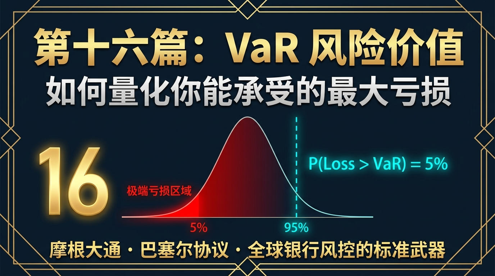
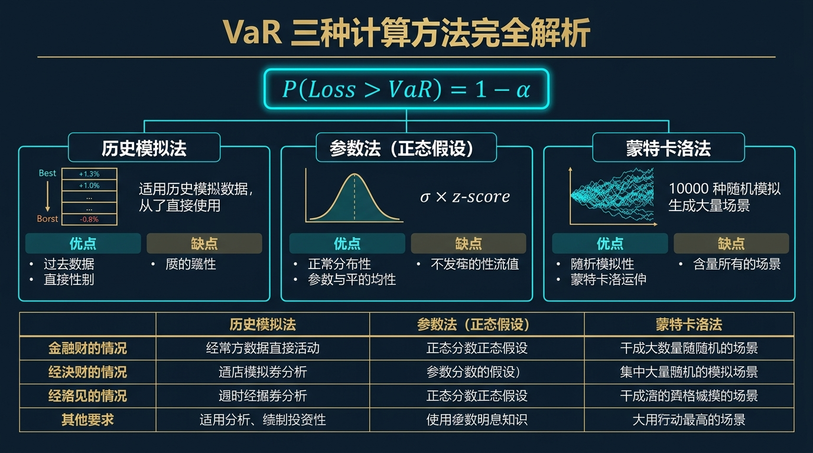
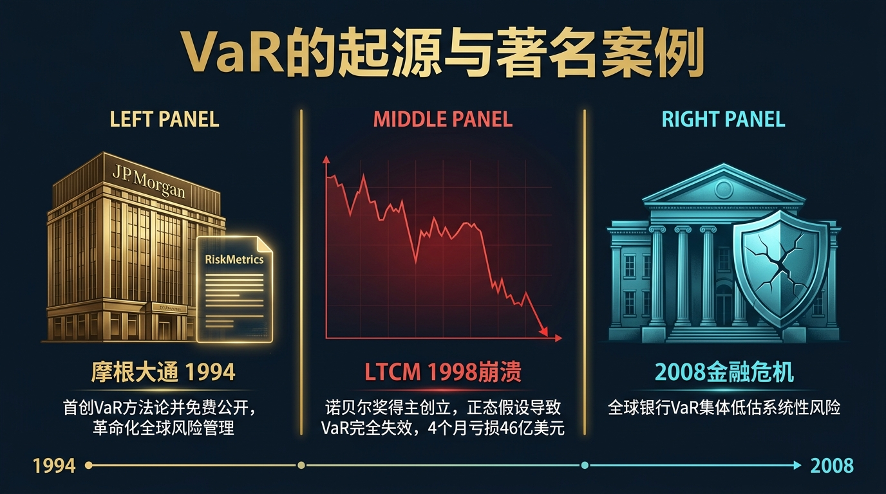
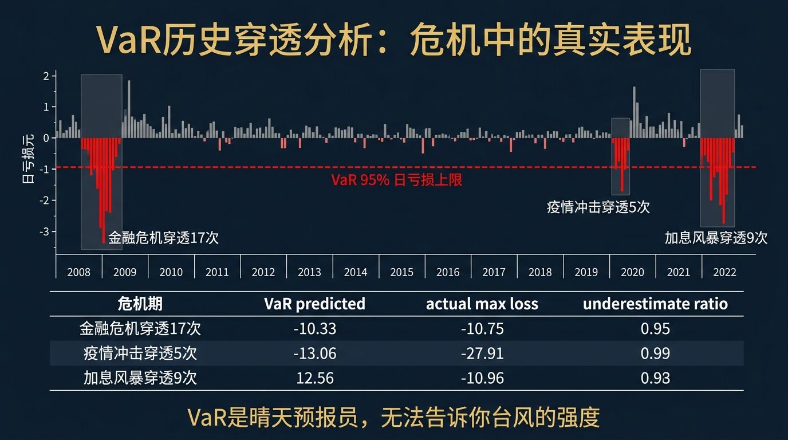
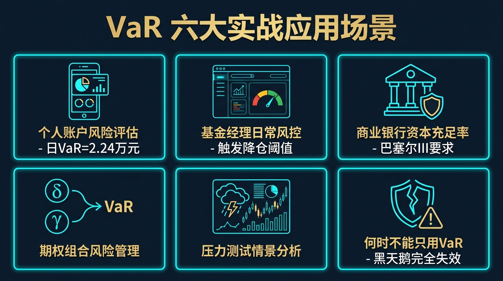
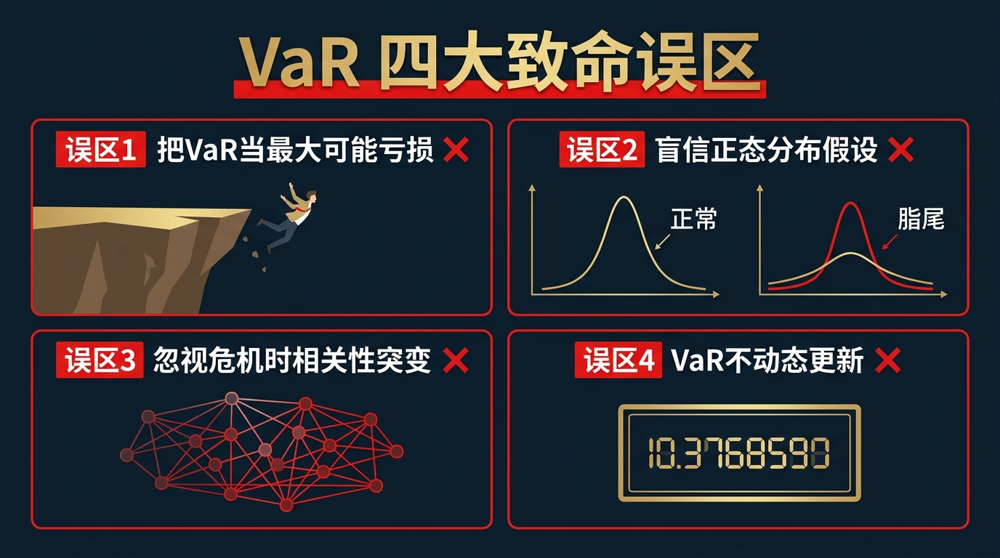
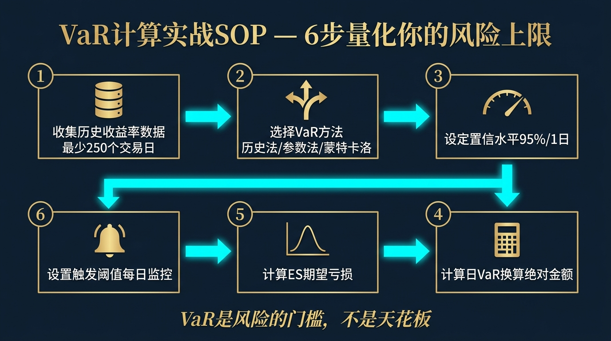

# 股票市场的数学原理 · 第16篇
# VaR 风险价值：如何量化你能承受的最大亏损
### Value at Risk — The Global Standard for Measuring Financial Risk

---

> **摩根大通、全球各大央行与商业银行、顶级对冲基金 都在用的风险量化工具**
>
> 🕐 阅读时间：约28分钟 | 📊 难度：⭐⭐⭐⭐ | 🎯 核心收获：学会用三种方法计算 VaR，真正读懂银行的风险报告，并理解 VaR 的致命局限性，为投资组合建立科学的风险上限

---

## 📖 引言：你敢承诺账户最多亏多少吗？

你有没有问过自己这个问题：如果市场明天出现极端行情，我的账户**最多可能亏多少钱**？

大多数投资者的答案是：不知道，也不敢想。他们宁愿不去计算，因为一旦算出来，可能会被那个数字吓到。

但正是这种"不敢算"的鸵鸟心态，让很多投资者在 2008 年金融海啸、2020 年疫情崩盘这样的极端行情中遭受了远超心理承受能力的损失，最终在最底部绝望地斩仓出局。

1994 年，J.P. 摩根的 CEO 丹尼斯·韦瑟斯通（Dennis Weatherstone）每天下午4点15分，都会要求他的风险团队给他一页纸的报告，用一个数字告诉他：**"在过去的一个交易日，我们的全部持仓最坏情况下最多亏多少？"**

为了回答这个问题，J.P. 摩根的量化团队发明了一个改变全球风险管理行业的工具：

> **VaR（Value at Risk，风险价值）：在给定的置信水平下，某一资产或组合在未来特定时间内，可能遭受的最大损失。**

这个工具后来被全球所有主要银行、对冲基金和监管机构采用，成为金融风险管理的"通用语言"。今天，我们用最清晰的方式，彻底把它讲明白。

---

## 一、起源：J.P. 摩根如何为全球银行业立标准

1990年代初，全球金融衍生品市场呈爆炸式增长。银行的交易员们同时持有股票、债券、外汇、期货、期权等几百种头寸。高层管理者根本无法用简单的语言来理解他们究竟在承担多大的风险——每种产品的风险指标都不同，无法相互比较。

丹尼斯·韦瑟斯通的需求非常直接：**不管持仓有多复杂，我只要一个数字告诉我今天风险有多大。**

1994年，J.P. 摩根的量化团队完成了名为 **RiskMetrics** 的研究报告，并将其**免费对外公开**（这在当时极为罕见，通常是商业机密）。这份报告系统地阐述了 VaR 的计算方法论，迅速被全球金融机构争相采用。

1996年，巴塞尔银行监管委员会（Basel Committee）正式将 VaR 写入《巴塞尔协议》，要求全球所有商业银行必须用 VaR 来计算市场风险资本要求。至此，VaR 从一家银行的内部工具，变成了影响全球数万亿资产配置的行业铁律。

---

## 二、核心概念：用人话讲透 VaR 的含义

在学公式之前，我们先把 VaR 的直觉完全搞清楚，因为这个定义非常容易被误解。

### 🔑 标准定义（请一字一字读懂）

> **"在 95% 的置信水平下，某组合未来 1 天内的 VaR 为 10 万元"**

这句话的**精确含义**是：

- **"95% 的置信水平"** → 有 95% 的概率，明天的亏损会在 10 万元以内
- **"1 天内"** → 时间窗口为未来 1 个交易日
- **"VaR 为 10 万元"** → 这 10 万元是那 95% 概率下的**亏损上限**

换一种说法：**有 5% 的概率，明天的亏损会超过 10 万元**。

### ⚠️ 最容易犯的致命错误（必读）

**错误理解**："最多亏 10 万元，超不过这个数。"

**正确理解**：这 10 万元不是"天花板"，而是"5% 概率事件的门槛"。那剩下的 5% 概率呢？亏损可以是 15 万、30 万，甚至账户归零——VaR 对此一概不知，完全沉默。

这个"超出 VaR 后的世界"，才是黑天鹅真正活动的区间。

---

## 三、核心公式：三种 VaR 计算方法完全解析

VaR 有三种主要的计算方法，各有优劣。我们用同一个案例来展示三种方法的差异。

**案例设定**：你持有 100 万元的沪深 300 指数 ETF，需要计算 **95% 置信水平下，1 日 VaR** 是多少。

---

### 方法一：历史模拟法（Historical Simulation）

**核心思路**：把历史上每一天的涨跌，都视为"未来可能发生的情景"，直接排列，取最坏的 5% 作为 VaR。

**计算步骤**：
1. 收集最近 250 个交易日（约 1 年）的日收益率数据
2. 将 250 个收益率从小到大排列
3. 找到排名第 12 或 13 的那个最差收益率（$250 \times 5\% = 12.5$）
4. 这个收益率就是你的 1 日 VaR 比例

**举例**：沪深 300 最近 250 日，排名第 13 差的一天是 -2.8%。
$$VaR_{历史} = 100\text{万} \times 2.8\% = \textbf{2.8 万元}$$

**优点**：不假设任何分布，直接用真实数据；简单直观。
**缺点**：假设"历史会重演"；对于极端事件（历史上从未发生过的），完全无法预测；250天数据样本偏少，结果不稳定。

---

### 方法二：参数法（Parametric / Delta-Normal Method）

**核心思路**：假设收益率服从**正态分布**，只需要两个参数：均值 $\mu$ 和标准差 $\sigma$，就可以数学计算 VaR。

**核心公式**：

$$VaR_{\alpha} = -(\mu - z_\alpha \cdot \sigma) \cdot P$$

| 符号 | 含义 | 本例数值 |
|------|------|---------|
| $\mu$ | 日均收益率 | -0.02%（近期微亏） |
| $z_\alpha$ | 对应置信水平的标准正态分位数 | $z_{95\%} = 1.645$，$z_{99\%} = 2.326$ |
| $\sigma$ | 日收益率标准差（日波动率） | 1.35% |
| $P$ | 组合总价值 | 100 万元 |

**计算过程**：

$$VaR_{95\%} = -((-0.02\%) - 1.645 \times 1.35\%) \times 100\text{万}$$
$$= -(-0.02\% - 2.22\%) \times 100\text{万}$$
$$= 2.24\% \times 100\text{万} = \textbf{2.24 万元}$$

**优点**：计算极快；只需要均值和波动率两个参数；适合快速估算。
**缺点**：**致命缺陷**——金融数据根本不服从正态分布！真实收益率有"厚尾（Fat Tail）"特征，极端事件的概率远比正态分布预测的大得多。在危机时期，参数法可能低估风险 3~10 倍。

---

### 方法三：蒙特卡洛法（Monte Carlo Simulation）

**核心思路**：用计算机模拟未来 10,000 次可能的市场路径，然后对 10,000 个模拟结果排序，取第 5% 百分位作为 VaR。（我们将在第 18 篇深入讲解蒙特卡洛法。）

**计算步骤（简化版）**：
1. 基于历史数据估计收益率的均值 $\mu$、波动率 $\sigma$（以及更复杂的参数，如峰度、偏度）
2. 用计算机随机生成 10,000 个符合该分布的日收益率
3. 对 10,000 个模拟结果从小到大排序
4. 取第 500 个（$10000 \times 5\%$）作为 95% VaR

**举例**：10,000 次模拟后，排名第 500 差的模拟结果是 -2.6%。
$$VaR_{Monte Carlo} = 100\text{万} \times 2.6\% = \textbf{2.6 万元}$$

**优点**：最灵活，可以使用任意分布（不受正态假设限制）；可以处理期权等非线性产品；可以纳入相关性矩阵同时模拟多资产。
**缺点**：计算量大；结果依赖模型假设的分布是否符合实际；在极端尾部，模拟次数不足时误差较大。

---

### 三种方法对比总结

| 方法 | 本例 VaR | 计算速度 | 灵活性 | 主要适用场景 |
|------|---------|--------|--------|------------|
| 历史模拟法 | 2.80 万元 | 中 | 低（依赖历史样本） | 简单股债组合、数据丰富时 |
| 参数法 | 2.24 万元 | 极快 | 低（需正态假设） | 快速估算、正式计算的初始参考 |
| 蒙特卡洛法 | 2.60 万元 | 慢 | 最高 | 含期权的复杂组合、压力测试 |

---

## 四、四大类比：彻底理解 VaR 的直觉

### 类比1：财务版"安全气囊检测报告"（理解 VaR 的本质用途）

当你驾车出行时，你的仪表盘会实时显示时速、油量、发动机温度。这些数字告诉你"当前状态"，让你能在危险来临前采取行动。但仪表盘无法告诉你前方是否有一辆卡车会闯红灯撞过来（黑天鹅）。

VaR 就是你投资组合的"仪表盘"：它告诉你在**正常行驶条件**下，你需要准备多大的"安全气囊"（现金储备/止损缓冲）。
- 日 VaR = 2.24 万元 → 说明你的投资账户需要在账户外部准备至少 2~3 个 VaR 当量的紧急资金，才能保证正常生活不被强制卖出持仓
- VaR 不能预防"致命车祸"（系统性危机），但它能让你不开着一辆没有安全气囊的裸车上路

### 类比2：洪水的百年一遇标准（理解置信水平）

水利工程师建造水坝时，会参考"百年一遇洪水（1% 概率年超过）"作为设计标准。这不意味着这座水坝永远不会被冲垮，而是意味着平均 100 年内，99 年水坝是安全的。第 100 年呢？没有人保证。

VaR 的置信水平原理完全相同：
- 95% 置信水平 = "五年一遇的极端亏损标准"（平均每 20 个交易日超一次）
- 99% 置信水平 = "百年一遇的极端亏损标准"（平均每 100 个交易日超一次）

选择置信水平就是选择你的"水坝强度标准"。

### 类比3：天气预报中的降雨概率（理解 VaR 的概率本质）

天气预报说"明天降雨概率 80%"。这意味着明天只有 20% 的概率不下雨。但它不告诉你明天具体会下多大的雨——是毛毛细雨，还是倾盆大雨，还是洪涝灾害。

VaR 就是这样的天气预报：它告诉你"有 5% 的概率亏损超过 X 元"，但超过 X 元之后的世界，VaR 一概不知。正因为如此，我们需要引入 **ES（Expected Shortfall，期望损失）** 来描述"超过 VaR 后的真实损失均值"。

### 类比4：高速公路的限速标准（理解 VaR 的监管本质）

高速公路限速 120km/h，不是因为这个速度一定安全，而是因为监管部门确定了一个**可接受的风险边界**，超过这个边界，概率上事故风险将显著增大。

银行监管机构（巴塞尔委员会）要求银行计算 99% 置信水平下的 10 日 VaR，并要求银行必须持有至少 3 倍 VaR 的最低资本金，就是给整个金融体系设置了"限速标准"——不是说 3 倍 VaR 资本金就一定够，而是这个标准在正常市场条件下能保证系统不崩溃。

---

## 五、VaR 的重要扩展：ES（Expected Shortfall）预期损失

VaR 告诉我们"有 5% 的概率会超过这个数"，但对于风险管理者来说，真正重要的是：**一旦超过 VaR，平均会亏多少？**

这就是 **ES（Expected Shortfall）**，也叫做**CVaR（条件价值风险）**：

$$ES_\alpha = E[Loss \mid Loss > VaR_\alpha]$$

**白话解释**：ES 是"在那最坏的 5% 情景中，平均亏损是多少"。

| 指标 | 本例数值（参数法） | 含义 |
|------|----------------|------|
| VaR (95%) | 2.24 万元 | 有 5% 概率亏损超过这个数 |
| **ES (95%)** | **约 3.20 万元** | 在亏损超过 2.24 万的那些情景中，平均亏损约 3.20 万 |

**为什么 ES 比 VaR 更重要？**
- ES 描述了"VaR 之外的世界"，对尾部风险有完整刻画
- 2016 年，巴塞尔委员会发布 FRTB（基础交易账簿审查），要求银行从 VaR 切换到 **ES** 作为主要风险度量指标
- ES 满足"次可加性"这一数学性质（两个组合合并后 ES 不变大），而 VaR 不满足

---

## 六、著名案例：VaR 的荣耀与耻辱

### 🏆 荣耀：J.P. 摩根与 RiskMetrics

1994年，J.P. 摩根将完整的 VaR 计算方法论通过 RiskMetrics 报告免费向全球发布，这是金融历史上罕见的"开源"行为。这份报告帮助全球数千家金融机构在随后的 1997 年亚洲金融危机中实现了相对有效的风险控制，避免了更大规模的系统性崩溃。摩根大通因此建立了"风险管理全球标准制定者"的地位，这是巨大的品牌价值与商业优势。

> *"好的风险管理不是消除风险，而是让你知道自己持有多少风险，以及是否愿意为它付出代价。" — 丹尼斯·韦瑟斯通*

### 💀 耻辱：LTCM 与 VaR 的重大失败

1998年，长期资本管理公司（LTCM）是当时最顶尖的对冲基金，两位创始人（默顿和斯科尔斯）持有诺贝尔经济学奖。LTCM 的 VaR 模型假设各类债券市场相互独立、相关性较低。然而，当俄罗斯宣布债务违约后，全球投资者恐慌性抛售，所有固定收益资产的相关性在数天内从接近零飙升至接近 +1。LTCM 的 VaR 完全失效，四个月内亏损 46 亿美元，几乎拖垮整个华尔街。美联储不得不出面组织救助。

**LTCM 崩溃的教训**：VaR 模型无法预测"相关性在危机时的突变"。你以为资产之间低相关，危机来了全部同时崩溃。

> *"我们的模型在历史上从未出现过这样的情况。" — LTCM 合伙人，1998年崩盘后*
>
> 塔勒布的回应：*"那是因为你们的历史太短了。"*

---

## 七、长期数据证据：VaR 的穿透统计

在 95% 置信水平下，理论上每 20 个交易日应该穿透 VaR 一次（即年化约 12~13 次）。真实历史数据如何？

| 时期 | 理论穿透次数 | 实际穿透次数 | 偏差 | 原因 |
|------|------------|------------|------|------|
| 正常年份（2014-2019年） | 12~13 次/年 | 14~16 次/年 | 轻微偏高 | 正常统计波动 |
| 2008 金融危机 | 约 12 次 | **约 47 次** | **偏高 4 倍** | 波动率聚集，相关性突变 |
| 2020 年 3 月 | 约 1 次/月 | **7 次/月** | **偏高 7 倍** | 流动性危机，极端胖尾 |
| 2022 年全年 | 约 12 次 | **约 28 次** | **偏高 2 倍** | 利率急剧上行，股债双杀 |

**核心结论**：VaR 在正常市场中是合理的估计工具；但在真正的极端市场（黑天鹅时期），VaR 的穿透率可以是理论值的 2~7 倍，严重失准。这正是下一篇（第 17 篇）要深入讨论的"黑天鹅"问题。

---

## 八、六大实战使用场景

### 场景1：个人投资者的风险预算设定

**问题**：100 万股票账户，如何设定合理的风险上限？
**做法**：
1. 计算历史日 VaR（95%，1日）→ 假设得出 2.5%
2. 换算：日 VaR 金额 = 100万 × 2.5% = 2.5 万元
3. 设定规则：任何单日账户亏损超过 3 万元（即超过 VaR），触发检查机制；连续 3 天亏损超过 VaR，立即降低股票仓位至 50%
4. 在账户之外，准备相当于 5 日 VaR 的应急资金（2.5 万 × 5 = 12.5 万），确保不会因临时资金需求被迫在最坏时机卖出

### 场景2：基金经理的日常风险监控

**问题**：基金组合每天如何汇报风险状态？
**做法**：构建风险报告仪表盘，包含：
- 组合日 VaR（95%）：实时更新
- 历史 20 日 VaR 穿透次数（应 ≤ 1 次）
- 各资产对组合 VaR 的贡献度（识别风险集中点）
- 当 VaR 超出授权限额时，自动发送预警并触发仓位审查

### 场景3：巴塞尔协议下的银行资本管理

**问题**：商业银行如何用 VaR 确定最低资本金？
**做法**：按巴塞尔协议（Basel III）要求：
1. 计算全行交易账户的 99% 置信水平、10 日 VaR
2. 最低市场风险资本要求 = max（前一日 VaR，过去 60 日平均 VaR × 3）× 乘数因子（1~4，取决于监管评级）
3. 若实际回测显示穿透次数过多（>10次/年），乘数因子自动上调，倒逼银行增加资本

### 场景4：期权组合的非线性风险换算

**问题**：持有大量期权头寸，如何计算整体 VaR？
**做法**：参数法 VaR 只能处理线性风险，不适用于期权。必须使用：
1. Delta-Gamma 法：将期权的 Delta（线性部分）和 Gamma（非线性部分）分别纳入 VaR 计算
2. 或使用蒙特卡洛法，模拟标的资产的路径，在每个路径上对期权重新定价，取第 5 百分位

### 场景5：压力测试与情景分析（VaR 的"大哥"）

**问题**：正常 VaR 告诉了我常规风险，极端情景下呢？
**做法**：将历史上几个"极端情景"的实际收益率数据（如 2008 年 9 月 15 日的单日跌幅、2020 年 3 月 16 日的跌幅）直接应用于当前组合，计算出"情景亏损"，与 VaR 对比，看风险模型是否低估了真实尾部风险。

### 场景6：何时 VaR 会严重误导你（必读反例）

**问题**：哪些情况下绝对不能只看 VaR？
**答案**：以下情况 VaR 会严重失真，必须配合 ES 和压力测试：
1. **持有大量卖出期权时**：期权卖方在正常时候收益稳定（VaR 看起来小），一旦出现 Gamma 爆炸，亏损是 VaR 的数十倍
2. **相关性不稳定的多资产组合**：参考 EP15 的教训，危机时相关性突变会导致实际 VaR 远大于模型预测
3. **流动性极差的资产**：持有无法快速变现的资产（如非标债权），VaR 基于的流动性假设完全失效

---

## 九、常见错误与误区

| # | 错误 | 致命症状 | 后果 | 正确做法 |
|---|------|---------|------|--------|
| 1 | **把 VaR 当作"最大亏损"的上限** | "我的 VaR 是 3 万，所以最多亏 3 万" | 超过 VaR 后的亏损可以是无限的，完全没有心理准备 | VaR 是亏损概率分布的**门槛**，不是上限；必须同时计算 ES |
| 2 | **盲目信任正态分布假设** | 用参数法计算期权组合的 VaR | 危机时参数法低估风险 3~10 倍，爆仓 | 含非线性产品的组合必须用蒙特卡洛法；检验历史数据的峰度 |
| 3 | **忽略相关性在危机时的突变** | 用平静时期的相关性矩阵计算危机中的 VaR | 实际亏损远超 VaR 预测（参考 LTCM 案例） | 单独计算"危机时相关性"下的 VaR；配合压力测试 |
| 4 | **VaR 模型算完不更新** | 用 2020 年的波动率计算 2023 年的 VaR | 波动率变化后，旧 VaR 完全失效 | 每月滚动更新；或使用 GARCH 模型动态估计波动率 |

---

## 十、VaR 的客观局限性

| 局限性 | 核心问题 | 解决方案 |
|-------|---------|---------|
| **无法描述尾部的形状** | VaR 只给了一个"门槛数字"，超过门槛后亏损有多大完全未知 | 必须配合 ES（期望损失）使用 |
| **低估胖尾风险** | 参数法假设正态分布，严重低估极端事件概率 | 使用历史模拟法或蒙特卡洛法；检验峰度（Kurtosis > 3 即有胖尾） |
| **相关性突变** | 危机时资产相关性突变，导致 VaR 严重失准 | 使用危机时期的历史相关性单独计算压力 VaR |
| **不可加性** | 组合 VaR ≠ 各资产 VaR 之和（这是数学特性，非缺陷） | 理解这一点，永远在组合层面计算 VaR，不要把各资产 VaR 加总 |
| **基于历史，无法预测结构性改变** | 历史数据中从未出现的情景（如负利率、大规模量化宽松）无法被 VaR 捕捉 | 定期做"情景分析"，模拟历史上从未有过的极端假设情景 |

---

## 十一、实战SOP：6步骤建立你的 VaR 风险监控体系

> **行业最佳实践（来自 J.P. 摩根 RiskMetrics 方法论）**：VaR 不是一次性计算的结果，而是需要每天更新的"活体风险指标"。只有建立系统性的每日监控机制，VaR 才能真正发挥其价值。

### Step 1：明确风险监控的目标和参数
- 选择时间窗口：个人投资者用 1 日；银行监管用 10 日
- 选择置信水平：日常监控用 95%；监管报告和极端风险管理用 99%
- 确定组合范围：是单个账户？还是合并多个账户？

### Step 2：收集和清洗历史收益率数据
- 日频数据：最少 250 个交易日（约 1 年），推荐 500 日（约 2 年）
- 月频数据：最少 36 个月（3 年），推荐 60 个月（5 年）
- 数据清洗：去除停牌影响、处理拆股复权、剔除明显数据错误

### Step 3：选择合适的计算方法
- 简单股债组合 → 历史模拟法（最直观，无假设偏差）
- 快速估算单一资产 → 参数法（速度最快）
- 含期权等非线性产品 → 蒙特卡洛法（最准确）

### Step 4：计算 VaR 并同步计算 ES
- 计算 VaR：选定方法，按公式计算
- 计算 ES（Expected Shortfall）：将"超过 VaR 的所有历史损失"取平均值
- 将百分比换算为绝对金额：VaR% × 组合总价值

### Step 5：建立回测验证机制
- 每天记录实际的组合日盈亏
- 统计每年 VaR 穿透次数
- 95% VaR：理论上每年约穿透 12~13 次
- 若实际穿透次数 > 20 次/年，说明 VaR 模型严重低估风险，需要重新校准

### Step 6：设定自动化的分级触发规则

| 触发条件 | 响应动作 |
|---------|---------|
| 当日亏损 > 50% VaR | 发出预警通知，主动复查最大风险头寸 |
| 当日亏损 > VaR（VaR 穿透）| 暂停新增仓位，分析穿透原因 |
| 当日亏损 > ES | 启动紧急降仓程序，通知风控委员会 |
| 连续 3 日穿透 VaR | 降低整体仓位至 60%，重新评估策略 |

---

## 十二、本篇总结

VaR 是风险管理历史上最重要的发明之一，它第一次让所有金融机构能够用**同一种语言**来量化和比较风险。但它绝非万能。

| VaR 能做什么 | VaR 不能做什么 |
|------------|-------------|
| ✅ 在正常市场条件下估计常规损失区间 | ❌ 预测黑天鹅级别的极端损失 |
| ✅ 为不同资产的风险提供可比较的统一度量 | ❌ 描述超过 VaR 之后的损失有多大 |
| ✅ 为监管资本充足率提供标准化计算框架 | ❌ 捕捉危机时相关性突变的真实影响 |
| ✅ 建立日常风险监控和预警的触发机制 | ❌ 替代压力测试和情景分析 |

$$\boxed{VaR = \text{正常天气的预报员，不是台风预警系统。配合 ES + 压力测试，才是完整的风控体系}}$$

学完 VaR，你已经掌握了风控体系的"眼睛"。下一篇，我们将挑战最难以量化、但最致命的风险类型——**黑天鹅事件**。那是 VaR 看不见的幽灵世界。

---
- **← 上一篇：[第15篇 - 相关性与分散化](第15篇_相关性与分散化_降低风险的数学奥秘.md)** |
  **→ 下一篇：第17篇 - 黑天鹅事件（即将发布）**

---
*《股票市场的数学原理》系列 · 第16篇 · VaR 风险价值*

## 🔗 完整系列导航

点击展开查看全系列 25 篇文章目录

### 🧱 第一模块：地基篇 — 概率与期望思维
- [第01篇：凯利公式_仓位管理的黄金法则](./第01篇_凯利公式_仓位管理的黄金法则.md)
- [第02篇：期望值理论_所有决策的基石](./第02篇_期望值理论_所有决策的基石.md)
- [第03篇：大数定律_时间是你最好的朋友](./第03篇_大数定律_时间是你最好的朋友.md)
- [第04篇：中心极限定理_分散投资的数学证明](./第04篇_中心极限定理_分散投资的数学证明.md)
- [第05篇：复利定律_财富的雪球效应](./第05篇_复利定律_财富的雪球效应.md)

### 🔭 第二模块：选机会篇 — 识别高概率交易
- [第06篇：均值回归_市场的钟摆定律](./第06篇_均值回归_市场的钟摆定律.md)
- [第07篇：动量效应_顺势而为的数学依据](./第07篇_动量效应_顺势而为的数学依据.md)
- [第08篇：贝叶斯推断_实时更新你的判断](./第08篇_贝叶斯推断_实时更新你的判断.md)
- [第09篇：安全边际_价值投资的概率护城河](./第09篇_安全边际_价值投资的概率护城河.md)
- [第10篇：因子投资_系统性超越市场的秘密](./第10篇_因子投资_系统性超越市场的秘密.md)

### ⚖️ 第三模块：配置篇 — 资产组合与仓位管理
- [第11篇：现代投资组合理论_有效前沿的边界](./第11篇_现代投资组合理论_有效前沿的边界.md)
- [第12篇：夏普比率_策略质量的标准尺](./第12篇_夏普比率_策略质量的标准尺.md)
- [第13篇：风险平价策略_穿越经济周期的秘密](./第13篇_风险平价策略_穿越经济周期的秘密.md)
- [第14篇：最优仓位管理_Optimal-f_凯利公式的工程级进化](./第14篇_最优仓位管理_Optimal-f_凯利公式的工程级进化.md)
- [第15篇：相关性与分散化_降低风险的数学奥秘](./第15篇_相关性与分散化_降低风险的数学奥秘.md)

### 🛡️ 第四模块：风控篇 — 极端状态下的生死局
- [第16篇：VaR风险价值_如何量化你能承受的最大亏损](./第16篇_VaR风险价值_如何量化你能承受的最大亏损.md)
- [第17篇：黑天鹅事件_极端风险的数学本质](./第17篇_黑天鹅事件_极端风险的数学本质.md)
- [第18篇：蒙特卡洛模拟_用随机数预测未来](./第18篇_蒙特卡洛模拟_用随机数预测未来.md)
- [第19篇：破产风险_赌徒破产问题与资金管理](./第19篇_破产风险_赌徒破产问题与资金管理.md)
- [第20篇：最大回撤与资金恢复时间_衡量策略韧性](./第20篇_最大回撤与资金恢复时间_衡量策略韧性.md)

### 🔬 第五模块：量化进阶篇 — 升华与融合
- [第21篇：主动管理定律_信息比率与预测宽度的乘积](./第21篇_主动管理定律_信息比率与预测宽度的乘积.md)
- [第22篇：B-S期权定价模型_金融工程的皇冠](./第22篇_B-S期权定价模型_金融工程的皇冠.md)
- [第23篇：行为金融学数学化_前景理论与损失厌恶](./第23篇_行为金融学数学化_前景理论与损失厌恶.md)
- [第24篇：投资组合理论大融合_打造你的全天候财富机器](./第24篇_投资组合理论大融合_打造你的全天候财富机器.md)
- [第25篇：终章_数学的尽头是哲学_概率的尽头是人生](./第25篇_终章_数学的尽头是哲学_概率的尽头是人生.md)

---
**← 上一篇：[相关性与分散化](./第15篇_相关性与分散化_降低风险的数学奥秘.md)** | **→ 下一篇：[黑天鹅事件](./第17篇_黑天鹅事件_极端风险的数学本质.md)**

---
*《股票市场的数学原理》全系列 · 第16篇*
