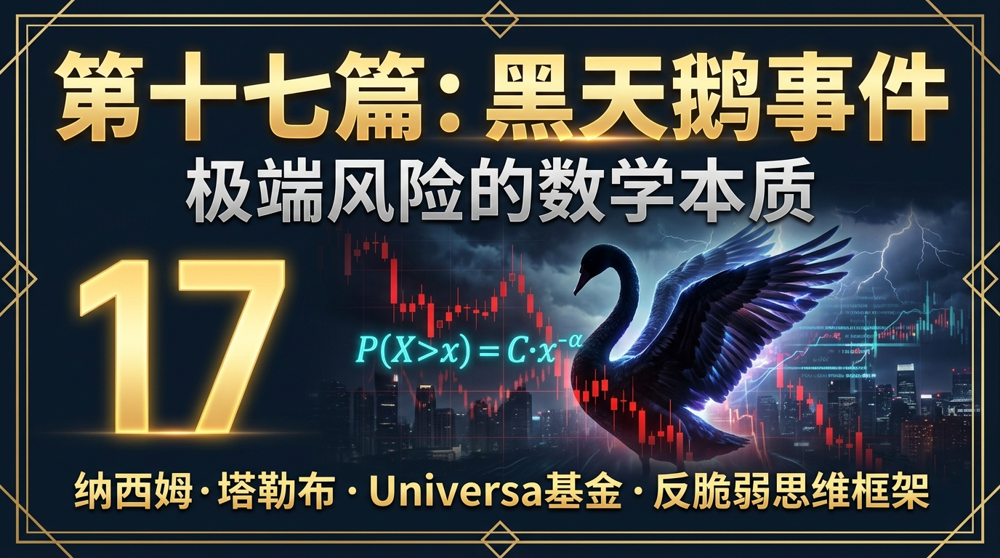
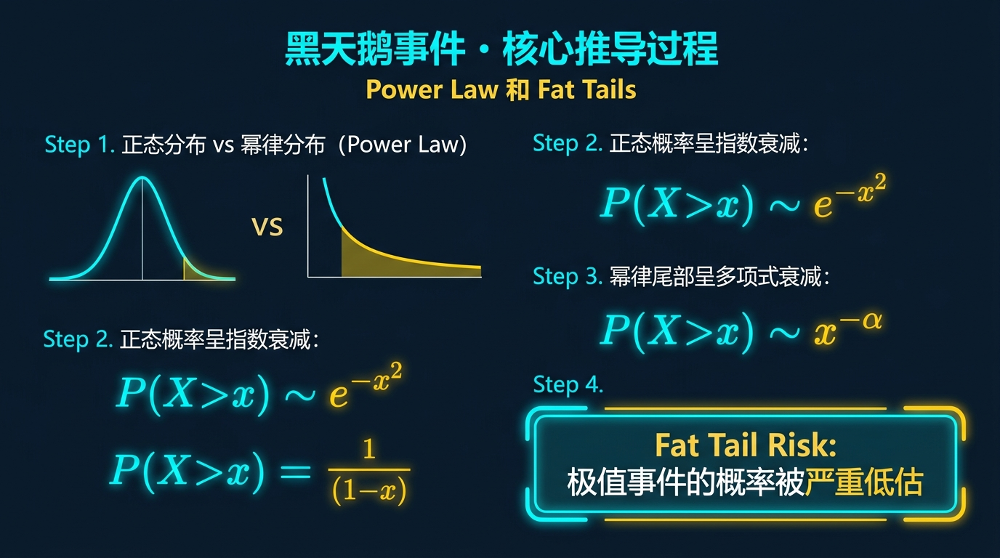
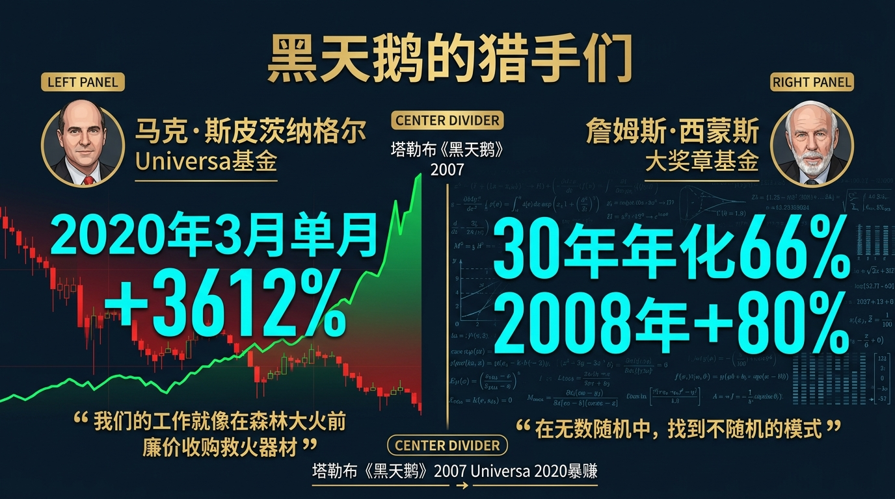
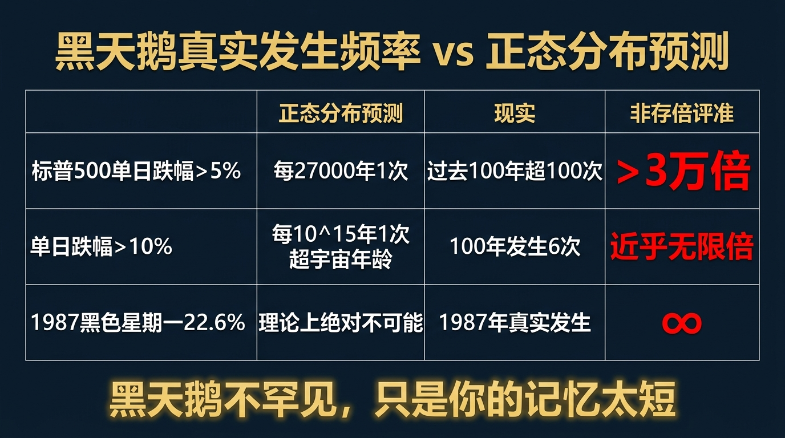
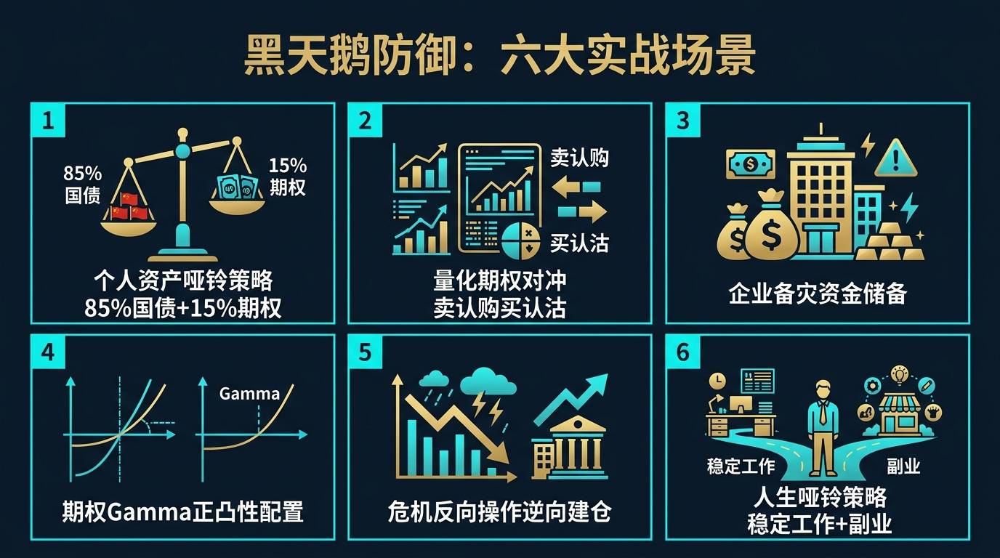
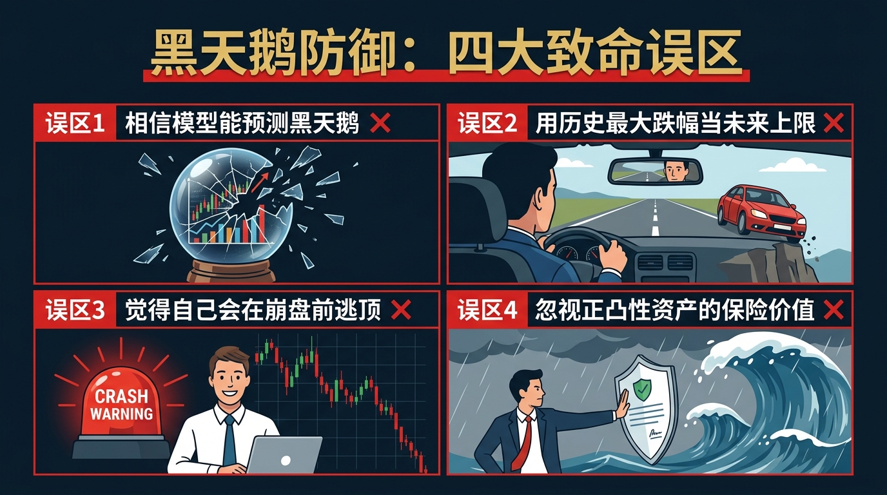
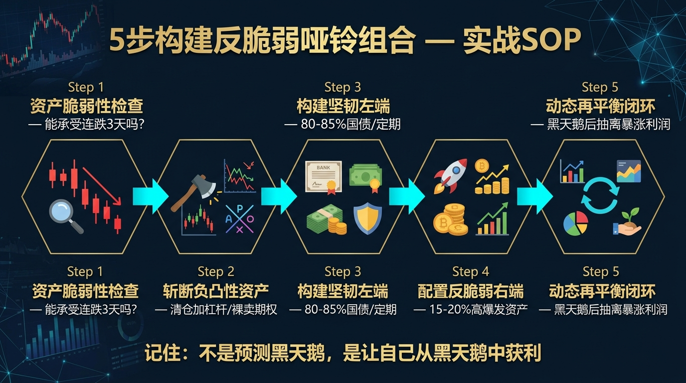

# 股票市场的数学原理 · 第17篇
# 黑天鹅事件：极端风险的数学本质
### Black Swan Events — The Mathematics of the Unpredictable

---

> **纳西姆·塔勒布 · 文艺复兴科技 · Universa基金 都在用的风险思维框架**
> 
> 🕐 阅读时间：约30分钟 | 📊 难度：⭐⭐⭐⭐ | 🎯 核心收获：掌握一套能在市场崩盘中不仅不亏钱、反而能获取暴利的“反脆弱”数学体系

---

## 📖 引言：为什么你的账户总是在某一天被彻底清零？

你有没有经历过这样的投资绝境：
- 辛辛苦苦做价值投资，3年赚了50%，结果某天早上醒来，公司爆出财务造假，连续10个跌停板，利润本金全部归零。
- 做量化网格交易或者卖出期权，每个月都能稳定赚取2%的“睡后收入”，稳了整整2年。但在某次毫无预兆的市场大跌中，仅仅2天就被强制平仓，甚至倒欠券商一笔钱。

这不是因为你的技术不够好，也不是因为你没有做风控。你一定用过止损线，你也一定参考过我们在上一篇讲过的VaR（风险价值）。**这是因为你用的数学模型，从根本上就存在一个致命的哲学错误。**

1998年，一群诺贝尔经济学奖得主用当时最先进的模型管理着LTCM基金，结果在4个月内损失了46亿美元；2008年，华尔街所有的风控计算机都在平稳运行，但雷曼兄弟依然一夜倒塌。专家们事后总是说：“这是百年一遇的事件，模型无法预测。”

但为什么这些“百年一遇”的毁灭性灾难，每隔十年就会精准发生一次？

2007年，一位在华尔街做过期权交易员的哲学家兼数学家，用一本书彻底摧毁了整个现代金融学的风控基础。他告诉你：**灾难之所以降临，是因为你错误地把金融市场当成了正态分布的天堂，而它其实是幂律分布的地狱。**

---

## 一、起源：从一只“不可能”的黑天鹅说起

**2007年**，纳西姆·尼古拉斯·塔勒布（Nassim Nicholas Taleb）在出版其轰动全球的著作《黑天鹅》（The Black Swan）时，讲述了一个跨越千年的生物学隐喻。

在17世纪之前，所有的欧洲人、所有的生物学家，在观察了数以百万计的天鹅之后，得出了一个坚定不移的结论：“所有的天鹅都是白色的。” 这个结论有着极其庞大的历史数据支撑，概率近似于100%。

直到1697年，荷兰探险家威廉·德·弗拉明（Willem de Vlamingh）在澳大利亚的珀斯，看到了世界上第一只**黑天鹅**。

就这一只黑天鹅，瞬间摧毁了欧洲人几千年来基于数百万次观察得出的绝对真理。塔勒布意识到，这不仅仅是生物学现象，这正是金融市场的绝对本质。他在书中定义了黑天鹅事件的三个铁律：
1. **极端稀缺性（Rarity）**：基于过去所有历史数据，它是不可能发生的。
2. **极大冲击力（Extreme Impact）**：一旦发生，它会重塑整个历史和市场格局。
3. **事后可解释性（Retrospective Predictability）**：灾难发生后，人们总会编造出各种理由，认为它“本来是可以预测的”。

这套理论不仅停留于哲学。塔勒布的门徒、华尔街基金经理**马克·斯皮茨纳格尔（Mark Spitznagel）**将这种思维变成了纯粹的量化交易策略。他们创立的 Universa Investments 基金，在 2020年3月新冠疫情引发美股四次熔断时，创造了单月 **+3612%（约36倍）** 的恐怖收益率，成为人类历史上对抗黑天鹅最成功的实践者。

---

## 二、核心公式：揭开真实概率的底牌

传统的金融学教科书，用**正态分布（Gaussian Distribution）**来描述市场的风险。但在塔勒布的理论中，金融市场真正服从的是**幂律分布（Power Law / Pareto Distribution）**，或者叫厚尾分布（Fat Tail Distribution）。

### 🧮 正态分布 vs 幂律分布

正态分布的尾部概率衰减公式为：
$$P(X > x) \approx \frac{1}{x\sqrt{2\pi}} e^{-\frac{x^2}{2}}$$
这是一种**指数级的极速衰减**。随着距离均值越来越远，发生的概率会以极快的速度归零。

但金融市场的真实尾部概率，服从的是**幂律分布公式**：

$$\boxed{P(X > x) = C \cdot x^{-\alpha}}$$

| 符号 | 名称 | 在股票中的意思 | 举例 |
|------|------|-------------|------|
| $P(X > x)$ | 极端概率 | 市场发生超过 $x$ 跌幅的概率 | 单日跌幅超过 10% 的概率 |
| $C$ | 比例常数 | 决定分布的基准水平 | 资产自身的基准波动属性 |
| $x$ | 极端事件规模 | 跌幅的倍数或标准差的大小 | $x = 10$ 代表 10倍波动率的暴跌 |
| $\alpha$ | **尾部指数**（Tail Exponent）| 决定了黑天鹅发生的频繁程度 | $\alpha \approx 3$ 代表典型的股票市场（厚尾） |

### 🎯 两种公式的致命差异

为什么正态分布会害死人？让我们用这两种公式计算一下“单日暴跌 5 个标准差（5σ）”的概率：

- **按照正态分布计算**：概率约为 $0.0000003$。也就是大约每 **13800年** 才会发生一次。
- **按照真实的幂律分布计算**（假设 $\alpha = 3$）：概率约为 $0.005$。也就是大约每 **10个月** 就会发生一次。

正态分布将黑天鹅低估了**成千上万倍**！这就是为什么量化模型在平时运作完美，却在真正的危机来临时瞬间崩溃的数学根因。

### 💡 峰度（Kurtosis）公式（选读）

在统计学中，衡量一个分布“尾巴有多肥”的指标叫峰度：
$$Kurtosis = \frac{E[(X-\mu)^4]}{\sigma^4}$$
正态分布的峰度永远等于 3。但实际上，标普 500 指数日收益率的峰度高达 6~8，而单只股票的峰度甚至超过 20。数字越大，说明分布的大部分方差都是由极少数的“极端黑天鹅天数”贡献的。

---

## 三、四大类比：彻底理解黑天鹅的直觉

为了彻底理解黑天鹅理论，我们需要将其映射到日常生活中。塔勒布给出了极其精妙的类比框架。

### 类比一：火鸡的感恩节（理解历史数据的欺骗性）
一只在农场长大的火鸡，每天都有人类来给它喂食。它是一个“数据科学家”，记录了过去 1000 天的数据，画出了一条完美的向上的信心曲线。根据 1000 天的正态统计，明天它继续被喂食的概率高达 99.99%。
然后，第 1001 天，感恩节到了。屠夫走进来斩下了它的头。
**延伸到投资**：你在 A 股做了一个量化策略，回测了过去 5 年，收益曲线完美无缺。但过去 5 年可能只是这只火鸡的 1000 天，它没有经历过“感恩节”（比如规则突变、系统性去杠杆）。只要环境底座一变，你所有的历史数据不仅无用，反而会给你带来致命的虚假安全感。

### 类比二：中等斯坦 vs 极端斯坦（理解何时正态分布会失效）
塔勒布将世界分为两半：
在“中等斯坦”（比如人的身高），即使是世界上最高的人（2.7米），加入 1000 个普通人的样本中，平均身高也只会被拉高几毫米。在这里，极端个体无足轻重，正态分布有效。
在“极端斯坦”（比如财富分布），如果把比尔·盖茨加入 1000 个普通人的样本中，这 1001 个人瞬间全都变成了亿万富翁（平均意义上）。在这里，一个极端个体决定了整个样本的命运。
**延伸到投资**：股票市场就是最纯粹的极端斯坦。不要相信“平均每天涨 0.1%”，因为市场实际上是“一年 250 天里有 245 天在瞎晃悠，所有的利润和亏损都是由那 5 天极端的暴涨暴跌决定的”。

### 类比三：用玻璃杯接保龄球（理解脆弱性的不对称性）
什么是脆弱？你把一个玻璃杯从桌子上推下去，它摔碎了。这就叫脆弱。玻璃杯极度讨厌波动和意外。
什么是坚韧？你把一个铁砧从桌子上推下去，它毫发无损。铁砧不在乎波动。
什么是反脆弱？想象一种神奇的材料，你把它推下桌子，它不仅没碎，反而因为撞击变得更坚硬，甚至体积变大了一倍。它喜欢意外。
**延伸到投资**：重仓单一股票并加满杠杆，就是玻璃杯（脆弱，一次暴跌就爆仓）。全款买国债，就是铁砧（坚韧，危机时保本）。而“买入股票的虚值认沽期权（看跌期权）”，就是反脆弱材料——平时虽然消耗微小的权利金，但在股灾时它的价值会爆炸性增长 100 倍。

### 类比四：盲人走雷区（理解为什么要放弃预测）
如果你是一个盲人，你需要穿过一片地雷区。
传统风控（VaR）的做法是：请专家用模型计算出雷区里地雷的分布概率，告诉你“向左走 3 步是安全的”。
黑天鹅思维的做法是：承认自己根本看不见地雷在哪，直接买一套最厚的防爆服穿上，然后走过去。
**延伸到投资**：不要花钱去买能够“预测股灾”的软件或报告。股灾不可预测。你应该把精力花在建立一个“即使股灾明天发生，我也不会破产甚至还能赚钱”的资产配置结构上。

---

## 四、实战全流程：构建对抗黑天鹅的“哑铃策略”

塔勒布提出的最著名的实战解决方案，叫做**“哑铃策略”（Barbell Strategy）**。它的核心思想是：放弃中间地带，同时持有极度安全和极度高风险的资产。

### 🎬 场景设定
你是一位拥有 **100万元** 可投资金的个人投资者。当前市场正处于牛市的高潮，你非常担心可能出现未知的“黑天鹅”崩盘。

如果不做防御（全仓股票），一旦崩盘 50%，你将损失 50 万。
如果你全部清仓（全仓现金），一旦市场继续疯狂上涨 50%，你将错过 50 万的利润。

那么，如何用量化思维设计哑铃策略？

### 📊 第一步：分配“极度安全”的左端（保守端）
哑铃的左侧必须是即使发生第三次世界大战也不会违约的资产。
**决策**：将总资金的 **85%（85万元）** 购买短期国债（如货币基金、短债 ETF）。
**计算**：短债年化收益率约为 3%。一年后的确定性收益 = $85万 \times 3\% = 2.55万元$。
**意义**：这确保了在任何黑天鹅下，你的主体本金绝对安全，你已经脱离了“被彻底消灭”的危险。

### 📊 第二步：分配“极度激进”的右端（反脆弱端）
哑铃的右侧必须是具有极大“正凸性（Convexity）”的资产——即风险有明确上限，但收益上限无限的资产。
**决策**：将总资金的 **15%（15万元）** 用于投资高爆发潜力的极早期风投基金，或者长期购买大盘指数的深度虚值看涨/看跌期权（Out-of-the-Money Options）。
**意义**：这部分资金是你准备好“全部亏光”的。你的最大理论损失被死死锁在了 15 万元。

### 📊 第三步：计算黑天鹅发生时的极限损益
| 情景 | 保守端 (85万) 表现 | 激进端 (15万) 表现 | 组合总价值 | 结论 |
|------|--------------------|--------------------|------------|------|
| **情景A：平淡的正常年份** | 赚2.55万 | 权利金全部亏损（-15万） | $87.55万 - 15万 = 72.55万$ | 承担了可控的小幅亏损（约-27%），就像交了保险费。 |
| **情景B：黑天鹅爆发（如大萧条）** | 安全，赚2.55万 | 虚值看跌期权暴涨30倍（+450万） | $87.55万 + 450万 = 537.55万$ | **资产翻了5倍！这就是反脆弱性！** |
| **全仓股票（反例对比）** | 无 | 市场跌-50% | $100万 \times 50\% = 50万$ | 损失惨重，陷入漫长的回本期。 |

通过这种反直觉的配置，你实现了数学上的不对称性：无论发生什么，你的跌幅都被死死锁定，而你的上涨空间是无限的。

---

## 五、著名使用者：这些大佬如何收割黑天鹅

### 🦢 马克·斯皮茨纳格尔（Mark Spitznagel）：将末日变现的男人
- **身份**：Universa Investments 创始人兼首席投资官，塔勒布是其科学顾问。
- **具体做法**：他们的基金专门为客户提供“尾部风险对冲”。他们不断地在市场上买入极其便宜的（通常在正常市场下根本没人要的）深度虚值看跌期权。
- **量化结果**：在 2008 年金融危机中，该基金回报率超过 **100%**；在 2015 年 8 月的全球闪崩中单日狂赚 **10 亿美元**；在 2020 年 3 月新冠疫情引发的熔断月中，基金取得了史无前例的 **+3612%** 回报。
- **原话引用**：
  > *"我们的工作就像是在森林大火前廉价收购救火器材。当大多数人因为灾难而绝望流血时，我们不仅在止血，我们还能买下整座医院。" — Mark Spitznagel*

### 🔢 詹姆斯·西蒙斯（Jim Simons）：文艺复兴的高频降维打击
- **身份**：量化投资之王，大奖章基金创始人。
- **具体做法**：虽然西蒙斯不直接使用哑铃策略，但他抵御黑天鹅的方法是“极限缩短暴露时间”。大奖章基金的平均持仓时间短至几个小时或几天，且永远保持严格的市场中性（多空对冲）。
- **量化结果**：30 年间年化收益率超 66%，在 2000年互联网泡沫破裂和 2008年次贷危机中，他们分别取得了 **+98%** 和 **+80%** 的正收益。
- **应对黑天鹅的数学原理**：黑天鹅通常摧毁的是长期的趋势或基本面逻辑。通过将交易切割为数百万次微秒级别的统计套利，他们让系统脱离了“宏观黑天鹅”的打击范围。

---

## 六、长期表现：数字说明一切

如果黑天鹅真的存在，为什么华尔街的精英们不早点防范？因为在没有黑天鹅的“和平时期”，防范黑天鹅是要付出代价的（买期权的权利金）。让我们看看百年数据的真相。

| 极端事件 | 按正态分布模型计算的理论频率 | 真实市场中的实际发生频率 | 低估倍数 |
|---------|---------------------------|-----------------------|---------|
| **标普500单日跌幅 > 5%** | 约每 27,000 年发生 1 次 | 过去 100 年发生了 **超 100 次** | **> 3万倍** |
| **标普500单日跌幅 > 10%** | 约每 $10^{15}$ 年发生 1 次（超过宇宙年龄） | 过去 100 年发生了 **6 次** | **近乎无限** |
| **道指黑色星期一(-22.6%)** | 绝对不可能发生 | 1987 年发生过 1 次 | **♾️** |

**核心洞见**：
1. **你的风控系统每天都在骗你**：如果你用基于正态分布的 VaR 模型，系统会告诉你“今天发生大跌的概率为零”，因为过去 3 年都没跌过。这就是巨大的安全陷阱。
2. **黑天鹅不罕见，只是你的记忆太短**：大约每 5 到 10 年，金融系统就会必然经历一次毁灭性的重置。如果你不能在那一次事件中存活，你前面 9 年赚的钱毫无意义。

---

## 七、六大实战使用场景

### 场景1：个人资产配置（终极哑铃结构）
- **问题设定**：你是一个中年白领，有 500 万存款，极度害怕中年失业或股市腰斩。
- **参数计算**：不要买“中等风险”的理财产品（比如非标信托、高息 P2P，它们在平时收益微薄，在危机时本金全无）。分配 400万 买纯国债/大额存单，100万 全部投入一个具有爆发潜力的高赔率资产群（如分散买入 10 只高波动的早期科技股）。
- **决策结论**：你的底线是 400 万安全，哪怕 100 万全亏，生活依然继续；但如果 100 万中踩中一只 10 倍股，你就获得了 1000 万。

### 场景2：量化期权策略（反向收割）
- **问题设定**：你是期权交易员，面对平时昂贵的时间损耗（Theta）。
- **参数计算**：平时卖出极度虚值的看涨期权（收取固定权利金，因为股市很难出现瞬间暴涨数十倍的黑天鹅），将赚来的权利金全部用于买入极度虚值的看跌期权（防止向下暴跌的黑天鹅）。
- **决策结论**：利用股市“慢涨快跌”的不对称性，构建一个“零成本”的黑天鹅防御网。

### 场景3：企业供应链管理（冗余思维）
- **问题设定**：你是一家公司的 CEO，为了追求极致的 ROE（净资产收益率），你使用了“零库存”的精益生产模式。
- **参数计算**：在正态分布下，供应商违约概率极低。但在地缘冲突的黑天鹅下，断供 1 天将导致企业破产。
- **决策结论**：主动降低平时的资金效率，增加库存冗余，保留第二供应商。在危机发生时，你的竞争对手全部倒闭，你将接管整个市场。

### 场景4：避免“负凸性”陷阱
- **问题设定**：银行向你推销一款“挂钩股指的雪球结构产品”，承诺年化收益 15%，只要股市不跌破某个敲入线。
- **参数计算**：收益上限死死锁定在 15%（有限的涨幅），但一旦遭遇股灾跌破敲入线，你将承担与股指相同的跌幅（无限的下跌）。
- **决策结论**：立刻拒绝。这是典型的“负凸性”（Concave Payoff）资产，是在出卖你的反脆弱性给机构。

### 场景5：极端压力测试法
- **问题设定**：如何验证自己的投资组合抗黑天鹅能力？
- **参数计算**：不要用“假如市场跌 5%”来测试，而是直接在回测系统中代入：1987年崩盘（单日-20%）、2008年次贷（数月-50%）、2020年疫情（极速-30%）。
- **决策结论**：如果在上述任何一个历史情境中你的账户会触发爆仓，那么你的策略就是垃圾，必须立即降低杠杆。

### 场景6：识破“专家预测”的骗局
- **问题设定**：华尔街著名投行发布报告，预测明年标普 500 指数将达到 5500 点。
- **参数计算**：如果这几年市场极其平稳，投行只是把过去 3 年的平均斜率延长了一点。
- **决策结论**：完全无视任何宏观经济预测。经济是一个极端复杂的混沌系统，其非线性特征决定了长期预测在数学上是不可能的。

---

## 八、常见错误与误区

不要以为知道了黑天鹅，你就能避开它。以下是大多数人在实践中最容易犯的错误：

| # | 错误 | 核心症状 | 后果 | 正确做法 |
|---|------|---------|------|--------|
| 1 | **预测黑天鹅** | 每天看新闻，试图精准猜中下一次崩盘是哪天 | 踏空多年的牛市，消耗大量的摩擦成本 | 放弃预测，承认无知；把精力放在**构建抗打击系统**上 |
| 2 | **误解哑铃策略** | 拿了 50% 去买低风险，剩下 50% 拿去加杠杆赌博 | 当危机来临时，50%的赌注归零，组合重创 | 哑铃的激进端**绝不能超过总资金的 15%-20%** |
| 3 | **事后诸葛亮** | 股灾发生后，说“我早就看出来泡沫要破了，K线图早有显示” | 陷入叙事谬误，导致过度自信，下一次死得更惨 | 承认危机发生前你是不知道的，对市场的不可测保持敬畏 |
| 4 | **盲信高频夏普比率** | 看到一个策略每天稳定赚万分之一，夏普比率高达 5.0 就重仓 | 这是“火鸡策略”，平时稳如老狗，一波黑天鹅直接爆仓 | 永远要看策略的**最大回撤**和**偏度（Skewness）**，警惕左偏分布 |

---

## 九、黑天鹅理论的局限性（诚实的评估）

虽然反脆弱框架极具革命性，但要在现实中执行它，你将面临巨大的挑战：

| 局限性 | 具体表现 | 解决方案 |
|-------|---------|---------|
| **“出血”的心理折磨** | 如果实施尾部对冲（不断买入虚值期权），你会面临连续数年每个月都在“亏损”一点点的折磨（千日砍柴）。 | 将期权费视为一种固定的“安全保险费”，像交车险一样从心理账户中隔离。 |
| **反抗人性的从众压力** | 当别人在牛市高歌猛进赚 100% 时，你的组合可能只赚 40%，你会看起来像个傻子。 | 放弃短期业绩攀比。记住塔勒布的名言：“活得最久的，才是赚得最多的。” |
| **操作门槛极高** | 个人投资者很难精确计算期权的 Theta 损耗，导致买保险的成本过高，最终拖垮整个组合。 | 对普通人而言，用大比例的国债代替复杂的对冲工具，是最简单的反脆弱替代方案。 |
| **可能错过温和的复利** | 哑铃策略由于去除了中间地带，在长达十年的极度平缓上行市场中，收益会严重跑输大盘。 | 这是追求反脆弱必须支付的代价，不要试图既要绝对安全又要超越大盘的暴利。 |

---

## 十、实战SOP：5步骤构建你的反脆弱系统

> **行业最佳实践（Universa Investments 验证）**：不要把时间花在预测雨什么时候下，把时间花在建造诺亚方舟上。

**Step 1：资产清点与压力测试**
拉出你现在所有的持仓。问自己一个问题：如果明天股市直接开盘跌停（-10%）并连续跌三天，我的生活会受影响吗？如果会，说明你处于“脆弱”状态。

**Step 2：斩断负凸性资产（止血）**
立刻清仓所有“收益有限，亏损无限”的资产（如加杠杆的股票、裸卖期权、高息垃圾债、担保贷款）。切断那些能将你一波带走的尾部风险。

**Step 3：构建坚韧的左端（筑墙）**
将 80% ~ 85% 的核心资产，配置在极度安全的标的上（如大型商业银行定期、短期国债、实物黄金）。这部分资产必须与股市波动率完全脱钩。

**Step 4：配置反脆弱的右端（出击）**
用剩下的 15% ~ 20% 资金，去捕捉那些“即使全亏也无所谓，但一旦做对能翻十倍”的机会。比如跌到极点但有基本面支撑的困境反转股、具有爆发潜力的科技龙头、长期的虚值期权。

**Step 5：动态再平衡（闭环）**
当黑天鹅真的发生，右端的激进资产可能暴涨数倍，导致组合比例失衡。此时，卖出暴涨的资产，将利润抽离并转移回左端的安全堡垒中，重新恢复 80/20 的哑铃结构。

---

## 十一、本篇总结

在所有 25 篇文章中，这一篇是唯一不教你如何“计算”的，而是教你如何面对“无法计算”的未知。

| 升级前的思维（传统风控思维） | 升级后的思维（反脆弱思维） |
|----------------------------|--------------------------|
| 努力研究宏观经济，预测下一次股灾什么时候来 | 承认股灾不可预测，直接构建不怕股灾的资产结构 |
| 用过去 5 年的波动率，作为明天风险的参考 | 过去 5 年没地震，不代表明天没地震。历史最大值不是未来最大值 |
| 追求每个月稳定盈利，讨厌任何波动 | 放弃微小的稳定，拥抱波动，利用极端波动创造暴利 |
| 风险管理的目的是“减少损失” | 风险管理的最高境界是“利用混乱实现阶层跃迁” |

最终，你需要把这句话刻在你的交易屏幕上：

$$\boxed{\text{在金融市场中，唯一确定的数学法则，就是极端的小概率事件必然会发生。}}$$

明白了这一点，你就跳出了那个以为“历史永远是线性的”火鸡悲剧。
但在量化领域，除了像塔勒布那样用期权对冲黑天鹅，还有没有别的方法，能够利用计算机的算力，强行把未来的无数种可能给“穷举”出来呢？

下一篇，我们将从抽象的哲学，回归硬核的计算机算法——**蒙特卡洛模拟（Monte Carlo Simulation）**。看看量化基金是如何用 10000 次随机抛硬币，在多维空间中勾勒出财富的真实概率云图的。

## 🔗 完整系列导航

点击展开查看全系列 25 篇文章目录

### 🧱 第一模块：地基篇 — 概率与期望思维
- [第01篇：凯利公式_仓位管理的黄金法则](./第01篇_凯利公式_仓位管理的黄金法则.md)
- [第02篇：期望值理论_所有决策的基石](./第02篇_期望值理论_所有决策的基石.md)
- [第03篇：大数定律_时间是你最好的朋友](./第03篇_大数定律_时间是你最好的朋友.md)
- [第04篇：中心极限定理_分散投资的数学证明](./第04篇_中心极限定理_分散投资的数学证明.md)
- [第05篇：复利定律_财富的雪球效应](./第05篇_复利定律_财富的雪球效应.md)

### 🔭 第二模块：选机会篇 — 识别高概率交易
- [第06篇：均值回归_市场的钟摆定律](./第06篇_均值回归_市场的钟摆定律.md)
- [第07篇：动量效应_顺势而为的数学依据](./第07篇_动量效应_顺势而为的数学依据.md)
- [第08篇：贝叶斯推断_实时更新你的判断](./第08篇_贝叶斯推断_实时更新你的判断.md)
- [第09篇：安全边际_价值投资的概率护城河](./第09篇_安全边际_价值投资的概率护城河.md)
- [第10篇：因子投资_系统性超越市场的秘密](./第10篇_因子投资_系统性超越市场的秘密.md)

### ⚖️ 第三模块：配置篇 — 资产组合与仓位管理
- [第11篇：现代投资组合理论_有效前沿的边界](./第11篇_现代投资组合理论_有效前沿的边界.md)
- [第12篇：夏普比率_策略质量的标准尺](./第12篇_夏普比率_策略质量的标准尺.md)
- [第13篇：风险平价策略_穿越经济周期的秘密](./第13篇_风险平价策略_穿越经济周期的秘密.md)
- [第14篇：最优仓位管理_Optimal-f_凯利公式的工程级进化](./第14篇_最优仓位管理_Optimal-f_凯利公式的工程级进化.md)
- [第15篇：相关性与分散化_降低风险的数学奥秘](./第15篇_相关性与分散化_降低风险的数学奥秘.md)

### 🛡️ 第四模块：风控篇 — 极端状态下的生死局
- [第16篇：VaR风险价值_如何量化你能承受的最大亏损](./第16篇_VaR风险价值_如何量化你能承受的最大亏损.md)
- [第17篇：黑天鹅事件_极端风险的数学本质](./第17篇_黑天鹅事件_极端风险的数学本质.md)
- [第18篇：蒙特卡洛模拟_用随机数预测未来](./第18篇_蒙特卡洛模拟_用随机数预测未来.md)
- [第19篇：破产风险_赌徒破产问题与资金管理](./第19篇_破产风险_赌徒破产问题与资金管理.md)
- [第20篇：最大回撤与资金恢复时间_衡量策略韧性](./第20篇_最大回撤与资金恢复时间_衡量策略韧性.md)

### 🔬 第五模块：量化进阶篇 — 升华与融合
- [第21篇：主动管理定律_信息比率与预测宽度的乘积](./第21篇_主动管理定律_信息比率与预测宽度的乘积.md)
- [第22篇：B-S期权定价模型_金融工程的皇冠](./第22篇_B-S期权定价模型_金融工程的皇冠.md)
- [第23篇：行为金融学数学化_前景理论与损失厌恶](./第23篇_行为金融学数学化_前景理论与损失厌恶.md)
- [第24篇：投资组合理论大融合_打造你的全天候财富机器](./第24篇_投资组合理论大融合_打造你的全天候财富机器.md)
- [第25篇：终章_数学的尽头是哲学_概率的尽头是人生](./第25篇_终章_数学的尽头是哲学_概率的尽头是人生.md)

---
**← 上一篇：[VaR风险价值](./第16篇_VaR风险价值_如何量化你能承受的最大亏损.md)** | **→ 下一篇：[蒙特卡洛模拟](./第18篇_蒙特卡洛模拟_用随机数预测未来.md)**

---
*《股票市场的数学原理》全系列 · 第17篇*
