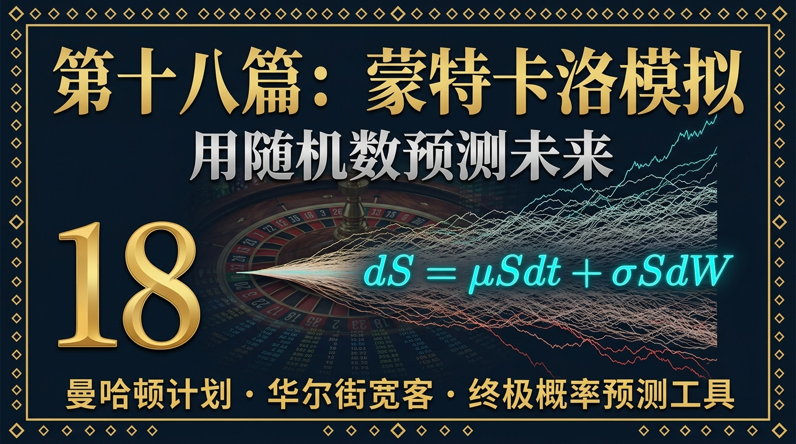
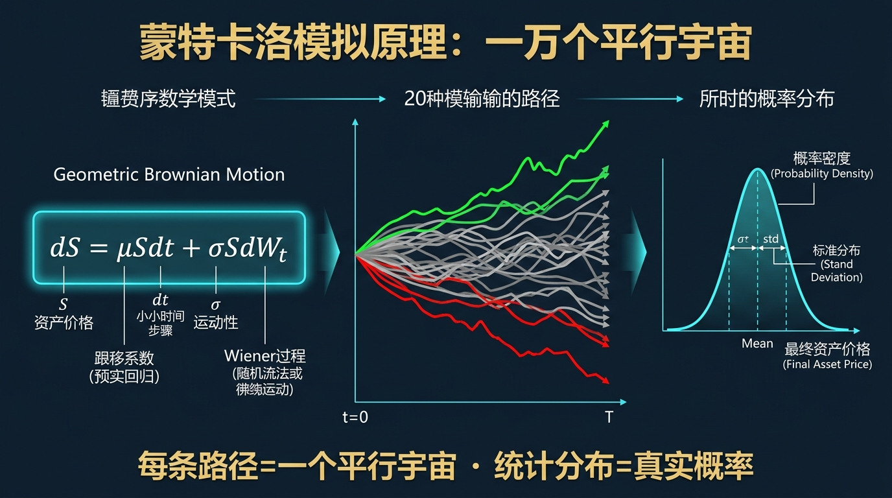
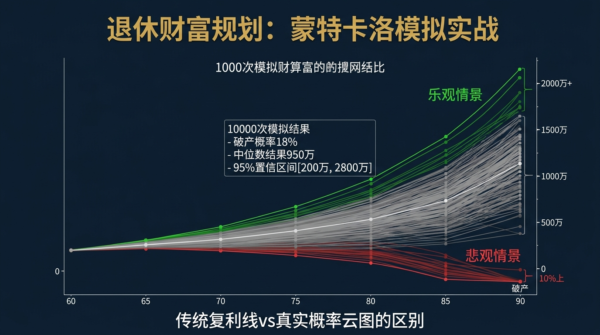
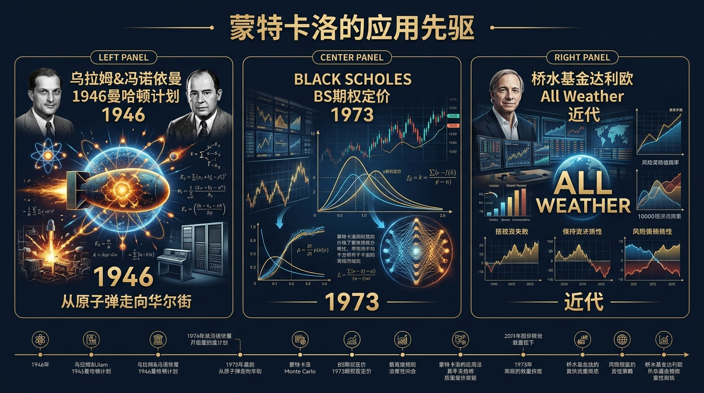
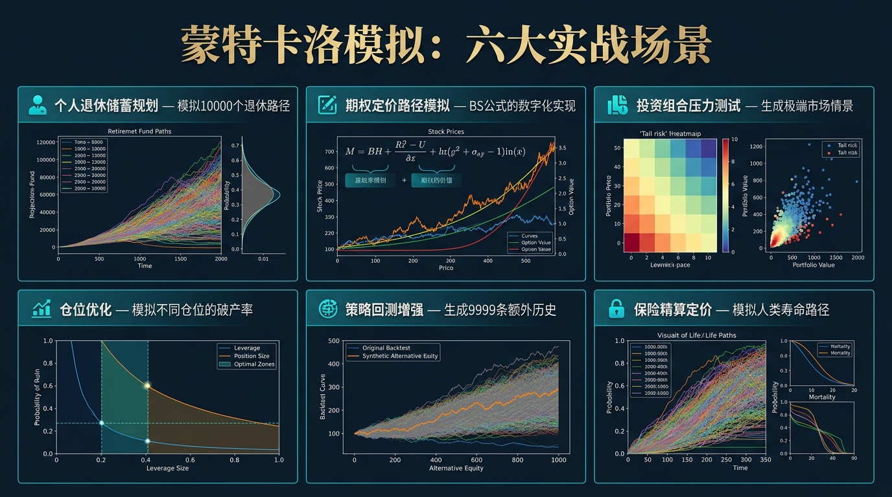
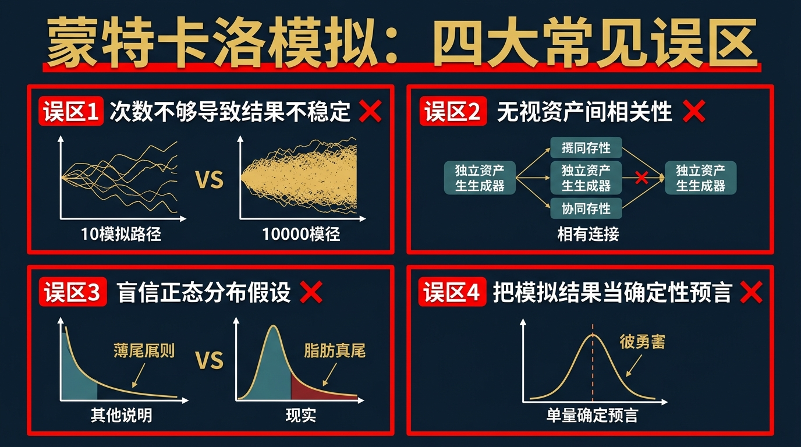
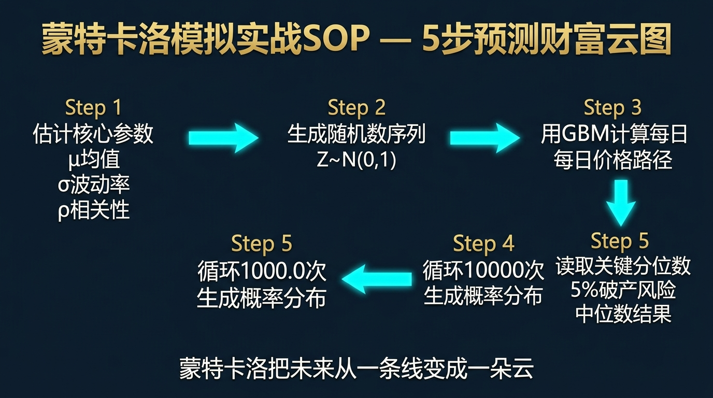

# 股票市场的数学原理 · 第18篇
# 蒙特卡洛模拟：用随机数预测未来
### Monte Carlo Simulation — Forecasting the Future with Randomness

---

> **华尔街风控官 · 曼哈顿计划科学家 · 顶级期权交易员 都在用的终极预测工具**
> 
> 🕐 阅读时间：约30分钟 | 📊 难度：⭐⭐⭐⭐ | 🎯 核心收获：掌握如何利用计算机生成的一万种“平行宇宙”，精准量化那些根本无法用单一公式计算的复杂风险。

---

## 📖 引言：未来不是一条线，而是一团云

当散户投资者规划自己未来的财富时，通常使用一条笔直向上的“复利曲线”。
比如：你现在有 100 万，如果你能做到每年 10% 的复利，30 年后你就会拥有 1744 万。

这个计算在数学上绝对正确，但在真实市场中**绝对致命**。
真实市场永远不会按照每年精准 10% 的速度匀速上涨。它可能第一年跌 30%，第二年涨 50%，或者在你要退休的前一年突然腰斩。
如果在投资初期遭遇大跌（即“收益序列风险”，Sequence of Returns Risk），就算你 30 年的**平均收益率**依然是 10%，你的真实资产规模可能只有几百万，甚至因为途中恐慌抛售而彻底破产。

**“平均值”是一个谎言。单一路径的历史回测也是一个谎言。**

如何才能知道你在 30 年后到底会不会破产？真实答案只有上帝知道。但既然我们不是上帝，我们就需要创造一万个“平行宇宙”，看看在这一万个宇宙里，有多少次你成为了千万富翁，又有多少次你流落街头。

这就是量化金融领域最伟大的核武器——**蒙特卡洛模拟（Monte Carlo Simulation）**。

---

## 一、起源：从原子弹到轮盘赌

**1946年**，第二次世界大战刚刚结束。在洛斯阿拉莫斯国家实验室（曼哈顿计划的核心地带），天才数学家**斯塔尼斯拉夫·乌拉姆（Stanislaw Ulam）**正在病床上休养。

无聊之际，他玩起了“单人纸牌”游戏（Solitaire）。他想计算一下：单人纸牌完全解开的概率到底是多少？
如果用传统的排列组合数学公式来推导 52 张牌的所有可能性，计算量大到即使是当时最聪明的大脑也无从下手。

乌拉姆突然灵光一闪：“为什么我要用公式算？如果我手里有一台能够光速洗牌的机器，我只要让它连续玩 10,000 局纸牌，然后数一数有多少局赢了。这个统计出来的赢率，不就是数学上的真实概率吗？”

他立刻把这个想法告诉了另一位超级天才——计算机之父**约翰·冯·诺依曼（John von Neumann）**。冯·诺依曼立刻意识到，这个“通过大量随机试验来逼近复杂数学答案”的方法，不仅能算纸牌，还能用来计算原子弹爆炸时中子的复杂扩散路径！

由于这个方法的核心机制是“随机抽样”，就像赌场里的轮盘赌一样，他们借用了欧洲最著名的赌城——摩纳哥的**蒙特卡洛大赌场（Monte Carlo Casino）**，将这种革命性的算法正式命名为“蒙特卡洛方法”。

半个世纪后，华尔街的宽客（Quants）们发现：股票价格的随机波动，和核反应堆中中子的随机碰撞，在数学本质上是一模一样的。于是，蒙特卡洛从物理实验室，正式走入了全球金融的神经中枢。

---

## 二、核心公式：解构随机游走的数学引擎

蒙特卡洛模拟本身不是一个单一的公式，而是一种**通过海量随机采样计算概率分布**的方法。在股票市场中，我们要模拟未来的股价路径，最核心的引擎就是**几何布朗运动（Geometric Brownian Motion, GBM）**的随机微分方程：

$$\boxed{dS_t = \mu S_t dt + \sigma S_t dW_t}$$

这看起来像天书，但我们把它拆解成人类能看懂的语言。简单来说，股价明天的变化（$dS_t$）由两部分组成：

| 符号 | 名称 | 现实物理意义 | 在股票中的意思 |
|------|------|-------------|--------------|
| $dS_t$ | 价格变动 | 下一步走到哪里 | 股票在下一秒或下一天的涨跌幅 |
| $\mu S_t dt$ | **漂移项**（Drift） | 河流的水流速度 | 股票长期的内在增长率（比如每年8%的预期回报），这是确定性的向上推力。 |
| $\sigma$ | **波动率**（Volatility） | 水面的颠簸程度 | 股票历史波动的剧烈程度。越高代表越像过山车。 |
| $dW_t$ | **维纳过程**（随机冲击） | 水中花粉的无规则碰撞 | 每天发生的随机事件（利好/利空）。它服从均值为0、方差为dt的正态分布随机数 $\epsilon \sim N(0,1)$。 |

### 🛠️ 转换为可以在Excel或Python里计算的离散公式：

$$S_{t+1} = S_t \times \exp\left( (\mu - \frac{\sigma^2}{2})\Delta t + \sigma \epsilon \sqrt{\Delta t} \right)$$

每次计算明天的价格 $S_{t+1}$，计算机都会掷一次骰子，生成一个随机的 $\epsilon$。
- 如果骰子掷出极大正数（超级利好），价格暴涨。
- 如果掷出极大负数（超级利空），价格暴跌。
计算机连续掷 250 次骰子，就生成了这一年的一条模拟K线。
当计算机重复这个过程 10,000 次，你就拥有了这只股票未来的 10,000 种可能的剧本！

---

## 三、四大类比：彻底理解蒙特卡洛直觉

### 类比一：预测天气（如何确定降雨概率？）
气象局告诉你“明天有 80% 的概率下雨”。他们是怎么算出来的？
气象学家无法用一个完美的公式精确预测大自然的每一个分子运动。因此，他们将当前的温度、风向、湿度输入超级计算机。但因为测量总有微小的误差，他们会在输入中加入几十种微小的**随机扰动**，然后运行计算机模型 1000 次。
如果这 1000 次虚拟未来中，有 800 次明天的这片云层下雨了，他们就会向公众播报：降雨概率 80%。这正是最典型的蒙特卡洛应用。

### 类比二：扔飞镖算圆周率（暴力美学计算法）
你想计算圆周率 $\pi$ 但忘记了公式。怎么办？
你在一个正方形靶子上画一个内切圆。然后你蒙上眼睛，随机向靶子扔 10000 支飞镖。
因为：落在圆内的飞镖数 / 总飞镖数 ≈ 圆的面积 / 正方形面积 = $\frac{\pi r^2}{(2r)^2} = \frac{\pi}{4}$。
所以：$\pi \approx 4 \times (\text{落在圆内的数量} / 10000)$。
你不需要知道复杂的微积分，你只需要有足够多的时间去“盲目地扔飞镖”。在量化金融中，“扔飞镖”就是用 CPU 算力强行暴力穷举所有的可能性。

### 类比三：玩大富翁游戏（为什么需要模拟？）
大富翁游戏的规则明确，每次掷两枚骰子。假设你想知道：“在第 10 轮时，停在‘地中海大道’的概率是多少？”
如果用纸笔画概率树，第 10 轮的分支数量将达到天文数字（$36^{10}$），人类永远算不完。
但如果你写一行代码，让电脑自动帮你玩 10 万盘大富翁游戏，统计第 10 轮停在地中海大道的次数。只需 2 秒钟，你就能得到无限逼近真实的精准概率。

### 类比四：薛定谔的猫（未来的不确定性云图）
在打开箱子之前，薛定谔的猫处于“既死又活”的叠加态。
同样的，在你真正退休之前，你的股票账户处于“既是千万富翁又是破产流浪汉”的概率叠加态。蒙特卡洛模拟就是把这种不可见的“概率云图”，变成了你可以看见的、有颜色的 10,000 条轨迹线，让你清晰地看到那 5% “死猫”的惨烈结局。

---

## 四、实战全流程：构建你的个人退休资产模拟

为了展示蒙特卡洛的强大威力，我们用 Python 为一位普通中产家庭做一个**退休资产压力测试**。

### 🎬 场景设定
- **小王，30岁**，当前拥有 **100 万元** 可投资股票资产。
- 他计划在 **30年** 后（60岁）退休。
- **投资标的**：标普500指数基金。
  - 历史长期年化漂移收益率（$\mu$）：约 **8%**。
  - 历史长期年化波动率（$\sigma$）：约 **16%**。
- **他的动作**：他不取钱，只是放在里面随波逐流 30 年。

如果用直线复利计算器算：
$100万 \times (1 + 8\%)^{30} = \textbf{1006万元}$。
看起来稳拿 1000 万，高枕无忧？真的是这样吗？

### 💻 第一步：用蒙特卡洛模拟生成 10,000 种平行宇宙
我们让计算机用几何布朗运动的公式，生成 10,000 条 30 年后的资产轨迹。其中加入了每年 16% 波动率的随机正态分布冲击。

### 📊 第二步：提取概率分布统计结果
计算机跑完 10,000 次后，给出的 30 年后资产终值分布绝不是只有 1006 万这一个数字，而是呈现出极其宽广的厚尾分布（对数正态分布）：

| 概率分位线 | 资产结局 | 代表什么宇宙？ | 对你的现实意义 |
|-----------|---------|---------------|--------------|
| **Best 5% (运气极佳)** | **3,500万以上** | 这个宇宙里经历了两次类似90年代和10年代的大牛市。 | 暴富，财富自由游艇退休。 |
| **Median 50% (中位数)** | **820万元** | 一半的平行宇宙超过这个数，一半低于这个数。 | **注意！中位数远低于理论复利值的 1006 万！** 因为波动率会造成“波动拖累（Volatility Drag）”。 |
| **Worst 10% (运气极差)** | **240万元** | 这个宇宙里你赶上了类似日本失去的30年，或者大萧条。 | 仅仅勉强抵御了30年的通货膨胀，退休生活拮据。 |
| **Worst 1% (地狱模式)** | **80万元以下** | 多次发生黑天鹅危机，且发生在复利后期的庞大本金上。 | 30年过去，**本金不仅没涨反而亏损**。老无所依。 |

### 💡 核心洞见与决策调整
蒙特卡洛模拟告诉你：虽然期望值是 1000 万，但你有 **10% 的极大概率**，在 30 年后连 250 万都不到！
**量化调整行动**：
如果 250 万无法支撑你的晚年，你必须修改策略。通过在蒙特卡洛中加入“股债 60/40 配置”（降低收益预期至 6%，但大幅降低波动率至 9%），重新模拟。虽然中位数降到了 570 万，但最差 10% 的保底金额提升到了 320 万。这就用降低上限的代价，切断了最底部的尾部风险。

> *这就是金融机构（如 Wealthfront, 嘉信理财）为高净值客户做退休规划时底层使用的真正算法。*

---

## 五、著名使用者：顶级实践者案例

### ☢️ 斯塔尼斯拉夫·乌拉姆 & 约翰·冯·诺依曼
- **身份**：蒙特卡洛算法的联合发明者。
- **实战应用**：在制造人类第一颗原子弹时，需要计算中子在铀球中裂变反应时的逃逸概率和穿透深度。既然方程无法解析，他们使用世界上第一台通用计算机 ENIAC，通过生成大量伪随机数，成功暴力破解了链式反应的临界质量。

### 🏦 华尔街各大投行风险控制部
- **身份**：摩根大通、高盛等顶级机构的风控中枢。
- **实战应用**：每天收盘后，高盛的超级计算机集群会通宵运转，对其庞大无比的全球衍生品投资组合进行蒙特卡洛模拟。在注入无数种汇率、利率、股票暴跌的随机种子后，强行计算出第二天极大概率会亏损的最大金额（模拟历史型 VaR 的升级版：蒙特卡洛 VaR）。一旦发现有 1% 的宇宙会导致银行破产，第二天开盘立刻要求相关部门强制平仓。

### 📊 顶级期权做市商（Options Market Makers）
- **身份**：为整个市场提供流动性的神秘交易员。
- **实战应用**：在面对极其复杂、具备多重行权条件的奇异期权（Exotic Options，例如亚洲期权、障碍期权）时，诺贝尔奖级别的 B-S 公式都会失效。他们唯一能给复杂期权精准定价的方法，就是模拟出标的资产 100 万条未来的波动路径，计算每条路径下的收益，然后折算成今天的均价。这就是现代衍生品定价的终极标尺。

---

## 六、长期表现：为什么它碾压传统的回测？

所有的散户都会做历史回测（Backtesting）：用过去 10 年的历史 K 线，跑一遍自己的均线交叉策略，如果赚了 300%，就以为找到了圣杯。

但历史回测最大的谎言在于：**过去发生的那条历史轨迹，仅仅是无限多条平行宇宙中，恰好在现实中兑现的“那一条”而已。**

历史是偶然的。
- 假如 2008 年雷曼兄弟没有倒闭，而是被美国政府提前救助了呢？
- 假如 2020 年新冠没有爆发呢？
如果你只拟合那唯一的一条“既定历史”，你的策略将**极度过拟合（Overfitting）**，当未来走出另一条平时没有见过的随机路径时，你的策略会立刻崩溃。

蒙特卡洛模拟的长期优势在于，它不仅测了已经发生的“真实历史”，它还利用数据的波动率特征，凭空生成了 9999 条**“历史上未曾发生，但在统计学上完全有可能发生”的替代历史（Alternative Histories）**。
一个只有在这 10,000 条路径中，能存活 9,900 次以上的策略，才敢被称为真正有“韧性”的量化策略。

---

## 七、六大实战使用场景

1. **复杂衍生品定价**：当 B-S 期权公式因为数学条件受限无法解析时，蒙特卡洛模拟是唯一能够对各种复杂障碍期权、亚式期权进行定价的工具。
2. **极端压力测试 (Stress Testing)**：人为注入黑天鹅参数（如令市场波动率 $\sigma$ 突然放大 300%），观察你的量化网格或马丁格尔策略会在第几步被拉爆。
3. **资金管理与破产概率计算**：如果你有 60% 的胜率和 1.5 的盈亏比，模拟连续交易 1000 次，在不同的仓位比例下（5%、10%、30%），你的账户触及破产线（归零）的真实百分比。
4. **退休金长期提现测试**：著名的“4%法则”（每年提取投资组合的4%用于生活）是否真的安全？通过蒙特卡洛模拟可以验证，在遭遇糟糕的初始年份时，4%依然有较高概率让你在死前钱被花光。
5. **项目估值与企业并购**：放弃使用单一固定的 DCF（现金流折现）表格，而是把未来的营收增长率设为一个有波动的随机正态分布区间，从而给出一个更客观的公司估值区间带。
6. **加密货币挖矿收益评估**：比特币难度调整、币价波动与电费是多重随机变量，通过多变量蒙特卡洛，可以计算回本周期的概率分布图。

---

## 八、常见错误与误区：垃圾进，垃圾出

使用这把核武器如果不懂原理，会导致比不用更惨烈的灾难。

| # | 致命错误 | 核心症状 | 毁灭性后果 | 正确姿势 |
|---|----------|---------|------------|---------|
| 1 | **Garbage in, Garbage out (GIGO)** | 随意假设输入参数。比如硬性假设美股未来的漂移率 $\mu$ 高达 15%。 | 计算机诚实地用错误的 15% 模拟出了极为乐观的破产率为零的结果。你满仓杠杆，最终爆仓。 | 参数必须基于保守的长周期历史数据，甚至进行压力折让。 |
| 2 | **错误的正态分布假设** | 在构建随机数 $\epsilon$ 时，盲目使用标准正态分布。 | 就像我们在第17篇黑天鹅中所讲，完全低估了尾部崩盘的概率。模拟出来的世界过于“岁月静好”。 | 使用具备厚尾特征的分布（如学生 t 分布或包含跳跃的泊松扩散模型）。 |
| 3 | **无视多资产的相关性** | 模拟股债组合时，把股票随机发生器和债券随机发生器完全独立运行。 | 在真实的金融危机中（如2020和2022年），股债常常齐跌，相关性会飙升到近乎1。忽视相关性会导致高估分散投资的保护力。 | 必须引入**协方差矩阵（Covariance Matrix）**和乔莱斯基分解，确保随机数之间具有联动性。 |
| 4 | **模拟次数过少** | 为了省电脑算力，只运行了 100 次模拟。 | 大数定律尚未生效，结果极度不稳定，每次跑出来的中位数都不一样。 | 对于尾部风险评估，模拟次数通常不少于 10,000 次。 |

---

## 九、蒙特卡洛的局限性（诚实的评估）

| 局限性 | 具体表现 | 应对方案 |
|-------|---------|---------|
| **极高的算力成本** | 如果投资组合包含几千只期权和上百种相关资产，模拟 10万次 可能会让一台顶配电脑运行几小时。 | 使用云计算集群（AWS/阿里云），以及引入“方差缩减技术（Variance Reduction）”如控制变量法。 |
| **黑天鹅盲区** | 蒙特卡洛模拟生成的所有“灾难”，依然被框死在你输入的历史 $\sigma$ 波动率之中。它无法凭空想象出一种彻底颠覆历史规律的新型危机。 | 蒙特卡洛只能用来量化“已知的未知”，对于“未知的未知”（纯粹的黑天鹅），必须搭配期权等反脆弱工具（参考上一篇）。 |
| **路径依赖陷阱** | 在有些复杂的网格交易模型中，模拟的代码如果不够精细，会漏掉盘中瞬间熔断穿仓的毫秒级细节。 | 除了日K级别的模拟，对高频策略必须进行分钟级别甚至Tick级别的数据切片模拟。 |

---

## 十、实战SOP：5步搭建你的预测引擎

如果你懂一点 Python 或哪怕只会用 Excel，只需以下 5 步即可跑出你的第一张预测图：

1. **定义目标与时间**：明确你要算什么（如：10年后本金剩余概率）。确定时间步长 $dt$（如每天，每年）。
2. **提取历史参数**：从你的交易记录或指数历史中，计算出历史年化收益率 $\mu$ 和 历史年化波动率 $\sigma$。
3. **编写随机游走引擎**：使用几何布朗运动公式 $S_{t+1} = S_t \times e^{...}$，让程序生成从第 1 天到第 N 天的价格序列。
4. **大循环 10,000 次**：写一个 `for i in range(10000)` 的外层循环，把每一条跑出来的资产轨迹保存下来。
5. **统计分布图（Histogram）**：取出所有第 N 天的最终资产数字。使用 NumPy 或 Pandas 计算出：5%分位数（悲观）、50%分位数（中性）、95%分位数（乐观）。

> **行业最佳实践**：不要看那个最高的乐观值，永远盯着那个最差的 5% 分位数。如果在这个宇宙里你的生活会被摧毁，立刻降低仓位。

---

## 十一、本篇总结

蒙特卡洛模拟，是人类在面对混沌未来时，用暴力计算撕开的一道裂缝。

| 升级前的思维（单线思维） | 升级后的思维（概率云思维） |
|----------------------------|--------------------------|
| 我用 10% 的复利去推算未来 20 年的资产 | 我用 10000 种包含波动的路径去验证我 20 年后的破产下限 |
| 我的策略在过去 5 年历史回测中表现完美 | 那只是 10000 种平行宇宙里碰巧实现的一种。我要用模拟生成另外 9999 种替代历史来拷问它 |
| 期权定价太复杂，公式推导看不懂 | 不需要背公式。只要模拟出股票到期日的 1万 种可能价格，分别算出现金流然后取平均折现即可 |
| 认为收益率是最重要的数据 | 认识到“波动率”和“资产的相关性”才是决定生死和最终归宿的底层引擎 |

正如发明者冯·诺依曼所暗示的那样：既然这个世界是由极其复杂的随机概率统治的，那就**以毒攻毒，用随机数去征服随机性。**

$$\boxed{\text{蒙特卡洛定律：不要相信唯一的预测，要去相信 10,000 次预测的概率分布。}}$$

既然提到了在极端宇宙中的“破产”情况，那么我们就必须直面所有交易员的终极噩梦——**破产**。
无论你胜率有多高、技术有多好，只要你依然是一个每天下注的“赌徒”，就逃不开一个如幽灵般笼罩在所有赌场上空的绝对数学死结。

下一篇，我们将深入深渊，探讨**破产风险（Risk of Ruin）**与最残酷的“赌徒破产问题”。看看那些自以为掌握了圣杯的交易员，是如何在胜率超过 50% 的情况下，依然走向彻底清零的。

---
- **← 上一篇：[第17篇 - 黑天鹅事件](./第17篇_黑天鹅事件_极端风险的数学本质.md)** | 
  **→ 下一篇：[第19篇 - 破产风险](./第19篇_破产风险_赌徒破产问题与资金管理.md)**

---
*《股票市场的数学原理》系列 · 第18篇 · 蒙特卡洛模拟*  
*数据来源：Stanislaw Ulam & John von Neumann《The Monte Carlo Method》(1949)；Paul Glasserman《Monte Carlo Methods in Financial Engineering》*
