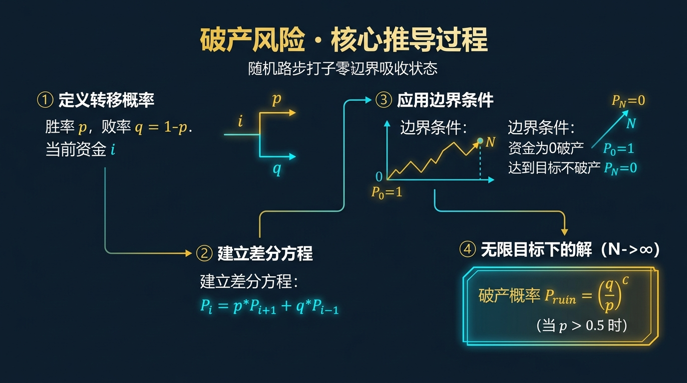
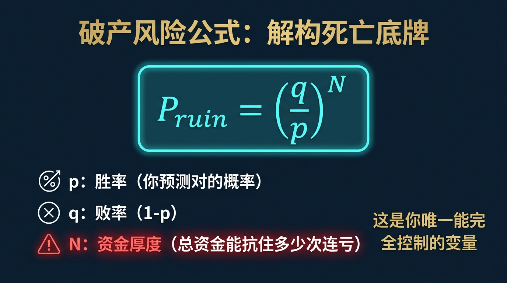
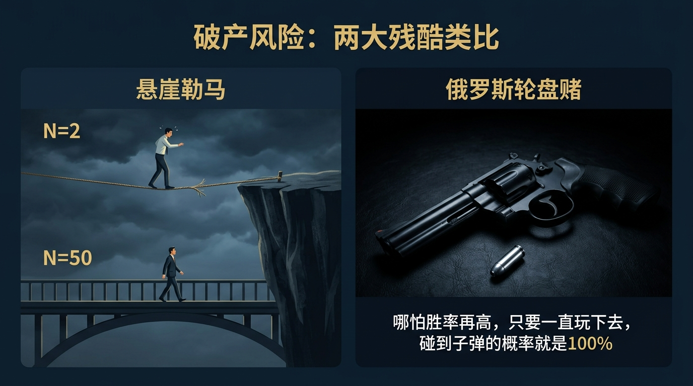
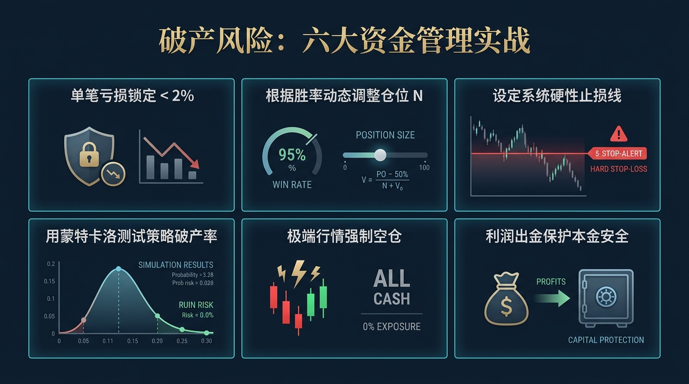
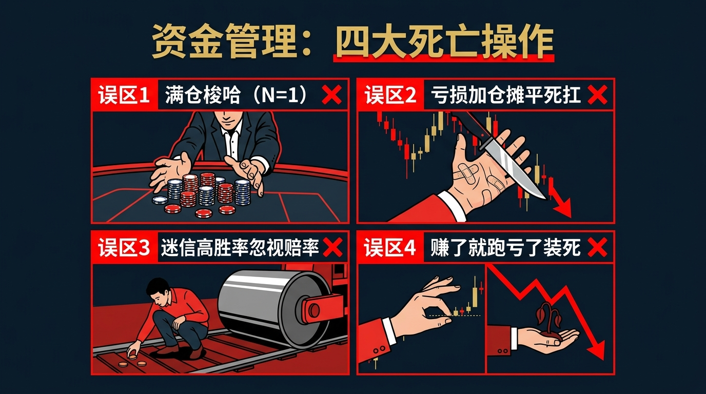

# 股票市场的数学原理 · 第19篇
# 破产风险：赌徒破产问题与资金管理
### Risk of Ruin — The Gambler's Ruin Paradox and Position Sizing

---

> **对冲基金教父 保罗·都铎·琼斯 · 凯利公式信仰者 都在死守的生存底线**
> 
> 🕐 阅读时间：约30分钟 | 📊 难度：⭐⭐⭐⭐ | 🎯 核心收获：明白为什么拥有 60% 甚至更高胜率的高手，最终依然会在股市中彻底爆仓，并掌握绝对避免“归零”的数学铁律。

---

## 📖 引言：为什么高胜率的高手依然会死？

在股票市场中，几乎所有的散户都在疯狂地追求一种东西：**高胜率（Win Rate）**。
每个人都在寻找能“百战百胜”的指标、内幕消息或是均线交叉信号。如果有一个大神告诉你，他有一套胜率高达 60% 的交易系统，你一定会觉得他是个印钞机。

但现实世界的统计数据却极其残酷：
那些胜率在 60% 甚至 70% 的活跃交易员，拉长周期看，**超过 90% 的人最终都破产了（资金归零）**。

为什么一个在概率上明明占优（胜率 > 50%）的人，只要一直玩下去，最后的结果居然是必然输光？难道概率论在现实中失效了吗？
其实，早在 300 多年前，几位数学天才就已经用严密的公式证明了这个看似反直觉的恐怖结论。在金融界和统计学界，这个现象被称为**“赌徒破产问题”（Gambler's Ruin Problem）**。

如果你不懂得这个数学机制，哪怕你掌握了地球上胜率最高的交易系统，你也只是在排队走向破产的绞肉机。

---

## 一、起源：改变命运的那封信与赌徒的诅咒

1654年，法国贵族兼资深赌徒**德·梅雷骑士（Chevalier de Méré）**在赌桌上遇到了一系列算不清楚的赔率问题。他将这些问题写在信里，寄给了当时法国最顶尖的数学家**布莱兹·帕斯卡（Blaise Pascal）**。

帕斯卡又把信转寄给了另一位天才**皮埃尔·德·费马（Pierre de Fermat）**。这两个人在通信的过程中，不仅彻底创立了现代**概率论**，还触及到了一个致命的底层问题——**赌徒破产问题**。

随后，荷兰数学家**克里斯蒂安·惠更斯（Christiaan Huygens）**在 1657 年出版的《论掷骰子游戏中的计算》一书中，正式给出了这个问题的数学解答。

**问题的经典设定是这样的：**
一个赌徒带着 $N$ 枚金币走进赌场，他玩一个极其公平的抛硬币游戏（赢的概率 $p=0.5$，输的概率 $q=0.5$）。
每次下注 1 枚金币。如果他赢到了指定的总金额（比如想赢到首富），他就离开；如果他的金币变成 0，他就会被赌场赶出去（破产）。
赌场的本金被认为是无限的（比如1000亿枚金币）。

惠更斯的数学结论让人不寒而栗：**只要赌徒的目标是不停地玩下去，哪怕游戏是绝对公平的（胜率 50%），赌徒破产的概率也等于 100%。**
因为赌场的资金是无限的，而赌徒的资金是有限的。在无限次的随机游走中，赌徒的资金轨迹必然会在某一个时刻触碰到“0”这条绝对死亡线。而一旦触碰 0，游戏强制结束，他永远没有翻本的机会。

---

## 二、核心公式：解构破产概率的死亡底牌

在量化交易中，我们将“赌徒破产问题”转化为交易员的**破产风险公式（Risk of Ruin）**。

假设你的交易系统：
- 胜率 $p$（比如 0.55）
- 败率 $q = 1 - p$（比如 0.45）
- 你的初始资金可以承受的连续亏损次数为 $N$（也就是你的**资金厚度**或**仓位管理**）

那么，你最终被踢出市场（破产）的概率 $P_{ruin}$ 为：

$$\boxed{ P_{ruin} = \left( \frac{q}{p} \right)^N }$$

> *注：这是最基础的假设盈亏比为 1:1，目标为无限获利时的破产概率公式。*

让我们解构这个冷酷的公式背后的物理意义：

| 符号 | 名称 | 现实物理意义 | 在股票交易中的意思 |
|------|------|-------------|------------------|
| $P_{ruin}$ | 破产概率 | 你被市场彻底消灭的可能性 | 账户余额归零、被券商强制平仓或心态崩溃退圈的概率。 |
| $p$ | 胜率 | 你的技术或策略有多准 | 你的量化模型预测上涨正确的比例（比如 55%）。 |
| $q$ | 败率 | 你的失误率 ($1-p$) | 模型预测错误的比例（比如 45%）。 |
| $q/p$ | 劣势比 | 每一回合对你不利的程度 | 这个数值必须小于1（即胜率必须大于50%），否则破产率必然是100%。 |
| **$N$** | **资金单位数** | **你离悬崖的距离** | **你把总资金分成了多少份来下注。这是你唯一能完全控制的变量！** |

### 🧮 致命的指数级力量：变量 $N$ 的魔力

假设你是一个真正的高手，你的交易系统极度优秀：**胜率 $p = 0.6$，败率 $q = 0.4$**。
代入公式，劣势比 $\frac{q}{p} = \frac{0.4}{0.6} = \frac{2}{3} \approx 0.667$。

接下来，看你的**仓位管理（即 $N$ 的大小）**如何决定你的生死：

- **激进型（梭哈）**：每次全仓下注 50% 的资金。你只能抗住 2 次连续亏损，因此 $N = 2$。
  破产概率 = $(0.667)^2 = \textbf{44.4\%}$。（接近一半的概率你会死，即便你是 60% 胜率的高手）
  
- **适中型（重仓）**：每次下注 20% 的资金。你可以抗住 5 次连亏，因此 $N = 5$。
  破产概率 = $(0.667)^5 = \textbf{13.1\%}$。（依然是很危险的赌徒游戏）

- **职业型（轻仓）**：每次只拿出 2% 资金冒险。你可以抗住 50 次连亏，因此 $N = 50$。
  破产概率 = $(0.667)^{50} = \textbf{0.0000001\%}$。（无限趋近于 0，你获得了永生！）

**数学结论极其震撼**：决定你是否破产的，**不是你的胜率有多高，而是你切分资金的份数 $N$ 有多大**。

---

## 三、四大类比：彻底理解破产的直觉

### 类比一：悬崖边的走钢丝（距离与容错率）
想象你正在走钢丝。你的技术很好（胜率 60%），每走一步，你有 60% 概率走稳，40% 概率会晃动。
- 什么是 $N=2$？就是你把钢丝架在了离悬崖边缘只有 2 米的地方，你稍微晃动两次，哪怕后面能走稳 100 次，你也已经掉下去了。
- 什么是 $N=50$？就是你把钢丝架在离悬崖边缘 50 米的地方，你有极大的安全缓冲带。
破产，就是那个绝对不可逆的“吸收壁”（Absorbing Barrier）。一旦掉下去，游戏结束。

### 类比二：无限复活币 vs 只有一条命（赌场为什么总赢？）
为什么赌场不怕你赢钱？因为赌场拥有相对于你来说“近乎无限”的资金（$N$ 极大）。
在扔硬币的随机游走中，即使概率是完全公平的 50/50，资金轨迹也会出现大幅度的上下偏离。资金有限的一方，必然会在某次大规模偏离中，先一步被洗劫成 0。这就是“只有一条命”的玩家，永远打不过“无限复活”的系统的数学原理。

### 类比三：马丁格尔策略的毒药（越亏越加仓）
“马丁格尔策略”（Martingale）是赌博界最著名的毒药：输了就加倍下注（1, 2, 4, 8, 16...），只要赢一次就能回本。
它在理论上是稳赢的，但它的数学前提是“你的本金是无限的”。在真实市场中，你可能只要连亏 6 把，你的第 7 把下注金额就会超过你的全部身家，瞬间破产。在破产风险的计算中，加倍下注等于在主动把 $N$ 急速缩小到 1。

### 类比四：打仗与预备队（战争哲学）
拿破仑打仗为什么厉害？因为他永远会保留一支极其庞大的“近卫军预备队”。
如果你把所有的兵力一次性全部压上（重仓），前线一次偶然的溃败就会导致全军覆没。预备队的存在（极大的 $N$），就是为了应对局部战场不可预知的“连败随机性”。

---

## 四、实战全流程：一场关于仓位的残忍推演

让我们用一个量化模型，模拟三位在华尔街同期入行的交易员。他们天赋异禀，使用**完全相同**的一套算法，胜率都是极高的 **60%**，盈亏比都是 **1:1**。
唯一的区别是他们的资金管理（仓位）习惯。

### 🎬 场景设定
- 初始本金：100,000 美元。
- 交易员 A（梭哈王）：每次拿出总资金的 50% 冒险。($N=2$)
- 交易员 B（进取型）：每次拿出总资金的 10% 冒险。($N=10$)
- 交易员 C（职业量化）：每次只拿出总资金的 2% 冒险。($N=50$)

### 💻 模拟运行过程
假设在一次长达两年的交易周期里，市场环境出现波动，系统遭遇了极度倒霉的一波**“连续 6 次亏损”**（这种连亏对于 60% 胜率的系统，在 1000 次交易中发生的概率超过 99%，是必然会出现的随机分布）。

| 交易阶段 | 交易员 A (50% 仓位) 余额 | 交易员 B (10% 仓位) 余额 | 交易员 C (2% 仓位) 余额 |
|---------|-------------------------|-------------------------|-------------------------|
| 初始资金 | $100,000 | $100,000 | $100,000 |
| 连亏第1次 | $50,000 | $90,000 | $98,000 |
| 连亏第2次 | **$0 (破产出局)** | $80,000 | $96,000 |
| 连亏第3次 | 出局 | $70,000 | $94,000 |
| 连亏第4次 | 出局 | $60,000 | $92,000 |
| 连亏第5次 | 出局 | $50,000 (心态崩溃) | $90,000 |
| 连亏第6次 | 出局 | $40,000 (腰斩，无力回天) | $88,000 (微小回撤) |

### 📊 最终大结局
- **交易员 A**：在第 2 笔交易时账户归零，彻底离开金融圈，并在推特上大骂股市是骗局。
- **交易员 B**：虽然没有彻底归零，但账户只剩 4 万美元（回撤 60%）。要想回本，他需要用剩下的钱赚取 150% 的收益，在心理上他已经破产了。
- **交易员 C**：账户仅仅微跌了 12%。当随后的“连赢”周期到来时，由于基数依然庞大，他轻松创出资金新高。最终成为对冲基金大佬。

**核心结论**：系统好（胜率高）只能决定你能不能赚钱；**仓位低（N大）才能决定你能活多久。** 只有活下来的人，才有资格让好系统的概率优势在时间轴上变现。

---

## 五、著名使用者：华尔街的生死两极

### 🥇 保罗·都铎·琼斯（Paul Tudor Jones）：死守 5% 铁律的幸存者
- **身份**：都铎对冲基金创始人，身价超 70 亿美元。
- **实战做法**：他的交易桌上贴着一张纸条：“Losers Average Losers”（失败者才摊平亏损）。他设定了一个不可逾越的红线：无论多么看好一个机会，**任何一笔交易的最大亏损绝不允许超过总资产的 5%**（相当于强制设定 $N \ge 20$）。
- **结果**：正是依靠这种对破产风险的极度恐惧，他在 1987 年的股灾中不仅没有破产，反而做空大赚 1 亿美元，并屹立华尔街 40 年不倒。

### 💀 维克多·尼德霍夫（Victor Niederhoffer）：被破产概率绞杀的天才
- **身份**：曾是索罗斯最看重的合伙人，以胜率极高著称的天才交易员。
- **实战做法**：他的交易系统胜率极高（主要靠裸卖深度虚值期权赚取微小的期权费）。这就像是在压路机前捡硬币。每次为了赚 1 块钱，他愿意承担极高的资金杠杆风险（极小的 $N$）。
- **结果**：1997 年亚洲金融风暴，他因为重仓做多泰铢爆仓破产。几年后他卷土重来，但在 2007 年的次贷危机前夕，再次因为卖出看跌期权遭遇“黑天鹅”，第二次破产清零。
- **原因**：他的胜率可能高达 95%，但在破产公式中，只要 $N$ 足够小（加了极高的杠杆），那 5% 的黑天鹅足以让破产概率变成 100%。

---

## 六、长期表现：为什么散户平均寿命只有半年？

如果你打开任何一家合规外汇经纪商或期权券商的官网，你会看到一行强制警告：“超过 75% 的零售账户在交易中亏损”。实际上，统计数据显示，初入高杠杆市场的新手交易员，存活的平均中位数寿命大约为 6 到 9 个月。

| 交易行为特征 | 数学参数 | 破产概率（100次交易后） |
|------------|---------|-----------------------|
| 喜欢全仓买一只股票（无止损） | $N=1$, 胜率即便 70% | **99%**（遇一次退市或造假即死） |
| 开10倍杠杆做多加密货币 | 波动极大，容错极低 $N \le 3$ | **95% 以上** |
| 每次亏损坚决止损 2% | $N=50$ | **< 0.01%** |

这也是为什么我们在之前的《凯利公式》篇中强调：**真正的凯利公式其实是一种“破产隔离机制”**。它在数学上保证了你永远不会全仓，永远会随着资金规模的缩小而同比例缩小下注金额，从而在理论上将破产的概率降为绝对的 0。

---

## 七、六大实战使用场景

1. **单笔止损线的设置**：利用公式倒推，如果你要求整体破产概率低于 1%，且你的历史最长连亏记录是 15 次，那么你单笔亏损的红线应该设定为总资金的 $1/20 = 5\%$。
2. **多品种分散投资（提升N）**：如果你只有 10 万块钱买股票，全仓买 1 只（$N$极小）。如果你把资金等分为 10 份，买 10 只完全不同行业的股票，你的总体 $N$ 得到了物理级别的拉长。
3. **加杠杆的数学警告**：为什么说 10 倍杠杆是毒药？因为 10 倍杠杆意味着股票只要下跌 10%，你的资金就归零了。你强行把自己的资金容错厚度缩短了 10 倍，极大提升了触碰“吸收壁”的概率。
4. **交易系统的蒙特卡洛测试**：用上一篇学到的蒙特卡洛模拟，跑 10000 遍你的交易系统，统计其中有多少次资金曲线触及了 0。这就是最真实的破产风险评估。
5. **网格交易/马丁格尔的避坑**：任何向你推销“只要跌了就翻倍加仓补本”的量化策略，在数学上破产率都是 100%，只是时间早晚问题。
6. **防范“胖手指”与极端流动性枯竭**：在账户中永远保留 20% 的绝对现金（甚至不在券商账户里），这是人为建立的一道防火墙，确保黑天鹅发生时你的 $N$ 永远不会瞬间归零。

---

## 八、常见错误与误区

| # | 错误认知 | 核心症状 | 致命后果 | 正确认知 |
|---|----------|---------|---------|--------|
| 1 | **胜率信仰** | “我的指标准确率 80%，我可以全仓干了！” | 一旦遭遇 20% 的倒霉小概率连续发生，直接一波归零。 | 胜率是用来赚钱的，仓位（降低破产率）是用来保命的。二者不能混用。 |
| 2 | **马丁格尔策略** | 亏了就加倍下注摊低成本，“总能涨回来”。 | 指数级消耗资金，极短时间内资金链断裂，彻底破产。 | 坚决执行“亏损缩仓”，亏损后应当减少下注金额，而不是增加。 |
| 3 | **忽视“连黑”的必然性** | 认为 60% 的胜率下，不可能连亏 10 次。 | 概率论证明，在足够长的交易生涯中，连亏 10 次的概率是 100%。 | 必须基于“一定会发生连亏 10 次”的底线假设，来制定资金管理计划。 |
| 4 | **止损设得太宽** | 股票跌了 50% 还不割肉，美其名曰“做长线”。 | 资金被深度套牢，相当于这一部分资金的生命力已被吸干（N变小）。 | 必须严格设置账户级别的总净值止损回撤线（例如-20%）。 |

---

## 九、局限性（诚实的评估）

虽然破产概率公式非常经典，但在现实应用中仍需注意它的理论假设缺陷：

| 局限性 | 具体表现 | 应对方案 |
|-------|---------|---------|
| **假设胜率是固定的** | 公式假设你的系统胜率 $p$ 永远不变，但现实中市场环境一变（牛市转熊市），你的胜率可能瞬间从 60% 暴跌到 30%。 | 必须引入**动态资金管理**。当近期胜率下降时，系统必须自动缩小单笔下注的金额。 |
| **忽略了心态的崩溃点** | 数学上的破产是资金归零（0）。但在现实中，当一个散户亏损达到 50% 或 70% 时，他的心理已经破产了，行为会彻底扭曲。 | 把破产线（吸收壁）提高！不要设定在 0，设定在账户回撤 -30% 时就强制清仓停止交易。 |
| **忽略了市场的极端跳空** | 你以为你设置了 2% 的止损，但在黑天鹅跳空低开时（比如跌停开盘），你的实际亏损可能达到 10%。 | 不能只依赖系统止损指令，必须辅以买入期权等结构性保护（参考第17篇哑铃策略）。 |

---

## 十、实战SOP：5步构建零破产风控网

> **行业最佳实践**：不要想着怎么赚更多，每天醒来先想怎么确保今天不死。

**Step 1：确定绝对破产线（心理底线）**
你的破产线绝对不能是 0。设定一个“一旦触及我就停手”的硬性回撤指标，比如：从最高点回撤 -30%。

**Step 2：统计系统的真实胜率 (p) 和盈亏比**
不要用感觉，用至少 100 笔真实交易记录，计算出你真实的胜率（通常能在 45%~55% 之间就已经及格）。

**Step 3：计算并接受“最大连亏次数”**
使用概率公式计算，在你的胜率下，未来 5 年内必然会遭遇的极端连续亏损次数。假设是连续亏损 8 次。

**Step 4：倒推单笔最大亏损限制（定义 N）**
如果你的总容忍回撤是 30%，而你可能连亏 8 次。为了给自己留出冗余缓冲（因为连亏中还有心态恶化等因素），将 30% 分为 15 份。
**单笔最大允许亏损 = 总资产的 2%**。这确保了你拥有极大的 $N$（容错厚度）。

**Step 5：强制执行断路器**
将这套规则写入程序量化交易平台。一旦单笔亏损触及 2% 强制平仓；一旦单月亏损触及 10% 暂停该策略运行一个月。将纪律交给计算机。

---

## 十一、本篇总结

在金融市场里，有两种交易员：一种是数学上的幸存者，另一种是终将被清算的赌徒。

| 升级前的思维（赌徒思维） | 升级后的思维（精算师思维） |
|------------------------|--------------------------|
| 寻找胜率高达 90% 的绝世秘籍 | 哪怕胜率只有 45%（通过高盈亏比），只要把 $N$ 设得足够大，我就能活下来并盈利 |
| 亏损了就要加倍买入，拉低均价 | 亏损说明市场不顺，应当**缩小**仓位，远离破产吸收壁 |
| 只关注怎么防范单笔交易的亏损 | 关注整个账户的“破产概率”，建立多道防御机制（低仓位+多品种） |
| 把破产当成是“运气不好” | 明白只要劣势比和资金管理出了错，破产就是数学上 100% 注定的宿命 |

最终，你需要把这句话刻在你的大脑皮层里：

$$\boxed{\text{只要存在破产的可能，无论这种可能性多小，拉长到无限的时间里，它发生的概率就是 100\%。}}$$

破产是量化交易员的终极死刑，而阻止这种死刑的唯一武器就是资金管理。
但在我们避免了死亡之后，如果你的账户经历了一次深度的下跌（比如回撤了 40%），你到底需要付出多么惨痛的代价才能爬出这个“深坑”呢？

下一篇，我们将探讨衡量策略韧性的终极指标——**最大回撤（Max Drawdown）与资金恢复时间**。你会从数学上惊恐地发现：“为什么亏损 50%，你需要赚 100% 才能回本？”

## 🔗 完整系列导航

点击展开查看全系列 25 篇文章目录

### 🧱 第一模块：地基篇 — 概率与期望思维
- [第01篇：凯利公式_仓位管理的黄金法则](./第01篇_凯利公式_仓位管理的黄金法则.md)
- [第02篇：期望值理论_所有决策的基石](./第02篇_期望值理论_所有决策的基石.md)
- [第03篇：大数定律_时间是你最好的朋友](./第03篇_大数定律_时间是你最好的朋友.md)
- [第04篇：中心极限定理_分散投资的数学证明](./第04篇_中心极限定理_分散投资的数学证明.md)
- [第05篇：复利定律_财富的雪球效应](./第05篇_复利定律_财富的雪球效应.md)

### 🔭 第二模块：选机会篇 — 识别高概率交易
- [第06篇：均值回归_市场的钟摆定律](./第06篇_均值回归_市场的钟摆定律.md)
- [第07篇：动量效应_顺势而为的数学依据](./第07篇_动量效应_顺势而为的数学依据.md)
- [第08篇：贝叶斯推断_实时更新你的判断](./第08篇_贝叶斯推断_实时更新你的判断.md)
- [第09篇：安全边际_价值投资的概率护城河](./第09篇_安全边际_价值投资的概率护城河.md)
- [第10篇：因子投资_系统性超越市场的秘密](./第10篇_因子投资_系统性超越市场的秘密.md)

### ⚖️ 第三模块：配置篇 — 资产组合与仓位管理
- [第11篇：现代投资组合理论_有效前沿的边界](./第11篇_现代投资组合理论_有效前沿的边界.md)
- [第12篇：夏普比率_策略质量的标准尺](./第12篇_夏普比率_策略质量的标准尺.md)
- [第13篇：风险平价策略_穿越经济周期的秘密](./第13篇_风险平价策略_穿越经济周期的秘密.md)
- [第14篇：最优仓位管理_Optimal-f_凯利公式的工程级进化](./第14篇_最优仓位管理_Optimal-f_凯利公式的工程级进化.md)
- [第15篇：相关性与分散化_降低风险的数学奥秘](./第15篇_相关性与分散化_降低风险的数学奥秘.md)

### 🛡️ 第四模块：风控篇 — 极端状态下的生死局
- [第16篇：VaR风险价值_如何量化你能承受的最大亏损](./第16篇_VaR风险价值_如何量化你能承受的最大亏损.md)
- [第17篇：黑天鹅事件_极端风险的数学本质](./第17篇_黑天鹅事件_极端风险的数学本质.md)
- [第18篇：蒙特卡洛模拟_用随机数预测未来](./第18篇_蒙特卡洛模拟_用随机数预测未来.md)
- [第19篇：破产风险_赌徒破产问题与资金管理](./第19篇_破产风险_赌徒破产问题与资金管理.md)
- [第20篇：最大回撤与资金恢复时间_衡量策略韧性](./第20篇_最大回撤与资金恢复时间_衡量策略韧性.md)

### 🔬 第五模块：量化进阶篇 — 升华与融合
- [第21篇：主动管理定律_信息比率与预测宽度的乘积](./第21篇_主动管理定律_信息比率与预测宽度的乘积.md)
- [第22篇：B-S期权定价模型_金融工程的皇冠](./第22篇_B-S期权定价模型_金融工程的皇冠.md)
- [第23篇：行为金融学数学化_前景理论与损失厌恶](./第23篇_行为金融学数学化_前景理论与损失厌恶.md)
- [第24篇：投资组合理论大融合_打造你的全天候财富机器](./第24篇_投资组合理论大融合_打造你的全天候财富机器.md)
- [第25篇：终章_数学的尽头是哲学_概率的尽头是人生](./第25篇_终章_数学的尽头是哲学_概率的尽头是人生.md)

---
**← 上一篇：[蒙特卡洛模拟](./第18篇_蒙特卡洛模拟_用随机数预测未来.md)** | **→ 下一篇：[最大回撤与资金恢复时间](./第20篇_最大回撤与资金恢复时间_衡量策略韧性.md)**

---
*《股票市场的数学原理》全系列 · 第19篇*
