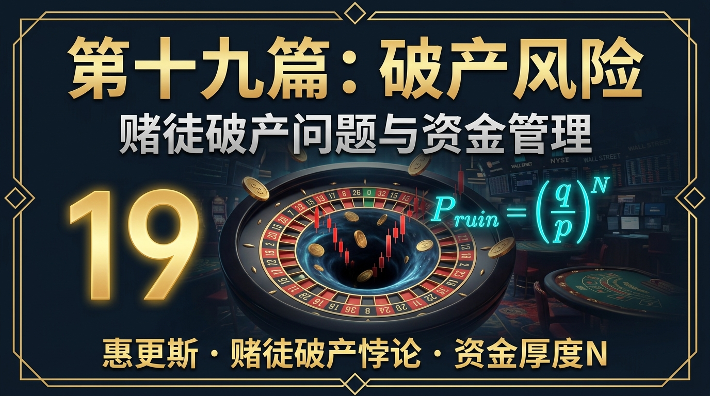

# 股票市场的数学原理 · 第19篇
# 破产风险：赌徒破产问题与资金管理
### Risk of Ruin — The Mathematics of Survival in Financial Markets

---

> **量化基金风控官、职业德州扑克选手、赌场精算师 都在严防死守的核心禁忌**
>
> 🕐 阅读时间：约30分钟 | 📊 难度：⭐⭐⭐⭐ | 🎯 核心收获：理解为什么一个"胜率极高"的交易策略，只要仓位管理犯错，依然会面临 100% 的破产结局；学会运用破产概率公式，为你的投资生涯建立一道不可逾越的护城河

---

## 📖 引言：为什么赢家也会输光一切？

让我们来做一个看似稳赚不赔的思想实验。

你发现了一个绝佳的交易策略，回测数据显示：
- **胜率（赢的概率） $p = 60\%$**
- **败率（输的概率） $q = 40\%$**
- 盈亏比为 1:1（每次赢赚 1 块钱，输亏 1 块钱）

从数学期望上看，这是一个"印钞机"策略。每次交易的期望收益 = $60\% \times 1 - 40\% \times 1 = 0.2$ 元。只要你一直玩下去，你一定会发大财，对吗？

现在，我们设定一个条件：你手里总共有 10 块钱本金。如果输光了这 10 块钱，游戏结束（你被市场强平出局，再也无法下注）。你贪图一夜暴富，决定每次全仓下注 5 块钱（也就是你只有 2 次试错机会）。

你猜猜看，这样一个**胜率高达 60% 的完美策略，你最终倾家荡产、被抬出局的概率有多大？**

答案会让你倒吸一口凉气：**你破产的概率大约是 30.7%！**
这意味着，即使你找到了一个长期稳赚不赔的圣杯，如果你资金管理不当，你有接近三分之一的可能在迎来黎明前就彻底死掉。

这就是金融数学中最著名的悖论之一：**"赌徒破产问题"（Gambler's Ruin）**。它揭示了一个冰冷的真相——**拥有优势（Edge）只是赢的必要条件；活下来（Survival），才是赢的充分条件。**

本篇，我们将深入破产概率的数学核心，彻底搞懂如何通过量化资金管理，把破产概率无限压缩至 0。

---

## 一、起源：帕斯卡、费马与概率论的诞生

"赌徒破产问题"的历史，几乎和概率论本身一样古老。

1654 年，法国贵族、职业赌徒**德·梅雷骑士（Chevalier de Méré）**遇到了一些赌博中的数学难题。他写信向当时最伟大的数学家**布莱兹·帕斯卡（Blaise Pascal）**求助。帕斯卡随后与另一位数学天才**皮埃尔·德·费马（Pierre de Fermat）**进行了长达数月的通信。

在这场被誉为"概率论诞生"的伟大通信中，他们讨论的核心问题之一就是：如果两个赌徒在胜负未分时提前终止游戏，该如何公平地分配赌资？这本质上是在计算：在当前比分下，每个人最终赢得全部赌资的概率是多少？

随后，荷兰数学家**克里斯蒂安·惠更斯（Christiaan Huygens）**和瑞士数学家**雅各布·伯努利（Jacob Bernoulli）**进一步将其形式化为经典的"赌徒破产问题"模型。

在长达 300 多年的时间里，这个问题一直被视为赌场精算的核心。直到 20 世纪下半叶，华尔街的量化交易员们才猛然醒悟：**在金融市场中加杠杆交易，本质上就是一场带有随机游走性质的赌局。只要存在一个"账户归零线"，赌徒破产的数学法则就必然在市场上空盘旋。**

1998 年的长期资本管理公司（LTCM）、2021 年的 Archegos Capital（比尔·黄的世纪大爆仓），这些华尔街最聪明的大脑，最终都死于这个 300 年前的古老数学问题。

---

## 二、核心公式：揭开破产概率的数学面纱

赌徒破产问题有一个标准数学模型：

假设赌徒初始有 $i$ 个单位的资金，他想赢到 $N$ 个单位后收手。
每次抛硬币，他赢 1 个单位的概率是 $p$，输 1 个单位的概率是 $q$（其中 $q = 1-p$）。
如果他的资金变成 0，他就破产。

根据差分方程求解，他**最终破产的概率 $P(Ruin)$** 公式如下：

### 1. 当胜率和败率不相等时（$p \neq q$）：

$$P(Ruin) = \frac{(\frac{q}{p})^i - (\frac{q}{p})^N}{1 - (\frac{q}{p})^N}$$

### 2. 在投资中更实用的极限形式：
在金融市场中，我们通常把"赚够 $N$ 元就收手退出市场"视为不可能的，投资者通常是"生命不息，交易不止"，即 $N \to \infty$。

当我们把 $N$ 趋于无穷大，且**我们在市场中有优势（即胜率 $p > 0.5$，$q < p$）**时，上述公式会坍缩成一个极其优雅、且极度致命的极限公式：

$$P_{\infty}(Ruin) = \left( \frac{q}{p} \right)^i$$

其中：
- $q$ = 输的概率
- $p$ = 赢的概率
- **$i$ = 你的资金可以承受连续亏损的次数（资金单位数）**

这个公式，就是量化交易风控的**"生死方程式"**！

---

## 三、深度解析：生死方程式的震撼启示

让我们通过代入具体数字，来看看 $P_{\infty}(Ruin) = (\frac{q}{p})^i$ 给我们的三大震撼启示。

### 启示一：如果胜率低于 50%，破产是唯一必然的结局
如果 $p < 0.5$（比如你去赌场玩轮盘赌，由于有 0 和 00，你的胜率只有 47.3%），那么 $\frac{q}{p} > 1$。
不管你的本金 $i$ 有多大，只要时间足够长，$(\frac{q}{p})^i$ 都会大于 1。概率论严密证明了：**没有优势（Edge）的系统，长期玩下去破产概率为 100%。**
这也就是为什么"久赌必输"是一个无可辩驳的数学定理。

### 启示二：即便胜率大于 50%，资金单位 $i$ 过小依然容易破产
回到引言中的例子：胜率 $p = 0.6$，败率 $q = 0.4$。
此时公式底数 $\frac{q}{p} = \frac{0.4}{0.6} = \frac{2}{3}$。这是一个印钞机策略。

现在来看**仓位大小**（也就是资金单位 $i$）的决定性作用。
假设你总共有 100 万元。

| 每次下注金额 | 可承受连亏次数 $i$ | 计算过程 | 最终破产概率 |
|------------|------------------|---------|------------|
| 全仓 100 万（一把梭）| $i = 1$ | $(\frac{2}{3})^1$ | **66.7%** (极高) |
| 每次下注 50 万（半仓）| $i = 2$ | $(\frac{2}{3})^2$ | **44.4%** (高危) |
| 每次下注 20 万（五分之一）| $i = 5$ | $(\frac{2}{3})^5$ | **13.1%** (危险) |
| 每次下注 10 万（十分之一）| $i = 10$ | $(\frac{2}{3})^{10}$ | **1.73%** (安全) |
| 每次下注 5 万（二十分之一）| $i = 20$ | $(\frac{2}{3})^{20}$ | **0.03%** (极度安全) |

**这就是量化风控的核心机密！**
交易系统（胜率 $p$）只决定了公式的底数 $\frac{q}{p}$ 是小于 1 还是大于 1。
而**仓位管理（把资金切分成多少份 $i$），才决定了指数，决定了你破产概率的衰减速度！**
这就是为什么职业交易员宁愿放弃部分收益，也坚决要求单次交易风险不得超过总资金的 1%~2%。因为当 $i=50$ 或 $i=100$ 时，只要系统有哪怕微弱的优势，破产概率在数学上都会趋近于 0。

### 启示三：如果你是高频交易者，你必须切得更细
在这个公式中，$i$ 是"连续亏损直至破产的次数"。
如果你每年只做 5 次投资，连亏 10 次是个小概率事件。
但如果你是日内高频交易员，每天交易 50 次。连亏 10 次在统计学上几乎每个月都会发生。所以，交易频率越高的策略，要求单次下注比例越小，$i$ 必须设置得极大（比如 $i=1000$）。

---

## 四、真实世界的破产：连续亏损（Drawdown）的数学

上面的硬币模型很理想。但在真实的股票市场中，我们面临的破产并不是"连续抛 10 次反面"，而是**"账户回撤达到心理或物理极限"**。

当账户亏损时，要回本所需的涨幅会呈非线性地急剧上升（我们在第 3 篇《复利的双刃剑》中提过，亏 50% 需要涨 100% 才能回本）。

如果我们用连续亏损序列（Streak of Losses）来评估风险：

假设一个策略每次交易亏损本金的 2%（固定比例止损）。

| 连续亏损次数 | 账户剩余资金 | 回本所需涨幅 | 心理与物理状态 |
|------------|------------|-------------|--------------|
| 连亏 5 次 | 90.4% | 10.6% | 正常回撤，可以接受 |
| 连亏 10 次 | 81.7% | 22.4% | 信心受挫，开始怀疑策略 |
| 连亏 15 次 | 73.8% | 35.4% | 压力极大，可能手动干预 |
| 连亏 20 次 | 66.7% | 50.0% | **破产红线（心理破产）** |
| 连亏 35 次 | 49.3% | 102.8% | 彻底瘫痪，资金机构通常在此前已强平 |

**那么，连亏 N 次的概率到底有多大呢？**
这是一个经典的马尔可夫链问题。
假设你的胜率 $p = 50\%$，你做 1000 次交易。在这个样本中：
- 出现至少一次"连亏 5 次"的概率：$\approx 99.9\%$（必然发生）
- 出现至少一次"连亏 8 次"的概率：$\approx 53\%$（大概率发生）
- 出现至少一次"连亏 10 次"的概率：$\approx 15\%$（并非不可能发生）

如果你没有运用蒙特卡洛模拟（见第 18 篇）来测算你的"最大连亏次数"，并以此为基础计算你的 $i$（可承受连亏资金单位），那么市场早晚会用一次完美的 10 连亏将你扫地出门。

---

## 五、四大类比：彻底理解破产风险的直觉

### 类比1：玩俄罗斯轮盘赌的富翁（理解"不计后果的高杠杆"）
有人向你提议玩一次俄罗斯轮盘赌（一把左轮手枪，6 个弹巢，1 颗子弹）。游戏规则是：你朝自己开一枪，如果没死，给你 1 亿美元。
你的胜率是 5/6 (83.3%)，期望收益极高。但你应该玩吗？
绝不。因为这是一个存在**不可逆的吸附态（Absorbing State）**的游戏。一旦你进入那个 1/6 的状态（破产/死亡），你就永远退出了游戏，后续的 5/6 期望收益对你没有任何意义。
在投资中全仓加上高杠杆，就是在玩俄罗斯轮盘。

### 类比2：航海船只的水密舱设计（理解资金切分 $i$ 的作用）
为什么泰坦尼克号会沉没？因为它底部的 16 个水密舱没有完全封顶，水漫过一个就会流入下一个。
优秀的远洋货轮，会将船体切割成几十个独立、完全封闭的水密舱。即使触礁导致 3 个舱进水，剩下的舱提供的浮力依然能让船浮在水面上开回港口。
投资中的每次单笔限额（如单只股票不超过总资金的 5%），就是为你投资组合打造的"水密舱"（设置 $i=20$）。就算某只股票遭遇黑天鹅退市（进水），你的大船依然安然无恙。

### 类比3：打桥牌/德州扑克时的资金池（理解生存是赢的先决条件）
职业德州扑克选手，如果认定自己是个高手（有正期望），他们绝不会带着仅够玩 3 手牌的资金上桌（即 $i=3$）。因为再高的高手，也有发牌运气极差（Variance）连续输 3 手的时候。职业选手通常要求拥有相当于 100 倍买入（Buy-ins）的资金池（$i=100$），才能抵御短期的随机波动，让长期的技术优势体现出来。

### 类比4：走钢丝 vs 走平地（理解容错空间）
在平地上走 10 米，和在两座摩天大楼之间走 10 米的钢丝，距离是一样的，需要的步数是一样的。
但为什么在平地上你 100% 能走过去，在钢丝上大概率会掉下去？
因为平地有无限的**容错空间**，你偏离中线 10 厘米，调整回来就是了；而钢丝的容错空间是 0（破产界限极近）。
好的资金管理，就是把走钢丝变成走一条宽阔的平地大道。

---

## 六、实战应用：顶级机构如何设定防破产底线

如果你想在市场上长久活下去，必须建立自己的防破产体系。以下是顶级交易体系的实战做法。

### 🥇 核心原则：2% 破产红线法则（The 2% Rule）
这是由传奇交易员亚历山大·埃尔德（Alexander Elder）等前辈总结出的铁律，也是很多对冲基金的风控底线：
**任何单笔交易，如果触发止损，最大损失绝对不能超过总账户资金的 2%。**

**如何计算仓位？**
假设你的账户有 1,000,000 元。
规则：单笔最大允许亏损 = $1,000,000 \times 2\% = 20,000$ 元。
你打算买入一只股票，现价 100 元，你把技术止损位设在 90 元。
每股潜在亏损 = 10 元。
你可以买入的股数 = 最大允许亏损 $20,000$ / 每股潜在亏损 $10 = 2000$ 股。
实际动用资金 = $2000 \times 100 = 200,000$ 元（占总仓位 20%）。

注意这里的逻辑：**仓位大小是由止损距离和 2% 红线反推出来的**。
如果你的止损位设得很宽（比如设在 80 元，每股亏 20 元），那么你只能买 1000 股，动用 10 万元仓位。
**永远让单笔最大真实回撤锁定在总资金的 2% 以下。** 这意味着你需要**连续亏损 50 次**才会把账户清零（$i=50$）。从数学上讲，如果你有哪怕一点点正期望，连亏 50 次的概率等同于被陨石砸中。

### 🥇 核心原则：6% 月度灾难熔断机制
单笔亏损 2% 虽然安全，但如果你同时持仓 10 只股票，这 10 只股票高度相关，遇到系统性大跌全部触发止损，你一天内会亏掉 20%。
为了防范这种相关性黑天鹅，需要第二层防护：**当月总账户亏损达到 6%（或某固定比例）时，停止一切新交易。**
这意味着你不仅对单次波动设了水密舱，还给整个账户装上了总闸。这能防止你在情绪失控（上头，Tilt）时疯狂逆势加仓，从而跌入"死亡螺旋"。

### 🥇 核心原则：与凯利公式（Kelly Criterion）的完美结合
我们在第 14 篇详细讲解过凯利公式：$f = p - \frac{q}{b}$。
凯利公式告诉你的是"如何让资金增长率最大化"。但我们在那篇也特别强调了，全仓按凯利公式下注（Full Kelly）由于波动极大，很容易触发破产或心理崩溃。
在现代实战中，基金经理将破产风险模型与凯利公式结合：
**使用半凯利（Half-Kelly）或四分之一凯利（Quarter-Kelly）。**
- 全凯利保证长期复利最高，但短期破产概率可能高达 10%~20%（若回撤容忍度低）
- 半凯利只牺牲了约 25% 的长期增长率，但将破产概率压缩到了千万分之一级别，且将最大回撤降低了一半。

---

## 七、为何人们总是飞蛾扑火？——行为金融学的解释

为什么"不要全仓、不要高杠杆"这种浅显的道理，几百年来无数绝顶聪明的人依然前赴后继地违反？

1. **确定性偏差（Certainty Bias）**：
人在面对历史回测中表现极好的策略时，大脑会自动忽略那 10% 概率的"连续亏损期"，而把它视为 100% 确定的摇钱树。既然确定能赚钱，为什么要留预备金？全仓加上 5 倍杠杆不是赚得更快吗？

2. **亏损厌恶（Loss Aversion）导致的死扛**：
浮亏时，如果你及时止损（认错出局），就坐实了这笔 2% 的亏损。人类极其讨厌认输。于是大脑欺骗你："只要不卖就没有真亏，等它弹回来"。为了不接受 2% 的亏损，你选择承担 100% 破产的风险。这就是为什么散户的真实账户盈亏比往往是 1:3 甚至更差。

3. **近期偏好（Recency Bias）导致的错觉**：
如果一个人刚入市就连赢了 5 把，他会认为自己是天才，胜率是 100%（$p=1$）。根据破产公式，如果 $p=1$，$P(Ruin) = 0$。于是他在第 6 把直接全仓加杠杆。市场只需一次正常的波动，就能教他做人。

---

## 八、长线投资者的破产风险

很多人认为："我不做短线交易，我是买入持有的长线价值投资者。我只要拿住指数基金 30 年，破产风险跟我没关系。"

**错！长线投资者同样面临不同形式的破产风险。**

### 1. 被迫变现（Forced Liquidation）
这是长线投资者最常见的"破产"。假设你全部身家都在指数基金中。市场暴跌 50%，你的资产减半。这本身不是破产。但如果在此时，你突然失业、或者家人生了重病需要巨额医疗费，你**被迫在最低点抛售资产**。
一旦你在底部套现，你就形成了**不可逆的吸附态**。即便三年后市场创出历史新高，你也不在车上了。
**防破产解药**：永远、永远保留相当于 3-6 个月生活费的绝对安全现金（紧急备用金）。这笔钱的收益率是 0，但它买到的是你整个投资组合的"免受强平权"。

### 2. 标的资产的真实破产（Enron / 乐视网）
如果你重仓单一公司股票（比如你公司的员工期权，或者你极度看好的一家公司），长线持有并不能抵消这家公司自身破产的风险。只要时间足够长，单家公司归零的概率在拉长的时间线上非常显著。
**防破产解药**：极其严格的分散化（参考第 15 篇）。买入宽基指数 ETF，因为整个国家的经济指数破产的概率（除非国家灭亡）远远低于任何一家世界 500 强。

---

## 九、本篇总结：活下来，复利才能为你工作

赌徒破产问题，用冷酷的数学定理揭示了投资世界的第一法则。

**巴菲特说投资只有两条规则：第一，不要亏损本金；第二，永远记住第一条。** 这不仅仅是句俏皮话，这是深谙 $\left( \frac{q}{p} \right)^i$ 极限公式后的数学智慧。

| 投资层次 | 认知状态 | 结局 |
|---------|---------|------|
| 新手 | 追求每把都赢，寻找 100% 胜率的圣杯 | 在现实的随机波动中被消灭 |
| 进阶者 | 接受胜率只有 50~60%，努力优化选股和买点 | 有时赚有时亏，遇到一次连亏或黑天鹅爆仓归零 |
| 高手 | 把重点放在防守，将单次风险限制在 2% 以内，设定破产底线 | **活得足够久，直到复利和大数定律显现威力** |

$$\boxed{生存优先，其次才是收益。在投资中，你必须首先确保你在玩一个永远不会进入"吸附态"（破产）的游戏。}$$

我们在这一篇学会了如何防范"最终归零"的深渊。但在实际操作中，你可能没有破产，但你的账户却承受了极其惨烈的下跌，并在底部煎熬了数年。这会让绝大多数人在黎明前崩溃。
下期，我们将讨论衡量这种心理与资产双重痛苦的核心指标——**最大回撤（Max Drawdown）与资金恢复时间**。

---
- **← 上一篇：[第18篇 - 蒙特卡洛模拟](第18篇_蒙特卡洛模拟_用随机数预测未来.md)** |
  **→ 下一篇：[第20篇 - 最大回撤与资金恢复时间](第20篇_最大回撤与资金恢复时间_衡量策略韧性.md)**（即将发布）

---
*《股票市场的数学原理》系列 · 第19篇 · 破产风险：赌徒破产问题*
*数据与模型参考：William Feller《An Introduction to Probability Theory and Its Applications》；Ralph Vince《The Mathematics of Money Management》*
