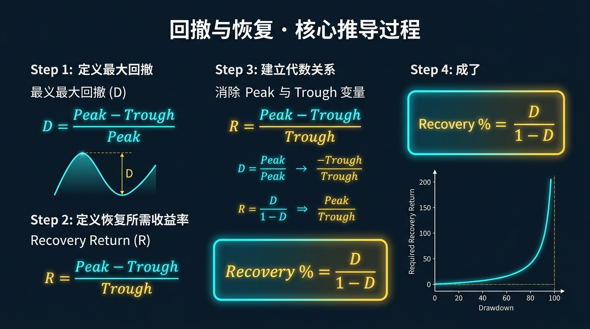
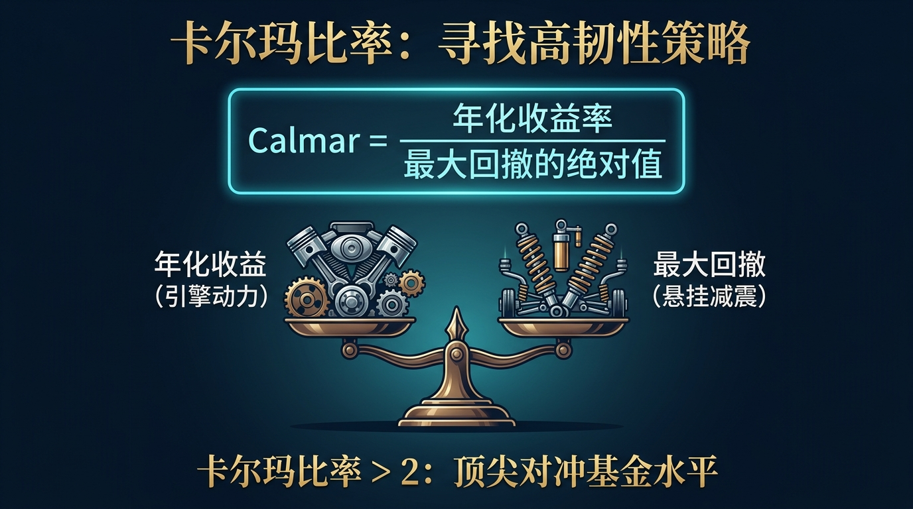
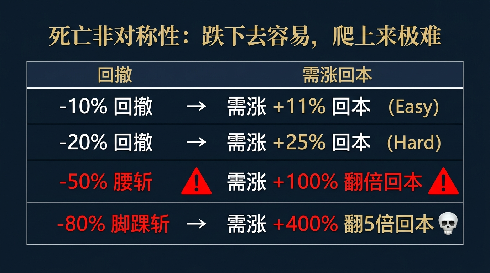
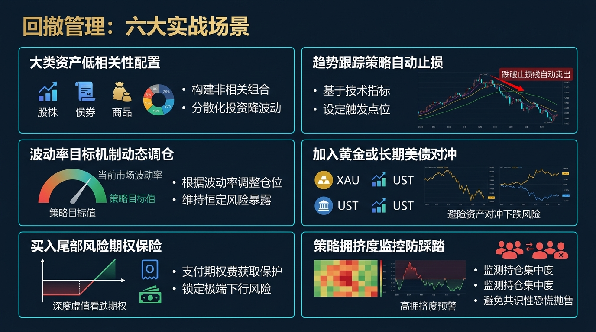
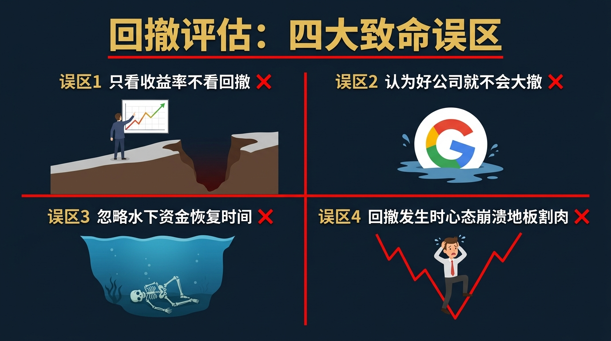

# 股票市场的数学原理 · 第20篇
# 最大回撤与资金恢复时间：衡量策略韧性
### Max Drawdown & Recovery Time — Measuring Strategy Resilience

---

> **巴菲特 · 桥水基金达利欧 · 顶尖量化机构 都在紧盯的生死指标**
> 
> 🕐 阅读时间：约30分钟 | 📊 难度：⭐⭐⭐ | 🎯 核心收获：明白为什么跌掉50%需要赚100%才能回本的残酷数学原理，并掌握用“卡尔玛比率”筛选真正高韧性策略的方法。

---

## 📖 引言：为什么你赚了两年，却在两个月内被彻底打回原形？

在投资的世界里，有两种截然不同的痛苦：
第一种痛苦，是一直在亏钱（钝刀子割肉）。
第二种痛苦，是你前两年顺风顺水，资金从 100 万涨到了 200 万，你觉得自己是股神。但在随后的短短两个月里，市场暴跌，你的账户又从 200 万跌回了 100 万。

心理学和行为金融学告诉我们，第二种痛苦的杀伤力是第一种的 100 倍。
更可怕的是数学的残酷性：
从 100 万赚到 200 万，你需要付出极其艰辛的努力，抓对好几个翻倍的牛股，获得 **+100%** 的收益。
但从 200 万跌回 100 万，你只需要在一只股票上加了杠杆，或者仅仅是满仓经历了一波大熊市，跌幅仅仅是 **-50%**。

这就是金融市场中最令人绝望的非对称定律：**下跌的破坏力永远大于上涨的建设力。**
在机构和量化领域，我们不用“年化收益率”来衡量一个交易员的水平，因为连猪在风口上都能飞。我们衡量一个交易员是否能活下去的终极标准，叫做**最大回撤（Maximum Drawdown, MDD）**和**资金恢复时间（Recovery Time）**。

如果你不懂如何管理最大回撤，你现在赚的所有钱，都只是暂时存在你账户里的一串数字，市场迟早会连本带利地收回去。

---

## 一、起源：从只看“波动率”到直面“深坑”的觉醒

在 20 世纪 50 年代，哈里·马科维茨（Harry Markowitz）创立了现代投资组合理论（MPT）。在当时，学术界统一使用**“标准差”（Standard Deviation）**来代表风险。
标准差的意思是：资产价格偏离其平均值的程度。
但在随后的几十年实战中，华尔街的交易员们发现了一个巨大的漏洞：标准差把“向上暴涨”和“向下暴跌”视为同等的风险。

> *“如果你今天赚了 10%，明天亏了 10%，你的标准差很大；如果你今天赚了 1%，明天赚了 1%，你的标准差很小。但作为一个正常人，我绝对喜欢那个标准差大的，因为我喜欢向上暴涨的‘风险’！”*

真正的交易员根本不在乎向上的波动，他们真正在乎、恐惧、甚至会因此跳楼的，只有一种情况：**我的账户资金从最高点往下掉，到底能掉多深？什么时候才能爬出来？**

于是，在 20 世纪后期，量化界引入了更加硬核且直指人心的物理指标：**最大回撤（MDD）**。
它就像是测量一个坑有多深。它不关心你之前爬了多高，它只记录你在最绝望的谷底时，离曾经的顶峰有多远。

---

## 二、核心公式：解构深坑与爬坑的数学难度

### 1. 最大回撤（Max Drawdown, MDD）公式

$$\boxed{ MDD = \frac{Trough - Peak}{Peak} }$$

| 符号 | 名称 | 现实物理意义 | 在股票交易中的意思 |
|------|------|-------------|------------------|
| $MDD$ | 最大回撤 | 坑的绝对深度 | 你的账户从最辉煌的高光时刻，到最惨烈的谷底，一共缩水了百分之几。 |
| $Peak$ | 历史高点 | 你爬到的最高峰 | 你的账户净值曾经达到过的最高数字（比如 200 万）。 |
| $Trough$ | 最低谷 | 你摔到的最底端 | 在达到 $Peak$ 之后，账户经历的最惨烈的低点（比如 100 万）。 |

**注**：MDD 永远是一个**负数**或者绝对的百分比。如果 MDD 是 -50%，意味着你被腰斩了。

### 2. 爬坑定理（回本所需的收益率公式）

这是整个金融学中最冷酷的数学公式。假设你经历了一个比例为 $D$ 的回撤（比如 $D = 0.5$ 代表跌了 50%），你需要多少的涨幅 $R$ 才能回到前高？

$$\boxed{ R = \frac{D}{1 - D} }$$

让我们看看这个公式展现出的“死亡非对称性”：

| 你遭遇的回撤幅 ($D$) | 你的账户表现 | 你需要多大的涨幅才能回本 ($R$) | 难度评估 |
|--------------------|-------------|------------------------------|---------|
| **-10%** | 100万 $\rightarrow$ 90万 | $0.1 / 0.9 = \textbf{+11.1\%}$ | 轻松。一波中级反弹即可收复。 |
| **-20%** | 100万 $\rightarrow$ 80万 | $0.2 / 0.8 = \textbf{+25.0\%}$ | 困难。需要一波像样的小牛市。 |
| **-50% (腰斩)** | 100万 $\rightarrow$ 50万 | $0.5 / 0.5 = \textbf{+100.0\%}$ | **极度困难。你需要一只翻倍股！** |
| **-80% (脚踝斩)** | 100万 $\rightarrow$ 20万 | $0.8 / 0.2 = \textbf{+400.0\%}$ | **近乎地狱。你需要翻 5 倍才能回本！** |
| **-90%** | 100万 $\rightarrow$ 10万 | $0.9 / 0.1 = \textbf{+900.0\%}$ | **九死一生。你需要 10 倍股。** |

**数学结论极其震撼**：亏损是线性的，但回本的难度是**指数级爆炸**的。当回撤超过 50% 时，数学的引力黑洞就已经形成，你不仅损失了本金，你还损失了制造复利的**基数**。

### 3. 卡尔玛比率（Calmar Ratio）

由于夏普比率使用的是标准差，无法体现“深坑”的恐怖。1991年，特里·杨（Terry Young）发明了卡尔玛比率：

$$\boxed{ \text{Calmar Ratio} = \frac{\text{年化复利收益率}}{\text{最大回撤绝对值}} }$$

- 如果某量化基金年化赚 20%，但最大回撤高达 40%（卡尔玛 = 0.5），说明他在拿命搏。
- 如果某基金年化赚 15%，最大回撤只有 5%（卡尔玛 = 3.0），这就是最顶级的印钞机系统。**在业内，卡尔玛比率 > 2.0 就是极为优秀，> 3.0 就是神级。**

---

## 三、四大类比：彻底理解回撤与复利的直觉

### 类比一：挖坑与填坑的重力不对称（核心数学直觉）
想象你站在平地上（100块）。你往下挖了一个 50 米的坑（亏损50%，剩50块）。
这个时候，你在坑底。你想填满这 50 米，你需要多少泥土？你需要用你现有的 50 块，去填 50 米的坑。这意味着你现有的能力必须发挥出 **100%** 的效能（50 变成 100）。
**向下掉落时有重力加速（容易），向上爬坑时需要克服重力（极难）。**

### 类比二：打断腿的短跑运动员（复利基数的毁灭）
如果博尔特以 10米/秒 的速度奔跑，他跑 100 米需要 10 秒。
但如果中途有人打断了他一条腿（经历 80% 回撤），他的速度变成了 2米/秒（基数变小）。他要跑完剩下的距离，所需要的时间将呈几何倍数增加。
**在股市中，回撤摧毁的不仅是你的钱，更是你赚钱的速度（本金基数）。**

### 类比三：潜水与氧气瓶（资金恢复时间）
最大回撤（MDD）是潜水的深度。**资金恢复时间（Recovery Time）**则是你在水下憋气的时间。
如果你潜水很深（回撤 50%），但你 1 分钟就浮出水面（比如 2020年3月因美联储救市引发的深V反弹），你不会死。
但如果你只潜水了 3 米（回撤 20%），可是你在水下憋了 5 年（漫长的阴跌熊市），你的心理氧气瓶会耗尽，你依然会死在水里（心理崩溃，在黎明前割肉）。

### 类比四：马拉松的配速与抽筋（收益与回撤的权衡）
有些投资者像一开始就百米冲刺的马拉松选手，前 5 公里遥遥领先（每年翻倍），但第 6 公里突然严重抽筋（回撤 80%），最后被迫退赛。
优秀的机构就像是以稳定配速跑全马的选手（年化 15%）。虽然看起来不快，但因为几乎从不抽筋（回撤严格控制在 10% 以内），最终以极大的优势夺冠。

---

## 四、实战全流程：一场关于回撤的残酷推演

为了展示控制回撤的威力，我们来看看两位风格完全不同的交易员。他们进入市场 4 年，**他们的算术平均收益率竟然完全相同**。

### 🎬 场景设定
- **初始本金**：1,000,000 元
- **交易员 A（赌徒，大起大落）**：极度激进。每年翻倍，但熊市也腰斩。
- **交易员 B（量化，稳如老狗）**：极度保守。牛市赚得少，熊市不怎么亏。

### 💻 4年期实战推演

| 年份 | 交易员 A 收益率 | 交易员 A 资金余额 | 交易员 B 收益率 | 交易员 B 资金余额 |
|-----|----------------|------------------|----------------|------------------|
| 起点 | / | 1,000,000 | / | 1,000,000 |
| 第1年 | **+100% (牛市神话)**| 2,000,000 | +20% | 1,200,000 |
| 第2年 | **-50% (熊市崩盘)**| 1,000,000 | -5% | 1,140,000 |
| 第3年 | **+100% (牛市再起)**| 2,000,000 | +20% | 1,368,000 |
| 第4年 | **-50% (熊市再崩)**| **1,000,000** | -5% | **1,299,600** |

### 📊 数据揭秘
- **算术平均收益率**：
  A的平均 = (+100% - 50% + 100% - 50%) / 4 = **25%**。
  B的平均 = (+20% - 5% + 20% - 5%) / 4 = **7.5%**。
  从算术上看，A 看起来比 B 牛逼得多。
- **真实复合年化收益率（CAGR）与最终余额**：
  A 辛苦了 4 年，经历了无数个无眠之夜，最终资金依然是 **100 万（一分没赚）**，真实复利为 **0%**。
  B 每天按时下班，从来不激动也不恐慌，最终资金 **130 万**，真实复利为 **6.77%**。

**核心结论**：高回撤不仅摧毁你的情绪，更在数学上彻底抵消了你的暴利。避免负复利（控制最大回撤），是实现长期正复利的唯一数学前置条件。

---

## 五、著名使用者：即使是股神也逃不掉深坑

### 🥇 沃伦·巴菲特（Warren Buffett）：用坚定的底座硬抗回撤
- **身份**：伯克希尔·哈撒韦董事长，价值投资的灯塔。
- **回撤历史真相**：很多散户以为巴菲特从不亏钱。大错特错。伯克希尔·哈撒韦在历史上经历了至少 **3次超过 50% 的超级最大回撤**：
  - 1973-1974年大熊市：回撤 **-59%**
  - 2000-2001年互联网泡沫（虽然没投科技股，但被市场错杀）：回撤 **-50%**
  - 2008-2009年次贷危机：回撤 **-51%**
- **他是如何活下来的？**
  巴菲特能硬扛 50% 回撤而不死的数学原因是：他使用保险公司的无息浮存金（Float），且**绝对不使用场内强制平仓的杠杆**。如果他用了哪怕 1.5 倍的融资融券，在这三次 50% 的回撤中，他早就被强制平仓（归零）了。
  *（这也再次印证了我们在上一篇破产风险中讲到的：只要没有触及吸收壁，留得青山在，不怕没柴烧。）*

### 🤖 桥水基金（Bridgewater）：全天候策略的低回撤奇迹
- **身份**：瑞·达利欧（Ray Dalio）创立的全球最大对冲基金。
- **回撤控制哲学**：达利欧发明了“全天候组合（All Weather Portfolio）”。其核心不是为了赚取多高的绝对收益，而是**死死压住最大回撤**。
- **量化结果**：在 2008 年标普 500 指数狂泻 -38% 的极其惨烈的大崩盘中，全天候策略仅仅微跌了 **-3.9%**！由于没有掉进深坑，当 2009 年牛市开启时，全天候策略直接从几乎原有的水位开始复利，轻松碾压大盘长期复合收益。

---

## 六、长期表现：时间才是最折磨人的武器

我们要看一个极度残酷的数据：不仅仅看跌得多深，还要看**你在坑底躺了多久**。
下面是美股历史上的三大深坑及其**“恢复时间”（Recovery Duration，即从前高跌落到再次涨破前高所经历的时间）**：

| 历史事件 | 标普500最大回撤幅度 | 资金恢复时间（爬出水面所需时长） | 散户的真实命运 |
|---------|-------------------|-----------------------------|-------------|
| **1929年大萧条** | **-86.2%** | **约 25 年 (至1954年)** | 整整一代人被消灭。终其一生未能回本。 |
| **2000年互联网泡沫** | **-49.1%** | **约 7 年零 2 个月** | 如果你在2000年高点买入，你需要熬过7年的折磨才能解套。 |
| **2008年次贷危机** | **-56.8%** | **约 5 年零 6 个月** | 超过80%的散户在第2到第3年的绝望谷底（最黑暗时）割肉离场。 |

**核心洞见**：
大部分交易系统没有考虑“时间”这个维度。当一个量化模型显示其最大回撤为 -30% 时，你不仅要问自己“我能不能承受 30 万的亏损”，你更要问自己：“**如果这 30 万的亏损，持续阴跌挂在我的账户上整整 3 年，我会不会崩溃到关掉这个量化系统？**”

---

## 七、六大实战使用场景

1. **评估别人的量化策略**：看到别人卖量化软件，只看他的一张图表——“水下曲线图（Drawdown Curve）”。如果它的水下时间极长，或者单次下潜深度极深（>-40%），再高的年化收益率也是毒药。
2. **设定强制平仓线（风控断路器）**：对于日内或波段交易员，必须设定周级别的最大回撤阈值。比如本周回撤达到 10%，立刻停止所有交易，拔掉网线，下周再战。防止情绪崩溃导致的“报复性交易”。
3. **策略的参数优化**：在优化均线参数时，不要选择“总利润最高”的参数，而要选择“卡尔玛比率最高”的参数。利润最高的策略往往隐藏着一次毁灭性的回撤风险。
4. **验证加杠杆的合法性**：假设你有一个优秀的低频策略，历史最大回撤仅为 -10%。由于回撤极小，你可以在数学上安全地对该策略加上 3 倍杠杆，将预期回撤放大到 -30% 左右，以此换取收益率的成倍提升。**（杠杆的唯一前提，是回撤极小且可控）**
5. **双均线防守系统**：通过简单的 200 日均线跌破即清仓法则，虽然会付出频繁假突破的摩擦成本，但能够完美避开 2008 年单边 50% 的主跌浪，物理切断最大回撤的深度。
6. **动态仓位管理算法**：随着账户盈利的增加，不要按照等比例放大仓位，而是要保证“即使遇到历史级别的最大回撤，也不会亏损到初始本金”。这就是利润保护垫机制。

---

## 八、常见错误与误区：散户的四大错觉

| # | 致命错误认知 | 核心症状 | 毁灭性后果 | 正确的数学认知 |
|---|------------|---------|------------|-------------|
| 1 | **装死等待解套** | “只要我不卖，我就没有亏。”跌了 60% 强行做时间的朋友。 | 资金被锁死数年甚至数十年（恢复时间无限长），彻底丧失机会成本。 | **数学不认“浮亏”**。跌落 60% 就是真实损失。必须严格执行账户层面的净值止损。 |
| 2 | **低位无限补仓** | 跌 20% 补仓，跌 50% 把房子抵押了补仓，试图拉低均价快速回本。 | 把单笔亏损演变成了“赌徒破产问题”，直接导致倾家荡产。 | 越跌越补的前提是你有无穷大的现金流（比如巴菲特的浮存金），普通人这么做必定爆仓。 |
| 3 | **算术平均的陷阱** | 觉得第一年赚 50%，第二年亏 50%，自己还能保本。 | **资金实际上缩水了 25%！** （$1.5 \times 0.5 = 0.75$） | 亏损和盈利的非对称性，必须用“几何平均（复合收益率）”来计算。 |
| 4 | **低估未来的水深** | 看着回测曲线说：“历史最大回撤才 15%，完全能扛住。” | 历史最大回撤只是“过去最惨烈”的时刻，**它必将在未来某一天被打破。** | 真实的未来最大回撤，通常是你历史回测数据的 **1.5 到 2 倍**。你必须留足冗余！ |

---

## 九、局限性（诚实的评估）

最大回撤（MDD）虽然是终极指标，但单纯依赖它也会产生盲区：

| 局限性 | 具体表现 | 应对方案 |
|-------|---------|---------|
| **单一路径依赖** | MDD 是基于一条特定的历史轨迹计算的。如果市场少跌了一天，MDD 就会不同，它具有随机性。 | 使用第18篇讲到的**蒙特卡洛模拟**，跑出 10000 种未来可能的回撤深度分布，看 95% 分位数下的“条件最大回撤（cMDD）”。 |
| **忽视了波动率** | 一个天天阴跌、毫无波澜、一路向下归零的退市股，其最大回撤也是100%，但它没有爆发力。 | 评估策略时，必须将 MDD、夏普比率（衡量日常波动）与信息比率结合起来进行三维评估。 |
| **扼杀高爆发潜力** | 为了把回撤死死压在 5% 以内，必须大量持有现金或低收益债券，导致整体收益率沦为平庸。 | 接受并拥抱合理的回撤（15%-25%），只要它在你的心理承受范围内，且能够带来足够的补偿风险溢价。 |

---

## 十、实战SOP：5步构建高韧性回撤阻断系统

不要靠意志力扛单，靠系统机制来切断深渊。

**Step 1：签署回撤生死状**
在开始交易前，问自己：“我最多能忍受多少钱灰飞烟灭而不影响睡眠？”假设你的答案是 20万（总资金的 20%）。这就是你的 **Max Drawdown 绝对红线**。

**Step 2：设计断路器机制（Drawdown Stop）**
不要只给单只股票设止损，必须给整个账户设止损！
- 当账户总净值从最高点回撤达 **10%** 时，强制把所有仓位减半。
- 当账户回撤达 **15%** 时，暂停所有开新仓的操作，只允许卖出。
- 当回撤触及 **20%** 红线时，一键清仓所有高风险资产，拔掉网线，去度假一个月。

**Step 3：寻找负相关的“避震器”**
不要把所有的钱放在遇到宏观危机时会同时下跌的资产里（比如同时买入股票、股指期货、股票期权）。必须加入天然的避险资产（如长期美国国债、黄金、甚至是做空工具）。

**Step 4：测试策略的恢复时间（Recovery Time）**
在回测平台上，统计你的策略过去 10 年“在水下（未创新高）”的平均时间。如果超过 6 个月，你必须降低期望，或者优化离场逻辑。

**Step 5：无情地砍掉浮盈（动态保护垫）**
当你的资金从 100 万涨到 150 万时，你的破产线必须同步上移！不要再说“即使跌回 100 万我也没亏”。你必须把保护线从原本的 80 万上移到 120 万（保留部分利润）。

---

## 十一、本篇总结

在投资的世界里，进攻赢得比赛，防守赢得冠军。

| 升级前的思维（单边看多思维） | 升级后的思维（韧性防守思维） |
|---------------------------|---------------------------|
| 我今年的目标是赚 50% | 我今年的目标是在最大回撤不超过 15% 的前提下，尽可能多赚钱 |
| 亏了 50%，只要耐心等下一波牛市就能翻倍回本 | 亏了 50%，我的资金基数已经摧毁，我需要一次不可思议的奇迹才能回本 |
| 判断一个大神厉不厉害，看他晒出的最高单笔收益图 | 判断一个量化系统厉不厉害，看它的**卡尔玛比率**和**水下恢复期**有多短 |
| 历史最大回撤是我的底线 | 历史最大回撤只是一个起点，未来的危机一定会挖出一个更深的坑 |

最终，你需要把这句话刻在你的交易系统中：

$$\boxed{\text{控制最大回撤不是为了好看的数据，而是为了保护你重新下注的本钱与勇气。}}$$

了解了如何防守深坑，我们终于可以探讨如何真正主动出击了。
为什么量化基金里成千上万个微不足道的阿尔法因子（Alpha Factors），最终能聚合成一股战胜华尔街顶尖基金经理的庞大力量？

下一篇，我们将揭开主动投资界的圣杯公式——**主动管理定律（Fundamental Law of Active Management）**。看看量化如何利用信息比率（IR）和预测宽度（Breadth），对传统的主观股票分析师实施残酷的“机枪扫射降维打击”。

## 🔗 完整系列导航

点击展开查看全系列 25 篇文章目录

### 🧱 第一模块：地基篇 — 概率与期望思维
- [第01篇：凯利公式_仓位管理的黄金法则](./第01篇_凯利公式_仓位管理的黄金法则.md)
- [第02篇：期望值理论_所有决策的基石](./第02篇_期望值理论_所有决策的基石.md)
- [第03篇：大数定律_时间是你最好的朋友](./第03篇_大数定律_时间是你最好的朋友.md)
- [第04篇：中心极限定理_分散投资的数学证明](./第04篇_中心极限定理_分散投资的数学证明.md)
- [第05篇：复利定律_财富的雪球效应](./第05篇_复利定律_财富的雪球效应.md)

### 🔭 第二模块：选机会篇 — 识别高概率交易
- [第06篇：均值回归_市场的钟摆定律](./第06篇_均值回归_市场的钟摆定律.md)
- [第07篇：动量效应_顺势而为的数学依据](./第07篇_动量效应_顺势而为的数学依据.md)
- [第08篇：贝叶斯推断_实时更新你的判断](./第08篇_贝叶斯推断_实时更新你的判断.md)
- [第09篇：安全边际_价值投资的概率护城河](./第09篇_安全边际_价值投资的概率护城河.md)
- [第10篇：因子投资_系统性超越市场的秘密](./第10篇_因子投资_系统性超越市场的秘密.md)

### ⚖️ 第三模块：配置篇 — 资产组合与仓位管理
- [第11篇：现代投资组合理论_有效前沿的边界](./第11篇_现代投资组合理论_有效前沿的边界.md)
- [第12篇：夏普比率_策略质量的标准尺](./第12篇_夏普比率_策略质量的标准尺.md)
- [第13篇：风险平价策略_穿越经济周期的秘密](./第13篇_风险平价策略_穿越经济周期的秘密.md)
- [第14篇：最优仓位管理_Optimal-f_凯利公式的工程级进化](./第14篇_最优仓位管理_Optimal-f_凯利公式的工程级进化.md)
- [第15篇：相关性与分散化_降低风险的数学奥秘](./第15篇_相关性与分散化_降低风险的数学奥秘.md)

### 🛡️ 第四模块：风控篇 — 极端状态下的生死局
- [第16篇：VaR风险价值_如何量化你能承受的最大亏损](./第16篇_VaR风险价值_如何量化你能承受的最大亏损.md)
- [第17篇：黑天鹅事件_极端风险的数学本质](./第17篇_黑天鹅事件_极端风险的数学本质.md)
- [第18篇：蒙特卡洛模拟_用随机数预测未来](./第18篇_蒙特卡洛模拟_用随机数预测未来.md)
- [第19篇：破产风险_赌徒破产问题与资金管理](./第19篇_破产风险_赌徒破产问题与资金管理.md)
- [第20篇：最大回撤与资金恢复时间_衡量策略韧性](./第20篇_最大回撤与资金恢复时间_衡量策略韧性.md)

### 🔬 第五模块：量化进阶篇 — 升华与融合
- [第21篇：主动管理定律_信息比率与预测宽度的乘积](./第21篇_主动管理定律_信息比率与预测宽度的乘积.md)
- [第22篇：B-S期权定价模型_金融工程的皇冠](./第22篇_B-S期权定价模型_金融工程的皇冠.md)
- [第23篇：行为金融学数学化_前景理论与损失厌恶](./第23篇_行为金融学数学化_前景理论与损失厌恶.md)
- [第24篇：投资组合理论大融合_打造你的全天候财富机器](./第24篇_投资组合理论大融合_打造你的全天候财富机器.md)
- [第25篇：终章_数学的尽头是哲学_概率的尽头是人生](./第25篇_终章_数学的尽头是哲学_概率的尽头是人生.md)

---
**← 上一篇：[破产风险](./第19篇_破产风险_赌徒破产问题与资金管理.md)** | **→ 下一篇：[主动管理定律](./第21篇_主动管理定律_信息比率与预测宽度的乘积.md)**

---
*《股票市场的数学原理》全系列 · 第20篇*
