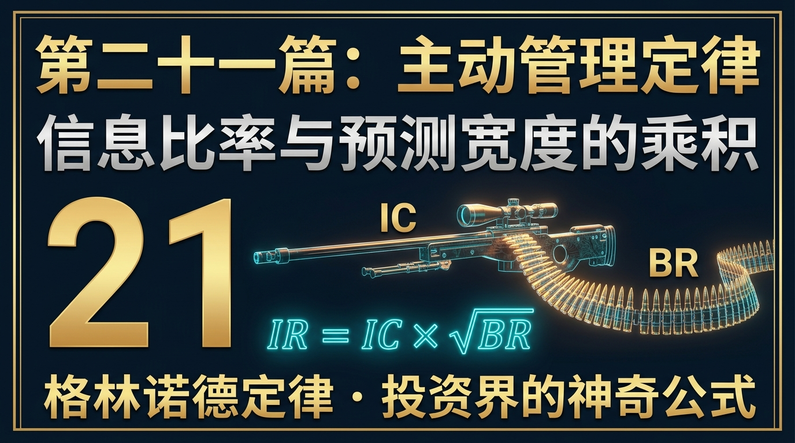
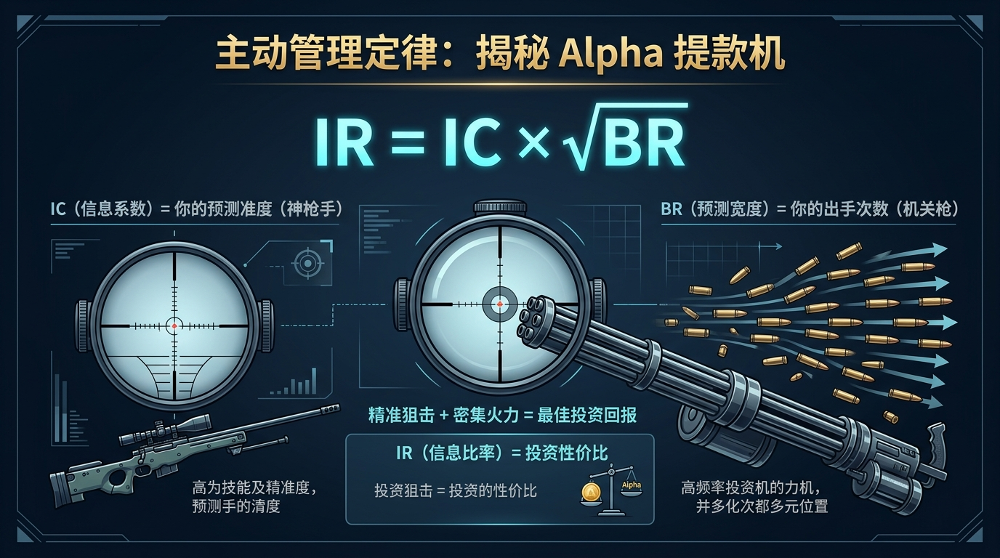
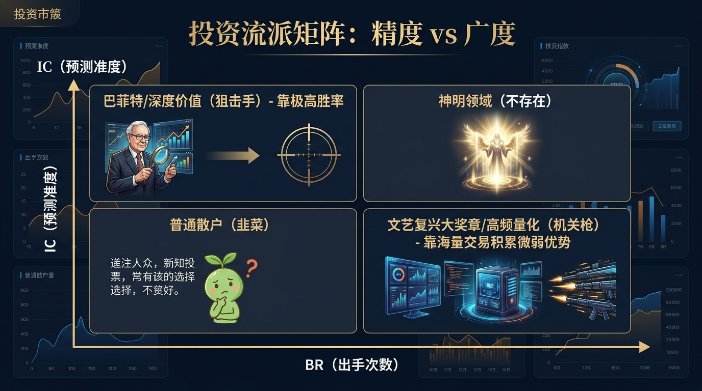
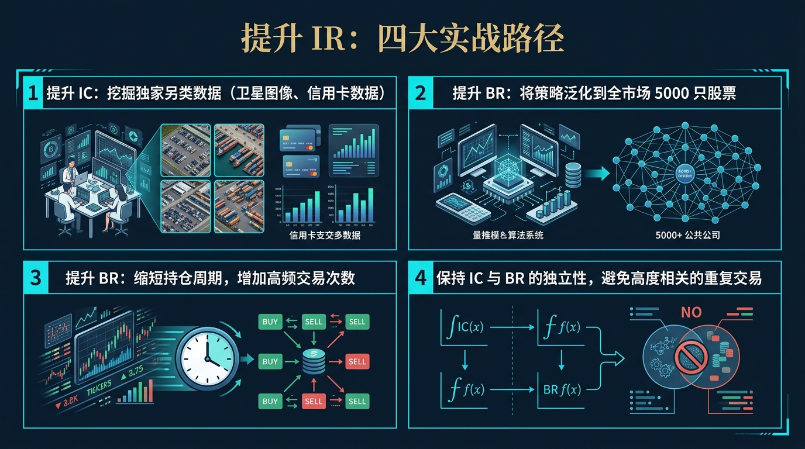
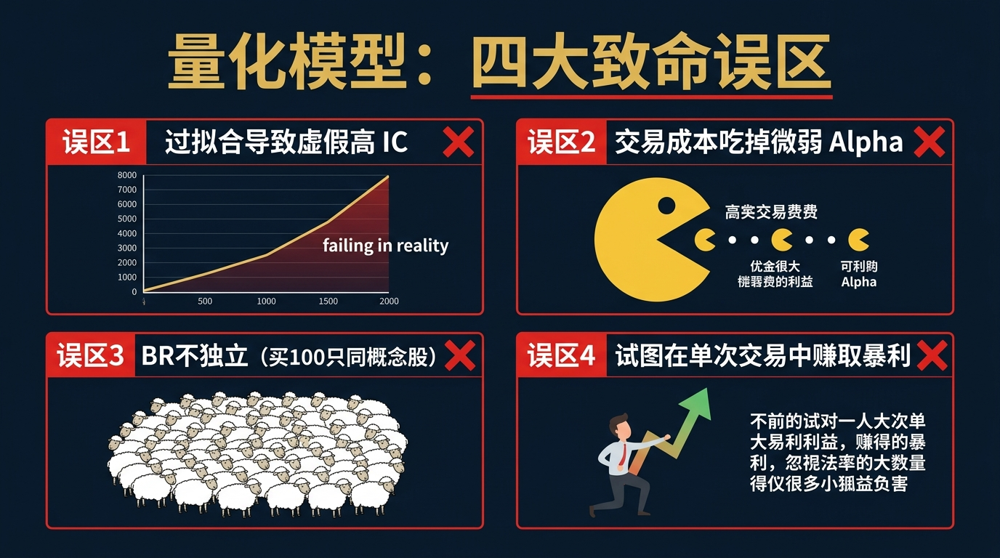

# 股票市场的数学原理 · 第21篇
# 主动管理定律：信息比率与预测宽度的乘积
### The Fundamental Law of Active Management — IR = IC × √BR

---

> **文艺复兴科技 · Two Sigma · 千禧年基金 实施降维打击的绝对圣杯**
> 
> 🕐 阅读时间：约30分钟 | 📊 难度：⭐⭐⭐⭐⭐ | 🎯 核心收获：彻底明白为什么靠直觉和深研的“主观股票大神”，最终在长期业绩的稳定性上，必然会被胜率只有51%的无情“量化机器”无情碾压。

---

## 📖 引言：为什么巴菲特只有一个，但量化巨头却能量产印钞机？

在传统的股票投资世界里，存在着一种“工匠精神”。
研究员们为了弄清楚一家公司的前景，会去实地调研、数厂房外的货车数量、访谈上下游供应商、熬夜拆解长达上百页的财务报表。如果一个分析师的胜率很高（比如他推的 10 只股票有 7 只翻倍了），他就会被称为“股神”。

但在对冲基金的最高殿堂——顶级量化机构（如文艺复兴大奖章基金）里，没有人去数货车，也没有人关心公司的董事长是谁。他们的算法模型每天买卖几千只根本叫不上名字的股票，而且他们的**单次胜率仅仅只有可怜的 51% 到 52%**。

**一个胜率只有 51% 的机器，凭什么能连续 30 年做到年化 66% 的恐怖收益，彻底碾压那些胜率高达 70% 的华尔街明星基金经理？**

答案隐藏在现代量化投资界最伟大、也是被保密得最深的一个数学公式里——**主动管理基本定律（The Fundamental Law of Active Management）**。

如果你不懂这个公式，你永远无法理解量化基金（Quant Funds）到底在赚什么钱，你也会永远陷入“如何把单只股票研究得更透彻”的传统散户思维陷阱中。

---

## 一、起源：从黑箱到圣杯的数学觉醒

20 世纪 80 年代末，量化投资还处于蛮荒时期。虽然人们知道计算机能算得很快，但大家并没有一个统一的理论来解释：**主动投资经理（无论是人类还是机器）的价值到底该怎么被精确度量？**

1989 年，BGI（巴克莱全球投资，后被贝莱德收购）的两位量化先驱——**理查德·格里诺（Richard Grinold）**和**罗纳德·卡恩（Ronald Kahn）**提出并完善了一个极其优雅的公式。
他们发现，一个投资经理的超额赚钱能力，并不完全取决于他“预测得有多准”，而是取决于他**“准确度”与“下注次数”的完美结合**。

这个理论一经发表，立刻成为了量化投资界的“牛顿第二定律”。它从根本上解释了为什么高频交易（HFT）、多因子模型（Multi-Factor Models）和统计套利（Statistical Arbitrage）在数学上具有不可战胜的绝对优势。

---

## 二、核心公式：解构量化界的“牛顿定律”

主动管理基本定律的公式极其简洁，但每一个变量都直指交易的核心本质：

$$\boxed{ IR \approx IC \times \sqrt{BR} }$$

我们把这个公式拆解开来，看看量化巨头们是如何操控这三个变量的：

| 符号 | 名称 | 现实物理意义 | 在股票量化中的意思 |
|------|------|-------------|------------------|
| **$IR$** | **信息比率** (Information Ratio) | **最终的战斗力** | 衡量投资经理获取**超额收益的稳定性**。IR 越高，代表赚取超额收益的能力越强、波动越小。这是机构考核的唯一终极指标。（优秀基金经理的 IR 通常在 0.5，顶级量化能做到 2.0 以上） |
| **$IC$** | **信息系数** (Information Coefficient) | **单次预测的准度** | 你的预测与未来真实收益的**相关系数**。IC = 1 代表你是神（100%猜对）；IC = 0 代表你跟掷硬币没区别。由于金融市场极度嘈杂，顶尖量化的 IC 通常只有 **0.03 到 0.05**（胜率只比 50% 稍微高一丁点）。 |
| **$BR$** | **预测宽度** (Breadth) | **独立下注的次数** | 你一年内能够进行的**相互独立的预测次数**。这是人类与机器拉开差距的致命变量。 |

### 🧮 致命的根号机制：$\sqrt{BR}$ 的降维打击

为什么公式里是 $\sqrt{BR}$（根号宽度）而不是直接乘以 $BR$？
因为根据大数定律和方差的可加性，收益的期望值随着次数呈线性增长（$BR$），但风险（标准差）只随着次数的平方根增长（$\sqrt{BR}$）。二者相除，最终的绩效稳定性（IR）与预测次数的平方根成正比。

这就意味着，**如果你想让你的业绩稳定性翻倍，你不需要把你的“预测准确率（IC）”翻倍（在股市里这几乎不可能），你只需要把你的“独立交易次数（BR）”提高 4 倍！**

---

## 三、四大类比：彻底理解预测与频次的直觉

### 类比一：狙击手 vs 重机枪手（主观与量化的区别）
- **人类主观投资者（狙击手）**：极度追求 IC（准度）。你趴在草丛里瞄准了 3 个月，考虑了风速、湿度，力求一发爆头。你的 $IC$ 极高（0.20），但你一年只能开 10 枪（$BR=10$）。
  你的综合战力 $IR = 0.20 \times \sqrt{10} \approx \textbf{0.63}$。
- **量化交易系统（重机枪手）**：完全不在乎单发的准度。它闭着眼睛朝敌军阵地疯狂扫射，很多子弹都打飞了，它的 $IC$ 极低（0.03）。但它一分钟能打出 10,000 发子弹（$BR=10000$）。
  机器的综合战力 $IR = 0.03 \times \sqrt{10000} = 0.03 \times 100 = \textbf{3.0}$。
  **机枪手完爆狙击手。**

### 类比二：赌场的轮盘游戏（微小优势的绝对碾压）
赌场在轮盘赌游戏中的胜率是多少？通常只有 52.6%（因为有两个绿色的 0 和 00）。
对于单次下注（$BR=1$），这个优势极其微弱，赌场甚至可能输钱给游客。但赌场并不靠一次下注赚钱，它靠的是每天接待成千上万名游客，进行数以万计的独立赌局（$BR$ 极大）。
由于 $IR = IC \times \sqrt{BR}$，只要 $BR$ 足够大，赌场每天结账时的盈利曲线是一条没有回撤的笔直斜线。量化基金就是把股市变成了自己开的赌场。

### 类比三：探照灯与满天星（广度决定上限）
一个人类研究员像一盏高亮的探照灯（高 IC），他能把一只股票（比如苹果公司）照得清清楚楚，但他一次只能照亮一个地方。
量化模型像无数颗微弱的星星（低 IC）。每一颗星星的光都很暗淡，但几千只股票的财报、价格、社交媒体情绪，在 0.1 秒内被星光同时覆盖（巨大的 BR）。最后的结果是，满天星光照亮了整个暗夜。

### 类比四：掷硬币的硬核对赌
如果我给你一枚作弊的硬币，正面朝上的概率是 55%（IC>0），背面是 45%。
你愿意只掷 1 次，一次赌 100 万吗？如果你输了，你就破产了。
但如果我允许你掷 1 万次，每次赌 100 块。你绝对会玩！因为在 1 万次的独立样本下（巨大的 BR），大数定律保证你必定能稳定赚走 10 万块，毫无风险。

---

## 四、实战全流程：一场人类与机器的数学较量

让我们用真实的数学参数，对比一位**顶尖的人类基金经理**与一个**普通的量化算法**，看看降维打击是如何发生的。

### 🎬 场景设定
**基金经理 A（股神级人类）**：
- 他极其聪明，对基本面研究透彻，他买入的股票战胜大盘的概率极高，**IC = 0.15**（在金融界这是极高的前瞻预测能力）。
- 他的精力有限，一年只能精挑细选并独立决策 **25 只**股票，因此 **BR = 25**。

**量化算法 B（冷酷的机器）**：
- 它使用的是简单的均值回归因子。模型很普通，预测正确的胜率仅仅比瞎蒙好一点点，**IC = 0.03**。
- 它连接了全市场的数据接口，每天在全市场扫描，一年能在不同的股票上生成 **2500 次**完全独立的交易信号，因此 **BR = 2500**。

### 💻 战力计算（IR 对决）
代入主动管理基本定律公式：
- **人类 A 的 IR** = $0.15 \times \sqrt{25} = 0.15 \times 5 = \textbf{0.75}$
- **量化 B 的 IR** = $0.03 \times \sqrt{2500} = 0.03 \times 50 = \textbf{1.50}$

### 📊 最终大结局与现实意义
- 人类大神 A 的信息比率是 0.75。这在公募基金界已经非常优秀，但他的净值曲线依然会有明显的波动和回撤，经常要经历几个月的“水下期”。
- 量化机器 B 的信息比率高达 1.50！它的业绩稳定性是人类大神的两倍。它的资金曲线呈现出极其平滑的 45 度角向上爬升，几乎没有像样的回撤。
**量化基金不需要培养“股神”，它只需要海量的数据处理能力，就能在夏普比率和信息比率上把人类按在地上摩擦。**

---

## 五、著名使用者：量化巨头的敛财密码

### 🖥️ 文艺复兴科技（Renaissance Technologies）
- **灵魂人物**：詹姆斯·西蒙斯（Jim Simons）
- **核心逻辑**：西蒙斯曾公开承认，大奖章基金的交易胜率仅仅只有 **50.75%**。这意味着他们的 $IC$ 极低（仅略大于0）。但他们每天在全球市场上进行数百万次的高频和中高频交易（极其恐怖的 $BR$）。
- **量化结果**：正是通过无穷大的 $BR$，乘以极微小的 $IC$，大奖章基金创造了连续 30 年、年化收益率超过 66%、且几乎从未在自然年亏损过的神迹。他们把 $IR \approx IC \times \sqrt{BR}$ 运用到了物理学极限。

### 🌌 世坤投资（WorldQuant）
- **核心逻辑**：世坤投资的创始人 Igor Tulchinsky 提出了“Alpha 工厂”理念。他们不去寻找一个能一招致命的超级完美因子，而是雇佣全世界的兼职研究员，写出了几百万个极其微弱的 Alpha 因子。
- **降维打击**：就算单个因子的预测能力微乎其微，但将数百万个独立的弱因子叠加在一起（爆炸性的 $BR$），整个多因子模型的赚钱能力变得极其稳定且恐怖。

---

## 六、长期表现：为什么散户拿不住好股票？

如果你是一个散户，你必然受制于主动管理定律的物理限制。
假设你的选股能力极强，IC 达到了 0.10。但由于资金量小且精力有限，你一年只交易 4 次（BR = 4）。
你的 $IR = 0.10 \times \sqrt{4} = 0.20$。

这意味着什么？信息比率 0.20 代表你的收益完全被市场的随机波动（噪音）淹没。
在一年中，你可能明明选对了股票（公司业绩大增），但刚好碰上宏观大跌，你的股票跟着大跌。在长达几个月的时间里，你看到的是账面亏损。你的心态会崩溃，你会怀疑自己的选股逻辑，最终在黎明前割肉。

**散户之所以拿不住，不是因为认知不够，而是因为 BR 太小，导致大数定律无法在你极短的投资寿命内生效。你的系统充满了噪音，而你却误把噪音当成了失败的信号。**

---

## 七、六大实战使用场景

1. **量化多因子模型构建**：为什么量化基金要用“多因子”而不是单因子？因为加入彼此不相关的市值因子、动量因子、基本面因子，本质上是在不降低 IC 的情况下，强行提高策略的独立宽度 BR，从而提高整体夏普比率。
2. **高频交易（HFT）的理论基石**：高频交易员每天抓取万分之一的价差。他们的 IC 随着微秒级的消逝而快速衰减，唯一的盈利方式就是把日内交易次数 BR 提高到几万次。
3. **股票池的分散化策略**：如果你研发了一个信号，原来只在沪深300（300只股票）里运行。现在你把它原封不动地推广到中证1000（1000只股票）里。只要信号依然有效，你的 BR 直接提升了 3 倍，你的资金曲线会瞬间变得平滑得多。
4. **统计套利（Pairs Trading）**：同时做多可口可乐、做空百事可乐。这种配对交易剥离了市场宏观波动，虽然每对股票的利润极薄（低 IC），但可以同时在全市场寻找几千对这样的协整关系（高 BR）。
5. **破解“专家迷信”**：当你看到某个大V号称自己有一套“必胜战法”时，问他两个问题：这个战法过去验证过多少次独立信号（BR）？预测相关度是多少（IC）？如果他一年只喊单 3 次，他赚钱纯靠运气。
6. **个人投资者的自我救赎**：既然散户的 BR 注定很低，那么唯一的出路就是**被动指数化投资（ETF）**。放弃获取超额收益（Alpha）的幻想，直接拿市场的平均收益（Beta）。

---

## 八、常见错误与误区：量化交易的幻觉

掌握了公式不代表你能成为量化之王。很多人在应用公式时，犯了致命的统计学错误：

| # | 致命错误认知 | 核心症状 | 毁灭性后果 | 正确的数学认知 |
|---|------------|---------|------------|-------------|
| 1 | **虚假的独立性（伪BR）** | 发现动量策略赚钱，于是同时买入了 100 只暴涨的科技股，以为自己的 BR = 100。 | 当科技股泡沫破裂时，100只股票同时暴跌。真实 BR 只有 1。遭遇系统性黑天鹅重创。 | 公式中的 BR 必须是**相互独立**的预测！同行业的股票相关性极高，不能简单相加。 |
| 2 | **无底线追求高频** | 认为交易次数越多越好，写了个程序每天交易 1 万次。 | 单次预测能力 IC 已经被交易成本（滑点、手续费）吃成了负数。交易越多亏得越快。 | 机器扫射的前提是你的子弹（IC）必须是正的，扣除手续费后，IC 依然要大于 0。 |
| 3 | **过度拟合的幻觉IC** | 在历史回测中加入了 50 个参数，强行把历史 K 线拟合出了 0.8 的超高 IC。 | 未来是未知的，模型上线第一天就崩溃，实盘 IC 变为负数。 | 对过高的历史 IC 保持极度警惕，真实世界的 IC 极难超过 0.05。 |
| 4 | **放弃了对逻辑的深究** | 觉得既然靠 BR 就能赢，那就用机器学习乱挖因子，也不管因子背后有没有经济学逻辑。 | 挖掘出“北京下雨与贵州茅台股价正相关”的伪信号，实盘失效。 | 量化不是统计游戏，任何因子背后都必须有坚实的人类行为学或经济学基础支撑。 |

---

## 九、局限性（诚实的评估）

主动管理定律虽然被称为量化圣杯，但它在真实世界的物理边界限制下，存在着刚性天花板：

| 局限性 | 具体表现 | 应对方案 |
|-------|---------|---------|
| **交易成本的深渊** | 随着 BR 的提升（交易越来越频繁），印花税、佣金、买卖滑点（Slippage）会呈几何级数上升，最终将微薄的 IC 完全吞噬。 | 必须引入极其严苛的算法交易（TWA/VWAP），甚至做市商策略来降低滑点。 |
| **策略容量上限（Capacity）** | 当你的基金规模达到 100 亿时，你哪怕只买全市场 1% 的股票，也会因为你的买单太大而自己把价格拉上去。高频策略的资金容量极小。 | 这就是为什么大奖章基金规模永远锁定在 100 亿美元左右，赚的利润全部分红，绝不扩大规模。 |
| **相关性的暴雷** | 在平时的市场里，各因子的预测是独立的。但在极端恐慌（黑天鹅）下，所有股票的相关性瞬间变为 1。此时你的巨大 BR 会瞬间缩减为 1。 | 再次回到第17篇的解决方案：必须在系统外保留绝对的防爆减震层（如买入看跌期权）。 |

---

## 十、实战SOP：5步构建你的Alpha优势

如果你想走量化路线，不要再去看K线图，请严格按照以下步骤打造你的机器：

**Step 1：寻找微小的非有效性（挖掘 IC）**
寻找市场上散户容易犯错的地方（如：过度反应、动量惯性、财务数据滞后）。哪怕这个规律只有 52% 的概率是对的，只要它是真实存在的逻辑，把它写成代码因子。

**Step 2：将预测正交化（确保独立性）**
如果你有两个因子（比如估值因子和盈利因子），必须用数学方法（如斯皮尔曼秩相关、PCA 主成分分析）剔除它们之间的相关性。确保它们提供的预测是真正正交（互相垂直、不重合）的。

**Step 3：横向与纵向拓宽空间（扩张 BR）**
横向：把这个因子应用到全市场 5000 只股票上。
纵向：把策略的持仓周期从 1 个月缩短到 1 周。
尽你所能，在不增加过多手续费的前提下，大幅提高每年的交易频次。

**Step 4：严格测算交易摩擦成本**
在回测系统中扣除双边千分之三的滑点和手续费。如果扣除后资金曲线立刻向下掉头，说明你的 IC 太脆弱，直接放弃该策略。

**Step 5：组装多因子工厂（组合管理）**
不要依赖单一的动量模型。将 10 个有效且互不相关的低 IC 因子，赋予不同的权重融合在一起。你将获得一个夏普比率超过 2.0，资金曲线如画图般平滑向上、几乎没有回撤的印钞组合。

---

## 十一、本篇总结

主动管理基本定律揭开了金融市场残酷的食物链底色。

| 升级前的思维（主观散户思维） | 升级后的思维（量化机器思维） |
|---------------------------|---------------------------|
| 倾注所有感情，深研一只股票，期待它翻 10 倍 | 感情毫无意义，把资金分散到 1000 只预期收益微正的股票上 |
| 胜率决定一切，追求一击必杀的完美战法 | 胜率只要超过 50% 即可，依靠**高频次和独立性的大数定律**碾压 |
| 亏损是因为我研究得不够深，我下次要更努力 | 亏损是因为单次样本的随机扰动。只要逻辑对，继续执行第 1001 次交易 |
| 投资是一门依靠直觉和胆识的艺术 | 投资是一场纯粹的概率游戏和工厂流水线工程 |

最终，你需要把这句话刻在你的量化服务器上：

$$\boxed{\text{不要试图成为百发百中的神枪手，要去建造一台倾泻百万发子弹的概率收割机。}}$$

但我们讲到现在，无论是黑天鹅、破产概率还是量化宽度，我们似乎都在讨论“股票”或“现货”市场本身。
然而，在现代金融工程的皇冠上，镶嵌着一颗最璀璨的明珠。这个诞生于 1973 年的数学公式，不仅直接催生了一个价值百万亿美元的衍生品帝国，更让两位发明者直接拿下了诺贝尔经济学奖。

下一篇，我们将瞻仰人类金融数学的最高杰作——**B-S期权定价模型（Black-Scholes Model）**。看看天才们是如何用物理学中的热传导方程，给时间、波动与未来的恐惧精准定出价格的。

## 🔗 完整系列导航

点击展开查看全系列 25 篇文章目录

### 🧱 第一模块：地基篇 — 概率与期望思维
- [第01篇：凯利公式_仓位管理的黄金法则](./第01篇_凯利公式_仓位管理的黄金法则.md)
- [第02篇：期望值理论_所有决策的基石](./第02篇_期望值理论_所有决策的基石.md)
- [第03篇：大数定律_时间是你最好的朋友](./第03篇_大数定律_时间是你最好的朋友.md)
- [第04篇：中心极限定理_分散投资的数学证明](./第04篇_中心极限定理_分散投资的数学证明.md)
- [第05篇：复利定律_财富的雪球效应](./第05篇_复利定律_财富的雪球效应.md)

### 🔭 第二模块：选机会篇 — 识别高概率交易
- [第06篇：均值回归_市场的钟摆定律](./第06篇_均值回归_市场的钟摆定律.md)
- [第07篇：动量效应_顺势而为的数学依据](./第07篇_动量效应_顺势而为的数学依据.md)
- [第08篇：贝叶斯推断_实时更新你的判断](./第08篇_贝叶斯推断_实时更新你的判断.md)
- [第09篇：安全边际_价值投资的概率护城河](./第09篇_安全边际_价值投资的概率护城河.md)
- [第10篇：因子投资_系统性超越市场的秘密](./第10篇_因子投资_系统性超越市场的秘密.md)

### ⚖️ 第三模块：配置篇 — 资产组合与仓位管理
- [第11篇：现代投资组合理论_有效前沿的边界](./第11篇_现代投资组合理论_有效前沿的边界.md)
- [第12篇：夏普比率_策略质量的标准尺](./第12篇_夏普比率_策略质量的标准尺.md)
- [第13篇：风险平价策略_穿越经济周期的秘密](./第13篇_风险平价策略_穿越经济周期的秘密.md)
- [第14篇：最优仓位管理_Optimal-f_凯利公式的工程级进化](./第14篇_最优仓位管理_Optimal-f_凯利公式的工程级进化.md)
- [第15篇：相关性与分散化_降低风险的数学奥秘](./第15篇_相关性与分散化_降低风险的数学奥秘.md)

### 🛡️ 第四模块：风控篇 — 极端状态下的生死局
- [第16篇：VaR风险价值_如何量化你能承受的最大亏损](./第16篇_VaR风险价值_如何量化你能承受的最大亏损.md)
- [第17篇：黑天鹅事件_极端风险的数学本质](./第17篇_黑天鹅事件_极端风险的数学本质.md)
- [第18篇：蒙特卡洛模拟_用随机数预测未来](./第18篇_蒙特卡洛模拟_用随机数预测未来.md)
- [第19篇：破产风险_赌徒破产问题与资金管理](./第19篇_破产风险_赌徒破产问题与资金管理.md)
- [第20篇：最大回撤与资金恢复时间_衡量策略韧性](./第20篇_最大回撤与资金恢复时间_衡量策略韧性.md)

### 🔬 第五模块：量化进阶篇 — 升华与融合
- [第21篇：主动管理定律_信息比率与预测宽度的乘积](./第21篇_主动管理定律_信息比率与预测宽度的乘积.md)
- [第22篇：B-S期权定价模型_金融工程的皇冠](./第22篇_B-S期权定价模型_金融工程的皇冠.md)
- [第23篇：行为金融学数学化_前景理论与损失厌恶](./第23篇_行为金融学数学化_前景理论与损失厌恶.md)
- [第24篇：投资组合理论大融合_打造你的全天候财富机器](./第24篇_投资组合理论大融合_打造你的全天候财富机器.md)
- [第25篇：终章_数学的尽头是哲学_概率的尽头是人生](./第25篇_终章_数学的尽头是哲学_概率的尽头是人生.md)

---
**← 上一篇：[最大回撤与资金恢复时间](./第20篇_最大回撤与资金恢复时间_衡量策略韧性.md)** | **→ 下一篇：[B-S期权定价模型](./第22篇_B-S期权定价模型_金融工程的皇冠.md)**

---
*《股票市场的数学原理》全系列 · 第21篇*
