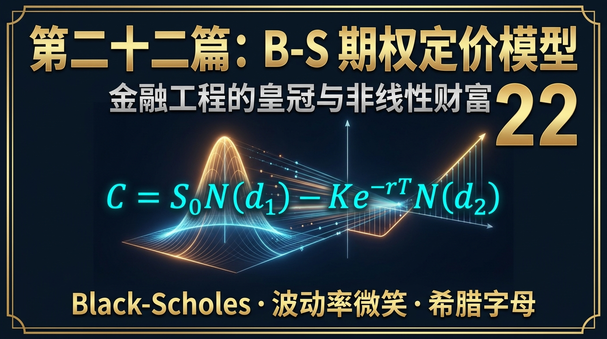
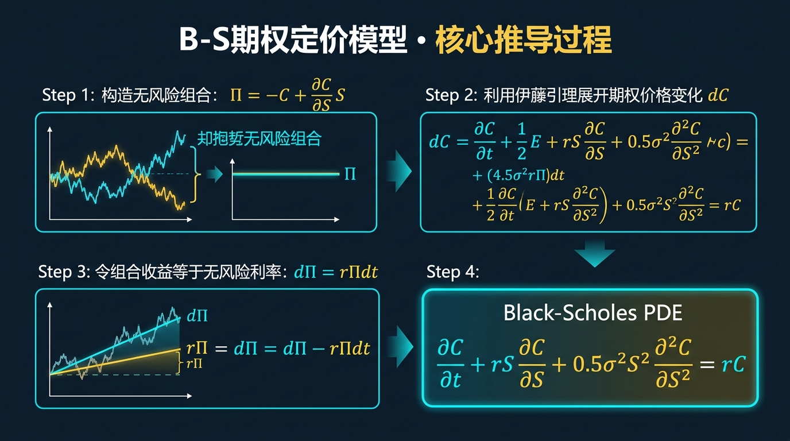
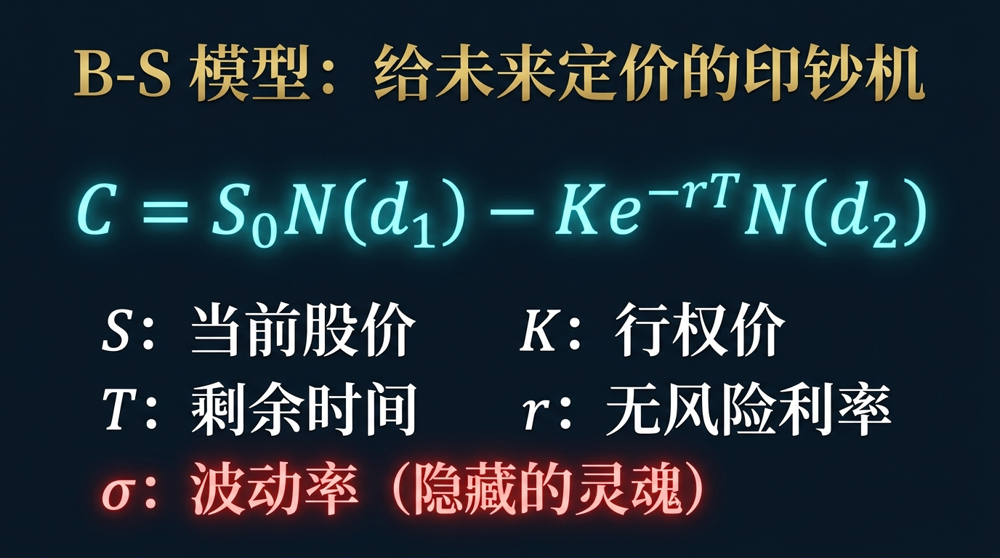
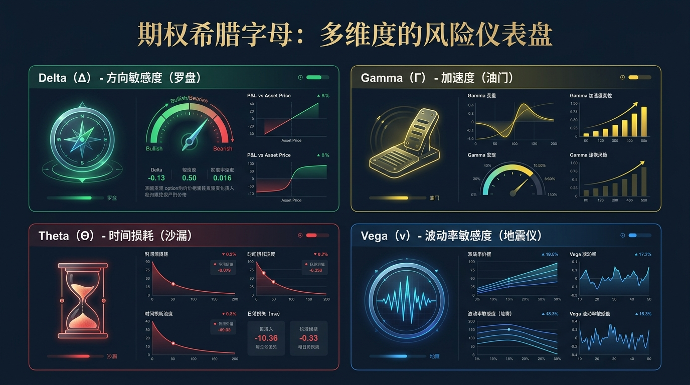
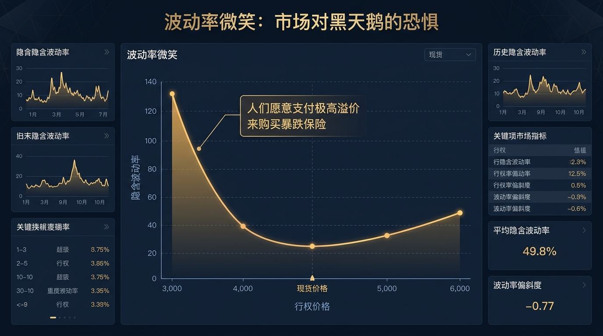
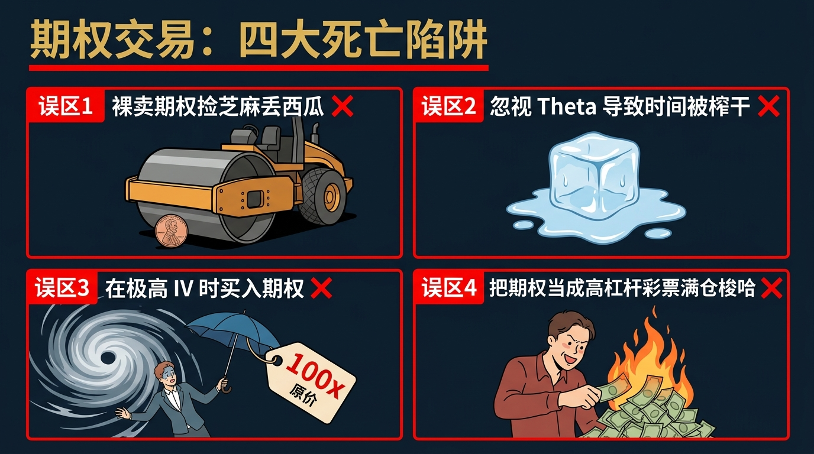

# 股票市场的数学原理 · 第22篇
# B-S 期权定价模型：金融工程的皇冠
### The Black-Scholes Model — The Crown Jewel of Financial Engineering

---

> **罗伯特·默顿 · 期权做市商 · 全球衍生品交易员 每天都在计算的生存法则**
> 
> 🕐 阅读时间：约30分钟 | 📊 难度：⭐⭐⭐⭐⭐ | 🎯 核心收获：理解人类如何用物理学方程给“未来的时间”和“恐惧的波动”精准标价，掌握期权交易中最核心的五个字母密码。

---

## 📖 引言：未来到底值多少钱？

想象一下，你站在一片荒地前。
一个月后，政府会宣布一个决定：如果规划地铁，这块地将暴涨到 1000 万；如果不规划，它将一文不值。
此时，地主向你提出一个交易：“你现在给我一笔小钱，我就卖给你一个权利——一个月后，无论地价多贵，你都有权用 500 万的价格把这块地买走。当然，如果地价跌了，你可以放弃购买，你损失的仅仅是你现在给我的这笔小钱。”

请问：为了买这个“未来以 500 万买入的权利”，**你现在到底愿意支付多少钱作为这笔“小钱”（期权费）？**
是 10 万？50 万？还是 100 万？

在 1973 年之前，全人类的金融家面对这个问题都在抓瞎。大家只能靠拍脑袋、靠赌博经验来给这种“权利”定价。有人出 50 万，有人觉得 10 万都嫌贵。因为未来的不确定性像一团迷雾，根本无法被量化。

直到三个数学和经济学天才，直接借用了物理学中用来描述**“金属物体导热”的热传导方程**，硬生生地把这团迷雾撕开了一条裂缝。他们写出了金融史上最伟大、最复杂、也最吸金的一个公式。
这个公式不仅直接催生了如今规模高达上百万亿美元的全球衍生品市场，更让其中两位发明者直接拿下了诺贝尔经济学奖。

今天，我们要跨越散户的思维壁垒，直接拆解金融工程金字塔顶端的绝对皇冠——**Black-Scholes 期权定价模型（B-S 模型）**。

---

## 一、起源：从热传导物理学到华尔街的圣杯

时间回到 20 世纪 60 年代末。
当时，期权（Option，即未来买卖资产的权利）在市场上已经存在，但因为没有人知道它到底值多少钱，交易量极小，就像赌场里的地下黑市。

麻省理工学院（MIT）的**费希尔·布莱克（Fischer Black）**和**迈伦·斯科尔斯（Myron Scholes）**决定解决这个千古难题。
布莱克是一位拥有物理学背景的数学家。他在满是草稿纸的黑板上推导时，突然发现：在给股票“未来的概率”建模时，写出来的偏微分方程，竟然和物理学中的**热传导方程（Heat Equation）**长得一模一样！

在物理学中，热传导方程描述的是热量如何在一根铁棒中随着时间慢慢扩散；
在金融学中，这个方程描述的是**股票价格的概率分布如何随着时间慢慢扩散**！

但他们的方程还差最后一块拼图。此时，另一位天才**罗伯特·默顿（Robert Merton）**加入了他们。默顿引入了当时最前沿的随机微积分学（Itô's Calculus），利用“无风险套利”的物理学守恒思想，补全了最后的拼图。

**1973 年**，这篇名为《期权定价与公司负债》的论文正式发表。同年，芝加哥期权交易所（CBOE）成立。
当交易员们把这个带有长串微积分的复杂公式输入当时的初代计算机后，整个华尔街沸腾了。人类第一次，能够给“时间”和“波动”打上一个精确的价格标签。期权交易量在短短几年内呈指数级爆炸。
1997年，由于布莱克已经离世，斯科尔斯和默顿因为这个公式被授予了诺贝尔经济学奖。

---

## 二、核心公式：解构皇冠上的五颗宝石

为了让你理解，我们不展示让人崩溃的偏微分方程推导过程，我们直接看 B-S 模型的最终解——**欧式看涨期权（Call Option）的定价公式**：

$$\boxed{ C = S_0 N(d_1) - K e^{-rT} N(d_2) }$$

虽然看起来像天书，但我们用人话把它劈成两半：
**期权的价格 ($C$) = (买入股票的期望收益) - (支付行权价的现值成本)**

更重要的是，公式内部只包含**五大硬性物理参数**。只要把这 5 个数字输入电脑，期权的价格就会像计算 $1+1=2$ 一样精确地吐出来。

| 输入变量 | 符号 | 现实物理意义 | 在股票期权中的意思 |
|---------|------|-------------|------------------|
| **1. 当前股价** | $S_0$ | 你的起点位置 | 股票现在的现货价格。股价越高，看涨期权越贵。 |
| **2. 行权价** | $K$ | 你的终点目标 | 你约定未来买入该股票的价格。行权价定得越高，看涨期权越便宜（因为越难达到）。 |
| **3. 剩余时间** | $T$ | 你有多少时间去创造奇迹 | 距离期权到期还有多少天。**时间就是金钱**，时间越长，发生暴涨奇迹的概率越大，期权越贵。 |
| **4. 无风险利率**| $r$ | 资金的时间成本 | 通常是美国国债利率。因为你现在花一点点期权费锁定了未来的买入价，你省下了一大笔本金可以去存银行吃利息。 |
| **5. 波动率** | $\sigma$ | **跳动的心脏（最核心参数）** | 股票历史价格上蹿下跳的剧烈程度。**这是唯一一个无法直接看到的参数**。股票越像过山车（波动率极大），它暴涨冲破行权价的概率就越大，期权就越贵！ |

> *$N(d_1)$ 和 $N(d_2)$ 是累积正态分布概率函数，你可以简单理解为“这笔交易能赚钱的概率”。*

---

## 三、四大类比：彻底理解期权定价的直觉

如果你觉得公式太抽象，我们用买保险的逻辑来彻底摧毁理解壁垒。**买期权，本质上就是买保险。**

### 类比一：汽车保险的波动率（波动率 $\sigma$ 的价值）
你给你的车买车险（看跌期权）。保险公司要收你多少保费（期权费）？
如果你是一个每天只在小区里开 10 迈的老爷爷，你的“波动率”极低，保险公司可能只收你 1000 块。
如果你是一个天天半夜在秋名山漂移的赛车手，你的“波动率”极高，保险公司绝对会收你 10000 块。
**金融铁律：波动率越大，期权越贵。这就是为什么在暴涨暴跌的妖股上，期权贵得离谱。**

### 类比二：燃烧的木屋与时间（时间 $T$ 的价值）
一栋木屋旁边有一条火舌正在蔓延。你现在想给木屋买火灾险。
如果保险只保 1 天（时间 $T$ 极小），火可能还没烧过来，保险很便宜。
如果保险保 1 年（时间 $T$ 极大），木屋被烧毁的概率近乎 100%，保险费将极其昂贵。
**金融铁律：时间是期权的生命。随着到期日临近，期权的时间价值会像沙漏一样无情地流失，这被称为“时间衰减（Theta 损耗）”。**

### 类比三：冰块的融化与希腊字母的诞生

既然期权价格是由 5 个变量共同决定的，当股价涨了 1 块钱时，期权价格会涨多少？这就像在测算“当温度上升 1 度时，冰块融化的速度是多少”。
为此，量化科学家们在 B-S 模型的基础上，对公式求了偏导数，诞生了著名的**期权希腊字母（The Greeks）**：
- **Delta ($\Delta$)**：股价涨 1 块，期权涨多少？（衡量方向速度）
- **Gamma ($\Gamma$)**：股价涨 1 块，Delta 的变化有多快？（衡量方向的加速度）
- **Theta ($\Theta$)**：每过 1 天，期权因为时间流逝会亏多少钱？（时间的冰块融化速度）
- **Vega ($\nu$)**：波动率增加 1%，期权涨多少？（对恐慌情绪的敏感度）

### 类比四：薛定谔的猫（未来的概率坍缩）
买入期权，就是买入了一只薛定谔的猫。在到期日之前，股票价格处于无数种可能性的“概率云”中（这是 B-S 模型通过正态分布算出来的）。这团云是有价值的，所以期权卖得很贵。
但当到期日那一刻来临（$T=0$），概率云瞬间坍缩。要么股票价格大于行权价（你行权赚钱），要么低于行权价（期权瞬间变成废纸，价值归零）。

---

## 四、实战全流程：一场关于隐含波动率（IV）的较量

为了展示 B-S 模型的降维打击能力，我们来看看量化交易员在财报季是如何通过计算“波动率”来收割散户的。

### 🎬 场景设定
- **标的**：特斯拉（TSLA），当前股价 $S_0 = 200$ 美元。
- **事件**：明天特斯拉将发布极度重要的财报。
- **散户行为**：散户小韭极度看好马斯克，认为明天财报超预期，股价会暴涨。于是他在市场上花了 **$10** 块钱，买入了一张一周后到期、行权价为 210 美元的看涨期权（Call）。

### 💻 B-S 模型计算的反击
专业量化交易员拿到这张期权报价后，立刻进行**逆向反推**。
因为在 B-S 模型的 5 个变量中，股价已知（200）、行权价已知（210）、时间已知（7天）、利率已知（5%），而且目前市场给这张期权的标价也是已知的（$10）。
把这 5 个已知数代入方程，唯一不知道的就是 $\sigma$（波动率）。

计算机在 0.1 秒内解出了方程：**隐含波动率（Implied Volatility, IV）高达 120%！**

| 参数状态 | 散户的认知 | B-S 模型的真实认知 | 物理意义 |
|---------|-----------|------------------|---------|
| **预期暴涨** | “财报一出，股价一定能涨到 220 块，这 10 块钱期权费太值了！” | “按照 IV=120% 计算，市场预期明天的振幅必须超过 ±15% 才能回本。” | 散户买入的不是方向，而是极度昂贵的“波动预期”。 |
| **真实结果** | 第二天财报公布，特斯拉大涨 **+8%**，股价来到 216 块。 | 实际波动率只有 8%，远低于预期的 15%。IV 瞬间从 120% 暴跌回正常的 50%。 | 预期落地，悬念消失（Vega暴跌）。 |

### 📊 最终大结局（著名的 IV Crush 波动率杀）
第二天，小韭兴高采烈地打开账户，发现特斯拉果然大涨了 8%！但他惊恐地发现，他花 10 块钱买的看涨期权，不仅没赚钱，反而跌到了 **$7** 块钱！
**为什么正股大涨了，看涨期权却亏钱了？**
因为他买入时，IV 极度昂贵（他支付了极高的情绪溢价）。财报公布后，不确定性消失，B-S 模型中的 $\sigma$ 断崖式下跌。Vega 的亏损（杀溢价）远远盖过了 Delta 的盈利（涨方向）。
量化做市商正是利用 B-S 模型看透了这一点，在财报前疯狂把昂贵的期权卖给散户，收割了巨额的“智商税”。

---

## 五、著名使用者：掌握核武器的成与败

### 🥇 现代期权做市商（Options Market Makers）
- **身份**：Citadel Securities、Susquehanna 等顶级量化做市商。
- **实战做法（Delta 中性套利）**：他们从不赌方向。当散户向他们买入看涨期权时（他们做空了 Delta），他们的机器会立刻在几毫秒内，根据 B-S 模型计算出的 Delta 值，在现货市场买入对应数量的正股。这样就把方向风险（Delta）归零了。他们赚取的，是散户为了赌博而支付的不合理波动率溢价（买卖点差和 Vega）。

### 💀 长期资本管理公司（LTCM）的陨落
- **身份**：1994年成立的对冲基金，其合伙人竟然就是 **迈伦·斯科尔斯** 和 **罗伯特·默顿** 本人（B-S公式的发明者，诺贝尔奖得主）。
- **悲剧结局**：拥有地球上最聪明大脑的基金，利用自己的公式寻找全世界微小的定价偏差。他们加了 25 倍到 100 倍的超级杠杆。1998年，俄罗斯发生主权债务违约（超级黑天鹅），全球资产的波动率瞬间击穿了正态分布的边界。B-S 模型在极度恐慌中失效。短短 4 个月，基金狂亏 46 亿美元，宣告破产，差点把整个华尔街拖下水。
- **启示**：当你过度迷信数学公式，而忘记了市场是由充满恐惧的人类组成时（尾部风险极大），即便是诺贝尔奖得主也会被市场毁灭。

---

## 六、长期表现：被打破的完美假设（波动率微笑）

B-S 模型刚发明时，它有一个完美的数学假设：**资产波动的分布是完美的正态分布。**
这意味着，距离当前价格相同比例的“深度虚值看跌期权（防暴跌）”和“深度虚值看涨期权（防暴涨）”，它们的隐含波动率（IV）应该是一模一样的。画在图表上，应该是一条完美的水平直线。

但在 1987 年的“黑色星期一”（美股单日崩盘 -22%）之后，华尔街的交易员们集体吓破了胆。
从此以后，所有人都在疯狂地高价抢购“防止暴跌的深度虚值看跌期权（Put）”。
如果你今天去画标普 500 指数期权的隐含波动率曲线，你会发现它不再是一条直线，而是呈现出一种不对称的扭曲曲线。
左边的极度看跌期权贵得离谱，右边的极度看涨期权相对便宜。这条曲线，被金融界称为**“波动率微笑（Volatility Smile）”**或“波动率偏斜（Volatility Skew）”。

它是人类对黑天鹅极度恐惧的数学结晶。B-S 模型的正态分布假设，被真实人性的恐惧硬生生地砸出了一个深坑。

---

## 七、六大实战使用场景

1. **备兑看涨（Covered Call）收租**：散户手拿 100 股苹果股票，每个月在 B-S 模型计算出溢价较高时，卖出一张行权价极高的虚值看涨期权。只要股价不暴涨，就能像收房租一样赚取期权费（收割时间价值 Theta）。
2. **期权定价与捡漏**：利用 B-S 公式计算出某只冷门期权的“理论公允价值”。如果市场上的报价远低于理论价值，量化程序立刻买入进行统计套利。
3. **财报季的双买策略（Straddle）**：如果在财报公布前，B-S 模型算出的隐含波动率（IV）低于历史均值（市场极其平静没有防备），同时买入平值的看涨和看跌期权。只要财报后引发巨大的单边暴涨或暴跌，就能用方向上的巨大收益覆盖期权成本。
4. **员工期权（ESOP）估值**：当科技公司给程序员发放期权作为薪酬时，财务部门必须使用 B-S 模型，才能将这笔“未来的权利”折算成今天账面上的具体美元金额，计入财报。
5. **可转债的剥离定价**：A 股市场上的可转债，本质上是“纯债底 + 一张看涨期权”。量化基金利用 B-S 模型单独计算出那张看涨期权的价值，从而判断可转债目前是被高估还是低估。
6. **无损杠杆的合成**：如果极度看好后市但本金不够，不再使用高昂融券利息的杠杆，而是直接买入远期的深度实值期权（Deep In-The-Money），利用高达 80 左右的 Delta，用 10% 的本金撬动 100% 的现货涨幅。

---

## 八、常见错误与误区

买股票是两维的（价格、时间），而期权是三维的（价格、时间、波动率）。降维打击的结果，是无数不懂数学的散户成了做市商的血包：

| # | 致命错误认知 | 核心症状 | 毁灭性后果 | 正确的数学认知 |
|---|------------|---------|------------|-------------|
| 1 | **财报季裸买期权赌方向** | “明天要出好财报，买 Call 必赚！” | 遭遇著名的 IV Crush（波动率杀）。虽然方向猜对了，但期权费大跌，本金血亏。 | 财报前 IV 极度虚高。方向极其确定时，应用正股代替期权，或使用垂直价差策略（Vertical Spread）对冲波动率下降。 |
| 2 | **做“时间”的敌人** | 买入下周就到期的末日期权，指望一把暴富。 | 随着时间 $T \rightarrow 0$，Theta 时间损耗呈指数级加速，最后几天期权价值一天腰斩一次，直至归零。 | 除非你是短线天才，否则普通人应该买入距离到期日至少 **3 个月以上**的长期期权。 |
| 3 | **无知地卖出裸期权** | 听说卖出看跌期权胜率高达 90%，重仓卖出收权利金。 | 遭遇黑天鹅（如2020年熔断），承担无限大风险，一天之内底裤赔光还要倒欠券商 500 万。 | **绝对禁止裸卖期权！** 卖方必须持有足额现货保证金（备兑），或者同时买入一张更远端的期权作为底部保险。 |
| 4 | **把深度虚值当彩票** | 觉得 0.01 美元的深度虚值期权很便宜，买 1 万块钱当刮刮乐。 | Delta 极低接近 0，除非明天发生外星人入侵级别的暴涨，否则到期必然归零率高达 99%。 | 这不是投资，这是给机构捐款。散户应尽量买平值（At-The-Money）或轻度虚值期权。 |

---

## 九、局限性（诚实的评估）

B-S 模型虽然是皇冠，但它因为强行为了让偏微分方程“有解”，做出了几个在现实中不存在的致命假设：

| 局限性 | 具体表现 | 改进方案 |
|-------|---------|---------|
| **常数波动率假设** | 模型假设未来的波动率 $\sigma$ 在整个期权存续期内是固定不变的。但现实中，股市一跌，恐慌情绪会让波动率瞬间飙升。 | 使用更加先进的**局部波动率模型（Local Volatility）**或随机波动率模型（如 Heston Model）。 |
| **禁止跳跃假设** | 模型假设价格是连续且平滑移动的。但现实中，公司宣布破产或被收购，价格会瞬间从 10 块“瞬移”到 1 块。 | 引入包含极端离散跳跃事件的**跳跃扩散模型（Merton Jump-Diffusion Model）**。 |
| **只能算欧式期权** | B-S 公式只能计算“必须在到期日当天”才能行权的欧式期权。无法精确计算提前行权的美式期权（多数个股期权）。 | 对于美式期权，量化界普遍使用我们在第18篇讲到的**蒙特卡洛模拟**，或者**二叉树模型（Binomial Tree）**通过向后倒推来计算。 |

---

## 十、实战SOP：5步构建你的期权防线

哪怕你不用微积分，只要按照这 5 步 SOP 执行，你就能避开期权市场 90% 的坑：

**Step 1：判定当前市场的“情绪水温”**
打开看盘软件的隐含波动率百分位（IV Rank）。
如果 IV 处于历史极低位（如 10%），说明市场麻木，适合**买入期权**（买便宜货）。
如果 IV 处于历史极高位（如 90%），说明市场极度恐慌，只适合**卖出期权**或观望。

**Step 2：选择行权价（计算 Delta）**
如果你只是想替代股票买入，请选择 Delta 在 0.5 左右的**平值期权**，或者 Delta > 0.7 的**实值期权**。拒绝那些 Delta 小于 0.1 的极度虚值垃圾期权。

**Step 3：选择到期日（控制 Theta）**
永远给自己留足“时间”的子弹。买入期权时，尽量选择到期日至少在 60 天甚至 120 天以后的合约。前 30 天时间损耗极慢，最后 30 天损耗像悬崖一样陡峭。

**Step 4：构建组合（对冲残余风险）**
不要裸买或裸卖单一期权。通过买入一张 200 块的 Call，同时卖出一张 210 块的 Call，构建一个“牛市价差（Bull Call Spread）”。这能极大降低你的时间损耗成本。

**Step 5：财报日前一律清仓**
如果你持有方向性期权，在公司公布财报或美联储公布利率决议的**前一秒钟，清仓平盘**。不要拿真金白银去对赌 IV Crush 的反噬。

---

## 十一、本篇总结

B-S 模型的美感在于，它把人类极其复杂的恐惧、贪婪与时间的流逝，全部浓缩进了冰冷的物理学方程中。

| 升级前的思维（现货二维思维） | 升级后的思维（期权多维思维） |
|---------------------------|---------------------------|
| 股票只有涨、跌、平三种走势 | 除了涨跌，我还能单独对冲或交易“时间和波动” |
| 暴涨暴跌是一种倒霉的风险 | 波动率本身就是一种可以被单独买卖的极高价值商品 |
| 在财报公布前重仓买入博一把单边 | 知道财报前波动率极高，坚决做方向对冲甚至反向卖出波动率 |
| 亏损100万是因为我猜错了方向 | 亏损可能是因为我看对了方向，但因为时间耗尽被 Theta 拖死，或者被波动率下降 Vega 反杀 |

最终，你需要把这句话刻在你的衍生品交易面板上：

$$\boxed{\text{在期权市场里，方向可能让你赢利，但无视时间和波动率必然让你毁灭。}}$$

至此，我们已经从纯概率的凯利公式，讲到了评估韧性的最大回撤，拆解了量化对冲基金的赚钱机制，最终登上了现代金融工程的皇冠——期权定价。
但是，所有这些优美的数学模型，都有一个隐藏的终极前提漏洞：**它们假设交易者都是绝对理性的机器。**

然而，市场的真实操盘手，是拥有激素、恐惧、多巴胺和从众心理的碳基生物（人类）。
当完美的数学，遭遇了不完美的人性，这到底是一场灾难，还是一座金矿？

下一篇，也是理论与实战的巅峰交汇之作，我们将彻底进入**行为金融学的数学化（Behavioral Finance）**。看看诺贝尔奖得主丹尼尔·卡尼曼是如何用**前景理论（Prospect Theory）**和价值函数，在数学上证明“为什么亏损 100 块的痛苦，是赚 100 块快乐的 2.25 倍”。

## 🔗 完整系列导航

点击展开查看全系列 25 篇文章目录

### 🧱 第一模块：地基篇 — 概率与期望思维
- [第01篇：凯利公式_仓位管理的黄金法则](./第01篇_凯利公式_仓位管理的黄金法则.md)
- [第02篇：期望值理论_所有决策的基石](./第02篇_期望值理论_所有决策的基石.md)
- [第03篇：大数定律_时间是你最好的朋友](./第03篇_大数定律_时间是你最好的朋友.md)
- [第04篇：中心极限定理_分散投资的数学证明](./第04篇_中心极限定理_分散投资的数学证明.md)
- [第05篇：复利定律_财富的雪球效应](./第05篇_复利定律_财富的雪球效应.md)

### 🔭 第二模块：选机会篇 — 识别高概率交易
- [第06篇：均值回归_市场的钟摆定律](./第06篇_均值回归_市场的钟摆定律.md)
- [第07篇：动量效应_顺势而为的数学依据](./第07篇_动量效应_顺势而为的数学依据.md)
- [第08篇：贝叶斯推断_实时更新你的判断](./第08篇_贝叶斯推断_实时更新你的判断.md)
- [第09篇：安全边际_价值投资的概率护城河](./第09篇_安全边际_价值投资的概率护城河.md)
- [第10篇：因子投资_系统性超越市场的秘密](./第10篇_因子投资_系统性超越市场的秘密.md)

### ⚖️ 第三模块：配置篇 — 资产组合与仓位管理
- [第11篇：现代投资组合理论_有效前沿的边界](./第11篇_现代投资组合理论_有效前沿的边界.md)
- [第12篇：夏普比率_策略质量的标准尺](./第12篇_夏普比率_策略质量的标准尺.md)
- [第13篇：风险平价策略_穿越经济周期的秘密](./第13篇_风险平价策略_穿越经济周期的秘密.md)
- [第14篇：最优仓位管理_Optimal-f_凯利公式的工程级进化](./第14篇_最优仓位管理_Optimal-f_凯利公式的工程级进化.md)
- [第15篇：相关性与分散化_降低风险的数学奥秘](./第15篇_相关性与分散化_降低风险的数学奥秘.md)

### 🛡️ 第四模块：风控篇 — 极端状态下的生死局
- [第16篇：VaR风险价值_如何量化你能承受的最大亏损](./第16篇_VaR风险价值_如何量化你能承受的最大亏损.md)
- [第17篇：黑天鹅事件_极端风险的数学本质](./第17篇_黑天鹅事件_极端风险的数学本质.md)
- [第18篇：蒙特卡洛模拟_用随机数预测未来](./第18篇_蒙特卡洛模拟_用随机数预测未来.md)
- [第19篇：破产风险_赌徒破产问题与资金管理](./第19篇_破产风险_赌徒破产问题与资金管理.md)
- [第20篇：最大回撤与资金恢复时间_衡量策略韧性](./第20篇_最大回撤与资金恢复时间_衡量策略韧性.md)

### 🔬 第五模块：量化进阶篇 — 升华与融合
- [第21篇：主动管理定律_信息比率与预测宽度的乘积](./第21篇_主动管理定律_信息比率与预测宽度的乘积.md)
- [第22篇：B-S期权定价模型_金融工程的皇冠](./第22篇_B-S期权定价模型_金融工程的皇冠.md)
- [第23篇：行为金融学数学化_前景理论与损失厌恶](./第23篇_行为金融学数学化_前景理论与损失厌恶.md)
- [第24篇：投资组合理论大融合_打造你的全天候财富机器](./第24篇_投资组合理论大融合_打造你的全天候财富机器.md)
- [第25篇：终章_数学的尽头是哲学_概率的尽头是人生](./第25篇_终章_数学的尽头是哲学_概率的尽头是人生.md)

---
**← 上一篇：[主动管理定律](./第21篇_主动管理定律_信息比率与预测宽度的乘积.md)** | **→ 下一篇：[行为金融学数学化](./第23篇_行为金融学数学化_前景理论与损失厌恶.md)**

---
*《股票市场的数学原理》全系列 · 第22篇*
