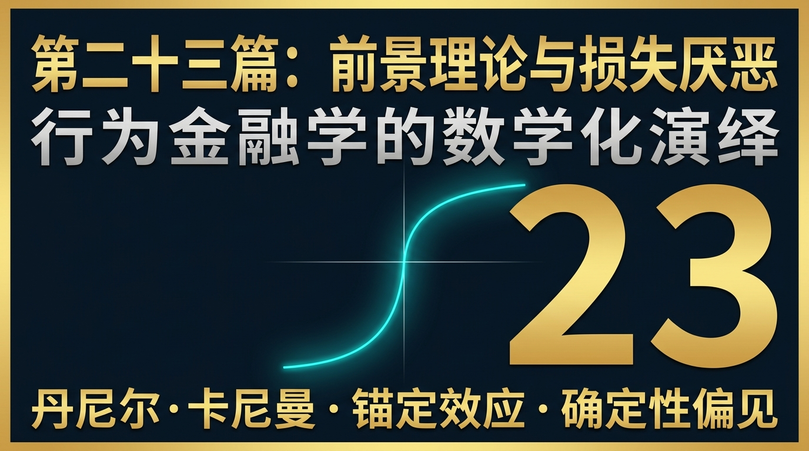
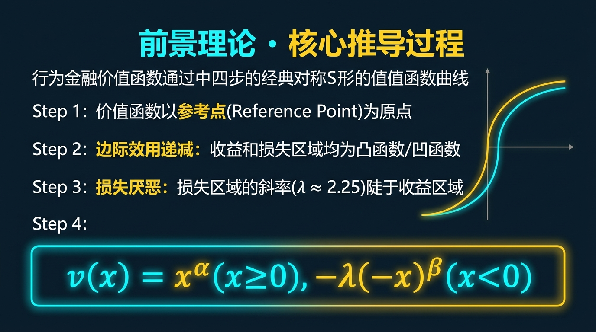
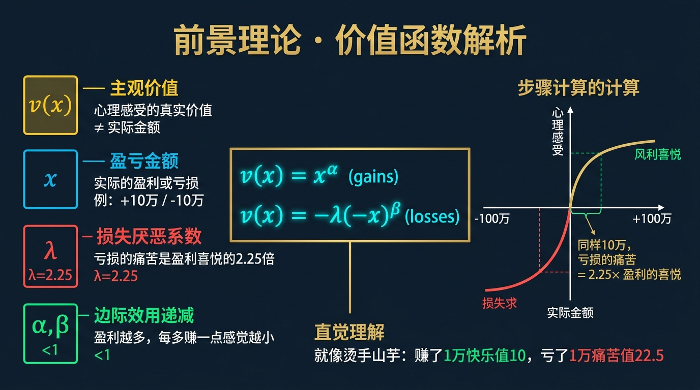
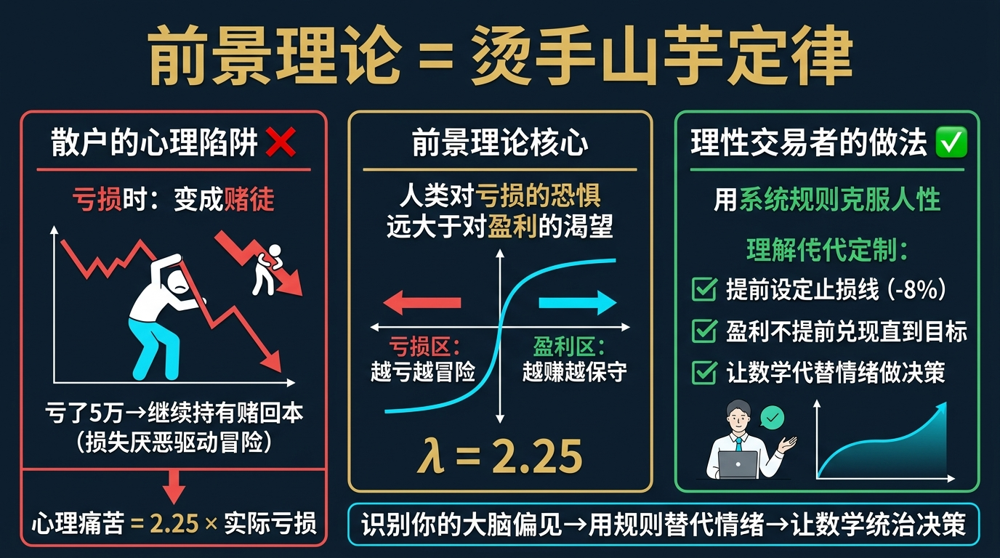
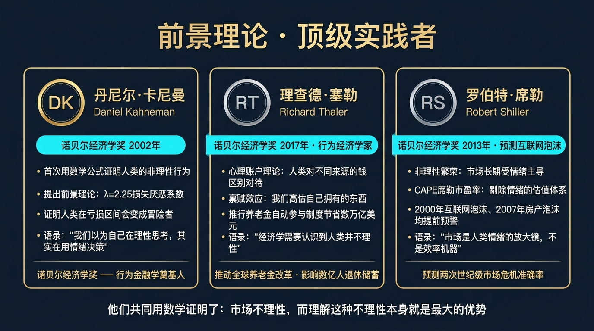
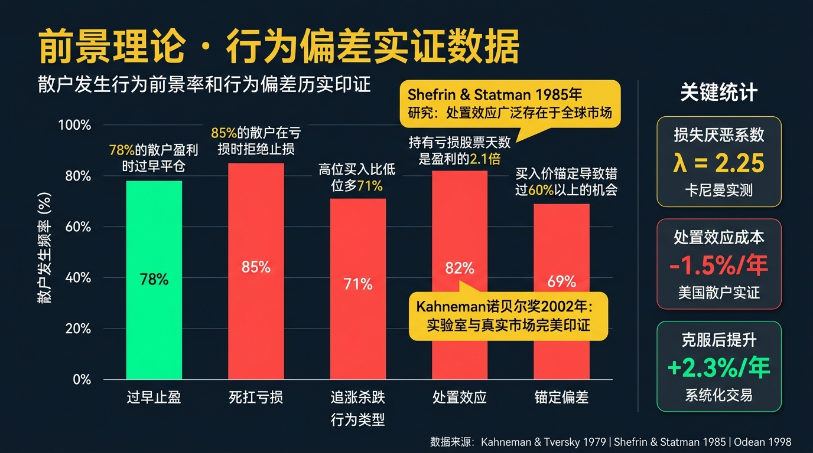
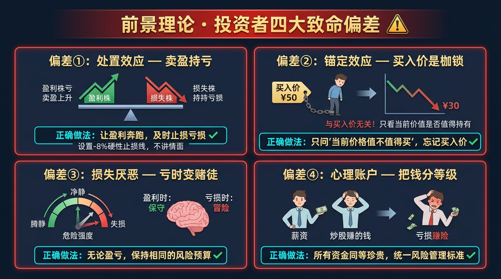
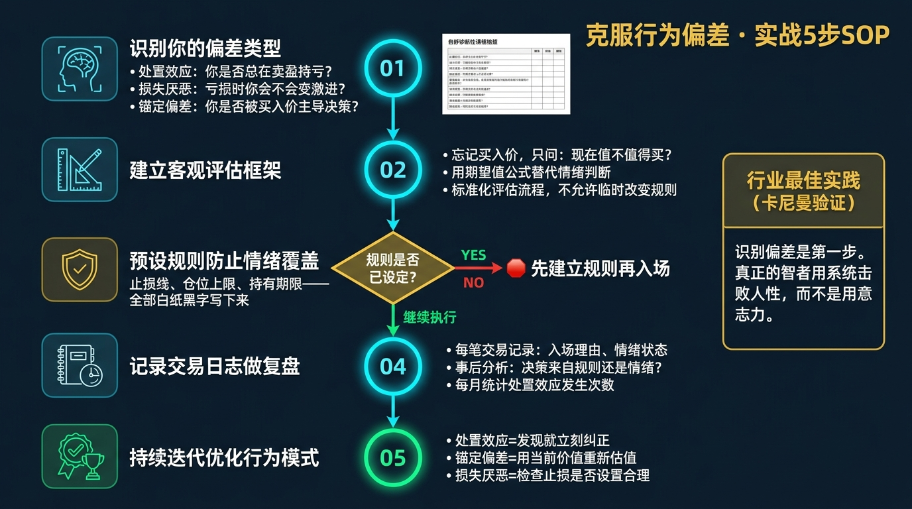

# 股票市场的数学原理 · 第23篇
# 行为金融学数学化：前景理论与损失厌恶
### Mathematical Behavioral Finance — Prospect Theory & Loss Aversion

---

> **丹尼尔·卡尼曼 · 行为经济学家 · 量化收割机 破解散户人性的终极密码**
> 
> 🕐 阅读时间：约30分钟 | 📊 难度：⭐⭐⭐⭐ | 🎯 核心收获：明白为什么你总是“拿不住利润，却能死扛亏损”，并学会用机器纪律去反向收割全市场的人性弱点。

---

## 📖 引言：为什么你总是截断利润，让亏损奔跑？

回想一下你炒股时最常见的两个场景：

**场景一：**
你买了一只股票，它涨了 20%。你每天盯着盘面，心里七上八下，总害怕到手的利润飞了。终于，在一次微小的回调中，你迫不及待地按下了“卖出”键，将利润落袋为安。后来，这只股票翻了 5 倍，你拍断了大腿。

**场景二：**
你买了另一只股票，它跌了 20%。你非但没有卖出，反而觉得“只要我不卖，我就没有亏”。它跌到 50% 的时候，你甚至到处借钱补仓。最后，这只股票退市了，你血本无归。

华尔街有一句古老的格言：“**截断亏损，让利润奔跑**（Cut your losses short and let your profits run）。”
但现实中，90% 的散户做出的行为恰恰完全相反：“**截断利润，让亏损奔跑**。”

在传统的金融学（比如我们在第10篇讲过的尤金·法玛的有效市场假说）里，这种行为是极其荒谬的。传统经济学假设人类是“绝对理性的机器（Homo Economicus）”，只会追求期望效用最大化。

如果全人类都是绝对理性的机器，量化基金是不可能赚到超额收益的。但幸运的是（或者说不幸的是），人类大脑是一台充满了进化缺陷的生物化学引擎。
在 20 世纪 70 年代，两位心理学家闯入了数学与金融学的圣殿，用极其冰冷的数学公式，把全人类的贪婪、恐惧和愚蠢，画成了一条不对称的曲线。

这门学科叫做**行为金融学（Behavioral Finance）**，而它的奠基之作，叫做**前景理论（Prospect Theory）**。

---

## 一、起源：心理学家如何击溃传统经济学

在 1979 年之前，整个经济学界统治了三百年的圣经叫做**期望效用理论（Expected Utility Theory）**。该理论认为：无论你原本有多少钱，如果你最终得到了 100 万，你的爽感是一样的。人类面对概率时的决策是完美的数学期望计算。

直到两个以色列裔心理学家——**丹尼尔·卡尼曼（Daniel Kahneman）**和**阿莫斯·特沃斯基（Amos Tversky）**走到了台前。
他们通过大量的心理学实验，问了普通人成千上万个关于赌博的选择题。结果他们震惊地发现，真实人类的决策和数学计算完全背道而驰！

1. **参照点效应**：你的爽感不取决于你最终有多少钱，而是取决于你的**成本价（参照点）**。
2. **面对盈利时，人类极度厌恶风险**（宁可拿确定的 500 块，也不去赌 50% 概率赢 1000 块）。
3. **面对亏损时，人类突然变得极度偏好风险**（宁可赌 50% 概率亏 1000 块，也不愿接受确定的 500 块亏损）。

1979 年，他们发表了里程碑式的论文《前景理论：风险下的决策分析》。这篇论文彻底摧毁了传统经济学的地基，把心理学硬生生地塞进了金融数学里。
2002 年，卡尼曼因为这个理论获得了诺贝尔经济学奖（特沃斯基遗憾早逝）。

---

## 二、核心公式：解构“价值函数”的不对称魔咒

前景理论的核心，是一套用来描述“人类非理性感知”的数学方程，被称为**价值函数（Value Function）**：

$$ v(x) = \begin{cases} x^\alpha & \text{当 } x \ge 0 \text{ (盈利时)} \\ -\lambda (-x)^\beta & \text{当 } x < 0 \text{ (亏损时)} \end{cases} $$

这个分段函数极具魔力，我们把它拆开来看：

| 变量 | 物理意义 | 真实人性的表现 | 股市中的后果 |
|------|---------|--------------|-------------|
| **$x$** | **变化量（偏离参照点）** | 你的大脑不关心绝对财富，只关心**“比我的成本价多还是少”**。 | 股票跌了你死都不卖，因为一卖出，“账面浮亏”就变成了“确定性偏离”。 |
| **$\alpha, \beta$** | **敏感度递减系数** ($<1$) | 赚第一个 1 万最爽；从 10 万赚到 11 万没感觉了。亏第一个 1 万最痛；跌到第 10 万时，你已经麻木了（破罐子破摔）。 | 从 -20% 跌到 -50% 时，散户反而进入了“装死”的无痛觉状态，彻底放弃止损。 |
| **$\lambda$** | **损失厌恶系数** ($\approx 2.25$) | **皇冠上的核心变量！** 当 $x$ 相同时，负向的乘数竟然是正向的 2.25 倍。 | 亏损 1 万元的痛苦，必须用盈利 2.25 万元的快乐才能抵消！ |

将这个公式画在坐标轴上，就形成了行为金融学最著名的**“不对称S型曲线”**：
- **右上角（盈利区）**：曲线向上凸起（斜率变缓），代表“风险厌恶”，见好就收。
- **左下角（亏损区）**：曲线向下凹陷且**极其陡峭**（斜率是右边的 2.25 倍），代表“损失极度痛苦”且“风险偏好”，死扛到底。

---

## 三、四大类比：彻底理解情绪的数学化

### 类比一：冷热水实验（参照点效应 $x$）
如果你把左手放在冰水里，右手放在热水里，然后同时放进温水里。你的左手觉得温水是热的，右手觉得温水是凉的。
温水的客观温度一样，但你的感受完全相反。
**股市直觉**：同一只 50 块钱的股票。对于 10 块钱买入的人，他觉得高估了，想卖（他在盈利区）；对于 100 块钱买入被套的人，他觉得跌到底了，死都不卖（他在亏损区）。**股票没有价值，只有每个人心中的锚（成本价）。**

### 类比二：捡钱与丢钱的痛苦（损失厌恶 $\lambda=2.25$）
早上出门，你在路上捡到了 100 块钱，你开心了一上午。
下午下班，你发现口袋里的 100 块钱丢了，你会痛苦、自责、懊恼整整三天！
**股市直觉**：跌停带来的心理创伤，需要两个涨停板的快乐才能抚平。所以人类天生讨厌止损，因为止损是主动把痛苦“坐实”。

### 类比三：麻醉剂与破罐子破摔（敏感度递减 $\beta$）
被人打第一巴掌最疼，打到第一百巴掌时，你已经感觉不到疼了。
**股市直觉**：股价从 100 跌到 90，你极其焦虑；跌到 50，你反而平静了，直接卸载炒股软件。这种敏感度的递减，就是深套资金永远锁死在底部的原因。

### 类比四：俄罗斯轮盘赌（概率权重畸变）
除了价值函数，卡尼曼还发现了**概率权重函数（Probability Weighting Function）**：人类会极度**高估极小概率事件**（所以去买彩票，去买虚值期权），却会**低估极大概率事件**。
**股市直觉**：只要股票还没有退市，哪怕解套的概率只有 1%，深套的散户也会在心里把它放大成 50% 的希望，从而拒绝卖出。

---

## 四、实战全流程：散户被割韭菜的“处置效应”

在行为金融学中，散户“拿不住盈利，死扛亏损”的这种现象，被精准定义为**“处置效应（Disposition Effect）”**。
让我们看一个真实的实战推演，看看在面对同样的利空或利好时，机器是如何收割散户的。

### 🎬 场景设定
散户小明在 100 元买入了 A 股票，在 100 元买入了 B 股票。
一个月后，A 股票涨到了 120 元（盈利 20%），B 股票跌到了 80 元（亏损 20%）。

### 🧠 第一周：遇到震荡
大盘发生轻微回调，两只股票都在震荡。
- **小明的行为**：根据价值函数，他在盈利区极度“厌恶风险”，害怕 A 股票的利润跌没，立刻以 118 元**卖出了 A**。而在亏损区，他极度“偏好风险”，绝不接受 80 元止损，**死扛着 B 不卖**。
- **结果**：小明的账户里只剩下了劣质资产 B，优秀的资产 A 被他主动清除了。

### 💻 第二周：量化机器的降维收割
此时，市场上潜伏着一台由数学家编写的**动量策略机器（Momentum Algorithmic Trader）**。
机器根本不知道 A 和 B 是什么公司，它只读懂了人性的弱点：
1. **动量机器发现**：A 股票有重大利好，本来应该涨到 150 块。但因为像小明这样的散户一到 120 块就急着抛售套现（处置效应），导致 A 的上涨极其缓慢（遇到了强大的抛压阻力）。
2. **机器的操作**：由于散户的抛压拉长了上涨的时间，这就形成了**“价格动量惯性”**。机器果断在 120 块大量买入 A 股票，慢慢地把散户的筹码吃光，最后顺理成章地推高到 150 块。
3. **对于 B 股票**：由于散户死扛不卖，成交量萎缩，流动性枯竭。机器发现 B 股票的基本面已经恶化，散户的死扛只是在拖延下跌的时间。机器果断做空 B，或者在反弹时无情砸盘，最终逼迫小明在 50 块钱绝望爆仓。

**残酷真相**：由于前景理论的存在，市场价格总是**“对好消息反应不足（因为散户急着卖），对坏消息也反应不足（因为散户死扛不卖）”**。这就产生了完美的“动量趋势（Trend Following）”。趋势跟踪量化基金赚的所有钱，本质上都是散户因为“处置效应”而付出的代价。

---

## 五、著名使用者：收割人性的顶尖猎手

### 🥇 查理·芒格与巴菲特（主观价值派的逆向思考）
- **核心逻辑**：巴菲特的名言“别人贪婪我恐惧，别人恐惧我贪婪”，本质上就是对抗前景理论的最高心法。
- **实战做法**：在股灾时，由于**损失厌恶**被放大了无数倍，市场会处于非理性的极度恐慌中（优质资产被绝望抛售打折）。巴菲特通过切断自己的情感反馈中枢（他完全不看电脑屏幕的跳动），利用极强的人为纪律，在市场左侧深渊大口吞噬带血的筹码。

### 🤖 CTA 趋势跟踪量化基金（元盛资本 Winton 等）
- **核心逻辑**：机器没有多巴胺，也没有杏仁核。它们完全免疫卡尼曼的价值函数。
- **实战做法**：CTA 策略的核心代码只有两行：当价格突破 20 日新高时买入，跌破 10 日均线时无情止损。这恰好与全人类的本能完全相反。机器把“截断亏损，让利润奔跑”写成了底层的 IF-ELSE 逻辑，毫不手软地收割那些在顶部想“落袋为安”、在底部想“装死扛单”的碳基生物。

---

## 六、长期表现：被情绪侵蚀的收益率

如果前景理论仅仅是个心理学模型，那它无关紧要。但当它反映在海量数据中时，结果令人触目惊心。

著名的加州大学教授特伦斯·奥丁（Terrance Odean）曾经调用了一家券商 1 万个真实散户账户的几年交易记录。
数据揭示了血淋淋的**散户两大绝症**：

| 行为绝症 | 数据证据 | 最终代价 |
|---------|---------|---------|
| **处置效应**（卖盈保亏） | 散户卖出盈利股票的概率（14.8%），远远大于卖出亏损股票的概率（9.8%）。 | 他们提前卖出的股票，在随后的一年里大幅跑赢了大盘；而他们死扛的股票，在随后的一年里继续暴跌。**一正一反，散户每年白白损失 3.4% 的超额收益。** |
| **过度自信**（频繁交易） | 散户普遍存在高估自己 IC（胜率）的幻觉。男性散户比女性散户交易频率高出 45%。 | 频繁交易带来的不仅是摩擦成本（印花税和佣金），更因为交易越多，越容易触发损失厌恶。**频繁交易组的年化收益，比不交易组低了整整 2.65%！** |

---

## 七、六大实战使用场景

明白了人类的漏洞，你就能在以下场景中建立起数学防御机制：

1. **绝对强制止损线**：因为你的大脑在亏损 20% 时会释放麻醉剂让你“装死”，所以你必须在交易系统的代码里写死：亏损 8% 自动市价清仓。用机器切断你的手。
2. **移动止盈（Trailing Stop）**：为了对抗盈利时的“落袋为安”冲动，不要设固定的止盈目标。价格每上涨 10%，就把止损线上移 5%。只要不跌破移动止损线，死都不卖，让利润自己奔跑。
3. **遗忘成本价（抹除参照点）**：最顶级的交易员每天早上坐在电脑前，看待持仓的视角是：“如果我今天账户全是现金，我会以今天的价格买入这只股票吗？”如果不买，立刻卖掉。绝不看历史盈亏数字。
4. **寻找情绪错杀（均值回归策略）**：当一只股票因为突发的黑天鹅（比如高管出丑闻）连续跌停时。由于恐慌被 $\lambda$ 放大，此时的股价一定是远低于真实价值的。一旦情绪宣泄完毕，必然存在均值回归的暴利空间。
5. **拆分盈利与合并亏损**：由于价值函数是凹凸的。送礼物要分开送（带来多次小快乐），坏消息要一次性说出（经历一次大痛苦）。在平仓时，一天之内把所有亏钱的烂股票全部清仓（只痛一次），而不是每天割肉一只（天天钝刀子割肉）。
6. **不看盘（切断频率错觉）**：你每天看盘 100 次，你会看到 50 次上涨和 50 次下跌。由于下跌的痛苦是上涨的 2.25 倍，你的感受是“我在天天吃大面”。长此以往，即使账户是赚钱的，你也会因为过度焦虑而做出错误操作。一年只看两次盘，是你战胜人性的法宝。

---

## 八、常见错误与误区

我们的大脑是在非洲大草原上进化出来躲避狮子的，不是用来在屏幕前算微积分的。

| # | 致命错误认知 | 核心症状 | 毁灭性后果 | 正确的数学认知 |
|---|------------|---------|------------|-------------|
| 1 | **跌这么多了，不可能再跌了** | 锚定效应。死死盯住曾经 100 块的历史高点，觉得现在 10 块钱“很便宜”。 | 10块钱跌到 1块钱，依然是 -90% 的毁灭性回撤！ | **股票没有记忆**。它不知道自己曾经是 100 块。估值只看未来的现金流，不看历史高点。 |
| 2 | **只要回本我就再也不玩了** | 被深套后，唯一的目标变成了“成本价”。 | 当股票真的从谷底千辛万苦爬回你的成本价时，你立刻抛售。完美错过了随后的超级主升浪。 | 你之所以买它，是因为它未来能涨，而不是为了在成本价逃跑！如果它变好了，必须继续持有。 |
| 3 | **这笔钱是赢来的，随便浪** | 心理账户（Mental Accounting）。把辛苦赚来的工资当宝贝，把股市里赚来的钱当纸。 | 盈利后变得极度冒进（加满杠杆乱赌），最终连本带利全赔进去。 | **一块钱就是一块钱。** 利润转化成本金后，必须施加同样严格的风控和纪律。 |
| 4 | **别人赚钱比我亏钱还难受** | 嫉妒与羊群效应。看到隔壁傻子买妖股赚了 10 倍，自己心态崩溃。 | 放弃了自己年化 15% 的优良量化系统，在泡沫最高点冲进去接盘妖股。 | 你的对手盘只有概率和数学。摒弃一切外界噪音。 |

---

## 九、局限性（诚实的评估）

行为金融学及其基石“前景理论”，虽然解释了现象，但它也有被量化界诟病的地方：

| 局限性 | 具体表现 | 改进方案 |
|-------|---------|---------|
| **只解释不预测** | 前景理论能完美解释“为什么散户高位接盘”，但它无法像 B-S 模型那样算出一个精确的价格。它是一个定性理论，而非定量公式。 | 必须把情绪指标（如 VIX 恐慌指数、市场看跌/看涨期权比率 Put-Call Ratio）转化为可交易的量化因子。 |
| **机构逐渐理性化** | 随着市场上的算法和 AI 越来越多，碳基生物（散户）越来越少。机器没有损失厌恶，导致由人性弱点带来的“动量套利”空间正在慢慢缩小。 | 量化策略必须从收割“人类的情绪偏差”，升级为收割“其他机器的算法拥挤”（比如专门做空那些拥挤的多因子量化产品）。 |

---

## 十、实战SOP：5步打造冰冷的“反人性”交易核心

在金融市场里，**顺从人性必定破产，反抗人性方能永生**。

**Step 1：把大脑托管给算法（交易计划）**
在买入任何一只股票之前，写下：买入理由、止盈条件、绝对止损价。一旦开盘，你的大脑就“死”了，只有手指机械地执行计划。

**Step 2：将盈亏金额转化为“无感”的百分比**
绝对不要在看盘软件上显示“今日盈亏：-50,000元”。这会直接触发你杏仁核的恐惧。把软件设置为只显示“收益率：-1.5%”。用冰冷的数字隔绝痛苦。

**Step 3：强行注入“波动冗余”**
由于损失极其痛苦，如果你的策略最大回撤是 20%，你在心理上必须做足它回撤 40% 的绝望准备。如果你受不了，说明你仓位太重，立刻把总仓位砍掉一半！

**Step 4：自动化剥夺操作权**
如果你承认自己是个容易情绪崩溃的普通人，那就去买指数基金定投，或者把资金交给严格执行量化纪律的基金。物理上拔掉自己“追涨杀跌”的网线。

**Step 5：像赌场老板一样思考（大数定律的慰藉）**
当连续亏损 3 次时，人性会极度沮丧。此时用第21篇的“主动管理定律（IR=IC×√BR）”告诉自己：我只是一台胜率 51% 的机器，这 3 次亏损只是概率分布的正常噪音。只要我没有破产，第 1000 次交易我必定是赢家。

---

## 十一、本篇总结

在浩瀚的数学公式与金融模型尽头，最终的敌人并不是华尔街的做市商，而是屏幕前那个充满缺陷的你自己。

| 升级前的思维（被基因奴役的散户） | 升级后的思维（反人性的数学机器） |
|-------------------------------|-------------------------------|
| 赚了 10 块钱赶紧跑，亏了 50 块死扛到底 | **赚了 10 块钱提高止损线继续拿，亏了 8 块钱像斩断毒蛇一样无情平仓** |
| 这只股票我亏了 30%，我一定要在它身上赚回来！ | **股票没有记忆，市场不欠我钱。这笔资金在其他标的上有更高的夏普比率，立刻调仓。** |
| 面对利好狂喜，面对暴跌彻夜难眠 | **任何波动都在我的蒙特卡洛模拟范围之内，我的多巴胺曲线呈一条直线。** |
| 投资是为了证明我看好这家公司（自尊心） | **投资只是为了获取数学期望为正的风险溢价，自尊心一文不值。** |

最终，你需要把这句话刻在你所有的交易软件上：

$$\boxed{\text{不要试图用意志力去战胜人性，要用数学机制去隔离人性。}}$$

至此，《股票市场的数学原理》系列已经走过了 23 篇。
我们从最基础的复利公式起步，跨越了夏普比率、凯利公式，穿透了宏观经济的 M2 与利率，解构了量化的圣杯与期权的皇冠，最后用行为金融学直面了人性的弱点。

如果你已经把这 23 篇文章的思维融入血液，你已经超越了市场上 99% 的参与者。
但是，我们还要面对一个极其现实的问题：**作为普通人，我们到底该如何把这些顶级理论，真正组装成一台能在现实世界中持续运转的“自动印钞机”？**

下一篇，我们将进入全系列的集大成之作（最终章前篇）——**投资组合理论（Portfolio Theory）大融合**。看看如何将这 23 个模型像乐高积木一样拼装起来，为你量身定制一套不可摧毁的全天候财富机器！

## 🔗 完整系列导航

点击展开查看全系列 25 篇文章目录

### 🧱 第一模块：地基篇 — 概率与期望思维
- [第01篇：凯利公式_仓位管理的黄金法则](./第01篇_凯利公式_仓位管理的黄金法则.md)
- [第02篇：期望值理论_所有决策的基石](./第02篇_期望值理论_所有决策的基石.md)
- [第03篇：大数定律_时间是你最好的朋友](./第03篇_大数定律_时间是你最好的朋友.md)
- [第04篇：中心极限定理_分散投资的数学证明](./第04篇_中心极限定理_分散投资的数学证明.md)
- [第05篇：复利定律_财富的雪球效应](./第05篇_复利定律_财富的雪球效应.md)

### 🔭 第二模块：选机会篇 — 识别高概率交易
- [第06篇：均值回归_市场的钟摆定律](./第06篇_均值回归_市场的钟摆定律.md)
- [第07篇：动量效应_顺势而为的数学依据](./第07篇_动量效应_顺势而为的数学依据.md)
- [第08篇：贝叶斯推断_实时更新你的判断](./第08篇_贝叶斯推断_实时更新你的判断.md)
- [第09篇：安全边际_价值投资的概率护城河](./第09篇_安全边际_价值投资的概率护城河.md)
- [第10篇：因子投资_系统性超越市场的秘密](./第10篇_因子投资_系统性超越市场的秘密.md)

### ⚖️ 第三模块：配置篇 — 资产组合与仓位管理
- [第11篇：现代投资组合理论_有效前沿的边界](./第11篇_现代投资组合理论_有效前沿的边界.md)
- [第12篇：夏普比率_策略质量的标准尺](./第12篇_夏普比率_策略质量的标准尺.md)
- [第13篇：风险平价策略_穿越经济周期的秘密](./第13篇_风险平价策略_穿越经济周期的秘密.md)
- [第14篇：最优仓位管理_Optimal-f_凯利公式的工程级进化](./第14篇_最优仓位管理_Optimal-f_凯利公式的工程级进化.md)
- [第15篇：相关性与分散化_降低风险的数学奥秘](./第15篇_相关性与分散化_降低风险的数学奥秘.md)

### 🛡️ 第四模块：风控篇 — 极端状态下的生死局
- [第16篇：VaR风险价值_如何量化你能承受的最大亏损](./第16篇_VaR风险价值_如何量化你能承受的最大亏损.md)
- [第17篇：黑天鹅事件_极端风险的数学本质](./第17篇_黑天鹅事件_极端风险的数学本质.md)
- [第18篇：蒙特卡洛模拟_用随机数预测未来](./第18篇_蒙特卡洛模拟_用随机数预测未来.md)
- [第19篇：破产风险_赌徒破产问题与资金管理](./第19篇_破产风险_赌徒破产问题与资金管理.md)
- [第20篇：最大回撤与资金恢复时间_衡量策略韧性](./第20篇_最大回撤与资金恢复时间_衡量策略韧性.md)

### 🔬 第五模块：量化进阶篇 — 升华与融合
- [第21篇：主动管理定律_信息比率与预测宽度的乘积](./第21篇_主动管理定律_信息比率与预测宽度的乘积.md)
- [第22篇：B-S期权定价模型_金融工程的皇冠](./第22篇_B-S期权定价模型_金融工程的皇冠.md)
- [第23篇：行为金融学数学化_前景理论与损失厌恶](./第23篇_行为金融学数学化_前景理论与损失厌恶.md)
- [第24篇：投资组合理论大融合_打造你的全天候财富机器](./第24篇_投资组合理论大融合_打造你的全天候财富机器.md)
- [第25篇：终章_数学的尽头是哲学_概率的尽头是人生](./第25篇_终章_数学的尽头是哲学_概率的尽头是人生.md)

---
**← 上一篇：[B-S期权定价模型](./第22篇_B-S期权定价模型_金融工程的皇冠.md)** | **→ 下一篇：[投资组合理论大融合](./第24篇_投资组合理论大融合_打造你的全天候财富机器.md)**

---
*《股票市场的数学原理》全系列 · 第23篇*
