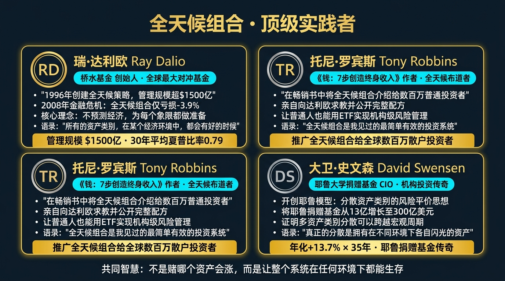
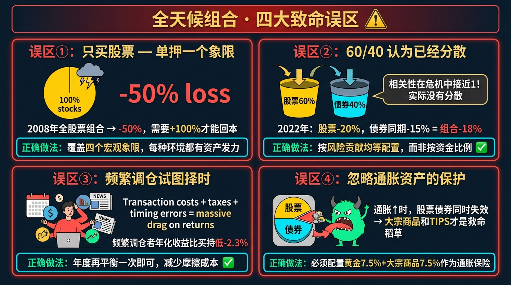

# 股票市场的数学原理 · 第24篇
# 投资组合理论大融合：打造你的全天候财富机器
### The Grand Unification — Building Your All-Weather Wealth Machine

---

> **桥水基金 · 耶鲁捐赠基金 · 全球主权财富基金 抵御宏观周期的终极装配图**
> 
> 🕐 阅读时间：约35分钟 | 📊 难度：⭐⭐⭐⭐⭐ | 🎯 核心收获：将前 23 篇独立且零散的数学模型，像拼接超级跑车零件一样，组装成一台不畏惧牛熊、自动吐出复利的“全天候财富引擎”。

---

## 📖 引言：懂了无数道理，为何依然过不好这一生？

在前面的 23 篇文章中，我们一起攀登了金融数学的一座又一座高峰：
- 我们用**凯利公式**算出了最优仓位，知道了梭哈必死；
- 我们用**马科维茨模型**计算了相关性，懂得了分散化是唯一的免费午餐；
- 我们用**B-S 模型**和**VaR**锚定了期权的价值和账户的极限风险；
- 我们甚至用**行为金融学**剖析了自己大脑中“损失厌恶”的致命缺陷。

但是，现实中无数精通高等数学的极客，或者熟读巴菲特语录的散户，依然在股市中被割得体无完肤。
为什么？
因为**零件再精美，如果随便堆在地上，它只是一堆废铁**。一辆能跑到 300km/h 的超级跑车，不仅需要强悍的 V8 引擎，还需要相匹配的陶瓷刹车片、空气动力学底盘，以及一个不被情绪干扰的冷静赛车手。

这就引出了投资界最宏大、也是最工程化的问题：**理论大融合**。
今天，我们将不再学习任何新的公式。我们要做的，是把前面所有的数学模型，通过一套严密的系统工程学，组装成一台能在通胀、通缩、牛市、熊市中自动运转的**全天候财富机器（All-Weather Machine）**。

---

## 一、起源：达利欧寻找“圣杯”的执念

20 世纪 90 年代初，桥水基金（Bridgewater）的创始人**瑞·达利欧（Ray Dalio）**极度焦虑。
他的基金在过去的几年里赚了很多钱，但他知道自己的判断不可能永远正确。他每天都在思考一个问题：“如果我死了，或者我老糊涂了，有没有一种**纯粹基于资产底层物理属性**的投资组合，能在任何经济环境下都能安稳度过，并留下稳定的复利供我的后代挥霍？”

传统的“60%股票+40%债券”组合根本行不通。因为在 2008 年那样的通缩型股灾中，或者 2022 年那样的恶性通胀中，股债双杀会让这种传统组合瞬间崩溃。

达利欧和他的团队回到了一张白纸前。他们将宏观经济剥离成四个最基础的物理环境：
1. 经济增长高于预期
2. 经济增长低于预期
3. 通货膨胀高于预期
4. 通货膨胀低于预期

他们利用我们在第15篇讲到的“相关性（Correlation）”原理，把股票、长债、抗通胀债券（TIPS）、黄金、大宗商品精准地塞进这四个格子里，并利用“风险平价（Risk Parity）”让每一个格子的风险贡献绝对相等。

1996 年，**全天候策略（All Weather Portfolio）**正式诞生。它在随后的 30 年里证明了：即便你对未来宏观经济毫无预测能力，只要你的“机器构架”在数学上足够稳固，你就能穿越一切惊涛骇浪。

---

## 二、大一统框架：投资组合的四大系统

一台不可摧毁的投资组合机器，并不是一个单一的公式，而是由四层严密咬合的数学齿轮系统构成的。我们将之前的理论完美映射到这台机器中：

| 跑车部件 | 金融学对应模块 | 负责的数学模型（系列回顾） | 核心目标 |
|---------|--------------|-------------------------|---------|
| **🏎️ 底盘系统** | **大类资产配置** | 现代投资组合理论(EP13)，相关性矩阵(EP15) | **降低系统性颠簸**。通过配置股票、国债、黄金等负相关资产，让组合的地盘变得极度宽广稳固。 |
| **🚀 发动机** | **因子与选股策略** | 主动管理定律(EP21)，折现现金流(EP02) | **提供向前的动力**。获取超过大盘均值的 Alpha 超额收益。 |
| **🕹️ 变速箱与刹车** | **仓位与风险控制** | 凯利公式(EP01)，破产风险(EP19)，VaR与回撤(EP16/EP20) | **防止车毁人亡**。在顺风时精准放大仓位，在遇到悬崖时自动锁死刹车。 |
| **🧠 赛车手** | **执行与纪律** | 行为金融学(EP23)，复利与时间(EP04/EP05) | **克服人性弱点**。切断处置效应的干扰，严格按照算法机械调仓。 |

只有当这四个系统完美咬合时，$Return = RiskFree + \beta \times Market + \alpha$ 的大一统方程才能在现实中兑现。

---

## 三、四大类比：彻底理解大融合的直觉

### 类比一：交响乐团的指挥（马科维茨的资产配置）
如果一个交响乐团里全是小提琴手（全是高科技股票），不管他们拉得再好，声音也是刺耳且单调的。
完美的交响乐团需要小提琴（股票负责进攻）、大提琴（国债负责防守）、定音鼓（黄金负责抗通胀节奏）。他们发出的声音是“负相关”的，但融合在一起，就是无比浑厚平滑的天籁之音。

### 类比二：木桶效应与破洞（VaR与最大回撤）
你的投资组合是一个大木桶，复利是注入桶里的水。
发动机（选股能力）决定了进水的速度有多快。但是，只要木桶最底部有一条叫做“最大回撤”的裂缝（没有止损机制导致跌去 80%），无论你进水有多快，水都会漏光。堵住底部的漏洞，永远比加大水龙头更重要。

### 类比三：航空母舰的水密舱（分散化与破产风险）
为什么二战时的泰坦尼克号会沉，而现代航空母舰极难被击沉？
因为航母内部被分割成了上百个互不相通的**水密舱**。一枚鱼雷击中（某只股票退市清零），只会让一个水密舱进水，整体浮力（总资金池）不会受到致命影响。这就是“凯利公式 N 份仓位拆分”在物理学上的终极映射。

### 类比四：奥德修斯绑在桅杆上（行为金融学防御）
希腊神话中，奥德修斯知道海妖的歌声会让人精神错乱（股市的恐慌与贪婪），所以他在听到歌声前，就让水手把自己死死绑在桅杆上（算法全自动交易与强制纪律），并用蜡堵住水手们的耳朵。承认自己是个软弱的人类，并提前用程序锁定自己，这是最高级的智慧。

---

## 四、实战全流程：手把手组装 100 万全天候财富机器

为了把理论化为实战，假设我们现在有 100 万现金，我们如何用之前的数学模型，从零开始搭建这台机器？

### 🎬 步骤 1：构建底盘（战略资产配置 / EP13, EP15）
不预测明天涨跌，直接按宏观经济的四个象限铺开火力网：
- **经济繁荣期引擎**：配置 **30%** 全球股票型 ETF（沪深300 + 标普500），享受人类经济增长的绝对红利。
- **经济衰退期护盾**：配置 **40%** 中长期国债 ETF，当股市暴跌、央行降息救市时，债券暴涨对冲风险。
- **恶性通胀期避雷针**：配置 **15%** 大宗商品/能源/黄金 ETF，防止印钞导致纸币购买力缩水。
- **危机黑天鹅减震器**：留 **15%** 现金或短期货币基金，在别人爆仓崩盘时，提供绝境抄底的子弹。

### 💻 步骤 2：安装刹车系统（风险价值与回撤限制 / EP16, EP20）
对这个底盘进行历史压力测试（Monte Carlo Simulation，EP18）：
- 我们测算出该组合在 2008 年金融海啸中的最大回撤（MDD）仅为 **-12%**。
- 日均 95% VaR 极低。
- 设定强制断路器：任何单一股票或高风险资产亏损达到其自身本金的 20% 时，直接熔断卖出。

### 📊 步骤 3：点燃发动机（战术偏离与Alpha因子 / EP21）
在 30% 的股票仓位中，我们不全买被动指数。我们拿出其中的一小部分，植入主动管理模型：
- 利用 $IR = IC \times \sqrt{BR}$ 的降维打击。我们通过量化程序，扫描 3000 只股票中的“低估值+高动量”标的。
- 我们不压注单一妖股，而是同时买入 50 只符合特征的股票（扩大预测宽度 BR），从而在股票这个板块内部获得超额收益。

### 🔄 步骤 4：闭环自动驾驶（动态再平衡 / EP04）
设定一个每年执行一次的傻瓜式指令：**动态再平衡（Rebalancing）**。
- 假设一年后，股票暴涨，占比从 30% 变成了 45%；债券大跌，占比缩水到 30%。
- 算法强制启动：**卖出 15% 盈利的股票，买入跌出性价比的债券**。强行把比例恢复到最初的 30% / 40%。
- 这个极其反人性的动作，在数学上完美契合了“高抛低吸”的真理，并自动抵消了人类“追涨杀跌”的恶习（EP23）。

---

## 五、著名使用者：华尔街的顶级印钞厂

### 🏦 耶鲁大学捐赠基金（Yale Endowment Model）
- **核心架构师**：大卫·斯文森（David Swensen）
- **数学理念融合**：斯文森极度信仰马科维茨的投资组合理论。他将基金彻底从传统的股债中解放出来，引入了极低相关性的私募股权（PE）、对冲基金、森林和房地产（流动性溢价与分散化）。
- **恐怖战绩**：从 1985 年到 2021 年，资金规模从 13 亿美元滚到了 423 亿美元，年化收益率超过 13%。他依靠纯粹的“弱相关性大类资产组合”，穿越了互联网泡沫和次贷危机，成为全球机构投资者的教科书。

### 🌐 桥水全天候基金（All Weather Fund）
- **数学理念融合**：瑞·达利欧将风险平价（Risk Parity）发挥到极致。传统的 60/40 组合，由于股票的波动率是债券的 3 倍，实际风险有 90% 都集中在股票上。桥水通过给低波动的国债加上无风险杠杆（EP22的金融工程应用），让股、债、大宗商品的**风险波动贡献率完全相等（各占 33%）**。
- **降维战绩**：在 2008 年标普 500 指数狂泄 -38% 的绝望之年，全天候策略仅仅微跌了 **-3.9%**，证明了数学系统免疫宏观灾难的绝对威力。

---

## 六、长期表现：为什么组合理论能笑到最后？

散户最喜欢问的问题是：“如果我用你的全天候组合，牛市的时候我跑不赢全仓买科技股的人啊！”

数学会用长周期的数据回答这个问题：**短期看爆发力，长期看生还率**。

| 历史时期 | 100% 满仓标普 500 (单极化赌徒) | 股/债/金 全天候组合 (系统架构师) | 真实资金命运对比 |
|---------|------------------------------|-------------------------------|----------------|
| **1995-1999 (互联网大牛市)** | **暴涨 +250%** | 稳步上涨 +120% | 散户嘲笑机构收益太低，像个蠢货。 |
| **2000-2002 (互联网泡沫破裂)** | **暴跌 -49%** | 微涨 +5% | 散户利润全部回吐，本金腰斩。机器毫发无损。 |
| **2008 (次贷危机黑色海啸)** | **崩盘 -38%** | **微跌 -3.9%** | 散户在谷底绝望割肉，退出市场。组合迎来了遍地带血的廉价筹码。 |
| **2000-2020 (二十年超长跑)** | 年化 6.1%，中途多次吓出心脏病 | **年化 7.8%，几乎没有回撤阵痛** | **机器组合的终极复利，彻底碾压了全仓股票的散户！** |

**核心结论**：在任何单一年份，全天候组合都无法拿冠军。但只要把时间拉长到 10 年以上，它必定稳居前 10%。在复利的世界里，只要不死，剩者为王。

---

## 七、六大实战使用场景

1. **傻瓜式养老金定投**：对于不懂股票的普通人，完全放弃选股。每个月定投 50% 沪深300 ETF + 50% 黄金 ETF，利用资产极低的负相关性，享受经济发展与货币增发的双重红利。
2. **抵抗中产阶级阶层跌落**：当财富积累到 500 万以上时，防守的意义远大于进攻。切断高杠杆创业和全仓单一股票的念头，转为基于马科维茨有效边界的全天候资产配置。
3. **打破“一卖就涨，一买就跌”的魔咒**：通过每年/每半年的强制动态再平衡（Rebalancing），强迫自己在资产高估时卖出，低估时买入。彻底戒断看盘焦虑。
4. **家庭资产负债表对冲**：如果你在房地产行业工作，你的工资收入已经和房地产高度绑定。你的投资组合中必须彻底剔除地产股，并超配其他科技或防守型资产，以对冲你的人力资本风险。
5. **为黑天鹅提前买单**：在组合中永久保留 2% 的资金，不断买入远期深度虚值看跌期权（EP17塔勒布的哑铃策略）。平时当做买保险消耗掉，一旦爆发全球危机，这 2% 将爆发出 100 倍的收益拯救全局。
6. **加密货币玩家的降维风控**：将凯利公式的绝对分仓（绝不梭哈）与 VaR 极值管控应用到高波动的币圈。即使遇到归零的空气币，整体账户也能安然无恙。

---

## 八、常见错误与误区：散户拼装车的灾难

掌握了理论，不代表你能装好一辆车。很多人拼出来的，是随时会解体的科学怪人（Frankenstein）：

| # | 致命错误认知 | 核心症状 | 毁灭性后果 | 正确的数学认知 |
|---|------------|---------|------------|-------------|
| 1 | **虚假的“大杂烩”组合** | 买了 10 只白酒股、5 只医药股、3 只科技股，觉得自己“充分分散”了。 | 股灾一来，所有股票同时跌停。相关性 ρ 趋近于 1，假分散导致真爆仓。 | **跨越底层资产阶级（股、债、商、外汇）的配置，才是真正的低相关性组合。** |
| 2 | **一成不变的刻舟求剑** | 10年前设定的 60/40 股债组合，此后再也没看管过。 | 股票翻倍后占比达到 80%，组合的风险敞口在不知不觉中彻底畸变。 | 必须像给车做保养一样，**每年执行一次严格的资产再平衡（Rebalancing）。** |
| 3 | **追求每个零件都必须赚钱** | 组合里的黄金连续跌了 2 年，受不了直接把黄金砍掉，全换成最近暴涨的科技股。 | 砍掉了救生圈去买发动机。等下一次船沉的时候，全家淹死。 | 好的组合里，**必然随时有一种资产是在亏钱的！** 那是你在为防范未知风险支付保费。 |
| 4 | **小资金搞过度配置** | 只有 1 万块钱，还要学桥水基金分成 10 份去买国债和黄金。 | 交易手续费超过了分散带来的收益。资金太小根本无法产生有意义的绝对回报。 | 小资金（<10万）的重心在于提高劳动收入本金；大资金才需要启动全天候防守机制。 |

---

## 九、局限性（诚实的评估）

哪怕是达利欧的全天候组合，在某些极端的数学奇点下，也会显露出局限性：

| 局限性 | 具体表现 | 改进方案 |
|-------|---------|---------|
| **相关性的历史背叛** | 模型严重依赖历史相关性（比如过去股跌债涨）。但在 2022 年恶性通胀+美联储疯狂加息时，股债出现百年罕见的“正相关双杀”。底盘瞬间失效。 | 必须引入真正具有防暴毙属性的非线性对冲工具（如 VIX 波动率产品或趋势跟踪 CTA）作为终极底线防御。 |
| **资金利用率的拖累（现金拖累）** | 为了防守，组合里被迫配置了大量低收益的国债和黄金。在超级狂暴的大牛市中，绝对收益率会被全仓股票的人拉开巨大的差距。 | 只要你的卡尔玛比率（收益回撤比）足够高，你可以通过借贷加上无风险的低息杠杆，将整体收益率曲线强行整体抬高。 |

---

## 十、实战SOP：4步打造你的财富永动机

如果你想退出赌徒的疯狂游戏，成为一名财富系统的工程师，请立即执行以下装配图：

**Step 1：确定你的核心资源（本金与久期）**
用 EP05 的贴现公式问自己：这笔钱我能放多久不用？如果是 1 年，全买货币基金；如果是 10 年不用的闲钱，才具备组装全天候机器的时间资格。

**Step 2：构建底层资产配比表（Asset Allocation）**
打开券商软件，设定最基础的大脑中枢神经：
- 40% 宽基 ETF（买下国运增长）
- 40% 中长期国债 ETF（提供安全垫与流动性）
- 20% 黄金 ETF / 资源类 ETF（防范恶性通胀与货币贬值）

**Step 3：设定算法止损与红线（VaR Circuit Breakers）**
写下死亡契约：无论任何情况，一旦账户总净值从最高点回撤达 15%，必须强制切断所有高风险仓位。不听任何股评家分析，只相信冰冷的净值数字。

**Step 4：日历警报——机械式再平衡（Rebalancing）**
在手机日历里设定每年的 12 月 31 日下午 2 点，闹钟响起。登录账户，花 10 分钟时间，将偏离目标的资产强制拉回 40/40/20 的初始比例。然后关掉软件，安然入睡 365 天。

---

## 十一、本篇总结

投资的终极形态，不再是寻找下一个能翻十倍的“牛股”，而是通过极其严密的数学拼图，构建一座在任何气候下都不会倒塌的城堡。

| 升级前的思维（单兵作战的散户） | 升级后的思维（系统工程架构师） |
|-------------------------------|-------------------------------|
| 我需要一个100%准确的神奇指标 | **我知道没有任何指标是完美的，所以我用不相关的资产搭建对冲体系** |
| 我每天盯着K线，试图预测明天是涨是跌 | **我根本不关心明天谁涨谁跌，我的四宫格机器在牛熊市里都能吸纳复利** |
| 在牛市里狂傲无比，在熊市里绝望咒骂 | **享受平庸但极致稳定的曲线，在市场疯癫时执行再平衡，剥夺情绪干预权** |
| 把几十万身家全部梭哈在一只股票上 | **把资金分发在概率期望为正、底盘开阔的多个水密舱中，永不翻船** |

最终，你需要把这句话刻在你的财富机器铭牌上：

$$\boxed{\text{不要试图去做最聪明的预言家，要去做最稳固的系统工程师。}}$$

至此，关于《股票市场的数学原理》的所有硬核理论、公式拆解与实战机器搭建，我们已经全部完成。
你从一个相信运气与直觉的普通人，变成了一个手握凯利公式、脚踩有效边界、眼中透视着期权波动率、大脑免疫了行为学偏差的**概率计算大师**。

但是，所有的数学公式，最终都要回归到一个最本源的问题。
数字的尽头，究竟是什么？我们在市场上交易的，仅仅是钱吗？

下一篇，我们将迎来本系列的**最终大结局**——**《终章：数学的尽头是哲学，概率的尽头是人生》**。让我们站在群星璀璨的数学先贤肩膀上，俯瞰整个市场的喧嚣，完成从“交易员”到“人生概率大师”的最后一次灵魂升华。

## 🔗 完整系列导航

点击展开查看全系列 25 篇文章目录

### 🧱 第一模块：地基篇 — 概率与期望思维
- [第01篇：凯利公式_仓位管理的黄金法则](./第01篇_凯利公式_仓位管理的黄金法则.md)
- [第02篇：期望值理论_所有决策的基石](./第02篇_期望值理论_所有决策的基石.md)
- [第03篇：大数定律_时间是你最好的朋友](./第03篇_大数定律_时间是你最好的朋友.md)
- [第04篇：中心极限定理_分散投资的数学证明](./第04篇_中心极限定理_分散投资的数学证明.md)
- [第05篇：复利定律_财富的雪球效应](./第05篇_复利定律_财富的雪球效应.md)

### 🔭 第二模块：选机会篇 — 识别高概率交易
- [第06篇：均值回归_市场的钟摆定律](./第06篇_均值回归_市场的钟摆定律.md)
- [第07篇：动量效应_顺势而为的数学依据](./第07篇_动量效应_顺势而为的数学依据.md)
- [第08篇：贝叶斯推断_实时更新你的判断](./第08篇_贝叶斯推断_实时更新你的判断.md)
- [第09篇：安全边际_价值投资的概率护城河](./第09篇_安全边际_价值投资的概率护城河.md)
- [第10篇：因子投资_系统性超越市场的秘密](./第10篇_因子投资_系统性超越市场的秘密.md)

### ⚖️ 第三模块：配置篇 — 资产组合与仓位管理
- [第11篇：现代投资组合理论_有效前沿的边界](./第11篇_现代投资组合理论_有效前沿的边界.md)
- [第12篇：夏普比率_策略质量的标准尺](./第12篇_夏普比率_策略质量的标准尺.md)
- [第13篇：风险平价策略_穿越经济周期的秘密](./第13篇_风险平价策略_穿越经济周期的秘密.md)
- [第14篇：最优仓位管理_Optimal-f_凯利公式的工程级进化](./第14篇_最优仓位管理_Optimal-f_凯利公式的工程级进化.md)
- [第15篇：相关性与分散化_降低风险的数学奥秘](./第15篇_相关性与分散化_降低风险的数学奥秘.md)

### 🛡️ 第四模块：风控篇 — 极端状态下的生死局
- [第16篇：VaR风险价值_如何量化你能承受的最大亏损](./第16篇_VaR风险价值_如何量化你能承受的最大亏损.md)
- [第17篇：黑天鹅事件_极端风险的数学本质](./第17篇_黑天鹅事件_极端风险的数学本质.md)
- [第18篇：蒙特卡洛模拟_用随机数预测未来](./第18篇_蒙特卡洛模拟_用随机数预测未来.md)
- [第19篇：破产风险_赌徒破产问题与资金管理](./第19篇_破产风险_赌徒破产问题与资金管理.md)
- [第20篇：最大回撤与资金恢复时间_衡量策略韧性](./第20篇_最大回撤与资金恢复时间_衡量策略韧性.md)

### 🔬 第五模块：量化进阶篇 — 升华与融合
- [第21篇：主动管理定律_信息比率与预测宽度的乘积](./第21篇_主动管理定律_信息比率与预测宽度的乘积.md)
- [第22篇：B-S期权定价模型_金融工程的皇冠](./第22篇_B-S期权定价模型_金融工程的皇冠.md)
- [第23篇：行为金融学数学化_前景理论与损失厌恶](./第23篇_行为金融学数学化_前景理论与损失厌恶.md)
- [第24篇：投资组合理论大融合_打造你的全天候财富机器](./第24篇_投资组合理论大融合_打造你的全天候财富机器.md)
- [第25篇：终章_数学的尽头是哲学_概率的尽头是人生](./第25篇_终章_数学的尽头是哲学_概率的尽头是人生.md)

---
**← 上一篇：[行为金融学数学化](./第23篇_行为金融学数学化_前景理论与损失厌恶.md)** | **→ 下一篇：[终章](./第25篇_终章_数学的尽头是哲学_概率的尽头是人生.md)**

---
*《股票市场的数学原理》全系列 · 第24篇*
