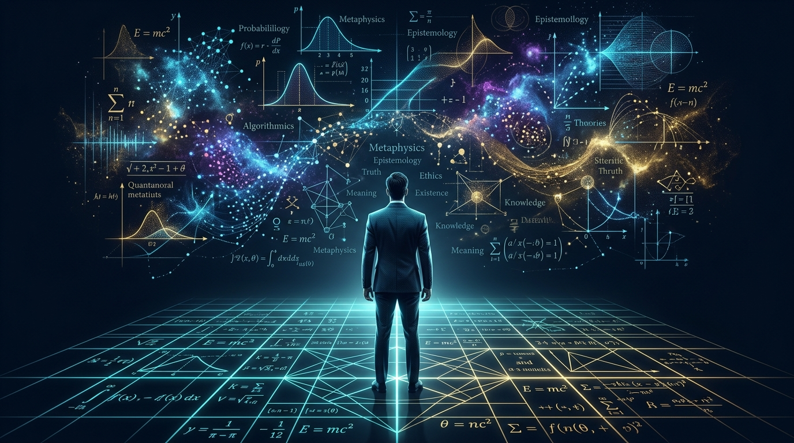
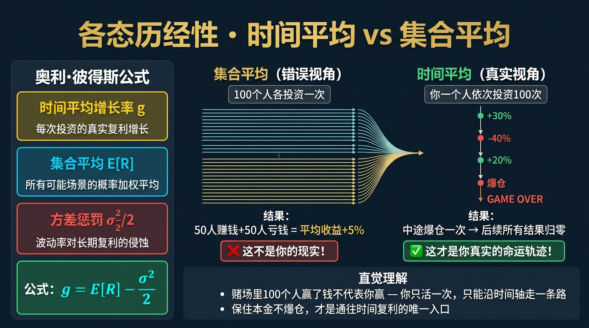
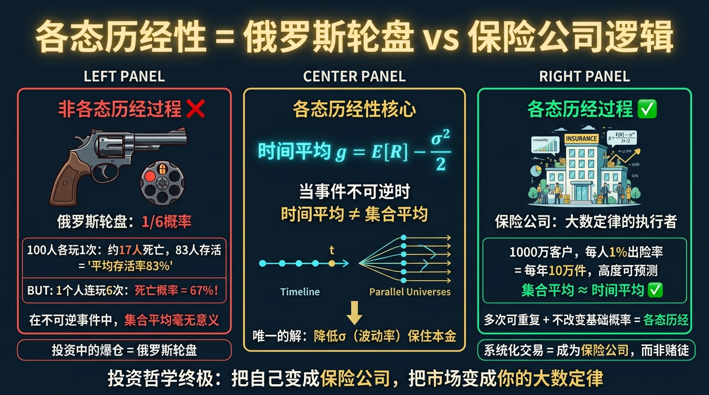
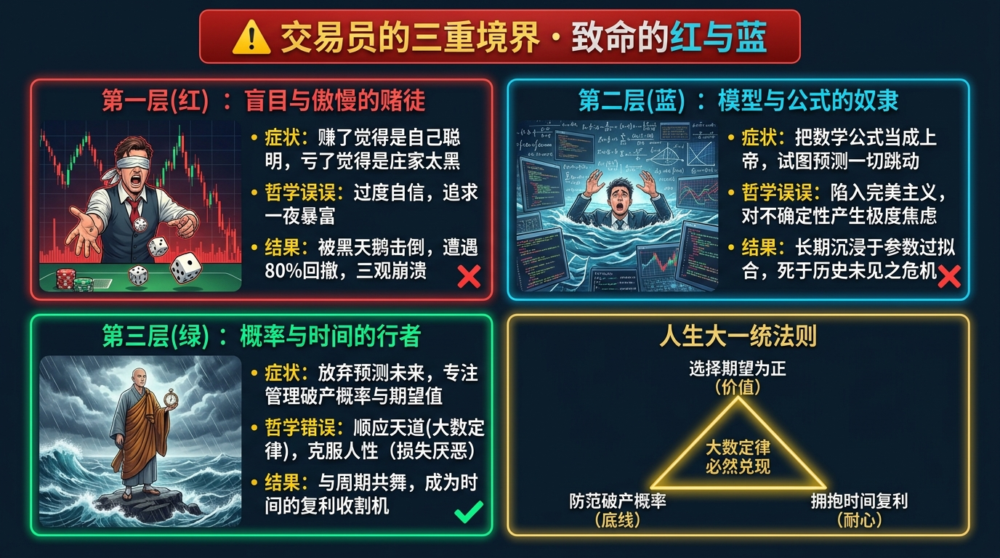
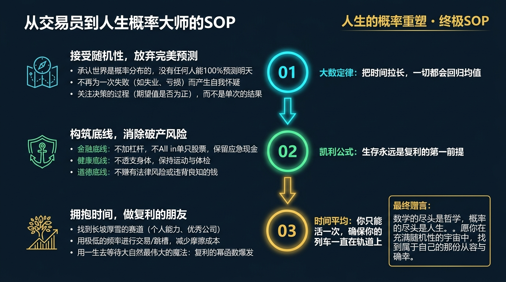

# 股票市场的数学原理 · 第25篇（大结局）
# 终章：数学的尽头是哲学，概率的尽头是人生
### The Finale — When Mathematics Ascends to Philosophy, and Probability Becomes Life

---

> **给所有凝视过深渊、经历过暴利、感受过绝望、并最终决定用理性重塑命运的交易者**
> 
> 🕐 阅读时间：约35分钟 | 📊 难度：⭐⭐⭐⭐⭐ | 🎯 核心收获：将 24 篇硬核的金融数学公式，全部升华为一套能够指导你择业、婚姻、健康与生死的人生操作系统。

---

## 📖 引言：为什么最伟大的交易员，晚年都变成了哲学家？

在华尔街，如果你和一个入行只有三年的年轻交易员聊天，他会跟你滔滔不绝地讲 K线、MACD 甚至复杂的 Python 算法。
但如果你去采访那些在市场上活了 40 年以上、掌管着千亿资金的传奇巨星——比如查理·芒格、瑞·达利欧、霍华德·马克斯，或者是量化之王詹姆斯·西蒙斯。你会发现一个极其诡异的现象：
**他们几乎从来不谈具体的数学公式，也不谈明天的股票涨跌。他们嘴里说出的，全都是极其质朴的哲学、历史周期，甚至是老子《道德经》里的“反者道之动”。**

是他们老糊涂了吗？还是数学公式没用了？
都不是。是因为当一个人在金融市场这个最高浓缩的实验室里，把**概率、复利、波动和破产风险**推演到极致后，他会突然间顿悟：

**股票市场并不是一个赌场，而是一面完美映照出人类无知与贪婪的镜子。**
数学公式也不是用来预测明天的工具，而是用来丈量“人类能力的边界在哪里”的无情铁尺。

当你真正参透了市场的数学原理，你不仅仅学会了如何赚钱。你实际上获得了一套可以用来重新过好这一生的高维操作系统。
今天，在《股票市场的数学原理》的最后一篇，我们将放下所有的 K 线图，把这 24 个冷酷的数学公式，彻底升华为人生的哲学。

---

## 一、起源：从帕斯卡的赌局到命运的罗盘

在系列的最开始，我们讲过 1654 年那个被大雨困在旅馆里的法国天才——布莱斯·帕斯卡（Blaise Pascal）。
他发明概率论的初衷，是为了解决赌徒“掷骰子”的分钱问题。但当他晚年病重，凝视着宇宙的虚空时，他写下了人类哲学史上最著名的一个数学推论——**帕斯卡的赌注（Pascal's Wager）**。

帕斯卡问自己：“我到底该不该相信上帝的存在？”
他没有用神学来回答，而是用他自己发明的**数学期望公式（Expected Value）**来算了一笔账：
- 如果我相信上帝，且上帝存在，我的收益是无限大（升入天堂）。
- 如果我相信上帝，但上帝不存在，我的损失是极其微小的（浪费了一些祈祷的时间）。
- 如果我不信上帝，且上帝不存在，我的收益是微小的（省了一点时间）。
- 如果我不信上帝，但上帝竟然存在，我的损失是无限大（下地狱受苦）。

因此，帕斯卡的数学结论是：**即便上帝存在的概率只有 0.0001%，由于错误选择的代价（无限大的破产风险）极其惨重，一个绝对理性的数学家，也必须选择相信。**

这听起来很荒谬，但这正是金融数学走向哲学的第一步：
**顶级智慧从不追求绝对的真理，只追求在不确定性中，如何做出期望值为正、且绝对不会破产的选择。**

---

## 二、核心公式：命运的大一统方程

如果必须要把我们学过的 24 篇内容浓缩成一个决定你命运的“大一统方程”，它不是一个单一的符号，而是一个三维的齿轮组：

$$\boxed{\text{Life Outcome} = \left( \sum_{i=1}^{n} (P_i \times V_i) \right) \times \left(1 - P_{\text{ruin}}\right) \times (1+r)^t }$$

这三个部分，对应着人生的三大终极修炼：

| 数学符号 | 金融学名字 | 人生哲学映射 |
|---------|-----------|-------------|
| **$\sum (P_i \times V_i)$** | **数学期望（Expected Value）** | **【价值观与选择】** 不要因为一件事成功率很高就去做它，要算“成功率 × 成功的回报”。哪怕一件事成功率只有 10%，但只要一旦成功就能改变世界（比如创业），它的数学期望就是正的。**你必须终生只做数学期望为正的事情。** |
| **$(1 - P_{\text{ruin}})$** | **破产概率的补集（Survival Rate）** | **【底线与生死】** 根据凯利公式和最大回撤理论，只要 $P_{\text{ruin}}$（你破产或死亡的概率）变成 100%，前面所有的期望值全部归零。**在人生中，绝对不要去尝试任何收益很高、但有一丝可能让你身败名裂或丧失生命的“俄罗斯轮盘赌”。** |
| **$(1+r)^t$** | **复利与时间（Compounding）** | **【耐心与延迟满足】** 在时间 $t$ 面前，任何高超的技巧 $r$ 都显得苍白无力。无论你积累的是财富、人脉还是知识，只要你不被打断（不发生回撤），大自然会让微小的优势在 30 年后爆发出核弹级别的威力。 |

---

## 三、四大类比：彻底打通市场与人生的直觉

### 类比一：大数定律与人生的运气
很多人抱怨自己运气不好。在单次抛硬币（短期）中，运气占 99% 的成分；但在 10,000 次抛硬币（长期）中，大数定律会像黑洞一样把运气吞噬，只剩下你真正的“胜率”和“赔率”。
**人生哲学**：一次创业失败、一次考试失利，只是因为样本量太小，被随机波动（噪音）击中了。你要做的不是放弃，而是拍拍灰尘，继续去抛掷那一枚胜率高达 55% 的硬币。**把时间拉长，你必定是赢家。**

### 类比二：波动率与生活的苦难
在期权的 B-S 模型中，波动率（$\sigma$）越大，期权越昂贵。因为没有剧烈的下探，就没有暴涨的势能。
**人生哲学**：平庸的人追求“一条直线向上”的安稳人生，这叫低波动率，这种人生毫无弹性，抗风险能力极差（塔勒布的脆弱性）。真正的强者拥抱人生的高低起伏（极高的波动率）。每一次陷入低谷（深度回撤），都是在为你积攒一次跃迁的势能。**苦难，就是你人生期权的时间价值。**

### 类比三：马科维茨与多面人生（分散化）
如果你把 100% 的资金全买了一只股票，这只股票退市，你就跳楼了。
**人生哲学**：如果你把你人生的 100% 全部寄托在一个事物上——比如全部的意义在于一家随时可能裁员的公司，或者一个随时可能背叛的恋人。一旦该资产暴雷，你的人生意义就会面临 100% 的最大回撤。**健康的人生，必须在事业、家庭、爱好、健康之间建立极低相关性（$\rho < 0$）的投资组合。** 这样，哪怕事业遭遇毁灭性打击，家庭和健康的防火墙依然能支撑你活下去。

### 类比四：行为金融学与人类基因
我们证明了“亏损的痛苦是盈利的 2.25 倍”。
**人生哲学**：我们的大脑是 10 万年前在非洲大草原上进化出来的。它只适合用来躲避狮子（对坏消息极度敏感），根本不适合在现代社会进行长远规划。当你因为一点小挫折就想暴怒放弃时，告诉自己：“这不是我，这只是我大脑皮层里的杏仁核在释放无知的激素。我要用大脑前额叶的理性算法覆盖它。”

---

## 四、实战全流程：一个交易员的三重境界

每一个成功活到老年的交易员，他的灵魂必然经历过三次撕裂与重塑。这也是每一个普通人走向成熟的必经之路：

### 🩸 第一层（红）：盲目与傲慢的赌徒（Ignorance）
- **状态**：刚进入市场，觉得只要努力看盘、天天打听消息就能赚钱。赚了钱觉得是自己聪明，亏了钱觉得是庄家太黑。
- **人生的对应**：初入社会的年轻人。过度自信（Overconfidence），认为命运完全掌握在自己手中，追求一夜暴富，随时准备“加满杠杆梭哈”。
- **结局**：被市场或社会的“黑天鹅”一记重拳打倒，遭遇 80% 级别的人生最大回撤，面临三观崩溃。

### 💧 第二层（蓝）：模型与公式的奴隶（Mechanic）
- **状态**：经历了破产后，开始疯狂学习。学完了凯利公式、B-S模型、多因子策略。把数学公式当成无所不能的上帝。认为只要代码写得好，就能完全预测市场的每一次跳动。
- **人生的对应**：陷入完美主义的中年人。试图把生活安排得滴水不漏，算计每一分得失。
- **结局**：遇到 2008 年那种连诺奖得主（LTCM）都能毁灭的超级非线性危机。发现数学公式在极度恐慌的碳基生物面前也会彻底失效。

### 🌟 第三层（金）：敬畏未知的概率大师（Mastery）
- **状态**：完全接纳了“不可预测性”。他依然使用数学公式，但他不再试图用公式去预测明天，而是用公式来**“划定自己的底线”**。他不追求暴利，他只在概率对自己有利时下注，然后安静地等待。
- **人生的对应**：智者。知天命尽人事。深知尽最大的努力，做最坏的打算。不以物喜，不以己悲。
- **结局**：他在不知不觉中，被复利的时间列车送到了财富与宁静的顶峰。

---

## 五、著名使用者：他们留在世间的最后箴言

如果我们翻开本系列中出现过的所有量化大师的自传，你会发现他们在人生最后阶段，留下的都是最质朴的哲学忠告：

- **爱德华·索普（Edward Thorp / 算牌法与凯利公式的引入者）**
  他在自传《战胜一切市场的人》的结尾没有写任何数学公式，而是写道：“我看到过太多华尔街的人，为了赚到第 10 个亿，而把之前的 9 个亿全部压上，最终身败名裂。他们不懂什么是适可而止。**数学的最高境界，是告诉你什么时候该离桌。**”
- **詹姆斯·西蒙斯（Jim Simons / 大奖章基金创始人）**
  这位世界级的数学家，在接受采访时总结自己的成功秘诀：“第一，与极度优秀的人合作；第二，永远不要相信你能够完美预测未来；第三，**让算法去工作，不要让情绪干扰算法**。”
- **查理·芒格（Charlie Munger / 复利与反向思考大师）**
  “如果我知道我会在哪里死去，我就永远不去那个地方。”这就是风险价值（VaR）和避免吸收壁（Absorbing Barrier）的最高级白话翻译。芒格一生追求的不是聪明，而是“避免愚蠢”。

---

## 六、长期表现：为什么剩者为王？

让我们最后看一组横跨百年、无比冷酷的统计数据。

在 1920 年到 2020 年的 100 年里，美国股市只有 **4%** 的公司，创造了市场上 **100%** 的净财富创造（Net Wealth Creation）。剩下的 96% 的公司，绝大多数都退市归零了，它们存在的唯一意义就是给市场提供流动性。
同样，在期货和期权市场里，**95% 的散户在开户的前 3 年内就会遭遇爆仓并永远离开市场。**

在如此残酷的淘汰率面前，你凭什么活下来？
如果你靠的是天赋和聪明，世界上总有比你更聪明的人；如果你靠的是运气，时间拉长到 30 年，运气会完全回归均值。

**唯一能在 100 年的维度里活下来的物种，是那些把“纪律、风控、对大数定律的绝对信仰”刻进 DNA 里的量化机器。**
这就如同达尔文的进化论：在千万年的地球环境剧变中生存下来的，绝不是最强壮的恐龙，也不是最聪明的动物，而是对环境变化最具适应力（低相关性对冲）的物种。

---

## 七、六大实战使用场景（概率思维的人生外延）

如果你懂得了金融数学，你处理以下人生难题时，简直是降维打击：

1. **职业规划（寻找高偏度不对称回报）**：不要去做那种“做对了一月拿一万，做错了一次就身败名裂”的脆弱职业。要去寻找塔勒布推崇的职业——下限有保底（有基本工资），但上限无边际（比如写一本书、写一个能被百万次调用的代码、或加入一家期权有望翻百倍的初创公司）。
2. **婚姻伴侣选择（规避最大回撤）**：找伴侣不是选一个“上限有多好”的人（这不是买彩票），而是要看他在暴怒和遇到挫折时“下限有多差”（这是他的最大回撤）。一个上限普通但回撤可控的伴侣，能在 50 年的维度里为你提供最稳固的底盘。
3. **健康管理（复利与微小损耗）**：每天抽一包烟、熬一次夜，看似对你的身体没有任何致命影响（微小的负向 Alpha）。但把这些极小的微负复利放到 20 年的指数函数里，它会百分之百压垮你的心血管系统。
4. **面对重大失败（理解随机漫步）**：当你在工作中被裁员，不要陷入绝望的自我否定。在马尔可夫链和随机游走中，你的价值是一个长期均值。短期的价格（被裁员）只是因为宏观经济的系统性 $\beta$ 暴跌导致的。**不怪你，换个池子继续游。**
5. **人际交往（打造正期望值网络）**：把每一次善意的帮助都当做一次极低成本（低期权费）、但未来可能带来巨大回报（高赔率）的看涨期权。你撒下 100 张这样的期权，99 张都作废了，但只要 1 张在关键时刻行权，它就能拯救你的事业。
6. **终身学习（对抗熵增）**：宇宙的铁律是熵增（混乱度增加）。如果不做任何输入，你的技能和认知会像 Theta 时间损耗一样每天贬值。每天读一页书，就是在用主动的做功，去对抗时间的腐蚀。

---

## 八、常见错误与误区：把模型当做终点的幻觉

在即将结业之际，我们要提出对数学模型本身最后的警告：

| # | 致命错误认知 | 核心症状 | 毁灭性后果 | 正确的哲学认知 |
|---|------------|---------|------------|-------------|
| 1 | **傲慢的确定性** | 认为掌握了这 24 个公式，自己就能像神一样在这个世界里随意提款。 | 放松了对敬畏心的坚守，在某一次交易中加满了 10 倍杠杆，最终跌入深渊。 | **数学不是用来预见未来的水晶球，数学是用来测量我们无知程度的温度计。** |
| 2 | **过度量化生活** | 把谈恋爱、交朋友全都用冰冷的概率矩阵来计算，变成了一个毫无感情的机器人。 | 失去了人生的体验感与意义感。虽然没有犯错，但也失去了色彩。 | 投资需要绝对的机械与冰冷，但**生活需要适度的非理性和感性来创造美。** 留 10% 的仓位给自己去犯错。 |
| 3 | **追求极限峰值** | 每天都在纠结能不能把参数再优化 0.1%，试图做到全球第一的回报率。 | 陷入了过拟合（Overfitting）的死胡同。一遇风吹草动，脆弱的巅峰模型直接崩溃。 | 追求“模糊的正确”远胜于“精确的错误”。追求极度平庸的稳定，你最终将站上巅峰。 |

---

## 九、局限性：数学永远无法治愈死亡

所有的数学模型、量化基金、对冲策略，最终都会面临一个绝对无解的物理极限：**生命的时间边界。**

不管你的凯利公式算得多么精妙，不管你的卡尔玛比率有多高。我们每一个碳基生物的生命，最终都会在一声心电监护仪的长鸣中，迎来 100% 的破产风险和清零操作。
在死亡面前，万亿市值的伯克希尔·哈撒韦，和街边的乞丐，其资产净值最终的归宿都是 0。

数学无法治愈人类对死亡的恐惧。
但这正是我们在有限的生命里，必须学习并运用这些伟大原理的原因：**正因为生命只有一次，且单向流逝不可逆转，我们才更不能把如此宝贵的筹码，浪费在无意义的赌博、愤怒与绝望的错误决策中。**

---

## 十、实战SOP：终身受用的 5 条铁律碑铭

临别之际，请将这五句话，连同它们背后的数学原理，刻在你的视网膜上：

1. **绝对禁止归零（生存第一准则）**
   永远不要押上你的全部。只要你不死在这个牌桌上，大数定律就一定会给你发出一手好牌。
2. **在大概率下重拳出击，在小概率下果断认怂（凯利法则）**
   不要在没有胜算的地方浪费精力。一旦你通过严密的分析确信自己占据了巨大的不对称优势，必须敢于狠狠地下注。
3. **寻找互不相关的救生圈（马科维茨原则）**
   不要把所有的资源和希望绑定在单一的事物上。建立你的备份系统，越是和主业不相关的能力，在危机时越能救你的命。
4. **把时间当作你最伟大的盟友（复利法则）**
   极度克制短期发财的贪欲。用 10 年、20 年的视角去衡量今天的决定。如果一件事 10 年后毫无意义，今天就不要做。
5. **原谅自己的恐惧，但用纪律锁死它（行为金融学防御）**
   承认自己是一个会贪婪、会恐慌的普通人。原谅自己。但在每次操作前，必须让预先写好的“物理纪律（如强制止损线）”接管你的双手。

---

## 十一、全系列总决战：告别的钟声

《股票市场的数学原理》写到这里，一共 25 篇，总计近 10 万字。
我们剥开了华尔街西装革履的伪装，撕下了股评家们天花乱坠的话术，直指这个市场最底层、最冰冷、但也最公平的核心——**由公式和代码构建的物理世界**。

市场是残酷的，它每天都在无情地绞杀那些被贪婪和恐惧蒙蔽双眼的人；
但市场又是仁慈的，它把无尽的复利，像清泉一样，默默地灌注给每一个愿意遵循数学规律、克制自我欲望的信徒。

**数学的尽头是哲学，概率的尽头是人生。**

当你关掉这篇长文，走到窗前，看着外面熙熙攘攘的街道和闪烁的霓虹灯时。
希望你能看到一个完全不同的世界——
那里不再有无缘无故的幸运与倒霉，而是布满了正态分布的钟形曲线；
那里不再有焦虑与狂躁，而是充满了均值回归的宁静与从容。

愿你带着这 25 把用数学打造的钥匙，推开属于你自己的那扇全天候的财富大门。
**在这个充满随机漫步的世界里，愿大数定律，永远站在你这边。**

---
- **← 上一篇：[第24篇 - 投资组合理论大融合](./第24篇_投资组合理论大融合_打造你的全天候财富机器.md)** | 
  **🏠 返回首页：[《股票市场的数学原理》主目录](../README.md)**

---
*《股票市场的数学原理》全系列 · 第25篇 · 大结局*  
*感谢您一路的陪伴与阅读。愿理性的光辉永远照耀您的投资与人生。*

## 🔗 完整系列导航

点击展开查看全系列 25 篇文章目录

### 🧱 第一模块：地基篇 — 概率与期望思维
- [第01篇：凯利公式_仓位管理的黄金法则](./第01篇_凯利公式_仓位管理的黄金法则.md)
- [第02篇：期望值理论_所有决策的基石](./第02篇_期望值理论_所有决策的基石.md)
- [第03篇：大数定律_时间是你最好的朋友](./第03篇_大数定律_时间是你最好的朋友.md)
- [第04篇：中心极限定理_分散投资的数学证明](./第04篇_中心极限定理_分散投资的数学证明.md)
- [第05篇：复利定律_财富的雪球效应](./第05篇_复利定律_财富的雪球效应.md)

### 🔭 第二模块：选机会篇 — 识别高概率交易
- [第06篇：均值回归_市场的钟摆定律](./第06篇_均值回归_市场的钟摆定律.md)
- [第07篇：动量效应_顺势而为的数学依据](./第07篇_动量效应_顺势而为的数学依据.md)
- [第08篇：贝叶斯推断_实时更新你的判断](./第08篇_贝叶斯推断_实时更新你的判断.md)
- [第09篇：安全边际_价值投资的概率护城河](./第09篇_安全边际_价值投资的概率护城河.md)
- [第10篇：因子投资_系统性超越市场的秘密](./第10篇_因子投资_系统性超越市场的秘密.md)

### ⚖️ 第三模块：配置篇 — 资产组合与仓位管理
- [第11篇：现代投资组合理论_有效前沿的边界](./第11篇_现代投资组合理论_有效前沿的边界.md)
- [第12篇：夏普比率_策略质量的标准尺](./第12篇_夏普比率_策略质量的标准尺.md)
- [第13篇：风险平价策略_穿越经济周期的秘密](./第13篇_风险平价策略_穿越经济周期的秘密.md)
- [第14篇：最优仓位管理_Optimal-f_凯利公式的工程级进化](./第14篇_最优仓位管理_Optimal-f_凯利公式的工程级进化.md)
- [第15篇：相关性与分散化_降低风险的数学奥秘](./第15篇_相关性与分散化_降低风险的数学奥秘.md)

### 🛡️ 第四模块：风控篇 — 极端状态下的生死局
- [第16篇：VaR风险价值_如何量化你能承受的最大亏损](./第16篇_VaR风险价值_如何量化你能承受的最大亏损.md)
- [第17篇：黑天鹅事件_极端风险的数学本质](./第17篇_黑天鹅事件_极端风险的数学本质.md)
- [第18篇：蒙特卡洛模拟_用随机数预测未来](./第18篇_蒙特卡洛模拟_用随机数预测未来.md)
- [第19篇：破产风险_赌徒破产问题与资金管理](./第19篇_破产风险_赌徒破产问题与资金管理.md)
- [第20篇：最大回撤与资金恢复时间_衡量策略韧性](./第20篇_最大回撤与资金恢复时间_衡量策略韧性.md)

### 🔬 第五模块：量化进阶篇 — 升华与融合
- [第21篇：主动管理定律_信息比率与预测宽度的乘积](./第21篇_主动管理定律_信息比率与预测宽度的乘积.md)
- [第22篇：B-S期权定价模型_金融工程的皇冠](./第22篇_B-S期权定价模型_金融工程的皇冠.md)
- [第23篇：行为金融学数学化_前景理论与损失厌恶](./第23篇_行为金融学数学化_前景理论与损失厌恶.md)
- [第24篇：投资组合理论大融合_打造你的全天候财富机器](./第24篇_投资组合理论大融合_打造你的全天候财富机器.md)
- [第25篇：终章_数学的尽头是哲学_概率的尽头是人生](./第25篇_终章_数学的尽头是哲学_概率的尽头是人生.md)

---
**← 上一篇：[投资组合理论大融合](./第24篇_投资组合理论大融合_打造你的全天候财富机器.md)**

---
*《股票市场的数学原理》全系列 · 第25篇*
